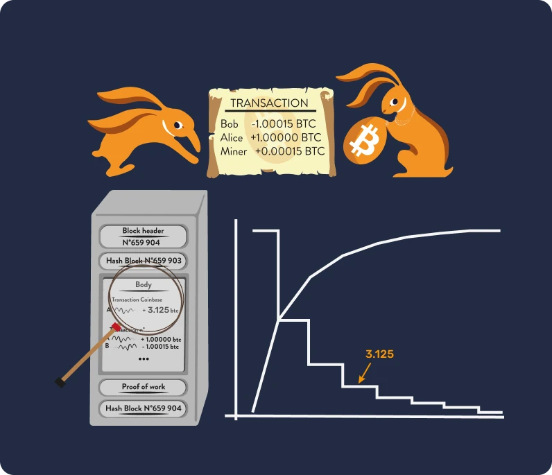
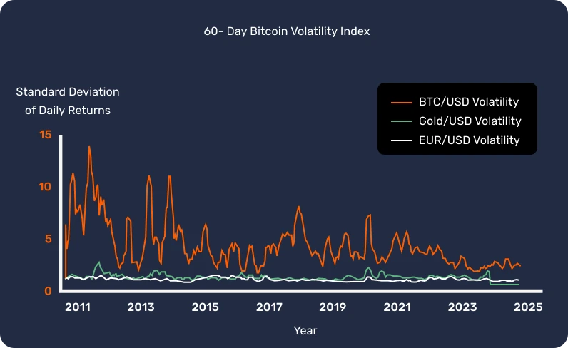

# आपका पहला बिटकॉइन एडवेंचर

इस पाठ्यक्रम में, हम 25 अध्यायों में बिटकॉइन की मूल बातें समझाएंगे, ताकि आप इस तकनीक को सरल और प्रभावी तरीके से समझ सकें। यह पाठ्यक्रम पूरे उद्योग की मूल बातों का पता लगाता है, जिसमें खनन, वॉलेट, खरीद/बिक्री प्लेटफॉर्म जैसे विषय शामिल हैं। इस यात्रा के दौरान अतिरिक्त शैक्षणिक सामग्री उपलब्ध होगी, और हम आपको इस पाठ्यक्रम को पूरा करने के बाद संसाधन अनुभाग में "21 पोस्टर" देखने के लिए भी आमंत्रित करते हैं।

आपको शुरुआत करने के लिए किसी विशिष्ट ज्ञान की आवश्यकता नहीं है। वास्तव में, निम्नलिखित सामग्री सभी स्तरों के छात्रों के लिए सुलभ है, और इसे पूरा करने में लगभग 15 घंटे लगने चाहिए।

+++
# परिचय

<partId>3cd2ac82-026c-53e1-874a-baf5842adc6d</partId>

## अज्ञात में छलांग

<chapterId>27e3fb60-4b50-556b-9e70-c4f5475c121d</chapterId>

### एक नए मौद्रिक और तकनीकी प्रतिमान में आपका स्वागत है।

बिटकॉइन एक तकनीकी और मौद्रिक क्रांति है, जो हमें पैसे और समाज के साथ हमारे संबंधों पर सवाल उठाने में सक्षम बनाती है। वास्तव में, बिटकॉइन (जिसे BTC के रूप में जाना जाता है) एक **तटस्थ** और **विकेंद्रीकृत** मुद्रा है, जिसका अर्थ है कि यह किसी भी संस्था या संगठन द्वारा नियंत्रित नहीं होती है। यह एक नवाचार है जो केवल एक "इंटरनेट मुद्रा" से कहीं आगे जाता है: यह एक कंप्यूटर प्रोटोकॉल (बिटकॉइन) और एक मौद्रिक इकाई (बिटकॉइन) दोनों है।

प्रोटोकॉल क्रिप्टोग्राफी, नेटवर्क संचार और प्रसिद्ध "ब्लॉकचेन" जैसी अंतर्निहित तकनीकों का उपयोग करता है, जबकि बिटकॉइन इकाई इस प्रोटोकॉल के सही कामकाज के लिए आवश्यक मुद्रा के रूप में कार्य करती है। रोजमर्रा की जिंदगी में, साल्वाडोरियन और दुनिया भर के बिटकॉइनर बिटकॉइन मुद्रा का उपयोग सामान और सेवाओं को खरीदने और बेचने के लिए करते हैं, और अपने जीवन को बेहतर बनाने के लिए इस तकनीक पर भरोसा करते हैं।

### एक व्यापक फिर भी सुलभ पाठ्यक्रम

इस पाठ्यक्रम में, हम बिटकॉइन के कुछ मौद्रिक पहलुओं पर चर्चा करेंगे, जिसमें बिटकॉइन खरीदने और बेचने, उन्हें डिजिटल वॉलेट में सुरक्षित रूप से संग्रहीत करने और लेनदेन के लिए उनका उपयोग करने के तरीके शामिल हैं। हम माइनर्स की भूमिका का भी परीक्षण करेंगे, जो नए बिटकॉइन बनाने और बिटकॉइन नेटवर्क को सुरक्षित करने के लिए आवश्यक हैं। अंत में, हम बिटकॉइन के भविष्य और लाइटनिंग नेटवर्क तकनीक कैसे बिटकॉइन लेनदेन को बेहतर बना सकती है, इसका पता लगाएंगे।


यह समझना आवश्यक है कि बिटकॉइन एक नई मौद्रिक प्रणाली है जो पूरी तरह से हमारे धन के साथ संबंध को बदल देती है, इसलिए यह सीखना कि इसे कैसे उपयोग किया जाए, किसी भी व्यक्ति के लिए एक आवश्यक कौशल है जो अपने स्वयं के धन पर नियंत्रण रखना चाहता है।

**अनुभाग 1 - धन**


- अध्याय 1 - पैसा क्या है?
- अध्याय 2 - फिएट मुद्रा
- अध्याय 3 - अतिमुद्रास्फीति
- अध्याय 4 - बिटकॉइन मौद्रिक नीति

**अनुभाग 2 - बिटकॉइन वॉलेट्स**


- अध्याय 5 - बिटकॉइन वॉलेट कैसे काम करते हैं?
- अध्याय 6 - अपनी सुरक्षा चुनना
- अध्याय 7 - अपना वॉलेट सेट करना
- अध्याय 8 - समय के विरुद्ध सुरक्षा

**अनुभाग 3 - बिटकॉइन की तकनीकी विशेषताएँ**


- अध्याय 9 - लेन-देन क्या है?
- अध्याय 10 - बिटकॉइन नोड्स
- अध्याय 11 - खनिक
- अध्याय 12 - खनिक और पारिस्थितिकी

**अनुभाग 4 - बिटकॉइन में बचत**


- अध्याय 13 - बिटकॉइन की कीमत
- अध्याय 14 - बिटकॉइन कैसे खरीदें?
- अध्याय 15 - बिटकॉइन के लिए काम करना
- अध्याय 16 - हाइपर-बिटकॉइनाइजेशन

**अनुभाग 5 - लाइटनिंग नेटवर्क**


- अध्याय 17 - लाइटनिंग नेटवर्क का परिचय
- अध्याय 18 - लाइटनिंग नेटवर्क के उपयोग के मामले

पैसे की परिभाषा और समाज में इसके कार्य (अध्याय 1) का परिचय देने से पहले, हमें बिटकॉइन की उत्पत्ति से शुरुआत करनी चाहिए। 2009 में लॉन्च किया गया बिटकॉइन एक अपेक्षाकृत नई तकनीक है जो किसी और चीज़ से अलग है। इसलिए यह सामान्य है कि आप इसे एक बार में पूरी तरह से समझ न पाएं। वास्तव में, जैसे इंटरनेट का उपयोग करना या कार चलाना सीखते समय, आपको तुरंत सभी तकनीकी विवरण जानने की आवश्यकता नहीं होती: आप अपने फंड को प्राप्त करने, भुगतान करने और सुरक्षित करने का तरीका सीखकर शुरुआत कर सकते हैं, और फिर इसे और गहराई से अध्ययन करने के लिए छोटे कदम उठा सकते हैं।

आखिरकार, हम इसके अपनाने के शुरुआती चरण में ही हैं, क्योंकि हमने टेकऑफ चरण पार कर लिया है: आप इस महत्वपूर्ण नवाचार के बारे में जितना चाहें ज्ञान प्राप्त करने के लिए बिल्कुल सही समय पर हैं।


यहां महत्वपूर्ण बात यह है कि इस नई तकनीक को सामान्य तरीके से समझा जाए, इसलिए हम आशा करते हैं कि आप इस पाठ्यक्रम का आनंद लेंगे और इस नए वैश्विक मौद्रिक प्रतिमान में प्रगति करते रहेंगे।

## बिटकॉइन का प्रागितिहास

<chapterId>9a94b627-5b69-5d81-9125-f1fa9b0aa6ad</chapterId>

"बिटकॉइन" शब्द के डिजिटल मुद्रा और वित्तीय परिवर्तन का पर्याय बनने से पहले, इसके निर्माण की नींव विचारों, नवाचारों और सामाजिक आंदोलनों की एक श्रृंखला द्वारा रखी गई थी। इनमें से, साइफरपंक आंदोलन बिटकॉइन के पूर्व-इतिहास में एक प्रमुख तत्व के रूप में उभरता है।

### साइफरपंक्स: डिजिटल दुनिया के द्रष्टा


1980 और 1990 के दशक के तकनीकी विकास के केंद्र में, लोगों का एक समूह डिजिटल युग में गोपनीयता और स्वतंत्रता की भूमिका पर गहराई से सवाल उठाने लगा। ये व्यक्ति, जिन्हें बाद में "साइफरपंक्स" के रूप में जाना जाएगा, दृढ़ता से मानते थे कि क्रिप्टोग्राफी सरकारों और बड़े निगमों के हस्तक्षेप के खिलाफ व्यक्तिगत अधिकारों की रक्षा के लिए एक उपकरण के रूप में काम कर सकती है।

जूलियन असांज, वेई दाई, टिम मे, और डेविड चाउम जैसी प्रतिष्ठित हस्तियों ने इस आंदोलन के दर्शन और दृष्टि को आकार देने में महत्वपूर्ण भूमिका निभाई। इन विचारकों ने एक प्रभावशाली मेलिंग लिस्ट पर अपने विचार साझा किए, जहां दुनिया भर के प्रतिभागियों ने व्यक्तिगत स्वतंत्रता को बढ़ाने के लिए प्रौद्योगिकी का सर्वोत्तम उपयोग करने के तरीकों पर बहस की।

### साइफरपंक्स के तीन मौलिक पेपर


साइफरपंक आंदोलन, जो डिजिटल सक्रियता और क्रिप्टोग्राफी में गहराई से जुड़ा हुआ है, ने अपने सिद्धांतों और भविष्य के लिए दृष्टि को स्पष्ट करने के लिए कई मूलभूत ग्रंथों का सहारा लिया। इन लेखनों में से, तीन विशेष रूप से उल्लेखनीय हैं:


- "साइफरपंक घोषणापत्र":

1993 में एरिक ह्यूजेस द्वारा लिखित, "साइफरपंक मैनिफेस्टो" यह दावा करता है कि गोपनीयता एक मौलिक अधिकार है। लेखक का तर्क है कि स्वतंत्र और गोपनीय रूप से संवाद करने की क्षमता एक स्वतंत्र समाज के लिए आवश्यक है। मैनिफेस्टो में कहा गया है: "हम सरकारों, निगमों, या अन्य बड़े, बेनाम संगठनों से यह उम्मीद नहीं कर सकते कि वे हमें गोपनीयता प्रदान करें [...]. यदि हम किसी भी प्रकार की गोपनीयता की उम्मीद करते हैं, तो हमें अपनी गोपनीयता की रक्षा स्वयं करनी होगी"।


- "क्रिप्टो-अराजकतावादी घोषणापत्र":

1992 में टिमोथी सी. मे द्वारा लिखित, यह दस्तावेज़ बताता है कि क्रिप्टोग्राफी के उपयोग से कैसे एक क्रिप्टोग्राफिक अराजकता का युग आ सकता है, जहाँ सरकारें नागरिकों के निजी मामलों में हस्तक्षेप करने में असमर्थ होंगी। मे ने एक ऐसे भविष्य की कल्पना की थी जहाँ लोग बिना किसी तीसरे पक्ष के हस्तक्षेप के गुमनाम रूप से जानकारी और धन का आदान-प्रदान कर सकें।


- "साइबरस्पेस की स्वतंत्रता की घोषणा":

हालांकि यह पाठ विशेष रूप से साइफरपंक नहीं है, लेकिन यह आंदोलन में भाग लेने वाले कई लोगों की भावनाओं को दर्शाता है। 1996 में जॉन पेरी बार्लो द्वारा लिखित, यह सरकारों द्वारा इंटरनेट के बढ़ते नियमन के प्रति एक प्रतिक्रिया है। यह घोषणा दावा करती है कि साइबरस्पेस भौतिक क्षेत्र से एक अलग दायरा है और इसे समान कानूनों के अधीन नहीं होना चाहिए। जैसा कि इसमें कहा गया है, "हमारे पास कोई निर्वाचित सरकार नहीं है, न ही हमारे पास होने की संभावना है"।

### बिटकॉइन के पूर्ववर्ती

बिटकॉइन के उभरने से पहले, डिजिटल मुद्रा बनाने के कई प्रयास किए गए थे। उदाहरण के लिए, डेविड चाउम ने 1980 के दशक में अपने प्रोजेक्ट "डिजिकैश" के साथ "अनाम इलेक्ट्रॉनिक मुद्रा" की अवधारणा पेश की। दुर्भाग्य से, विभिन्न बाधाओं के कारण, डिजिकैश कभी भी फलता-फूलता नहीं रहा।

एक और महत्वपूर्ण पूर्ववर्ती वेई डाई का "बी-मनी" है। हालांकि इसे कभी लागू नहीं किया गया, लेकिन इसमें एक गुमनाम डिजिटल मुद्रा का विचार प्रस्तुत किया गया था, जहां धोखाधड़ी का पता लगाने का काम एक केंद्रीय प्राधिकरण के बजाय मूल्यांकनकर्ताओं के समुदाय द्वारा किया जाता था।

नीचे दी गई छवि स्पष्ट रूप से इसके कई तकनीकी नवाचारों के माध्यम से आंदोलन के विकास को दर्शाती है।


इस उपजाऊ वातावरण में ही 2008 में रहस्यमय सतोशी नाकामोतो ने बिटकॉइन व्हाइटपेपर प्रकाशित किया। इस दस्तावेज़ में, उन्होंने साइफरपंक आंदोलन से कई विचारों को जोड़ा, जैसे कि प्रूफ ऑफ वर्क और क्रिप्टोग्राफिक टाइमस्टैम्प्स, ताकि एक विकेंद्रीकृत और सेंसरशिप-प्रतिरोधी डिजिटल मुद्रा बनाई जा सके।

हालांकि, बिटकॉइन सिर्फ इतना ही नहीं था: यह साइफरपंक आदर्शों की उपलब्धि का प्रतिनिधित्व करता था। इसकी प्रौद्योगिकी से परे, यह पारंपरिक वित्तीय प्रणालियों के खिलाफ एक क्रांति का प्रतीक था और पारदर्शिता, विकेंद्रीकरण और व्यक्तिगत संप्रभुता पर आधारित एक विकल्प प्रदान करता था।

### निष्कर्ष

बिटकॉइन का प्रागितिहास साइफरपंक आंदोलन और डिजिटल युग में अधिक स्वतंत्रता की सामूहिक खोज में गहराई से निहित है। क्रिप्टोग्राफी, विकेंद्रीकरण और अखंडता के सिद्धांतों को मिलाकर, बिटकॉइन एक मुद्रा से कहीं अधिक बन गया है। वास्तव में, यह एक दार्शनिक और तकनीकी क्रांति का उत्पाद है जो हमारी दुनिया को फिर से आकार दे रहा है।

इसलिए, बिटकॉइन एक प्रोटोकॉल है जो लंबे समय तक फैला हुआ है, और हमें ऊर्जा, समय और धन के साथ अपने संबंधों पर सवाल उठाने के लिए प्रोत्साहित करता है।

हालांकि, क्या बिटकॉइन एक "वास्तविक" मुद्रा है? इसे समझने के लिए, हमें पहले धन की अवधारणा और इसके विभिन्न रूपों को समझने की आवश्यकता है, जिसे हम अगले अध्याय में जांचेंगे।

यदि आप बिटकॉइन के इतिहास को और अधिक विस्तार से जानना चाहते हैं, तो हमारे HIS 201 कोर्स की अत्यधिक सिफारिश करते हैं, जहां आप बिटकॉइन की उत्पत्ति और धीमी उभरती हुई प्रक्रिया, साथ ही इसके इतिहास और समुदाय की शुरुआत को खोजेंगे। यह कोर्स पूरी तरह से दस्तावेजित और स्रोतों से समृद्ध है, और इसमें कई रोचक किस्से भी शामिल हैं:

https://planb.network/courses/a51c7ceb-e079-4ac3-bf69-6700b985a082
# पैसा

<partId>e913df1a-4cbd-5380-ba67-ca2a0414f671</partId>

## इतिहास में पैसा

<chapterId>c838e64d-d59f-5703-8c74-ea5e8c4fdd31</chapterId>

पैसे का विकास मानव इतिहास का एक आकर्षक पहलू है जो युगों से सभ्यताओं की निरंतर विकसित होती आर्थिक आवश्यकताओं को पूरा करने में उनकी सरलता को दर्शाता है।


### खोलों से बैंक खातों तक

मूल रूप से, मुद्रा एक मूर्त संपत्ति थी, जैसे अनाज, पशुधन, या कोई अन्य वस्तु। हालांकि, इन वस्तुओं में एक बड़ी कमी यह थी कि वे खराब होने वाली थीं, जिससे उन्हें दीर्घकालिक बचत माध्यम के रूप में उपयोग करना मुश्किल हो जाता था। उदाहरण के लिए, खराब फसल या पशुओं की बीमारी किसी व्यक्ति की संपत्ति को रातोंरात नष्ट कर सकती थी।

इस प्रकार, जैसे-जैसे सभ्यताएं आगे बढ़ीं और व्यापार नए क्षेत्रों में फैला, एक सार्वभौमिक विनिमय माध्यम की आवश्यकता उत्पन्न हुई। व्यक्तियों ने पहले कौड़ियों और रत्नों जैसी वस्तुओं के साथ प्रयोग किया, लेकिन वे उतने टिकाऊ या दुर्लभ नहीं थे जितना वे मानते थे। अंततः, सोना अपनी दुर्लभता, टिकाऊपन और विभाज्यता के कारण मानक बन गया। यह तब भी धन और शक्ति का प्रतीक था, और आज भी बना हुआ है।


### पैसे की भूमिका क्या है?

पैसा एक अत्यंत परिष्कृत संचार उपकरण है:


- यह वर्तमान और भविष्य के बीच संचार की अनुमति देता है, क्योंकि यह हमारे समय और ऊर्जा को एक ऐसी संपत्ति में बदल देता है जिसे भविष्य में पुन: उपयोग किया जा सकता है, बिना मूल्यह्रास के जोखिम के।
- यह एक सार्वभौमिक भाषा में संचार को सुविधाजनक बनाता है: एक-दूसरे को जाने बिना या एक ही भाषा बोले बिना, दो अजनबी वस्तुओं के मूल्य पर आदान-प्रदान, व्यापार और सहमति कर सकते हैं।

हमारी दुनिया में इसका कार्य कृत्रिम रूप से दोहराना मुश्किल है। वास्तव में, कोई भी व्यक्ति या समूह पैसा नहीं बना सकता, क्योंकि यह एक प्राकृतिक घटना है जो बाजार और स्वैच्छिक सहमति से उत्पन्न होनी चाहिए। इस अर्थ में, कीमतें संकेत और जानकारी के टुकड़े के रूप में कार्य करती हैं जो समाज को संसाधनों के आवंटन में मार्गदर्शन करती हैं।

इन कारणों से, सोना मुद्रा के रूप में निम्नलिखित अरस्तूवादी कार्यों पर आधारित 4,000 वर्षों के मौद्रिक डार्विनवाद का परिणाम है:


- मूल्य का भंडार**: धन का उपयोग भविष्य में क्रय शक्ति को स्थानांतरित करने के लिए किया जा सकता है, इसलिए इसे एक टिकाऊ सामग्री होना आवश्यक है;
- विनिमय का माध्यम**: धन का उपयोग वस्तुओं और सेवाओं के बदले में किया जा सकता है, जिससे व्यापारियों के बीच आवश्यकताओं के संयोग से बचा जा सकता है;
- लेखा की इकाई**: धन हमें विभिन्न वस्तुओं के मूल्यों की तुलना करने की अनुमति देता है ताकि हम उनकी सापेक्ष सुविधा को बेहतर ढंग से समझ सकें।


### पैसे की विशेषताएँ

सोना आदर्श रूप से एक कुशल मुद्रा के मानदंडों को पूरा करता है: इसकी प्राकृतिक दुर्लभता इसे मूल्यवान बनाती है, जबकि इसके रासायनिक गुण यह सुनिश्चित करते हैं कि यह समय के साथ खराब न हो। इन विशेषताओं ने सोने को एक उत्कृष्ट **मूल्य संचय** का साधन बना दिया है, लेकिन यह एक सामान्य मुद्रा नहीं है, क्योंकि इस प्रकार की मुद्रा को आसानी से विभाजित या लंबी दूरी तक ले जाया नहीं जा सकता। एक वैश्वीकृत और डिजिटल दुनिया में, सोना तेजी से बदलती परिस्थितियों के साथ तालमेल बिठाने में संघर्ष करता है और इसे विभाजित और आसानी से विनिमय योग्य बनाने के लिए एक केंद्रीय संस्था की आवश्यकता होती है (जैसे कि ढाले गए सिक्कों के माध्यम से)।

इसके विपरीत, राज्य द्वारा जारी मुद्राएँ (फिएट) आसानी से उपयोग की जा सकती हैं, लेकिन जो संस्थाएँ उन्हें नियंत्रित करती हैं (राजा, केंद्रीय बैंक, सम्राट, तानाशाह) उनके द्वारा इनका मूल्य लगातार कम किया जाता है।

इस अवधारणा को बेहतर ढंग से समझाने के लिए, हम एक प्रभावी मुद्रा की विशेषताओं का पता लगाएंगे:


- फंजिबिलिटी**, जिसका अर्थ है कि यह मूल्य की हानि के बिना समान प्रकार की किसी अन्य इकाई के साथ विनिमेय है;
- विभाज्यता**, क्योंकि इसे छोटी इकाइयों में विभाजित किया जा सकता है ताकि विभिन्न मात्राओं के लेनदेन को सुविधाजनक बनाया जा सके;
- लिक्विडिटी**, जिसका अर्थ है कि यह आसानी से वस्तुओं या सेवाओं में परिवर्तनीय है।

इन मानदंडों को पूरा करने के लिए, मुद्रा ने ऐतिहासिक रूप से विभिन्न चरणों को अपनाकर विकास किया है:


- कच्चा पत्थर -> सिक्का
- बैंकनोट -> बैंक कार्ड
- Blockchain -> लाइटनिंग नेटवर्क

मुद्राएं आज भी विकसित हो रही हैं, विभिन्न उपयोग के मामलों को पूरा करने के लिए अपने रूपों को अनुकूलित कर रही हैं। जैसा कि हमने कहा, हालांकि सोना मूल्य का एक उत्कृष्ट भंडार है, यह अब वर्तमान वैश्विक अर्थव्यवस्था के लिए उपयुक्त नहीं है। इसी तरह, डॉलर और यूरो जैसी फ़िड्यूशरी मुद्राएं बहुत तरल और आसानी से परिवहन योग्य हैं क्योंकि वे अब ज्यादातर डिजिटल हैं, लेकिन मौद्रिक मुद्रास्फीति के कारण उनका मूल्य लगातार कम हो रहा है।

दूसरी ओर, बिटकॉइन नई संभावनाएं प्रस्तुत करता है। इसके गुण, जैसे कि सख्ती से सीमित आपूर्ति, इसे मूल्य के एक उत्कृष्ट भंडार के रूप में स्थापित करते हैं। इसके अलावा, एक तटस्थ इंटरनेट मुद्रा के रूप में, यह सीमाओं को पार करने वाले एक व्यवहार्य **विनिमय माध्यम** के रूप में कार्य करता है। हालांकि, यह आज भी व्यापार में व्यापक रूप से स्वीकार नहीं किया गया है, इसके [निरंतर अपनाने](https://btcmap.org/map) के बावजूद।

## फ़िड्यूशियरी मुद्राएँ

<chapterId>25151d46-7db1-5b48-8bba-cbde1944555a</chapterId>

> "जो लोग अतीत को याद नहीं कर सकते, वे इसे दोहराने के लिए अभिशप्त हैं," जॉर्ज संतायना ने कहा।
एक सत्य जो वर्तमान मौद्रिक प्रणाली के संदर्भ में गहराई से प्रतिध्वनित होता है।

### फिड्यूशरी = ट्रस्ट

आज, यूरो और डॉलर जैसी प्रमुख मुद्राएं फिड्यूशरी मानी जाती हैं। इसका मतलब है कि उनमें कोई आंतरिक मूल्य नहीं है और वे पूरी तरह से उन संस्थाओं में हमारे विश्वास और भरोसे पर निर्भर करती हैं जो उन्हें नियंत्रित करती हैं।

एक फिड्यूशियरी मुद्रा (fiduciary currency) धन का एक रूप है जो किसी संस्था द्वारा घोषित किया जाता है, जैसे कि एक राज्य, जैसे चीन युआन के साथ, या एक राजनीतिक-आर्थिक संघ, जैसे यूरोपीय संघ यूरो के साथ। इसके जारीकरण के लिए जिम्मेदार संस्था केंद्रीय बैंक होता है (उदाहरण के लिए, हम पीपुल्स बैंक ऑफ चाइना, संयुक्त राज्य अमेरिका का फेडरल रिजर्व, या गिनी गणराज्य के केंद्रीय बैंक का उल्लेख कर सकते हैं)। यही संस्थाएं मौद्रिक नीति तैयार करने और इसलिए यह निर्धारित करने के लिए जिम्मेदार होती हैं कि कितनी मुद्रा को प्रचलन में लाया जाए या छापा जाए।


### मुद्रा अवमूल्यन: रोमन साम्राज्य जितनी पुरानी रणनीति

प्राचीन काल से, सोने ने मौद्रिक संदर्भ के रूप में कार्य किया है, लेकिन इसकी कठोरता ने अक्सर नेताओं को, चाहे वे रोमन सम्राट हों या आधुनिक सरकारें, वैकल्पिक मुद्राओं को अपनाने के लिए प्रेरित किया है, जो अक्सर फिड्यूशियरी होती हैं।

यह तंत्र सरल है और सभ्यता की उत्पत्ति से मौजूद प्रथाओं से प्रेरित है। नेता, धन पर नियंत्रण करने के लिए उत्सुक, अक्सर अपनी शक्ति का शोषण करके और सुरक्षा और सुरक्षा का वादा करके सोने को केंद्रीकृत करना शुरू करते हैं। इस कीमती भंडार को अपने हाथों में लेकर, वे एक नई मुद्रा पेश करते हैं, जो सोने के बराबर मूल्य की होती है, लेकिन उनकी प्रतिमा में ढाली जाती है। यह मुद्रा फिर प्रचलन में आती है, और लोग जल्दी ही इसके सरल उपयोग की सुविधा के अनुकूल हो जाते हैं।

हालांकि, ये नेता फिर धीरे-धीरे नई मुद्रा का मूल्य कम करने लगते हैं, जिससे वास्तव में इसका मूल्य प्रारंभिक सोने की कीमत की तुलना में हर साल कुछ प्रतिशत कम हो जाता है। इस मौन अवमूल्यन को अक्सर जनता के हित में होने के रूप में सही ठहराया जाता है। वास्तव में, जो लोग इस फ़िएट मुद्रा में बचत करते हैं, उनकी बचत का मूल्य कम होता जाता है, जबकि राज्य मुद्रास्फीति के माध्यम से अपनी परियोजनाओं को वित्तपोषित करता है। इसके अलावा, यह अवमूल्यन ऋण को चुकाना आसान बना देता है।


एक महत्वपूर्ण क्षण में, नेता घोषणा करता है: मुद्रा अब सोने द्वारा समर्थित नहीं है। जनता, जो अब फ़िड्यूशरी मुद्रा की आदी हो चुकी है और अक्सर वित्तीय मामलों के बारे में गलत जानकारी रखती है, इस वास्तविकता को स्वीकार कर लेती है, जिससे राज्य को मुद्रा आपूर्ति को स्वतंत्र रूप से नियंत्रित करने और लगभग बिना किसी लागत के भारी मात्रा में पैसा छापने की अनुमति मिल जाती है।

मुद्रा मुद्रण तब मुद्रास्फीति का कारण बनता है और धीरे-धीरे जनसंख्या को गरीब बना देता है। इसके अलावा, वित्तीय प्रणाली को विनियमित और प्रतिबंधित किया जाता है ताकि इसके पतन से बचा जा सके, क्योंकि कोई भी व्यवधान एक बड़े आर्थिक संकट को उत्पन्न कर सकता है। आम जनता के विपरीत, वित्तीय संस्थान और धनी व्यक्ति इस प्रणाली से अत्यधिक लाभान्वित होते हैं, जो असमानता की खाई पैदा करता है और अधिनायकवाद को बढ़ावा देता है। इस संदर्भ में, उन्हें मूलभूत परिवर्तन करने के लिए प्रोत्साहित नहीं किया जाता है, जिससे प्रणाली को एक संभावित विस्फोट तक अपना रास्ता जारी रखने की अनुमति मिलती है।

जब यह रणनीति अच्छी तरह से क्रियान्वित की जाती है, तो यह दशकों तक चल सकती है। हालांकि, यह ध्यान रखना महत्वपूर्ण है कि बहुत तेजी से मूल्यह्रास या विश्वास की हानि हाइपरइन्फ्लेशन (अगले अध्याय देखें) का कारण बन सकती है। इतिहास से पता चलता है कि डॉलर ने 100 वर्षों में अपने मूल्य का 98% खो दिया है, यूरो ने 20 वर्षों में 30% खो दिया है, और पाउंड स्टर्लिंग ने अपने सृजन के बाद से 99% खो दिया है।

अंत में, मुद्रा का सोने से कोई संबंध नहीं रह सकता है, जैसा कि साम्राज्य के अंत में रोमन सिक्कों के साथ हुआ था, या यहां तक कि यह एक साधारण संख्यात्मक मूल्य तक सीमित हो सकता है, जो मूर्त वास्तविकता से अलग हो।

आज, हम एक ऐतिहासिक मोड़ का साक्षी बन रहे हैं। डॉलर, जो लंबे समय से प्रभावी रहा है, अब कमजोर होता प्रतीत हो रहा है, जबकि सोने ने अपनी केंद्रीय भूमिका खो दी है। हम एक नए मौद्रिक चक्र की दहलीज पर खड़े हैं, जो हमें याद दिलाता है कि इतिहास के सबक अक्सर भुला दिए जाते हैं।


### क्या बिटकॉइन एक समाधान है?

इन परिस्थितियों के कारण, बिटकॉइन क्रांति गति प्राप्त कर रही है। पिछली मुद्राओं के विपरीत, इसे **किसी विश्वसनीय तीसरे पक्ष** की आवश्यकता नहीं है और इसका उद्देश्य राज्य को धन से अलग करना है।


वास्तव में, बिटकॉइन एक विकेंद्रीकृत समाधान और एक नई समानांतर मौद्रिक प्रणाली का प्रस्ताव करके इन प्रणालीगत चुनौतियों के प्रति प्रतिक्रिया के रूप में स्वयं को प्रस्तुत करता है। ऐतिहासिक रूप से, यदि सोने को मुद्रा के रूप में पसंद किया गया है क्योंकि यह जालसाजी के प्रति प्रतिरोधी है, तो बिटकॉइन भी इसी तरह से जाली नहीं बनाया जा सकता है। इसके अलावा, यह अपने विकेंद्रीकृत और क्रिप्टोग्राफिक प्रकृति के कारण 21 मिलियन इकाइयों तक सीमित है। बिटकॉइन एक ऐसी मुद्रा है जो पारदर्शिता और तटस्थता पर निर्भर करती है, जो वर्तमान केंद्रीकृत मौद्रिक प्रणाली के लिए एक आकर्षक विकल्प प्रदान करती है।


बिटकॉइन ने ध्यान आकर्षित करने का एक और कारण सेंट्रल बैंक डिजिटल करेंसी (CBDCs) का उदय है, जो अटल प्रतीत होता है। धन के इस नए रूप से एक अधिक केंद्रीय रूप से योजनाबद्ध अर्थव्यवस्था का विकास होगा, और यह व्यक्तियों की वित्तीय स्वतंत्रता को बाधित कर सकता है तथा सत्तावादी दुरुपयोग को सुविधाजनक बना सकता है।

हम इस अध्याय को 1984 में नोबेल पुरस्कार विजेता एफ.ए. हायेक के उद्धरण के साथ समाप्त कर सकते हैं:

> "मुझे विश्वास नहीं है कि हमें कभी भी अच्छा पैसा मिलना चाहिए, इससे पहले कि हम इस चीज़ को सरकार के हाथों से निकाल दें। अगर हम उन्हें सरकार के हाथों से हिंसक तरीके से नहीं निकाल सकते, तो हम केवल यह कर सकते हैं कि किसी चालाक या घुमावदार तरीके से कुछ ऐसा पेश करें जिसे वे रोक न सकें।"
आर्थिक भ्रांतियों और स्वतंत्रता के बारे में अधिक जानने के लिए, हम आपको हमारे ECO 102 पाठ्यक्रम की खोज करने के लिए आमंत्रित करते हैं, जो 19वीं सदी के फ्रांसीसी विचारक फ्रेडरिक बास्टिएट के जीवन और विचारों का पता लगाता है, जो निश्चित रूप से बिटकॉइन के उदय की सराहना करते होंगे:

https://planb.network/courses/d07b092b-fa9a-4dd7-bf94-0453e479c7df
## हाइपरइन्फ्लेशन

<chapterId>b04c024c-54f3-50cb-997f-58721cfc74be</chapterId>

हाइपरइन्फ्लेशन एक मौद्रिक घटना है जो विशेष रूप से फिएट मुद्राओं से संबंधित है: यह मुद्रा में पूर्ण विश्वास की हानि और अधिकारियों द्वारा मौद्रिक मुद्रण के कारण मुद्रास्फीति में भारी वृद्धि की विशेषता है। परिणामस्वरूप, व्यक्तियों द्वारा संचित बचत अपेक्षाकृत कम समय में समाप्त हो सकती है, जिससे देश आर्थिक, सामाजिक और राजनीतिक पतन के कगार पर पहुंच जाता है।

### मुद्रास्फीति बेकाबू हो रही है!

मुद्रास्फीति के बचत पर प्रभाव को समझने के लिए, हमें विभिन्न मुद्रास्फीति दरों को ध्यान में रखना होगा।


- 2% मुद्रास्फीति के साथ, आप हर साल अपनी क्रय शक्ति का 2% खो देते हैं, जो 5 साल में 10% हो जाता है।
- 7% के साथ, आप 10 साल में इसका आधा खो देते हैं।
- 20% के साथ, आप 3 साल में इसका लगभग आधा हिस्सा खो देते हैं।

जब हाइपरइन्फ्लेशन होता है, तो हम सालाना 20% की बात नहीं कर रहे होते, बल्कि महीने में 20% या, अपने चरम पर, दिन में भी 20% की बात कर रहे होते हैं। तीन दिनों में प्रतिदिन 100% मुद्रास्फीति का अनुभव करना एक यथार्थपरक परिदृश्य है जो हमारी दुनिया में हुआ है और होता रहता है।

यह समझना महत्वपूर्ण है कि हाइपरइन्फ्लेशन संयोग से, पूंजीवाद से, या विरोधियों के राजनीतिक हमलों से नहीं होता है। हाइपरइन्फ्लेशन केंद्रीय बैंकरों और राजनेताओं द्वारा लिए गए खराब मौद्रिक निर्णयों का सीधा परिणाम है। इसके परिणाम हर नागरिक को प्रभावित करते हैं और यहां तक कि अगली पीढ़ियों को भी प्रभावित करते हैं। हम आपको निम्नलिखित तालिका को पढ़ने के लिए पांच मिनट का समय देने के लिए आमंत्रित करते हैं ताकि आप इस घटना के वास्तविक प्रभाव को पूरी तरह से समझ सकें (ECO204 कोर्स इस विषय पर और गहराई से चर्चा करता है)। जैसा कि आप देख सकते हैं, कोई भी देश या मुद्रा संभावित रूप से सुरक्षित नहीं है।


### हाइपरइन्फ्लेशन के चरण क्या हैं?


हाइपरइन्फ्लेशन होने के लिए, कुछ विशेष घटनाएं घटित होनी चाहिए।

चरण 1 - आत्मविश्वास की हानि


- मुद्रा शक्ति का केंद्रीकरण धन के निर्माण और उसके दुरुपयोग को सुविधाजनक बनाता है। इस संदर्भ में, कुछ बाहरी कारक हाइपरइन्फ्लेशन को ट्रिगर कर सकते हैं, आमतौर पर युद्ध, सामाजिक उपाय, या गेहूं या गैसोलीन जैसे प्रमुख संसाधनों की कीमत में वृद्धि। इस प्रकार, मुद्रा में विश्वास की हानि हो सकती है, और व्यक्ति धन के मूल और अनिवार्य मौद्रिक नीति के लाभों पर सवाल उठाने लगते हैं।

चरण 2 - मुद्रा का पतन और मूल्य वृद्धि


- जैसे-जैसे सरकारें विश्वास पर नियंत्रण खोती हैं, व्यक्ति अपनी मुद्रा को अधिक स्थिर मुद्रा के लिए विनिमय करना शुरू कर देते हैं, जैसा कि वेनेज़ुएला में अमेरिकी डॉलर के साथ हुआ। यह स्थिति कीमतों में वृद्धि का कारण बनती है, जिससे एक दुष्चक्र बनता है जहां वस्तुएं और सेवाएं तेजी से महंगी होती जाती हैं। इन आवश्यकताओं को पूरा करने और मौद्रिक नीति को सही करने के लिए, राज्य अधिक पैसा छापता है, जिसके परिणामस्वरूप घातीय मुद्रास्फीति होती है।

चरण 3 - मुद्रा मुद्रण का दुष्चक्र


- इस प्रकार, सामान खरीदने के लिए अधिक से अधिक नोटों की आवश्यकता होती है, जिसके परिणामस्वरूप कागजी मुद्रा की कमी हो जाती है। इसके जवाब में, सरकारें अधिक नोट छापने का सहारा लेती हैं, जो मुद्रास्फीति को और बढ़ा देती है।


चरण 4 - एक नई मुद्रा का उदय


- फिर, मुद्रास्फीति के चक्र को तोड़ने के लिए, एक नई मुद्रा पुरानी मुद्रा की जगह लेती है, जिसमें पहले के कानूनी मुद्रा में मौजूद नहीं थे, सख्त नियंत्रण लागू किए जाते हैं।

हाइपरइन्फ्लेशन संकट को हल करने के लिए अक्सर क्रांतिकारी परिवर्तनों की आवश्यकता होती है, जैसे कि क्रांतियाँ, सरकारी परिवर्तन, केंद्रीय बैंकरों में बदलाव, आदि। विश्वास की हानि, मुद्रा का पतन, और पुनर्निर्माण फिएट मुद्रा पर आधारित अर्थव्यवस्था को पुनर्जीवित करने के लिए आवश्यक चरण हैं।

### तीन उल्लेखनीय उदाहरण


- जर्मनी, 1922-1923।

हाइपरइन्फ्लेशन के सबसे चौंकाने वाले उदाहरणों में से एक प्रथम विश्व युद्ध के बाद जर्मन वीमर गणराज्य में हुआ।

जर्मनी ने युद्ध के वित्तपोषण के लिए भारी मात्रा में पैसा उधार लिया था। हालांकि, न केवल जर्मनी इसे हार गया, बल्कि उसे अरबों डॉलर का मुआवजा भी देना पड़ा। सबसे अधिक मुद्रास्फीति दर वाला महीना अक्टूबर 1923 था, जो 29,500% पर पहुंच गया, जो प्रतिदिन 20.9% की मुद्रास्फीति दर के बराबर था। कीमतें हर 3.7 दिन में दोगुनी हो जाती थीं!

जर्मन मुद्रा इतनी बेकार हो गई कि कुछ नागरिकों ने लकड़ी के बजाय अपने कागजी पैसे जलाना पसंद किया क्योंकि यह वास्तव में सस्ता था। यहां तक कि यह भी कहा जाता है कि रेस्तरां में, वेटर्स को मुद्रास्फीति को ध्यान में रखते हुए हर 30 मिनट में मेन्यू की कीमतों की घोषणा करनी पड़ती थी।

अंत में, अधिकारियों ने एक नई मुद्रा बनाई, जो जर्मनी, फ्रांस और इंग्लैंड के ऋणों द्वारा समर्थित थी, और जर्मन भूमि द्वारा गारंटीकृत थी।


- हंगरी, 1945-1946

वह देश जिसने अब तक हाइपरइन्फ्लेशन की सबसे खराब अवधि का अनुभव किया है, वह द्वितीय विश्व युद्ध के बाद हंगरी है।

हंगरी संघर्ष में हारने वाले पक्ष में पाया गया, जिसकी अधिकांश औद्योगिक उत्पादन क्षमता नष्ट हो गई। सबसे अधिक मुद्रास्फीति वाला महीना जुलाई 1946 था, जिसमें 41,900,000,000,000,000% की चौंका देने वाली मूल्य मुद्रास्फीति देखी गई, जो प्रतिदिन 207% के बराबर थी। कीमतें हर 15 घंटे में दोगुनी हो जाती थीं!

1946 में प्रचलन में आने वाला अंतिम बैंकनोट 100 मिलियन बिलियन पेंगो (100,000,000,000,000,000) का था।


- ज़िम्बाब्वे, 2007-2008

वर्ष 2000 तक, ज़िम्बाब्वे तेल को छोड़कर अपनी लगभग सभी आवश्यकताओं के लिए आत्मनिर्भर था।

1997 में, जिम्बाब्वे डॉलर 72% से अधिक गिर गया जब सरकार ने युद्ध के दिग्गजों को 450 मिलियन अमेरिकी डॉलर के बराबर मुआवजा देने पर सहमति जताई। चूंकि सरकार के पास इस राशि का भंडार नहीं था, इसलिए उसने नोट छापने का सहारा लिया। 2005 में, मुद्रास्फीति 586% तक पहुंच गई, लेकिन नवंबर 2008 के मध्य में इसकी चरम सीमा थी, जब अनुमानित दर 79,600,000,000% प्रति माह थी।

जून 2007 में सरकार ने कीमत नियंत्रण लागू करके पहले ही प्रतिक्रिया व्यक्त की थी, लेकिन इस कार्रवाई का अर्थव्यवस्था पर कोई प्रभाव नहीं पड़ा। दुकानें सचमुच "लूट" गईं, और व्यापारियों के पास अपनी दुकानों को फिर से स्टॉक करने के साधन नहीं थे।

अप्रैल 2009 में, वित्त मंत्री ने जिम्बाब्वे डॉलर को निलंबित करने की घोषणा की और व्यापार के लिए विभिन्न विदेशी मुद्राओं के उपयोग को अधिकृत किया। सभी बैंक खातों, पेंशनों और वित्तीय संस्थानों के शेष राशि रातोंरात गायब हो गए।


निष्कर्ष में, हाइपरइन्फ्लेशन का प्रभाव मुद्रा के मूल्य को तेजी से कम करने का होता है, जिससे बचत का क्षरण होता है और मौद्रिक प्रणाली में विश्वास की हानि होती है। जैसा कि वोल्टेयर ने एक बार सुझाव दिया था, एक फिएट मुद्रा अंततः अपना आंतरिक मूल्य खो देगी और शून्य की ओर अभिसरण करेगी।

एक मुद्रा जो एक वित्तीय संस्थान जैसे विश्वसनीय तीसरे पक्ष पर निर्भर करती है, व्यवहार में और दीर्घकाल में, एक दोषपूर्ण मुद्रा है, क्योंकि यह क्रय शक्ति की गारंटी देने या बचत को संरक्षित करने में असमर्थ है।

हाइपरइन्फ्लेशन के विषय में गहराई से जानने के लिए, हम डेविड सेंट-ऑन्जे के ECO 204 कोर्स की सलाह देते हैं, जहाँ आप सीखेंगे कि हाइपरइन्फ्लेशनरी चक्र क्या हैं और हमारे जीवन पर उनके वास्तविक प्रभाव क्या हैं। आप इन चक्रों के बीच की समानताएं भी खोजेंगे और सबसे महत्वपूर्ण बात, इनसे कैसे बचा जाए।

https://planb.network/courses/caa75343-ac90-4249-bcca-0e2e57c3a0f1
## 21 मिलियन बिटकॉइन

<chapterId>f4a06d76-1963-56fd-93ff-dfa41489bcde</chapterId>

### बिटकॉइन की मौद्रिक नीति

बिटकॉइन एक विकेंद्रीकृत डिजिटल मुद्रा है जिसकी अधिकतम मात्रा **21 मिलियन यूनिट** पूर्व-निर्धारित है। यह कमी की यह आंतरिक विशेषता इसके कंप्यूटर कोड द्वारा निर्धारित की गई है और प्रोटोकॉल में भाग लेने वाले सभी उपयोगकर्ताओं के सहमति द्वारा मजबूत की गई है।


इसका मौद्रिक जारीकरण एक वक्र द्वारा दर्शाया जा सकता है जो समय के साथ बनाए गए बिटकॉइन की मात्रा को दर्शाता है। उदाहरण के लिए, 2022 में, लगभग 18.5 मिलियन बिटकॉइन प्रचलन में थे। पूर्वानुमान बताते हैं कि 2025 तक, लगभग 19.5 मिलियन बिटकॉइन होंगे, जो कुल आपूर्ति का लगभग 93% प्रतिनिधित्व करते हैं, और 2037 तक, यह आंकड़ा 20.4 मिलियन तक पहुंच जाएगा।

### नए बिटकॉइन कैसे बनाए जाते हैं?

नए बिटकॉइन का निर्माण माइनिंग प्रक्रिया का परिणाम है। संक्षेप में, माइनर्स शक्तिशाली कंप्यूटरों का उपयोग करते हैं जो जटिल गणितीय समस्याओं को हल करते हैं, जो लेन-देन को मान्य और सुरक्षित करते हैं। एक बार जब कोई समस्या हल हो जाती है, तो माइनर ब्लॉकचेन में लेन-देन का एक नया ब्लॉक जोड़ता है, जो एक विकेंद्रीकृत और वितरित लेज़र है जो नेटवर्क पर किए गए सभी लेन-देन को रिकॉर्ड करता है। ब्लॉकचेन पारदर्शिता और सुरक्षा सुनिश्चित करता है, क्योंकि प्रत्येक ब्लॉक पिछले ब्लॉक से जुड़ा होता है, जिससे नेटवर्क की सहमति के बिना पिछले डेटा को बदलना लगभग असंभव हो जाता है।


इस कार्य को सफलतापूर्वक पूरा करने के बाद, खनिकों को हर दस मिनट में नए बिटकॉइन के जारी होने के साथ पुरस्कृत किया जाता है। यह पुरस्कार हर 210,000 ब्लॉक्स (लगभग हर चार साल) में आधा हो जाता है, जिसे "हाल्विंग" कहा जाता है, जिससे मुद्रा जारी होने की वक्रता सीढ़ीदार आकार लेती है। इस तंत्र के कारण, गणितीय रूप से यह अनुमान लगाया जा सकता है कि नए बिटकॉइन का निर्माण लगभग वर्ष 2140 तक बंद हो जाएगा, जब कुल संख्या 21 मिलियन की सीमा तक पहुंच जाएगी।

| हाल्विंग संख्या | ब्लॉक ऊंचाई | हाल्विंग के बाद BTC इनाम | हाल्विंग के बाद अनुमानित BTC प्रचलन में |

| -------------- | ------------ | ------------------------- | ------------------------------------------ |

| 1              | 210,000      | 25 BTC                    | 10,500,000 BTC                             |

| 2              | 420,000      | 12.5 BTC                  | 15,750,000 BTC                             |

| 3              | 630,000      | 6.25 BTC                  | 18,375,000 BTC                             |

| 4              | 840,000      | 3.125 BTC                 | 19,687,500 BTC                             |

| 5              | 1,050,000    | 1.5625 BTC                | 20,343,750 BTC                             |

| 6              | 1,260,000    | 0.78125 BTC               | 20,671,875 BTC                             |

| 7              | 1,470,000    | 0.390625 BTC              | 20,835,937.5 BTC                           |

| 8              | 1,680,000    | 0.1953125 BTC             | 20,917,968.75 BTC                          |

| 9              | 1,890,000    | 0.09765625 BTC            | 20,958,984.375 BTC                         |

| 10             | 2,100,000    | 0.048828125 BTC           | 20,979,492.188 BTC                         |

| 11             | 2,310,000    | 0.0244140625 BTC          | 20,989,746.094 BTC                         |

| 12             | 2,520,000    | 0.01220703125 BTC         | 20,994,873.047 BTC                         |

| 13             | 2,730,000    | 0.006103515625 BTC        | 20,997,436.523 BTC                         |

| 14             | 2,940,000    | 0.0030517578125 BTC       | 20,998,718.262 BTC                         |

| 15             | 3,150,000    | 0.00152587890625 BTC      | 20,999,359.131 BTC                         |

| 16             | 3,360,000    | 0.000762939453125 BTC     | 20,999,679.566 BTC                         |

| 17             | 3,570,000    | 0.0003814697265625 BTC    | 20,999,839.783 BTC                         |

| 18             | 3,780,000    | 0.00019073486328125 BTC   | 20,999,919.892 BTC                         |

| 19             | 3,990,000    | 0.000095367431640625 BTC  | 20,999,959.946 BTC                         |

| 20             | 4,200,000    | 0.0000476837158203125 BTC | 20,999,979.973 BTC                         |

हम [माइनर चैप्टर](https://planb.network/courses/2b7dc507-81e3-4b70-88e6-41ed44239966/dbb8264a-7434-57e4-9d1b-fbd1bae37fdf) में माइनिंग की अवधारणा को और अधिक विस्तार से फिर से देखेंगे।

### डिजिटल दुर्लभता की गारंटी देना

21 मिलियन की सीमा बिटकॉइन की दुर्लभता का आधार है, और यह दो प्रमुख तंत्रों द्वारा सुनिश्चित की जाती है: खनन कठिनाई का समायोजन और गेम थ्योरी।


- खनन कठिनाई समायोजन एक ऐसी प्रक्रिया है जो हर 2016 ब्लॉक्स, या लगभग दो हफ्तों में होती है, यह सुनिश्चित करने के लिए कि हर दस मिनट में औसतन एक नया ब्लॉक ब्लॉकचेन में जोड़ा जाए। ब्लॉक निर्माण की यह आवृत्ति और बिटकॉइन की कुल मात्रा दोनों बिटकॉइन प्रोटोकॉल के निश्चित पहलू हैं और सामान्य सहमति के बिना इन्हें बदला नहीं जा सकता, जो कि पारंपरिक मौद्रिक प्रणालियों में किए गए मनमाने निर्णयों के विपरीत है।

एक वैध हैश ढूंढने की कठिनाई एक प्रकार के चक्र का अनुसरण करती है: यदि खनिकों की संख्या बढ़ती है, तो इसका मतलब है कि उनके द्वारा पाए जाने वाले ब्लॉकों की संख्या अधिक होती है, जिससे एक ब्लॉक ढूंढने का औसत समय कम हो जाता है। इसके कारण, कठिनाई बढ़ जाती है। परिणामस्वरूप, खनिकों द्वारा पाए जाने वाले ब्लॉकों की संख्या कम हो जाती है, जिसका अर्थ है कि तंत्र प्रति ब्लॉक 10 मिनट के औसत पर वापस आ जाता है। एक दृश्य प्रदर्शन के लिए कृपया नीचे दी गई छवि देखें।


क्या आप जानते हैं कि खनिकों को एक ब्लॉक को खनन करने के लिए प्रोत्साहित किया जाता है ताकि वे ब्लॉक सब्सिडी के माध्यम से नए बिटकॉइन कमा सकें, साथ ही उस ब्लॉक में शामिल लेन-देन से लेन-देन शुल्क भी प्राप्त कर सकें?

इस प्रकार, जैसे-जैसे जारी किए गए बिटकॉइन की संख्या 21 मिलियन की सीमा के करीब पहुंचती है, माइनर्स को ब्लॉक सब्सिडी के बजाय उनके लेन-देन शुल्क के माध्यम से अधिक पारिश्रमिक मिलेगा।


- गेम थ्योरी एक गणितीय अवधारणा है जो मानवीय तर्कसंगतता पर निर्भर करती है। यह मानती है कि व्यक्ति तार्किक रूप से कार्य करते हैं, अपने स्वयं के लाभ को अधिकतम करने का प्रयास करते हुए दूसरों के संभावित निर्णयों पर विचार करते हैं। बिटकॉइन में, गेम थ्योरी यह सुनिश्चित करने में मदद करती है कि अधिकांश माइनर्स और उपयोगकर्ता नेटवर्क के सर्वोत्तम हित में कार्य करेंगे। वास्तव में, चूंकि प्रोटोकॉल परिवर्तन उपयोगकर्ताओं द्वारा मतदान किए जाते हैं, बिटकॉइन प्रोटोकॉल में किसी भी संशोधन के लिए उपयोगकर्ताओं के पूरे समुदाय की सहमति की आवश्यकता होगी, जो अत्यंत जटिल है। इसलिए, यदि कोई 22वां मिलियन बिटकॉइन बनाना चाहता है, तो उन्हें सभी उपयोगकर्ताओं को अपनी बचत को स्वेच्छा से अवमूल्यन करने के लिए राजी करना होगा, जो संभावना नहीं है क्योंकि बिटकॉइन वैश्विक है और किसी केंद्रीय समूह द्वारा शासित नहीं है।


मुद्रा के मूल्य को कम करने का विचार बिटकॉइन के मूल दर्शन के विपरीत है, इसलिए इसकी कुल मात्रा में परिवर्तन होने की संभावना बहुत कम है।

### एक ऑडिटेबल मौद्रिक नीति: हर सेकंड, शुरुआत से और हमेशा के लिए!

बिटकॉइन की कमी एक प्रमुख संपत्ति है, और प्रचलन में 21 मिलियन बिटकॉइन की अधिकतम मात्रा सार्वजनिक है और किसी के द्वारा सत्यापित की जा सकती है।

वास्तव में, कोई भी यह काम बिटकॉइन नोड (यानी एक लेन-देन वैलिडेटर) के माध्यम से कर सकता है, बस निम्नलिखित कमांड दर्ज करके: `bitcoin-cli gettxoutsetinfo`। यह पारदर्शिता बिटकॉइन सिस्टम में विश्वास को मजबूत करती है, जो केंद्रीय संस्थानों या व्यक्तियों पर आधारित नहीं है, बल्कि इसके प्रोटोकॉल में निहित गणितीय और क्रिप्टोग्राफिक गारंटी पर आधारित है (आप इसे LNP201 में आसानी से करना सीखेंगे)।

```json
{
"height": 710560,
"bestblock": "0000000000000000000887384d67103412ea7f18a43953e65c8c4ac36bf42e54",
"transactions": 473244,
"txouts": 1018917,
"bogosize": 2183872374,
"hash_serialized_2": "eebb9987337700ffaacbbaa11223344",
"disk_size": 178239584,
"total_amount": 18745998.12345678
}
```

बिटकॉइन डिज़ाइन के द्वारा इसके निर्माण को सीमित करके एक सुदृढ़ मौद्रिक प्रबंधन की गारंटी देता है, जो इसे अन्य मुद्राओों से बहुत अलग बनाता है क्योंकि यह उपयोगकर्ताओं की बचत की रक्षा कर सकता है। ऑस्ट्रियाई अर्थशास्त्र के सिद्धांतों के अनुरूप, इसकी स्थिर मात्रा और पूर्वानुमेय वितरण इसे पारंपरिक मुद्राओं को सामना करने वाले मुद्रास्फीति के अंतर्निहित जोखिमों से बचाता है (अधिक जानने के लिए ECO201 पाठ्यक्रम देखें)।

संक्षेप में, बिटकॉइन अपने विकेंद्रीकृत स्वभाव, प्रोग्राम्ड दुर्लभता और पारदर्शिता के साथ, पारंपरिक मौद्रिक प्रणालियों के लिए एक अनूठा विकल्प प्रदान करता है। यह दर्शाता है कि कैसे प्रौद्योगिकी का उपयोग एक ऐसी मुद्रा बनाने के लिए किया जा सकता है जो न केवल उपयोगी और सत्यापन योग्य है, बल्कि अपनी आपूर्ति को सख्ती से सीमित करके उपयोगकर्ताओं की बचत के मूल्य को भी संरक्षित करती है।

### अनुभाग 1 का निष्कर्ष!

# बिटकॉइन वॉलेट्स

<partId>28860585-4f61-59d9-b242-f4c57d837cc1</partId>

## बिटकॉइन वॉलेट क्या हैं?

<chapterId>1c0166ab-cb7a-5bc6-9175-d13482bd91f1</chapterId>

धारा 2 में, हम वॉलेट के उपयोग के माध्यम से बिटकॉइन के भंडारण और सुरक्षा का अन्वेषण करने जा रहे हैं, ताकि यह समझ सकें कि ये प्रसिद्ध बिटकॉइन कहाँ स्थित हैं और उनके साथ कैसे इंटरैक्ट करें!

### बिटकॉइन वॉलेट्स को समझना

हम बिटकॉइन नेटवर्क के साथ इंटरैक्ट करने के लिए वॉलेट का उपयोग तीन मुख्य तरीकों से करते हैं:


- बिटकॉइन प्राप्त करने के लिए
- बिटकॉइन भेजने के लिए
- उन्हें हैकिंग और चोरी के प्रयासों से सुरक्षित करने के लिए

एक बिटकॉइन वॉलेट कई आकार और रूपों में हो सकता है: आपके कंप्यूटर पर एक सॉफ्टवेयर, आपके स्मार्टफोन पर एक एप्लिकेशन, एक यूएसबी की की तरह एक भौतिक उपकरण, या यहां तक कि कागज का एक टुकड़ा। इनमें से प्रत्येक अलग-अलग उपयोग के मामलों के लिए काम आता है। वास्तव में, कुछ को सुरक्षा पर जोर देने के साथ बड़े लेन-देन के लिए डिज़ाइन किया गया है, जबकि अन्य गोपनीयता को प्राथमिकता देते हैं, या वे छोटी रकम के दैनिक भुगतान के लिए होते हैं।

पोर्टफोलियो को इस प्रकार उपयोग के व्यापक परिवारों में वर्गीकृत किया जा सकता है, जो हमेशा एक मुख्य प्रश्न के इर्द-गिर्द केंद्रित होते हैं: क्या आप धन के मालिक हैं या आप अपने पैसे का नियंत्रण किसी तीसरे पक्ष को सौंप रहे हैं? हम इस विषय को अगले अध्याय में विस्तार से जांचेंगे, लेकिन प्रश्न सीधा बना रहता है: क्या पैसा आपकी जेब में है या आपके बैंकर की जेब में?


### एक बिटकॉइन वॉलेट कैसे काम करता है?

चाहे वह आपका बिटकॉइन "बैंकर" हो या आप स्वयं, बिटकॉइन वॉलेट्स का विशाल बहुमत एक समान तकनीक पर काम करता है जो असममित क्रिप्टोग्राफी पर आधारित है। इसमें कुंजी जोड़े की एक प्रणाली शामिल होती है: खर्च करने के लिए एक निजी कुंजी और प्राप्त करने के लिए एक सार्वजनिक कुंजी।


- निजी कुंजी

वॉलेट को इनिशियलाइज़ करते समय, एक सीक्रेट रिकवरी फ्रेज़ (प्राइवेट की) जनरेट की जाती है और आपको 12 या 24 शब्दों के रूप में प्रस्तुत की जाती है।

प्राइवेट कुंजी मौलिक है क्योंकि यह बिटकॉइन के स्वामित्व का गठन करती है और इसलिए उन्हें उपयोग करने या भेजने का अधिकार देती है। इसलिए, प्राइवेट कुंजी का धारक बिटकॉइन का वास्तविक मालिक होता है।

यह कुंजी गुप्त और अच्छी तरह से सुरक्षित रखी जानी चाहिए, क्योंकि यह आपके भाग्य को खोलती है!


- सार्वजनिक कुंजी और पता

पब्लिक की को प्राइवेट की से जनरेट किया जाता है और यह उससे जुड़ा होता है। पब्लिक की को शेयर करने से प्राइवेसी को जोखिम हो सकता है (क्योंकि अन्य उपयोगकर्ता आपका बैलेंस देख सकते हैं) लेकिन सुरक्षा को नहीं (क्योंकि वे प्राइवेट की के बिना आपके फंड्स खर्च नहीं कर सकते)। बदले में, पब्लिक की का उपयोग बिटकॉइन एड्रेसेस बनाने के लिए किया जाता है, और इस तरह पैसे प्राप्त किए जाते हैं।

ये पते आपके वॉलेट द्वारा स्वचालित रूप से बनाए जाते हैं और सुरक्षित रूप से साझा किए जा सकते हैं। गोपनीयता को अधिकतम करने के लिए, उन्हें केवल एक बार उपयोग करने की सलाह दी जाती है।

संक्षेप में, यह तकनीक हमें बिटकॉइन प्राप्त करने की सुविधा प्रदान करती है, जबकि प्राप्तकर्ता हमारे धन को चुराने में असमर्थ होता है! एक मेलबॉक्स इसका उपयुक्त उदाहरण हो सकता है: लोग इसमें पैसे जमा कर सकते हैं, लेकिन इसे खोलने का अधिकार केवल आपके पास होता है।


### क्या वॉलेट में बिटकॉइन हैं?

हालांकि आपकी कुंजियाँ आपके वॉलेट में संग्रहीत हैं, बिटकॉइन वास्तव में बिटकॉइन ब्लॉकचेन में "संग्रहीत" होते हैं, जो बिटकॉइन पीयर-टू-पीयर नेटवर्क के भीतर एक सार्वजनिक वितरित लेज़र है (हम इस पर अनुभाग 3 में विस्तार से चर्चा करेंगे)। इसका मतलब है कि आपके वॉलेट वाले डिवाइस को खोने से आपके बिटकॉइन खोने की आवश्यकता नहीं है। आपके वॉलेट को फिर से बनाने और अपने बिटकॉइन खर्च करने की अनुमति देने वाली चीज़ वास्तव में निजी कुंजी है, इसलिए हमेशा इसे सुरक्षित रखना याद रखें!


सौभाग्य से, 2017 से, निजी कुंजी को 12 या 24 शब्दों की एक सरल सूची द्वारा दर्शाया जा सकता है, जिसे 'म्नेमोनिक वाक्यांश' के रूप में जाना जाता है, जिसे सहेजना काफी आसान है। यह वाक्यांश आपके फंड का बैकअप के रूप में कार्य करता है और आपको किसी भी बिटकॉइन वॉलेट सॉफ़्टवेयर या ऐप का उपयोग करके अपना वॉलेट पुनः बनाने की अनुमति देता है। इसलिए, जो कोई भी इस शब्द सूची को ढूंढता है, वह आपके बिटकॉइन तक पहुंच सकता है।

### हैकर्स के बारे में क्या?

क्या होगा अगर कोई गलती से हमारे 12 या 24 शब्दों की सूची का अनुमान लगा ले? संक्षिप्त उत्तर यह है कि यह बहुत कम संभावना है, क्योंकि वॉलेट बनाने के लिए क्रिप्टोग्राफी का उपयोग किया जाता है। इसे समझाने के लिए, आपके समान मेमोनिक वाक्यांश को गलती से खोजना 1 और $2^256$ के बीच "सही" संख्या ढूंढने के समान है, जो ब्रह्मांड में "सही" परमाणु ढूंढने के लगभग बराबर है। हालांकि, यदि आप इस डिफ़ॉल्ट सुरक्षा से संतुष्ट नहीं हैं, तो आप हमेशा अपने बिटकॉइन वॉलेट में एक पासफ़्रेज़ (एक अतिरिक्त शब्द) जोड़कर इसे बढ़ा सकते हैं।


इस प्रकार, यदि आप अच्छी सुरक्षा प्रथाओं का पालन करते हैं जिन्हें हम अगले भाग में विस्तार से बताएंगे, तो आपके बिटकॉइन वॉलेट को हैक करने की संभावना अत्यंत कम है।

याद रखें कि अपनी आवश्यकताओं और उपयोग के लिए सही वॉलेट चुनें: विभिन्न वॉलेट्स को प्रबंधित और सुरक्षित करने के विस्तृत ट्यूटोरियल [हमारे विश्वविद्यालय के ट्यूटोरियल सेक्शन](https://planb.network/tutorials/wallet) में उपलब्ध हैं।

यदि, खरगोश के बिल में अपनी यात्रा के दौरान, आप एन्ट्रॉपी से लेकर प्राप्त करने वाले पतों तक, बिटकॉइन वॉलेट बनाने के बारे में अधिक जानना चाहते हैं, तो हम इस विषय पर समर्पित CYP 201 कोर्स की सिफारिश करते हैं:

https://planb.network/courses/46b0ced2-9028-4a61-8fbc-3b005ee8d70f
## बिटकॉइन वॉलेट और सुरक्षा

<chapterId>00c1afea-e54a-511f-bab3-2efc2fbfa6a1</chapterId>

### शुरू करने से पहले सही सवाल पूछना

जब आपके पास बिटकॉइन होते हैं, तो आपके धन की सुरक्षा एक प्रमुख चिंता का विषय होती है। अपनी स्थिति के लिए उपयुक्त सुरक्षा स्तर को परिभाषित करने का सबसे अच्छा तरीका यह है कि आप अपने आप से कुछ प्रश्न पूछें:


- आपके फंड तक किसकी पहुंच है? दूसरे शब्दों में, क्या आपके पास अपने बिटकॉइन तक एकमात्र पहुंच है, या कोई तीसरा पक्ष (जैसे कि कोई कंपनी) आपको आपके फंड तक पहुंच प्रदान करता है?
- उस विशेष वॉलेट में बिटकॉइन का उपयोग करने की आपकी योजना क्या है? नियमित रूप से? मध्यम अवधि, या दीर्घकालिक बचत के लिए?
- आपकी तकनीकी कौशल क्या हैं?
- आपका सुरक्षा बजट क्या है?

वास्तव में कोई सार्वभौमिक उत्तर या समाधान नहीं है, इसलिए इन प्रश्नों का उत्तर देने के लिए समय निकालें, क्योंकि यह आपकी आवश्यकताओं के अनुसार आपकी सुरक्षा उपायों को अनुकूलित करने में मदद करेगा।


### बिटकॉइन वॉलेट्स को जटिलता के संदर्भ में सोचना

यहां नीचे, हम सुरक्षा के कई स्तरों को परिभाषित करेंगे:


- स्तर 0**, आप एक तथाकथित "कस्टोडियल सेवा" का उपयोग करते हैं जहां आप अपने बिटकॉइन के एकमात्र धारक नहीं होते हैं। ध्यान रखें कि यह विश्वसनीय तीसरा पक्ष किसी भी समय आपके धन तक पहुंच को प्रतिबंधित कर सकता है। इस मामले में, आपकी वित्तीय संप्रभुता का स्तर एक बैंक खाते के साथ पारंपरिक बैंकिंग प्रणाली के समान होता है।


- स्तर 1**, आप अपने फोन या कंप्यूटर पर एक बिटकॉइन वॉलेट का उपयोग करते हैं, जहां आप अपने बिटकॉइन के एकमात्र धारक होते हैं और आप आसानी से अपने लेनदेन कर सकते हैं। उपरोक्त उपकरण को "हॉट वॉलेट" कहा जाता है, क्योंकि निजी कुंजी इंटरनेट एक्सेस वाले डिवाइस पर संग्रहीत होती है। इस मामले में, यह महत्वपूर्ण है कि आप अपने मेमोनिक वाक्यांश का बैकअप लें, ताकि फोन या कंप्यूटर खोने की स्थिति में आप अपने फंड तक पहुंच पुनः प्राप्त कर सकें।

उदाहरण के लिए, आप Sparrow Wallet को एक हॉट वॉलेट के रूप में उपयोग कर सकते हैं:

https://planb.network/tutorials/wallet/desktop/sparrow-7e9a77c0-013d-4f8e-a811-408b71dc7607

- स्तर 2**, आप एक भौतिक वॉलेट का उपयोग करते हैं, और आपने अपनी 12/24 शब्दों की सूची को सुरक्षित कर लिया है। इसे अक्सर "कोल्ड वॉलेट" कहा जाता है क्योंकि आपकी कुंजियाँ एक ऐसे उपकरण पर संग्रहीत होती हैं जो इंटरनेट से जुड़ा नहीं होता है। इस मामले में, आपको हर लेन-देन को अपने उपकरण से हस्ताक्षरित करने की आवश्यकता होगी, जो आपके धन को दैनिक आधार पर कम सुलभ बनाता है।

उदाहरण के लिए, आप एक लेजर, एक सैटोचिप, या एक टैपसाइनर का उपयोग कर सकते हैं:

https://planb.network/tutorials/wallet/hardware/ledger-nano-s-plus-75043cb3-2e8e-43e8-862d-ca243b8215a4
https://planb.network/tutorials/wallet/hardware/satochip-e9bc81d9-d59b-420d-9672-3360212237ba
https://planb.network/tutorials/wallet/hardware/tapsigner-ab2bcdf9-9509-4908-9a4a-2f2be1e7d5d2


- स्तर 3**, आप एक स्तर 1 या 2 वॉलेट का उपयोग करते हैं, लेकिन आपने एक अतिरिक्त पासफ्रेज़ जोड़ा है। इस स्थिति में, ध्यान रखें कि आपको 12/24 शब्दों की सूची **और** अपने पासफ्रेज़ दोनों का बैकअप लेना होगा। आदर्श रूप से, ये दोनों जानकारी दो अलग-अलग स्थानों पर संग्रहीत की जानी चाहिए।

BIP39 पासफ़्रेज़ के उपयोग और कार्यप्रणाली के बारे में अधिक जानने के लिए:

https://planb.network/tutorials/wallet/backup/passphrase-a26a0220-806c-44b4-af14-bafdeb1adce7


- स्तर 4**, आप एक "मल्टीसिग" वॉलेट बनाने के लिए वॉलेट्स के एक सेट का उपयोग करते हैं, जिसका अर्थ है कि लेन-देन करने के लिए कई हस्ताक्षरों की आवश्यकता होती है। इस मामले में, ध्यान रखें कि मल्टीसिग के प्रत्येक हिस्से को अलग-अलग स्थानों पर संग्रहीत किया जाना चाहिए। यह दृष्टिकोण अक्सर बिटकॉइन के उन्नत उपयोग के रूप में माना जाता है, मुख्य रूप से बड़ी मात्रा को प्रबंधित करने और कॉर्पोरेट उद्देश्यों के लिए।


बिल्कुल, अलग-अलग उपयोग के मामलों के लिए अलग-अलग बिटकॉइन वॉलेट की आवश्यकता होती है, और कोई एक-साइज़-फिट-सभी समाधान नहीं है।

### सुरक्षा को अनुकूलित किया जाना चाहिए।

एक विशिष्ट सुरक्षा स्तर पर छोड़ने के लिए जो राशि एक व्यक्ति तैयार है, वह प्रत्येक व्यक्ति पर निर्भर करती है। कुछ के लिए, 1 BTC को हॉट वॉलेट पर छोड़ना उचित है, जबकि अन्य के लिए यह विपरीत है। किसी भी स्थिति में, जब आप एक छोटी राशि को सुरक्षित करना चाहते हैं, तो हम सलाह देते हैं कि भौतिक वॉलेट खरीदकर सुरक्षा पर बहुत अधिक खर्च न करें। इसके अलावा, यह ध्यान रखें कि अपने बिटकॉइन की सुरक्षा और पहुंच को अत्यधिक जटिल बनाना हानिकारक हो सकता है, खासकर यदि आप अपने वॉलेट के बैकअप को गलत तरीके से संभालते हैं।

निष्कर्ष में, वित्तीय संप्रभुता सुनिश्चित करने के लिए अपने बिटकॉइन की सीधी स्वामित्व एक आवश्यक तत्व है। दैनिक खर्चों के लिए मोबाइल वॉलेट का उपयोग करने और बड़ी मात्रा को स्टोर करने के लिए ऑफ़लाइन, या "कोल्ड," फिजिकल वॉलेट का उपयोग करने की सिफारिश की जाती है। दूसरी ओर, व्यवसायों को बढ़ी हुई और साझा सुरक्षा के लिए मल्टी-सिग्नेचर सिस्टम, या "मल्टीसिग," का उपयोग करने पर विचार करना चाहिए। कस्टोडियल सेवाओं से बचना भी आवश्यक है, जो पारंपरिक वित्तीय प्रणाली की कुछ कमजोरियों को दोहरा सकती हैं।

इस बात को ध्यान में रखते हुए, अब हम अगले भाग पर आगे बढ़ सकते हैं जहां हम बताएंगे कि बिटकॉइन वॉलेट कैसे बनाया जाता है। हालांकि, यदि आप सुरक्षा के विषय को और गहराई से जानना चाहते हैं, तो आप [DarthCoin का यह लेख](https://asi0.substack.com/p/bitcoin-soyez-votre-propre-banque) पढ़ सकते हैं।

## वॉलेट सेट करना

<chapterId>615519eb-4565-557d-86a0-021badf7616f</chapterId>

आपके बिटकॉइन की सुरक्षा का महत्वपूर्ण महत्व है, और एक साधारण गलती विनाशकारी परिणाम ला सकती है। इसीलिए हमें एक नया बिटकॉइन वॉलेट बनाते समय अपनाने के लिए सर्वोत्तम प्रथाओं को सीखने की आवश्यकता है।

कृपया ध्यान दें कि BTC102 कोर्स आपको इस चरण के माध्यम से मार्गदर्शन करेगा।

https://planb.network/courses/f3e3843d-1a1d-450c-96d6-d7232158b81f
### यह कदम कोई मज़ाक नहीं है!

जब आप एक वॉलेट सेट अप करते हैं, तो सॉफ्टवेयर आमतौर पर आपकी प्राइवेट कुंजी बनाता है, जो आमतौर पर 12/24 शब्दों की सूची द्वारा प्रस्तुत किया जाता है (जिसे अक्सर "सीड फ्रेज़" या "म्नेमोनिक फ्रेज़" कहा जाता है): ये शब्द आपके फंड तक पहुंच का निर्माण करते हैं। यदि यह कुंजी कभी किसी तीसरे पक्ष को प्रकट हो जाती है, तो आपको संबंधित फंड को समझौता किया हुआ मानना चाहिए। इसलिए, अपना वॉलेट सेट करते समय, इन नियमों का पालन करना आवश्यक है:


- सभी कैमरों को ढक दें।
- शब्द सूची की फोटो न लें।
- इसे कंप्यूटर या फोन पर दर्ज न करें।
- इसे कॉन्टैक्ट के रूप में सेव न करें या इसे एसएमएस के माध्यम से अपने आप को न भेजें।
- अपने शब्दों को डेस्क पर बिना देखभाल के न छोड़ें।
- अपनी शब्द सूची को कभी भी असामान्य स्थान पर छिपाएं नहीं।

आपको सचमुच एक खाली कागज़ का टुकड़ा लेना चाहिए या इस [टेम्पलेट](https://bitcoiner.guide/backup.pdf) को प्रिंट करना चाहिए, और पेन से शब्द सूची को लिखना चाहिए, प्रस्तुत क्रम का पालन करते हुए साफ और स्पष्ट रूप से। ध्यान रखें कि यदि समय के साथ स्याही फीकी पड़ जाती है, तो आप अपने धन को खो सकते हैं। इसलिए, इस कागज़ को उन पर्यावरणीय कारकों से सुरक्षित रखना महत्वपूर्ण है जो इसे नुकसान पहुंचा सकते हैं, जैसे नमी या आग।

कृपया यहां पेपर को कंपाइल करने का एक उदाहरण देखें: शब्द नकली हैं, इसलिए उनका उपयोग न करें!


### हमारे सही तरीके से करने के टिप्स

इसके अलावा, कॉपी करते समय कोई गलती न करना सुनिश्चित करें, अन्यथा आपके उत्तराधिकारियों को इसे पढ़ने में कठिनाई हो सकती है और वे धनराशि को पुनः प्राप्त करने में असमर्थ हो सकते हैं। इसके अलावा, एक बार जब आप शब्दों को सहेज लें, तो दूसरी कॉपी बनाना और इसे पहली कॉपी से अलग स्थान पर संग्रहीत करना उचित है। यह सुनिश्चित करता है कि यदि मूल कॉपी खो जाए या क्षतिग्रस्त हो जाए, तो आपके पास एक बैकअप हो।


शब्द सूचियों को एक सुरक्षित स्थान पर संग्रहीत किया जाना चाहिए जिसे आप आसानी से याद रख सकें। अत्यधिक जटिल छिपाने की योजनाएँ बनाने से बचें जिससे उन्हें खोने का खतरा हो सकता है।

**आपके शब्द = आपका पैसा।**

'कोल्ड' और 'हॉट' वॉलेट दोनों निजी कुंजियों का बैकअप लेने के लिए वर्ड लिस्ट विधि को मानक के रूप में उपयोग करते हैं। इसके परिणामस्वरूप, आप अपने मेमोनिक वाक्यांश को किसी भी संगत वॉलेट सॉफ़्टवेयर या डिवाइस में दर्ज करके अपनी पहुंच को पुनर्स्थापित कर सकते हैं। दूसरी ओर, हम दृढ़ता से उन वॉलेट्स का उपयोग न करने की सलाह देते हैं जो सीड वाक्यांश प्रदान नहीं करते हैं, क्योंकि वे आपसे एक खाता, एक ईमेल पता, या इससे भी बदतर, एक आईडी प्रदान करने की आवश्यकता हो सकती है।

**ध्यान दें: 12/24 शब्दों की सूची की अनुपस्थिति आपको सतर्क करनी चाहिए।**

यदि आप तब अपना खुद का वॉलेट सेट करने और अपने पहले बिटकॉइन प्राप्त करने का तरीका, कदम दर कदम, खोजना चाहते हैं, तो हम यह अन्य कोर्स लेने की भी सलाह देते हैं:

https://planb.network/courses/f3e3843d-1a1d-450c-96d6-d7232158b81f
## समय की परीक्षा में सफल होना

<chapterId>f58cd446-c202-5eff-aab7-e61cc40e5c06</chapterId>

किसी भी प्रकार की संपत्ति की तरह, आपके बिटकॉइन को नुकसान, चोरी और गिरावट से बचाना चाहिए, खासकर लंबी अवधि में। अपने बिटकॉइन को सुरक्षित रखने के लिए कुछ तकनीकी ज्ञान और संबंधित जोखिमों की समझ की आवश्यकता होती है, जो दो मुख्य रणनीतियों का मार्ग प्रशस्त करती है: स्टील प्लेट पर अपने बिटकॉइन को उकेरना और एक वारिस योजना स्थापित करना।

### स्टील में उत्कीर्णन

एक्सक्लूसिवली: अपने बिटकॉइन्स को लंबे समय तक सुरक्षित रखने का एक तरीका यह है कि आप अपने मनेमोनिक वाक्यांश को स्टील जैसी प्रतिरोधी सामग्री पर उकेरें, जिससे आपकी कुंजियों का एक भौतिक बैकअप बनाया जा सके जो पानी और आग दोनों से होने वाले नुकसान के प्रति प्रतिरोधी हो।

विभिन्न समाधान उपलब्ध हैं: उनमें से कुछ कम लागत वाले हैं, जैसे कि "ब्लॉकमिट", जबकि अन्य को अधिक विशेषज्ञ उपकरण की आवश्यकता हो सकती है। आप इस विषय को हमारे अकादमी के [ट्यूटोरियल्स](https://planb.network/en/tutorials/wallet) अनुभाग में और अधिक जान सकते हैं।


### अगली पीढ़ी के बारे में सोचें!

इस पहली प्रथा के साथ, एक वारिस योजना बनाना एक महत्वपूर्ण कदम है ताकि यह सुनिश्चित किया जा सके कि आपके बिटकॉइन्स आपकी मृत्यु के बाद ठीक से प्रबंधित हों। इस योजना में एक पत्र हाथ से लिखना शामिल है जहां आप अपनी संपत्ति की प्रकृति, उनकी पहुंच विधियों, और उन पर जिम्मेदारी रखने वाले विश्वसनीय व्यक्तियों की संपर्क जानकारी का वर्णन करते हैं। बिटकॉइन्स के वारिस के बारे में एक नोटरी के साथ चर्चा करना भी महत्वपूर्ण है ताकि कर अनुपालन सुनिश्चित हो सके, भले ही इस व्यक्ति को कभी भी सीधे आपके बिटकॉइन्स के प्रबंधन का जिम्मा नहीं सौंपा जाना चाहिए।

यदि आप अपने बिटकॉइन के लिए वंशानुक्रम योजना के विषय को और अधिक जानना चाहते हैं, तो हम पामेला मॉर्गन की पुस्तक [क्रिप्टोएसेट इनहेरिटेंस प्लान](https://planb.network/resources/books/28) पढ़ने या BTC102 कोर्स में नामांकन करने की सलाह देते हैं, जहां हम आपकी योजना बनाने में मार्गदर्शन प्रदान करते हैं।


### गोपनीयता महत्वपूर्ण है।

भौतिक बैकअप बनाने या वंशानुक्रम योजना विकसित करने के अलावा, आपके बिटकॉइन की दीर्घकालिक सुरक्षा के संबंध में गोपनीयता एक और महत्वपूर्ण विषय है। उदाहरण के लिए, पहचान की चोरी या आपके धन को उन संस्थाओं द्वारा ट्रैक किए जाने के जोखिम को कम करने के लिए, पहचान प्रदान किए बिना बिटकॉइन खरीदना बेहतर है जिनके पास सही उपकरण हैं।

गोपनीयता के संबंध में, अपने बिटकॉइन के बारे में हर किसी से बात करने से बचना महत्वपूर्ण है। हम भविष्य में इस तकनीक को कैसे देखा जाएगा, इसकी भविष्यवाणी नहीं कर सकते, इसलिए अपने स्वामित्व के बारे में गोपनीयता बनाए रखना एक बुद्धिमान विकल्प है: आप अपने या अपने वॉलेट पर ध्यान आकर्षित नहीं करना चाहेंगे।

इसी तरह, बिटकॉइन मीटिंग्स या अजनबियों के साथ मुलाकात के दौरान अपनी सुरक्षा प्रणाली के बारे में विवरण खुले तौर पर साझा करने से बचें...

### बिटकॉइन वॉलेट सुरक्षा पर सारांश

बिटकॉइन वॉलेट सॉफ्टवेयर के टुकड़े हैं जो आपको बिटकॉइन स्टोर करने और लेनदेन करने की अनुमति देते हैं। कई प्रकार हैं:


- मोबाइल या पीसी वॉलेट, छोटी रकम और/या नियमित खर्चों के लिए सुविधाजनक;
- भौतिक वॉलेट, मध्यम और दीर्घकालिक रूप से बिटकॉइन को स्टोर करने के लिए अधिक उपयुक्त;
- मल्टीसिग वॉलेट, जिन्हें प्रबंधित करना अधिक जटिल होता है और लेन-देन करने के लिए कई हस्ताक्षरों की आवश्यकता होती है।

वॉलेट बनाते समय, आपको पहले 12 या 24 शब्दों की सूची को कागज या धातु की प्लेट पर बैकअप करना होगा। यह तथाकथित मेमोनिक वाक्यांश आपको किसी भी बिटकॉइन वॉलेट एप्लिकेशन के माध्यम से अपना वॉलेट पुनर्स्थापित करने की अनुमति देता है। ध्यान रखें कि जो कोई भी इस सूची तक पहुंच प्राप्त करता है, वह आपके फंड तक भी पहुंच प्राप्त कर लेता है।

बिटकॉइन की दुनिया में, वित्तीय संप्रभुता व्यक्तिगत जिम्मेदारी से गहराई से जुड़ी हुई है, जिससे आपके वॉलेट्स और बैकअप तक पहुंच को सुरक्षित करना आवश्यक हो जाता है। इसे प्राप्त करने के लिए, कुछ दिशानिर्देशों का पालन करना महत्वपूर्ण है:


- एक वारिस योजना बनाएं ताकि किसी भी समस्या की स्थिति में आपके प्रियजन पैसे प्राप्त कर सकें।
- अपने बिटकॉइन्स को एक्सचेंज प्लेटफॉर्म पर छोड़ने से बचें क्योंकि वे हैकर हमलों के प्रति संवेदनशील हो सकते हैं।
- अपनी आवश्यकताओं और उपयोग के मामलों के अनुसार अपने सुरक्षा स्तर को अनुकूलित करें, ताकि उपलब्ध विभिन्न बिटकॉइन वॉलेट्स में से अच्छी तरह से चुनाव कर सकें।

अब जब हमने बिटकॉइन वॉलेट्स की मूल बातें और उन्हें सुरक्षित रखने के सर्वोत्तम तरीकों को कवर कर लिया है, तो अगले अध्याय में हम बिटकॉइन की तकनीकी विशेषताओं का पता लगाएंगे। एक बार फिर, बिटकॉइन प्रोटोकॉल की मूल बातों को समझने से आपकी समझ में वृद्धि होगी कि यह कैसे काम करता है, जिससे आप इसे बेहतर ढंग से उपयोग करने में सक्षम होंगे।

# बिटकॉइन के तकनीकी पहलू।

<partId>a86d7439-e7a2-5f21-b1e9-6b5e23ca265b</partId>

## बिटकॉइन लॉन्च करना

<chapterId>b7561082-8943-519d-95d1-a5f60dd2686d</chapterId>

### चलिए थोड़ा इतिहास से शुरू करते हैं।


31 अक्टूबर, 2008 को नई वित्तीय प्रौद्योगिकी बिटकॉइन का जन्म हुआ। इस दिन, गुमनाम सतोशी नाकामोतो ने साइफरपंक्स की मेलिंग सूची को एक ईमेल के माध्यम से अपने नवाचार को दुनिया के सामने प्रस्तुत किया। साइफरपंक्स एक क्रिप्टोग्राफी उत्साही समुदाय है जो इंटरनेट पर गोपनीयता को बढ़ावा देने के लिए समर्पित है। इस ईमेल में "व्हाइट पेपर" नामक एक दस्तावेज़ शामिल था, जिसमें बताया गया था कि बिटकॉइन कैसे काम करता है।

यह पहल तुरंत उत्साह पैदा नहीं कर पाई, संभवतः डिजिटल कैश सिस्टम बनाने के पिछले प्रयासों में हुई असफलताओं के कारण। फिर भी, यह व्हाइट पेपर अंततः बिटकॉइन उपयोगकर्ताओं के लिए एक संदर्भ बन गया और वर्षों से बिटकॉइन पारिस्थितिकी तंत्र में कई बहसों का विषय रहा है।


3 जनवरी, 2009 को, सातोशी ने आधिकारिक तौर पर पहले ब्लॉक, जिसे "जेनेसिस ब्लॉक" के रूप में भी जाना जाता है, को बनाकर बिटकॉइन नेटवर्क का उद्घाटन किया, जिसने बिटकॉइन ब्लॉकचेन की शुरुआत को चिह्नित किया। इस ब्लॉक में बिटकॉइन के मिशन को दर्शाता एक प्रकट करने वाला संदेश शामिल है: "03/jan/2009 चांसलर बैंकों के लिए दूसरे बेलआउट के कगार पर।"


> "हम हथियारों की दौड़ में एक बड़ी लड़ाई जीत सकते हैं और एक प्राप्त कर सकते हैं"
> "कई वर्षों तक स्वतंत्रता का नया क्षेत्र।" - सातोशी नाकामोटो


### बिटकॉइन प्रोटोकॉल जीवंत हो जाता है

9 जनवरी, 2009 को, सातोशी ने बिटकॉइन 0.1.0 संस्करण जारी करने की घोषणा की। इसके कुछ ही समय बाद, हाल फिनी ने सॉफ्टवेयर को अपने पास रखा और नेटवर्क में शामिल हो गए, जिससे नेटवर्क में दो नोड्स और इसलिए दो माइनर्स की उपस्थिति दर्ज हुई। फिनी ने इस कदम को अमर कर दिया ट्वीट करके, 'रनिंग बिटकॉइन'। 12 जनवरी, 2009 को, सातोशी और हाल फिनी के बीच 10 बीटीसी का पहला बिटकॉइन लेन-देन हुआ, और यदि आप ब्लॉक 170 पर वापस जाएं तो आप इसे आसानी से पा सकते हैं।


बिटकॉइन में रुचि तेजी से बढ़ी, जिसके कारण कई लोगों ने इसे आजमाया, बहसों में शामिल हुए, बग्स को सुलझाया और इसके नैतिक, आर्थिक और दार्शनिक पहलुओं पर विचार किया। लोग इतने मोहित हो गए कि सातोशी ने 22 नवंबर, 2009 को इस प्रकार के टकराव को सुविधाजनक बनाने के लिए BitcoinTalk फोरम बनाया।

फोरम जल्दी ही बिटकॉइन उपयोगकर्ताओं के लिए चर्चा का पसंदीदा स्थान बन गया, इतना कि बिटकॉइन से जुड़े प्रसिद्ध मीम और प्रतीक इससे उत्पन्न हुए, जैसे कि [बिटकॉइन लोगो](https://bitcointalk.org/index.php?topic=64.0), प्रसिद्ध [होडल](https://bitcointalk.org/index.php?topic=375643.0), या यहां तक कि [पिज्जा दिवस](https://bitcointalk.org/index.php?topic=137.msg1195)।

**क्या आप जानते हैं?** 22 मई, 2010 को, लास्ज़लो हान्येक्ज़ ने इतिहास रचा जब उन्होंने 10,000 BTC के बदले दो पिज़्ज़ा खरीदने की पेशकश की: यह पहली बार था जब बिटकॉइन का उपयोग भौतिक वस्तुओं को खरीदने के लिए किया गया था।


### सातोशी नाकामोटो का गायब होना

2010 में, जब बिटकॉइन ने मीडिया का ध्यान आकर्षित करना शुरू किया, तो सातोशी ने 12 दिसंबर, 2010 को एक फोरम पोस्ट में अपने प्रस्थान की घोषणा करके खुद को दूर करने का फैसला किया। 23 अप्रैल, 2011 को, उन्होंने ईमेल के माध्यम से अपना अंतिम ज्ञात निजी आदान-प्रदान किया, फिर गायब हो गए, और अपनी रचना को समुदाय के हाथों में छोड़ दिया।

> “सरकारें केंद्रीय रूप से संचालित संरचनाओं के सिर काटने में माहिर होती हैं।”
> नियंत्रित नेटवर्क जैसे नैपस्टर, लेकिन शुद्ध P2P नेटवर्क जैसे
> ग्नुटेला और टॉर अपनी जगह बनाए हुए प्रतीत हो रहे हैं।" - सातोशी नाकामोटो
सातोशी की अनुपस्थिति के बावजूद, बिटकॉइन का विकास जारी रहा: बिटकॉइन का इतिहास हर 10 मिनट में लिखा जाता है, और प्रोटोकॉल आज तक इरादे के अनुसार कार्य करता रहा है। किसी भी डर, अनिश्चितता, या संदेह के बावजूद, बिटकॉइन आगे बढ़ता रहा है, जिसमें ऑनलाइन उपलब्धता बहुत मजबूत है। वास्तव में, इस [वेबसाइट](https://bitcoinuptime.com/) के अनुसार, बिटकॉइन अपने निर्माण के बाद से 99.988% समय तक बिना किसी बड़ी समस्या के कार्यात्मक और चलता रहा है।

कुछ लोगों के लिए, बिटकॉइन को एक [माइसेलियम](https://brandonquittem.com/bitcoin-is-the-mycelium-of-money/) जैसी फंगल इकाई के रूप में परिभाषित किया जाता है, जबकि अन्य इसे एक [ब्लैक होल](https://dergigi.com/) के रूप में वर्णित करते हैं। इसे पसंद करें या नापसंद, बिटकॉइन अपने 10 मिनट प्रति ब्लॉक के निरंतर लय के साथ, एक नई मौद्रिक प्रणाली के दिल की धड़कन की तरह, अस्तित्व में बना रहता है।

सतोशी नाकामोटो के लेखन के बारे में अधिक जानने के लिए, हम फिल शैम्पेन द्वारा लिखित ["द बुक ऑफ सतोशी"](https://planb.network/en/resources/books/98) या ARTE डॉक्यूमेंट्री "ले मिस्टेयर सतोशी" पढ़ने की सलाह देते हैं।


> "पारंपरिक मुद्रा की मूल समस्या यह है कि इसे काम करने के लिए आवश्यक सभी विश्वास की आवश्यकता होती है। केंद्रीय बैंक पर यह विश्वास किया जाना चाहिए कि वह मुद्रा को अवमूल्यन नहीं करेगा, लेकिन फिएट मुद्राओं का इतिहास उस विश्वास के उल्लंघन से भरा हुआ है। बैंकों पर यह विश्वास किया जाना चाहिए कि वे हमारे पैसे को सुरक्षित रखेंगे और इसे इलेक्ट्रॉनिक रूप से स्थानांतरित करेंगे, लेकिन वे इसे क्रेडिट बबल्स की लहरों में उधार देते हैं, जिसमें रिजर्व में मुश्किल से एक अंश होता है" - [सातोशी नाकामोटो](https://satoshi.nakamotoinstitute.org/posts/p2pfoundation/1/)
अब जबकि हमारे पास कुछ पृष्ठभूमि है, आइए जांच करें कि आम तौर पर एक बिटकॉइन लेनदेन कैसे काम करता है।

## बिटकॉइन लेनदेन

<chapterId>03482644-5473-590b-975b-b43bb65eac21</chapterId>

एक बिटकॉइन लेन-देन बस एक बिटकॉइन पते के उपयोग के माध्यम से बिटकॉइन के स्वामित्व का हस्तांतरण है। इस प्रक्रिया को समझाने के लिए, आइए दो पात्रों का परिचय कराते हैं: ऐलिस और बॉब। ऐलिस बिटकॉइन प्राप्त करना चाहती है, जबकि बॉब के पास पहले से ही कुछ बिटकॉइन हैं।

### चरण 1 - वॉलेट के माध्यम से लेन-देन बनाना

बॉब को एलिस को बिटकॉइन ट्रांसफर करने के लिए, एलिस को उसे अपना एक बिटकॉइन पता प्रदान करना होगा, जो उसके बिटकॉइन वॉलेट के लिए अद्वितीय होता है। जिस तरह निजी कुंजी का उपयोग सार्वजनिक कुंजी उत्पन्न करने के लिए किया जाता है, उसी तरह सार्वजनिक कुंजी का उपयोग पते उत्पन्न करने के लिए किया जाता है।

ठोस शब्दों में, जब ऐलिस अपना वॉलेट खोलती है और "प्राप्त करें" दबाती है, तो एक QR कोड या एक पता (जैसे यह bc1q7957hh3nj47efn8t2r6xdzs2cy3wjcyp8pch6hfkggy7jwrzj93sv4uykr) प्रदर्शित होगा। यह उसके 'बिटकॉइन IBAN' की तरह काम करता है, जिसे वह बॉब को प्रदान करती है।

इसके बाद, बॉब अपना बिटकॉइन वॉलेट खोलकर और "भेजें" दबाकर लेन-देन करता है। फिर वह एलिस का पता कॉपी करके आवश्यक फ़ील्ड में पेस्ट करता है, जितनी राशि भेजना चाहता है उसे जोड़ता है, और लेन-देन शुल्क तय करता है, जो खनिकों को अगले ब्लॉक में लेन-देन को शामिल करने के लिए प्रोत्साहन के रूप में कार्य करता है। वास्तव में, बॉब जितना अधिक शुल्क का भुगतान करता है, उसके लेन-देन के ब्लॉकचेन में जोड़े जाने वाले अगले ब्लॉक में शामिल होने की संभावना उतनी ही बेहतर होती है, यानी एक सार्वजनिक और अपरिवर्तनीय लेज़र जो सभी बिटकॉइन लेन-देन को रिकॉर्ड करता है।

लेन-देन को अंतिम रूप देने के लिए, बॉब को यह सत्यापित करने के लिए अपनी निजी कुंजी के साथ हस्ताक्षर करना होगा कि वह उन बिटकॉइन का मालिक है जिन्हें वह स्थानांतरित करना चाहता है। यह कदम आमतौर पर मोबाइल वॉलेट पर स्वचालित होता है, या यह आपके भौतिक वॉलेट पर एक पुष्टिकरण के रूप में होता है: "क्या आप वाकई Y को X भेजना चाहते हैं? हाँ या नहीं"।


**हम शुल्क क्यों देते हैं?** शुल्क ब्लॉक में लेन-देन को शामिल करने के लिए एक मुक्त बाजार बनाने के लिए आवश्यक हैं। वास्तव में, एक ब्लॉक का आकार 1 MB होता है (जिसे Segwit अपडेट के बाद 4MB तक बढ़ा दिया गया था), इसलिए प्रति ब्लॉक कुछ हज़ार लेन-देन ही "डाले" जा सकते हैं। एक लेन-देन का आकार उसकी जटिलता पर निर्भर करता है। इसलिए, अधिक जटिल लेन-देन पर आमतौर पर अधिक शुल्क लगते हैं।

### चरण 2: नोड्स के माध्यम से लेन-देन का प्रसार

इस स्तर पर, लेन-देन बनाया जा चुका है और बॉब का वॉलेट इसे बिटकॉइन नेटवर्क के साथ साझा करेगा। ऐसा करने के लिए, उसका वॉलेट बिटकॉइन नेटवर्क के एक नोड के साथ संचार करेगा, जो इस जानकारी को अन्य नोड्स तक प्रसारित करेगा। इस प्रकार की प्रक्रिया पूरे नेटवर्क को इस नए लेन-देन को देखने और इसे ध्यान में रखने की अनुमति देती है।


इस बिंदु पर, भले ही यह लेन-देन सभी को ज्ञात हो (Mempool नामक एक टूल के माध्यम से), इसे तब तक पुष्टि नहीं माना जा सकता जब तक कि इसे एक माइनर द्वारा एक ब्लॉक में शामिल नहीं किया जाता। माइनर ही एकमात्र ऐसा व्यक्ति होता है जो लेन-देन को वैध करता है और उन्हें ब्लॉकचेन में शामिल करता है।

वास्तव में, खनिकों का काम वैध और अप्रमाणित लेन-देन को इकट्ठा करके उन्हें एक ब्लॉक में संकलित करना होता है। संक्षेप में, उन्हें "प्रूफ ऑफ वर्क" नामक प्रक्रिया में एक क्रिप्टोग्राफिक पहेली को हल करना होता है ताकि उनका ब्लॉक बिटकॉइन ब्लॉकचेन में अगला ब्लॉक बन सके।


### चरण 3: लेन-देन को एक खनिक द्वारा एक ब्लॉक में खनन किया जाता है।

प्रूफ ऑफ वर्क सिस्टम को संबंधित ब्लॉक के लिए एक वैध "हैश" खोजने की आवश्यकता होती है: इसे ब्लॉक से जुड़े एक अद्वितीय फिंगरप्रिंट के रूप में सोचें, जो 256 वर्णों से बना होता है। इस हैश की वैधता बिटकॉइन नेटवर्क की कठिनाई दर पर निर्भर करती है (हम इसके बारे में बाद में और विस्तार से चर्चा करेंगे)। अभी के लिए, मान लें कि एक माइनर ने एक वैध ब्लॉक ढूंढ लिया है, और बॉब का एलिस को लेनदेन इसमें शामिल है। फिर, नया वैध ब्लॉक ब्लॉकचेन में जोड़ दिया जाता है, जो सभी बिटकॉइन उपयोगकर्ताओं के लिए एक सामान्य लेजर है।


### चरण 4: ब्लॉक मान्य है और ऐलिस के संदर्भ नोड द्वारा सत्यापित किया गया है।

इस चरण में, लेन-देन को वैध माना जाता है: माइनर तब अपने नोड के माध्यम से नए ब्लॉक को नेटवर्क में प्रसारित करेगा, और ऐलिस का वॉलेट अपडेट हो जाएगा।


**नोट:** यहां तक कि अगर ऐलिस को सूचित किया जाता है कि उसे उसके एक पते पर बिटकॉइन प्राप्त हुए हैं, तो यह सलाह दी जाती है कि लेन-देन को अपरिवर्तनीय तभी माना जाए जब उसे **छह** पुष्टिकरण प्राप्त हो जाएं। इसका मतलब है कि बॉब के लेन-देन वाले ब्लॉक के ऊपर छह अतिरिक्त ब्लॉक खनन किए जाने चाहिए। दूसरे शब्दों में, ब्लॉकचेन में एक लेन-देन जितना पुराना होता है, वह उतना ही अधिक अपरिवर्तनीय हो जाता है।

### इस प्रक्रिया का महत्व क्या है?

बिटकॉइन लेनदेन प्रणाली विकेंद्रीकृत है और पीयर-टू-पीयर के माध्यम से काम करती है, बिना किसी विश्वसनीय मध्यस्थ के।

बॉब अपना लेन-देन बिटकॉइन नेटवर्क को भेजता है, और जब एक माइनर बॉब के लेन-देन वाला एक वैध ब्लॉक प्रकाशित करता है, तो ऐलिस यह मानना शुरू कर सकती है कि बिटकॉइन अब उसके हैं। बिटकॉइन स्वामित्व हस्तांतरण के किसी भी चरण में विश्वास की आवश्यकता नहीं होती है: प्रोटोकॉल नियम और आर्थिक प्रोत्साहन अकेले ही बिटकॉइन सिस्टम के भीतर दुर्भावनापूर्ण कार्य करने को अत्यधिक महंगा बना देते हैं।

वास्तव में, उपयोगकर्ता अपने निजी कुंजियों के साथ लेन-देन को डिजिटल रूप से हस्ताक्षरित करके अपने धन के स्वामित्व को स्थानांतरित करते हैं। दूसरी ओर, खनिकों के पास सीमित शक्ति होती है, और उपयोगकर्ता बिटकॉइन नोड्स का उपयोग करके नए ब्लॉक और उसमें शामिल लेन-देन को मान्य करके महत्वपूर्ण नियंत्रण बनाए रखते हैं। प्रत्येक नोड के पास लेज़र की पूर्ण या आंशिक प्रति होती है, इसलिए बिटकॉइन नोड्स द्वारा गठित नेटवर्क सिस्टम को वास्तव में विकेंद्रीकृत बनाता है।

परिणामस्वरूप, बिटकॉइन नेटवर्क को पूरी तरह से नष्ट करने के लिए, सभी बिटकॉइन नोड्स पर ब्लॉकचेन की हर प्रति को समाप्त करना होगा, जो कि इन नोड्स के भौगोलिक वितरण और उन्हें भौतिक रूप से जब्त करने की कठिनाई के कारण एक व्यावहारिक रूप से असंभव कार्य है।

आइए एक बिटकॉइन नोड कैसे काम करता है, इस पर करीब से नज़र डालें।

## बिटकॉइन नोड्स

<chapterId>8533cebc-f799-528b-89df-8d75d4c37f1c</chapterId>

नोड्स बिटकॉइन नेटवर्क आर्किटेक्चर का एक मूलभूत तत्व हैं, क्योंकि वे विभिन्न महत्वपूर्ण कार्य करते हैं:


- बिटकॉइन ब्लॉकचेन की एक प्रति बनाए रखना
- लेन-देन को मान्य करना
- अन्य नोड्स को सूचना प्रसारित करना
- बिटकॉइन प्रोटोकॉल के नियमों को लागू करना।

इसलिए, कोई भी डिवाइस जो बिटकॉइन सॉफ़्टवेयर चलाता है, जिसे बिटकॉइन नोड कहा जाता है (अक्सर [बिटकॉइन कोर](https://bitcoin.org/en/bitcoin-core/) का उपयोग करते हुए), नेटवर्क के विकेंद्रीकरण में योगदान देता है।


### नोड्स बिटकॉइन का केंद्रीय कोर हैं।

प्रत्येक नोड ब्लॉकचेन की एक प्रति रखता है, जो लेन-देन की पुष्टि करने और किसी भी धोखाधड़ी के प्रयास को रोकने की अनुमति देता है। नेटवर्क की विकेंद्रीकृत प्रकृति बिटकॉइन को असाधारण लचीलापन और मजबूती प्रदान करती है। वास्तव में, बिटकॉइन प्रोटोकॉल को रोकने के लिए, दुनिया भर के सभी नोड्स को बंद करना होगा। आपकी जानकारी के लिए, सितंबर 2023 तक दुनिया भर में लगभग [45,000 नोड्स](https://bitnodes.io/nodes/all/) वितरित थे।

नोड्स ब्लॉक और लेनदेन की वैधता को सत्यापित करने में सक्षम हैं क्योंकि वे बिटकॉइन सहमति के नियमों का पालन करते हैं। ये नियम बिटकॉइन की मौद्रिक नीति स्थापित करते हैं, जैसे कि खनिकों का इनाम (जिस पर हम अगले भाग में और विस्तार से चर्चा करेंगे) और प्रचलन में बिटकॉइन की मात्रा। एक तरह से, नोड्स नेटवर्क की कानूनी प्रणाली की तरह काम करते हैं क्योंकि सभी नेटवर्क प्रतिभागी उनके कारण एक ही नियमों का पालन करते हैं, इसलिए वे बिटकॉइन प्रोटोकॉल की तटस्थता सुनिश्चित करते हैं। सहमति नियम शायद ही बदलते हैं, यदि बदलते भी हैं, तो क्योंकि परिवर्तन करने के लिए सभी नोड्स की स्वीकृति आवश्यक होती है।


प्रोटोकॉल के भीतर शासन इस बुनियादी पाठ्यक्रम के दायरे से बाहर है, लेकिन यह ध्यान रखना महत्वपूर्ण है कि प्रत्येक उपयोगकर्ता जो बिटकॉइन नोड चलाता है, यह तय कर सकता है कि किन नियमों का पालन करना है। एक उपयोगकर्ता अलग-अलग नियमों का पालन करना चुन सकता है (यानी, कोड में संशोधन कर सकता है), लेकिन यदि ये परिवर्तन वर्तमान सहमति नियमों को अमान्य कर देते हैं, तो वह नोड अब बिटकॉइन नेटवर्क का हिस्सा नहीं रहेगा। नतीजतन, बड़े संशोधन दुर्लभ होते हैं और इन्हें हजारों प्रतिभागियों के बीच महत्वपूर्ण समन्वय की आवश्यकता होती है, जिनकी विभिन्न विचारधाराएं और हित होते हैं, जो उन्हें ऐसे अपडेट प्रदान करने के लिए मजबूर करते हैं जो सभी बिटकॉइन उपयोगकर्ताओं द्वारा 'बेहतर' माने जाते हैं।

### एक नोड कैसा दिखता है?

जब आप अपना खुद का नोड इंस्टॉल करना चाहते हैं, तो कई विकल्प उपलब्ध हैं, जिनकी रखरखाव लागत अलग-अलग होती है। आप अपने कंप्यूटर पर बस Bitcoin Core सॉफ़्टवेयर चला सकते हैं, लेकिन इसमें भंडारण स्थान की एक महत्वपूर्ण मात्रा की आवश्यकता होगी, क्योंकि ब्लॉकचेन लगभग ~500GB है। इस सीमा को पार करने के लिए, आप "प्रून्ड नोड" बनाकर केवल अंतिम N ब्लॉक्स को मेमोरी में रखने का विकल्प चुन सकते हैं। इस दूसरे समाधान के लिए, लागत नगण्य है क्योंकि नोड केवल तब सक्रिय होता है जब आपको इसकी आवश्यकता होती है।


दूसरा विकल्प इस उद्देश्य के लिए एक समर्पित हार्डवेयर का उपयोग करना है, जैसे कि पर्याप्त बड़े SSD (~1TB) के साथ एक Raspberry Pi 4। यह अन्य विकल्प अधिक महंगा है यदि आपको हार्डवेयर खरीदना पड़े, लेकिन यह बिजली की खपत के मामले में प्रति वर्ष €10,00 से थोड़ा कम का प्रतिनिधित्व करता है।

बैंडविड्थ के दृष्टिकोण से, हर 10 मिनट में 1MB के 1 ब्लॉक को ध्यान में रखते हुए, यह लगभग 5GB प्रति माह के बराबर होता है।

### नोड्स को सभी के लिए सुलभ बने रहना चाहिए!

बिटकॉइन नोड की सस्ती लागत और हार्डवेयर संसाधनों, स्टोरेज और बैंडविड्थ के संदर्भ में पहुंच एक बहुत ही महत्वपूर्ण विशेषता है, क्योंकि यह नेटवर्क के विकेंद्रीकरण को सुगम बनाती है।

वास्तव में, हर किसी के पास एक नोड चलाने का एक अच्छा कारण है! प्राप्त लाभ की तुलना में लागत और प्रयास न्यूनतम हैं। आपको बस इस साहसिक यात्रा पर निकलना है और हजारों अन्य बिटकॉइनर्स के साथ मिलकर बिटकॉइन नेटवर्क बनाना है।


इसके विपरीत, यदि ब्लॉक 100 गुना भारी होते, तो हम निश्चित रूप से हर 10 मिनट में 100 गुना अधिक लेन-देन कर सकते थे, लेकिन एक बिटकॉइन नोड चलाने के लिए 50TB हार्ड डिस्क, 500GB/महीने से अधिक की बैंडविड्थ, और 10 मिनट से कम समय में सैकड़ों हजारों लेन-देन को मान्य करने में सक्षम हार्डवेयर की आवश्यकता होगी। 100 गुना बड़े ब्लॉक वाली इस काल्पनिक स्थिति में, एक बिटकॉइन नोड चलाना आम व्यक्ति के लिए सुलभ नहीं होगा, जो प्रोटोकॉल के विकेंद्रीकरण और लेन-देन तथा सहमति नियमों की अपरिवर्तनीयता दोनों को समझौता कर देगा।

इस प्रकार, प्रोटोकॉल बाधाओं को इस तरह से डिज़ाइन किया गया है कि जितने संभव हो सके लोग अपने खुद के बिटकॉइन नोड्स चला सकें। वास्तव में, वर्ष 2017 एक तीव्र विवाद से चिह्नित था जिसे "ब्लॉक साइज़ युद्ध" के रूप में जाना जाता है। इस संघर्ष में उन लोगों के बीच टकराव हुआ जो बिटकॉइन को संशोधित करके ब्लॉक साइज़ बढ़ाकर लेन-देन क्षमता को बढ़ाना चाहते थे (खनिक, एक्सचेंज प्लेटफॉर्म और संस्थान) और उन लोगों के बीच जो उपयोगकर्ताओं की स्वतंत्रता और शक्ति को बनाए रखना चाहते थे (नोड्स और उपयोगकर्ता)। अंत में, दूसरे पक्ष की जीत हुई।

इस जीत के बाद, नोड्स ने एक अपडेट को सक्रिय किया जिसे SegWit कहा जाता है, जिसने लाइटनिंग नेटवर्क के कार्यान्वयन का मार्ग प्रशस्त किया। लाइटनिंग नेटवर्क एक त्वरित बिटकॉइन भुगतान नेटवर्क है जो बिटकॉइन ब्लॉकचेन की दूसरी परत के रूप में बनाया गया है। यह स्थिति दर्शाती है कि उपयोगकर्ता, अपने नोड्स के माध्यम से, बिटकॉइन के भीतर वास्तविक शक्ति रखते हैं, जो उन्हें असहमति के समय बड़े संस्थानों के खिलाफ खड़े होने की अनुमति देता है।

## खनिक

<chapterId>dbb8264a-7434-57e4-9d1b-fbd1bae37fdf</chapterId>

**खनिक नेटवर्क को सुरक्षित करते हैं और लेन-देन को ब्लॉक में जोड़ते हैं। वे बिटकॉइन प्रूफ ऑफ वर्क को हल करने के लिए ASIC मशीनों के माध्यम से बिजली का उपयोग करते हैं।**


### प्रूफ ऑफ वर्क की व्याख्या

"प्रूफ ऑफ वर्क" (POW) बिटकॉइन प्रोटोकॉल का सुरक्षा सहमति तंत्र है। यह सब कुछ का आधार है और बिटकॉइन के गेम थ्योरी में एक महत्वपूर्ण भूमिका निभाता है।

यह समझाने के लिए कि यह कैसे काम करता है, एक सार्वभौमिक लॉटरी की कल्पना करें जिसमें हर कोई भाग ले सकता है। लक्ष्य एक विशिष्ट संख्या ढूंढना है जो विजेता को एक वैध ब्लॉक पर हस्ताक्षर करने और बिटकॉइन में इनाम अर्जित करने में सक्षम बनाती है। यह संख्या SHA-256 हैश फ़ंक्शन का उपयोग करके सत्यापित करना बहुत आसान है, लेकिन ढूंढना मुश्किल है: प्रतिभागी (माइनर्स) अरबों संभावनाओं का प्रयास करेंगे, जैसे 1, 52, 2648, 26874615, 15344854131318631, और इसी तरह, जब तक वे सही संख्या नहीं ढूंढ लेते।

यदि चुनी गई संख्या सही है: जैकपॉट! अन्यथा, खोज जारी रहेगी।

प्रयासों की संख्या को अनुकूलित करने के लिए, वे विशिष्ट मशीनों का उपयोग करेंगे जिन्हें ASICs कहा जाता है, जिनका एकमात्र कार्य प्रति सेकंड अरबों संभावनाओं की गणना करना है (प्रयासों की कुल मात्रा को "HashRate" कहा जाता है)। इन मशीनों को संचालित करने के लिए, बड़ी मात्रा में बिजली की खपत होनी चाहिए। इसलिए, POW ऊर्जा को मुद्रा में परिवर्तित करता है, वास्तविक दुनिया और डिजिटल दुनिया को जोड़कर पहली ऊर्जा-आधारित मुद्रा बनाता है।

मशीनें लगातार काम करती हैं, और औसतन 10 मिनट के बाद, एक विजेता सामने आता है: यह प्रतिभागी सफलतापूर्वक सही हैश ढूंढ लेता है जो कठिनाई सीमा से नीचे होता है। महान और एकमात्र विजेता तब टाइमस्टैम्प सर्वर के नए ब्लॉक पर हस्ताक्षर करेगा, इसे ब्लॉकचेन में जोड़ देगा। वे अपने पुरस्कार प्राप्त करते हैं और अगले ब्लॉक को माइन करने के लिए अपनी किस्मत आजमाने के लिए वापस लौटते हैं। यह प्रक्रिया दस साल से अधिक समय से चल रही है, जिसमें हर 10 मिनट में एक विजेता बिटकॉइन लेनदेन की पुष्टि करता है, साथ ही पिछले लेनदेन को सुरक्षित करता है, जिससे बिटकॉइन ब्लॉकचेन और अधिक मजबूत और सुरक्षित हो जाती है।

हर 2016 ब्लॉक (लगभग हर दो सप्ताह) के बाद, **डिफिकल्टी एडजस्टमेंट** वैश्विक माइनिंग गेम को प्रतिभागियों की संख्या के आधार पर पुनर्संतुलित करता है। यह समायोजन आवश्यक है क्योंकि माइनर्स की संख्या और उनकी संयुक्त कंप्यूटिंग शक्ति समय के साथ काफी भिन्न हो सकती है। लक्षित ब्लॉक समय को बनाए रखने के लिए, नेटवर्क पिछले 2016 ब्लॉक्स को कितनी तेजी से माइन किया गया था, इसके आधार पर डिफिकल्टी लेवल को पुनः कैलिब्रेट करता है। यदि वे बहुत तेजी से माइन किए गए थे, तो डिफिकल्टी बढ़ जाती है, जिससे सही हैश ढूंढना मुश्किल हो जाता है। इसके विपरीत, यदि वे बहुत धीमी गति से माइन किए गए थे, तो डिफिकल्टी कम हो जाती है, जिससे इसे ढूंढना आसान हो जाता है।


### खनन लगातार विकसित हो रहा है।

वर्षों से, खनिकों ने खुद को तेजी से कुशल कंप्यूटर हार्डवेयर से लैस किया है ताकि प्रति सेकंड (हैशरेट) जितने संभव हो उतने हैश उत्पन्न किए जा सकें, जबकि सबसे कम ऊर्जा का उपयोग करते हुए सबसे लागत प्रभावी तरीके से। शुरुआती खनिक जैसे सातोशी या हाल फिनी ने केवल अपने सीपीयू का उपयोग करके खनन किया, फिर अन्य लोगों ने अपने ग्राफिक्स कार्ड के साथ खनन शुरू किया। आजकल, खनिक एएसआईसी (एप्लिकेशन-स्पेसिफिक इंटीग्रेटेड सर्किट) का उपयोग करते हैं: ऐसी मशीनें जो केवल SHA256 एल्गोरिदम को लागू करने के लिए डिज़ाइन की गई हैं।


बिटकॉइन नेटवर्क का हैशरेट प्रति सेकंड अगले ब्लॉक को खोजने के लिए किए गए प्रयासों की संख्या को दर्शाता है। आज यह 500 TH/s से भी अधिक हो गया है, जो प्रति सेकंड 500,000 बिलियन प्रयासों के बराबर है! वैश्विक हैशरेट जितना अधिक होगा, एक दुर्भावनापूर्ण व्यक्ति के लिए खनन शक्ति का बहुमत प्राप्त करने और अपने धन को एक से अधिक बार खर्च करने (डबल स्पेंडिंग समस्या) के लिए आवश्यक संसाधनों पर एकाधिकार करना उतना ही कठिन हो जाता है। इसलिए, बिटकॉइन प्रोटोकॉल के नियमों का पालन करना उनके खिलाफ कार्य करने की तुलना में आर्थिक रूप से अधिक व्यवहार्य है।


### एक ब्लॉक में क्या पाया जा सकता है?

ब्लॉक हेडर में कई तत्व होते हैं जैसे समय, कठिनाई लक्ष्य, अंतिम ब्लॉक की संख्या, उपयोग किया गया संस्करण, और पिछले लेन-देन का मर्कल रूट।

**कॉइनबेस लेन-देन** हमेशा ब्लॉक में शामिल पहला लेन-देन होता है: इसमें वैलिडेटर के काम करने के लिए माइनर को मिलने वाला इनाम शामिल होता है। उसके बाद सत्यापित लेन-देन आते हैं। माइनर उन लेन-देन को शामिल करना चुनेंगे जो उन्हें सबसे अधिक लाभ देते हैं, यानी अधिकतम फीस वाले छोटे आकार के लेन-देन।

### खनिकों का मुआवज़ा

प्रारंभ में, एक खनिक को पुरस्कृत किया जाता है जब वे एक वैध ब्लॉक ढूंढते हैं। अधिक सटीक रूप से, उन्हें दो तरीकों से पुरस्कृत किया जाता है:


- ब्लॉक में शामिल सब्सिडी (नए बनाए गए बिटकॉइन) के माध्यम से;
- ब्लॉक में शामिल लेन-देन से लेन-देन शुल्क के माध्यम से।

सब्सिडी की राशि सहमति नियमों द्वारा परिभाषित की जाती है और यह ईपॉक पर निर्भर करती है: **ब्लॉक इनाम = ब्लॉक सब्सिडी + लेन-देन शुल्क**।

वास्तव में, पहले ब्लॉक्स के लिए, ब्लॉक सब्सिडी 50 बिटकॉइन थी। हर 210,000 ब्लॉक्स (लगभग हर 4 साल) के बाद, यह राशि आधी हो जाती है। आज (2024 में), हम 5वें ईपॉक में हैं, जिसका मतलब है कि सब्सिडी 3.125 बिटकॉइन है। संक्षेप में, यह वह स्वचालित तंत्र है जो सिस्टम में नए बिटकॉइन जारी करता है। समय के साथ सब्सिडी कम होती जाती है, जब तक कि यह 21 मिलियन बिटकॉइन के जारी होने की सीमा तक नहीं पहुंच जाती। पहले से ही 19.4 मिलियन से अधिक बिटकॉइन प्रचलन में हैं, जो 92% से अधिक है।



मुआवजे की दूसरी विधि उपयोगकर्ताओं द्वारा चुनी गई लेन-देन शुल्क की राशि से परिभाषित होती है, जो उपयोगकर्ता की तात्कालिकता को दर्शाती है कि उनका लेन-देन अगले ब्लॉक में शामिल किया जाए। चूंकि खनिक अपनी आय को अधिकतम करना चाहते हैं, वे उच्च लेन-देन शुल्क वाले लेन-देन को प्राथमिकता देने की प्रवृत्ति रखेंगे।


अपने व्यवसाय मॉडल को स्थिर करने के लिए, जो प्रत्येक वैध ब्लॉक के लिए उन्हें मिलने वाले पुरस्कारों पर निर्भर करता है, खनिक अक्सर "माइनिंग पूल" के माध्यम से समूह बनाते हैं, जहां वे अपने कंप्यूटिंग संसाधनों को एकत्रित करते हैं।

### यह सब करने की क्या ज़रूरत है?

संक्षेप में, बिटकॉइन की नवीनता यह है कि यह फ्लोटिंग डिफिकल्टी के साथ प्रूफ ऑफ वर्क पर आधारित ब्लॉकचेन के उपयोग के माध्यम से डबल स्पेंडिंग की समस्या का समाधान प्रस्तावित करता है। डिजिटल दुनिया में, स्वामित्व की अवधारणा भौतिक दुनिया से अलग होती है। वास्तव में, डिजिटल दुनिया में, हर चीज को कॉपी और पेस्ट किया जा सकता है, जो मूल्यवान डिजिटल संपत्ति को कई बार उपयोग करने का जोखिम पैदा करता है। इस तकनीकी समस्या को हल करने और यह सुनिश्चित करने के लिए कि जब कोई संपत्ति स्थानांतरित की जाती है, तो यह अब प्रेषक की नहीं रहती, बैंक जैसे विश्वसनीय मध्यस्थ बनाए गए हैं।

लेकिन यह एक विश्वसनीय मध्यस्थ के बिना कैसे किया जा सकता है? यह समस्या बाइज़ेंटाइन जनरल्स के विरोधाभास के माध्यम से अच्छी तरह से वर्णित है, जो एक ऐसी प्रणाली में सूचना के समन्वय की समस्या है जहां विभिन्न अभिनेताओं पर भरोसा नहीं किया जा सकता है। बाइज़ेंटाइन जनरल्स समस्या में, जनरलों के एक समूह को एक शहर पर हमला करने के लिए समन्वय करना चाहिए, लेकिन कुछ विश्वासघाती हो सकते हैं जो योजना को बाधित करने की कोशिश कर रहे हैं। चुनौती यह है कि वफादार जनरलों को हमला करने या पीछे हटने पर सहमति तक पहुंचने के लिए, विश्वासघातियों से संभावित भ्रामक संदेश प्राप्त करने के बावजूद।


बिटकॉइन इसलिए इस मुद्दे को हल करने के लिए, या कम से कम इसे दरकिनार करने के लिए एक तरह का समाधान है। बिटकॉइन के "जनरल", या माइनर्स, ब्लॉक (सूचना के) उत्पन्न करते हैं और बिटकॉइन नोड्स सहमति नियमों का उपयोग करके वित्तीय लेनदेन को सत्यापित करते हैं ताकि सूचना की प्रामाणिकता सुनिश्चित की जा सके। सूचना उत्पादन और सत्यापन के बीच ऊर्जा लागत में असममिति सूचना की विश्वसनीयता सुनिश्चित करती है, बिना किसी विश्वसनीय तीसरे पक्ष के।

माइनर्स बिटकॉइन नेटवर्क सुरक्षा के निर्माता हैं। ऊर्जा खर्च करके हैश उत्पन्न करके, वे एक दीवार बनाते हैं जो किसी दुर्भावनापूर्ण एजेंट के लिए लेन-देन इतिहास को फिर से लिखने को अत्यधिक महंगा बना देती है, और यह आर्थिक निरुत्साहन दूसरों को बेईमानी से व्यवहार करने से रोकता है।

51% हमले के मामले में भी, जहां एक एजेंट के पास आधे से अधिक हैशरेट होगा, नेटवर्क सुरक्षित रहेगा क्योंकि हमलावर को ब्लॉकचेन को संशोधित करने का प्रयास करने के लिए सभी खनिकों द्वारा संयुक्त रूप से खर्च की गई ऊर्जा के बराबर ऊर्जा खर्च करनी होगी। यह ऊर्जा-गहन प्रूफ-ऑफ-वर्क तंत्र ही है जो नेटवर्क की सुरक्षा सुनिश्चित करता है।

### संक्षेप में

बिटकॉइन पर लागू गेम थ्योरी बेईमान माइनर्स को खत्म कर देती है, जो एएसआईसी मशीनों का उपयोग करके माइनिंग करते हैं और सफलता की स्थिति में इनाम प्राप्त करते हैं। इसके अलावा, वे अक्सर अपनी कंप्यूटिंग पावर को साझा करने और छोटे लेकिन अधिक नियमित इनाम प्राप्त करने के लिए माइनिंग पूल में शामिल होते हैं। जबकि बिटकॉइन माइनिंग में उच्च ऊर्जा लागत होती है, यह बिटकॉइन नेटवर्क के संचालन और सुरक्षा के लिए महत्वपूर्ण है। प्रूफ-ऑफ-वर्क मैकेनिज्म और ब्लॉकचेन तकनीक डबल-स्पेंडिंग समस्या को हल करती है और किसी विश्वसनीय तीसरे पक्ष पर निर्भर किए बिना सूचना की अखंडता सुनिश्चित करती है। हालांकि सूचना उत्पादन में महत्वपूर्ण ऊर्जा व्यय होता है, लेकिन उस सूचना को सत्यापित करने में नगण्य लागत आती है। यह असममितता नेटवर्क की सुरक्षा को मजबूत करती है, जिससे सहमति नियमों का पालन करना उन्हें तोड़ने का प्रयास करने की तुलना में अधिक आर्थिक रूप से व्यवहार्य बनाता है।

यदि आप बिटकॉइन माइनिंग के विशिष्ट विषय में गहराई से जाना चाहते हैं, तो आप हमारे MIN 201 कोर्स से परामर्श कर सकते हैं। आप प्रूफ-ऑफ-वर्क के कार्य और भूमिका, साथ ही माइनिंग उद्योग के यांत्रिकी को खोजेंगे। हम यह भी समझाते हैं कि कैसे एक ASIC को हीटर में बदला जाए, जिससे आप अपने घर को गर्म करते हुए अपने पहले सातोशी माइन कर सकें!

https://planb.network/courses/ce272232-0d97-4482-884a-0f77a2ebc036
## बिटकॉइन और पारिस्थितिकी

<chapterId>4b227ae6-443a-5739-b443-60b7931130d9</chapterId>

पिछले भाग में, हमने समझा कि बिटकॉइन प्रोटोकॉल की सुरक्षा एक विश्वसनीय तीसरे पक्ष के बिना लेन-देन की सार्वजनिक खाता बही बनाने के लिए उच्च ऊर्जा खपत पर निर्भर करती है। मुख्यधारा मीडिया में, समग्र ऊर्जा लागत की तुलना अक्सर एक छोटे देश की बिजली खपत से की जाती है। लेकिन क्या यह तुलना समझ में आती है? क्या ऐसी लागतों के पीछे के कारणों को समझना प्रासंगिक है?

### बिटकॉइन की ऊर्जा लागत।

पहले, खनन की पर्यावरणीय लागत का गुणात्मक मूल्यांकन करते हैं। एक खनिक के पास ASIC जैसी मशीन और इन मशीनों को चलाने के लिए बिजली के रूप में ऊर्जा का स्रोत होना चाहिए। ASIC ज्यादातर एल्यूमीनियम से बने होते हैं और इन्हें या तो रीसायकल किया जा सकता है या दूसरे उद्देश्य के लिए पुन: उपयोग किया जा सकता है (जैसा कि हमारे पाठ्यक्रम MIN201 में वर्णित अट्टाकाई परियोजना द्वारा प्रदर्शित किया गया है, जो एक Antminer S9 को स्पेस हीटर में बदल देती है)। मुख्य चिंता इसलिए ऊर्जा की खपत है।


बिजली की खपत एक खनिक के लिए लगभग सभी लागतों का प्रतिनिधित्व करती है। इसलिए, उन्हें सस्ते बिजली स्रोत की तलाश करने के लिए प्रोत्साहित किया जाता है, ताकि वे उन स्थानों पर जा सकें जहां बिजली संयंत्र स्थापित हैं लेकिन अभी तक क्षेत्र की विद्युत ग्रिड से जुड़े नहीं हैं। इस मामले में, खनिक अंतिम उपाय के खरीदार के रूप में कार्य करते हैं, जिससे बिजली संयंत्रों को विद्युत नेटवर्क से जुड़ने से पहले ही वित्तपोषण सुरक्षित करने की अनुमति मिलती है। जब वे जुड़ जाते हैं, तो बिजली की मांग बढ़ जाएगी, जिससे कीमत बढ़ जाएगी और इन स्थानों पर खनिकों के लिए बिजली प्राप्त करना कम लाभदायक हो जाएगा। चूंकि मशीनों को आसानी से स्थानांतरित किया जा सकता है, खनिक तब अपनी स्थापना को ले जाने और दूर स्थानों पर बसने का निर्णय लेंगे जहां मांग कम है और कीमत भी कम है, अक्सर उन क्षेत्रों में जहां वे हरित बिजली संयंत्रों से ऊर्जा प्राप्त कर सकते हैं।

### एक अंतहीन बहस

इस प्रकार, बिटकॉइन के पारिस्थितिक प्रभाव पर बहस अक्सर गलत दिशा में जाती है, मुख्य रूप से इसकी उपयोगिता की अपर्याप्त समझ के कारण। बिटकॉइन का मूल्यांकन केवल प्रति लेन-देन ऊर्जा लागत के संदर्भ में नहीं किया जा सकता, क्योंकि खनिक (माइनर्स) वर्तमान और ऐतिहासिक दोनों नेटवर्क को सुरक्षित करते हैं, और लेन-देन समूहीकृत होते हैं और सभी समान नहीं होते। इसके अलावा, लाइटनिंग नेटवर्क के प्रभाव को भी ध्यान में नहीं रखा जाता। जो लोग दावा करते हैं कि बिटकॉइन बहुत अधिक ऊर्जा खपत करता है, उनकी राजनीतिक प्रेरणाएं हो सकती हैं या वे अपने स्वयं के ब्लॉकचेन समाधान को बेचने का प्रयास कर रहे हो सकते हैं। कई बार, पारिस्थितिक बहाने का उपयोग बिटकॉइन पर प्रतिबंध लगाने को सही ठहराने के लिए किया जाता है।

यह जोर देना महत्वपूर्ण है कि बिटकॉइन, एक क्रांतिकारी आविष्कार के रूप में, वित्तीय उत्पीड़न या तानाशाही शासन के तहत रहने वाले व्यक्तियों को उनकी स्वतंत्रता के लिए लड़ने का एक साधन प्रदान करता है। अंतिम उपाय के रूप में, बिटकॉइन सेंसरशिप और बैंकिंग प्रतिबंधों को दरकिनार करके वित्तीय स्वतंत्रता का मार्ग प्रदान करता है। केवल एक मुद्रा से अधिक, बिटकॉइन संचार का एक रूप और स्वतंत्रता का प्रतीक है, और खनिकों द्वारा खर्च की गई ऊर्जा इस स्वतंत्रता की रक्षा में महत्वपूर्ण भूमिका निभाती है, जो केंद्रीय बैंकों द्वारा ऋण और अत्यधिक मौद्रिक सृजन पर हावी वित्तीय प्रणाली से मुक्ति को सक्षम बनाती है।


उच्च मुद्रास्फीति दर वाले देशों में रहने वाले लोगों के लिए, बिटकॉइन जीवित रहने का मामला है। यह अनिश्चित वित्तीय स्थितियों में जीवित रहने का एक साधन प्रदान करता है। इसके अलावा, बिटकॉइन एक अधिक न्यायसंगत और निष्पक्ष वित्तीय प्रणाली प्रदान करता है, जो दुनिया भर के अरबों लोगों को वित्तीय संसाधनों तक पहुंच प्रदान करता है। इस परिप्रेक्ष्य को देखते हुए, क्या ऊर्जा खपत उचित है?

### बिटकॉइन पर्यावरण के लिए एक शुद्ध सकारात्मक हो सकता है।

अंत में, बिटकॉइन अपनाने के आर्थिक और पर्यावरणीय परिणामों पर चर्चा करना आवश्यक है।

जब इसे वर्तमान वित्तीय प्रणाली से तुलना की जाती है, तो बाद वाली, अपने अधिक खपत और ऋण को प्रोत्साहित करने के कारण, गंभीर समस्याएं पैदा करती है। क्रेडिट तक आसान पहुंच, बैंकों द्वारा मुद्रा जारी करना, और आंशिक रिजर्व बैंकिंग की प्रथा जैसे कारक सभी अत्यधिक ऋणग्रस्तता और परिणामस्वरूप अत्यधिक खपत में योगदान करते हैं।


हमारी मुद्रा की कमी को हमारे संसाधनों की कमी के साथ प्रतिबिंबित करने के लिए मौद्रिक प्रणाली में सुधार करना आवश्यक है। यह अधिक जिम्मेदार खपत और दीर्घकालिक दृष्टिकोण को प्रोत्साहित करेगा। इसके विपरीत, मुद्रास्फीति, खपत और निवेश को प्रोत्साहित करके, पर्यावरण पर नकारात्मक दीर्घकालिक प्रभाव डालती है।

वर्तमान वित्तीय प्रणाली कीन्सियन अर्थशास्त्र के विचारों के साथ मेल खाती है, जो ऑस्ट्रियाई अर्थशास्त्र के विपरीत, स्थितियों और संसाधनों के समय और गतिशील पहलुओं को ध्यान में नहीं रखता है। दूसरे शब्दों में, एक असीमित मुद्रा हमारे ग्रह के सीमित संसाधनों को प्रभावी ढंग से प्रतिनिधित्व नहीं कर सकती है।


दूसरी ओर, राजनेताओं की दृष्टि आमतौर पर अल्पकालिक होती है और उन्हें पुनः चुने जाने के लिए आर्थिक विकास की आवश्यकता होती है, इसलिए वे दीर्घकालिक रूप से पारिस्थितिक समस्याओं को हल करने में सक्षम नहीं होते हैं। इसके विपरीत, बिटकॉइन जैसी मजबूत मुद्रा को अपनाना एक संभावित विकल्प हो सकता है जो लोगों को आर्थिक रूप से सशक्त बना सकता है।

वे यह स्वीकार नहीं करते कि बिटकॉइन हरित ऊर्जा के उपयोग को बढ़ावा देता है। उदाहरण के लिए, तेल कुओं के स्थलों पर मीथेन को जलाने और प्रदूषण को रोकने के लिए जलाई गई लपटों को बिटकॉइन खनिकों द्वारा बुझाया जा सकता है, क्योंकि मीथेन को बिजली में परिवर्तित किया जा सकता है जो खनन मशीनों को शक्ति प्रदान करता है, जो पर्यावरण के लिए लाभदायक है।

**बिटकॉइन के एक सिद्धांत का पालन करें: भरोसा मत करो, खुद सत्यापित करो!**

### बिटकॉइन के तकनीकी विशेषताओं का संक्षिप्त सारांश:

1. **ब्लॉकचेन तकनीक**: बिटकॉइन एक विकेंद्रीकृत डिजिटल मुद्रा है जो ब्लॉकचेन नामक तकनीक पर आधारित है। ब्लॉकचेन एक सार्वजनिक खाता बही है जिसमें सभी लेन-देन रिकॉर्ड किए जाते हैं।

2. **विकेंद्रीकरण**: बिटकॉइन किसी केंद्रीय प्राधिकरण या बैंक द्वारा नियंत्रित नहीं होता है। यह एक पीयर-टू-पीयर नेटवर्क पर काम करता है।

3. **सीमित आपूर्ति**: बिटकॉइन की कुल आपूर्ति 21 मिलियन तक सीमित है, जो इसे मुद्रास्फीति से बचाता है।

4. **खनन (Mining)**: नए बिटकॉइन का निर्माण खनन प्रक्रिया के माध्यम से होता है, जिसमें कंप्यूटर शक्ति का उपयोग करके जटिल गणितीय समस्याओं को हल किया जाता है।

5. **सुरक्षा**: बिटकॉइन लेन-देन क्रिप्टोग्राफी द्वारा सुरक्षित होते हैं, जिससे धोखाधड़ी और दोहरे खर्च की संभावना कम हो जाती है।

6. **अनामिकता**: बिटकॉइन लेन-देन में उपयोगकर्ताओं की पहचान छुपी रहती है, हालांकि सभी लेन-देन सार्वजनिक रूप से दर्ज होते हैं।

7. **विभाज्यता**: एक बिटकॉइन को 100 मिलियन छोटी इकाइयों (सातोशी) में विभाजित किया जा सकता है, जो छोटे लेन-देन को संभव बनाता है।

8. **स्मार्ट कॉन्ट्रैक्ट्स**: हालांकि बिटकॉइन मुख्य रूप से मुद्रा के रूप में उपयोग किया जाता है, इसमें सीमित स्मार्ट कॉन्ट्रैक्ट क्षमताएं भी होती हैं।

सातोशी नाकामोतो ने जनवरी 2009 में बिटकॉइन प्रोटोकॉल जारी किया, जो तब से डेवलपर्स, माइनर्स और बिटकॉइन नोड्स वाले उपयोगकर्ताओं के बढ़ते समुदाय के लिए धन्यवाद विकसित हुआ है। बिटकॉइन ब्लॉकचेन की अपनी प्रति रखकर, जो सभी बिटकॉइन लेनदेन का एक सार्वजनिक लेज़र है, ये नोड्स बिटकॉइन के सहमति नियमों के अनुसार लेनदेन की वैधता सुनिश्चित कर सकते हैं। इसमें यह सुनिश्चित करना शामिल है कि माइनर्स वैध ब्लॉक्स का उत्पादन करें, जिनमें हजारों लंबित लेनदेन होते हैं।

औसतन, हर 10 मिनट में एक ब्लॉक बनाया जाता है, और जो माइनर अगले ब्लॉक के लिए एक वैध हैश ढूंढता है, उसे प्रोटोकॉल द्वारा पुरस्कृत किया जाता है। यह पुरस्कार दो चीजों से मिलकर बनता है: एक तो वह राशि जो सहमति नियमों (कंसेंसस रूल्स) द्वारा निर्धारित की जाती है, और दूसरा उस वैध ब्लॉक में शामिल सभी लेन-देन की फीस। चूंकि किसी दिए गए इनपुट के लिए हैशिंग एल्गोरिदम (SHA256) का परिणाम अप्रत्याशित माना जाता है, इसलिए माइनिंग प्रक्रिया में कई उम्मीदवार ब्लॉक बनाना और यह जांचना शामिल होता है कि उनका हैश वैध है या नहीं। हालांकि, यह सुनिश्चित करने के लिए कि दो ब्लॉक्स के बीच का औसत समय स्थिर (~10 मिनट) रहे, चाहे माइनर्स की संख्या और उनकी कंप्यूटिंग शक्ति कुछ भी हो, हर 2016 ब्लॉक्स (लगभग हर 2 सप्ताह) के बाद एक वैध हैश ढूंढने की कठिनाई (डिफिकल्टी) समायोजित होती है। समय के साथ, माइनर्स ने विशेष SHA256 मशीनें विकसित की हैं, जिन्हें ASICS कहा जाता है, ताकि प्रति जूल हैश रेट (प्रति सेकंड और प्रति उपभोग ऊर्जा के प्रयासों की संख्या) बढ़ाई जा सके।

खनिकों के लिए अपनी गतिविधि में यथासंभव लाभदायक होने के लिए, उन्हें सबसे सस्ती बिजली प्राप्त करनी चाहिए, जो अक्सर दूरदराज़ के स्थानों में होती है, ऐसे बिजली संयंत्रों में जो अभी तक ग्रिड से जुड़े नहीं हैं। खनिक तब अंतिम उपाय के खरीदार के रूप में कार्य करता है, और जैसे ही मांग में वृद्धि के कारण बिजली की कीमत बढ़ती है, खनिक अपनी गतिविधि को कहीं और स्थानांतरित करने की प्रवृत्ति रखेगा।

इस प्रकार, बिटकॉइन प्रोटोकॉल एक असंदिग्ध और अटूट मौद्रिक प्रणाली है क्योंकि प्रोटोकॉल का प्रत्येक घटक दुनिया भर में भौगोलिक रूप से वितरित है। उदाहरण के लिए, सभी महाद्वीपों में 40,000 से अधिक बिटकॉइन नोड हैं। बिटकॉइन के सहमति नियम ऐसे हैं कि उनका पालन करना उन्हें तोड़ने की कोशिश करने की तुलना में आर्थिक रूप से अधिक लाभदायक है, और इसलिए अभिनेताओं के बीच किसी भरोसे की आवश्यकता नहीं है। बिटकॉइन का कोई नेता नहीं है और इसे रोका नहीं जा सकता। यहां तक कि अगर बिटकॉइन को सीमित करने के लिए एक्सचेंज प्लेटफॉर्म को विनियमित करना संभव है, तो इस दृष्टिकोण का सिस्टम पर सीमित प्रभाव पड़ता है। संक्षेप में, कोई भी न्यायाधीश या राज्य बिटकॉइन को सेंसर या रोक नहीं सकता।

# बिटकॉइन कैसे प्राप्त करें?

<partId>517e1bb7-f032-51a0-930a-a91fe5148d3f</partId>

## बिटकॉइन कभी सोता नहीं है!

<chapterId>d5e35e41-ea26-5478-8eb9-07daf9dff508</chapterId>

बिटकॉइन की कीमत अक्सर महत्वपूर्ण अस्थिरता से चिह्नित होती है। इसका मूल्य बाजार में उतार-चढ़ाव या तेजी और मंदी के चरणों के आधार पर काफी हद तक उतार-चढ़ाव कर सकता है, जैसे कि किसी अन्य वित्तीय बाजार में होता है।


सरल शब्दों में कहें तो, मनुष्य एक ही बार में सब कुछ खरीदने और एक ही बार में सब कुछ बेचने की प्रवृत्ति रखते हैं। **बिटकॉइन मानव प्रकृति से प्रतिरक्षित नहीं है।**

### गोद लेने की लहरों को समझना

बिटकॉइन का विकास और विकास दोनों बड़े पैमाने पर उन विभिन्न समूहों से जुड़े हैं जिन्होंने धीरे-धीरे इसके पारिस्थितिकी तंत्र को एकीकृत किया है।


- विश्वासी:

बिटकॉइन के शुरुआती उपयोगकर्ता मुख्य रूप से टेक्नोफाइल्स, साइफरपंक्स, लिबर्टेरियन और सोने के प्रति उत्साही लोग थे। ये समूह इसकी ओर आकर्षित हुए क्योंकि यह विश्वास-रहित इलेक्ट्रॉनिक नकदी के रूप में मूल्यवान था, सेंसरशिप के प्रति प्रतिरोधी था, और इसकी मौद्रिक नीति पारदर्शी और अपरिवर्तनीय थी।


- डार्क वेब और अपराधी

फिर, बिटकॉइन का उपयोग सिल्क रोड जैसे डार्क वेब मार्केटप्लेस में फैल गया, मुख्य रूप से इसके अनियंत्रित और छद्मनामी स्वभाव के कारण, जिसने उस प्लेटफॉर्म से परे व्यक्तियों को भी आकर्षित किया, जिनमें कुछ लोग आपराधिक गतिविधियों में लिप्त थे। हालांकि, यह जोर देना महत्वपूर्ण है कि किसी उपकरण का उपयोग, न कि उपकरण स्वयं, वैधता निर्धारित करता है। बिटकॉइन का अवैध उपयोग स्वाभाविक रूप से किसी को अपराधी नहीं बनाता; बल्कि, यह विशिष्ट कार्य हैं जिन्हें अवैध के रूप में वर्गीकृत किया जा सकता है। उदाहरण के लिए, कुछ दवाओं को खरीदने के लिए बिटकॉइन का उपयोग करना वैध या अवैध हो सकता है, यह उस क्षेत्र के नियमों पर निर्भर करता है जहां लेनदेन होता है।


- ICO उन्माद और आम जनता का आगमन।

वर्ष 2017 क्रिप्टोकरेंसी की दुनिया में एक महत्वपूर्ण सट्टा बुलबुले से चिह्नित था, विशेष रूप से हजारों इनिशियल कॉइन ऑफरिंग्स (आईसीओ) के लॉन्च के साथ। हालांकि, इनमें से कई नई क्रिप्टोकरेंसी का कोई ठोस विकास या उपयोगिता नहीं थी, और वे जल्दी ही गायब हो गईं। 2017 के इस बुलबुले के बाद 2018-2019 में एक मजबूत सुधार हुआ।


- एनएफटी बबल और डीफाई

फिर 2020 में, बाजार ने एक और सट्टा बुलबुला का अनुभव किया जिसने बिटकॉइन की कीमत को $60,000 तक पहुंचा दिया। यह बुलबुला पिछले वालों से अलग था क्योंकि इसमें निवेशकों का व्यापक विविधीकरण था, जिसमें वित्तीय संस्थान और बड़ी कंपनियां शामिल थीं। हालांकि, पिछले बुलबुलों की तरह, जब प्रारंभिक उत्साह कम हो जाता है, तो महत्वपूर्ण सुधार होते हैं।

### बिटकॉइन और अस्थिरता

पिछले चक्रों के आधार पर, ऐसा लगता है कि बिटकॉइन के आर्थिक चक्रों की आवधिकता दो हॉल्विंग्स के बीच की अवधि के बराबर है, शायद इसलिए कि हॉल्विंग इवेंट नए बिटकॉइन के उत्सर्जन को आधा करके एक ट्रिगर के रूप में कार्य करता है।

ये महत्वपूर्ण उतार-चढ़ाव ने बिटकॉइन को एक अत्यधिक अस्थिर संपत्ति के रूप में प्रतिष्ठा दिलाई है, जो अक्सर इसके उपयोगकर्ताओं के लिए भारी नुकसान का कारण बनता है। हालांकि कीमत कुछ दिनों में 10%, 20% या यहां तक कि 50% तक गिर सकती है, यह समझना महत्वपूर्ण है कि बिटकॉइन प्रोटोकॉल स्वयं कीमत परिवर्तनों से प्रभावित नहीं होता है।

यह महत्वपूर्ण अस्थिरता आज बिटकॉइन के कार्यकर्ताओं द्वारा पूरी तरह से स्वीकार की जाती है और इसे कई समाधानों जैसे वित्तीय हेज (स्टेबलकॉइन), एक मजबूत दीर्घकालिक विश्वास (होडलिंग), या बस बिना ठोस समझ के अपने फंड का 100% बिटकॉइन में निवेश करने के जोखिम से बचकर कम किया जा सकता है। इसलिए, बिटकॉइन की कीमत में इतनी अधिक उतार-चढ़ाव क्यों होता है, यह समझना इस उद्योग में प्रगति करने के लिए आवश्यक है, क्योंकि अंततः यह कीमत की गतिविधियाँ और चक्र ही हैं जो बाजार को कुछ हद तक संतुलित और नियंत्रित करने में मदद करते हैं। हालांकि, यह मूलभूत है कि जैसे-जैसे बिटकॉइन बढ़ता और परिपक्व होता है, अस्थिरता का प्रभाव कम होता जाता है।



हालांकि btc/डॉलर जोड़ी अल्पावधि में उतार-चढ़ाव करती है, बिटकॉइन, अपनी 21 मिलियन बिटकॉइन की सीमित मात्रा और इसके हॉल्विंग प्रक्रिया (हर 4 साल में औसतन मौद्रिक सृजन को आधा करना) के कारण, एक सामान्य ऊपरी प्रवृत्ति का अनुसरण करता है जो कि एक क्वासी-मैकेनिकल तरीके से होता है। बेशक, किसी भी वित्तीय संपत्ति की तरह, बिटकॉइन आर्थिक चक्रों के अधीन है जिसमें उत्साह की अवधि, सट्टा बुलबुले और सुधार शामिल हैं। यह घटना उभरती हुई प्रौद्योगिकियों में काफी आम है, जहां बाजार हमेशा तर्कसंगत या कुशल नहीं होता है।

### एक अनोखा बाजार

ये सट्टेबाजी के बुलबुले के चक्र दुनिया में काफी अनोखे हैं, क्योंकि यह दुर्लभ है कि एक ही संपत्ति लगातार ऐसे बुलबुले का अनुभव करे। यह घटना इस तथ्य के लिए जिम्मेदार ठहराई जा सकती है कि बिटकॉइन केवल एक बुलबुला नहीं है जो फूटने के लिए बाध्य है। बल्कि, यह एक मुद्रा के रूप में कार्य करता है जिसका उपयोग दुनिया भर में सक्रिय रूप से किया जाता है। बिटकॉइन प्रोटोकॉल अपने वैश्विक स्तर पर 24/7 काम करने की क्षमता के लिए खड़ा है, जो इसे विनियमित करने का प्रयास करने वाले वित्तीय अधिकारियों के लिए महत्वपूर्ण चुनौतियां पेश करता है।


आज, बिटकॉइन पारंपरिक बाजार में और अधिक एकीकृत होकर जीवित रहने और और अधिक विकसित होने के साथ-साथ, बिटकॉइन ईटीएफ की शुरुआत, स्पष्ट नियम, और अधिग्रहण और भंडारण के लिए बेहतर उपकरण इस सकारात्मक गति में योगदान दे रहे हैं। बिटकॉइन ने एक बार फिर से अपने सट्टा बुलबुले को जीवित रखा है, इसलिए शायद यह सिर्फ गर्म हवा नहीं है!


## काम करके बिटकॉइन प्राप्त करना

<chapterId>be2d83be-406f-582c-83ca-6aa905ff7b04</chapterId>

### एक समानांतर अर्थव्यवस्था विकसित हो रही है।

बिटकॉइन को फिएट मुद्राओं के समानांतर अर्थव्यवस्था बनाने के उपकरण के रूप में देखा जा सकता है, क्योंकि सामान या सेवाएं बेचकर बिटकॉइन में भुगतान प्राप्त करना संभव है। लेन-देन सीधे बिटकॉइन में किया जा सकता है, बिना किसी एक्सचेंज प्लेटफॉर्म से गुजरे, बल्कि सिर्फ एक बिटकॉइन वॉलेट से दूसरे वॉलेट में जाकर।

बिटकॉइन अर्थव्यवस्था दुनिया के कुछ क्षेत्रों में मौजूद है और विकसित हो रही है, जैसे कि अल सल्वाडोर में, जहां 2021 से बिटकॉइन एक कानूनी मुद्रा रही है। हमारे आस-पास कुछ व्यक्ति, व्यवसाय और संगठन पहले से ही अपने उत्पादों या सेवाओं के लिए भुगतान के साधन के रूप में बिटकॉइन को स्वीकार करते हैं।


इसके अलावा, रोजमर्रा के लेनदेन में बिटकॉइन के उपयोग को सुविधाजनक बनाने के लिए एक ओपन-सोर्स और सहयोगी परियोजना शुरू की गई है, [BTCMap](https://btcmap.org/map#2/21.28937/5.46680)। यह प्लेटफॉर्म उन सभी व्यापारियों को सूचीबद्ध करता है जो बिटकॉइन स्वीकार करते हैं, साथ ही दुनिया भर के विभिन्न बिटकॉइन समुदायों को भी, ताकि आप अपने आसपास के बिटकॉइन इकोसिस्टम को खोजने के लिए उनकी वेबसाइट पर जा सकें। इस प्रकार, कठिनाइयों और झिझक के बावजूद, BTCMap जैसी पहलें हैं जो बिटकॉइन अर्थव्यवस्था को सभी के लिए अधिक सुलभ और सुविधाजनक बनाने में योगदान देती हैं।

### हमें बिटकॉइन को क्यों स्वीकार करना चाहिए, इसे खरीदने के बजाय?

बिटकॉइन प्राप्त करने के लिए, आप उन्हें AMF (Autorité des Marchés Financiers) जैसे संगठनों द्वारा विनियमित प्लेटफॉर्म पर खरीद सकते हैं, जो फ्रांस में है, या अमेरिका में सिक्योरिटीज एंड एक्सचेंज कमीशन (SEC) द्वारा विनियमित प्लेटफॉर्म पर खरीद सकते हैं, लेकिन इस समाधान में आपके लेन-देन की ट्रेसबिलिटी शामिल होती है। बिटकॉइन प्राप्त करने का एक अन्य तरीका यह है कि आप उन्हें अपने द्वारा प्रदान किए जाने वाले उत्पादों या सेवाओं के लिए भुगतान के रूप में स्वीकार करें, इस तरह आप बिटकॉइन की कीमत के बारे में लगातार चिंता किए बिना अपने काम के माध्यम से बिटकॉइन प्राप्त कर सकते हैं।

इसके अलावा, एक व्यापारी के रूप में बिटकॉइन को स्वीकार करने के कई फायदे हैं, जिनमें सेंसरशिप प्रतिरोध, कम लेनदेन शुल्क, बढ़ी हुई दक्षता, मुद्रास्फीति के खिलाफ सुरक्षा, साथ ही वित्तीय स्वतंत्रता और संप्रभुता शामिल हैं।


### आप कैसे आगे बढ़ सकते हैं?

बिटकॉइन को स्वीकार करने के लिए, उपलब्ध विभिन्न समाधानों का अध्ययन करना और अपने व्यवसाय के लिए सबसे उपयुक्त समाधान चुनना आवश्यक है। कोई भी समाधान पूर्ण नहीं है, और अपनी पसंद बनाने के लिए कई कारकों को ध्यान में रखना होगा, जैसे कि अपेक्षित लेन-देन की मात्रा, आवंटित बजट, और व्यवसाय का प्रकार (ऑनलाइन या भौतिक)।

हम इस विषय को विस्तार से एक अन्य पाठ्यक्रम में कवर करेंगे, लेकिन इसे सरल रखने के लिए, हम व्यवसायों की कई श्रेणियों और इसलिए संबंधित समाधानों पर विचार कर सकते हैं।


- सरल ऑनलाइन समाधान: OpenNode

https://planb.network/tutorials/merchant/merchant/open-node-e69a0c1c-47f7-4932-8494-e6f26c3c9784

- शौकिया व्यापारियों के लिए समाधान: स्विस बिटकॉइन पे

https://planb.network/tutorials/merchant/merchant/swiss-bitcoin-pay-2-a78b057e-ed11-47ac-860c-71019fcb451a

- बड़े संरचनाओं या उत्साही बिटकॉइनर्स के लिए समाधान: BTCpay सर्वर

## बिटकॉइन के साथ बचत

<chapterId>1d9570c6-5b63-51a6-b87c-7bdb0fc4aa87</chapterId>

### शुरू करने से पहले एक चेतावनी!

बिटकॉइन एक प्रमुख वित्तीय संपत्ति बन गया है, मुख्य रूप से इसकी सीमित आपूर्ति और बढ़ती मांग के कारण। हालांकि, बिटकॉइन खरीदने में जोखिम होते हैं जिन पर विशेष ध्यान देने की आवश्यकता होती है। इसलिए, किसी भी धनराशि का निवेश करने से पहले अपना स्वयं का शोध करने और इस विषय के बारे में अधिक जानने की सिफारिश की जाती है ताकि आप इस तकनीक से परिचित हो सकें।


- केवल वही निवेश करें जो आप खो सकते हैं।
- बिटकॉइन एक अत्यधिक अस्थिर वित्तीय संपत्ति है, और इसकी कीमत 0 तक गिर सकती है।
- पिछला प्रदर्शन भविष्य के प्रदर्शन का विश्वसनीय संकेतक नहीं है।
- यदि आवश्यक हो तो अपने वित्तीय सलाहकार से संपर्क करें।

**प्लान ₿ नेटवर्क किसी भी प्रकार की निवेश सलाह प्रदान नहीं करता है, और यहां कही गई किसी भी बात को ऐसा नहीं माना जाना चाहिए**

### डुबकी लगाने से पहले मिनी चेकलिस्ट

बिटकॉइन खरीदने से पहले, सुनिश्चित करें कि आपके पास यह है:


- एक सुरक्षित वॉलेट।
- बिटकॉइन की मजबूत समझ।
- एक अनुसरण करने योग्य बचत योजना।
- एक दीर्घकालिक दृष्टि।

यदि विषय अभी भी अस्पष्ट है, तो ध्यान दें कि BTC102 कोर्स आपको अपने पहले बिटकॉइन को सुरक्षित करने और प्राप्त करने में मार्गदर्शन करेगा। यहां, हम केवल इस विषय की सतही जानकारी देंगे।

ठोस शब्दों में, अपने आप से पूछने के लिए दो प्रश्न हैं:


- क्या आपको एक क्रमिक या एक साथ अधिग्रहण रणनीति अपनानी चाहिए?
- क्या आपको एक विनियमित या अविनियमित प्लेटफॉर्म का उपयोग करना चाहिए?

### अधिग्रहण रणनीतियाँ


- डॉलर कॉस्ट एवरेज

एक्सक्लूसिवली एक क्रमिक रणनीति में आवर्ती खरीदारी शामिल होती है, जिसका अर्थ है कि नियमित अंतराल पर छोटी मात्रा में बिटकॉइन खरीदना। यह विधि समय के साथ कीमत को सुचारू करती है और स्वामित्व वाले बिटकॉइन की मात्रा में निरंतर वृद्धि प्रदान करती है। यह दीर्घकालिक बचत के लिए एक आदर्श समाधान है, और बिटकॉइन की कीमत अस्थिरता के बारे में चिंताओं को कम करती है। एक बार सेट अप हो जाने के बाद, आप इसे भूल सकते हैं और अपने निवेश को बढ़ते हुए देख सकते हैं।


**UTXO से सावधान रहें**: समय-समय पर अपने वॉलेट में UTXO को समेकित करना याद रखें। यह अभ्यास आपके बिटकॉइन को प्रभावी ढंग से प्रबंधित करने और लेन-देन के दौरान अनावश्यक शुल्क से बचने के लिए आवश्यक है।


- स्वतःस्फूर्त खरीद

एक साथ-साथ समाधान एक सहज खरीद हो सकता है, जिसका उपयोग तुरंत बिटकॉइन में एक्सपोजर प्राप्त करने के लिए किया जाता है। चाहे वह क्रैश के दौरान खरीदारी करना हो या बोनस का लाभ उठाना हो, निर्णय आपका है। आपको अपना साहस जुटाना होगा और खरीदें बटन दबाना होगा।

इस मामले में, आपको सावधान रहना चाहिए और अपनी भावनाओं को नियंत्रित करना चाहिए, क्योंकि बिटकॉइन की कीमत काफी अस्थिर हो सकती है। वास्तव में, FOMO (फियर ऑफ मिसिंग आउट) और FUD (फियर, अनसर्टेन्टी, डाउट) आपके सबसे बड़े दुश्मन हैं! शांत रहना याद रखें और पहले से स्थापित की गई रणनीति का पालन करें, ताकि आवेगी और संभावित रूप से हानिकारक निर्णय लेने से बच सकें।

### हमें अपना बिटकॉइन किससे खरीदना चाहिए?

बिटकॉइन प्राप्त करने के कई तरीके हैं, जिनमें से प्रत्येक अपने स्वयं के नियमों के अधीन हो सकता है जो क्षेत्राधिकार के अनुसार भिन्न हो सकते हैं। कुछ प्लेटफॉर्म सत्यापन (KYC) के लिए पहचान की आवश्यकता होती है, जबकि अन्य नहीं। इसलिए, प्रत्येक प्लेटफॉर्म से जुड़े नियमों को समझना महत्वपूर्ण है।


- डीसीए प्लेटफॉर्म

जैसा कि हमने ऊपर बताया, बिटकॉइन जमा करने का एक सामान्य तरीका डॉलर कॉस्ट एवरेजिंग (DCA) है, जिसमें नियमित रूप से छोटी मात्रा में खरीदारी शामिल है। कई प्लेटफॉर्म इस सेवा की पेशकश करते हैं, जैसे कि हमारे [समर्पित पृष्ठ](https://planb.network/tutorials/exchange) पर सूचीबद्ध हैं। DCA सेट करने की सरलता के अलावा, आपके वॉलेट में निकासी आमतौर पर स्वचालित होती है, जिसका अर्थ है कि आप हमेशा अपनी संपत्ति पर नियंत्रण रखेंगे।

आज, लगभग सभी डीसीए समाधान अपेक्षाकृत कुशल हैं और उनकी फीस लगभग समान है, इसलिए चुनाव आपके देश में उपलब्धता पर अधिक निर्भर करेगा।


- ब्रोकर प्लेटफॉर्म्स

बड़े पैमाने के निवेश के लिए, Kraken, Bitstamp, और Paymium जैसे विनियमित और मान्यता प्राप्त प्लेटफॉर्म की सिफारिश की जाती है। ये उच्च मात्रा में लेनदेन के लिए एक सुरक्षित और सुरक्षित वातावरण प्रदान करते हैं।

उनका उपयोग सरल है और सभी के लिए सुलभ है:

1. एक KYC/\* खाता सेट करें

2. अपने खाते में धनराशि स्थानांतरित करें

3. बिटकॉइन खरीदें

4. अपने वॉलेट में बिटकॉइन निकालें


खरीदारी के बाद, बिटकॉइन को एक्सचेंज प्लेटफॉर्म से तुरंत निकालना उचित है ताकि हैकिंग और फंड ब्लॉकिंग के जोखिम को कम किया जा सके। ध्यान रखें कि निकासी शुल्क अधिक हो सकता है, कभी-कभी प्लेटफॉर्म के आधार पर 25 यूरो तक।

**ग्राहक को जानें (KYC) नियमों के अनुसार उपयोगकर्ताओं को आतंकवादी वित्तपोषण, कर चोरी और मनी लॉन्ड्रिंग से निपटने के लिए पहचान प्रदान करने की आवश्यकता होती है।**

यह मानना आवश्यक है कि बिटकॉइन उद्योग में KYC (नो योर कस्टमर) एक महत्वपूर्ण चर्चा का विषय है। हालांकि कई लोग इसकी प्रभावशीलता पर बहस करते हैं, लेकिन इससे जुड़े कई चिंताएं भी हैं। हमारे अकादमी के कई प्रशिक्षण कार्यक्रमों और सामग्री में, हम उन्नत उपयोगकर्ताओं को उन प्लेटफॉर्मों से बचने की सलाह देते हैं जिन्हें KYC की आवश्यकता होती है, क्योंकि अक्सर इसके लिए अधिक गोपनीयता-केंद्रित विकल्प उपलब्ध होते हैं।

### गैर-केवाईसी समाधान

इसके अलावा, कई [मार्केटप्लेस](https://planb.network/tutorials/exchange) हैं जहां बिटकॉइन को पीयर-टू-पीयर एक्सचेंज में खरीदा और बेचा जा सकता है। सामान्य तौर पर, आप निम्नलिखित पर विचार कर सकते हैं:


- बिटकॉइन एटीएम
- अन्य बिटकॉइन उत्साही लोगों के साथ शारीरिक बैठकें
- अवैध और अनियमित प्लेटफॉर्म
- पीयर-टू-पीयर मैचमेकिंग समाधान
- बिटकॉइन-अनुकूल देशों में संचालित होने वाले नियोबैंक।


अंत में, यह ध्यान रखना महत्वपूर्ण है कि कर दायित्व अधिकार क्षेत्र के आधार पर भिन्न हो सकते हैं, इसलिए हम आपको दृढ़ता से सलाह देते हैं कि कोई भी कार्रवाई करने से पहले अपने देश के नियमों का परामर्श करें जो आपको जोखिम में डाल सकती है।

## हाइपर-बिटकॉइनाइजेशन

<chapterId>b7275d31-3b60-5fb7-b9f5-030097010553</chapterId>

### जंगली दौड़ अभी शुरू हो रही है!

किसी भी नई तकनीक की तरह, बिटकॉइन का अपनाना एक एस-कर्व का अनुसरण करता है, जो प्रारंभिक अपनाने वालों से व्यापक स्वीकृति तक की प्रगति को दर्शाता है। हम प्रारंभिक अपनाने वालों के युग से आगे बढ़ चुके हैं, और संकेतक बिटकॉइन के संभावित लोकतंत्रीकरण का सुझाव देते हैं। आखिरकार, यह एक वायरल तकनीक है जिसे आसानी से रोका नहीं जा सकता। एक ओर, एल साल्वाडोर ने बिटकॉइन को पूरी तरह से कानूनी मुद्रा के रूप में अपनाने का साहसिक कदम उठाया है। दूसरी ओर, अन्य देशों ने इसे प्रतिबंधित करके और इसके उपयोग को अपराधीकृत करके प्रतिक्रिया दी है, जो दर्शाता है कि बिटकॉइन का अपनाना जटिल है और सांस्कृतिक, ऐतिहासिक और राष्ट्रीय कारकों के प्रभाव के संपर्क में है।


बिटकॉइन का उदय कंपनियों, विश्वविद्यालयों, नियामकों और व्यक्तियों को इस नई तकनीक को ध्यान में रखने के लिए मजबूर करता है। नए उपकरण बनाने की आवश्यकता है, सेवाओं को अनुकूलित करने की आवश्यकता है, और उनके अस्तित्व को सुनिश्चित करने के लिए नवाचार जारी रहना चाहिए। यह संदर्भ कई प्रश्न उठाता है जो विभिन्न क्षेत्रों से संबंधित हैं, जिनमें क्रिप्टोग्राफी, गेम थ्योरी, अर्थशास्त्र और मौद्रिक नीति, कंप्यूटर विज्ञान, दर्शन, ऊर्जा, कानून और नियमन शामिल हैं। संक्षेप में, बिटकॉइन एक बहु-विषयक विषय है।


### बिटकॉइन एक 0 से 1 है।

अंत में, हम आपको इस नई मौद्रिक क्रांति पर विचार करने के लिए आमंत्रित करते हैं। बिटकॉइन के साथ इतना कुछ खोजने के लिए है कि एक बार में सब कुछ समझना मुश्किल है। अपना समय लें, बिटकॉइन गायब नहीं होने वाला है। इसके विपरीत, क्रांति अभी शुरू हुई है। हमें विश्वास है कि हम उस दुनिया को बनाने में सक्षम हैं जिसे हम अपने बच्चों को सौंपना चाहते हैं: एक ऐसी दुनिया जहां मानव संप्रभुता एक अधिकार है, जहां गोपनीयता डिफ़ॉल्ट रूप से सम्मानित की जाती है, और जहां पैसे का हेरफेर नहीं किया जाता है। हमें उम्मीद है कि, हम मिलकर इसे हासिल करेंगे।


यदि आप बिटकॉइन के बारे में अपना ज्ञान बढ़ाना चाहते हैं, तो यह सही समय है: बड़ी संख्या में लेखकों, विचारकों और निबंधकारों ने बिटकॉइन के बारे में शैक्षिक सामग्री बनाई है। पिछले कुछ वर्षों से, हम इन कार्यों को सूचीबद्ध और वर्गीकृत कर रहे हैं ताकि आपमें से सबसे जिज्ञासु लोगों को [संसाधनों का एक पुस्तकालय](https://planb.network/resources) प्रदान किया जा सके। उस खंड में, आपको सर्वोत्तम पॉडकास्ट, वेबसाइट, लेख, ट्यूटोरियल, पुस्तकें और अन्य सामग्री मिलेगी।

> "मुझे लगता है कि इंटरनेट सरकार की भूमिका को कम करने के लिए प्रमुख ताकतों में से एक होने जा रहा है। एक चीज़ जो गायब है, लेकिन जल्द ही विकसित हो जाएगी, वह है एक विश्वसनीय ई-कैश - एक ऐसी विधि जिसके द्वारा इंटरनेट पर आप A से B को धन हस्तांतरित कर सकते हैं, बिना A को B के बारे में या B को A के बारे में जाने।" - मिल्टन फ्रीडमैन का 1999 में भविष्यवाणी
# बिटकॉइन का भविष्य: द लाइटनिंग नेटवर्क

<partId>899fd35e-39e6-5a25-a73e-6fed6e725094</partId>

## लाइटनिंग नेटवर्क का संक्षिप्त परिचय

<chapterId>b403f1e4-f1ff-572b-a242-9b58cb3736d0</chapterId>

अब जब हमारे पास बिटकॉइन प्रोटोकॉल की मूल बातें हैं, तो हम एक भुगतान नेटवर्क का परिचय कराएंगे जो बिटकॉइन प्रोटोकॉल का उपयोग करके बिजली की गति से लेनदेन को संभव बनाता है: लाइटनिंग नेटवर्क!

ध्यान दें कि निम्नलिखित केवल एक सामान्य विवरण है, इसलिए, यदि आप इसे गहराई से समझना चाहते हैं, तो हम आपको हमारे LNP201 पाठ्यक्रम की जांच करने के लिए आमंत्रित करते हैं।

### संक्षेप में

लाइटनिंग नेटवर्क एक क्रांतिकारी तकनीक है जिसने बिटकॉइन के प्रति हमारी धारणा को गहराई से बदल दिया है, क्योंकि यह बिटकॉइन की स्केलेबिलिटी समस्या का समाधान करता है।

लाइटनिंग नेटवर्क को पूरी तरह से समझने के लिए, यह समझना महत्वपूर्ण है कि बिटकॉइन कैसे विकसित होता है और इंफ्रास्ट्रक्चर लेयर्स में विकसित होता है: पहली लेयर ब्लॉकचेन है, और दूसरी लेयर लाइटनिंग नेटवर्क है।


### एक ब्लॉकचेन अनिश्चित काल तक नहीं बढ़ सकती।

लाइटनिंग नेटवर्क को 2017 में मान्यता दी गई और लागू किया गया था, ताकि बिटकॉइन की स्केलेबिलिटी समस्या को हल किया जा सके, क्योंकि यह त्वरित, कम लागत वाले बिटकॉइन लेनदेन की अनुमति देता है।

स्केलेबिलिटी समस्या का तात्पर्य एक मौद्रिक प्रणाली को लागू करने की चुनौती से है जो बढ़ते अपनाव को सामना करने के लिए प्रति सेकंड लेन-देन की बढ़ती संख्या प्रदान करने में सक्षम हो। यह मुद्दा ब्लॉकचेन ट्राइलेम्मा से संबंधित है। एक त्रिभुज की कल्पना करें जिसके शीर्ष पर विकेंद्रीकरण, सुरक्षा और स्केलेबिलिटी हैं।


इसके अनुसार, ब्लॉकचेन पर आधारित एक प्रोटोकॉल इन तीन विशेषताओं में से केवल दो को ही संतुष्ट कर सकता है। बिटकॉइन प्रोटोकॉल के भीतर, डेवलपर्स ने विकेंद्रीकरण और सुरक्षा को प्राथमिकता देने के लिए चुनाव किए हैं। एक ओर, 1MB का ब्लॉक आकार और दो ब्लॉक्स के बीच का समय (औसतन 10 मिनट) बिटकॉइन नोड को कम लागत पर चलाने की अनुमति देता है, जो विकेंद्रीकरण को बढ़ावा देता है। दूसरी ओर, प्रूफ-ऑफ-वर्क के माध्यम से ब्लॉक्स का उत्पादन प्रोटोकॉल के भीतर धोखाधड़ी को अत्यधिक महंगा बनाता है, जबकि नेटवर्क नोड्स द्वारा सत्यापन को सुगम बनाता है और सुरक्षा को बढ़ावा देता है। हालांकि, ये चुनाव एक ब्लॉक में लेन-देन की औसत संख्या पर एक सीमा लगाते हैं, जो लगभग कुछ लेन-देन प्रति सेकंड के बराबर होती है। यह संख्या VISA (1700/सेकंड) जैसे भुगतान प्रोसेसर की कम्प्यूटेशनल क्षमता की तुलना में हास्यास्पद है, लेकिन यह सीमा बिटकॉइन के साथ सेंसरशिप-प्रतिरोधी और विश्वास-रहित तरीके से लेन-देन करने के लिए आवश्यक है। फिर भी, बिटकॉइन पर विकास करने वाले लोग शुरुआत से ही इस समस्या के बारे में सोच रहे हैं।

### बिजली को एक परत के रूप में ऊपर

वर्षों के विचार-विमर्श और कई प्रयासों के बाद, लाइटनिंग प्रोटोकॉल का उदय हुआ। कुछ निश्चित विनिर्देशों का उपयोग करके, यह प्रोटोकॉल बिटकॉइन के लेन-देन प्रोटोकॉल की सुरक्षा और प्रोग्रामेबिलिटी का लाभ उठाकर एक पीयर-टू-पीयर भुगतान नेटवर्क का निर्माण करता है। लाइटनिंग नेटवर्क भुगतान चैनलों का एक नेटवर्क के रूप में कार्य करता है, जो प्रेषक के लिए कम शुल्क पर त्वरित लेन-देन सक्षम करता है, और यह उन व्यक्तियों के बीच विनिमय मार्ग भी बनाता है जिनके पास सीधे चैनल कनेक्शन नहीं है।


पारंपरिक मनी ट्रांसफर सेवाएं जैसे वेस्टर्न यूनियन, सेंट्रल बैंक, वीज़ा और मास्टरकार्ड गायब हो सकती हैं यदि वे लाइटनिंग नेटवर्क तकनीक को अपनाने में विफल रहते हैं, जो वर्तमान भुगतान प्रणालियों की तुलना में अधिक कुशल और लागत-प्रभावी है। वास्तव में, लाइटनिंग नेटवर्क दो पीयर्स के बीच लगभग असीमित लेनदेन को सक्षम बनाता है जो एक चैनल साझा करते हैं, जिसमें केवल चैनल के निर्माण की घोषणा करने से जुड़ी ऊर्जा लागत होती है, न कि प्रत्येक व्यक्तिगत लेनदेन पर।


लेन-देन क्रिप्टोग्राफी के माध्यम से सुरक्षित होते हैं और अप्रत्यक्ष रूप से बिटकॉइन पर माइनर्स द्वारा खपत की गई ऊर्जा के माध्यम से। इन्हें तुरंत किया जा सकता है, भौगोलिक सीमाओं के बिना, अत्यंत कम शुल्क के साथ (अक्सर 0.5% से कम)।

संक्षेप में, लाइटनिंग नेटवर्क बिटकॉइन में खरीदने और बेचने के लिए एक कुशल भुगतान प्रणाली को तैनात करने का एक आशाजनक प्रयास है। पहले से ही कई लाइटनिंग वॉलेट उपलब्ध हैं, जिन्हें आप हमारे ट्यूटोरियल सेक्शन या हमारे लाइटनिंग नेटवर्क पाठ्यक्रमों के माध्यम से खोज सकते हैं।

यदि आप इस परिचय से आगे जाना चाहते हैं और लाइटनिंग नेटवर्क के सभी कार्यप्रणाली को समझना चाहते हैं, तो हम आपको फैनिस मिचालाकिस द्वारा इस विषय पर बनाए गए इस उत्कृष्ट कोर्स को लेने की सलाह देते हैं:

https://planb.network/courses/34bd43ef-6683-4a5c-b239-7cb1e40a4aeb
## लाइटनिंग नेटवर्क उपयोग के मामले

<chapterId>684e31f9-ebd1-51b6-91c0-1e6a315f1141</chapterId>

जैसा कि हमने अभी देखा, बिटकॉइन प्रोटोकॉल, हालांकि क्रांतिकारी है, लेकिन हमारे दैनिक लेन-देन को संभालने के लिए आवश्यक स्केलेबिलिटी के मामले में महत्वपूर्ण चुनौतियों का सामना करता है। इन समस्याओं को हल करने के लिए, लाइटनिंग नेटवर्क का प्रस्ताव रखा गया और तब से यह कई अलग-अलग कार्यान्वयनों में विकसित हुआ है, जो सभी परस्पर संचालित हैं:


- ब्लॉकस्ट्रीम द्वारा कोर-लाइटनिंग
- एक्लेयर बाय Acinq
- LND बाय लाइटनिंग स्ट्राइक

यह पीयर-टू-पीयर नेटवर्क माइक्रो-ट्रांजैक्शन (बहुत कम मूल्य के) को सुविधाजनक बनाने का लक्ष्य रखता है, जो बिटकॉइन ब्लॉकचेन पर उच्च फीस और लंबी पुष्टिकरण समय के कारण अन्यथा अव्यावहारिक होते।

### नेटवर्क के उपयोग के मामले क्या हैं?

यह प्रौद्योगिकी बिटकॉइन के लिए संभावित अनुप्रयोगों की एक विस्तृत श्रृंखला के द्वार खोलती है जो पहले बिटकॉइन की सुरक्षा और विकेंद्रीकरण सुनिश्चित करने के लिए आवश्यक बाधाओं के कारण पहुंच से बाहर थे। इन रोजमर्रा के उपयोग के मामलों में, हम भौतिक और ऑनलाइन वाणिज्य में त्वरित बिलिंग, रियल-टाइम भुगतान के लिए स्ट्रीमिंग मनी, और सामग्री निर्माताओं के लिए माइक्रो-दान का उल्लेख कर सकते हैं। लगभग तात्कालिक, सुरक्षित और कम लागत वाले लेनदेन (औसतन 0.5% से कम) के नेटवर्क को सक्षम करके, कई पहले अकल्पनीय व्यावसायिक मॉडल को साकार किया जा सकता है। यह संभव है क्योंकि लाइटनिंग नेटवर्क सातोशी (सैट्स) का उपयोग करके काम करता है, जो बिटकॉइन की सबसे छोटी इकाई है।


वीडियो गेम उद्योग एक विशेष रूप से दिलचस्प उदाहरण प्रदान करता है कि कैसे लाइटनिंग नेटवर्क का उपयोग मौजूदा व्यावसायिक मॉडल को बदलने के लिए किया जा सकता है। "स्किन इन द गेम" की अवधारणा एक ऐसा विचार है जो हाल ही में इस संदर्भ में लोकप्रिय हुआ है। यह मूल रूप से एक गेम के परिणाम में वित्तीय हिस्सेदारी रखने से संबंधित है। वास्तव में, लाइटनिंग नेटवर्क खिलाड़ियों को गेम खेलते समय बहुत कम मात्रा में पैसे दांव पर लगाने की अनुमति देता है, जैसे कुछ सतोशी (लगभग एक यूरो सेंट का एक अंश), ताकि एक हिस्सेदारी स्थापित की जा सके जो प्रतिस्पर्धा को प्रोत्साहित करती है और साथ ही बॉट्स का उपयोग करने की लागत को काफी हद तक बढ़ा देती है।


संक्षेप में, लाइटनिंग नेटवर्क जैसे नवाचारों के कारण बिटकॉइन के साथ माइक्रो-ट्रांजैक्शन का भविष्य आशाजनक दिखता है। जैसे-जैसे ये प्रौद्योगिकियां विकसित और परिपक्व होती रहेंगी, हम निकट भविष्य में नए और रोमांचक अनुप्रयोगों के उभरने की उम्मीद कर सकते हैं।


एक और उदाहरण हो सकता है "मनी स्ट्रीमिंग": लाइटनिंग नेटवर्क के माध्यम से, हम हर मिनट माइक्रो-ट्रांजैक्शन कर सकते हैं (संभवतः किसी विश्वसनीय तीसरे पक्ष के बिना), जो आर्थिक मॉडल के साथ प्रयोग करने का द्वार खोलता है जहां उपभोक्ता अपने वास्तविक उपभोग के आधार पर सामग्री के लिए भुगतान करते हैं। यहां तक कि इस प्रणाली का उपयोग सामान किराए पर लेने के लिए भी कल्पनीय है। ऐसी प्रणाली में, पैसे को स्वचालित रूप से विभाजित किया जाता है, एक पूर्वनिर्धारित प्रतिशत के आधार पर, किसी सेवा या उत्पाद के विभिन्न योगदानकर्ताओं के बीच। यह भुगतान मॉडल के बारे में हमारे सोचने के तरीके में क्रांति ला सकता है: किसी सेवा के लिए मासिक सदस्यता का भुगतान करने के बजाय, उपयोगकर्ताओं से उनके द्वारा सेवा का उपयोग करने के समय के आधार पर प्रति मिनट, या प्रति सेकंड शुल्क लिया जा सकता है। ऐसा आर्थिक मॉडल सामग्री निर्माताओं के लिए गहन प्रभाव डाल सकता है, जो उपयोगकर्ताओं का ध्यान बनाए रखने के लिए गुणवत्तापूर्ण सामग्री का निर्माण करने के लिए प्रोत्साहित होंगे।


अंत में, लाइटनिंग नेटवर्क बिटकॉइन उपयोगकर्ताओं के लिए कई रोमांचक उपयोग के मामले खोलता है। इसके परिणामस्वरूप आर्थिक मॉडल और व्यावसायिक अवसर कई और विविध हैं, और हम आपको स्वयं जांच करने के लिए प्रोत्साहित करते हैं [Fountain](https://www.fountain.fm/) पॉडकास्ट एप्लिकेशन को आज़माकर, जो आपको अपने पसंदीदा पॉडकास्ट सुनने के लिए कुछ सैट्स से पुरस्कृत करने की अनुमति देता है!

## रेड पिल या ब्लू पिल?

<chapterId>c81cdb45-6aa9-5462-9835-c4852084b2cc</chapterId>

जैसा कि मोर्फियस ने नियो से कहा: "आप नीली गोली लेते हैं, कहानी समाप्त होती है, आप अपने बिस्तर पर जागते हैं, और आप जो कुछ भी मानना चाहते हैं, उसे मानते हैं। आप लाल गोली लेते हैं, आप वंडरलैंड में रहते हैं, और मैं आपको दिखाता हूं कि खरगोश का बिल कितना गहरा है।" क्या आप बिटकॉइन के खरगोश के बिल का पता लगाने के लिए तैयार हैं? सावधान रहें, क्योंकि आप अपनी वित्तीय स्वतंत्रता को फिर से खोज सकते हैं!

### तकनीकी भविष्य और इसके प्रभाव

प्रौद्योगिकी तेजी से विकसित हो रही है, और कोई भी इसके भविष्य के विकास को निश्चित रूप से भविष्यवाणी नहीं कर सकता है। विश्व संपर्क और कृत्रिम बुद्धिमत्ता लगातार आगे बढ़ रहे हैं, और समय के साथ इंटरनेट के माध्यम से एक व्यक्ति जो ज्ञान प्राप्त कर सकता है, वह तेजी से अमाप्य होता जा रहा है।

यदि हम AI को एक उदाहरण के रूप में लें, तो ये प्रौद्योगिकियां पहले से ही कई क्षेत्रों में मानव-स्तर के प्रदर्शन को पार कर चुकी हैं या उसके करीब पहुंच रही हैं, जैसे कि वीडियो गेम्स, छवि और पाठ उत्पादन, और डेटा विश्लेषण। एक संभावित प्रभाव यह है कि AI और स्वचालन के कारण 80% से अधिक नौकरियां गायब हो जाएंगी। इसके परिणामस्वरूप, हमारे पास कई विकल्प उपलब्ध हैं, जैसे कि तकनीकी प्रगति को रोकना या AI द्वारा उत्पादकता लाभ से उत्पन्न पूंजी का उपयोग करना।

हमें अपने आप से कुछ आवश्यक प्रश्न पूछने हैं:


- 80% नौकरियां गायब हो जाएंगी, ऐसे समाज का प्रबंधन कैसे करें?
- जनसंख्या को कैसे पुनर्जीवित करें?
- क्या इतने शिक्षकों की आवश्यकता है?
- स्वचालन के भू-राजनीतिक, राजनीतिक और मानवीय परिणामों पर पर्याप्त चर्चा नहीं की जाती है।

Computing, the internet, streaming, and VR will change education. We could have a universal course for all French students managed by the government and teachers who no longer give lectures but directly accompany the students. Children could go into a virtual world and be accompanied in learning history.


- शिक्षक और एआई व्यक्तित्व के बीच की सीमा कहाँ है?
- हम एक समृद्ध समाज कैसे सुनिश्चित कर सकते हैं?

These fundamental questions for our future must be debated and collectively decided.

बिटकॉइन से क्या संबंध है? जिस तरह इंटरनेट ने संचार के तरीकों में क्रांति ला दी, उसी तरह बिटकॉइन बड़े पैमाने पर संगठन के नए रूपों के लिए एक तकनीकी क्रांति का प्रतिनिधित्व करता है, जो हमें किसी भी विश्वसनीय तीसरे पक्ष पर निर्भर किए बिना मूल्य का आदान-प्रदान करने में सक्षम बनाता है। क्या हम मौद्रिक प्रणाली के तकनीकी विकास में बाधा डालना चाहते हैं, या क्या हम बिटकॉइन और लाइटनिंग प्रोटोकॉल का उपयोग करके दस गुना उत्पादकता लाभ के माध्यम से बढ़ी हुई पूंजी की संभावना को अपनाना चाहते हैं?

### वित्त का भविष्य क्या है?

ये विचार यह भी सवाल उठाते हैं कि हम जो पैसा इस्तेमाल करते हैं, उसे किसे रखना, अधिकृत करना और ट्रैस करना चाहिए। लक्ष्य यह तय करना है कि एक बंद प्रणाली जिसमें निर्वाचित नेताओं के बिना नेतृत्व हो, या एक खुली प्रणाली जिसमें विश्वसनीय तीसरे पक्ष के बिना तटस्थता बनी रहे, किसे चुना जाए।


- क्या मुद्रा निजी संपत्ति का एक रूप है?
- क्या सुप्रीम कोर्ट के आदेश के बिना प्रदर्शनकारियों के खाते ब्लॉक किए जा सकते हैं?
- वित्तीय प्रणाली की गारंटी कौन देता है?
- एक व्यक्ति अपने पैसे पर संप्रभु कैसे हो सकता है और एक विश्वसनीय तीसरे पक्ष पर भरोसा कैसे कर सकता है?
- क्या दुनिया के दूसरी तरफ पैसे बिना किसी फीस या बिचौलियों के भेजे जा सकते हैं?

इन नई प्रौद्योगिकियों को अपनाने से विश्व स्तर पर बड़े पैमाने पर पैमाने की अर्थव्यवस्थाएं उत्पन्न हो सकती हैं। क्या हमें पूंजी प्रवाह की मुक्त आवाजाही की अनुमति देनी चाहिए? अंतर्राष्ट्रीय नाकेबंदी के आर्थिक और राजनीतिक परिणाम होते हैं। क्या वेस्टर्न यूनियन जैसे वित्तीय मध्यस्थों का उपयोग करना नैतिक है, जो कभी-कभी 25% तक शुल्क लेते हैं? हम मानते हैं कि एक तेजी से डिजिटल होते विश्व में, धन को लोकतांत्रिक बनाया जाना चाहिए और इसे राज्य या अस्पष्ट वित्तीय संस्थानों के बजाय लोगों की सामान्य संपत्ति माना जाना चाहिए।

बैंकिंग प्रणाली पर किसका नियंत्रण होना चाहिए, यह प्रश्न महत्वपूर्ण है क्योंकि बैंकिंग प्रणाली के नियम पारदर्शी और सभी के लिए समझने योग्य नहीं हैं, जिससे राजनेताओं और नियामकों का एक वर्ग इस प्रणाली पर अपनी पकड़ बनाए रखता है। इसलिए यह जांचना आवश्यक है कि क्या मुक्त बाजार या बुद्धिजीवियों के एक समूह को इस पर अधिकार होना चाहिए।

### हमारी आज़ादी दांव पर है।

सेंसरशिप पर भी सवाल उठाना चाहिए: यह तय करने का ज्ञान किसके पास है कि क्या सेंसर किया जाना चाहिए या नहीं? मीडिया ने कुछ जानकारी पर अपना रुख बदल दिया है और जिन्हें पहले सेंसर किया जाता था, उन्हें आज सेंसर नहीं किया जाता है।


- कौन तय करता है कि सेंसरशिप या प्रचार क्या है?
- हमारे सिस्टम पर दिव्य हाथ किसका है?

हम दृढ़ता से मानते हैं कि सेंसरशिप को सहन करना अभिव्यक्ति की स्वतंत्रता और सभा के अधिकार को नष्ट कर सकता है, क्योंकि इसका नवाचार और स्वतंत्र इच्छा पर नकारात्मक प्रभाव पड़ सकता है। सेंसरशिप लागू करना तकनीकी रूप से कठिन है बिना एक पूर्ण डायस्टोपिया बनाए। इस प्रकार, किस संस्था को सेंसरशिप की शक्ति होनी चाहिए? यह मामला जटिल है, और यह भी तय करना मुश्किल है कि किसे प्रतिबंधित किया जाना चाहिए या नहीं।

दुनिया में 2.4 बिलियन लोग बिना बैंक खाते के हैं, जो आवश्यक रूप से भौगोलिक असमानताएं पैदा करता है। दूसरी ओर, बिटकॉइन लेन-देन में समानता प्रदान करता है, चाहे आपकी सामाजिक स्थिति या राजनीतिक पद कुछ भी हो। यह प्रोटोकॉल अराजनीतिक है और नेताओं या अन्य प्रभावशाली व्यक्तियों को विशेष विशेषाधिकार नहीं देता है, यह सुनिश्चित करता है कि विकास को आगे बढ़ाने के लिए सभी के पास समान अवसर हों, न कि कुछ को शीर्ष पर रहने दिया जाए जबकि अन्य पीछे छूट जाएं। क्या सभी को उनकी सामाजिक स्थिति के बावजूद एक ही मुद्रा तक पहुंच होनी चाहिए? यह विचार करना आवश्यक है कि हम अपने बच्चों के लिए कैसी दुनिया छोड़ना चाहते हैं, और हम एक ऐसी खुली दुनिया बनाने की आकांक्षा रखते हैं जहां वे अपने पैसे को अपनी इच्छानुसार प्रबंधित करने के लिए स्वतंत्र हों।

बिटकॉइन महत्वपूर्ण है और इसे केवल एक संयोग का खेल नहीं माना जाना चाहिए, इसलिए बिटकॉइन और इसके दुनिया पर प्रभाव के बारे में सवाल पूछते रहना बहुत जरूरी है।

### बिटकॉइन: एक क्रांतिकारी प्रोटोकॉल

जैसा कि हमने पिछले अध्याय में देखा, बिटकॉइन प्रोटोकॉल अपने सभी उपयोगकर्ताओं के प्रति तटस्थ है। सर्वसम्मति नियमों और क्रिप्टोग्राफी के कारण, हम लेन-देन को एक वैश्विक सार्वजनिक खाता बही में अपरिवर्तनीय रूप से दर्ज कर सकते हैं, जो किसी भी विश्वसनीय तीसरे पक्ष के बिना मौद्रिक मूल्य हस्तांतरण की गारंटी देता है। दूसरी-परत का बुनियादी ढांचा (और जल्द ही तीसरी परत, RGB के साथ) नेटवर्क स्केलेबिलिटी और नई कार्यक्षमताओं के विकास के लिए उपयोग किया जाता है।

बिटकॉइन में एक कुशल और स्वस्थ मुद्रा होने के लिए सभी आवश्यक विशेषताएं हैं: विभाज्य, तुरंत परिवहन योग्य, असंदिग्ध, नगण्य सत्यापन लागत, और एक मौद्रिक नीति जो पहले से ही 21 मिलियन इकाइयों पर सदियों तक के लिए निर्धारित है। बिटकॉइन छद्मनामी है और इसे दुनिया में कहीं भी किसी भी संस्था से किसी भी प्राधिकरण के बिना विनिमय किया जा सकता है। आपको केवल अपनी निजी कुंजियों को रखने की आवश्यकता है और कहावत को याद रखना चाहिए "आपकी कुंजियाँ नहीं, आपके बिटकॉइन नहीं"।

इसे विभिन्न समूहों द्वारा अपनाया गया है, जैसे कि क्रिप्टोग्राफर, लिबर्टेरियन, पारंपरिक व्यवसाय, और यहां तक कि पूरे देश भी। हालांकि, बिटकॉइन सभी के लिए है, और जैसे-जैसे उपयोगकर्ताओं की संख्या बढ़ रही है, वैसे-वैसे बिटकॉइन नोड्स की संख्या भी बढ़ रही है, जो लेन-देन के इतिहास के संरक्षक के रूप में कार्य करते हैं, इसके विकेंद्रीकरण को सुनिश्चित करते हैं।

बिटकॉइन को रोका नहीं जा सकता और अब इसे सेंसर भी नहीं किया जा सकता। यह एक शांतिपूर्ण क्रांति है जो मौद्रिक प्रणाली को बदलती है और वित्तीय समावेशन को सक्षम बनाती है। उपयोगकर्ता अपने व्यापार के लिए बिटकॉइन स्वीकार करके या विनियमित या अविनियमित प्लेटफॉर्म के माध्यम से खरीदकर बिटकॉइन प्राप्त कर सकते हैं। वे अपने फंड को अपने वॉलेट, मोबाइल एप्लिकेशन, या भौतिक उपकरणों में स्टोर कर सकते हैं, बिना किसी विश्वसनीय मध्यस्थ की आवश्यकता के। बिटकॉइन पारदर्शिता, स्वतंत्रता, और व्यक्तिगत जिम्मेदारी का समर्थन करता है: जैसा कि कहावत है "विश्वास मत करो, सत्यापित करो"।

सातोशी ने 2008 में बिटकॉइन बनाया था ताकि वित्तीय प्रणाली में बदलाव का प्रस्ताव रखा जा सके, मुद्रा के बदलाव के माध्यम से, क्योंकि वह जानते थे कि आसान और "जादुई" पैसे तक पहुंच आसानी से भ्रष्टाचार लाती है। बिटकॉइन इसलिए एक नई तटस्थ मौद्रिक प्रणाली बनाने का एक विकल्प है, क्योंकि यह बैंकिंग प्रणाली से मुक्ति की अनुमति देता है। अंत में, यह एक सामाजिक घटना है जो हमें एक शांतिपूर्ण क्रांति में भाग लेने के लिए प्रोत्साहित करती है।

Are you ready to join?

# निष्कर्ष

<partId>9ed4b454-2950-40b4-a56b-68d109689a82</partId>

## समीक्षाएँ और रेटिंग्स

<chapterId>585729e2-b0ab-51b5-89ec-593e3ea22c57</chapterId>

<isCourseReview>true</isCourseReview>
## अंतिम परीक्षा

<chapterId>8410e961-3841-5abf-a51d-04fc0139dd59</chapterId>

<isCourseExam>true</isCourseExam>
## निष्कर्ष

<chapterId>dfc534be-44a9-5e8c-9c98-e51ef0554e91</chapterId>

<isCourseConclusion>true</isCourseConclusion>