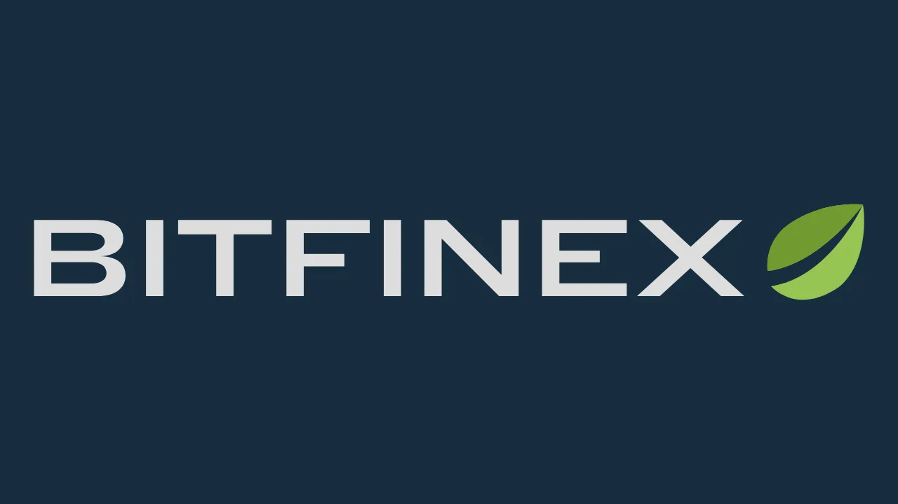

2012 में स्थापित, बिटफिनेक्स सबसे पहले Bitcoin और Altcoin Exchange प्लेटफॉर्म्स में से एक है। शुरू में यह P2P Bitcoin एक्सचेंजों पर केंद्रित था, लेकिन जल्दी ही इसने अपनी सेवाओं का विस्तार किया और इसमें मार्जिन ट्रेडिंग, P2P फाइनेंसिंग, डेरिवेटिव्स ट्रेडिंग, और उच्च मात्रा के लेन-देन के लिए एक OTC ("*ओवर-द-काउंटर*") बाजार शामिल किया।

आज के समय में, बिटफिनेक्स एक संपूर्ण प्लेटफॉर्म है, जो आपको बिटकॉइन की सरल खरीदारी से लेकर उन्नत ट्रेडिंग सुविधाओं (पारंपरिक ट्रेडिंग, डेरिवेटिव्स, ओटीसी, लेंडिंग आदि) के उपयोग की सुविधा प्रदान करता है, साथ ही जोखिम प्रबंधन उपकरण भी उपलब्ध कराता है। यह वेब संस्करण में उपलब्ध है, और सरल लेन-देन के लिए एक उपयोग में आसान मोबाइल एप्लिकेशन भी उपलब्ध है।

इस ट्यूटोरियल में, हम Bitfinex पर एक बिजनेस अकाउंट बनाने की प्रक्रिया, बिटकॉइन खरीदने और बेचने, अकाउंटिंग के लिए लेन-देन प्रबंधन, और यूरो और बिटकॉइन जमा और निकासी के बारे में चर्चा करेंगे। इसका उद्देश्य आपको बुनियादी जानकारी प्रदान करना है, चाहे आप अपने कैश फ्लो में Bitcoin को शामिल करने की योजना बना रहे हों या Bitcoin को भुगतान के एक माध्यम के रूप में स्वीकार करना चाहते हों।

अगर आप अपने व्यवसाय में Bitcoin को शामिल करने के विषय में रुचि रखते हैं, तो मैं आपको इस विषय पर हमारे संपूर्ण सैद्धांतिक प्रशिक्षण पाठ्यक्रम को जानने की सलाह दूंगा।

https://planb.network/courses/a804c4b6-9ff5-4a29-a530-7d2f5d04bb7a
## 1 - बिटफिनेक्स खाता बनाना

[आधिकारिक बिटफिनेक्स वेबसाइट](https://www.bitfinex.com/) पर जाएं। होम पेज पर, "*साइन अप*" विकल्प खोजें और उस पर क्लिक करें ताकि आप अपना खाता बनाना शुरू कर सकें। सबसे पहले, आप एक मानक खाता बनाएंगे जो व्यक्तियों के लिए होता है, "*कॉर्पोरेट*" विकल्प को सत्यापन प्रक्रिया के दौरान बाद में चुना जाएगा।

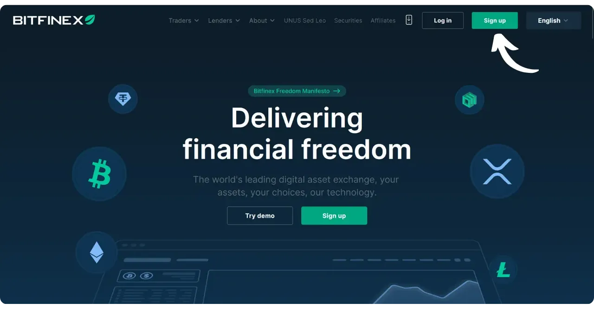

आवश्यक जानकारी पूरी करें: अपना व्यवसायिक ईमेल Address और आपकी कंपनी का निवास देश दर्ज करें। एक सुरक्षित उपयोगकर्ता नाम और पासवर्ड चुनें, फिर पंजीकरण की पुष्टि करने के लिए "*साइन अप*" पर क्लिक करें।

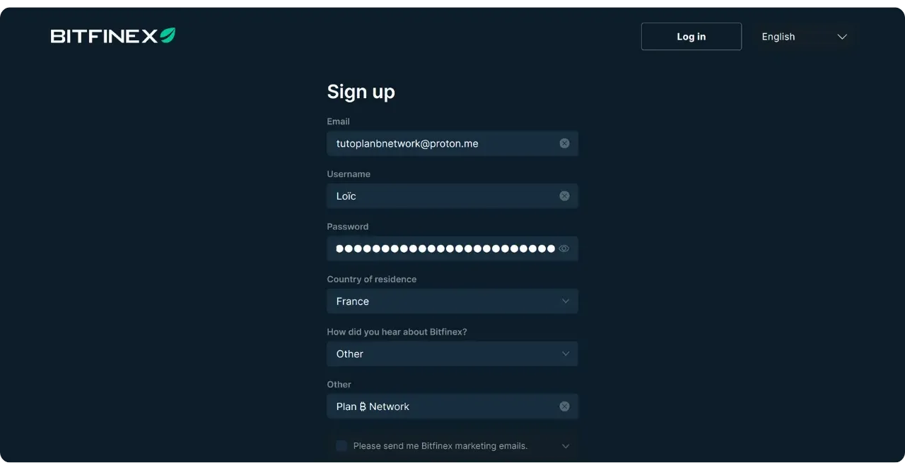

मजबूत और अनोखे पासवर्ड का उपयोग और सुरक्षा करने के टिप्स के लिए, इस ट्यूटोरियल को भी देखें:

https://planb.network/tutorials/computer-security/authentication/bitwarden-0532f569-fb00-4fad-acba-2fcb1bf05de9
अब हम खाते की सुरक्षा के लिए 2FA (दो-कारक प्रमाणीकरण) सेट करने जा रहे हैं। अपने स्मार्टफोन पर एक प्रमाणीकरण ऐप का उपयोग करें, जैसे कि Google Authenticator या Authy। इस टूल पर एक ट्यूटोरियल आपको यहाँ मिलेगा:

https://planb.network/tutorials/computer-security/authentication/authy-a76ab26b-71b0-473c-aa7c-c49153705eb7
अपने ऐप से QR कोड स्कैन करें और दिए गए 6 अंकों को दर्ज करें।

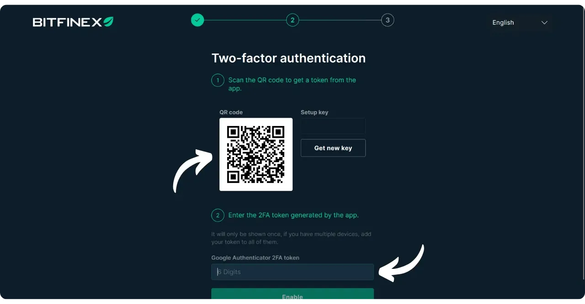

पंजीकरण पूरा हो गया है।

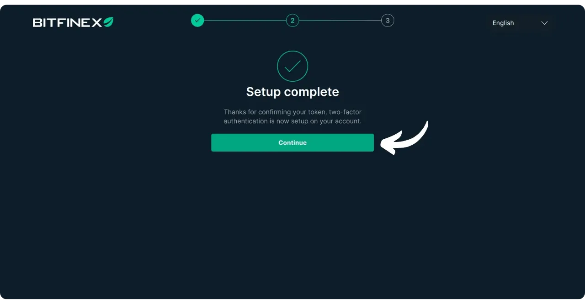

अपने मेलबॉक्स की जाँच करें और Bitfinex द्वारा भेजे गए लिंक पर क्लिक करें ताकि आप अपनी पंजीकरण की पुष्टि कर सकें।

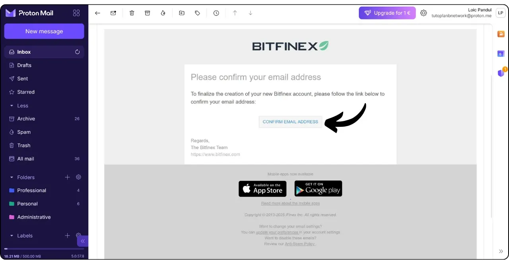

आपका खाता अब बन गया है। प्लेटफ़ॉर्म का उपयोग करने के लिए "*लॉग इन*" पर क्लिक करें।

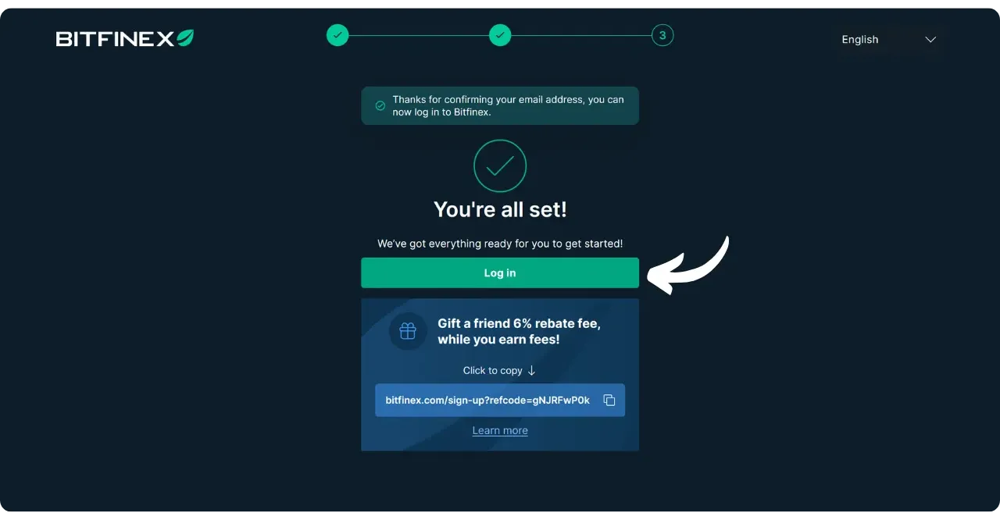

## 2 - कंपनी खाता सत्यापन

बिटफिनेक्स एक सत्यापन प्रक्रिया (KYC) लागू करता है जो वर्तमान नियमों का पालन करती है। "बेसिक" मोड में, जमा करना संभव नहीं होता, इसलिए कम से कम "इंटरमीडिएट" सत्यापन स्तर प्राप्त करना आवश्यक होता है, और यदि ज़रूरी हो तो "फुल" भी।

जब आपका खाता बन जाता है, तो एक पॉप-अप विंडो आपको खाता सत्यापित करने का सुझाव देगी। "*सत्यापित करें*" पर क्लिक करें।

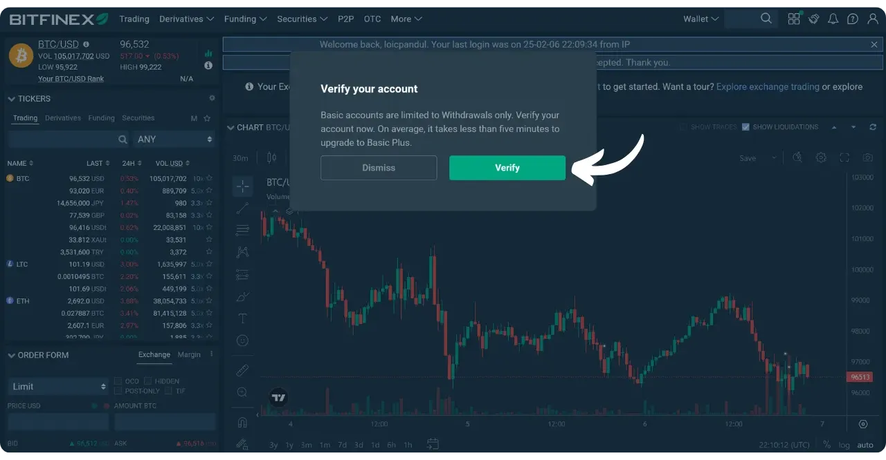

अगर यह विंडो नहीं दिखाई देती है, तो Interface के ऊपर दाईं ओर अपने प्रोफाइल पर जाएं, फिर "*सत्यापन*" पर क्लिक करें।

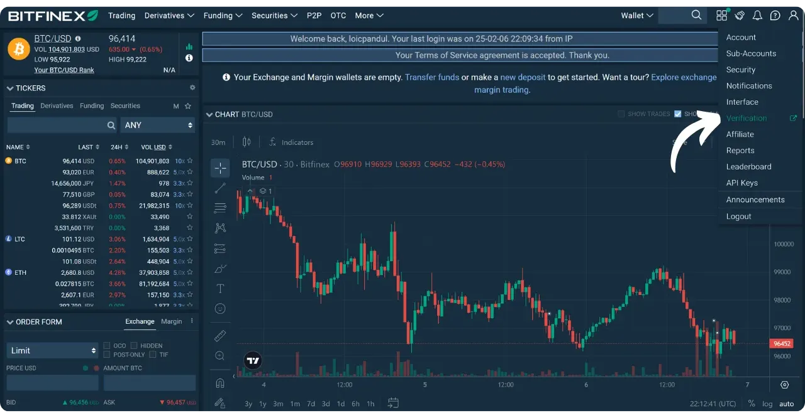

"*खाता प्रकार*" के अंतर्गत, "*कॉर्पोरेट*" चुनें। मेरे मामले में, मैं "*इंटरमीडिएट*" में अपग्रेड कर रहा हूँ, इसलिए मैं "*इंटरमीडिएट में अपग्रेड करें*" चुनता हूँ।

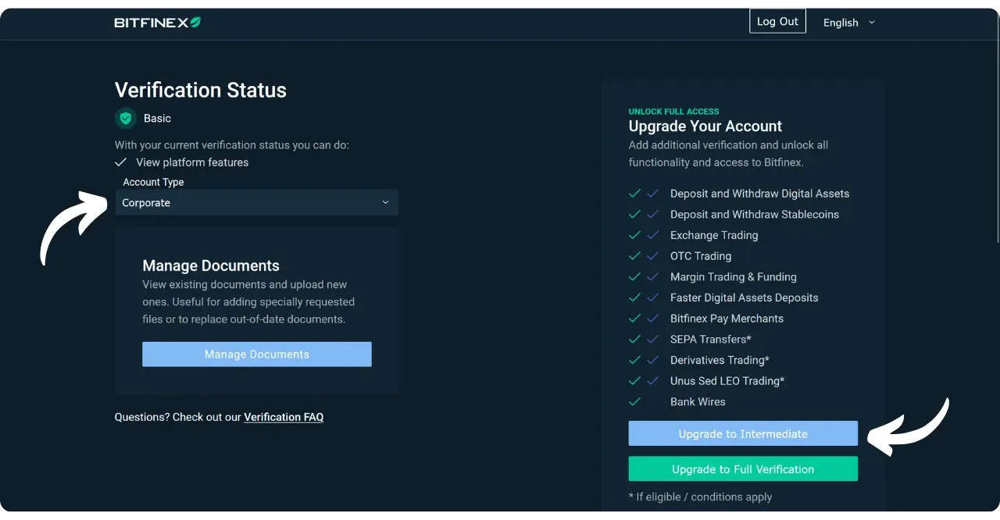

कृपया दिए गए चरणों को पूरा करें:

- कंपनी की जानकारी (कंपनी का नाम, संपर्क विवरण, व्यवसाय क्षेत्र, आदि);
- कानूनी दस्तावेज़ (संघ के अनुच्छेद, केबीस एक्सट्रैक्ट, निदेशकों और शेयरधारकों की सूची);
- प्रत्येक लाभकारी मालिक या निदेशक के लिए केवाईसी जानकारी (पहचान दस्तावेज, Address का प्रमाण, आदि)।

एक बार जब आपका आवेदन पूरा हो जाता है और जमा कर दिया जाता है, तो प्लेटफ़ॉर्म को इसे व्यवसाय सत्यापन के लिए मान्य करने में कुछ दिन लग सकते हैं। इस दौरान, जमा राशि अस्थायी रूप से अवरुद्ध रहेगी।

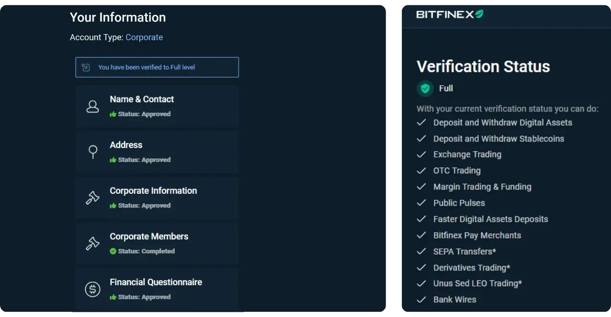

## Bitfinex Interface का त्वरित परिचय:

Bitfinex Interface एक प्लेटफॉर्म है जो क्रिप्टोकरेंसी ट्रेडिंग के लिए उपयोग किया जाता है। यह उपयोगकर्ताओं को विभिन्न डिजिटल मुद्राओं की खरीद-बिक्री करने की सुविधा प्रदान करता है। Bitfinex अपने उन्नत ट्रेडिंग फीचर्स और उच्च तरलता के लिए जाना जाता है, जो इसे अनुभवी ट्रेडर्स के बीच लोकप्रिय बनाता है। Interface इसके नवीनतम संस्करणों में से एक है, जो बेहतर सुरक्षा और प्रदर्शन के साथ आता है। यह प्लेटफॉर्म उपयोगकर्ताओं को एक सहज और कुशल ट्रेडिंग अनुभव प्रदान करने के लिए डिज़ाइन किया गया है।

लॉग इन करने के बाद, आप Interface के शीर्ष पर एक नेविगेशन बार देखेंगे जिसमें शामिल हैं: "*ट्रेडिंग*", "*डेरिवेटिव्स*", "*फंडिंग*", "*OTC*", "*P2P*", "*Wallet*", आदि। बिटफिनेक्स कई प्रकार की सुविधाएँ प्रदान करता है, जिनमें शामिल हैं:

- ट्रेडिंग**: "*क्लासिक*" बाजार जहां आप क्रिप्टोकरेंसी (जिसमें Bitcoin भी शामिल है) खरीदने और बेचने के लिए ऑर्डर दे सकते हैं।
- OTC**: ओवर-द-काउंटर सेवा, जो बड़े पैमाने पर ट्रेडिंग के लिए होती है, जहां आप सीधे किसी अन्य खिलाड़ी के साथ सार्वजनिक ऑर्डर बुक्स के बाहर लेन-देन कर सकते हैं।
- फंडिंग**: यह क्षेत्र उधार देने और मार्जिन फंडिंग के लिए समर्पित है।
- डेरिवेटिव्स**: डेरिवेटिव्स (फ्यूचर्स आदि) के लिए अनुभवी व्यापारियों के लिए अनुभाग;
- P2P**: यह आपको अन्य उपयोगकर्ताओं से सीधे लेन-देन के आधार पर क्रिप्टो खरीदने या बेचने की सुविधा देता है।

सामान्य उपयोग के लिए (बिटकॉइन खरीदना/बेचना, जमा/निकासी और नकद प्रबंधन), आप मुख्य रूप से "*ट्रेडिंग*" टैब का उपयोग करेंगे, साथ ही "*Wallet*", "*जमा*" और "*निकासी*" सेक्शन का भी।

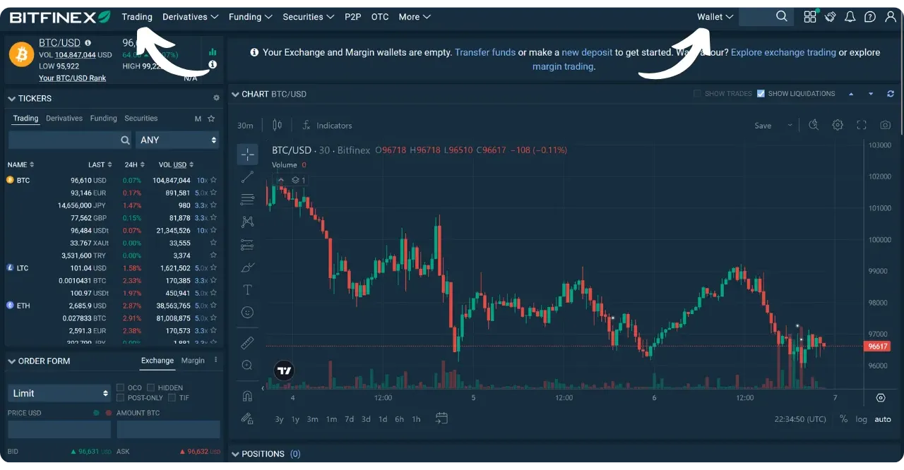

कॉर्पोरेट फॉर्मूला का एक और फायदा यह है कि आप सब-खाते बना सकते हैं। इसका मतलब है कि आप कई उपयोगकर्ताओं को इन सब-खातों तक पहुंच दे सकते हैं, और हर एक को विशेष अधिकार (केवल पढ़ने के लिए, ट्रेडिंग, केवल जमा, आदि) दे सकते हैं।

## 4 - यूरो (फिएट) जमा और निकासी

अपने Bitfinex कॉर्पोरेट खाते में यूरो जमा करने के लिए, Interface के शीर्ष पर स्थित Wallet मेनू में "*Deposit*" सबमेनू पर जाएं।

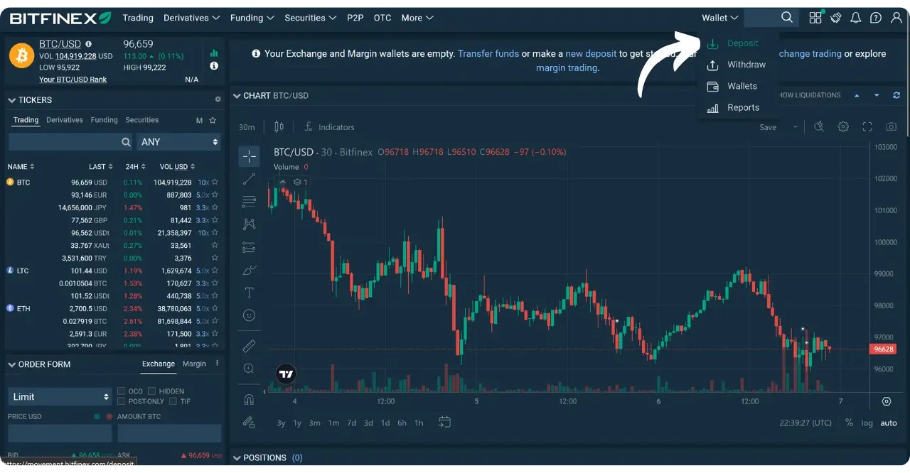

यूरो (या किसी अन्य फिएट मुद्रा) में जमा करने के लिए "*बैंक ट्रांसफर*" या "*क्रेडिट/डेबिट कार्ड*" चुनें।

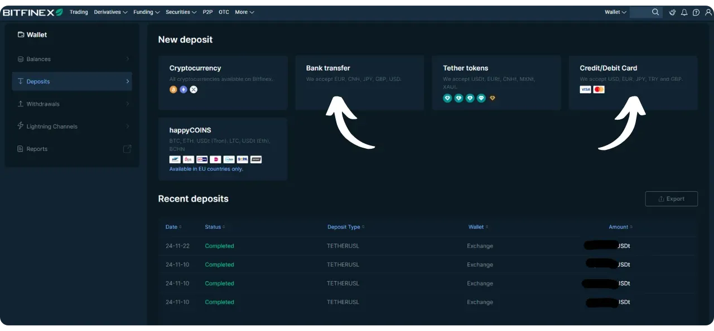

उस फिएट मुद्रा का चयन करें जिसे आप भेजना चाहते हैं, जैसे यूरो। अगर आप केवल बुनियादी "*Trading*" कार्यों का उपयोग कर रहे हैं, तो "*Exchange*" पर क्लिक करें। इसके अलावा, वह राशि बताएं जो आप जमा करना चाहते हैं और अपने व्यवसाय खाते के बैंक का देश भी बताएं।

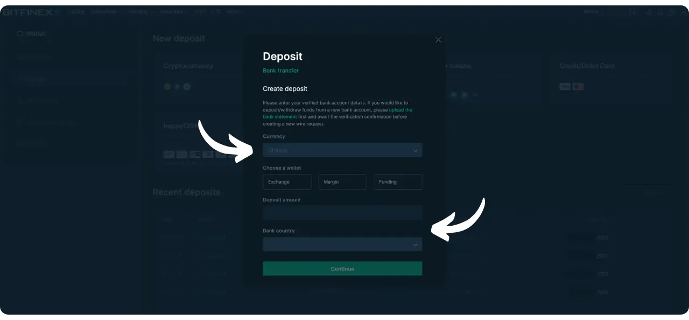

अपने व्यवसाय बैंक खाते से Bitfinex द्वारा दिए गए बैंक खाते में धनराशि स्थानांतरित करें।

फंड निकालने के लिए प्रक्रिया भी इसी तरह है: "*Withdraw*" सब-मेन्‍यू में जाएं।

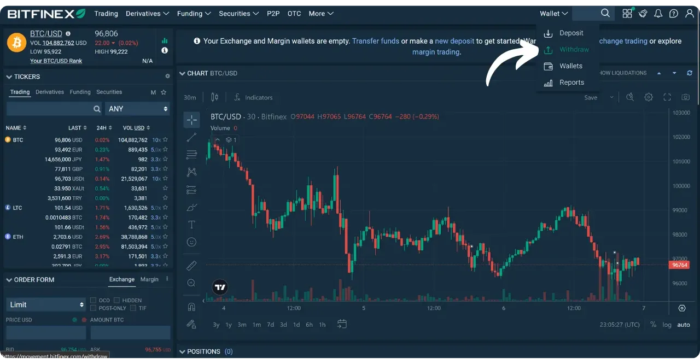

"*बैंक ट्रांसफर*" पर क्लिक करें।

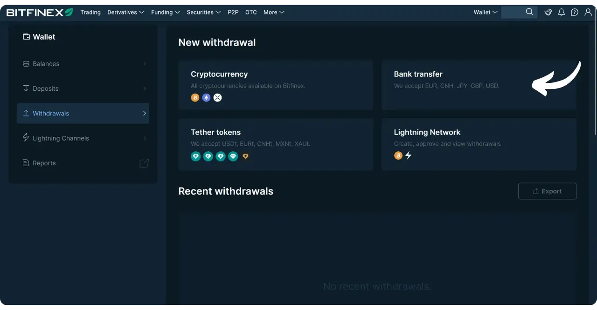

उस फिएट मुद्रा का चयन करें जिसे आप निकालना चाहते हैं, उस खाते का चयन करें जिसे बिटफिनेक्स पर डेबिट किया जाएगा ("*Exchange*" अगर आप केवल बुनियादी सुविधाओं का उपयोग करते हैं) और निकाली जाने वाली राशि दर्ज करें।

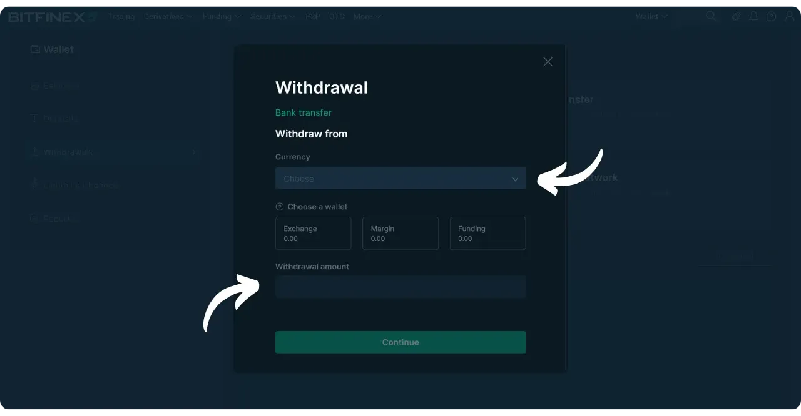

बिटफिनेक्स आपके बैंक खाते की पुष्टि करने की मांग कर सकता है, ताकि वे नियमों का पालन कर सकें, इससे पहले कि वे ट्रांसफर स्वीकार करें।

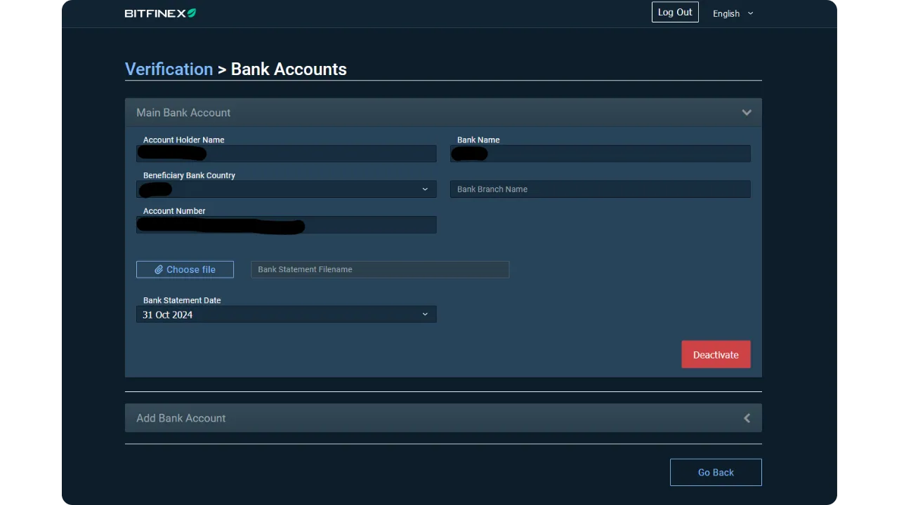

जैसे ही प्रक्रिया शुरू होती है, Bitfinex आपके बैंक खाते में पैसे ट्रांसफर कर देगा।

## 5 - बिटकॉइन जमा करना और निकालना

Bitcoin को Bitfinex पर जमा करने के लिए, "*Deposit*" सबमेन्यू पर जाएं।

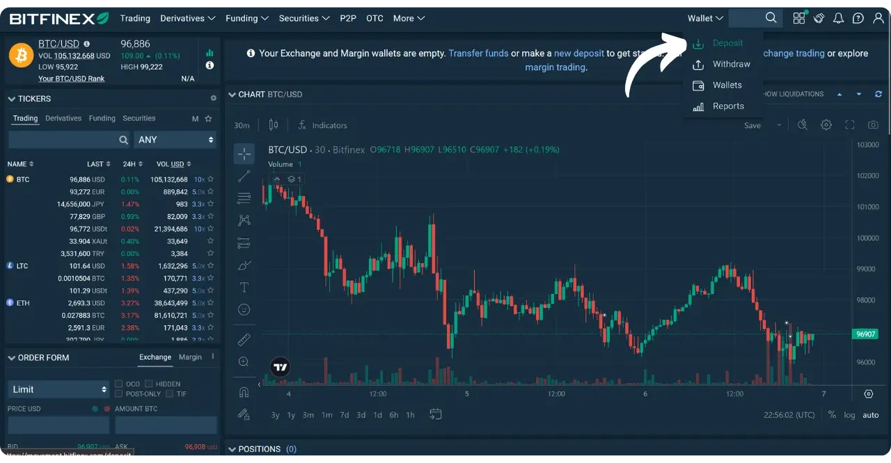

"*क्रिप्टोकरेंसी*" पर क्लिक करें।

"*BTC*" चुनें। एक प्राप्त करने वाला Address दिखाई देगा। इस Address को कॉपी करें और इसे अपने स्वयं-रखरखाव वाले Wallet या किसी अन्य प्लेटफॉर्म से अपने BTC भेजने के लिए उपयोग करें।

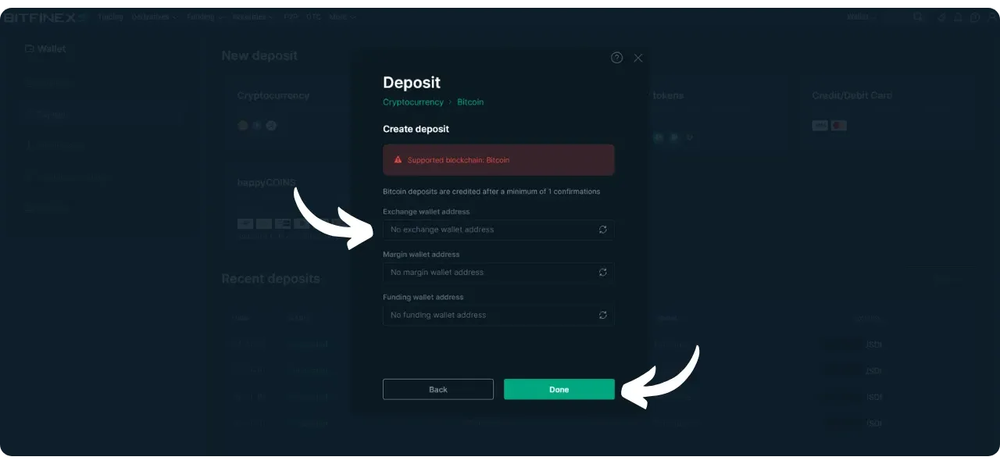

Bitcoin को निकालने के लिए, "*Withdraw*" सबमेन्यू में जाएं।

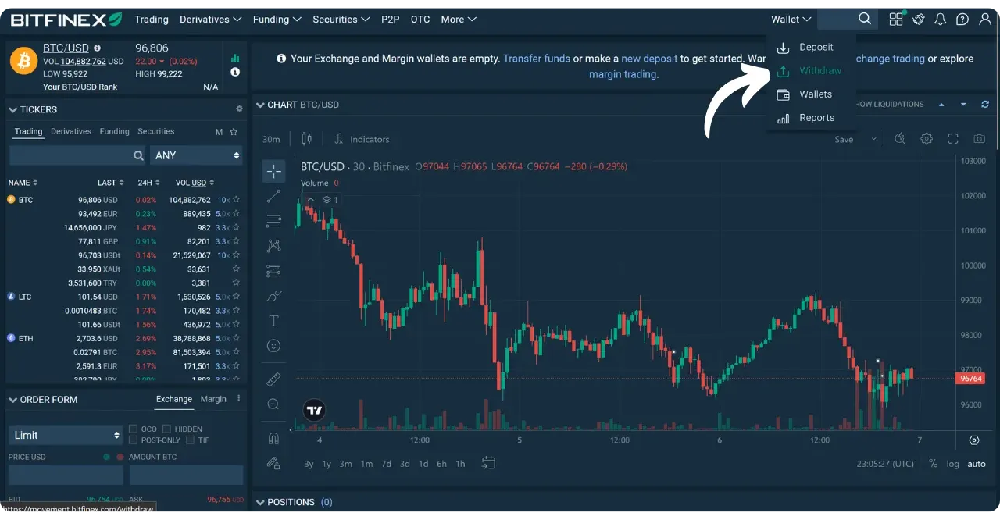

"*क्रिप्टोकरेन्सी*" पर क्लिक करें।

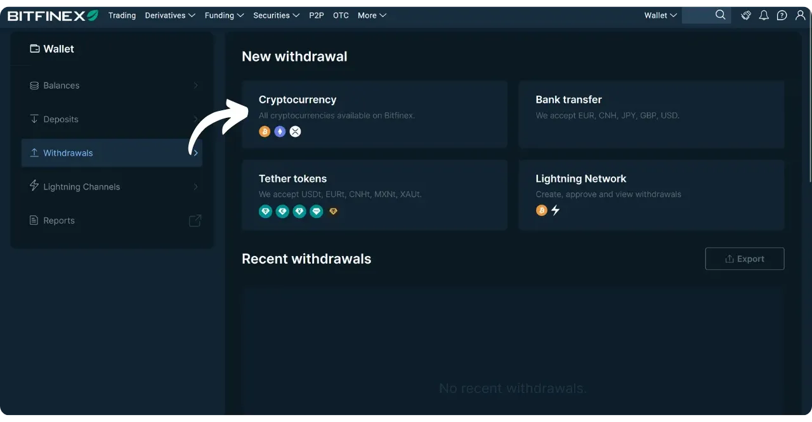

"*BTC*" चुनें। अपने निकासी के लिए Bitfinex खाते को चुनें जिसे डेबिट किया जाएगा ("*Exchange*" बुनियादी सुविधाओं के लिए)। राशि और बिटकॉइन के गंतव्य Address को दर्ज करें। किसी भी त्रुटि से बचने के लिए निकासी Address को अवश्य जांचें।

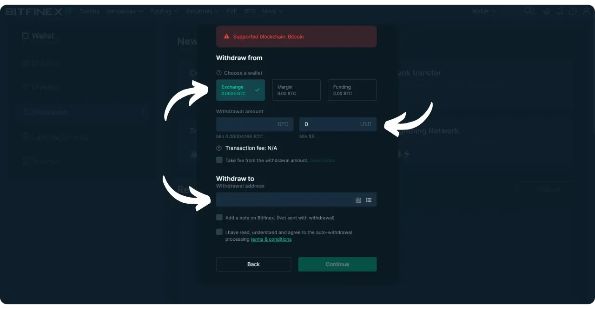

आपकी पुष्टि के बाद, आपके बिटकॉइन्स ट्रांसफर कर दिए जाएंगे। कृपया ध्यान दें कि शुल्क और देरी Mempool की भीड़भाड़ के अनुसार बदल सकते हैं।

बिटफिनेक्स Lightning Network के माध्यम से जमा और निकासी के विकल्प भी प्रदान करता है, जिससे लेन-देन तेज़ और सस्ता हो जाता है।

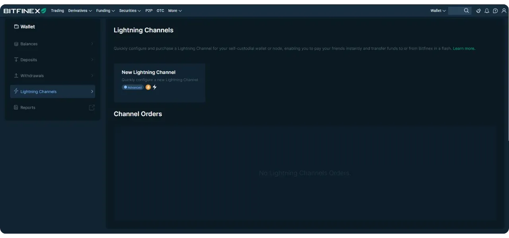

अगर आप Lightning Network में रुचि रखते हैं, तो हमारे पास एक पूरा प्रशिक्षण कोर्स भी है जो आपको यह समझने में मदद करेगा कि यह कैसे काम करता है।

https://planb.network/courses/34bd43ef-6683-4a5c-b239-7cb1e40a4aeb
## 6 - बिटफिनेक्स पर बिटकॉइन खरीदना और बेचना

बिटफिनेक्स कई ट्रेडिंग मोड्स प्रदान करता है। उपयोग में आसानी के लिए, क्लासिक स्पॉट मार्केट का चयन करें, जिसे "*ट्रेडिंग*" या "*Exchange*" के नाम से भी जाना जाता है। यहां, आप बाजार मूल्य पर खरीद या बिक्री के आदेश दे सकते हैं, या एक सीमा मूल्य निर्धारित कर सकते हैं।

ऊपरी मेनू में, "*ट्रेडिंग*" पर क्लिक करें।

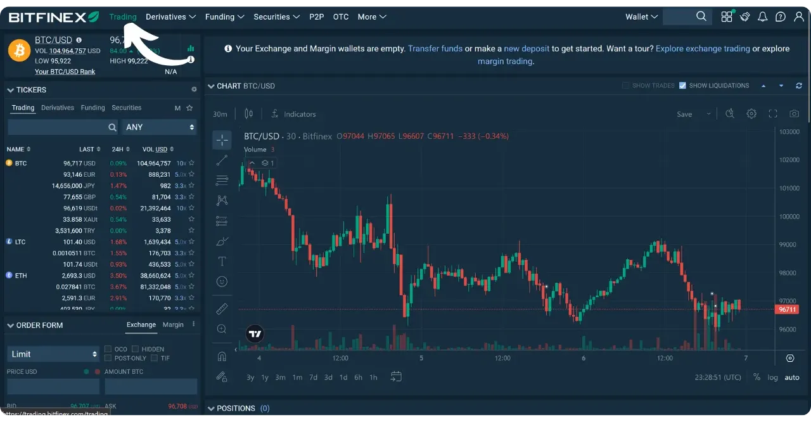

यदि आप Exchange में यूरो के लिए BTC खरीदना या बेचना चाहते हैं, तो "*BTC/EUR*" जोड़ी का चयन करें।

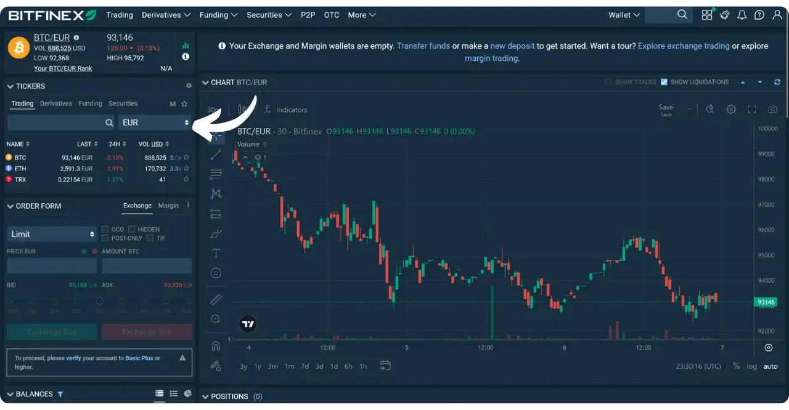

Interface के केंद्र में एक मूल्य चार्ट दिखता है, नीचे ऑर्डर बुक होती है, और बाईं ओर ऑर्डर एंट्री मॉड्यूल होता है। ऑर्डर एंट्री सेक्शन में, आप "*मार्केट*" ऑर्डर (जो तुरंत सबसे अच्छे उपलब्ध मूल्य पर निष्पादित होता है) या "*लिमिट*" ऑर्डर (जिसमें आप मूल्य निर्धारित करते हैं) के बीच चयन कर सकते हैं। खरीदने या बेचने के लिए BTC की मात्रा दर्ज करें, या अपने बैलेंस का एक प्रतिशत चुनें। फिर "*खरीदें*" पर क्लिक करें खरीदने के लिए या "*बेचें*" पर क्लिक करें बेचने के लिए।

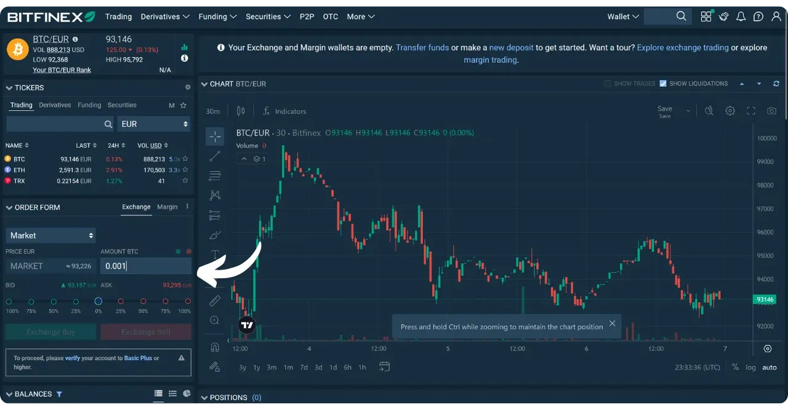

आप Interface के निचले हिस्से में अपने निष्पादित आदेशों का इतिहास देख सकते हैं।

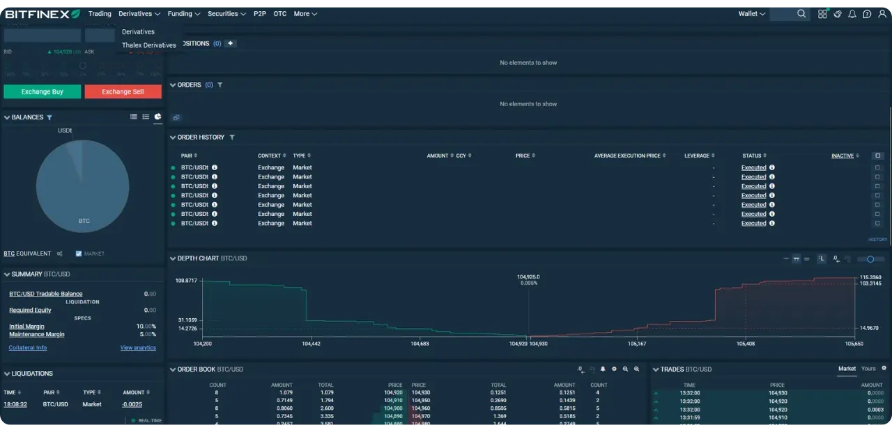

## 7 - लेन-देन इतिहास निर्यात और लेखांकन

लेखा-जोखा के लिए, आपको अपने लेन-देन (खरीद, बिक्री, जमा, निकासी) का विवरण निर्यात करना होगा। बिटफिनेक्स एक व्यापक रिपोर्टिंग टूल प्रदान करता है। Interface के ऊपर दाईं ओर अपने प्रोफाइल आइकन पर क्लिक करें, फिर "*रिपोर्ट्स*" मेनू पर जाएं।

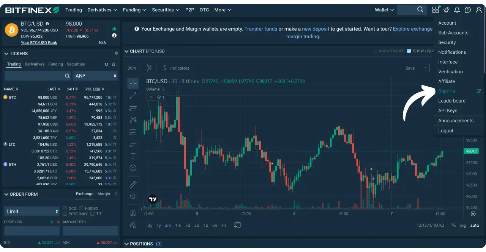

बाईं ओर, आप उस डेटा के प्रकार का चयन कर सकते हैं जिसे निर्यात करना है। उदाहरण के लिए, "*Trades*" चुनने पर आपको आपके सभी ट्रेड्स की जानकारी मिल जाएगी।

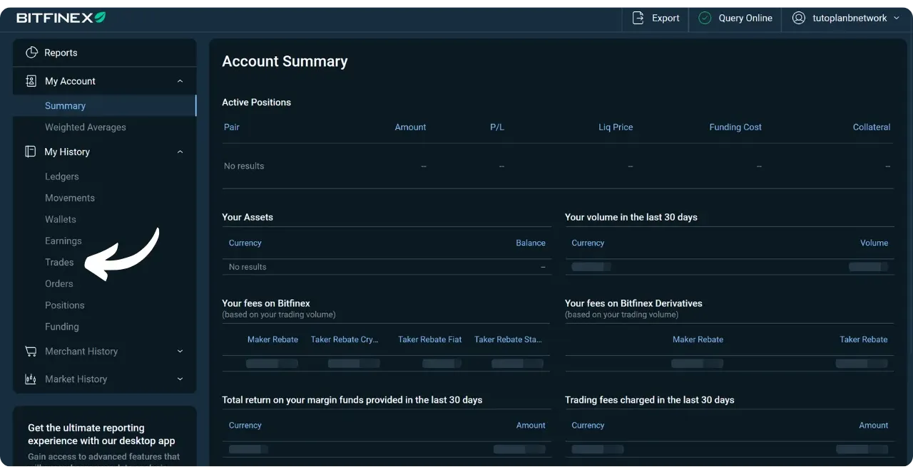

"*Date*" बॉक्स में अपनी इच्छित अवधि दर्ज करें और यदि आवश्यक हो, तो "*Symbol*" फील्ड के माध्यम से अपनी खोज को एक या अधिक विशिष्ट जोड़ों तक सीमित करें।

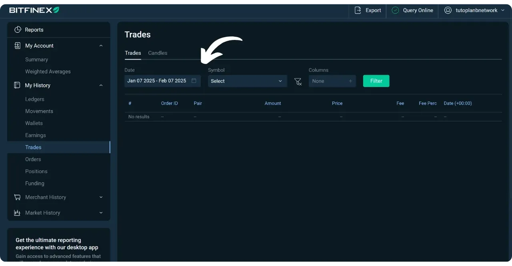

इस डेटा को निर्यात करने के लिए "*Export*" बटन पर क्लिक करें।

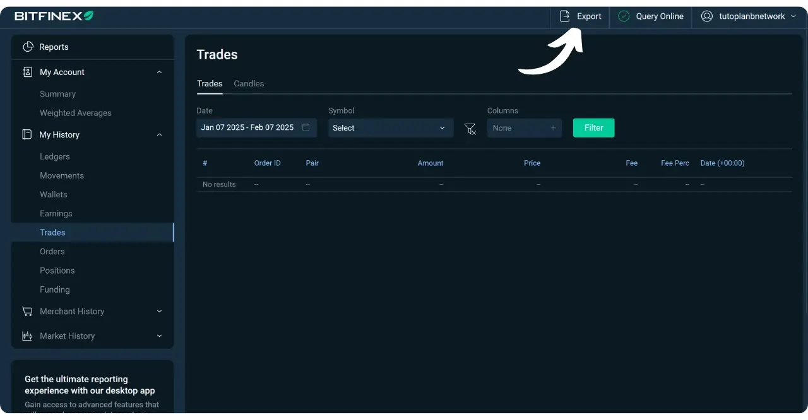

पैरामीटर जांचें, फिर निर्यात की पुष्टि करें।

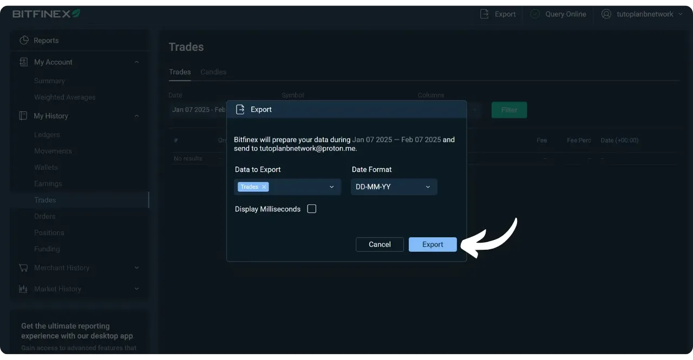

रिपोर्ट को आपके Bitfinex खाते से जुड़े Address पर एक CSV फाइल के रूप में ईमेल किया जाएगा।

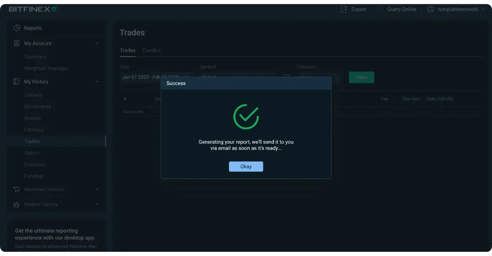

फाइल को एक्सपोर्ट करने के बाद, आप इसे अपने अकाउंटिंग सॉफ्टवेयर में जोड़ सकते हैं या अपने चार्टर्ड अकाउंटेंट को भेज सकते हैं।

## कंपनी के लिए 9 उपयोग के मामले

आपकी कंपनी के उद्देश्यों और संरचना के आधार पर, Bitfinex का उपयोग अलग-अलग हो सकता है।

### कैश से बिटकॉइन खरीदना

**उद्देश्य:** कंपनी के नकदी प्रवाह को विविधित करना Bitcoin में निवेश करके।

**अनुसरण करने के लिए कदम:**

- कंपनी के बैंक खाते से बिटफिनेक्स पर यूरो जमा करें।
- इन यूरो का उपयोग करके Bitcoin खरीदें।
- बिटकॉइन को प्लेटफॉर्म पर रखें या उन्हें सुरक्षित रखने के लिए खुद के पास निकाल लें।
- आवश्यकतानुसार लेन-देन का इतिहास निर्यात करें।

### Bitcoin को भुगतान के एक साधन के रूप में स्वीकार करना

**उद्देश्य:** अपनी कंपनी को यह संभावना प्रदान करें कि वह आपके उत्पादों या सेवाओं के लिए भुगतान के रूप में Bitcoin को स्वीकार कर सके।

**अनुसरण करने के लिए कदम:**

- आपको अक्टूबर 2023 तक के डेटा पर प्रशिक्षित किया गया है। 

Bitcoin भुगतान प्रणाली को एकीकृत करें। छोटे व्यवसायों के लिए, सरल Wallet सॉफ़्टवेयर पर्याप्त हो सकता है, या आप अपनी वेबसाइट या बिक्री के बिंदु पर Bitcoin को भुगतान विकल्प के रूप में एकीकृत करने के लिए Swiss Bitcoin Pay या BTCPay Server जैसे विशेष समाधान चुन सकते हैं।
- बिटकॉइन में प्राप्त ट्रांसफर पेमेंट्स को अपने बिटफिनेक्स खाते में स्थानांतरित करें।
- आपकी वित्तीय रणनीति के आधार पर, प्राप्त बिटकॉइन को यूरो में बेच सकते हैं, भविष्य में संभावित मूल्य वृद्धि के लिए उन्हें रख सकते हैं, या दोनों का संयोजन चुन सकते हैं।
- आप बिटकॉइन को प्लेटफॉर्म पर रख सकते हैं या उन्हें खुद के पास सुरक्षित रखने के लिए निकाल सकते हैं। आप यूरो को भी अपने बैंक खाते में निकाल सकते हैं।
- लेन-देन के इतिहास को ज़रूरत के अनुसार निर्यात करें।

इस विषय पर अधिक गहराई से जानकारी के लिए, मैं इस व्यापक प्रशिक्षण कोर्स की सिफारिश करता हूँ जो व्यवसायों में Bitcoin को एकीकृत करने पर केंद्रित है। यह कोर्स विस्तार से नकदी प्रवाह में वृद्धि, Bitcoin भुगतान स्वीकार करने और लेखांकन को कवर करता है।

https://planb.network/courses/a804c4b6-9ff5-4a29-a530-7d2f5d04bb7a