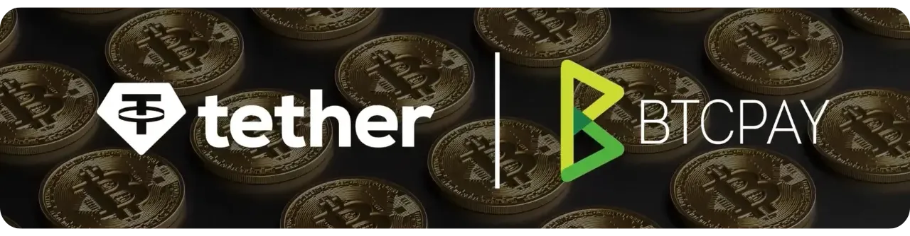

इस वीडियो में, आप जानेंगे कि अपने ऑनलाइन स्टोर्स के लिए BTCPay Server पर USDT प्लगइन कैसे सेट करें। आप सीखेंगे कि प्लगइन मैनेजर के माध्यम से प्लगइन कैसे इंस्टॉल करें, बेहतर उपलब्धता के लिए समर्पित नोड्स का उपयोग करके सर्वर सेटिंग्स को कैसे कॉन्फ़िगर करें, और सुरक्षित रूप से भुगतान प्राप्त करने के लिए अपने वॉलेट्स को कैसे सेट अप करें।

