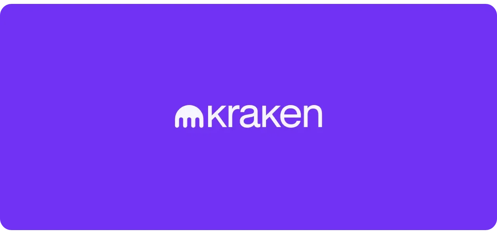

क्रैकन दुनिया के सबसे प्रसिद्ध क्रिप्टोक्यूरेंसी Exchange प्लेटफॉर्म्स में से एक है। यह उन कंपनियों के लिए कई सेवाएं प्रदान करता है जो अपने वित्तीय प्रबंधन में Bitcoin को शामिल करना चाहती हैं।

इस ट्यूटोरियल में, हम एक क्रैकन बिजनेस अकाउंट बनाने की प्रक्रिया, बिटकॉइन खरीदने और बेचने, अकाउंटिंग के लिए लेन-देन प्रबंधन, और यूरो और बिटकॉइन जमा और निकासी के बारे में चर्चा करेंगे। इसका उद्देश्य आपको बुनियादी जानकारी प्रदान करना है, चाहे आप अपने कैश फ्लो में Bitcoin को शामिल करने पर विचार कर रहे हों या Bitcoin को भुगतान के एक माध्यम के रूप में स्वीकार कर रहे हों।

अगर आप अपने व्यवसाय में Bitcoin को शामिल करने के विषय में रुचि रखते हैं, तो मैं आपको इस विषय पर हमारे संपूर्ण सैद्धांतिक प्रशिक्षण पाठ्यक्रम को जानने की भी सलाह दूंगा।

https://planb.network/courses/a804c4b6-9ff5-4a29-a530-7d2f5d04bb7a
## 1 - एक क्रैकन कॉर्पोरेट खाता बनाना

कंपनी की वित्तीय प्रबंधन के लिए Kraken का उपयोग करने का पहला कदम, निश्चित रूप से, एक खाता बनाना है। यहाँ, हम व्यक्तिगत खाता नहीं, बल्कि एक कॉर्पोरेट खाता बनाएंगे, जो न केवल नियामक अनुपालन सुनिश्चित करता है, बल्कि विशेष रूप से तैयार की गई सुविधाएँ जैसे कि अकाउंटिंग एक्सपोर्ट्स भी प्रदान करता है।

आधिकारिक वेबसाइट [kraken.com](https://www.kraken.com/) पर जाएं और "*साइन अप*" बटन पर क्लिक करें।

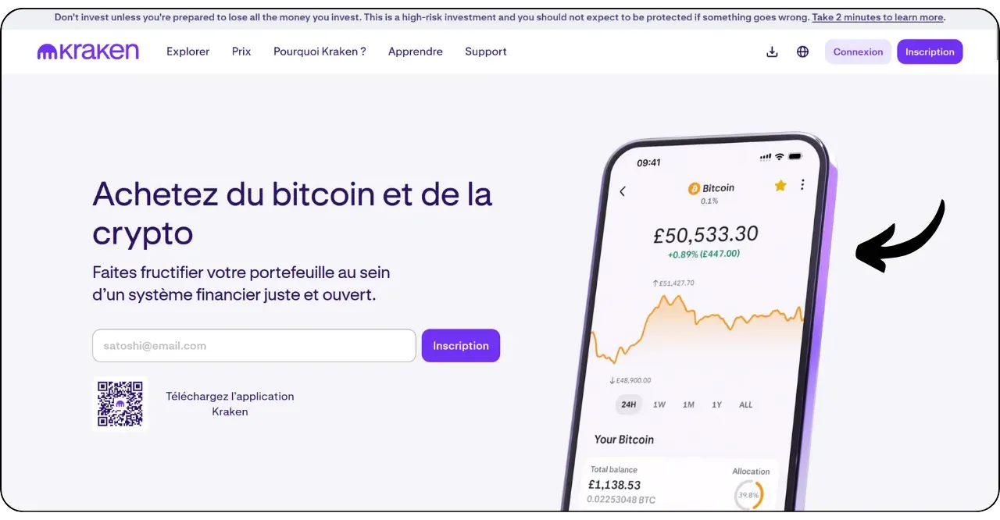

पंजीकरण पृष्ठ पर, खाता विकल्पों में से "*व्यवसाय*" टैब चुनें ताकि आप एक व्यवसाय खाता बना सकें।

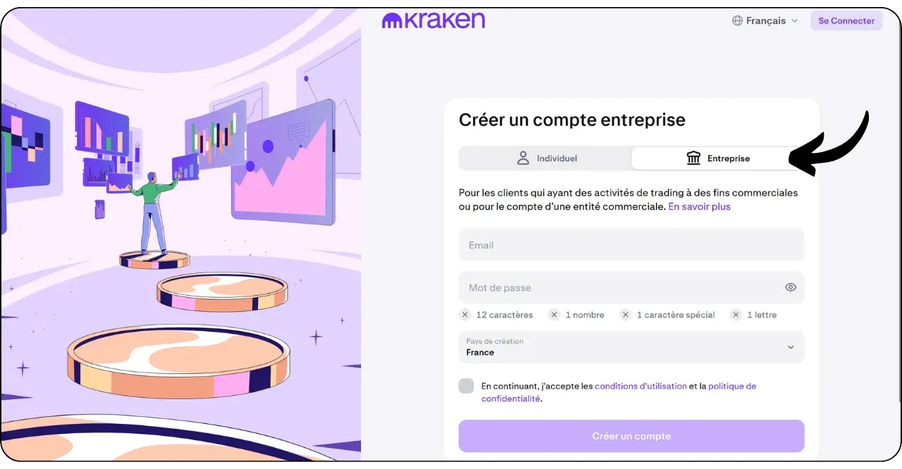

अपना पेशेवर ई-मेल Address दर्ज करें और एक सुरक्षित पासवर्ड चुनें। जब यह जानकारी दर्ज कर लें, तो पंजीकरण पूरा करने के लिए "*खाता बनाएं*" पर क्लिक करें।

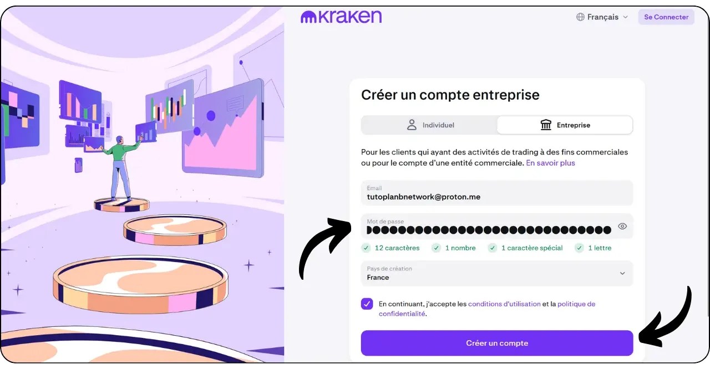

जब आप अपनी जानकारी प्रदान कर देंगे, तो Kraken आपको एक सक्रियण ई-मेल भेजेगा।

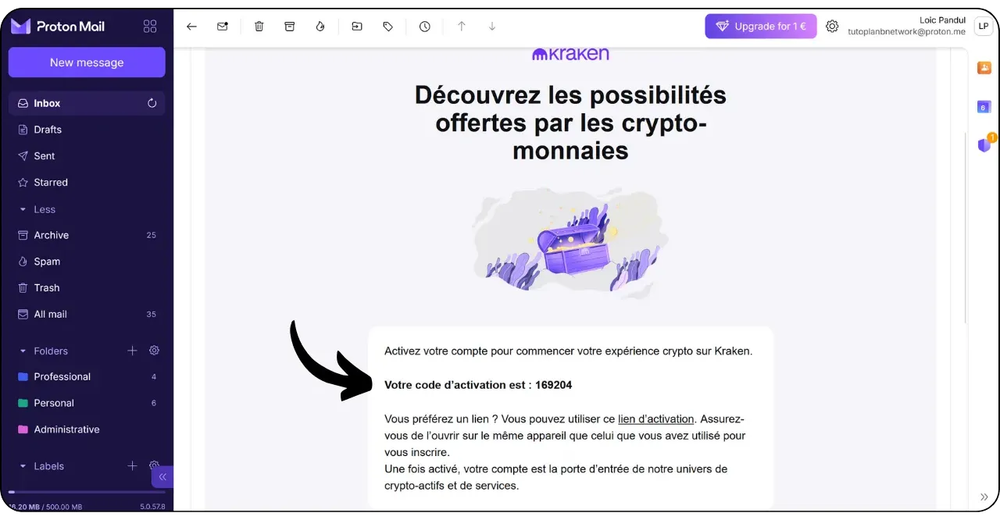

इस ई-मेल को खोलें और "*खाता सक्रिय करें*" पर क्लिक करें या अपना खाता सक्रिय करने के लिए दिए गए 6-अंकीय कोड को दर्ज करें।

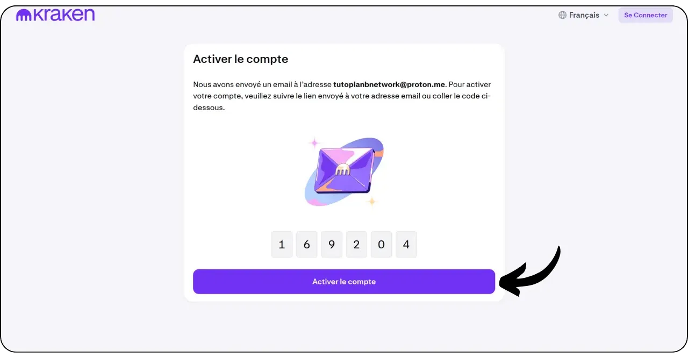

## 2 - कंपनी खाता सत्यापन

अपने खाते को बनाने के बाद, आपको कॉर्पोरेट खातों के लिए केवाईसी (*अपने ग्राहक को जानें*) सत्यापन प्रक्रिया पूरी करनी होगी। यह कदम Kraken को आपकी कंपनी की वैधता और वित्तीय नियमों के अनुपालन की पुष्टि करने की अनुमति देता है।

"*जारी रखें*" बटन पर क्लिक करें।

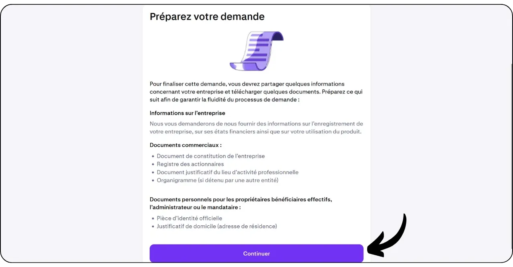

कृपया अपनी कंपनी के बारे में आवश्यक जानकारी दर्ज करें।

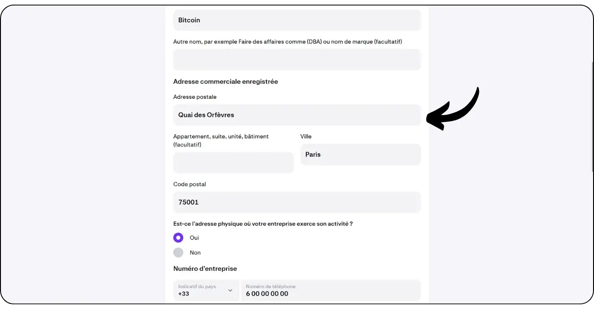

आपको अपनी कंपनी से संबंधित कई दस्तावेज़ भी अपलोड करने होंगे।

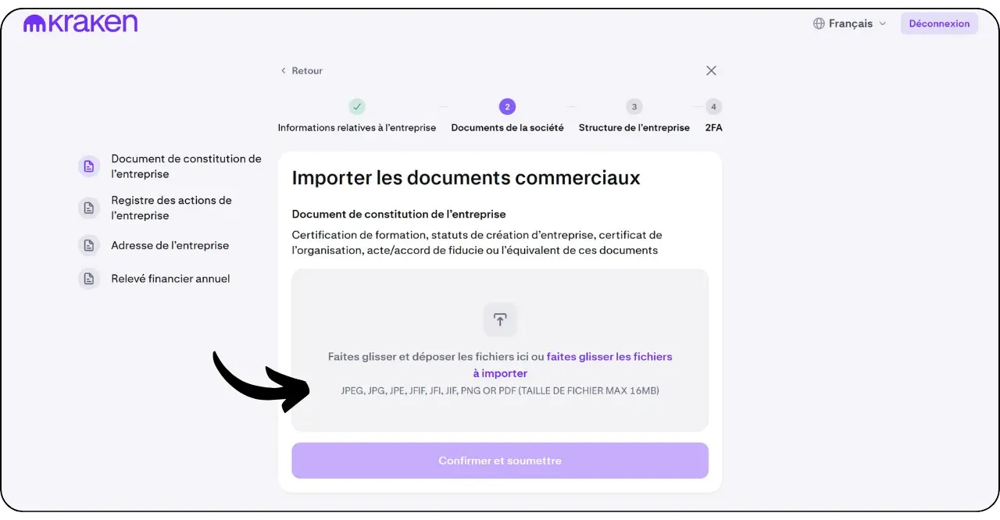

जब आप सभी हिस्से पूरा कर लें और जरूरी दस्तावेज़ भेज दें, तो "*Submit*" पर क्लिक करें ताकि आपकी सत्यापन अनुरोध भेजा जा सके। आपके अनुरोध को प्रक्रिया में दो हफ्ते तक लग सकते हैं। प्रक्रिया को तेज़ करने के लिए, सुनिश्चित करें कि आप शुरू में ही सभी आवश्यक दस्तावेज़ प्रदान कर दें।

## 3 - खाता सुरक्षा

एक बार जब आपका खाता सत्यापित हो जाता है, तो आप उस प्लेटफॉर्म तक पहुंच जाएंगे जहां आपको दो इंटरफेस की पेशकश की जाएगी:

- क्रैकन**: एक सरल Interface जो आवश्यक कार्यक्षमता प्रदान करता है।
- क्रैकन प्रो**: एक उन्नत Interface है जिसमें विशेष रूप से ट्रेडिंग के लिए अतिरिक्त सुविधाएँ हैं।

यदि आपका उद्देश्य केवल Bitcoin खरीदना और बेचना है, तो सरल Interface का चयन करें। आपके पास बाद में आवश्यकता पड़ने पर उन्नत Interface में बदलने का विकल्प हमेशा रहेगा।

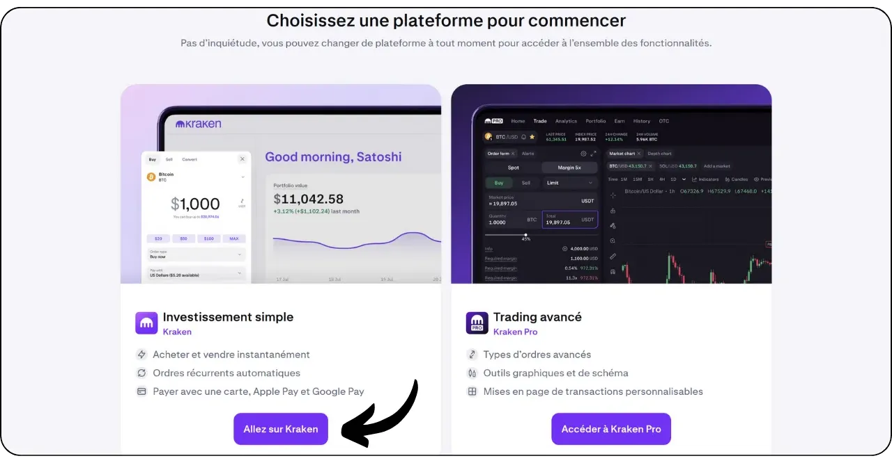

सबसे पहले और सबसे ज़रूरी बात यह है कि अपने खाते को सुरक्षित करना बहुत महत्वपूर्ण है ताकि अनधिकृत पहुंच को रोका जा सके। पंजीकरण के समय बनाए गए मजबूत पासवर्ड के अलावा, हम डबल ऑथेंटिकेशन लागू करेंगे। इसका मतलब यह है कि जब भी आप अपने Kraken खाते में लॉग इन करेंगे, तो आपको न केवल अपना पासवर्ड चाहिए होगा, बल्कि एक दूसरा ऑथेंटिकेशन फैक्टर भी चाहिए होगा, जो कि एक भौतिक कुंजी या एक ऑथेंटिकेशन एप्लिकेशन द्वारा उत्पन्न कोड हो सकता है।

अपने खाता आइकन पर जाएं और "*सुरक्षा*" पर क्लिक करें।

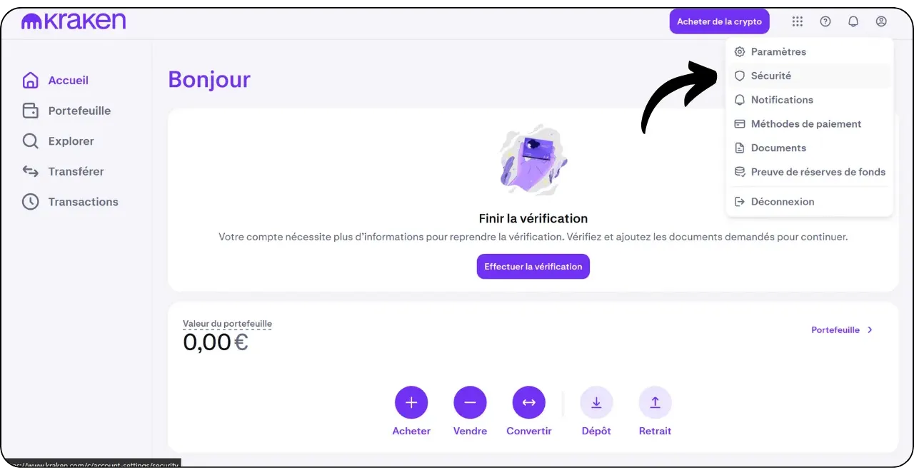

2FA विकल्पों में, आप दूसरे कारक के रूप में एक भौतिक सुरक्षा कुंजी का उपयोग करने का चयन कर सकते हैं।

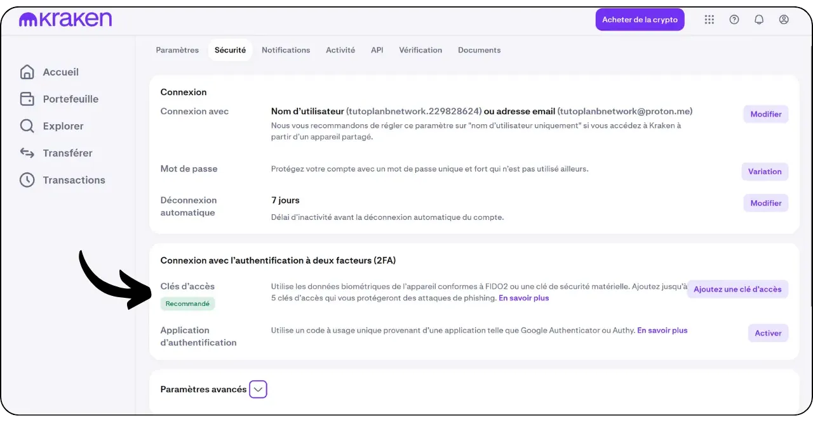

इस प्रकार के डिवाइस का उपयोग कैसे करें, इस पर अधिक जानकारी के लिए हमारा विशेष ट्यूटोरियल देखें:

https://planb.network/tutorials/computer-security/authentication/security-key-61438267-74db-4f1a-87e4-97c8e673533e
दूसरा विकल्प यह है कि आप Google Authenticator या Authy जैसी प्रमाणीकरण एप्लिकेशन का उपयोग करें। ये एप्लिकेशन हर बार जब आप लॉग इन करते हैं, तो एक डायनामिक 6-अंकीय कोड प्रदान करती हैं, जिसे आपको दर्ज करना होगा।

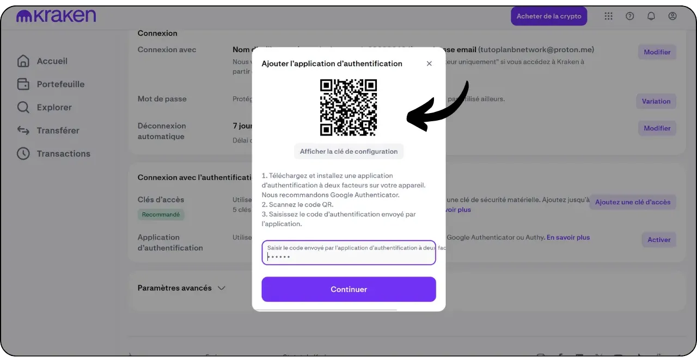

इस विधि को सक्रिय करने के लिए, अपने स्मार्टफोन पर अपनी पसंद के ऐप से QR कोड स्कैन करें, फिर उत्पन्न 6-अंकीय कोड दर्ज करें।

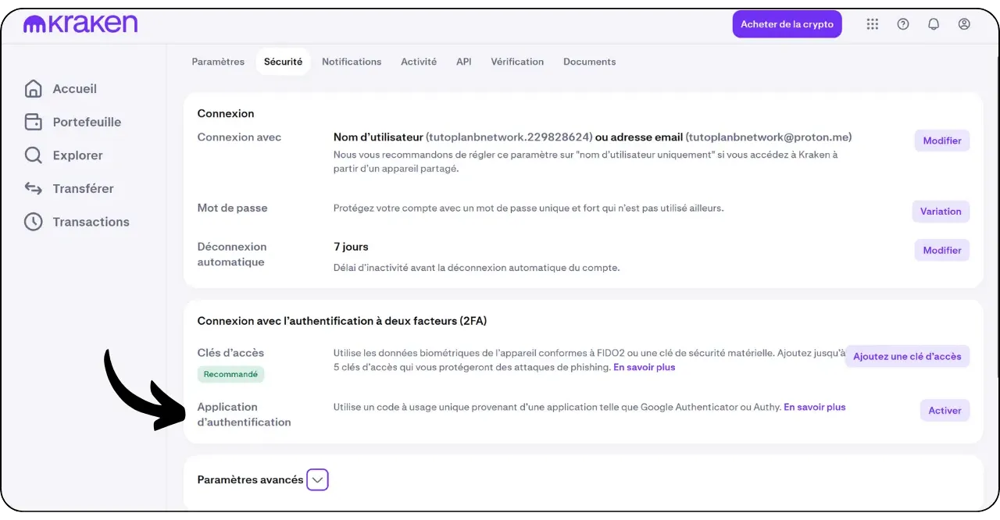

प्रमाणीकरण एप्लिकेशन के बारे में अधिक जानकारी के लिए, आप इस ट्यूटोरियल को भी देख सकते हैं:

https://planb.network/tutorials/computer-security/authentication/authy-a76ab26b-71b0-473c-aa7c-c49153705eb7
नीचे आपको उन्नत सेटिंग्स का भी एक्सेस मिलता है, जिसमें कई अलग-अलग 2FA सेट करने की क्षमता शामिल है। Kraken उन्नत सुरक्षा प्रबंधन 2FA के माध्यम से प्रदान करता है। यह सुविधा आपको विभिन्न कार्यों के लिए अलग-अलग 2FA स्तर बनाने की अनुमति देती है, जैसे लॉगिन, ऑर्डर सत्यापन और फंड निकासी। इससे यह संभव हो जाता है, उदाहरण के लिए, एक अकाउंटेंट को कुछ कार्यक्षमताओं का एक्सेस देना बिना उसे फंड निकालने की अनुमति दिए। यहाँ विकल्प दिए गए हैं:

- **मास्टर की** एक रिकवरी तंत्र के रूप में काम करती है, जिसका उपयोग तब किया जाता है जब आप अपने सामान्य 2FA (दो-कारक प्रमाणीकरण) विधि से लॉग इन नहीं कर पाते हैं।
- **वित्तीय लेन-देन के लिए 2FA** का मतलब है कि जब भी आप कोई धनराशि निकालते हैं या Address जमा करते हैं, तो आपको अतिरिक्त प्रमाणीकरण की आवश्यकता होती है। इससे आपके धन की सुरक्षा और भी मजबूत हो जाती है।
- **ट्रेडिंग के लिए 2FA** का मतलब है कि खाते पर की जाने वाली हर लेन-देन के लिए 2FA लागू होता है।

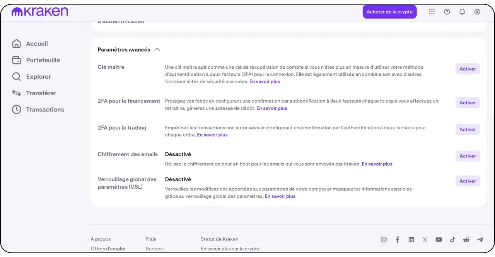

ये उन्नत विकल्प आपको अपनी संस्था के भीतर विभिन्न स्तरों की अनुमति निर्धारित करने की सुविधा देते हैं।

## 4 - फिएट मुद्रा का जमा और निकासी

एक बार जब आपका खाता सत्यापित और सुरक्षित हो जाए, तो आप यूरो (या अपनी स्थानीय मुद्रा) में धनराशि जमा कर सकते हैं। आप अपने व्यवसाय की जरूरतों के अनुसार निकासी भी कर सकते हैं।

यूरो जमा करने के लिए, "*ट्रांसफर*" सेक्शन में जाएं।

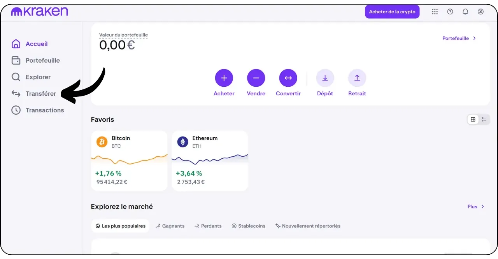

"*एसेट*" बॉक्स में "*यूरो*" चुनें और अपने व्यवसाय बैंक खाते से भुगतान करने के लिए आवश्यक विवरण प्राप्त करने की पुष्टि करें। आप क्रेडिट कार्ड से भुगतान करने का विकल्प भी चुन सकते हैं।

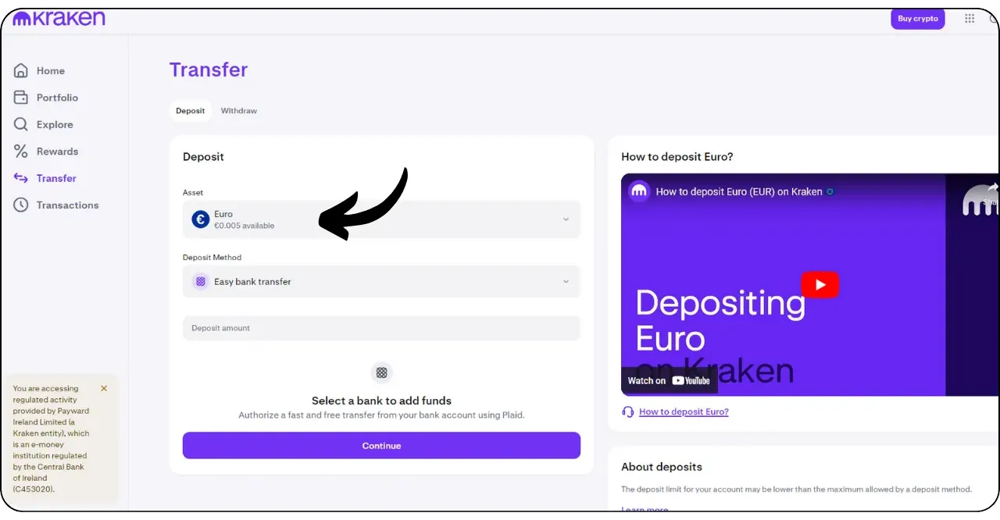

अपने Kraken खाते से यूरो निकालने के लिए, वही प्रक्रिया अपनाएं लेकिन "*Withdraw*" टैब का उपयोग करें।

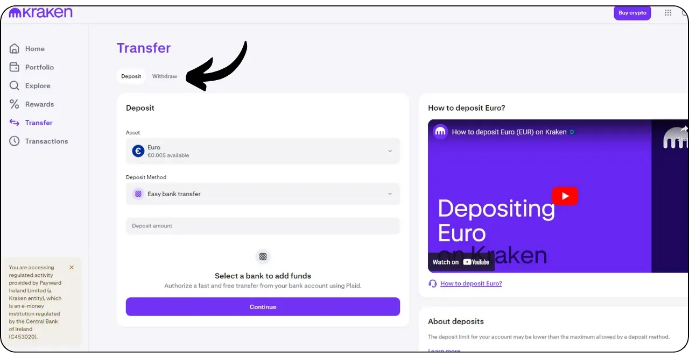

## 5 - बिटकॉइन जमा करना और निकालना

अपने Kraken खाते में बिटकॉइन जमा करने के लिए, "*Transfer*" सेक्शन में वापस जाएं। "*Asset*" बॉक्स में "*BTC*" चुनें, फिर पुष्टि करें ताकि आपको Address प्राप्त हो सके, जिसमें आपको अपने स्व-कस्टडी Wallet से बिटकॉइन भेजने होंगे।

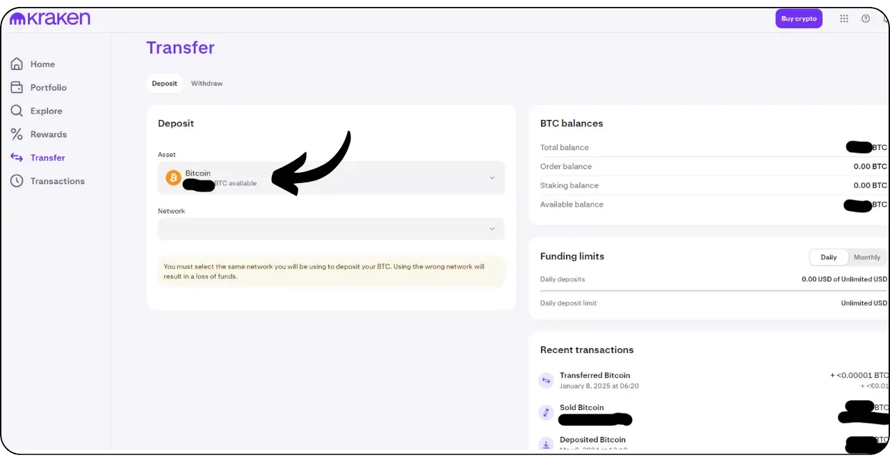

अपने Kraken खाते से बिटकॉइन को स्वयं-हिफाज़त Wallet में निकालने के लिए, "*Withdraw*" टैब पर क्लिक करें।

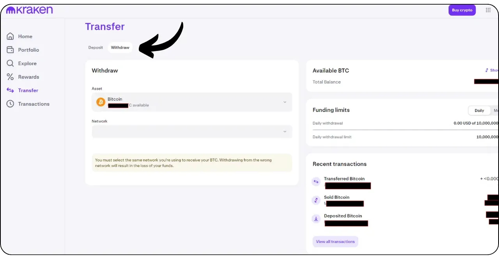

अपना Wallet और Address दर्ज करें, फिर 2FA का उपयोग करके ऑपरेशन की पुष्टि करें।

## 6 - बिटकॉइन खरीदना और बेचना

क्रैकेन विभिन्न ट्रेडिंग इंटरफेस प्रदान करता है, जो विशेष जरूरतों को पूरा करने के लिए डिज़ाइन किए गए हैं। पेशेवर और उन्नत प्रबंधन के लिए, क्रैकेन प्रो की सिफारिश की जाती है। सरल लेन-देन के लिए, क्रैकेन का डिफ़ॉल्ट Interface पर्याप्त होगा। Interface को बदलने के लिए, स्क्रीन के ऊपर दाईं ओर छोटे बिंदुओं पर क्लिक करें।

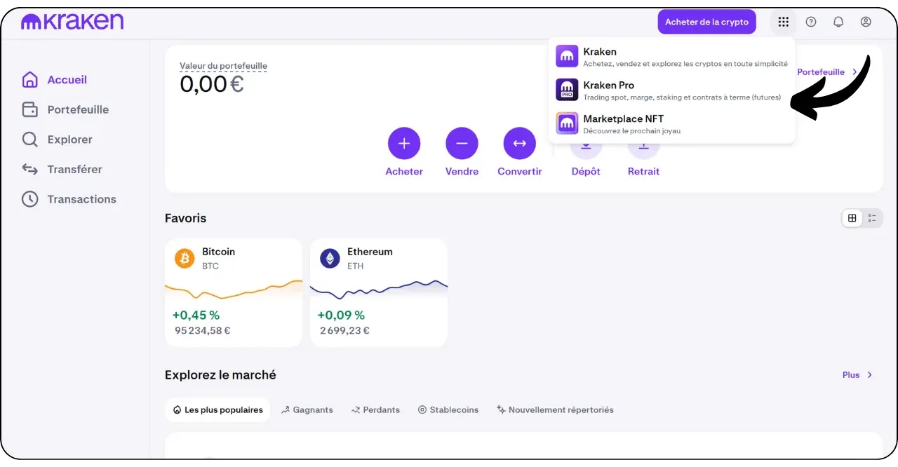

डिफॉल्ट Interface पर, Bitcoin खरीदने के लिए, सबसे पहले होम पेज पर "*Buy*" पर क्लिक करें।

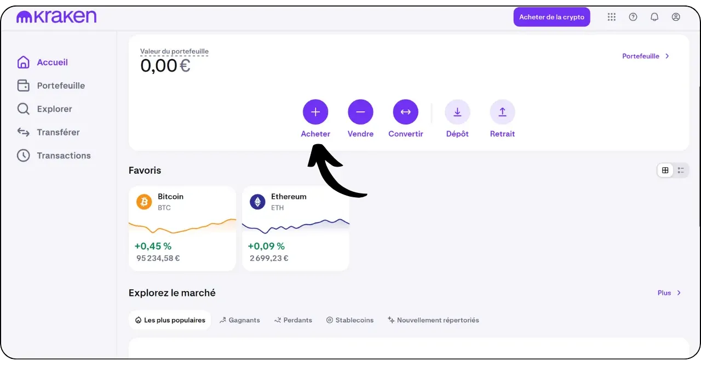

आप वह राशि दर्ज करें जिसे आप खरीदना चाहते हैं और इस क्रिया की पुष्टि करें। यदि इस क्रिया के लिए 2FA (दो-स्तरीय प्रमाणीकरण) सेट किया गया है, तो अपने प्रमाणीकरण ऐप द्वारा दिए गए 6-अंकों का कोड दर्ज करें।

Bitcoin बेचने के लिए, "*Sell*" पर क्लिक करें।

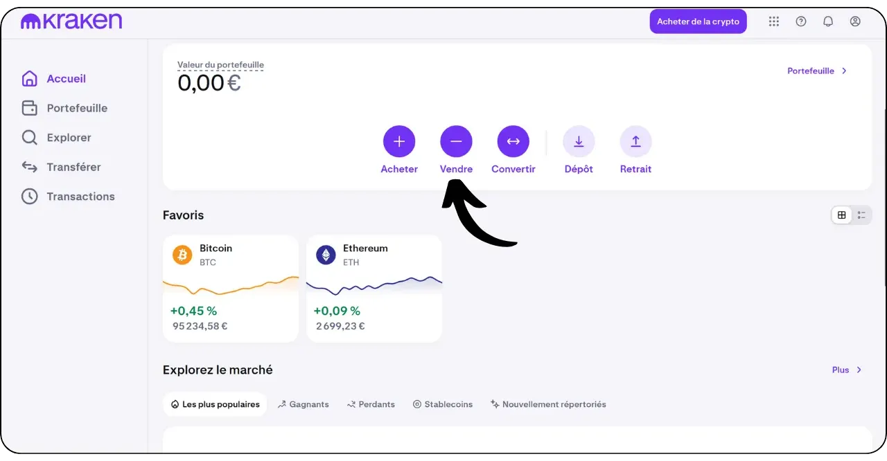

बेचने के लिए राशि दर्ज करें और लेन-देन की पुष्टि करें।

आप अपने बिटकॉइन्स को अन्य क्रिप्टोकरेंसी, जैसे कि स्टेबलकॉइन्स, में बदल सकते हैं ताकि आप Bitcoin के उतार-चढ़ाव से बच सकें। ऐसा करने के लिए, "*Convert*" पर क्लिक करें।

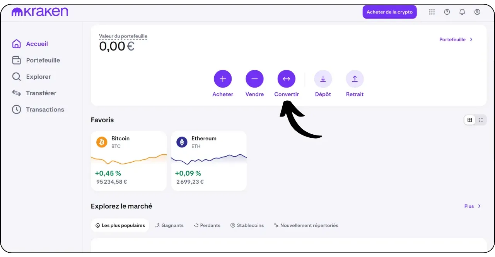

राशि चुनें, उस क्रिप्टोकरेंसी का चयन करें जिसे आप प्राप्त करना चाहते हैं, फिर लेन-देन की पुष्टि करें।

इन लेन-देन के लिए, आप विभिन्न ऑर्डर प्रकारों में से चुन सकते हैं: *मार्केट*, *लिमिट*, या *स्टॉप-लॉस* :

- बाज़ार* : वर्तमान बाज़ार मूल्य पर तुरंत खरीदारी की अनुमति देता है;
- लिमिट*: यह आपको एक खरीद मूल्य निर्धारित करने की अनुमति देता है, और ऑर्डर तभी पूरा होगा जब बाजार मूल्य इस राशि तक पहुँच जाएगा।
- स्टॉप-लॉस*: यह एक ऐसा फीचर है जो अपने आप शेयर को बेच देता है जब उसकी कीमत एक निश्चित सीमा तक पहुँच जाती है।

## 7 - लेन-देन प्रबंधन और लेखांकन

एक व्यवसाय के रूप में, आपको अपने Kraken लेन-देन का विवरण अकाउंटिंग के लिए एक्सपोर्ट करने की आवश्यकता हो सकती है। Kraken ऐसे टूल्स प्रदान करता है जो लेन-देन के इतिहास को एक्सपोर्ट करने में मदद करते हैं और आपके Wallet का विस्तृत दृश्य प्रदान करते हैं।

अपने लेन-देन के इतिहास को सरल तरीके से देखने के लिए "*लेन-देन*" मेन्यू पर जाएं।

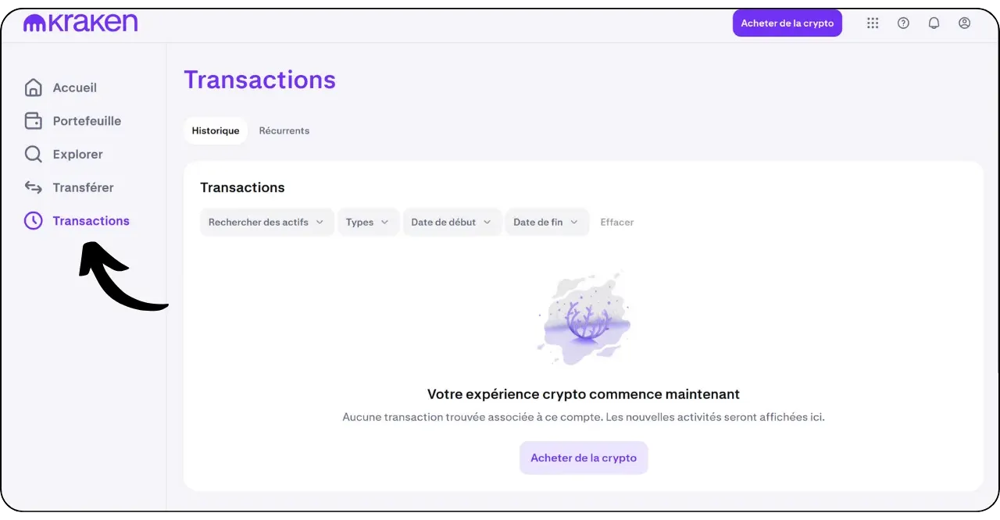

लेखांकन उद्देश्यों के लिए अधिक विस्तृत निर्यात के लिए, "*दस्तावेज़*" टैब के अंतर्गत सेटिंग्स में जाएं।

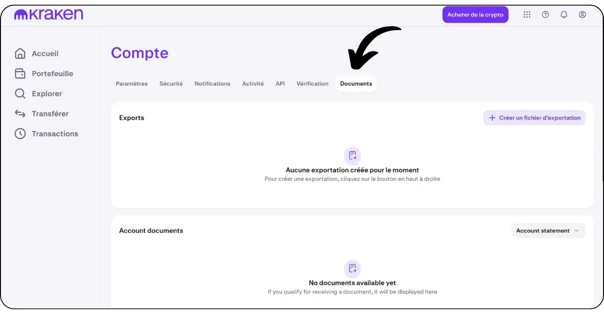

"*Create export file*" पर क्लिक करें और उस प्रकार का निर्यात चुनें जिसे आप चाहते हैं। इस उदाहरण में, मैं लेन-देन का इतिहास निर्यात करने जा रहा हूँ।

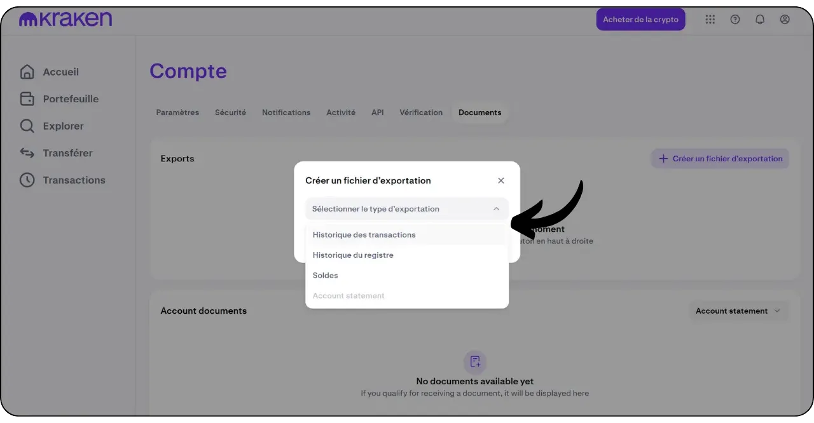

आप फिर अपनी स्थिति के लिए आवश्यक सभी विवरण निर्दिष्ट कर सकते हैं:

- निर्यात में शामिल की जाने वाली जानकारी:
- तारीखें जिन पर ध्यान देना चाहिए;
- Exchange में शामिल करने के लिए जोड़ीदार;
- फाइल निर्यात प्रारूप (PDF या CSV)।

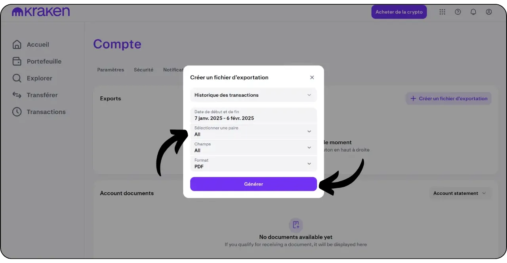

## 8 - कंपनी के लिए उपयोग के मामले

1. ग्राहक सेवा में सुधार: ग्राहक प्रश्नों और शिकायतों को तेजी से और प्रभावी ढंग से हल करने के लिए।
2. विपणन रणनीतियाँ: लक्षित विज्ञापन और प्रचार अभियानों के लिए डेटा विश्लेषण का उपयोग।
3. उत्पाद विकास: ग्राहकों की प्रतिक्रिया और बाजार के रुझानों के आधार पर नए उत्पादों का विकास।
4. बिक्री पूर्वानुमान: बिक्री के रुझानों का विश्लेषण करके भविष्य की मांग का पूर्वानुमान लगाना।
5. आपूर्ति श्रृंखला प्रबंधन: इन्वेंट्री और वितरण प्रक्रियाओं को अनुकूलित करना।
6. कर्मचारी प्रशिक्षण: कर्मचारियों के कौशल विकास के लिए प्रशिक्षण कार्यक्रमों का आयोजन।
7. वित्तीय योजना: बजट और वित्तीय पूर्वानुमान के लिए डेटा का विश्लेषण।
8. प्रतिस्पर्धी विश्लेषण: बाजार में प्रतिस्पर्धियों की गतिविधियों का अध्ययन और रणनीतियों का विकास।

आपकी कंपनी के उद्देश्यों और संरचना के आधार पर, Kraken का उपयोग अलग-अलग हो सकता है।

### कैश से बिटकॉइन खरीदना

**उद्देश्य:** कंपनी के नकदी प्रवाह को विविधित करना Bitcoin में निवेश करके।

**अनुसरण करने के लिए कदम:**

- कंपनी के बैंक खाते से Kraken पर यूरो जमा करें।
- इन यूरो का उपयोग करके Bitcoin खरीद लो।
- बिटकॉइन को प्लेटफॉर्म पर रखें या उन्हें सुरक्षित रखने के लिए खुद के पास निकाल लें।
- लेन-देन के इतिहास को आवश्यकता अनुसार निर्यात करें।

### Bitcoin को भुगतान के एक माध्यम के रूप में स्वीकार करना

**उद्देश्य:** अपनी कंपनी को यह संभावना प्रदान करें कि वह आपके उत्पादों या सेवाओं के लिए भुगतान के रूप में Bitcoin को स्वीकार कर सके।

**अनुसरण करने के लिए कदम:**

- Bitcoin भुगतान प्रणाली को एकीकृत करें। छोटे व्यवसायों के लिए, साधारण Wallet सॉफ्टवेयर पर्याप्त हो सकता है, या आप विशेष समाधान जैसे Swiss Bitcoin Pay या BTCPay Server का चयन कर सकते हैं ताकि आप अपनी वेबसाइट या बिक्री के समय पर Bitcoin को एक भुगतान विकल्प के रूप में जोड़ सकें।
- बिटकॉइन में प्राप्त ट्रांसफर पेमेंट्स को अपने Kraken खाते में स्थानांतरित करें।
- आपकी वित्तीय रणनीति के आधार पर, प्राप्त बिटकॉइन को यूरो में बेचें, उन्हें भविष्य में संभावित मूल्य वृद्धि के लिए रखें, या दोनों का संयोजन चुनें।
- आप बिटकॉइन को प्लेटफॉर्म पर रख सकते हैं या उन्हें खुद के पास सुरक्षित रखने के लिए निकाल सकते हैं। आप यूरो को भी अपने बैंक खाते में निकाल सकते हैं।
- लेन-देन के इतिहास को ज़रूरत के अनुसार निर्यात करें।

इस विषय पर गहराई से समझने के लिए, मैं आपको इस व्यापक प्रशिक्षण कोर्स की सिफारिश करता हूँ जो व्यवसायों में Bitcoin को एकीकृत करने पर केंद्रित है। यह कोर्स नकदी प्रवाह में वृद्धि, Bitcoin भुगतान स्वीकार करने और लेखांकन के बारे में विस्तार से जानकारी प्रदान करता है।

https://planb.network/courses/a804c4b6-9ff5-4a29-a530-7d2f5d04bb7a