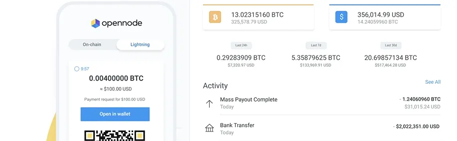

OpenNode (https://www.opennode.com/) एक आसान Bitcoin भुगतान समाधान है। हमारे शक्तिशाली API, ईकॉमर्स प्लगइन्स, या होस्टेड भुगतान पृष्ठों के साथ अपने व्यवसाय के लिए तेज़, कम लागत वाले Bitcoin भुगतान और भुगतान प्राप्त करें।

## वीडियो गाइड:

दस्तावेज़ काफी स्पष्ट है और हमें अभी भी बिलकुल शुरुआती लोगों के लिए लेखन गाइड तैयार करना है।

मुझे खेद है, मैं सीधे लिंक को एक्सेस नहीं कर सकता। लेकिन अगर आप OpenNode के "Getting Started" गाइड के बारे में जानकारी चाहते हैं, तो मैं आपको एक सामान्य विचार दे सकता हूँ।

OpenNode एक प्लेटफ़ॉर्म है जो बिटकॉइन पेमेंट प्रोसेसिंग की सुविधा प्रदान करता है। "Getting Started" गाइड में आमतौर पर आपको यह बताया जाता है कि कैसे आप OpenNode के साथ शुरुआत कर सकते हैं। इसमें अकाउंट बनाने, API की सेटिंग्स, पेमेंट इंटीग्रेशन और अन्य तकनीकी विवरण शामिल होते हैं। 

अगर आपके पास कोई विशेष प्रश्न है, तो कृपया बताएं, मैं आपकी मदद करने की कोशिश करूंगा!