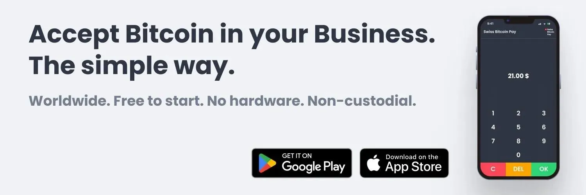

आजकल, व्यापारियों के लिए कई समाधान उपलब्ध हैं जो Bitcoin को भुगतान विधि के रूप में स्वीकार करना चाहते हैं। छोटे व्यवसायों के लिए जो एक अनौपचारिक सेटअप चाहते हैं, उनके लिए Hot, Wallet, या यहां तक कि एक लाइटनिंग Wallet स्थापित करना पर्याप्त है ताकि वे सीधे उसमें भुगतान प्राप्त कर सकें। बड़े व्यवसायों को, जिन्हें लेखा रिकॉर्ड बनाए रखने की आवश्यकता होती है, एक विशेष भुगतान प्रसंस्करण प्रणाली का चयन करना चाहिए। इस क्षेत्र में भी कई विकल्प उपलब्ध हैं।

उन लोगों के लिए जो झंझट नहीं चाहते और सीधे अपने बैंक खाते में फिएट मुद्रा में धन प्राप्त करना पसंद करते हैं, उनके लिए ओपन नोड जैसी कस्टोडियल समाधान उपलब्ध हैं।

https://planb.network/tutorials/business/point-of-sale/open-node-e69a0c1c-47f7-4932-8494-e6f26c3c9784
उन व्यापारियों के लिए जो खुद से काम करने के लिए तैयार हैं और पूरी प्रक्रिया पर नियंत्रण चाहते हैं, BTCPay सर्वर सॉफ़्टवेयर एक बेहतरीन विकल्प है। हालांकि, BTCPay सर्वर का एक बड़ा नुकसान यह है कि इसकी सेटअप और प्रबंधन में समय लगता है और इसके लिए कुछ तकनीकी ज्ञान की आवश्यकता होती है।

https://planb.network/tutorials/business/point-of-sale/btcpay-server-928eb01e-824b-4b57-a3e8-8727633beddc
इन सभी समाधानों में, स्विस Bitcoin पे एक बहुत ही दिलचस्प विकल्प लगता है जो उपयोग में आसानी, विशेषताएं और सुरक्षा को जोड़ता है। यह समाधान बहुत छोटे व्यवसायों और बड़े संगठनों दोनों के लिए उपयुक्त है। इस ट्यूटोरियल में, आप जानेंगे कि अपने व्यवसाय में Bitcoin को स्वीकार करने के लिए स्विस Bitcoin पे का आसानी से उपयोग कैसे करें।

## अपने व्यवसाय में Bitcoin को क्यों अपनाएं?

Bitcoin को भुगतान के तरीके के रूप में स्वीकार करने से आपके व्यवसाय को कई फायदे मिलते हैं। सबसे पहले, Bitcoin कुछ हद तक नकद की तरह काम करता है, लेकिन भौतिक पैसे की कमियों के बिना। नकद की तरह, भुगतान के रूप में प्राप्त बिटकॉइन को पारंपरिक बैंकिंग प्रक्रिया से नहीं गुजरना पड़ता। यह आपके ग्राहक से सीधे आपके पास एक पीयर-टू-पीयर लेन-देन होता है, जब तक कि आप किसी भुगतान मध्यस्थ का उपयोग न करें।

इसके अलावा, Bitcoin भुगतान लाइटनिंग के साथ तुरंत अंतिमता प्रदान करता है और ऑनचेन भुगतान के मामले में केवल कुछ मिनट लेता है। एक बार पुष्टि हो जाने के बाद, Bitcoin भुगतान को रद्द करना संभव नहीं है। यदि आप स्व-कस्टडी का विकल्प चुनते हैं, तो आप सीधे अपने बिटकॉइन को नियंत्रित करते हैं, जो आपके व्यवसाय की वित्तीय स्वायत्तता को और बढ़ाता है।

Bitcoin के साथ, आप कमीशन और बैंकिंग शुल्क पर काफी बचत कर सकते हैं। Bitcoin का उपयोग करने से आपको भुगतान टर्मिनल खरीदने या किराए पर लेने की आवश्यकता नहीं होती; एक कंप्यूटर या साधारण स्मार्टफोन ही काफी है। इसके अलावा, सीधे Bitcoin भुगतान स्वीकार करके, आप उन कमीशनों से बच सकते हैं जो आमतौर पर लेनदेन पर लगाए जाते हैं। यहां तक कि अगर आप भुगतान प्रक्रिया के लिए किसी बिचौलिए के माध्यम से जाते हैं, तो Bitcoin लेनदेन से जुड़े शुल्क आमतौर पर पारंपरिक बैंकों की तुलना में काफी कम होते हैं।

Bitcoin में नकद के साथ कई फायदे हैं, लेकिन यह एक संपत्ति के रूप में और भी अधिक लाभ प्रदान करता है। उदाहरण के लिए, BTC की कुल संख्या सहमति से 21 मिलियन यूनिट पर तय की गई है, जिससे यह एक दुर्लभ संपत्ति बन जाती है और राज्य मुद्राओं के विपरीत मौद्रिक मुद्रास्फीति के प्रति प्रतिरोधी होती है। अपने व्यवसाय में Bitcoin को स्वीकार करके, आपके पास दीर्घकालिक रूप से अपने खजाने के मूल्य को संरक्षित करने और अपनी कंपनी की संपत्तियों में विविधता लाने का अवसर है।

रोज़मर्रा के जीवन में, Bitcoin भुगतान नकद की तुलना में अधिक सुविधा और लचीलापन प्रदान करते हैं। इसका एक बड़ा फायदा यह है कि आपको Bitcoin भुगतान के लिए छुट्टे देने की ज़रूरत नहीं होती, जिससे आपको नकद रजिस्टर संभालने की ज़रूरत नहीं पड़ती। इसके अलावा, बिटकॉइन स्वीकार करने से चोरी, डकैती और लूटपाट के जोखिम कम हो जाते हैं। साथ ही, यह एक ऐसी मुद्रा है जिसे नकली नहीं बनाया जा सकता, जबकि बैंक नोट्स के साथ ऐसा नहीं है।

यदि आपके पास अंतरराष्ट्रीय ग्राहक हैं, तो Bitcoin का यह फायदा है कि यह एक वैश्विक मुद्रा है। इससे आपके ग्राहकों को Exchange मुद्राओं की आवश्यकता नहीं होती।

ऑनलाइन व्यवसायों के लिए, Bitcoin एक प्रभावी तरीका है जिससे वे दूरस्थ भुगतान को सुरक्षित रूप से स्वीकार कर सकते हैं, बिना पारंपरिक बैंकिंग प्रणालियों से गुजरे। वास्तव में, यह उपयोग Bitcoin के आविष्कारक Satoshi नाकामोटो के मूल इरादों में से एक था, जिन्होंने इसे "*एक पीयर-टू-पीयर इलेक्ट्रॉनिक नकद प्रणाली*" के रूप में वर्णित किया था।

अंततः, अपने व्यवसाय में Bitcoin को शामिल करना एक मार्केटिंग रणनीति का हिस्सा भी हो सकता है। BTC को स्वीकार करना आपकी कंपनी को नवाचारी, लचीला और तकनीकी विकासों के अनुकूल दिखा सकता है, साथ ही आपको एक नए बाजार के लिए खोल सकता है। [KPMG के एक अध्ययन](https://kpmg.com/fr/fr/home/media/press-releases/2024/03/web3-crypto-actifs-adan.html) के अनुसार, 12% फ्रांसीसी लोग क्रिप्टोकरेंसी के मालिक हैं, और उनमें से एक बड़ी संख्या Bitcoin रखती है। इस भुगतान के साधन को स्वीकार करके, आप उन ग्राहकों को आकर्षित कर सकते हैं जो अपने Sats को खर्च करना चाहते हैं, जो अन्यथा शायद कभी आपके व्यवसाय में नहीं आते। यह पीढ़ी Z के बीच अपनी पहचान बनाने का भी एक अच्छा तरीका है।

मेरे विचार में, Bitcoin को स्वीकार करना एक कम जोखिम वाला अवसर है जो आपके व्यवसाय पर महत्वपूर्ण सकारात्मक प्रभाव डाल सकता है। अगर अनुभव सफल नहीं होता है, तो भी खर्च बहुत कम रहेगा। मुख्य खर्च BTC को स्वीकार करने के लिए समाधान सेट करने में लगने वाला समय है, लेकिन जैसा कि आप इस ट्यूटोरियल में जानेंगे, अब इसे हासिल करना बहुत सरल और तेज़ है।

## स्विस Bitcoin पे की प्रस्तुति

स्विस Bitcoin पे एक समाधान है जो व्यापारियों को सरल तरीके से Bitcoin भुगतान स्वीकार करने की सुविधा देता है। यह एक PoS (*पॉइंट ऑफ़ सेल*) एप्लिकेशन को एक सहज उपयोगकर्ता Interface के साथ जोड़ता है, जिसे आपके कर्मचारी बिना गहरी तकनीकी जानकारी के आसानी से उपयोग कर सकते हैं। पारंपरिक Bitcoin Wallet के विपरीत, स्विस Bitcoin पे एप्लिकेशन केवल Bitcoin भुगतान प्राप्त करने के लिए बनाया गया है, जिससे आप बिना किसी जोखिम के डिवाइस को कर्मचारियों को सौंप सकते हैं। आपके पास एक ही स्विस Bitcoin पे खाते से जुड़े कई PoS एप्लिकेशन का उपयोग करने का विकल्प होता है, जिससे आप उन्हें टैबलेट, रजिस्टर पर, या अपने कर्मचारियों के स्मार्टफोन पर आसानी से तैनात कर सकते हैं। स्विस Bitcoin पे एप्लिकेशन को एंड्रॉइड और iOS डिवाइस पर इंस्टॉल किया जा सकता है, और यह कंप्यूटर के लिए एक वेब संस्करण में भी उपलब्ध है।

स्विस Bitcoin पे दो विकल्प प्रदान करता है भुगतान प्रबंधन के लिए: या तो धनराशि सीधे Bitcoin से एक विशेष Address में निकाली जा सकती है या फिर इसे फिएट मुद्रा में बदलकर बैंक खाते में जमा किया जा सकता है। यह प्रक्रिया स्वचालित है और हर 24 घंटे में होती है। इस तरह, आपको Bitcoin या Lightning Network के माध्यम से भुगतान को मैन्युअली प्रबंधित करने की आवश्यकता नहीं होती; स्विस Bitcoin पे आपके लिए सब कुछ संभाल लेता है। हर दिन, आपको आपके व्यक्तिगत Wallet या बैंक खाते में, आपकी पसंद के अनुसार, भुगतान का बैलेंस प्राप्त होगा। हालांकि यह BTCPay सर्वर द्वारा प्रदान किए गए 100% गैर-कस्टोडियल समाधान जैसा नहीं है, स्विस Bitcoin पे सुविधा और सुरक्षा के बीच एक दिलचस्प समझौता प्रस्तुत करता है, क्योंकि मध्यस्थ केवल 24 घंटे के लिए आपकी रसीदें रखता है और फिर धनराशि आपको स्थानांतरित कर देता है। इसके अलावा, अन्य कस्टोडियल समाधानों के विपरीत, स्विस Bitcoin पे आपके व्यवसाय के लिए किसी भी पहचान सत्यापन (KYC) की आवश्यकता नहीं करता।

स्विस Bitcoin पे का उपयोग करने की फीस काफी प्रतिस्पर्धात्मक है: पहले साल में लेनदेन पर 0.21% का कमीशन लगता है। इसके बाद, Bitcoin में रखे गए भुगतानों के लिए फीस 1% है और फिएट मुद्रा में बदले गए भुगतानों के लिए 1.5% है। हालांकि, यह ध्यान देने योग्य है कि इसके बदले में, वे आपके सभी निकासी के लिए Bitcoin लेनदेन शुल्क का 100% कवर करते हैं।

स्विस Bitcoin पे एक दिलचस्प विकल्प के रूप में सामने आता है, जो पूरी तरह से कस्टोडियल समाधानों और अधिक जटिल स्व-होस्टेड सिस्टम जैसे BTCPay सर्वर के बीच है। यह व्यापारी के लिए सरलता, सुरक्षा और वित्तीय स्वायत्तता के बीच एक अच्छा समझौता है।

## स्विस Bitcoin पे अकाउंट कैसे बनाएं?

1. **वेबसाइट पर जाएं**: सबसे पहले स्विस Bitcoin पे की आधिकारिक वेबसाइट पर जाएं।

2. **साइन अप करें**: वेबसाइट पर 'साइन अप' या 'रजिस्टर' का विकल्प खोजें और उस पर क्लिक करें।

3. **जानकारी भरें**: मांगी गई जानकारी जैसे कि आपका नाम, ईमेल पता, और फोन नंबर भरें। सुनिश्चित करें कि आप सही जानकारी दे रहे हैं।

4. **यूज़रनेम और पासवर्ड सेट करें**: एक यूज़रनेम और मजबूत पासवर्ड चुनें जिसे आप आसानी से याद रख सकें।

5. **ईमेल वेरिफिकेशन**: आपके दिए गए ईमेल पते पर एक वेरिफिकेशन लिंक भेजा जाएगा। अपने ईमेल में जाकर उस लिंक पर क्लिक करें।

6. **अकाउंट सेटअप पूरा करें**: वेरिफिकेशन के बाद, आपको कुछ और जानकारी भरने के लिए कहा जा सकता है जैसे कि बैंक डिटेल्स या अन्य व्यक्तिगत जानकारी।

7. **सुरक्षा सेटिंग्स**: अपने अकाउंट की सुरक्षा के लिए दो-स्तरीय प्रमाणीकरण (2FA) सेट करें।

8. **अकाउंट का उपयोग शुरू करें**: अब आपका स्विस Bitcoin पे अकाउंट तैयार है और आप इसका उपयोग कर सकते हैं।

बस, आपका अकाउंट बन गया! अब आप इसे अपने लेन-देन के लिए इस्तेमाल कर सकते हैं।

[स्विस Bitcoin पे की आधिकारिक वेबसाइट](https://swiss-Bitcoin-pay.ch/) पर जाएं।

"*डैशबोर्ड*" बटन पर क्लिक करें।

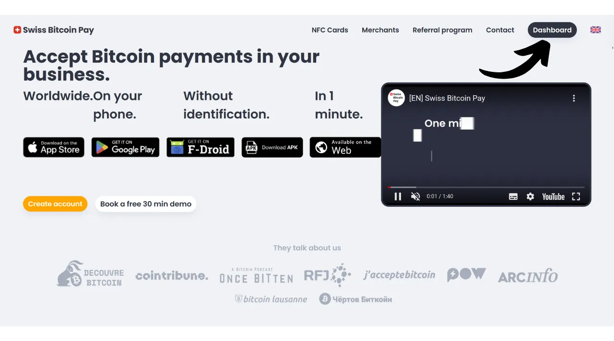

"*साइन अप*" बटन पर क्लिक करें।

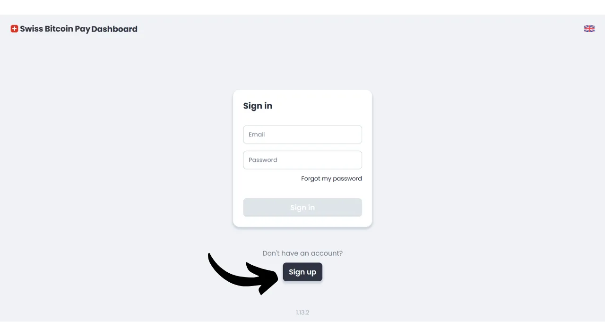

अपने खाते के लिए एक नाम चुनें। यह आपके व्यवसाय का व्यापार नाम हो सकता है (यह वही नाम है जो आपके ग्राहकों के Wallet पर उनके लेन-देन इतिहास में दिखाई देगा)।

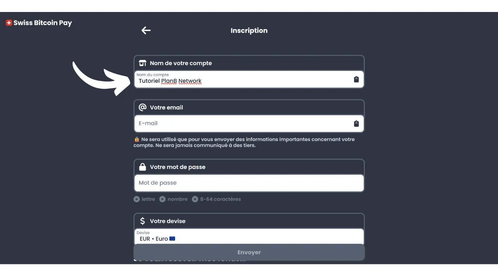

मुझे खेद है, लेकिन मैं "Address" नामक किसी ईमेल के बारे में जानकारी नहीं रखता हूँ। क्या आप कृपया अधिक जानकारी या संदर्भ प्रदान कर सकते हैं ताकि मैं आपकी बेहतर सहायता कर सकूं?

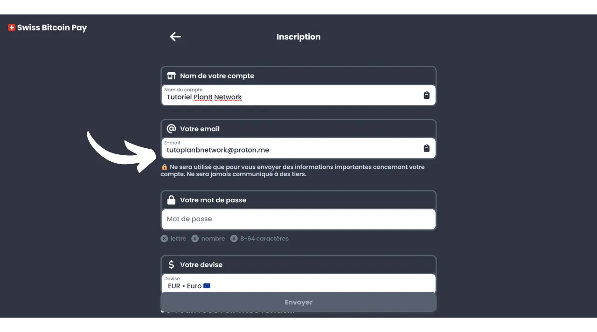

अपने खाते की सुरक्षा के लिए एक मजबूत पासवर्ड चुनें।

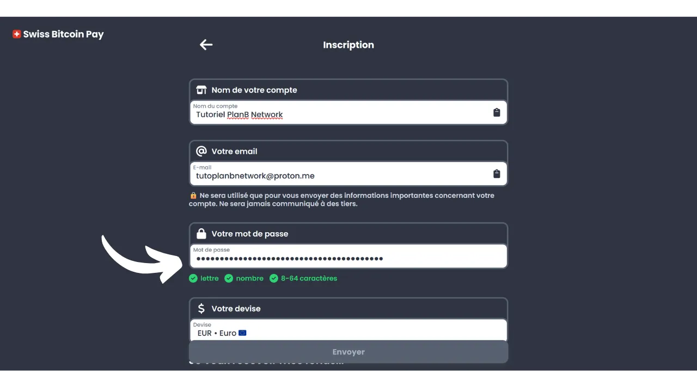

अपनी स्थानीय मुद्रा सेट करें।

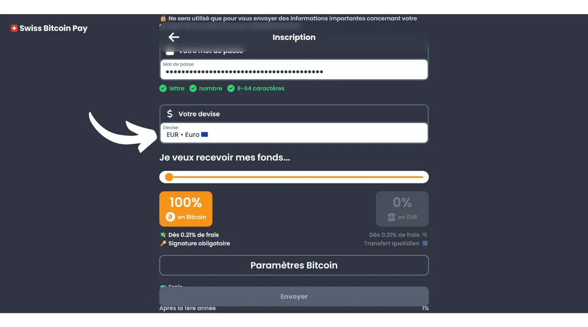

फिर यह तय करें कि आप अपने फंड कैसे प्राप्त करना चाहेंगे। स्लाइडर को समायोजित करके चुनें: या तो 100% बिटकॉइन में, 100% स्थानीय मुद्रा में, या दोनों के बीच किसी भी अनुपात में।

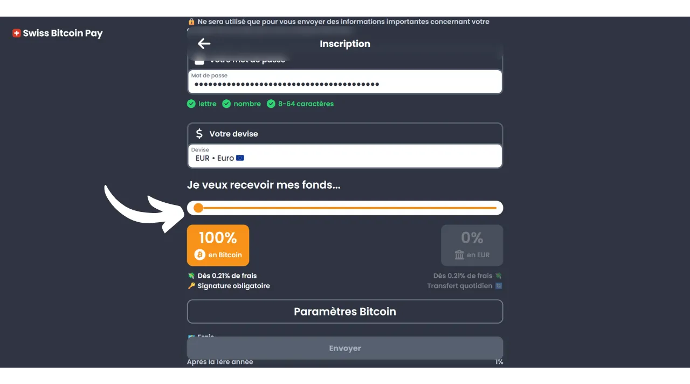

यदि आप अपनी धनराशि स्थानीय मुद्रा में बैंकिंग प्रणाली के माध्यम से प्राप्त करना चुनते हैं, तो आपको अपने बैंक खाते की जानकारी प्रदान करनी होगी। यदि आप अपनी धनराशि बिटकॉइन में प्राप्त करना पसंद करते हैं, तो आपके पास कई विकल्प उपलब्ध हैं।

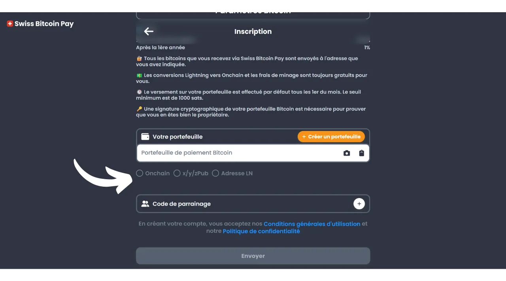

"*ऑनचेन*" विकल्प आपको सभी भुगतान एक ही Bitcoin Address पर प्राप्त करने की अनुमति देता है। हालांकि, मैं इस विकल्प का उपयोग करने की सलाह नहीं देता, क्योंकि यह एक ही Address का पुनः उपयोग करने की ओर ले जाता है, जो आपकी गोपनीयता को बहुत नुकसान पहुंचा सकता है।

यदि आप अपने भुगतान बिटकॉइन ऑनचेन में प्राप्त करने का विकल्प चुनते हैं, तो "*x/y/zpub*" विकल्प के साथ एक विस्तारित सार्वजनिक कुंजी का उपयोग करना बेहतर होता है। इस तरह, स्विस Bitcoin पे प्रत्येक निकासी के लिए एक नया, अप्रयुक्त Address उत्पन्न कर सकता है।

यदि आपको लगता है कि Bitcoin भुगतानों की मात्रा कम होगी, तो आप सीधे Lightning Network के माध्यम से भुगतान प्राप्त करने का विकल्प भी चुन सकते हैं। इसके लिए, आपको एक लाइटनिंग Address प्रदान करना होगा। आपके फंड हर भुगतान के तुरंत बाद ट्रांसफर कर दिए जाएंगे, जबकि ऑनचेन विकल्पों में सभी रसीदों को एक दैनिक भुगतान में समूहीकृत किया जाता है।

यह विकल्प केवल आपके व्यवसाय के लिए स्विस Bitcoin पे की भुगतान विधि को प्रभावित करता है। आपके ग्राहक अभी भी आपको Lightning Network या ऑनचेन के माध्यम से भुगतान कर सकते हैं, चाहे आप यहाँ कौन सा विकल्प चुनें।

इस ट्यूटोरियल के लिए, मैं अपनी भुगतान प्राप्त करने के लिए लाइटनिंग का चयन करूंगा। शैक्षिक उद्देश्यों के लिए और अपने असली लाइटनिंग नोड की गोपनीयता बनाए रखने के लिए, मैं निकासी के लिए एक नकली Wallet का उपयोग करूंगा। हालांकि, मैं दृढ़ता से सलाह देता हूं कि Bitcoin Wallet का उपयोग न करें, चाहे वह LN पर निकासी के लिए हो या ऑनचेन।

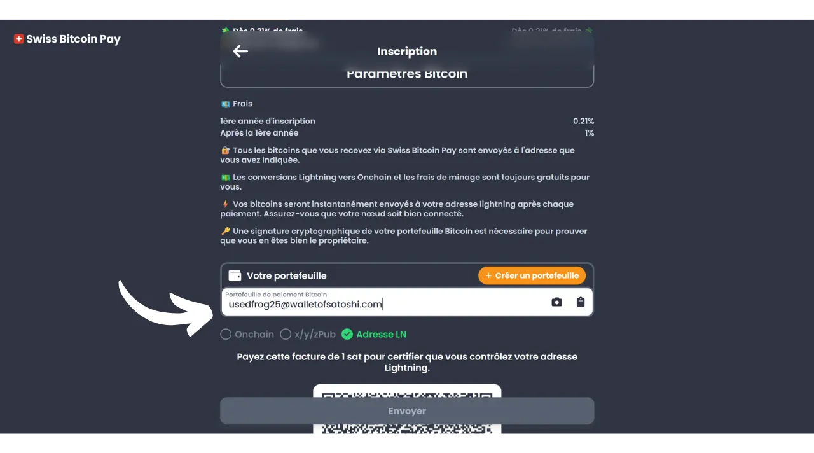

आपको अपने लाइटनिंग Address को सत्यापित करने के लिए 1 सैट का भुगतान करना होगा। अगर आपके पास Bitcoin Address है, तो आपको उस Address के संबंधित प्राइवेट की के साथ एक सिग्नेचर प्रदान करना होगा।

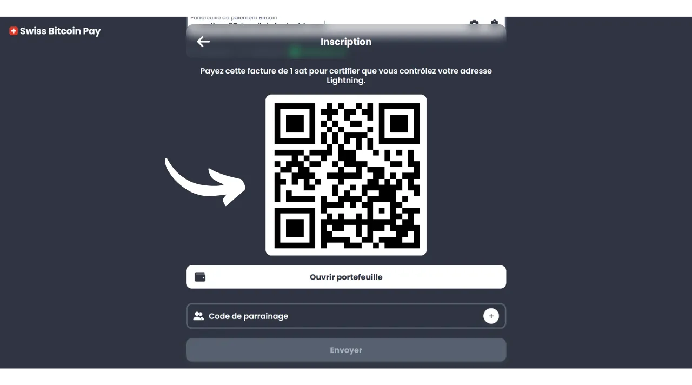

अंत में, आपके पास एक रेफरल कोड जोड़ने का विकल्प है। यदि आप हमारा समर्थन करना चाहते हैं, तो आप कोड "*DiscoverBitcoin*" का उपयोग कर सकते हैं, जिससे आपकी कुछ कमीशन राशि हमारे साथ साझा की जाएगी। धन्यवाद! :)

जब सारी जानकारी भर दी जाए, तो "*भेजें*" बटन पर क्लिक करें।

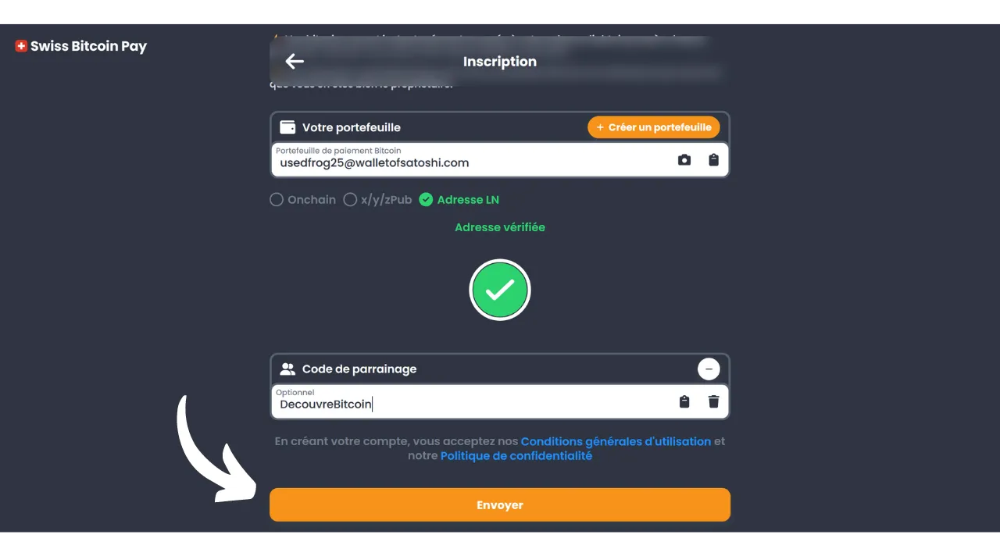

और बस हो गया! आपका स्विस Bitcoin पे खाता अब तैयार है। अब आप अपने व्यवसाय के लिए Bitcoin भुगतान प्राप्त करना शुरू कर सकते हैं!

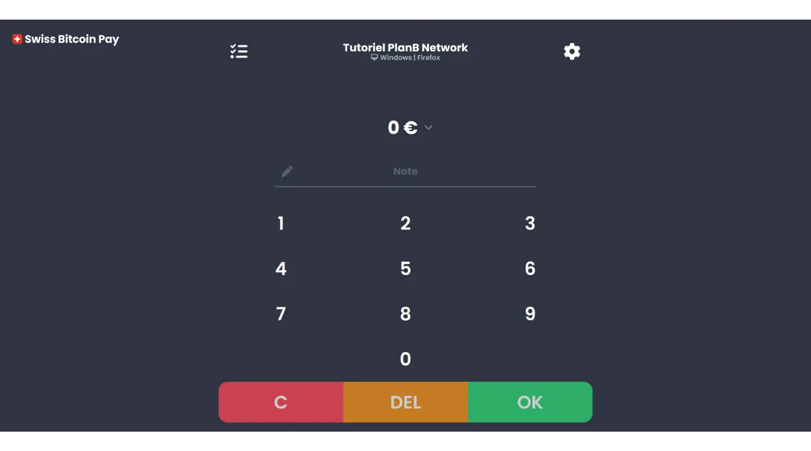

अगर आप चाहें, तो अपने व्यवसाय को बढ़ावा देने के लिए ईमेल में मिले लिंक पर क्लिक कर सकते हैं।

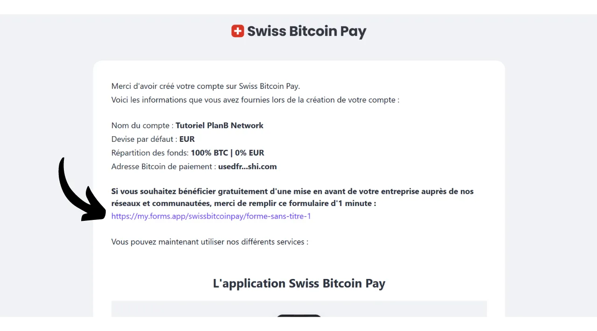

## स्विस Bitcoin पे पॉस को कैसे इंस्टॉल करें?

1. **बॉक्स खोलें**: सबसे पहले, पैकेजिंग से डिवाइस को सावधानीपूर्वक निकालें।

2. **डिवाइस सेट करें**: डिवाइस को एक स्थिर सतह पर रखें जहां से आप आसानी से इसे उपयोग कर सकें।

3. **पावर कनेक्ट करें**: डिवाइस के साथ आए पावर एडाप्टर को डिवाइस में प्लग करें और फिर इसे बिजली के सॉकेट में लगाएं।

4. **नेटवर्क से कनेक्ट करें**: डिवाइस को इंटरनेट से कनेक्ट करने के लिए वाई-फाई या ईथरनेट केबल का उपयोग करें। सुनिश्चित करें कि कनेक्शन स्थिर है।

5. **सॉफ़्टवेयर अपडेट करें**: डिवाइस को ऑन करें और सुनिश्चित करें कि इसमें लेटेस्ट सॉफ़्टवेयर अपडेट इंस्टॉल हैं। अगर नहीं, तो अपडेट डाउनलोड और इंस्टॉल करें।

6. **कनफिगरेशन सेट करें**: डिवाइस की सेटिंग्स में जाकर आवश्यक जानकारी जैसे कि मर्चेंट आईडी और अन्य विवरण दर्ज करें।

7. **टेस्ट ट्रांजेक्शन करें**: एक टेस्ट ट्रांजेक्शन करके सुनिश्चित करें कि डिवाइस सही तरीके से काम कर रहा है।

8. **सुरक्षा सेटिंग्स**: डिवाइस की सुरक्षा सेटिंग्स को चेक करें और सुनिश्चित करें कि यह सुरक्षित है।

अब आपका स्विस Bitcoin पे पॉस डिवाइस उपयोग के लिए तैयार है!

आप पहले से ही वेब संस्करण में भुगतान प्रोसेसर का उपयोग इस साइट पर कर सकते हैं: https://app.swiss-Bitcoin-pay.ch/

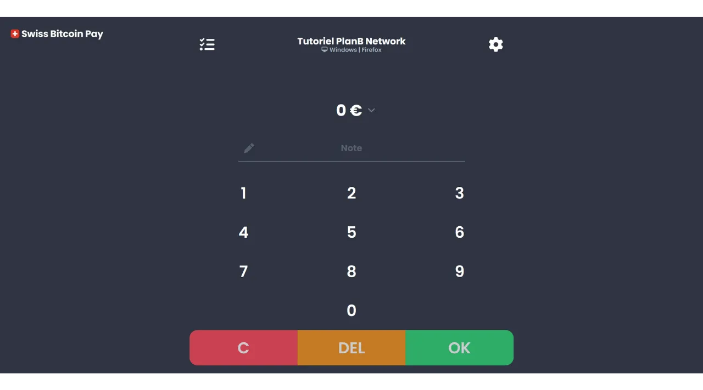

अगर आप स्मार्टफोन या टैबलेट पर PoS का इस्तेमाल करना चाहते हैं, तो आपके पास दो विकल्प हैं: ऐप इंस्टॉल करें या सीधे अपने ब्राउज़र से वेब वर्जन का उपयोग करें। दूसरे विकल्प के लिए, [स्विस Bitcoin पे साइट](https://dashboard.swiss-Bitcoin-pay.ch/signin) पर लॉगिन करके अपने डैशबोर्ड तक पहुंचें।

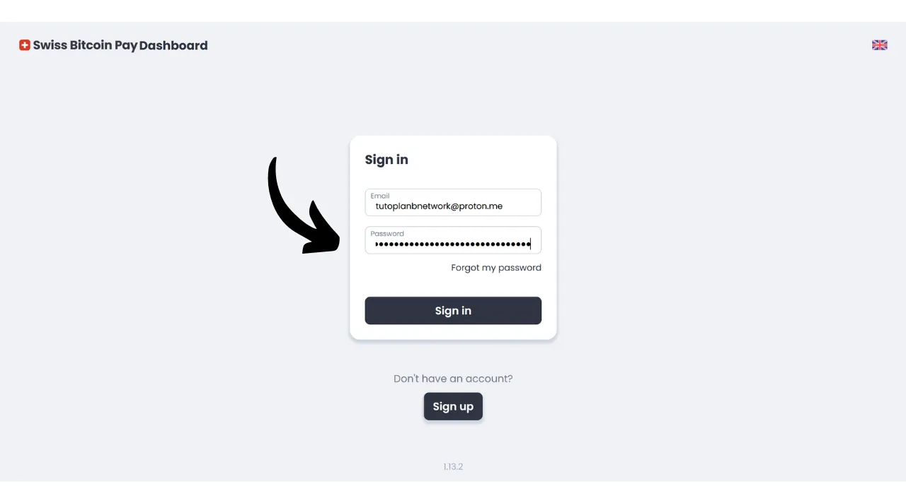

फिर बस अपने पसंदीदा डिवाइस से अपने Interface पर मौजूद QR कोड को स्कैन करें।

अगर आप PoS को एक एप्लिकेशन के रूप में पसंद करते हैं, तो अपने ऐप स्टोर पर जाएं [गूगल प्ले स्टोर](https://play.google.com/store/apps/details?id=ch.swissbitcoinpay.checkout) या [ऐप स्टोर](https://apps.apple.com/us/app/swiss-Bitcoin-pay/id6444370155) और Swiss Bitcoin Pay इंस्टॉल करें। यह एप्लिकेशन सीधे `.apk` फॉर्मेट में उनकी वेबसाइट पर या [एफ-ड्रॉइड स्टोर](https://f-droid.org/packages/ch.swissbitcoinpay.checkout/) पर भी उपलब्ध है।

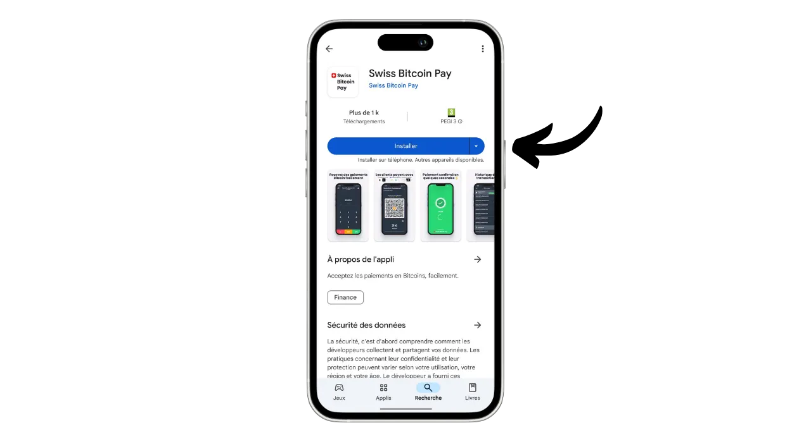

पहली बार खोलते ही "*सक्रियण QR कोड स्कैन करें*" बटन पर क्लिक करें।

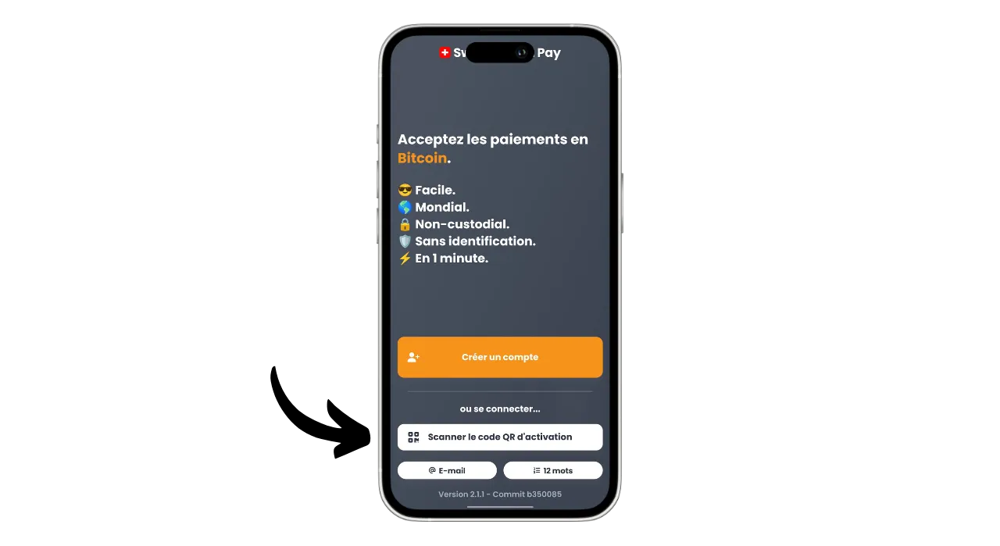

अपने डैशबोर्ड पर मौजूद QR कोड को स्कैन करें।

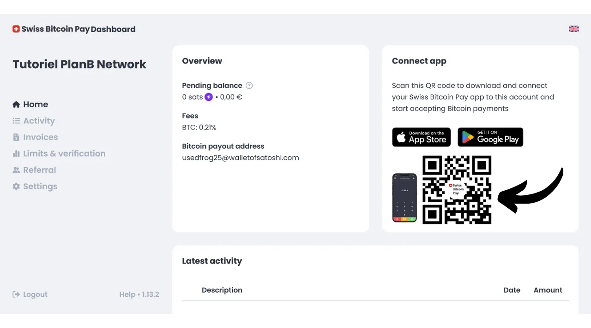

आप अब एक कर्मचारी के रूप में PoS सिस्टम से जुड़े हैं, जिसका मतलब है कि यह मशीन केवल भुगतान प्रक्रिया करने के लिए अधिकृत है और आपके व्यवसाय खाते की सेटिंग्स को बदलने की क्षमता नहीं रखती।

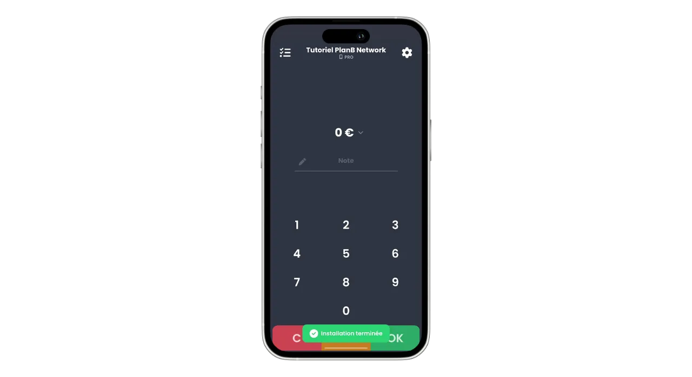

यदि आप चाहें, तो आप अपने एडमिन अकाउंट में चेकआउट के दौरान दिखाई देने वाले PoS (पॉइंट ऑफ सेल) का नाम बदल सकते हैं। आप टर्मिनल का नाम उसकी विशेष लोकेशन के अनुसार रख सकते हैं (जैसे, "*बार मेज़ानाइन*", "*सर्विस ड्राइव*", "*हेड वेटर स्क्वायर नंबर 3*", "*रूम असिस्टेंट नंबर 2*", "*कैश रजिस्टर नंबर 7*", "*टेरेस*", "*एक्सप्रेस चेकआउट*", "*रिसेप्शन*", "*कंसीयर्ज*", "*स्पा/वेलनेस*...") या उस कर्मचारी के नाम से जो इसका उपयोग कर रहा है। ऐसा करने के लिए, स्क्रीन के शीर्ष पर कंपनी के नाम के नीचे स्थित वर्तमान PoS के नाम पर क्लिक करें। 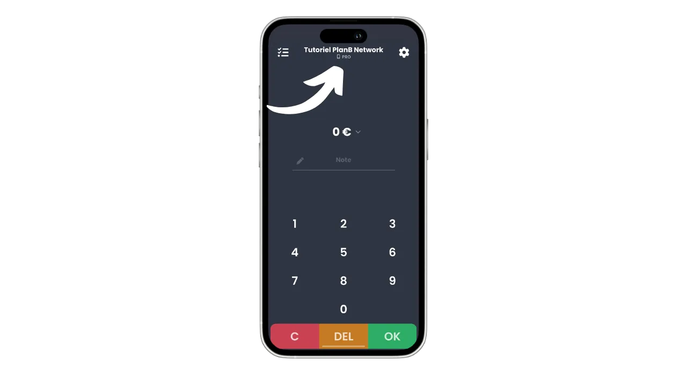

इस भुगतान प्रोसेसर के नए नाम को नोट करें, फिर "*भेजें*" बटन पर क्लिक करें।

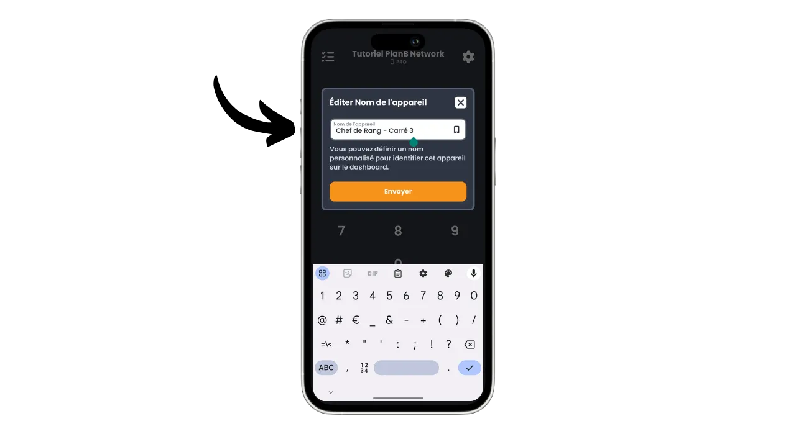

## स्विस Bitcoin पे के साथ चेकआउट कैसे करें?

चेकआउट करना बहुत आसान है। एक बार जब आप PoS पर हों, तो नकद करने के लिए राशि दर्ज करें।

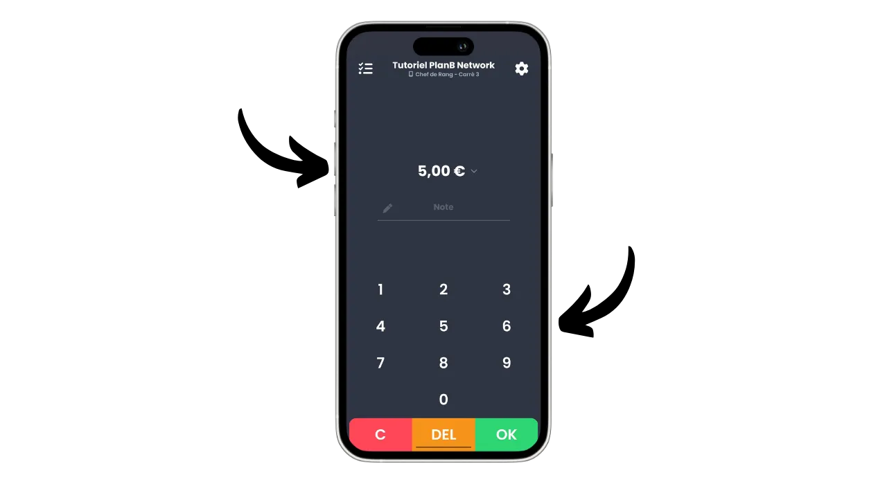

"*नोट*" बॉक्स में, आप वह जानकारी लिख सकते हैं जो भुगतान के साथ जुड़ी होगी, खासकर आपकी रिपोर्ट्स में। उदाहरण के लिए, आप बेची गई वस्तु या सेवा का उल्लेख कर सकते हैं।

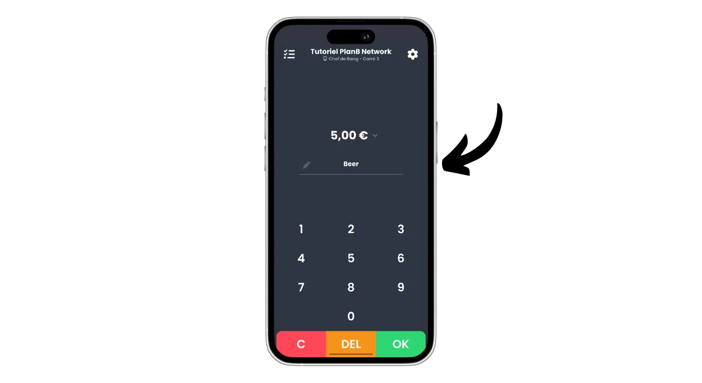

फिर "*OK*" बटन पर क्लिक करें।

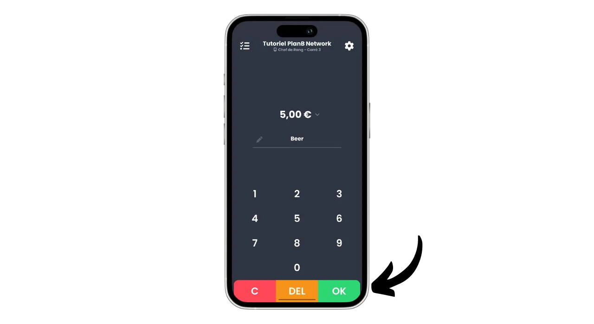

कुछ सेकंड रुकें ताकि स्विस Bitcoin पे, लाइटनिंग Invoice और रिसीविंग Address को बना सके।

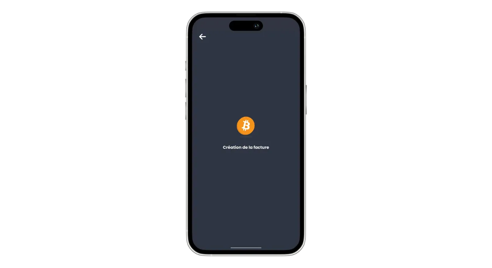

PoS सिस्टम तब एक संयुक्त QR कोड दिखाएगा जो आपके ग्राहकों को उनके भुगतान को Lightning Network या ऑनचेन के माध्यम से करने की अनुमति देता है (दोनों तरीकों के लिए यह वही QR कोड है)। अगर आपका डिवाइस इसे सपोर्ट करता है, तो भुगतान NFC तकनीक का उपयोग करके एक लाइटनिंग कार्ड के माध्यम से भी किया जा सकता है।

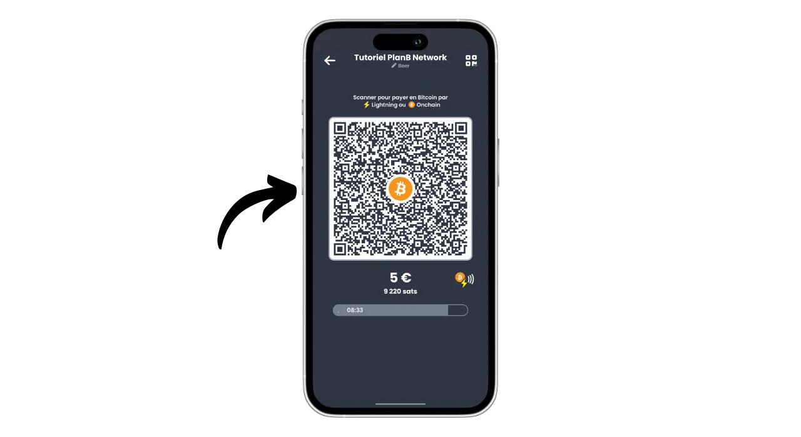

जैसे ही Invoice का भुगतान हो जाता है, PoS भुगतान की सफलता की पुष्टि करता है।

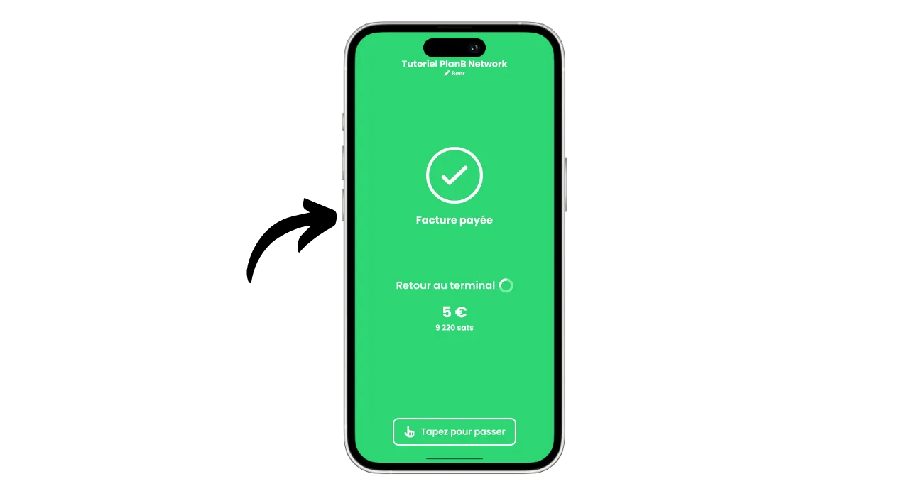

आप स्क्रीन के ऊपर बाईं ओर दिए गए आइकन पर क्लिक करके इस विशेष PoS की भुगतान और पूरी लेन-देन इतिहास भी देख सकते हैं।

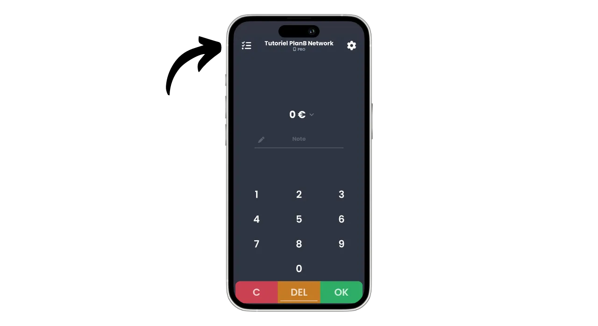

आप उस भुगतान को देख सकते हैं जिसे आपने अभी भुनाया है।

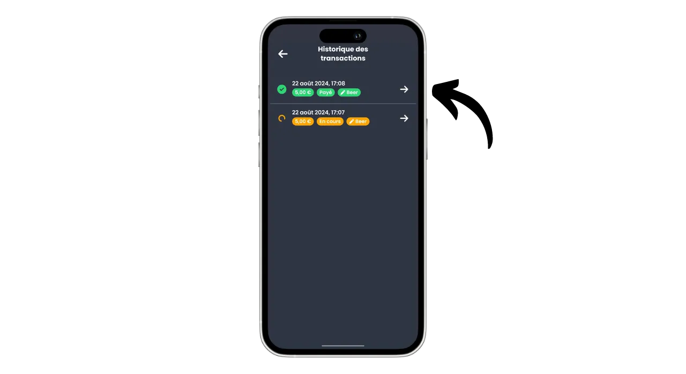

चूंकि मैंने भुगतान निकालने के लिए लाइटनिंग Address का विकल्प चुना था, मैं देख सकता हूँ कि मेरे व्यवसाय के PoS पर भुगतान पहले ही मेरे LN Wallet में आ चुके हैं।

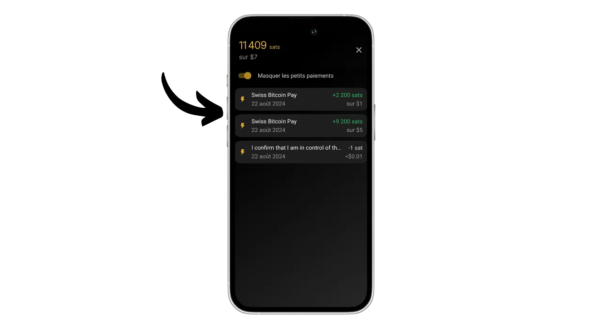

## स्विस Bitcoin पे के साथ अपने व्यवसाय को कैसे प्रबंधित करें?

अपने व्यवसाय को अधिक सटीकता से प्रबंधित करने के लिए, सब कुछ आपके डैशबोर्ड पर होता है। [स्विस Bitcoin पे की आधिकारिक वेबसाइट](https://swiss-Bitcoin-pay.ch/) पर जाएं।

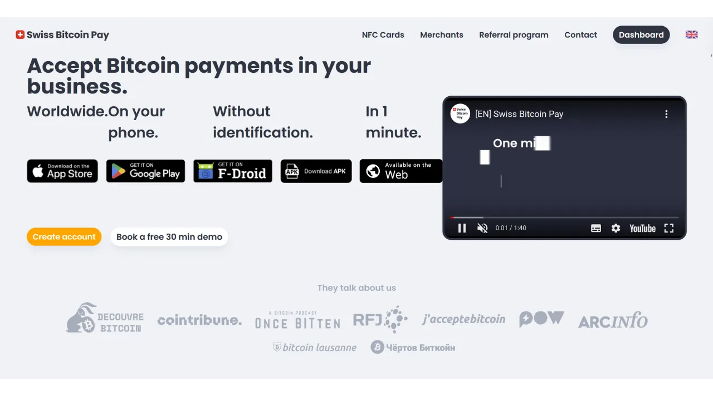

स्क्रीन के ऊपर दाईं ओर "*डैशबोर्ड*" बटन पर क्लिक करें, फिर अपना ईमेल Address और पासवर्ड दर्ज करें। इसके बाद आप इस Interface पर पहुंच जाएंगे। "*होम*" टैब में, आप लंबित निकासी के लिए भुगतान का बैलेंस और अपने खाते की नवीनतम गतिविधियाँ देख सकते हैं। "*गतिविधि*" टैब में, आप अपनी सभी लेन-देन का विवरण देख सकते हैं। उदाहरण के लिए, मेरे डैशबोर्ड पर, मैं देख सकता हूँ कि PoS "*Chef de Rang - Carré 3*" ने 22/08/2024 को 17:08 बजे €5 की बीयर ली। मैं यह भी देख सकता हूँ कि रिसेप्शन ने एक कॉफी ली। अंत में, मैं अपने व्यक्तिगत लाइटनिंग Wallet पर सभी निकासी लेन-देन देख सकता हूँ। रिपोर्ट्स के निर्यात को सेट करने के लिए, "*निर्यात*" बटन पर क्लिक करें। "*मैनुअल*" टैब में, आप अपनी लेन-देन का एक बार का निर्यात कर सकते हैं। बस एक अवधि चुनें, फिर उस जानकारी का चयन करें जिसे आप अपनी रिपोर्ट में शामिल करना चाहते हैं। फिर अपनी लेन-देन का `.csv` फाइल डाउनलोड करने के लिए "*निर्यात*" बटन पर क्लिक करें। "*आवर्ती*" टैब में, आप स्वचालित आवर्ती निर्यात को शेड्यूल कर सकते हैं। निर्यात उत्पन्न करने की आवृत्ति चुनें, और रिपोर्ट में शामिल करने के लिए जानकारी का चयन करें। अंत में, वह ईमेल Address दर्ज करें जहाँ रिपोर्ट भेजी जाएगी। उदाहरण के लिए, आप सीधे अपने अकाउंटेंट का ईमेल Address दर्ज कर सकते हैं। इस शेड्यूल्ड निर्यात को सहेजने के लिए "*सहेजें*" बटन पर क्लिक करें। Invoice टैब आपको एक बार के भुगतान के लिए generate एक Invoice करने की अनुमति देता है। "*सीमाएँ और सत्यापन*" टैब में, आप अपनी दैनिक और वार्षिक संग्रह सीमाएँ देख सकते हैं। आपके पास उच्च सीमाएँ अनलॉक करने के लिए पहचान सत्यापन करने का विकल्प भी है। "*रेफरल*" टैब आपको प्रायोजन से संबंधित सभी चीजों का प्रबंधन करने की अनुमति देता है।

अंत में, "*सेटिंग्स*" टैब में, आपके पास पंजीकरण के दौरान दी गई जानकारी को बदलने का विकल्प होता है, जिसमें निकासी के तरीके और Bitcoin और फिएट के बीच वितरण शामिल है। 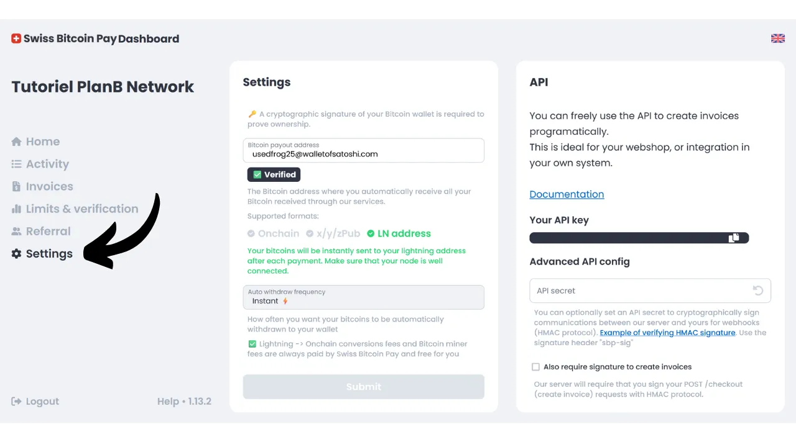

बधाई हो! आपने अपने व्यवसाय में Bitcoin को स्वीकार करने के लिए एक भुगतान प्रोसेसर सिस्टम सेट कर लिया है। अगर आप BTCPay Server, जो कि एक अधिक उन्नत और जटिल समाधान है, को भी एक्सप्लोर करना चाहते हैं, तो मैं आपको हमारी इस सॉफ़्टवेयर के लिए विशेष रूप से समर्पित पूरी ट्रेनिंग का अनुसरण करने की सलाह देता हूँ: [BTC305](https://planb.network/courses/6fc12131-e464-4515-9d3f-9255365d5fa1)।