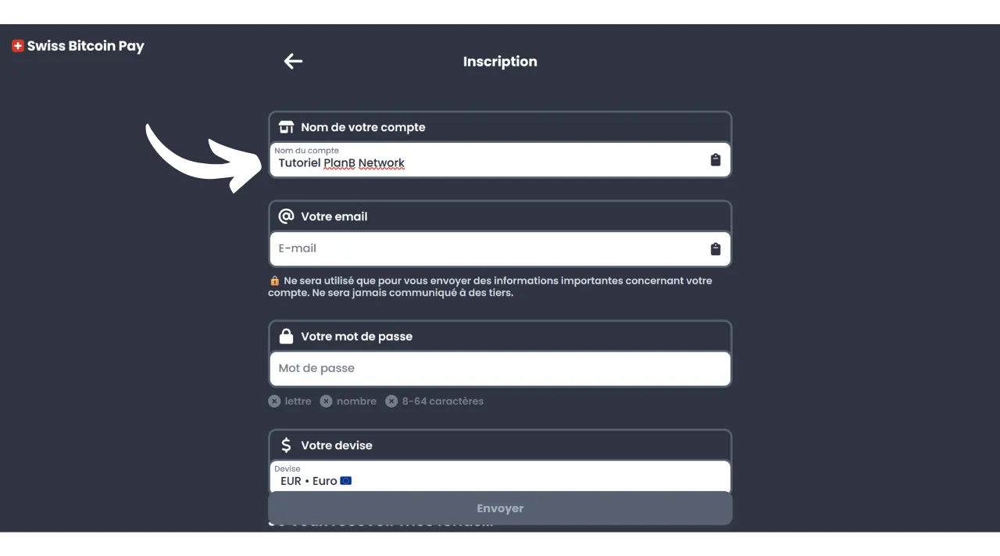
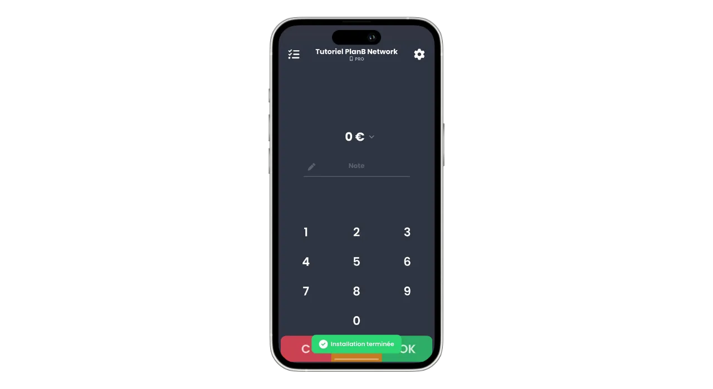
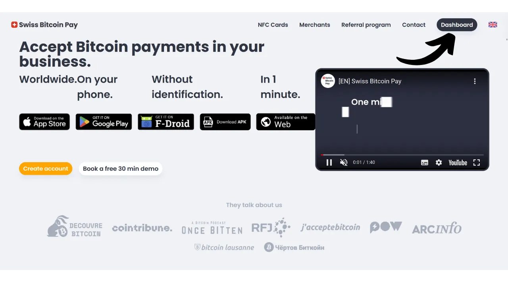
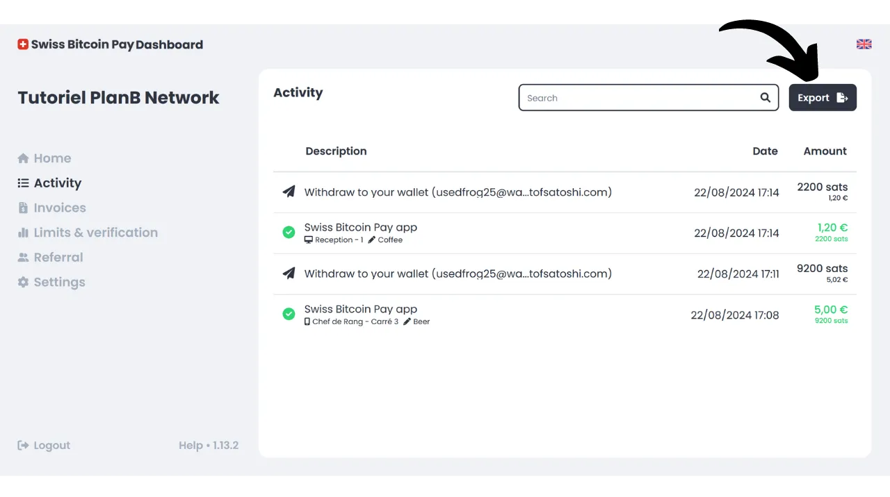

Ngày nay, có rất nhiều giải pháp dành cho các nhà bán lẻ muốn chấp nhận Bitcoin như một phương thức thanh toán. Đối với các đơn vị nhỏ muốn thiết lập một cách không chính thức, việc cài đặt một ví nóng (hot wallet) hoặc thậm chí là ví Lightning là đủ để nhận thanh toán trực tiếp vào đó. Các doanh nghiệp lớn hơn, cần duy trì hồ sơ kế toán, nên chọn một hệ thống xử lý thanh toán chuyên biệt. Cũng có nhiều lựa chọn khác nhau trong lĩnh vực này.

Đối với những người không muốn phiền phức và muốn nhận tiền mặt trực tiếp vào tài khoản ngân hàng của mình, các giải pháp giữ hộ như Open Node có sẵn:

https://planb.network/tutorials/business/point-of-sale/open-node-e69a0c1c-47f7-4932-8494-e6f26c3c9784

Đối với các nhà bán lẻ sẵn sàng "làm bẩn tay" và muốn kiểm soát toàn bộ quy trình, phần mềm BTCPay Server là một lựa chọn xuất sắc. Tuy nhiên, nhược điểm lớn nhất của BTCPay Server là việc thiết lập và quản lý mất thời gian và đòi hỏi một số kiến thức kỹ thuật:

https://planb.network/tutorials/business/point-of-sale/btcpay-server-928eb01e-824b-4b57-a3e8-8727633beddc

Trong tất cả các giải pháp này, Swiss Bitcoin Pay dường như là một sự thỏa hiệp rất thú vị kết hợp giữa sự dễ sử dụng, tính năng và an toàn. Giải pháp này phù hợp cho cả các doanh nghiệp rất nhỏ và các cấu trúc lớn hơn. Trong hướng dẫn này, bạn sẽ khám phá cách dễ dàng sử dụng Swiss Bitcoin Pay để chấp nhận Bitcoin trong doanh nghiệp của mình.

## Tại sao chấp nhận Bitcoin trong doanh nghiệp của bạn?

Chấp nhận Bitcoin như một phương thức thanh toán mang lại nhiều lợi ích cho doanh nghiệp của bạn. Đầu tiên, Bitcoin hoạt động tương tự như tiền mặt, nhưng không có nhược điểm của tiền mặt vật lý. Giống như tiền mặt, Bitcoin nhận được từ thanh toán không cần phải qua chu trình ngân hàng truyền thống. Đó là một giao dịch trực tiếp từ khách hàng đến bạn, trừ khi bạn sử dụng một trung gian thanh toán.

Hơn nữa, một khoản thanh toán Bitcoin cung cấp sự chốt chặn ngay lập tức với Lightning và chỉ mất vài phút trong trường hợp thanh toán onchain. Một khi đã được xác nhận, không thể hủy bỏ một khoản thanh toán Bitcoin. Nếu bạn chọn tự giữ, bạn trực tiếp kiểm soát Bitcoin của mình, điều này càng tăng cường tự chủ tài chính cho doanh nghiệp của bạn.

Với Bitcoin, bạn cũng sẽ nhận ra tiết kiệm đáng kể về hoa hồng và phí ngân hàng. Sử dụng Bitcoin loại bỏ nhu cầu mua hoặc thuê một máy thanh toán; một máy tính hoặc một chiếc điện thoại thông minh đơn giản là đủ. Hơn nữa, bằng cách chấp nhận thanh toán Bitcoin trực tiếp, bạn tránh được các hoa hồng thường được tính trên giao dịch. Ngay cả khi bạn thông qua một trung gian để xử lý thanh toán, các phí liên quan đến giao dịch Bitcoin thường thấp hơn nhiều so với các ngân hàng truyền thống.
Bitcoin chia sẻ nhiều lợi ích với tiền mặt, nhưng nó còn mang lại nhiều lợi ích hơn như một tài sản. Ví dụ, tổng số BTC được cố định bằng sự đồng thuận ở 21 triệu đơn vị, làm cho nó trở thành một tài sản hiếm và chống lại lạm phát tiền tệ, không giống như các đồng tiền của nhà nước. Bằng cách chấp nhận bitcoin trong doanh nghiệp của bạn, bạn có cơ hội bảo toàn giá trị của quỹ dự trữ lâu dài và đa dạng hóa tài sản của công ty.

Hàng ngày, thanh toán bitcoin mang lại nhiều tiện ích và linh hoạt hơn tiền mặt. Một lợi ích đáng kể là bạn không cần phải trả lại tiền thừa cho một khoản thanh toán bitcoin, điều này loại bỏ nhu cầu quản lý một quỹ tiền mặt vật lý. Hơn nữa, chấp nhận bitcoin giảm bớt sự tiếp xúc của bạn với rủi ro của trộm cắp, bẻ khóa, và cướp bóc. Ngoài ra, đó là một loại tiền tệ không thể làm giả, không giống như tiền giấy.

Nếu bạn có khách hàng quốc tế, bitcoin có lợi thế là một đồng tiền toàn cầu, do đó loại bỏ nhu cầu cho khách hàng của bạn phải đổi tiền.

Đối với các doanh nghiệp trực tuyến, Bitcoin cũng là một phương thức hiệu quả để chấp nhận thanh toán từ xa một cách an toàn, mà không cần phải thông qua các hệ thống ngân hàng truyền thống. Sử dụng này thực sự là một trong những ý định ban đầu của Satoshi Nakamoto, người phát minh ra Bitcoin, người đã mô tả nó là "*Một hệ thống tiền mặt điện tử ngang hàng*".
Cuối cùng, việc tích hợp Bitcoin vào doanh nghiệp của bạn cũng có thể là một phần của chiến lược tiếp thị. Chấp nhận BTC có thể định vị công ty của bạn như là một doanh nghiệp đổi mới, linh hoạt và thích nghi với các tiến bộ công nghệ, đồng thời mở ra một thị trường mới. Theo [một nghiên cứu của KPMG](https://kpmg.com/fr/fr/home/media/press-releases/2024/03/web3-crypto-actifs-adan.html), 12% người Pháp sở hữu tiền mã hóa, và đa số trong số họ sở hữu bitcoin. Bằng cách chấp nhận phương thức thanh toán này, bạn có thể thu hút khách hàng này, những người muốn chi tiêu sats của họ, những người có thể sẽ không bao giờ ghé qua doanh nghiệp của bạn. Đây cũng là một cách tốt để làm cho mình được biết đến với Thế hệ Z.
Theo ý kiến của tôi, việc chấp nhận bitcoin nên được coi là một cơ hội rủi ro thấp có thể có tác động tích cực đáng kể đến doanh nghiệp của bạn. Nếu trải nghiệm không thành công, chi phí phát sinh sẽ vẫn ở mức tối thiểu. Chi phí chính nằm ở thời gian cần thiết để thiết lập một giải pháp chấp nhận BTC, nhưng như bạn sẽ khám phá trong hướng dẫn này, việc này giờ đây rất đơn giản và nhanh chóng để thực hiện.

## Giới thiệu về Swiss Bitcoin Pay
Swiss Bitcoin Pay là một giải pháp cho phép các nhà bán lẻ chấp nhận thanh toán Bitcoin một cách dễ dàng. Nó tích hợp một ứng dụng PoS (*Point of Sale*) với giao diện người dùng trực quan, dễ sử dụng cho nhân viên của bạn mà không yêu cầu kiến thức kỹ thuật sâu rộng. Khác với một ví Bitcoin truyền thống, ứng dụng Swiss Bitcoin Pay chỉ dành riêng để nhận thanh toán Bitcoin, điều này cho phép bạn giao thiết bị cho nhân viên mà không có rủi ro. Bạn có tùy chọn sử dụng nhiều ứng dụng PoS kết nối với cùng một tài khoản Swiss Bitcoin Pay, tạo điều kiện thuận lợi cho việc triển khai dù là trên máy tính bảng, tại quầy thanh toán, hay trên điện thoại thông minh của nhân viên. Ứng dụng Swiss Bitcoin Pay có thể được cài đặt trên các thiết bị Android và iOS, và cũng có sẵn phiên bản web cho máy tính.

Swiss Bitcoin Pay cung cấp hai tùy chọn để quản lý thanh toán: quỹ có thể được rút trực tiếp bằng Bitcoin đến một địa chỉ cụ thể hoặc được chuyển đổi thành tiền tệ fiat và gửi vào tài khoản ngân hàng. Hoạt động này được tự động hóa và diễn ra hàng ngày mỗi 24 giờ. Do đó, bạn không phải quản lý thanh toán Bitcoin hoặc qua Lightning Network một cách thủ công; Swiss Bitcoin Pay lo tất cả cho bạn. Hàng ngày, bạn sẽ nhận được số dư thanh toán trong ví cá nhân hoặc tài khoản ngân hàng của mình, tùy theo sở thích của bạn. Mặc dù đây không phải là một giải pháp không giữ hộ 100% như được cung cấp bởi BTCPay Server, chẳng hạn, Swiss Bitcoin Pay đại diện cho một sự thỏa hiệp thú vị giữa tiện ích và an toàn, vì bên trung gian chỉ giữ biên lai của bạn trong 24 giờ trước khi chuyển quỹ cho bạn. Hơn nữa, không giống như các giải pháp giữ hộ khác, Swiss Bitcoin Pay không yêu cầu bất kỳ xác minh danh tính (KYC) nào cho doanh nghiệp của bạn.

Phí liên quan đến việc sử dụng Swiss Bitcoin Pay rất cạnh tranh: năm đầu tiên, một hoa hồng 0.21% được áp dụng cho các giao dịch. Sau đó, phí là 1% cho các khoản thanh toán giữ bằng Bitcoin và 1.5% cho những khoản được chuyển đổi thành tiền tệ fiat. Tuy nhiên, đáng chú ý là đổi lại, họ chi trả 100% phí giao dịch Bitcoin cho tất cả các khoản rút của bạn.

Swiss Bitcoin Pay do đó tự giới thiệu như một lựa chọn thú vị giữa các giải pháp giữ hộ hoàn toàn và các hệ thống tự lưu trữ phức tạp hơn như BTCPay Server. Đây là một sự thỏa hiệp tốt giữa sự đơn giản, an toàn và tự chủ tài chính cho người bán hàng.

## Làm thế nào để tạo một tài khoản Swiss Bitcoin Pay?

Truy cập [trang web chính thức của Swiss Bitcoin Pay](https://swiss-bitcoin-pay.ch/).

Nhấp vào nút "*Dashboard*".

Nhấp vào nút "*Đăng ký*". 
Chọn một tên cho tài khoản của bạn. Điều này có thể là tên thương mại của doanh nghiệp bạn (đây là tên sẽ xuất hiện trên danh sách giao dịch của khách hàng trong lịch sử giao dịch của họ).

Cung cấp một địa chỉ email.

Chọn một mật khẩu mạnh để bảo vệ tài khoản của bạn.

Thiết lập tiền tệ địa phương của bạn.

Sau đó, chọn cách bạn muốn nhận tiền bằng cách điều chỉnh thanh trượt: hoặc là 100% bằng bitcoin, 100% bằng tiền tệ địa phương, hoặc bất kỳ sự phân phối nào bạn chọn giữa hai loại.

Nếu bạn chọn nhận tiền qua hệ thống ngân hàng bằng tiền tệ địa phương, bạn sẽ cần cung cấp chi tiết tài khoản ngân hàng của mình. Nếu bạn muốn nhận tiền bằng bitcoin, có một số lựa chọn nhận tiền khác nhau dành cho bạn.

Tùy chọn "*onchain*" cho phép bạn nhận tất cả các khoản thanh toán vào một địa chỉ Bitcoin duy nhất. Tuy nhiên, tôi không khuyến khích tùy chọn này, vì nó dẫn đến việc sử dụng lại cùng một địa chỉ, có thể gây hại lớn cho quyền riêng tư của bạn.

Nếu bạn chọn nhận thanh toán bằng bitcoin qua onchain, thì việc sử dụng một khóa công khai mở rộng với tùy chọn "*x/y/zpub*" là tốt hơn. Như vậy, Swiss Bitcoin Pay có thể tạo ra một địa chỉ mới, chưa được sử dụng cho mỗi lần rút tiền.

Nếu bạn dự đoán một lượng thanh toán bitcoin tương đối thấp, bạn cũng có thể chọn nhận thanh toán trực tiếp qua Mạng Lưới Sét (Lightning Network). Để làm điều này, bạn sẽ cần cung cấp một địa chỉ Lightning. Tiền của bạn sẽ được chuyển ngay sau mỗi giao dịch, không giống như các tùy chọn onchain mà tổng hợp tất cả các biên lai vào một khoản thanh toán hàng ngày.

Rõ ràng, lựa chọn này chỉ ảnh hưởng đến phương thức thanh toán của Swiss Bitcoin Pay cho doanh nghiệp của bạn. Khách hàng của bạn vẫn có thể thanh toán cho bạn qua Mạng Lưới Sét hoặc onchain, bất kể bạn chọn tùy chọn nào ở đây.

Đối với hướng dẫn này, tôi sẽ chọn nhận thanh toán qua Lightning. Vì mục đích giáo dục và để bảo vệ sự bảo mật của nút Lightning thực sự của tôi, tôi sẽ sử dụng một ví giả Wallet of Satoshi cho việc rút tiền. Tuy nhiên, tôi khuyến cáo mạnh mẽ không sử dụng ví Bitcoin giữ hộ, cho dù là rút tiền qua LN hay onchain.

Sau đó, bạn sẽ cần phải trả 1 sat để xác minh địa chỉ Lightning của mình. Trong trường hợp của một địa chỉ bitcoin, bạn sẽ cần cung cấp một chữ ký với khóa riêng tương ứng với địa chỉ đó.

Cuối cùng, bạn có tùy chọn thêm một mã giới thiệu. Nếu bạn muốn hỗ trợ chúng tôi, bạn có thể sử dụng mã "*DiscoverBitcoin*" để một phần hoa hồng của bạn được chia sẻ với chúng tôi. Cảm ơn bạn! :) 
Một khi tất cả thông tin đã được điền vào, nhấp vào nút "*Gửi*".

Và đó là! Tài khoản Swiss Bitcoin Pay của bạn giờ đây đã sẵn sàng. Bạn có thể bắt đầu nhận thanh toán Bitcoin cho doanh nghiệp của mình!

Nếu bạn muốn, bạn có thể quảng bá doanh nghiệp của mình bằng cách nhấp vào liên kết nhận được qua email.

## Cách cài đặt Swiss Bitcoin Pay PoS?
Bạn đã có thể truy cập bộ xử lý thanh toán phiên bản web tại trang sau: https://app.swiss-bitcoin-pay.ch/

Nếu bạn muốn sử dụng PoS trên điện thoại thông minh hoặc máy tính bảng, bạn có hai lựa chọn: cài đặt ứng dụng hoặc sử dụng trực tiếp phiên bản web từ trình duyệt của bạn. Đối với lựa chọn sau, truy cập bảng điều khiển của bạn bằng cách đăng nhập tại [trang Swiss Bitcoin Pay](https://dashboard.swiss-bitcoin-pay.ch/signin).

Sau đó, chỉ cần quét mã QR hiển thị trên giao diện của bạn với thiết bị bạn chọn.

Nếu bạn muốn có PoS dưới dạng một ứng dụng, hãy truy cập cửa hàng ứng dụng của bạn [Google Play Store](https://play.google.com/store/apps/details?id=ch.swissbitcoinpay.checkout) hoặc [App Store](https://apps.apple.com/us/app/swiss-bitcoin-pay/id6444370155) và cài đặt Swiss Bitcoin Pay. Ứng dụng cũng có sẵn trực tiếp dưới dạng `.apk` trên trang web của họ, hoặc trên [cửa hàng F-Droid](https://f-droid.org/packages/ch.swissbitcoinpay.checkout/).

Khi mở lần đầu, nhấp vào nút "*Quét mã QR kích hoạt*".

Quét mã QR hiển thị trên bảng điều khiển của bạn.

Bây giờ bạn đã được kết nối với hệ thống PoS như một nhân viên, điều này có nghĩa là máy này chỉ được phép xử lý thanh toán mà không có khả năng thay đổi cài đặt của tài khoản doanh nghiệp của bạn.

Nếu bạn muốn, bạn có thể thay đổi tên của PoS hiển thị trong quá trình thanh toán trong tài khoản quản trị của bạn. Bạn có thể đặt tên cho thiết bị theo vị trí cụ thể của nó (ví dụ, "*Bar Mezzanine*", "*Service Drive*", "*Head Waiter Square No. 3*", "*Room Assistant No. 2*", "*Cash Register No. 7*", "*Terrace*", "*Express Checkout*", "*Reception*", "*Concierge*", "*Spa/Wellness*...") hoặc theo tên của nhân viên sử dụng nó. Để làm điều này, nhấp vào tên hiện tại của PoS nằm dưới tên công ty ở phía trên cùng của màn hình. 
Ghi lại tên mới của bộ xử lý thanh toán này, sau đó nhấp vào nút "*Gửi*".

## Cách thanh toán với Swiss Bitcoin Pay?

Để thanh toán, rất đơn giản, một khi đã ở trên PoS, nhập số tiền cần thu.

Trong hộp "*Ghi chú*", bạn có thể ghi chú thông tin sẽ được đính kèm với thanh toán, đặc biệt là trong báo cáo của bạn. Ví dụ, bạn có thể ghi chú hàng hóa hoặc dịch vụ đã bán.

Sau đó nhấp vào nút "*OK*".

Chờ vài giây để Swiss Bitcoin Pay tạo hóa đơn Lightning và địa chỉ nhận.

Hệ thống PoS sẽ hiển thị một mã QR thống nhất cho phép khách hàng của bạn thực hiện thanh toán thông qua Mạng Lưới Sét (Lightning Network) hoặc trên chuỗi (đó là cùng một mã QR cho cả hai phương thức). Nếu thiết bị của bạn cho phép, việc thanh toán cũng có thể được thực hiện qua thẻ Lightning sử dụng công nghệ NFC. 
Một khi hóa đơn được thanh toán, hệ thống PoS xác nhận sự thành công của việc thanh toán.

Bạn cũng có thể tìm thấy thông tin thanh toán và toàn bộ lịch sử giao dịch của hệ thống PoS cụ thể này bằng cách nhấp vào biểu tượng ở góc trên bên trái của màn hình.

Bạn có thể tìm thấy khoản thanh toán mà bạn vừa thu.

Vì tôi đã chọn lựa chọn rút thanh toán qua địa chỉ Lightning, tôi có thể thấy rằng các khoản thanh toán tại hệ thống PoS của doanh nghiệp tôi đã đến trong ví LN của tôi.

## Làm thế nào để quản lý doanh nghiệp của bạn với Swiss Bitcoin Pay?

Để quản lý doanh nghiệp của bạn một cách chính xác hơn, mọi thứ đều diễn ra trên bảng điều khiển của bạn. Truy cập [trang web chính thức của Swiss Bitcoin Pay](https://swiss-bitcoin-pay.ch/).

Nhấp vào nút "*Dashboard*" ở góc trên bên phải của màn hình, sau đó nhập địa chỉ email và mật khẩu của bạn.  Bạn sẽ đến giao diện này.  Trong tab "*Home*", bạn có thể thấy số dư của các khoản thanh toán đang chờ rút cũng như các hoạt động mới nhất của tài khoản của bạn.  Trong tab "*Activity*", bạn có thể xem chi tiết tất cả các giao dịch của mình.  Ví dụ, trên bảng điều khiển của tôi, tôi có thể thấy rằng PoS "*Chef de Rang - Carré 3*" đã thu một ly bia với giá 5 euro vào ngày 22/08/2024 lúc 17:08.  Tôi cũng có thể thấy rằng quầy tiếp tân đã thu một ly cà phê.  Cuối cùng, tôi có thể xem tất cả các giao dịch rút tiền vào ví Lightning cá nhân của mình.  Để thiết lập việc xuất báo cáo, nhấp vào nút "*Export*".  Trong tab "*Manual*", bạn có thể thực hiện việc xuất một lần các giao dịch của mình. Chỉ cần chọn một khoảng thời gian, sau đó chọn thông tin bạn muốn bao gồm trong báo cáo của mình.  Sau đó nhấp vào nút "*Export*" để tải xuống một tệp `.csv` của các giao dịch của bạn.  Trong tab "*Recurring*", bạn có thể lên lịch xuất khẩu định kỳ tự động. Chọn tần suất tạo xuất khẩu, và chọn thông tin bạn muốn bao gồm trong báo cáo.  Cuối cùng, nhập địa chỉ email nơi báo cáo sẽ được gửi. Ví dụ, bạn có thể trực tiếp nhập địa chỉ email của kế toán viên của bạn. Nhấp vào nút "*Save*" để lưu việc xuất khẩu này theo lịch trình.  Tab hóa đơn cho phép bạn tạo một hóa đơn cho một khoản thanh toán một lần.  Trong tab "*Limits & verification*", bạn có thể xem giới hạn thu thập hàng ngày và hàng năm của mình. Bạn cũng có tùy chọn thực hiện xác minh danh tính để mở khóa giới hạn cao hơn.  Tab "*Referral*" cho phép bạn quản lý mọi thứ liên quan đến tài trợ.  Cuối cùng, trong tab "*Settings*", bạn có tùy chọn chỉnh sửa thông tin bạn đã cung cấp trong quá trình đăng ký, bao gồm phương thức rút tiền và phân chia giữa bitcoin và tiền tệ fiat. 
Xin chúc mừng! Bạn đã thiết lập xong hệ thống xử lý thanh toán để chấp nhận bitcoin trong doanh nghiệp của mình. Nếu bạn cũng muốn khám phá BTCPay Server, một giải pháp tiên tiến và phức tạp hơn, tôi khuyên bạn nên theo dõi khóa đào tạo đầy đủ của chúng tôi dành riêng cho phần mềm này: [BTC305](https://planb.network/courses/6fc12131-e464-4515-9d3f-9255365d5fa1).