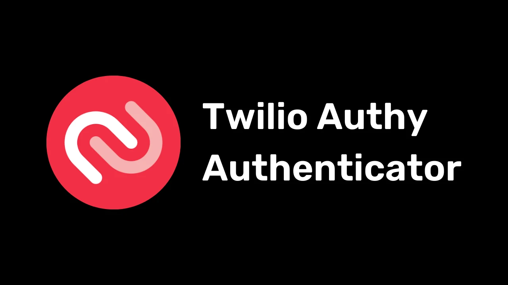

आजकल, दो-कारक प्रमाणीकरण (2FA) ऑनलाइन खातों की सुरक्षा को बढ़ाने के लिए बहुत जरूरी हो गया है। साइबर हमलों में वृद्धि के साथ, केवल पासवर्ड पर निर्भर रहना कभी-कभी आपके खातों की सुरक्षा के लिए पर्याप्त नहीं होता। 2FA सुरक्षा की एक अतिरिक्त परत जोड़ता है, जिसमें पासवर्ड के अलावा दूसरी प्रकार की प्रमाणीकरण की आवश्यकता होती है। यह सत्यापन कई रूपों में हो सकता है, जैसे एसएमएस के माध्यम से भेजा गया कोड, एक समर्पित ऐप द्वारा उत्पन्न किया गया डायनामिक कोड, या एक भौतिक सुरक्षा कुंजी का उपयोग। 2FA का उपयोग आपके खातों के समझौता होने के जोखिम को काफी हद तक कम कर देता है, भले ही आपका पासवर्ड चोरी हो जाए।

## ऑथेंटिकेशन ऐप्स के जरिए 2FA (दो-स्तरीय प्रमाणीकरण)

हम अन्य ट्यूटोरियल्स में भौतिक सुरक्षा कुंजियों जैसे अन्य समाधानों का अन्वेषण करेंगे, लेकिन इस ट्यूटोरियल में, मैं विशेष रूप से 2FA एप्लिकेशनों पर चर्चा करने का प्रस्ताव करता हूँ। इन एप्लिकेशनों का संचालन काफी सरल है: जब किसी खाते पर 2FA सक्रिय किया जाता है, तो हर लॉगिन पर, आपसे न केवल आपका सामान्य पासवर्ड मांगा जाएगा, बल्कि एक 6-अंकीय कोड भी मांगा जाएगा। यह कोड आपके 2FA एप्लिकेशन द्वारा उत्पन्न किया जाता है। इस 6-अंकीय कोड की एक महत्वपूर्ण विशेषता यह है कि यह स्थिर नहीं होता; एप्लिकेशन द्वारा हर 30 सेकंड में एक नया कोड उत्पन्न किया जाता है।

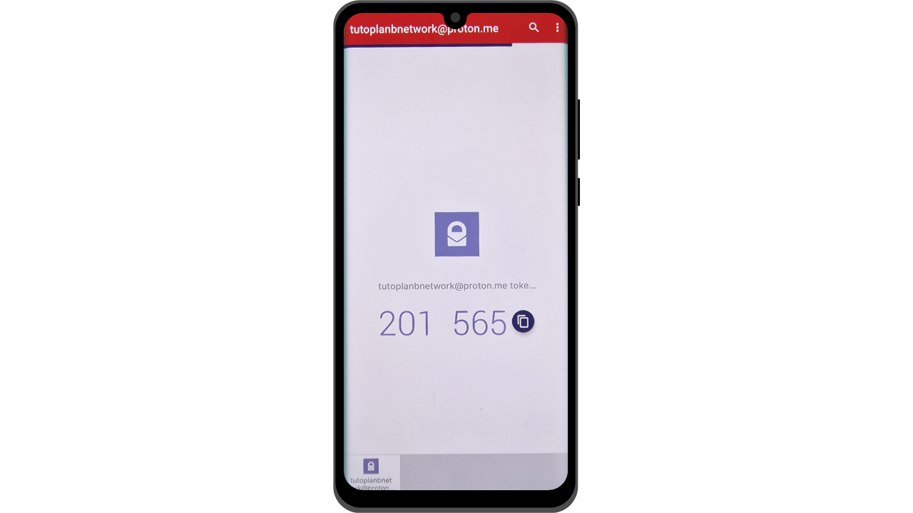

हर 30 सेकंड में कोड का नवीनीकरण होने से किसी हमलावर के लिए आपके खाते तक पहुंचना बहुत मुश्किल हो जाता है। यह प्रणाली हमलावरों को चोरी या इंटरसेप्ट किए गए कोड का पुनः उपयोग करने से रोकती है, क्योंकि यह जल्दी समाप्त हो जाता है। इसलिए, भले ही कोई हमलावर कोड प्राप्त कर ले, वे इसे केवल बहुत कम समय के लिए ही उपयोग कर पाएंगे, क्योंकि जल्द ही एक नया कोड आवश्यक होगा। इसके अलावा, कोड के इतनी जल्दी-जल्दी बदलने से हैकर के लिए ब्रूट फोर्स के जरिए कोड का अनुमान लगाने का समय भी काफी कम हो जाता है।

ऑथेंटिकेशन ऐप्स के जरिए 2FA (दो-स्तरीय प्रमाणीकरण) आपके ऑनलाइन खातों की सुरक्षा को काफी हद तक बढ़ाने का एक आसान और मुफ्त तरीका है।

2FA (दो-स्तरीय प्रमाणीकरण) सेट करने के लिए कई एप्लिकेशन उपलब्ध हैं, जिनमें Google Authenticator और Microsoft Authenticator सबसे प्रसिद्ध हैं। हालांकि, इस ट्यूटोरियल में, मैं आपको एक और कम ज्ञात समाधान से परिचित कराना चाहता हूँ जिसका नाम है Authy। ये सभी एप्लिकेशन TOTP (टाइम बेस्ड वन टाइम पासवर्ड) प्रोटोकॉल का उपयोग करते हैं, जिससे इनका उपयोग काफी हद तक समान होता है।

Authy बड़े टेक कंपनियों के अन्य समाधानों की तुलना में कई फायदे प्रदान करता है। सबसे महत्वपूर्ण बात यह है कि यह आपको अपने 2FA टोकन को कई डिवाइसों पर सिंक्रोनाइज़ करने की सुविधा देता है, जो फोन खोने या बदलने की स्थिति में उपयोगी हो सकता है। Authy आपको एक एन्क्रिप्टेड बैकअप बनाने और उसे ऑनलाइन स्टोर करने की सुविधा भी देता है, जिससे आप अपने टोकन तक पहुंच कभी नहीं खोते, भले ही आप अपना मुख्य डिवाइस खो दें। एक उपयोगकर्ता के दृष्टिकोण से, मुझे व्यक्तिगत रूप से लगता है कि Authy अपने विकल्पों की तुलना में एक अधिक सुखद और सहज अनुभव प्रदान करता है।

## Authy को कैसे इंस्टॉल करें?

1. सबसे पहले, अपने स्मार्टफोन के ऐप स्टोर (जैसे Google Play Store या Apple App Store) पर जाएं।
2. सर्च बार में "Authy" टाइप करें और सर्च करें।
3. Authy ऐप को लिस्ट में से चुनें और "इंस्टॉल" बटन पर टैप करें।
4. ऐप डाउनलोड और इंस्टॉल होने के बाद, उसे ओपन करें।
5. अब, अपने फोन नंबर के साथ रजिस्टर करें और आवश्यक जानकारी भरें।
6. आपको एक वेरिफिकेशन कोड मिलेगा, उसे दर्ज करें।
7. बस, अब आप Authy का उपयोग शुरू कर सकते हैं। 

अगर आपको कोई समस्या आती है, तो ऐप की मदद सेक्शन में जाकर सहायता प्राप्त कर सकते हैं।

अपने स्मार्टफोन पर, ऐप स्टोर (गूगल प्ले स्टोर या एप्पल स्टोर) पर जाएं, और "*Twilio Authy Authenticator*" खोजें।

- [एप्पल](https://apps.apple.com/us/app/twilio-authy/id494168017)
- [एंड्रॉइड](https://play.google.com/store/apps/details?id=com.authy.authy)

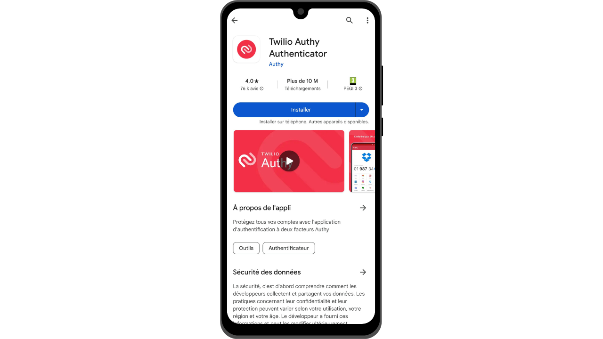

जब आप पहली बार ऐप खोलेंगे, तो आपको एक खाता बनाना होगा। अपने देश का डायलिंग कोड और अपना फोन नंबर चुनें, फिर "*सबमिट*" पर क्लिक करें।

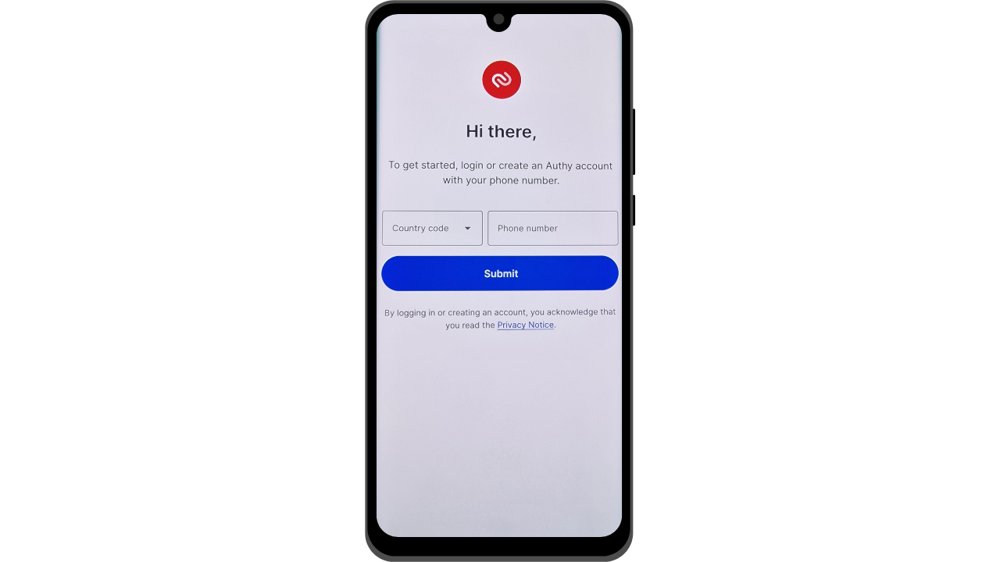

कोड रिकवरी के लिए अपना ईमेल Address दर्ज करें।

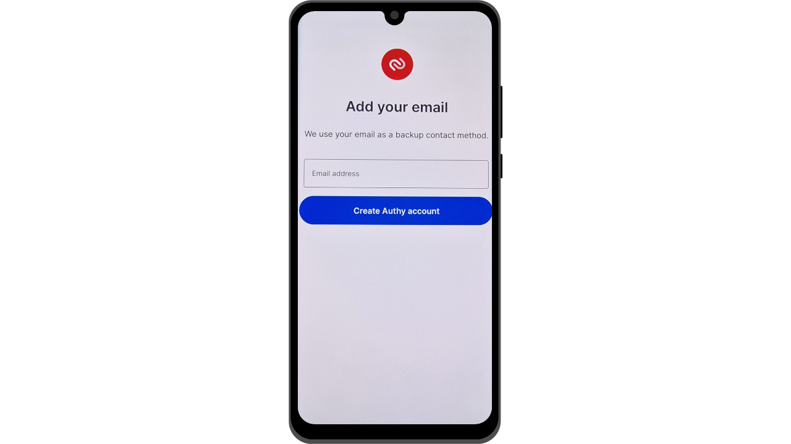

आपको अपना Address सत्यापित करने के लिए एक ईमेल भेजा जाएगा। पुष्टि करने के लिए प्राप्त 6 अंकों को दर्ज करें।

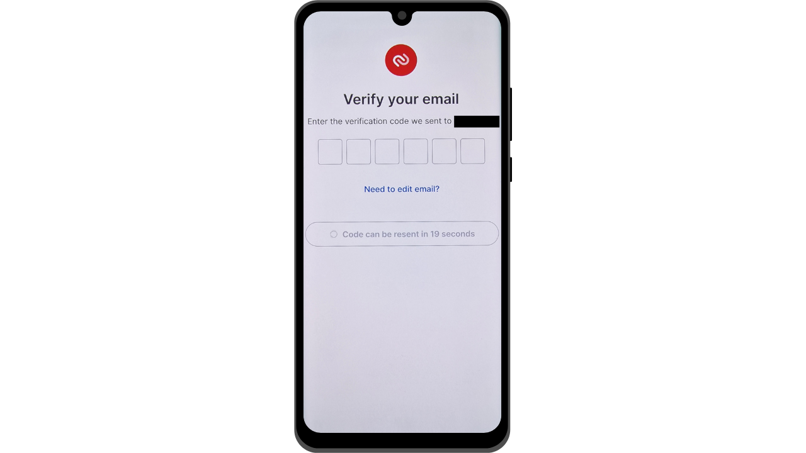

अपने फोन नंबर को सत्यापित करने के लिए दो उपलब्ध तरीकों में से एक का चयन करें। यदि आप एसएमएस प्राप्त करने का विकल्प चुनते हैं, तो संदेश द्वारा प्राप्त 6-अंकों का कोड दर्ज करें ताकि आपका नंबर पुष्टि हो सके।

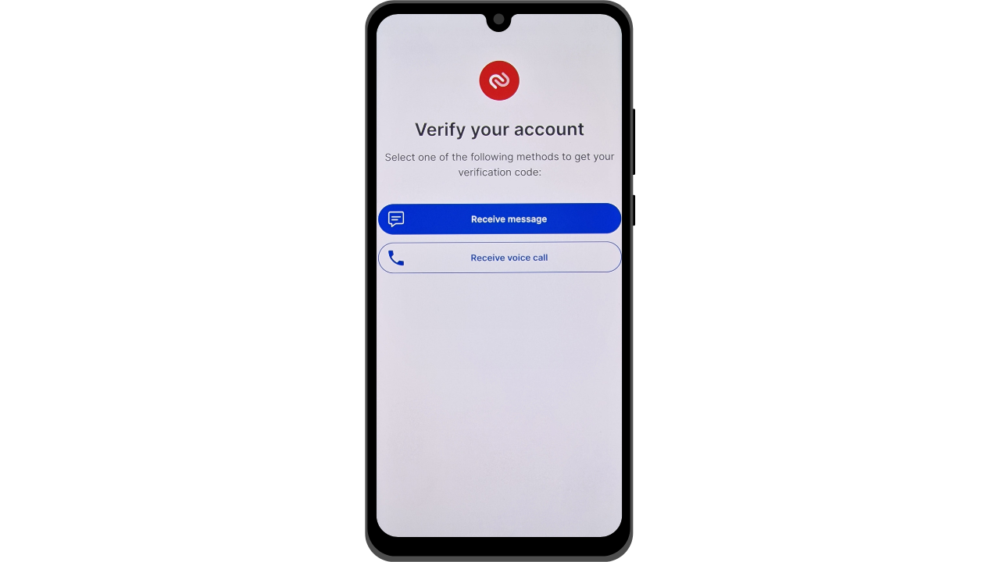

बधाई हो, आपका Authy खाता बन गया है!

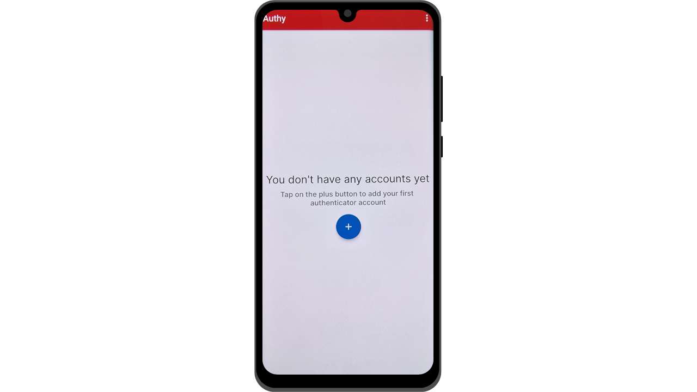

## Authy को कैसे कॉन्फ़िगर करें?

शुरू करने के लिए, स्क्रीन के ऊपर दाईं ओर स्थित तीन छोटे बिंदुओं पर क्लिक करके ऐप की सेटिंग्स में जाएं।

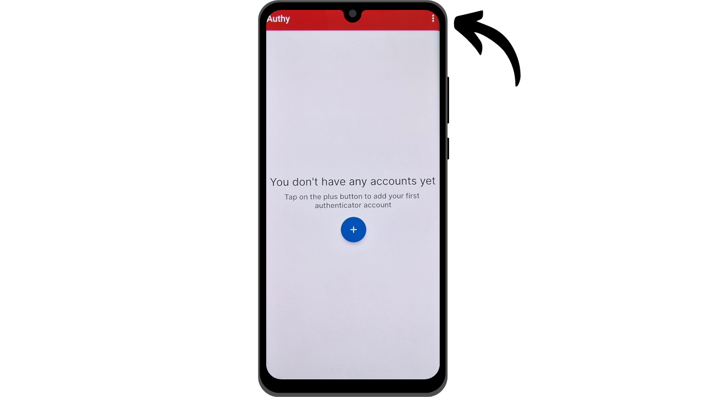

फिर "*सेटिंग्स*" पर क्लिक करें।

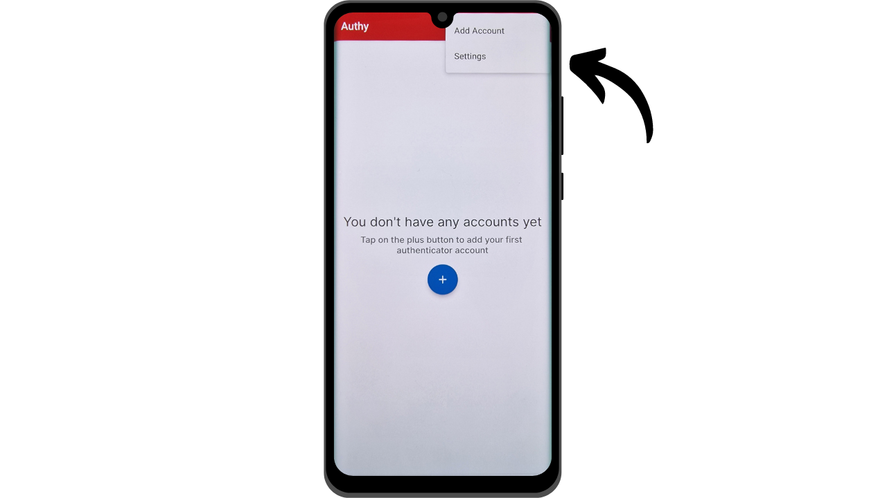

"*माई अकाउंट*" टैब में, आपके पास अपने खाते को संशोधित करने का विकल्प होता है। मैं सुझाव देता हूँ कि आप "*ऐप प्रोटेक्शन*" चुनकर ऐप में एक पिन कोड जोड़ें। इससे आपके ऐप तक पहुँचने के लिए अतिरिक्त सुरक्षा मिलती है।

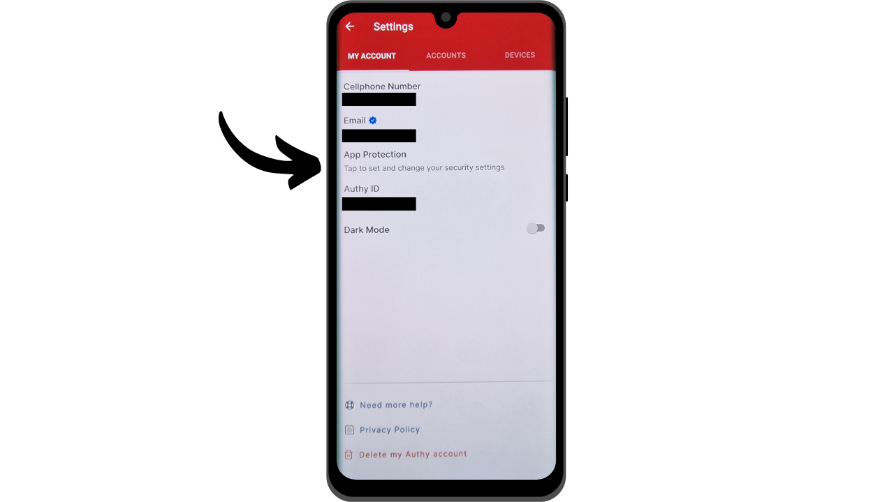

"*Accounts*" टैब में, आप अपने टोकन के लिए एक बैकअप सेट कर सकते हैं। यह बैकअप किसी समस्या की स्थिति में आपके कोड्स को रिकवर करने की सुविधा देता है। इसे एक पासवर्ड का उपयोग करके एन्क्रिप्ट किया जाता है, जिसे आपको परिभाषित करना होगा। यह महत्वपूर्ण है कि यह पासवर्ड मजबूत हो और सुरक्षित स्थान पर रखा जाए। यदि आपके पास अन्य रिकवरी विधियाँ हैं, जैसे कि एक दूसरा डिवाइस जिसमें वही Authy खाता हो, तो इस बैकअप को सेट करना अनिवार्य नहीं है।

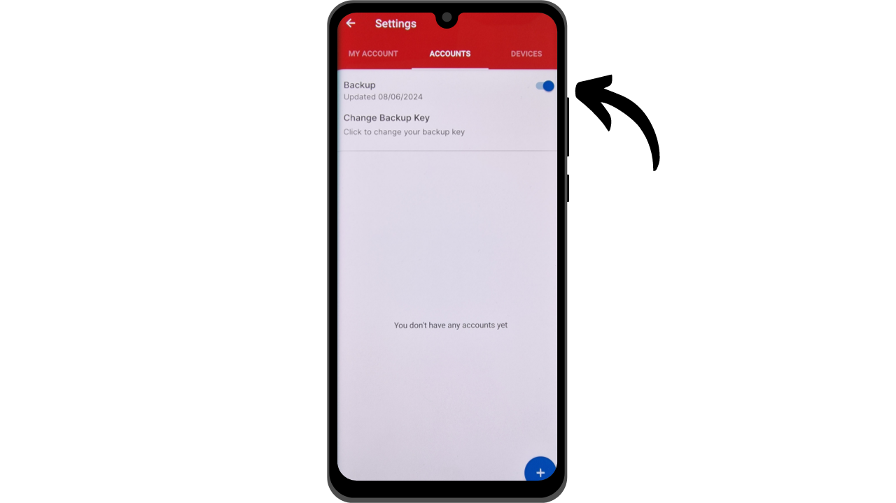In the "*Devices*" tab, you can see all the devices synchronized with your Authy account. You have the option to disable the use of multiple devices, which restricts access to your account to that device only. If you use only one device, this can increase the security of your account, but make sure you have another backup method in case you lose that device.

अगर आप चाहते हैं कि अन्य डिवाइस जोड़े जा सकें, तो मैं सलाह दूंगा कि आप अपने Authy अकाउंट पर वह विकल्प सक्रिय करें जिसमें नए डिवाइस जोड़ने से पहले वर्तमान में अधिकृत डिवाइस से पुष्टि की आवश्यकता होती है।

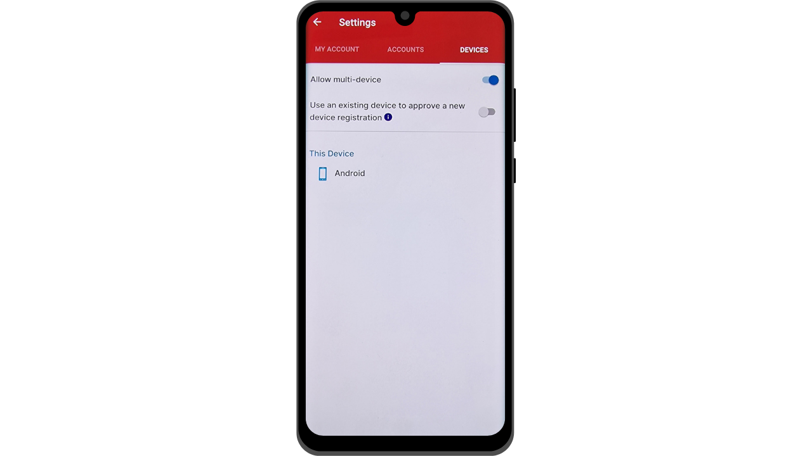

एक नया डिवाइस जोड़ने के लिए, बस पिछले भाग में बताए गए इंस्टॉलेशन प्रक्रिया को उसी क्रेडेंशियल्स के साथ दोहराएं। इसके बाद, आपके मुख्य डिवाइस से इस नए एक्सेस की पुष्टि करने के लिए कहा जाएगा।

## किसी खाते पर 2FA (दो-चरणीय प्रमाणीकरण) सेट अप करने के लिए, आपको निम्नलिखित कदम उठाने होंगे:

1. **खाते में लॉग इन करें**: सबसे पहले, उस खाते में लॉग इन करें जिस पर आप 2FA सेट करना चाहते हैं।

2. **सुरक्षा सेटिंग्स पर जाएं**: खाते की सेटिंग्स में जाकर 'सुरक्षा' या 'प्राइवेसी' विकल्प खोजें। यह विकल्प आमतौर पर सेटिंग्स के मेन्यू में होता है।

3. **2FA विकल्प चुनें**: सुरक्षा सेटिंग्स में, 'दो-चरणीय प्रमाणीकरण' या '2FA' विकल्प को खोजें और उस पर क्लिक करें।

4. **प्रमाणीकरण विधि चुनें**: आपको आमतौर पर दो विकल्प मिलेंगे - एसएमएस के माध्यम से कोड प्राप्त करना या एक प्रमाणीकरण ऐप (जैसे Google Authenticator या Authy) का उपयोग करना। अपनी सुविधा के अनुसार कोई एक विकल्प चुनें।

5. **निर्देशों का पालन करें**: चुनी गई विधि के अनुसार निर्देशों का पालन करें। अगर आप ऐप का उपयोग कर रहे हैं, तो ऐप डाउनलोड करें और दिए गए QR कोड को स्कैन करें। अगर एसएमएस का विकल्प चुना है, तो अपना मोबाइल नंबर दर्ज करें।

6. **कोड दर्ज करें**: सेटअप प्रक्रिया को पूरा करने के लिए, आपको एक कोड दर्ज करना होगा जो आपके फोन पर भेजा जाएगा या ऐप में दिखेगा।

7. **सहेजें और पुष्टि करें**: सभी जानकारी सही से भरने के बाद, 'सहेजें' या 'कन्फर्म' पर क्लिक करें।

अब आपका 2FA सेट हो गया है। अगली बार जब आप लॉग इन करेंगे, तो आपको पासवर्ड के अलावा एक अतिरिक्त कोड भी दर्ज करना होगा, जो आपके फोन पर भेजा जाएगा या ऐप में दिखेगा।

किसी खाते पर Authy जैसे ऐप के माध्यम से 2FA प्रमाणीकरण कोड सेट करने के लिए, खाते को इस सुविधा का समर्थन करना चाहिए। आजकल, अधिकांश ऑनलाइन सेवाएं यह 2FA विकल्प प्रदान करती हैं, लेकिन यह हमेशा संभव नहीं होता। चलिए एक उदाहरण लेते हैं, जैसे कि Proton मेल खाता जिसे मैंने एक अन्य ट्यूटोरियल में प्रस्तुत किया था:

https://planb.network/tutorials/computer-security/communication/proton-mail-c3b010ce-254d-4546-b382-19ab9261c6a2
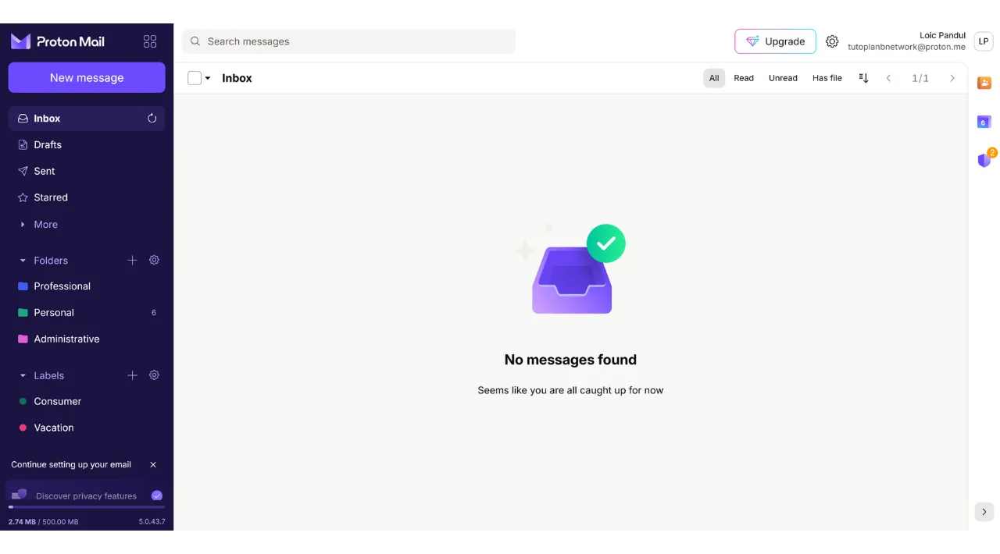

आपको यह 2FA विकल्प आमतौर पर आपके खाते की सेटिंग्स में मिलेगा, अक्सर "*पासवर्ड*" या "*सुरक्षा*" अनुभाग के तहत।

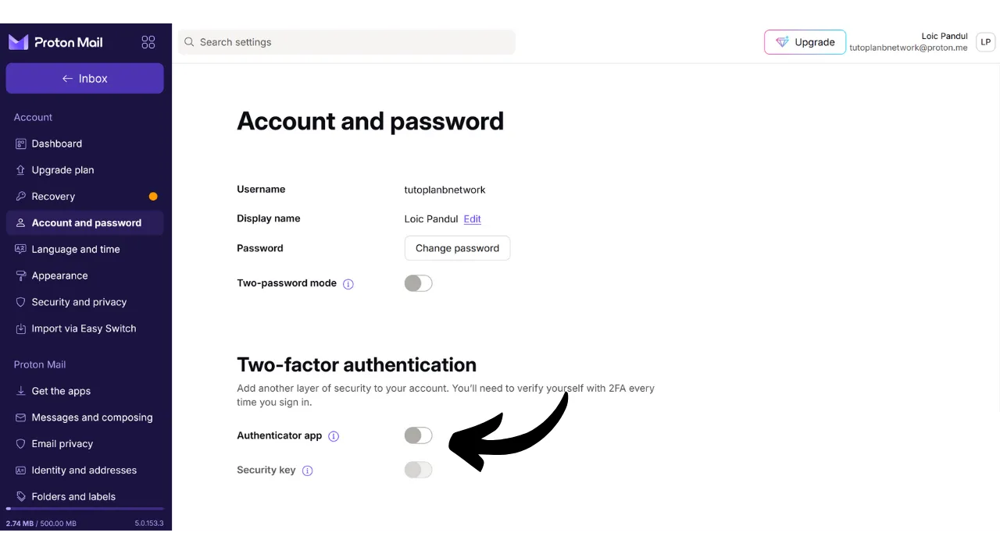

जब आप अपने Proton मेल खाते पर इस विकल्प को सक्रिय करते हैं, तो आपको एक QR कोड दिखाया जाता है। इसके बाद आपको इस QR कोड को अपने Authy ऐप से स्कैन करना होता है।

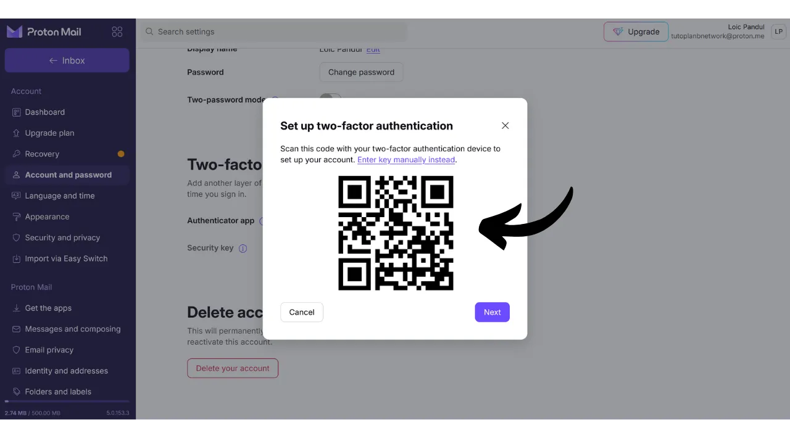

Authy पर "*+*" बटन पर क्लिक करें।

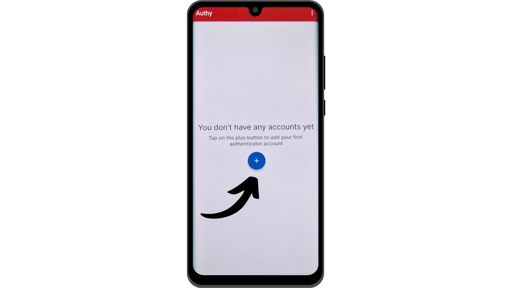

"*स्कैन क्यूआर कोड*" पर क्लिक करें। फिर वेबसाइट पर दिए गए क्यूआर कोड को स्कैन करें।

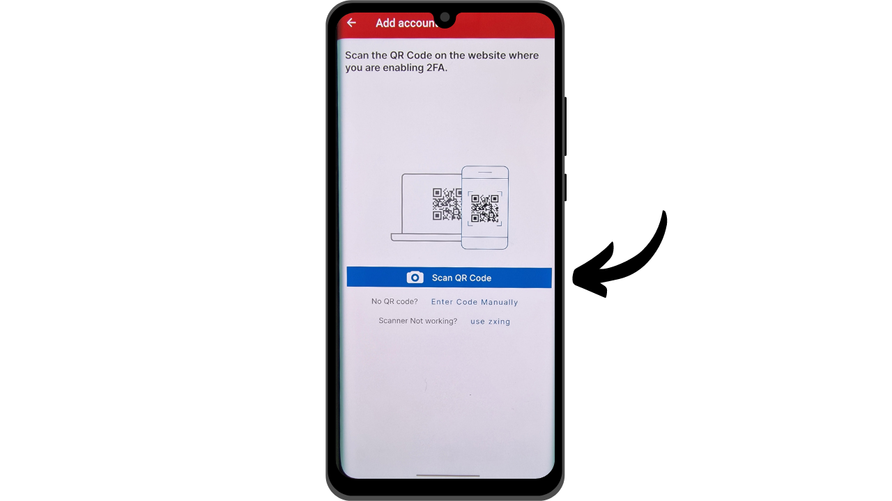

आपके पास अपना उपयोगकर्ता नाम बदलने का विकल्प भी है। बदलाव करने के बाद, "*SAVE*" बटन पर क्लिक करें।

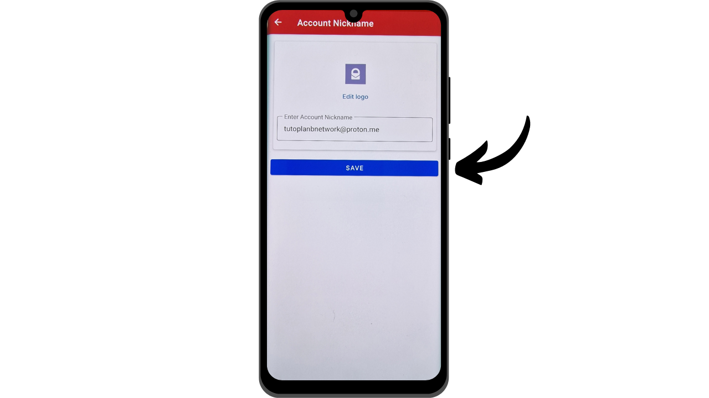

Authy फिर आपके उस खाते के लिए विशेष 6-अंकीय कोड दिखाएगा, जो हर 30 सेकंड में ताज़ा होता है।

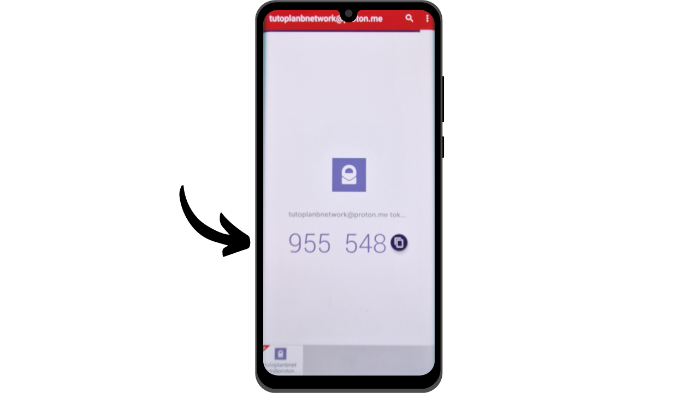

इस कोड को वेबसाइट पर डालें ताकि 2FA सेटअप पूरा हो सके।

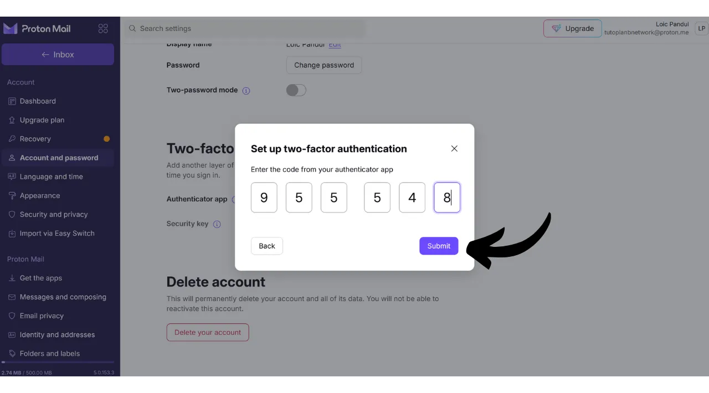

कुछ साइट्स 2FA सक्रिय करने के बाद आपको रिकवरी कोड्स भी देती हैं। ये कोड्स आपको आपके अकाउंट तक पहुँचने में मदद करते हैं अगर आप अपनी Authy ऐप का एक्सेस खो देते हैं। मैं सलाह दूंगा कि इन्हें किसी सुरक्षित जगह पर सहेज कर रखें।

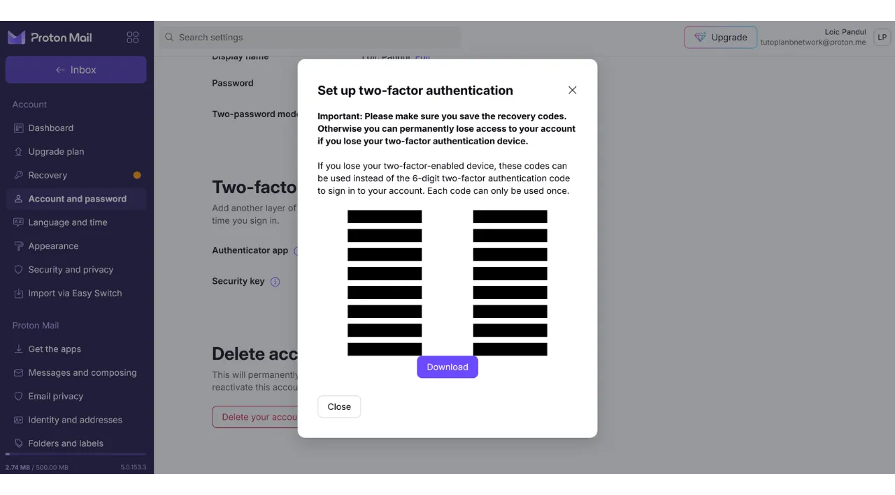Your account is now secured with two-factor authentication via the Authy app.

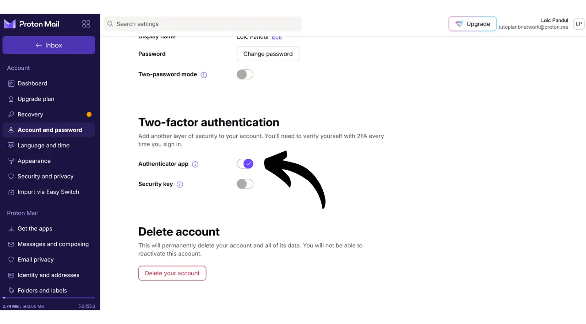

हर बार जब आप अपने खाते में लॉग इन करते हैं, तो आपको Authy द्वारा उत्पन्न किया गया डायनामिक कोड प्रदान करना होगा। अब आप इस 2FA विधि के साथ संगत सभी खातों को सुरक्षित कर सकते हैं। Authy पर एक नया खाता जोड़ने के लिए, ऐप के ऊपर दाईं ओर तीन छोटे बिंदुओं पर क्लिक करें।

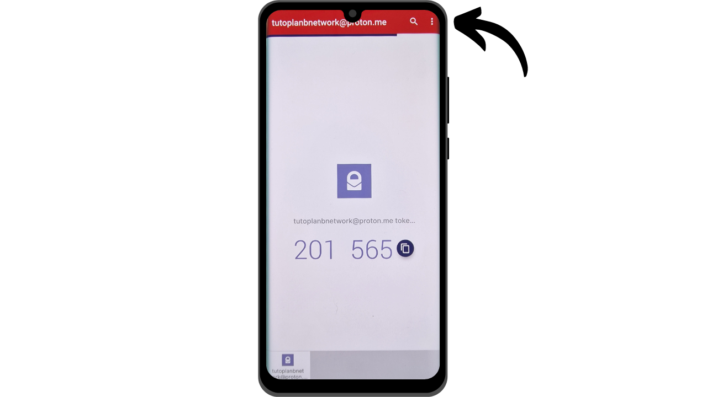

फिर "*Add Account*" पर क्लिक करें।

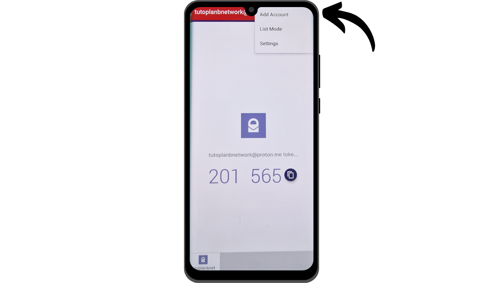

पहले खाते के लिए जिन चरणों का उपयोग किया गया था, उन्हीं चरणों का पालन करें। आपके विभिन्न डायनामिक कोड Authy होम पेज पर दिखाई देंगे।