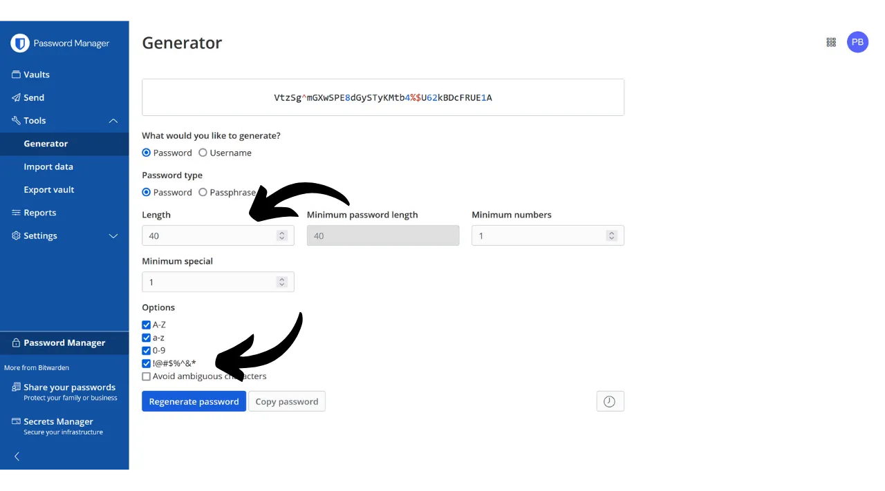
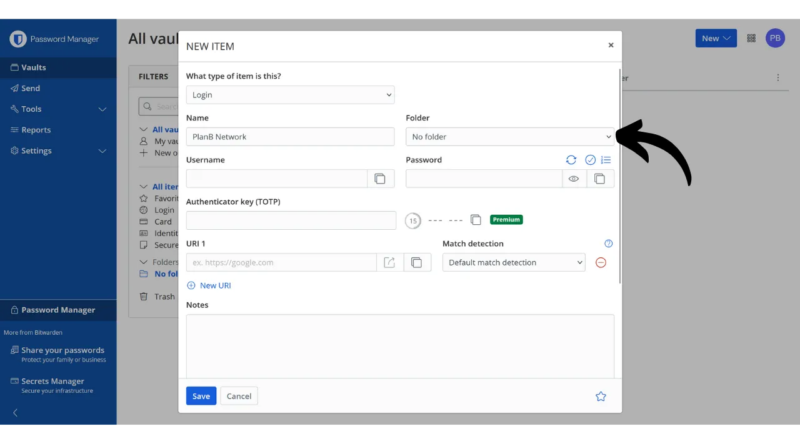
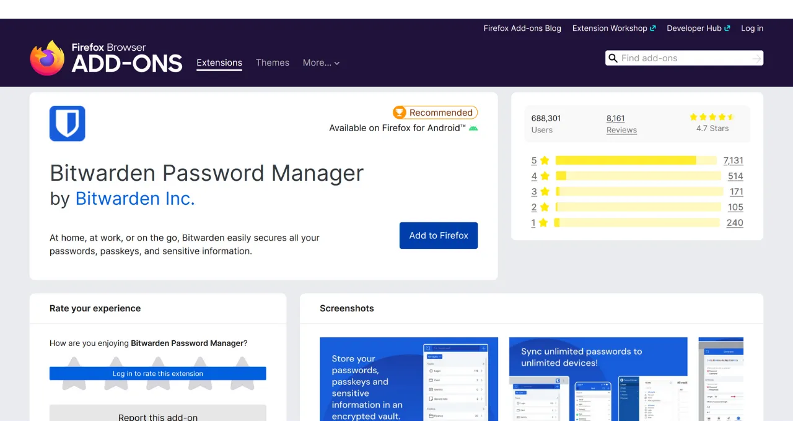

Digiajastul peame haldama mitmeid veebikontosid, mis hõlmavad meie igapäevaelu erinevaid aspekte, sealhulgas pangandust, finantsplatvorme, e-kirju, failihoidlat, tervist, administratsiooni, sotsiaalvõrgustikke, videomänge jne.

Iga sellise konto autentimiseks kasutame identifikaatorit, tihti e-posti aadressi, millele lisandub parool. Silmitsi olukorraga, kus on võimatu meelde jätta suurt hulka unikaalseid paroole, võib tekkida kiusatus kasutada sama parooli või muuta veidi ühist alust, et seda kergesti meelde jätta. Siiski seab see tava teie kontode turvalisuse tõsiselt ohtu.

Esimene põhimõte paroolide puhul on mitte neid korduvalt kasutada. Iga veebikonto peaks olema kaitstud täiesti eristuva unikaalse parooliga. See on oluline, sest kui ründaja suudab kompromiteerida ühe teie paroolidest, ei soovi te, et tal oleks juurdepääs kõigile teie kontodele. Iga konto jaoks unikaalse parooli omamine isoleerib potentsiaalsed rünnakud ja piirab nende ulatust. Näiteks, kui kasutate sama parooli videomänguplatvormi ja oma e-posti jaoks ning see parool kompromiteeritakse läbi videomänguplatvormiga seotud õngitsussaidi, võib ründaja seejärel kergesti pääseda ligi teie e-postile ja võtta kontrolli kõigi teiste veebikontode üle.

Teine oluline põhimõte on parooli tugevus. Parooli peetakse tugevaks, kui seda on raske jõuga ära arvata, st läbi katse-eksituse meetodi. See tähendab, et teie paroolid peavad olema võimalikult juhuslikud, pikad ja sisaldama erinevaid tähemärke (väiketähed, suurtähed, numbrid ja sümbolid).

Nende kahe parooliturvalisuse põhimõtte (unikaaalsus ja robustsus) rakendamine igapäevaelus võib osutuda keeruliseks, kuna on peaaegu võimatu meelde jätta unikaalset, juhuslikku ja tugevat parooli kõigile meie kontodele. Siin tuleb mängu paroolihaldur.

Paroolihaldur genereerib ja hoiab turvaliselt tugevaid paroole, võimaldades teil pääseda ligi kõigile oma veebikontodele ilma, et peaksite neid ükshaaval meelde jätma. Teil on vaja meeles pidada ainult ühte parooli, peaparooli, mis annab teile juurdepääsu kõigile halduris salvestatud paroolidele. Paroolihalduri kasutamine suurendab teie veebiturvalisust, kuna see hoiab ära paroolide korduvkasutuse ja genereerib süsteemselt juhuslikke paroole. Kuid see lihtsustab ka teie igapäevast kontode kasutamist, keskendades juurdepääsu teie tundlikule teabele.
Selles õpetuses uurime, kuidas seadistada ja kasutada paroolihaldurit, et suurendada oma veebiturvalisust. Tutvustan teile Bitwardeni ja teises õpetuses vaatame teist lahendust nimega KeePass.
https://planb.network/tutorials/computer-security/authentication/keepass-f8073bb7-5b4a-4664-9246-228e307be246

Hoiatus: Paroolihaldur on suurepärane paroolide hoidmiseks, kuid **te ei tohiks kunagi hoida selles oma Bitcoini rahakoti mnemoonilist fraasi!** Pea meeles, et mnemooniline fraas tuleks eksklusiivselt salvestada füüsilisel kujul, nagu paberil või metallil.

## Tutvustus Bitwardenile

Bitwarden on paroolihaldur, mis sobib nii algajatele kui ka edasijõudnutele. See pakub mitmeid eeliseid. Esiteks ja kõige tähtsamalt, Bitwarden on mitmeplatvormiline lahendus, mis tähendab, et saate seda kasutada mobiilirakendusena, veebirakendusena, brauserilaiendina ja lauaarvutitarkvarana.

Bitwarden võimaldab teil salvestada oma paroole veebis ja sünkroniseerida neid kõigil oma seadmetel, tagades samal ajal lõpp-lõpuni krüpteerimise oma peaparooliga. See võimaldab teil näiteks pääseda ligi oma paroolidele nii arvutis kui ka nutitelefonis, sünkroniseerides need kahe vahel. Kuna teie paroolid on krüpteeritud, jäävad need kõigile, kaasa arvatud Bitwardenile, kättesaamatuks ilma dekrüpteerimisvõtmeta, mis on teie peaparool.
Lisaks on Bitwarden avatud lähtekoodiga, mis tähendab, et tarkvara saavad auditeerida sõltumatud eksperdid. Hinnakujunduse osas pakub Bitwarden kolme plaani:
- Tasuta versioon, mida me selles õpetuses uurime. Kuigi see on tasuta, pakub see turvalisuse taset, mis on võrdväärne tasuliste versioonidega. Saate salvestada piiramatu arvu paroole ja sünkroniseerida nii palju seadmeid kui soovite;
- Premium versioon 10 dollari eest aastas, mis sisaldab lisafunktsioone nagu failihoidla, pangakaardi varundamine, võimalus seadistada 2FA füüsilise turvavõtmega ja juurdepääs TOTP 2FA autentimisele otse Bitwardeniga;
- Ja pereplaan 40 dollari eest aastas, mis laiendab premium versiooni eeliseid kuuele erinevale kasutajale.

Minu arvates on need hinnad õiglased. Tasuta versioon on suurepärane valik algajatele ja premium versioon pakub väga head hinna ja kvaliteedi suhet võrreldes teiste turul olevate paroolihalduritega, pakkudes samal ajal rohkem funktsioone. Lisaks on Bitwardeni avatud lähtekoodiga olemine suur eelis. Seega on see huvitav kompromiss, eriti algajatele.
Teine Bitwardeni omadus on võimalus ise hostida oma paroolihaldurit, kui omate näiteks kodus NAS-i. Selle seadistuse abil ei salvestata teie paroole Bitwardeni serverites, vaid teie enda serverites. See annab teile täieliku kontrolli oma paroolide kättesaadavuse üle. Siiski nõuab see valik range varundamise haldamist, et vältida juurdepääsu kaotust. Seetõttu sobib Bitwardeni ise hostimine rohkem edasijõudnud kasutajatele ja me arutame seda teises õpetuses.
## Kuidas luua Bitwardeni konto?

Külastage [Bitwardeni veebisaiti](https://bitwarden.com/) ja klõpsake nupul "*Alusta*".

Alustage oma e-posti aadressi ja oma nime või hüüdnime sisestamisega.

Järgmisena peate seadistama oma peamise parooli. Nagu sissejuhatuses nägime, on see parool väga oluline, kuna see annab teile juurdepääsu kõigile teie teistele salvestatud paroolidele halduris. See toob kaasa kaks peamist riski: kaotus ja kompromiteerimine. Kui kaotate juurdepääsu sellele paroolile, ei saa te enam kõigile oma volitustele juurde pääseda. Kui teie parool varastatakse, saab ründaja juurdepääsu kõigile teie kontodele.

Kaotuse riski minimeerimiseks soovitan teha oma peamisest paroolist füüsilise varukoopia paberil ja hoida seda turvalises kohas. Kui võimalik, pitseerige see varukoopia turvalises ümbrikus, et regulaarselt veenduda, et keegi teine pole sellele juurde pääsenud.

Oma peamise parooli kompromiteerimise vältimiseks peab see olema äärmiselt tugev. See peaks olema võimalikult pikk, kasutama laia valikut tähemärke ja olema valitud juhuslikult. 2024. aasta minimaalsed soovitused turvalise parooli jaoks on 13 tähemärki, sealhulgas numbrid, väiketähed ja suurtähed ning sümbolid, eeldusel, et parool on tõeliselt juhuslik. Siiski soovitan valida vähemalt 20-tähemärgilise parooli, mis sisaldab kõiki võimalikke tähemärkide tüüpe, et tagada selle turvalisus pikemaks ajaks.

Sisestage oma peamine parool vastavasse lahtrisse ja kinnitage see järgmises lahtris.

Kui soovite, võite oma peaparoolile vihje lisada. Siiski soovitan seda mitte teha, kuna vihje ei paku usaldusväärset taastamismeetodit juhul, kui kaotate oma parooli, ja võib isegi olla kasulik ründajatele, kes üritavad teie parooli ära arvata või jõuga murda. Üldreeglina vältige avalike vihjete loomist, mis võiksid ohustada teie peaparooli turvalisust.

Seejärel klõpsake nupul "*Loo konto*".

Nüüd saate sisse logida oma uude Bitwardeni kontosse. Sisestage oma e-posti aadress.

Seejärel tippige oma peaparool.

Nüüd olete oma paroolihalduri veebiliideses.

## Kuidas seadistada Bitwardeni?

Alustuseks kinnitame oma e-posti aadressi. Klõpsake nupul "*Saada e-kiri*".

Seejärel klõpsake e-postiga saadud nupul.

Lõpuks logige uuesti sisse.

Eelkõige soovitan tungivalt seadistada kahefaktoriline autentimine (2FA), et oma paroolihaldurit turvata. Teil on valik kasutada TOTP rakendust või füüsilist turvavõtit. Aktiveerides 2FA, küsitakse iga kord, kui logite oma Bitwardeni kontole sisse, mitte ainult teie peaparooli, vaid ka teie teise autentimisfaktori tõendit. See on lisaturvalisuse kiht, eriti kasulik juhul, kui teie peaparooli paberkoopia on kompromiteeritud.

Kui te pole kindel, kuidas neid 2FA seadmeid seadistada ja kasutada, soovitan järgida neid kahte muud õpetust:

https://planb.network/tutorials/computer-security/authentication/authy-a76ab26b-71b0-473c-aa7c-c49153705eb7

https://planb.network/tutorials/computer-security/authentication/security-key-61438267-74db-4f1a-87e4-97c8e673533e

Selleks minge menüüs "*Seaded*" vahekaardile "*Turvalisus*".

Seejärel klõpsake vahekaardil "*Kaheastmeline sisselogimine*".

Siin saate valida endale meelepärase 2FA meetodi. Näiteks valin mina 2FA TOTP rakendusega, klõpsates nupul "*Halda*".

Kinnitage oma peaparool.

Seejärel skannige QR-kood oma 2FA rakendusega.

Sisestage oma 2FA rakendusel märgitud 6-kohaline kood, seejärel klõpsake nupul "*Lülita sisse*". 
Kahefaktoriline autentimine on teie kontol edukalt seadistatud.

Nüüd, kui proovite oma haldurisse uuesti sisse logida, peate esmalt sisestama oma peaparooli, seejärel 2FA rakenduse poolt genereeritud dünaamilise 6-kohalise koodi. Veenduge, et teil oleks alati juurdepääs sellele dünaamilisele koodile; ilma selleta ei saa te oma paroole taastada.

Seadetes on teil võimalus ka oma haldurit kohandada vahekaardil "*Eelistused*". Siin saate muuta aega, enne kui teie haldur automaatselt lukustub, samuti liidese keelt ja teemat.
Soovitan tungivalt kohandada Bitwardeni poolt genereeritud paroolide pikkust. Vaikimisi on pikkus määratud 14 tähemärgile, mis võib optimaalse turvalisuse tagamiseks olla ebapiisav. Nüüd, kui teil on haldur, kes kõik teie paroolid meeles peab, võiksite seda ära kasutada, et kasutada väga tugevaid paroole.

Selleks minge menüüsse "*Generator*".

Siin saate suurendada oma paroolide pikkust kuni 40 tähemärgini ja märkida ruudu, et lisada sümbolid.

## Kuidas oma kontosid Bitwardeniga kaitsta?

Nüüd, kui teie paroolihaldur on seadistatud, võite alustada oma veebikontode mandaatide salvestamist. Uue üksuse lisamiseks klõpsake otse nupul "*New item*" või ekraani paremas ülanurgas asuval nupul "*New*", seejärel valige "*item*".

Avanevas vormis alustage salvestatava üksuse olemuse määramisega. Sisselogimismandaatide salvestamiseks valige rippmenüüst valik "*Login*".

Väljale "*Name*" sisestage oma mandaatidele kirjeldav nimi. See teeb teie paroolide otsimise ja organiseerimise lihtsamaks, eriti kui teil on suur hulk. Näiteks, kui soovite salvestada oma mandaadid PlanB Network saidile, võite selle üksuse nimetada viisil, mis muudab selle tulevikus otsingutel kohe äratuntavaks.

Valik "*Folder*" võimaldab teie mandaate kaustadesse klassifitseerida. Praegu me pole veel ühtegi loonud, kuid ma näitan teile hiljem, kuidas seda teha.

Väljale "*Username*" sisestage oma kasutajanimi, mis on tavaliselt teie e-posti aadress. 
Järgmisena väljal "*Password*" saate sisestada oma parooli. Siiski soovitan tungivalt lasta Bitwardenil teie jaoks genereerida pikk, juhuslik ja unikaalne parool. See tagab tugeva parooli. Selle funktsiooni kasutamiseks klõpsake välja kohal olevat topelt noole ikooni.

Näete, et teie parool on genereeritud.

Väljale "*URI 1*" saate sisestada veebisaidi domeeninime.

Ja lõpuks, väljal "*Notes*" saate vajadusel lisada täiendavaid üksikasju.

Kui olete kõik need väljad täitnud, klõpsake nupul "*Save*".

Teie identifikaator ilmub nüüd teie Bitwardeni haldurisse.

Sellel klõpsates pääsete juurde selle üksikasjadele ja saate neid muuta.

Paremal asuvatel kolmel väikesel punktil klõpsates pääsete kiiresti parooli või identifikaatori kopeerimise juurde.

Palju õnne, olete edukalt salvestanud oma esimese parooli oma haldurisse! Kui soovite oma identifikaatoreid paremini organiseerida, saate luua spetsiifilisi kaustu. Selleks klõpsake ekraani paremas ülanurgas asuval nupul "*New*", seejärel valige "*Folder*". 
Sisestage oma kaustale nimi.

Seejärel klõpsake nupul "*Save*".

Teie kaust ilmub nüüd teie halduris.

Identifikaatorile saate kausta määrata selle loomisel, nagu me varem tegime, või olemasolevat identifikaatorit muutes. Näiteks klõpsates oma identifikaatoril PlanB Network, saan seejärel valida selle klassifitseerimise kausta "*Bitcoin*".

Nii saate oma paroolihalduri struktureerida, et leida oma identifikaatoreid lihtsamini. Saate neid organiseerida kaustadesse nagu isiklik, professionaalne, pangad, e-postid, sotsiaalvõrgustikud, tellimused, ostud, haldus, voogedastus, salvestus, reisimine, tervis jne.
Kui eelistate kasutada ainult Bitwardeni veebiversiooni, on see täiesti võimalik. Soovitan siis lisada oma paroolihalduri brauseri lemmikutesse, et tagada lihtne juurdepääs ja vältida õngitsusriski. Siiski pakub Bitwarden ka täielikku klientide valikut, mis võimaldab teil oma haldurit erinevatel seadmetel kasutada ja selle igapäevast kasutamist lihtsustada. Nad pakuvad märkimisväärselt mobiilirakendust, brauserilaiendust ja lauaarvutitarkvara. Vaatame koos, kuidas neid seadistada.

## Kuidas kasutada Bitwardeni brauserilaiendust?

Esmalt, kui soovite, saate seadistada brauserilaienduse. See laiendus toimib teie halduri vähendatud versioonina ja pakub teile võimalust automaatselt salvestada uusi paroole, genereerida turvaliste paroolide ettepanekuid ja automaatselt täita teie mandaate veebisaidi sisselogimislehtedel.

Selle laienduse igapäevane kasutamine on äärmiselt mugav, kuid see võib avada ka uusi rünnakuvektoreid. Mõned küberturvalisuse eksperdid soovitavad seetõttu brauserilaiendusi paroolihaldurite jaoks mitte kasutada. Kui aga otsustate Bitwardeni laiendust kasutada, siis toimige järgmiselt:

Alustage, minnes [ametlikule Bitwardeni allalaadimise lehele](https://bitwarden.com/download/#downloads-web-browser).

Valige loendist oma brauser. Selle näite puhul kasutan Firefoxi, seega suunatakse mind ametlikule Bitwardeni laiendusele Firefox Add-ons Store'is. Protseduur on teiste brauserite puhul üsna sarnane.

Klõpsake nupul "*Add to Firefox*".

Seejärel saate Bitwardeni oma laienduste ribale kinnitada, et tagada lihtne juurdepääs. Logimiseks klõpsake laiendusel.

Sisestage oma e-posti aadress.

Seejärel oma peamine parool.

Ja lõpuks sisestage oma autentimisrakenduse 6-kohaline kood.

Olete nüüd ühendatud oma Bitwardeni halduriga brauserilaienduse kaudu.

Näiteks, kui ma lähen tagasi PlanB Network lehele ja proovin oma kontole sisse logida, näete, et brauserisse integreeritud Bitwarden laiendus tuvastab sisselogimisväljad ja pakub automaatselt mulle valida varem salvestatud identifikaatori.

Kui ma valin selle identifikaatori, täidab Bitwarden minu eest sisselogimisväljad. Selle laienduse funktsioon võimaldab kiiret ühendust veebilehtedega, ilma et oleks vaja kopeerida-kleepida volitusi Bitwarden veebirakendusest või tarkvarast.

Laiendus on samuti disainitud uute kontode loomise tuvastamiseks. Näiteks, luues uue konto PlanB Network'is, pakub Bitwarden automaatselt uue identifikaatori salvestamist.

Selle ettepaneku peale klõpsates avaneb laiendus. See võimaldab mul sisestada uue identifikaatori üksikasjad ja genereerida tugeva, unikaalse parooli.

Pärast informatsiooni täitmist ja "*Salvesta*" peale klõpsamist, salvestab laiendus volitused.

Seejärel täidab laiendus automaatselt meie volitused vastavates väljades veebilehel.

## Kuidas kasutada Bitwarden tarkvara?

Bitwarden lauaarvuti tarkvara installimiseks alusta [allalaadimise lehele](https://bitwarden.com/download/#downloads-desktop) minemisest. Vali ja laadi alla versioon, mis vastab sinu operatsioonisüsteemile.

Kui allalaadimine on lõpetatud, jätkake tarkvara installimisega oma arvutisse. Bitwarden tarkvara esmakordsel käivitamisel peate sisestama oma volitused, et avada oma paroolihaldur.

Seejärel jõuate oma halduri avalehele. Liides on peaaegu sama nagu veebirakendusel.

## Kuidas kasutada Bitwarden rakendust?

Oma paroolidele telefonist juurdepääsu saamiseks võid installida Bitwarden mobiilirakenduse. Alusta [allalaadimise lehele](https://bitwarden.com/download/#downloads-mobile) minemisega ja kasuta oma nutitelefoni, et skaneerida QR-kood, mis vastab sinu operatsioonisüsteemile.

Laadi alla ja installi ametlik Bitwarden mobiilirakendus. Rakenduse esmakordsel avamisel sisesta oma volitused, et avada juurdepääs oma paroolihaldurile.

Ühenduse loomisel saad kõiki oma paroole otse rakendusest konsulteerida ja hallata.

Rakenduse turvalisuse suurendamiseks soovitan minna seadetesse ja aktiveerida PIN-kaitse. See lisab täiendava turvakihi juhuks, kui kaotad oma telefoni või see varastatakse.

## Kuidas varundada Bitwarden?
Et tagada, et sa ei kaota kunagi juurdepääsu oma paroolidele, isegi kui kaotad oma peaparooli või Bitwardeni servereid mõjutab katastroof, soovitan regulaarselt teha oma halduri krüpteeritud varukoopia välisele meediumile.
Mõte on krüpteerida kõik teie Bitwardeni volitused parooliga, mis erineb teie peamisest paroolist, ning salvestada see krüpteeritud varukoopia USB mälupulgale või kõvakettale, mida hoiate näiteks kodus. Seejärel võite hoida füüsilist koopiat dekrüpteerimisparoolist eraldi kohas, kus varukandja asub. Näiteks võiksite USB mälupulga hoida kodus ja usaldada füüsilise koopia krüpteerimisparoolist usaldusväärsele sõbrale.
See meetod tagab, et isegi kui teie varukandja varastatakse, jäävad teie andmed ilma dekrüpteerimisparoolita kättesaamatuks. Samamoodi ei saa teie sõber ilma füüsilise kandjata teie andmetele ligi.

Siiski, probleemi korral saate parooli ja välist kandjat kasutades taastada juurdepääsu oma volitustele, sõltumata Bitwardenist. Seega, isegi kui Bitwardeni serverid hävitataks, oleks teil siiski võimalus oma paroole taastada.

Seetõttu soovitan teil neid varukoopiaid regulaarselt teha, et need sisaldaksid alati teie kõige uuemaid volitusi. Et vältida oma sõbra tülitamist, kes hoiab krüpteerimisparooli koopiat, iga uue varukoopia puhul, võite selle parooli salvestada oma paroolihaldurisse. See ei ole mõeldud varukoopiana, kuna teie sõbral on juba füüsiline koopia, vaid pigem teie tulevaste ekspordiprotseduuride lihtsustamiseks.

Ekspordi teostamiseks on see üsna lihtne: minge oma Bitwardeni halduri "*Tööriistad*" sektsiooni, seejärel valige "*Ekspordi hoidla*".

Formaadiks valige "*.json (Krüpteeritud)*".

Seejärel valige "*Parooliga kaitstud*" valik.

Siin on oluline valida tugev, unikaalne ja juhuslikult genereeritud parool varukoopia krüpteerimiseks. See tagab, et isegi teie krüpteeritud varukoopia varguse korral oleks ründajal võimatu seda jõuga lahti murda.

Klõpsake "*Kinnita formaat*" ja sisestage oma peamine parool, et jätkata ekspordiga.

Kui eksport on lõpetatud, leiate oma krüpteeritud varukoopi faili allalaadimistest. Kandke see turvalisele välisele salvestusseadmele, nagu USB mälupulk või kõvaketas. Korrake seda toimingut perioodiliselt vastavalt oma kasutusele. Näiteks võite varukoopia uuendada iga nädal või iga kuu, vastavalt teie vajadustele.