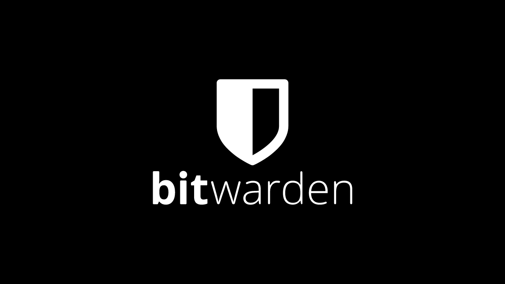

डिजिटल युग में, हमें अपने दैनिक जीवन के विभिन्न पहलुओं को कवर करने वाले कई ऑनलाइन खातों का प्रबंधन करना होता है, जिसमें बैंकिंग, वित्तीय प्लेटफॉर्म, ईमेल, फाइल स्टोरेज, स्वास्थ्य, प्रशासन, सोशल नेटवर्क, वीडियो गेम्स आदि शामिल हैं।

इन खातों पर अपनी पहचान सत्यापित करने के लिए, हम एक पहचानकर्ता का उपयोग करते हैं, जो अक्सर एक ईमेल Address होता है, और इसके साथ एक पासवर्ड होता है। बहुत सारे अनोखे पासवर्ड याद रखने में असमर्थ होने पर, कोई एक ही पासवर्ड का पुनः उपयोग करने या एक सामान्य आधार को थोड़ा बदलकर याद रखने की कोशिश कर सकता है। हालांकि, ये तरीके आपके खातों की सुरक्षा को गंभीर रूप से खतरे में डालते हैं।

पासवर्ड के लिए पहला सिद्धांत यह है कि उन्हें दोबारा इस्तेमाल न करें। हर ऑनलाइन खाते को एक अनोखे पासवर्ड से सुरक्षित किया जाना चाहिए, जो बाकी सभी से पूरी तरह अलग हो। यह इसलिए महत्वपूर्ण है क्योंकि अगर कोई हमलावर आपके किसी एक पासवर्ड को हैक कर लेता है, तो आप नहीं चाहेंगे कि उसे आपके सभी खातों तक पहुंच मिल जाए। हर खाते के लिए अलग पासवर्ड रखने से संभावित हमलों को अलग-थलग किया जा सकता है और उनके प्रभाव को सीमित किया जा सकता है। उदाहरण के लिए, अगर आप एक ही पासवर्ड वीडियो गेम प्लेटफॉर्म और अपने ईमेल के लिए इस्तेमाल करते हैं, और वह पासवर्ड गेमिंग प्लेटफॉर्म से जुड़े किसी फिशिंग साइट के जरिए हैक हो जाता है, तो हमलावर आसानी से आपके ईमेल तक पहुंच सकता है और आपके बाकी सभी ऑनलाइन खातों पर नियंत्रण कर सकता है।

दूसरा महत्वपूर्ण सिद्धांत है पासवर्ड की मजबूती। एक पासवर्ड को मजबूत तब माना जाता है जब उसे आसानी से अनुमान नहीं लगाया जा सके, यानी कि उसे ट्रायल और एरर के जरिए नहीं तोड़ा जा सके। इसका मतलब है कि आपके पासवर्ड जितने हो सके उतने रैंडम, लंबे और विभिन्न प्रकार के अक्षरों (छोटे, बड़े, नंबर और प्रतीक) को शामिल करने वाले होने चाहिए।

इन दो पासवर्ड सुरक्षा सिद्धांतों (अद्वितीयता और मजबूती) को रोजमर्रा की जिंदगी में लागू करना मुश्किल हो सकता है, क्योंकि हमारे सभी खातों के लिए एक अद्वितीय, रैंडम और मजबूत पासवर्ड याद रखना लगभग असंभव है। यहीं पर पासवर्ड मैनेजर काम आता है।

एक पासवर्ड मैनेजर मजबूत पासवर्ड बनाता है और उन्हें सुरक्षित रूप से स्टोर करता है, जिससे आप अपने सभी ऑनलाइन खातों तक पहुंच सकते हैं बिना उन्हें अलग-अलग याद किए। आपको केवल एक पासवर्ड याद रखना होता है, जिसे मास्टर पासवर्ड कहते हैं, जो आपको मैनेजर में सेव किए गए सभी पासवर्ड्स तक पहुंच प्रदान करता है। पासवर्ड मैनेजर का उपयोग आपकी ऑनलाइन सुरक्षा को बढ़ाता है क्योंकि यह पासवर्ड के पुनः उपयोग को रोकता है और व्यवस्थित रूप से रैंडम पासवर्ड जनरेट करता है। लेकिन यह आपके खातों के दैनिक उपयोग को भी सरल बनाता है क्योंकि यह आपकी संवेदनशील जानकारी तक पहुंच को केंद्रीकृत करता है।

इस ट्यूटोरियल में, हम यह जानेंगे कि एक पासवर्ड मैनेजर कैसे सेट अप करें और उसका उपयोग करें ताकि आपकी ऑनलाइन सुरक्षा बेहतर हो सके। मैं आपको Bitwarden से परिचित कराऊंगा, और एक अन्य ट्यूटोरियल में हम एक और समाधान KeePass के बारे में जानेंगे।

https://planb.network/tutorials/computer-security/authentication/keepass-f8073bb7-5b4a-4664-9246-228e307be246
चेतावनी: पासवर्ड मैनेजर पासवर्ड स्टोर करने के लिए बहुत अच्छा होता है, लेकिन **आपको कभी भी अपने Bitcoin Wallet का Mnemonic वाक्यांश इसमें नहीं रखना चाहिए!** याद रखें, Mnemonic वाक्यांश को केवल भौतिक रूप में, जैसे कि कागज के टुकड़े या धातु पर ही सुरक्षित रखना चाहिए।

## बिटवॉर्डन का परिचय

Bitwarden एक पासवर्ड मैनेजर है जो शुरुआती और अनुभवी दोनों उपयोगकर्ताओं के लिए उपयुक्त है। यह कई फायदे प्रदान करता है। सबसे पहले, Bitwarden एक मल्टी-प्लैटफॉर्म समाधान है, जिसका मतलब है कि आप इसे मोबाइल ऐप, वेब एप्लिकेशन, ब्राउज़र एक्सटेंशन और डेस्कटॉप सॉफ़्टवेयर के रूप में उपयोग कर सकते हैं।

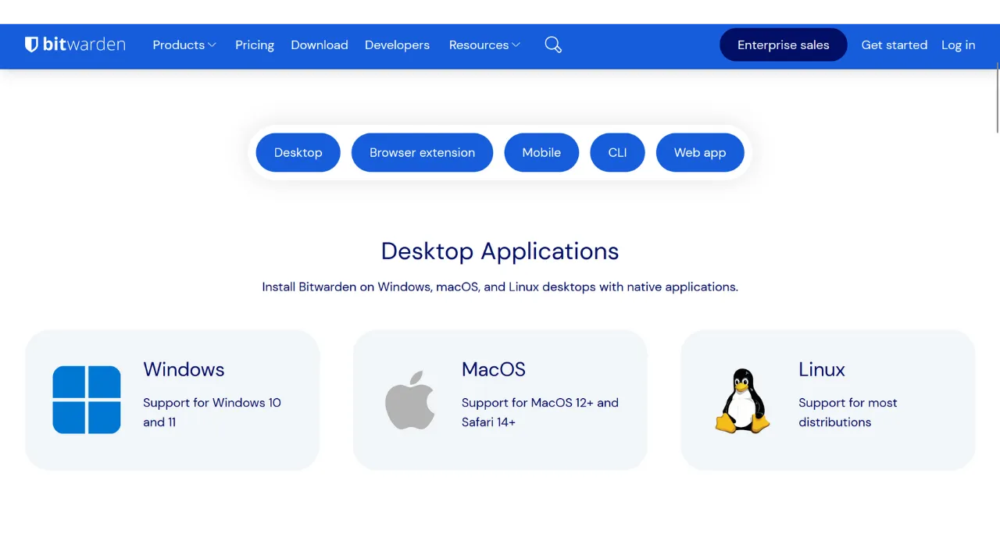

Bitwarden आपको आपके पासवर्ड ऑनलाइन सेव करने और उन्हें आपके सभी डिवाइसों पर सिंक्रोनाइज़ करने की सुविधा देता है, और यह सब आपके मास्टर पासवर्ड के साथ एंड-टू-एंड एन्क्रिप्शन सुनिश्चित करते हुए करता है। इसका मतलब है कि आप अपने कंप्यूटर और स्मार्टफोन दोनों पर अपने पासवर्ड एक्सेस कर सकते हैं, और दोनों के बीच सिंक्रोनाइज़ेशन होता है। चूंकि आपके पासवर्ड एन्क्रिप्टेड होते हैं, वे किसी के लिए भी, यहां तक कि Bitwarden के लिए भी, तब तक पहुंच योग्य नहीं होते जब तक कि आपके पास डिक्रिप्शन की के रूप में आपका मास्टर पासवर्ड न हो।

इसके अलावा, Bitwarden ओपन-सोर्स है, जिसका मतलब है कि स्वतंत्र विशेषज्ञ इस सॉफ़्टवेयर की जांच कर सकते हैं। जहां तक कीमत की बात है, Bitwarden तीन योजनाएं पेश करता है:

- इस ट्यूटोरियल में हम एक मुफ्त संस्करण का पता लगाएंगे। हालांकि यह मुफ्त है, यह भुगतान किए गए संस्करणों के बराबर सुरक्षा स्तर प्रदान करता है। आप अनगिनत पासवर्ड स्टोर कर सकते हैं और जितने चाहें उतने उपकरणों को सिंक्रनाइज़ कर सकते हैं।
- एक प्रीमियम संस्करण $10 प्रति वर्ष में उपलब्ध है, जिसमें कुछ अतिरिक्त सुविधाएँ शामिल हैं जैसे फाइल स्टोरेज, बैंक कार्ड बैकअप, एक फिजिकल सिक्योरिटी की के साथ 2FA सेट करने की क्षमता, और सीधे Bitwarden के साथ TOTP 2FA ऑथेंटिकेशन का एक्सेस।
- और एक पारिवारिक योजना $40 प्रति वर्ष में है, जो प्रीमियम संस्करण के लाभों को छह अलग-अलग उपयोगकर्ताओं तक बढ़ाती है।

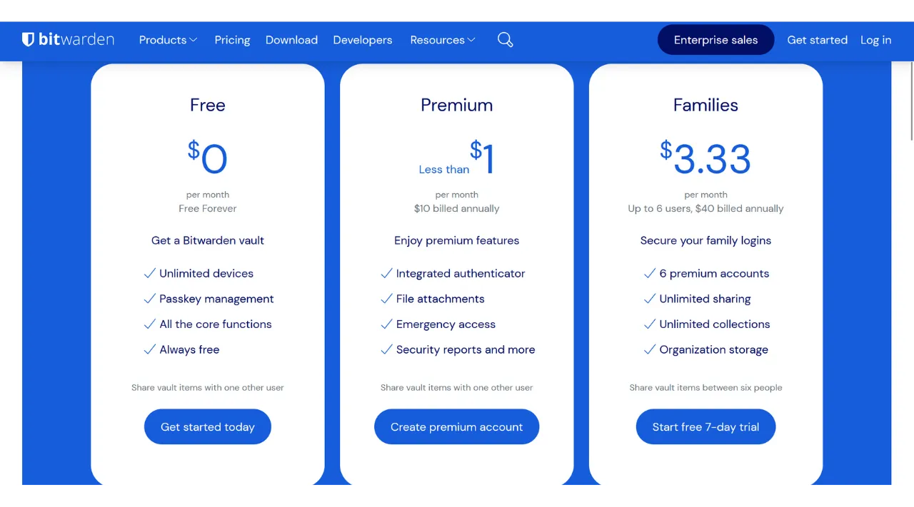

मेरे विचार में, ये कीमतें उचित हैं। शुरुआती लोगों के लिए मुफ्त संस्करण एक बेहतरीन विकल्प है, और प्रीमियम संस्करण अन्य पासवर्ड मैनेजर्स की तुलना में पैसे के लिए बहुत अच्छा मूल्य प्रदान करता है, जबकि अधिक सुविधाएँ भी देता है। इसके अलावा, यह तथ्य कि Bitwarden ओपन-सोर्स है, एक बड़ा फायदा है। इसलिए, यह विशेष रूप से शुरुआती लोगों के लिए एक दिलचस्प समझौता है।

Bitwarden की एक और खासियत यह है कि आप अपने पासवर्ड मैनेजर को खुद होस्ट कर सकते हैं, जैसे कि अगर आपके पास घर पर एक NAS है। इस सेटअप को करने से आपके पासवर्ड Bitwarden के सर्वर पर नहीं, बल्कि आपके अपने सर्वर पर स्टोर होते हैं। इससे आपके पासवर्ड की उपलब्धता पर आपका पूरा नियंत्रण होता है। हालांकि, इस विकल्प के लिए सख्त बैकअप प्रबंधन की आवश्यकता होती है ताकि किसी भी तरह की एक्सेस लॉस से बचा जा सके। इसलिए, Bitwarden का सेल्फ-होस्टिंग विकल्प अधिक उन्नत उपयोगकर्ताओं के लिए उपयुक्त है, और हम इसे किसी अन्य ट्यूटोरियल में विस्तार से समझेंगे।

## Bitwarden अकाउंट बनाने के लिए, नीचे दिए गए सरल चरणों का पालन करें:

1. **वेबसाइट पर जाएं**: सबसे पहले अपने वेब ब्राउज़र में Bitwarden की आधिकारिक वेबसाइट खोलें।

2. **साइन अप पर क्लिक करें**: होमपेज पर आपको "साइन अप" या "Create Account" का विकल्प दिखाई देगा, उस पर क्लिक करें।

3. **जानकारी भरें**: अब आपको एक फॉर्म दिखाई देगा जिसमें आपको अपनी ईमेल आईडी, एक मजबूत पासवर्ड और अन्य आवश्यक जानकारी भरनी होगी।

4. **पासवर्ड चुनें**: ध्यान रखें कि आपका पासवर्ड मजबूत हो और उसे आप आसानी से याद रख सकें। 

5. **शर्तें स्वीकार करें**: सभी आवश्यक जानकारी भरने के बाद, Bitwarden की शर्तों और नीतियों को स्वीकार करें।

6. **अकाउंट बनाएं**: अंत में, "Create Account" या "साइन अप" बटन पर क्लिक करें।

7. **ईमेल वेरिफिकेशन**: आपके द्वारा दी गई ईमेल आईडी पर एक वेरिफिकेशन लिंक भेजा जाएगा। अपने ईमेल में जाकर उस लिंक पर क्लिक करें।

बस, आपका Bitwarden अकाउंट तैयार है! अब आप अपने पासवर्ड और अन्य संवेदनशील जानकारी को सुरक्षित रूप से स्टोर कर सकते हैं।

[Bitwarden वेबसाइट](https://bitwarden.com/) पर जाएं और "*Get Started*" पर क्लिक करें।

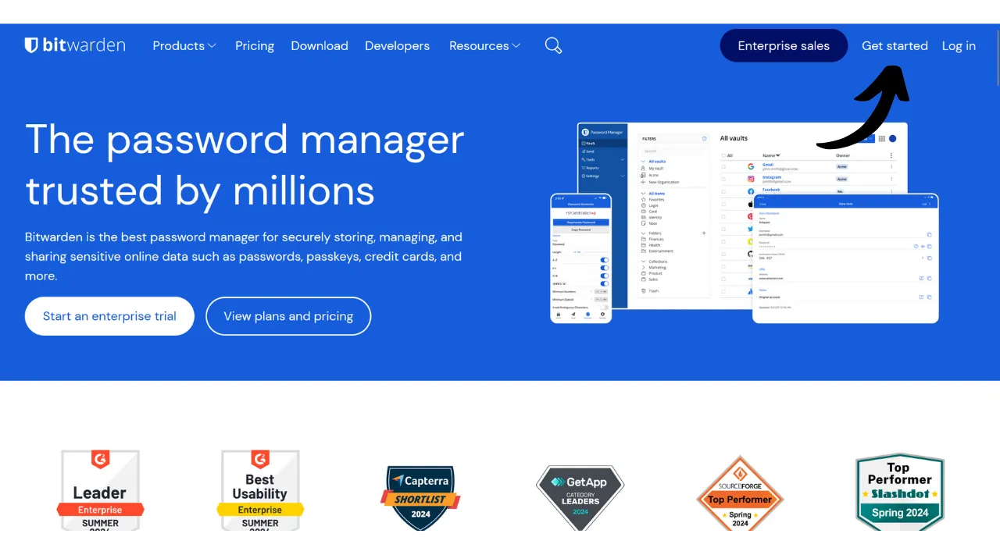

शुरू करने के लिए अपना ईमेल Address और अपना नाम या उपनाम दर्ज करें।

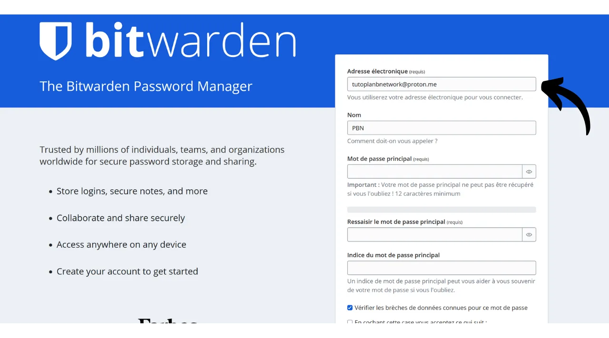

अब आपको अपना मास्टर पासवर्ड सेट करना होगा। जैसा कि हमने परिचय में देखा, यह पासवर्ड बहुत महत्वपूर्ण है क्योंकि यह आपको मैनेजर में आपके सभी अन्य सेव किए गए पासवर्ड्स तक पहुंच देता है। इसके साथ दो मुख्य जोखिम होते हैं: खोना और समझौता होना। अगर आप इस पासवर्ड की पहुंच खो देते हैं, तो आप अपने सभी क्रेडेंशियल्स तक पहुंच नहीं पाएंगे। अगर आपका पासवर्ड चोरी हो जाता है, तो हमलावर आपके सभी खातों तक पहुंच सकता है।

हानि के जोखिम को कम करने के लिए, मैं सुझाव देता हूँ कि आप अपने मास्टर पासवर्ड का एक भौतिक बैकअप कागज पर बना लें और उसे किसी सुरक्षित स्थान पर रखें। यदि संभव हो, तो इस बैकअप को एक सुरक्षित लिफाफे में Seal करें ताकि यह सुनिश्चित किया जा सके कि इसे किसी और ने एक्सेस नहीं किया है।

आपके मास्टर पासवर्ड की सुरक्षा सुनिश्चित करने के लिए, उसे बेहद मजबूत होना चाहिए। यह जितना लंबा हो सके, उतना लंबा होना चाहिए, और इसमें विभिन्न प्रकार के अक्षर शामिल होने चाहिए, और इसे यादृच्छिक रूप से चुना जाना चाहिए। 2024 में, एक सुरक्षित पासवर्ड के लिए न्यूनतम सिफारिशें 13 अक्षर हैं, जिसमें संख्याएँ, छोटे और बड़े अक्षर, और प्रतीक शामिल हैं, बशर्ते कि पासवर्ड वास्तव में यादृच्छिक हो। हालांकि, मैं सुझाव देता हूँ कि आप कम से कम 20 अक्षरों का पासवर्ड चुनें, जिसमें सभी प्रकार के अक्षर शामिल हों, ताकि इसकी सुरक्षा लंबे समय तक बनी रहे।

अपना मास्टर पासवर्ड दिए गए बॉक्स में डालें और अगले बॉक्स में उसे पुष्टि करें।

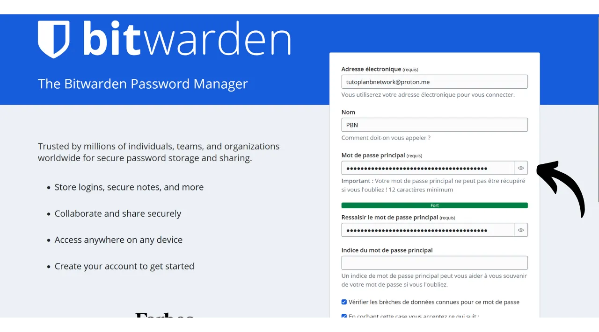

यदि आप चाहें, तो आप अपने मास्टर पासवर्ड के लिए एक संकेत जोड़ सकते हैं। हालांकि, मैं ऐसा करने की सलाह नहीं देता, क्योंकि संकेत आपके पासवर्ड खोने की स्थिति में एक विश्वसनीय पुनर्प्राप्ति विधि प्रदान नहीं करता है और यह उन हमलावरों के लिए भी उपयोगी हो सकता है जो आपके पासवर्ड का अनुमान लगाने या जबरदस्ती करने की कोशिश कर रहे हैं। सामान्य नियम के रूप में, ऐसे सार्वजनिक संकेत बनाने से बचें जो आपके मास्टर पासवर्ड की सुरक्षा को खतरे में डाल सकते हैं।

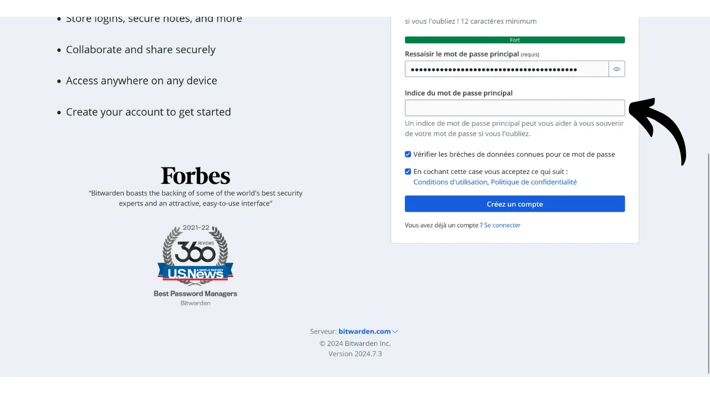

फिर "*खाता बनाएं*" बटन पर क्लिक करें।

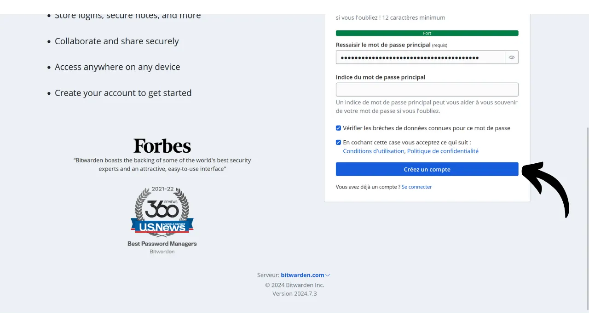

अब आप अपने नए Bitwarden खाते में लॉग इन कर सकते हैं। अपना ईमेल Address दर्ज करें।

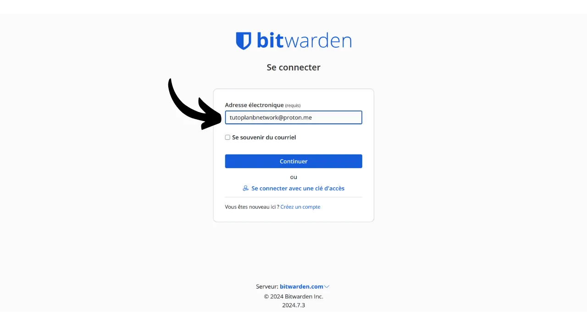

फिर अपना मास्टर पासवर्ड टाइप करें।

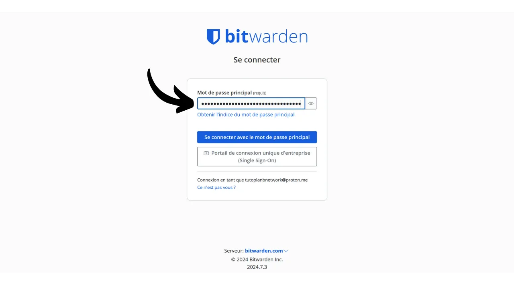

आप अब अपने पासवर्ड मैनेजर के वेब Interface पर हैं।

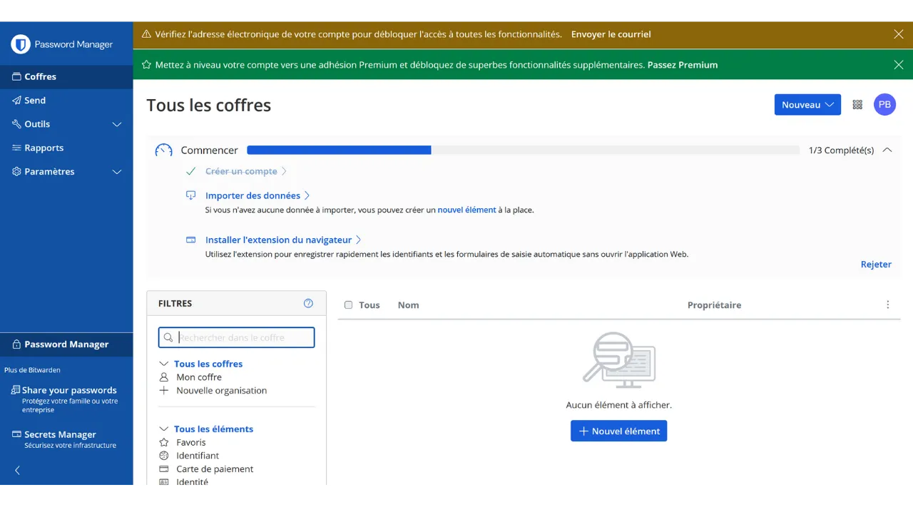

## Bitwarden सेट अप करने के लिए, नीचे दिए गए सरल चरणों का पालन करें:

1. **Bitwarden डाउनलोड करें**: सबसे पहले, अपने डिवाइस के लिए Bitwarden ऐप डाउनलोड करें। यह ऐप Windows, Mac, Linux, Android, और iOS के लिए उपलब्ध है। आप इसे अपने ब्राउज़र के एक्सटेंशन के रूप में भी इंस्टॉल कर सकते हैं।

2. **खाता बनाएं**: ऐप इंस्टॉल करने के बाद, Bitwarden खोलें और "Create Account" या "खाता बनाएं" पर क्लिक करें। अपनी ईमेल आईडी और एक मजबूत मास्टर पासवर्ड डालें। यह मास्टर पासवर्ड बहुत महत्वपूर्ण है, क्योंकि इसके बिना आप अपने खाते तक नहीं पहुंच पाएंगे।

3. **ईमेल सत्यापन**: खाता बनाने के बाद, Bitwarden आपके ईमेल पर एक सत्यापन लिंक भेजेगा। अपने ईमेल में जाकर उस लिंक पर क्लिक करें ताकि आपका खाता सक्रिय हो सके।

4. **लॉग इन करें**: अब आप अपने Bitwarden खाते में लॉग इन कर सकते हैं। अपने मास्टर पासवर्ड का उपयोग करके लॉग इन करें।

5. **पासवर्ड स्टोर करें**: लॉग इन करने के बाद, आप अपने विभिन्न ऑनलाइन खातों के पासवर्ड Bitwarden में स्टोर कर सकते हैं। "Add Item" या "आइटम जोड़ें" पर क्लिक करें और अपने लॉगिन विवरण दर्ज करें।

6. **ब्राउज़र एक्सटेंशन सेट करें**: अगर आपने ब्राउज़र एक्सटेंशन इंस्टॉल किया है, तो इसे अपने ब्राउज़र में पिन करें ताकि आप आसानी से अपने पासवर्ड तक पहुंच सकें।

7. **सिंक और बैकअप**: Bitwarden आपके सभी डिवाइस पर डेटा सिंक करता है, इसलिए सुनिश्चित करें कि आपने इसे सक्षम किया है। यह आपके पासवर्ड का बैकअप रखने में मदद करेगा।

बस, अब आप Bitwarden का उपयोग करके अपने पासवर्ड को सुरक्षित और संगठित रख सकते हैं!

शुरू करने के लिए, हम अपने ईमेल Address की पुष्टि करेंगे। "*ईमेल भेजें*" पर क्लिक करें।

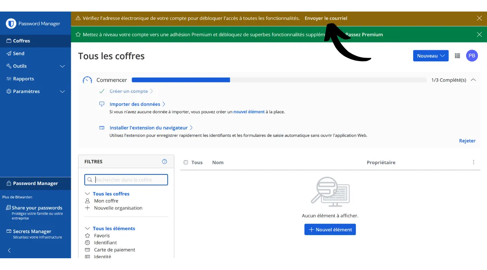

फिर ईमेल में प्राप्त बटन पर क्लिक करें।

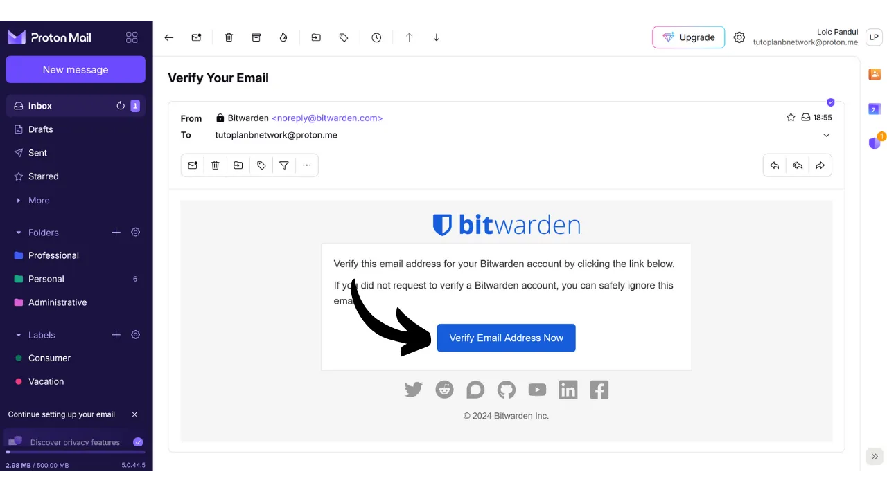

आखिरकार, फिर से लॉग इन करें।

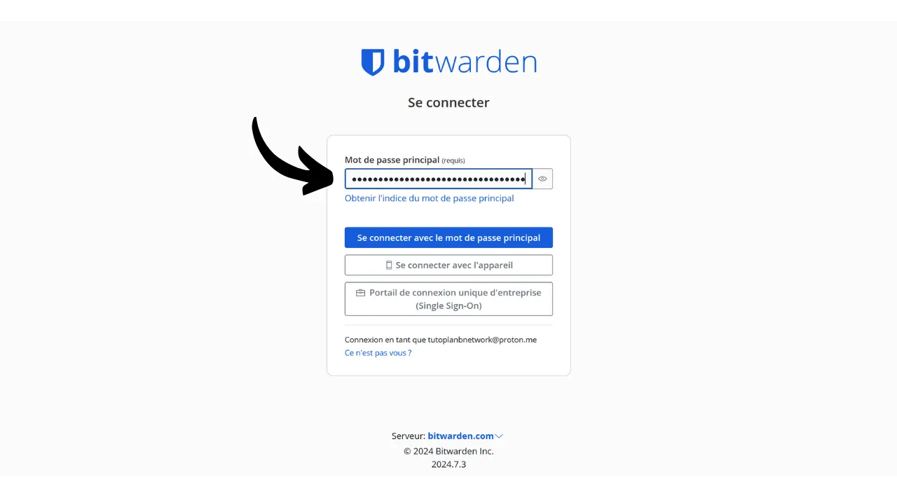

सबसे पहले और सबसे महत्वपूर्ण, मैं आपको सलाह देता हूँ कि आप अपने पासवर्ड मैनेजर की सुरक्षा के लिए टू-फैक्टर ऑथेंटिकेशन (2FA) सेट करें। आपके पास TOTP एप्लिकेशन या एक फिजिकल सिक्योरिटी की का उपयोग करने का विकल्प है। 2FA को सक्रिय करने पर, जब भी आप अपने Bitwarden खाते में लॉग इन करेंगे, तो आपसे न केवल आपका मास्टर पासवर्ड पूछा जाएगा, बल्कि आपके दूसरे ऑथेंटिकेशन फैक्टर का प्रमाण भी मांगा जाएगा। यह सुरक्षा की एक अतिरिक्त परत है, जो विशेष रूप से तब उपयोगी होती है जब आपके मास्टर पासवर्ड का पेपर बैकअप समझौता हो जाता है।

अगर आप इन 2FA डिवाइसों को सेट अप और उपयोग करने के तरीके को लेकर अनिश्चित हैं, तो मैं आपको इन दो अन्य ट्यूटोरियल्स को फॉलो करने की सलाह देता हूँ:

https://planb.network/tutorials/computer-security/authentication/authy-a76ab26b-71b0-473c-aa7c-c49153705eb7
https://planb.network/tutorials/computer-security/authentication/security-key-61438267-74db-4f1a-87e4-97c8e673533e
इसके लिए, "*सेटिंग्स*" मेन्यू में "*सुरक्षा*" टैब पर जाएं।

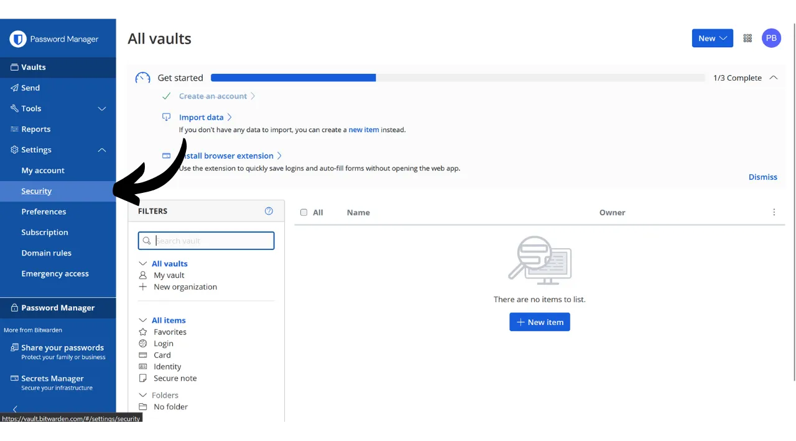

फिर "*टू-स्टेप लॉगिन*" टैब पर क्लिक करें।

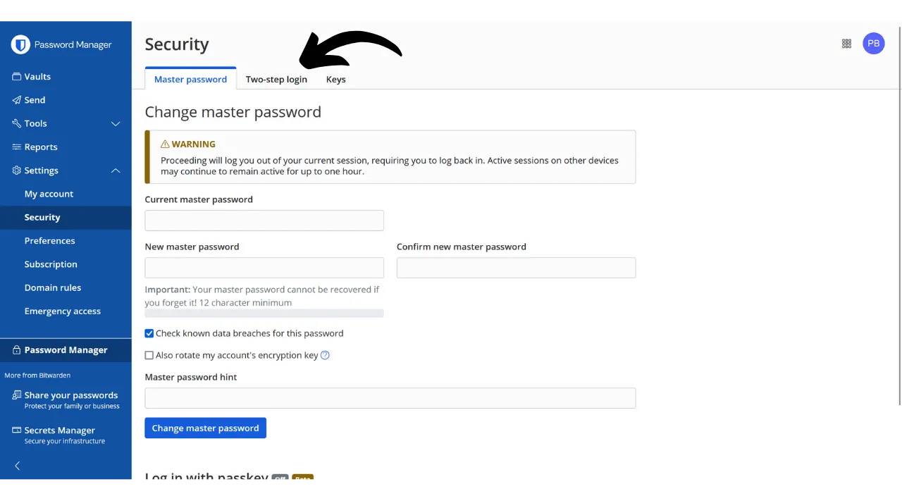

यहाँ, आप अपनी पसंद का 2FA तरीका चुन सकते हैं। उदाहरण के लिए, मैं "*Manage*" बटन पर क्लिक करके TOTP एप्लिकेशन के साथ 2FA चुनूँगा।

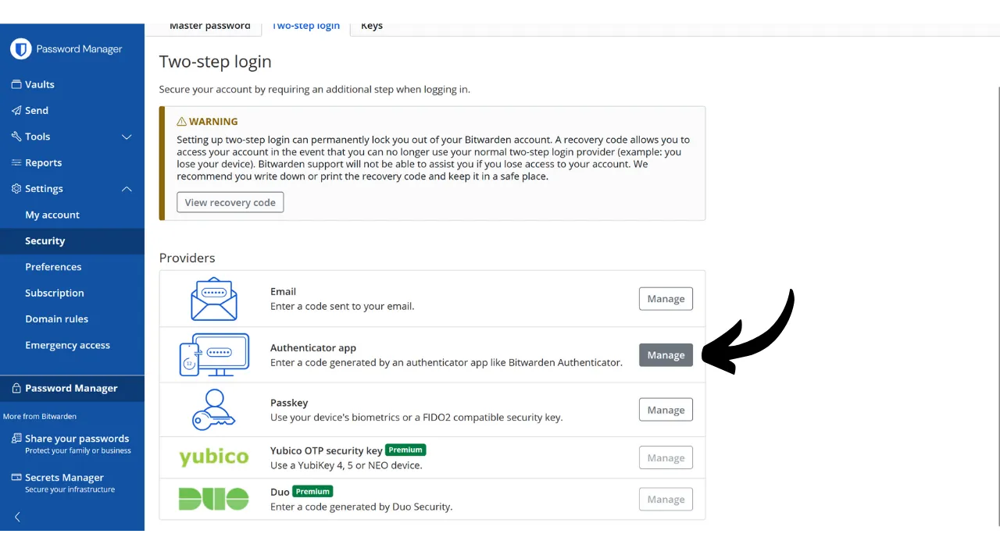

अपना मास्टर पासवर्ड पुष्टि करें।

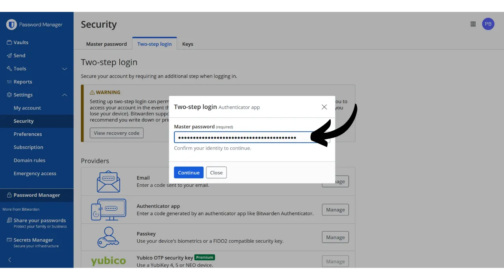

फिर अपने 2FA एप्लिकेशन से QR कोड स्कैन करें।

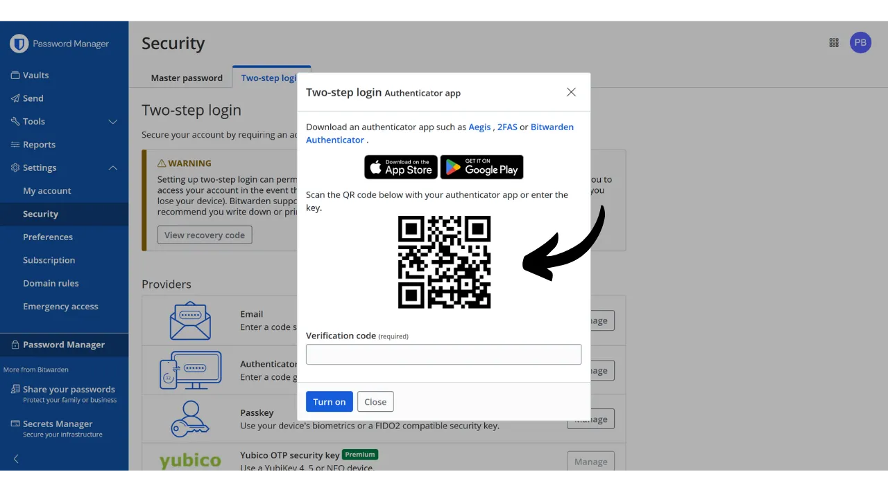

अपने 2FA एप्लिकेशन पर नोट किया गया 6-अंकों का कोड दर्ज करें, फिर "*चालू करें*" बटन पर क्लिक करें।

आपके खाते पर दो-स्तरीय प्रमाणीकरण सफलतापूर्वक सेट कर दिया गया है।

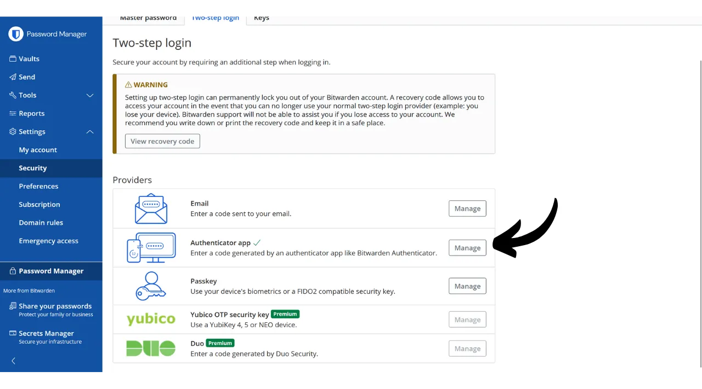

अब, अगर आप अपने मैनेजर में फिर से लॉग इन करने की कोशिश करते हैं, तो सबसे पहले आपको अपना मास्टर पासवर्ड दर्ज करना होगा, फिर आपके 2FA एप्लिकेशन द्वारा उत्पन्न 6-अंकीय डायनामिक कोड दर्ज करना होगा। सुनिश्चित करें कि आपके पास हमेशा इस डायनामिक कोड की पहुंच हो; इसके बिना, आप अपने पासवर्ड को पुनः प्राप्त नहीं कर पाएंगे।

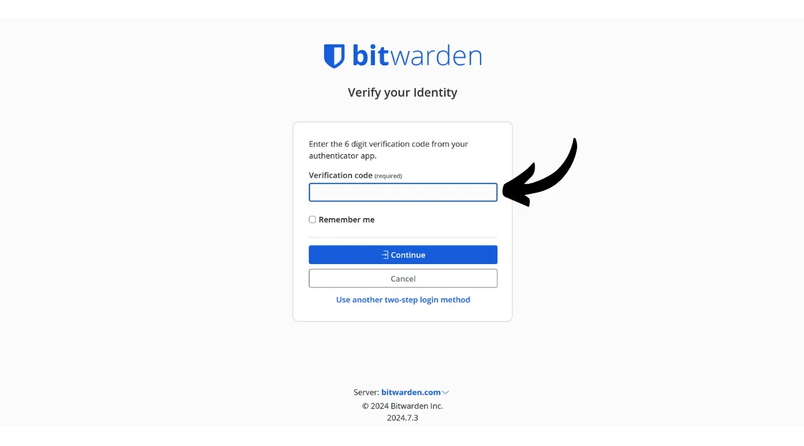

सेटिंग्स में, आपके पास "*प्रेफरेंसेस*" टैब में अपने मैनेजर को कस्टमाइज़ करने का विकल्प भी होता है। यहाँ, आप अपने मैनेजर के ऑटोमैटिक लॉक होने से पहले की अवधि को बदल सकते हैं, साथ ही Interface की भाषा और थीम को भी बदल सकते हैं।

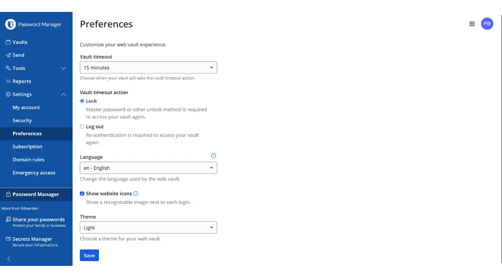

मैं आपको सलाह देता हूँ कि Bitwarden द्वारा उत्पन्न पासवर्ड की लंबाई को समायोजित करें। डिफ़ॉल्ट रूप से, इसकी लंबाई 14 अक्षरों की होती है, जो कि सर्वोत्तम सुरक्षा के लिए पर्याप्त नहीं हो सकती। अब जब आपके पास एक मैनेजर है जो आपके सभी पासवर्ड याद रख सकता है, तो आप इसका फायदा उठाकर बहुत मजबूत पासवर्ड का उपयोग कर सकते हैं।

इसके लिए, "*जनरेटर*" मेन्यू पर जाएं।

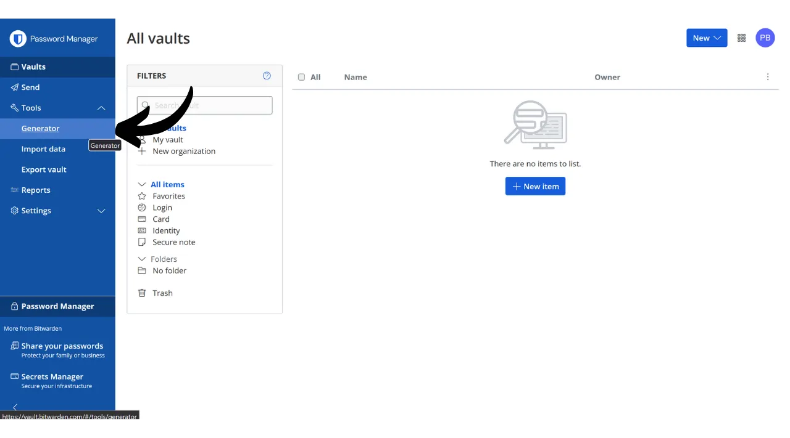

यहाँ, आप अपने पासवर्ड की लंबाई 40 तक बढ़ा सकते हैं, और प्रतीकों को शामिल करने के लिए बॉक्स पर टिक कर सकते हैं।

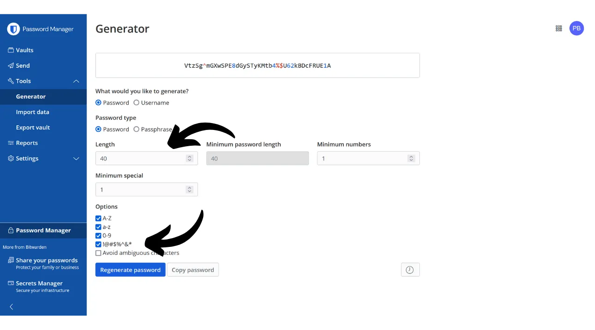

## अपने खातों को Bitwarden के साथ सुरक्षित कैसे करें?

Bitwarden का उपयोग करके अपने खातों को सुरक्षित करना एक सरल और प्रभावी तरीका है। यहाँ कुछ कदम दिए गए हैं जिनसे आप अपने खातों की सुरक्षा सुनिश्चित कर सकते हैं:

1. **Bitwarden अकाउंट बनाएं**: सबसे पहले, Bitwarden की वेबसाइट पर जाएं और एक नया अकाउंट बनाएं। यह आपको एक सुरक्षित पासवर्ड मैनेजर का उपयोग करने की अनुमति देगा।

2. **मास्टर पासवर्ड सेट करें**: एक मजबूत और अनोखा मास्टर पासवर्ड चुनें। यह पासवर्ड आपके सभी अन्य पासवर्ड्स की सुरक्षा की चाबी है, इसलिए इसे याद रखना और सुरक्षित रखना बहुत महत्वपूर्ण है।

3. **दो-चरणीय प्रमाणीकरण (2FA) सक्षम करें**: Bitwarden में 2FA सेट करें। यह एक अतिरिक्त सुरक्षा परत जोड़ता है, जिससे आपके अकाउंट तक अनधिकृत पहुंच को रोका जा सकता है।

4. **पासवर्ड्स को स्टोर करें**: अपने सभी ऑनलाइन खातों के पासवर्ड्स को Bitwarden में स्टोर करें। यह आपको हर बार लॉगिन करते समय पासवर्ड याद रखने की परेशानी से बचाएगा।

5. **पासवर्ड जनरेट करें**: Bitwarden का पासवर्ड जनरेटर उपयोग करें ताकि आप हर खाते के लिए मजबूत और अनोखे पासवर्ड बना सकें।

6. **सुरक्षित नोट्स और जानकारी स्टोर करें**: Bitwarden में न केवल पासवर्ड्स, बल्कि अन्य संवेदनशील जानकारी जैसे कि क्रेडिट कार्ड डिटेल्स और सुरक्षित नोट्स भी स्टोर कर सकते हैं।

7. **नियमित रूप से अपडेट करें**: सुनिश्चित करें कि आप अपने पासवर्ड्स को नियमित रूप से अपडेट करते रहें और Bitwarden के किसी भी नए फीचर या अपडेट का लाभ उठाएं।

इन सरल कदमों का पालन करके, आप अपने ऑनलाइन खातों की सुरक्षा को काफी हद तक बढ़ा सकते हैं।

अब जब आपका पासवर्ड मैनेजर सेट हो गया है, तो आप अपने ऑनलाइन खातों के लिए क्रेडेंशियल्स स्टोर करना शुरू कर सकते हैं। एक नया आइटम जोड़ने के लिए, सीधे "*New item*" बटन पर क्लिक करें या स्क्रीन के ऊपर दाईं ओर स्थित "*New*" बटन पर क्लिक करें, फिर "*item*" पर क्लिक करें।

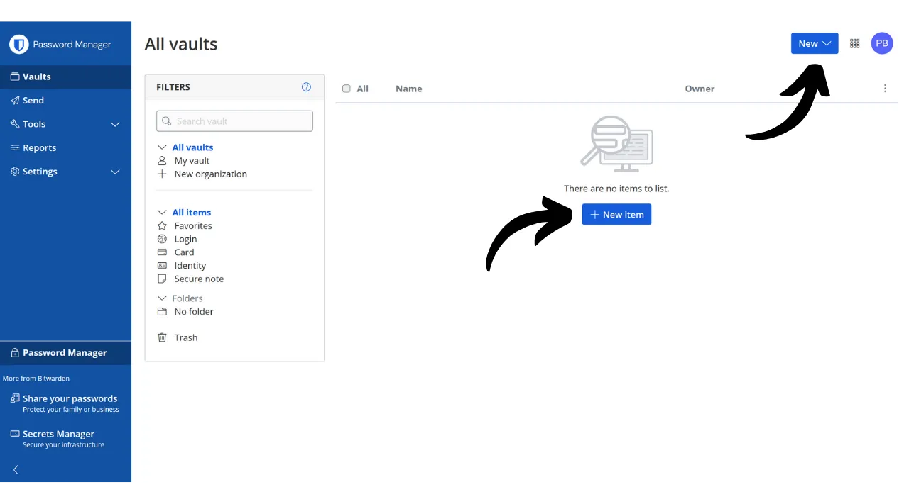

जो फॉर्म खुलता है, उसमें सबसे पहले यह तय करें कि किस प्रकार की वस्तु को सहेजना है। अगर आपको लॉगिन क्रेडेंशियल्स स्टोर करने हैं, तो ड्रॉपडाउन मेन्यू से "*लॉगिन*" विकल्प चुनें।

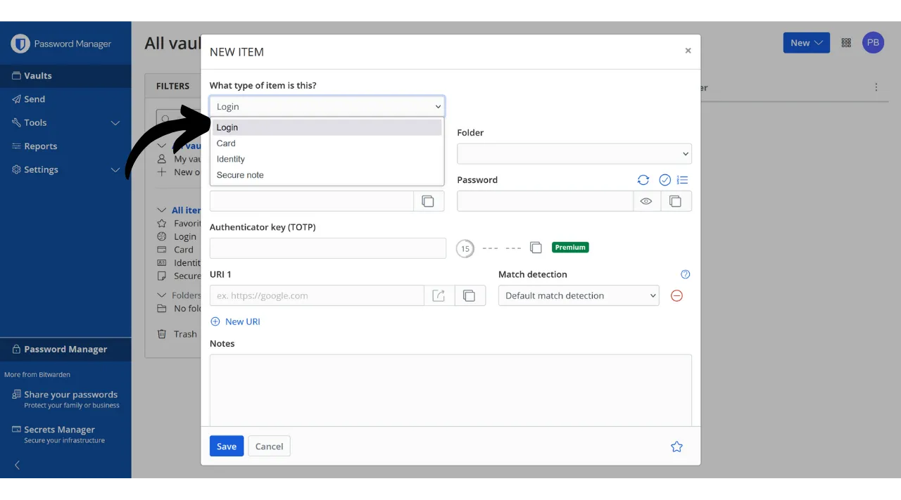

"*नाम*" फ़ील्ड में, अपने क्रेडेंशियल्स के लिए एक वर्णनात्मक नाम दर्ज करें। इससे आपके पासवर्ड्स को खोजना और व्यवस्थित करना आसान हो जाएगा, खासकर अगर आपके पास बहुत सारे हों। उदाहरण के लिए, अगर आप PlanB नेटवर्क साइट के लिए अपने क्रेडेंशियल्स को सहेजना चाहते हैं, तो आप इस आइटम का ऐसा नाम रख सकते हैं जो भविष्य में आपकी खोजों के दौरान तुरंत पहचाना जा सके।

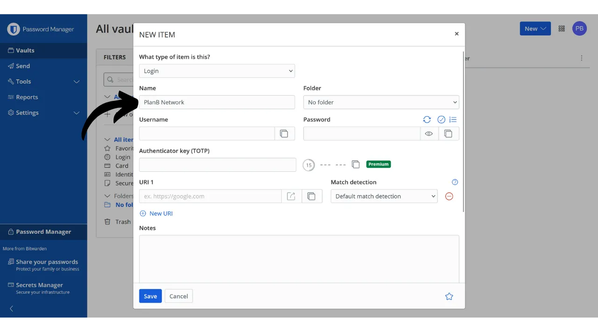

"*फोल्डर*" विकल्प आपको अपनी प्रमाण-पत्रों को फोल्डरों में वर्गीकृत करने की सुविधा देता है। अभी तक हमने कोई फोल्डर नहीं बनाया है, लेकिन मैं आपको बाद में यह कैसे करना है, दिखाऊंगा।

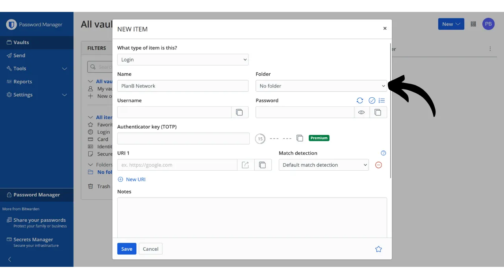

"*Username*" वाले स्थान पर अपना यूज़रनेम डालें, जो आमतौर पर आपका ईमेल Address होता है। 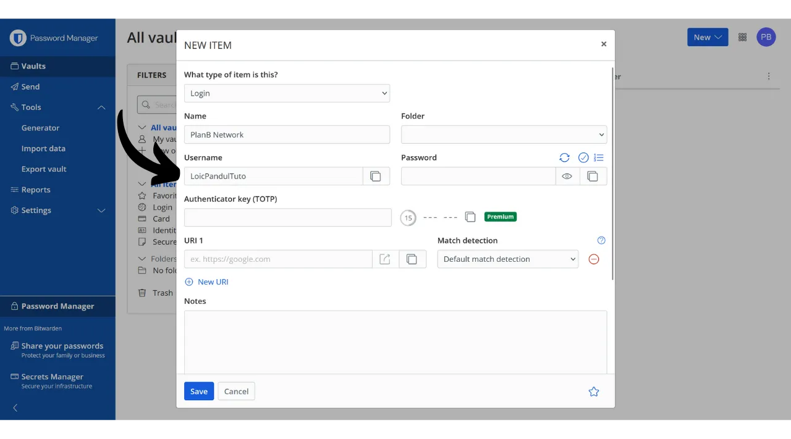

अगले चरण में, "*पासवर्ड*" वाले स्थान पर आप अपना पासवर्ड डाल सकते हैं। हालांकि, मैं आपको सलाह दूंगा कि Bitwarden generate आपके लिए एक लंबा, रैंडम और यूनिक पासवर्ड बनाए। इससे यह सुनिश्चित होता है कि आपका पासवर्ड मजबूत है। इस सुविधा का उपयोग करने के लिए, उस स्थान के ऊपर दिए गए डबल एरो आइकन पर क्लिक करें जिसे भरा जाना है।

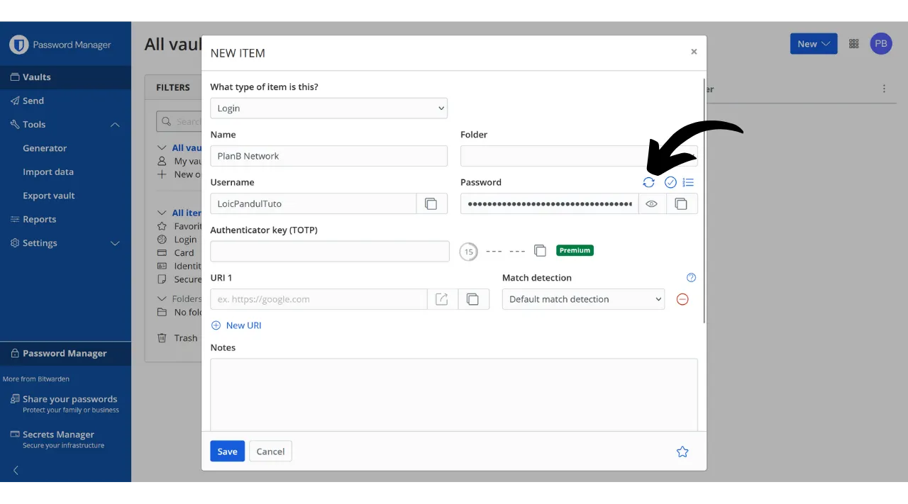

आप देख सकते हैं कि आपका पासवर्ड बना दिया गया है।

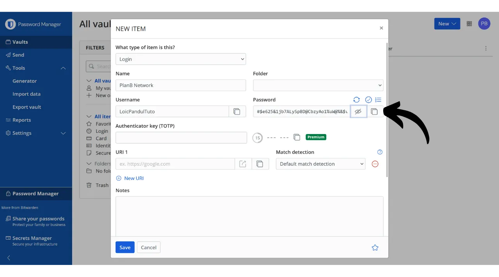

"*URI 1*" फील्ड में, आप वेबसाइट का डोमेन नाम दर्ज कर सकते हैं।

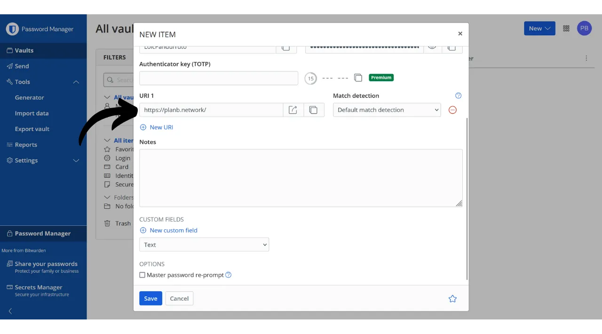

और अंत में, "*नोट्स*" वाले खंड में, अगर ज़रूरी हो तो आप अतिरिक्त जानकारी जोड़ सकते हैं।

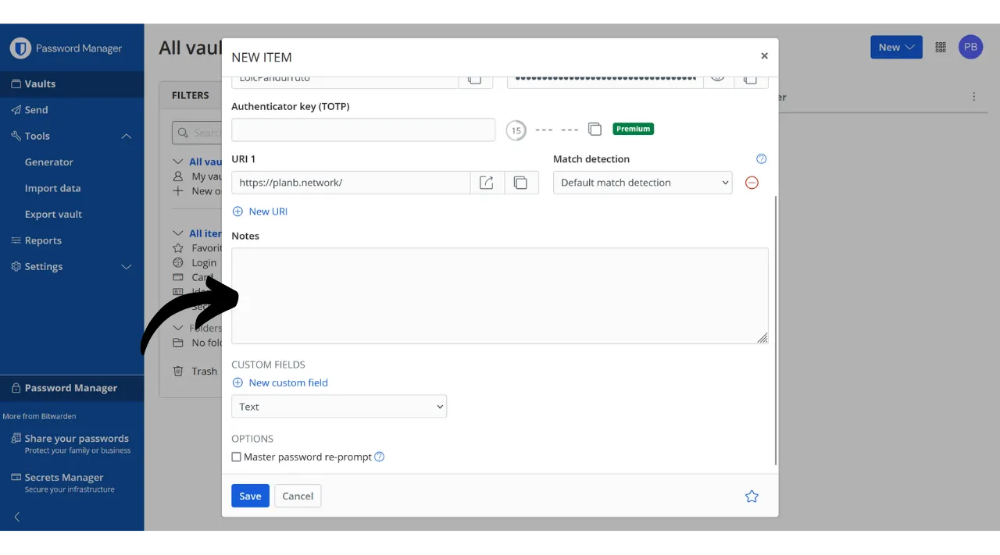

जब आप इन सभी फ़ील्ड्स को भर लें, तो "*सेव*" बटन पर क्लिक करें।

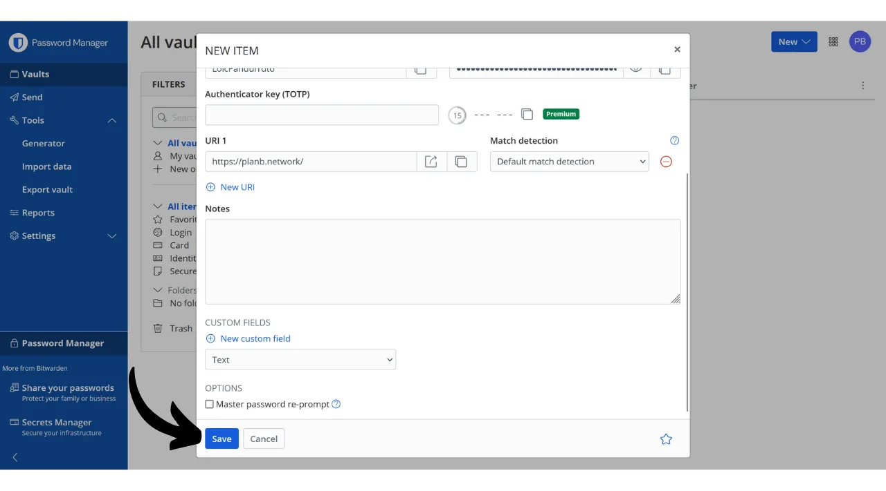

आपकी पहचान अब आपके Bitwarden मैनेजर में दिखाई देती है।

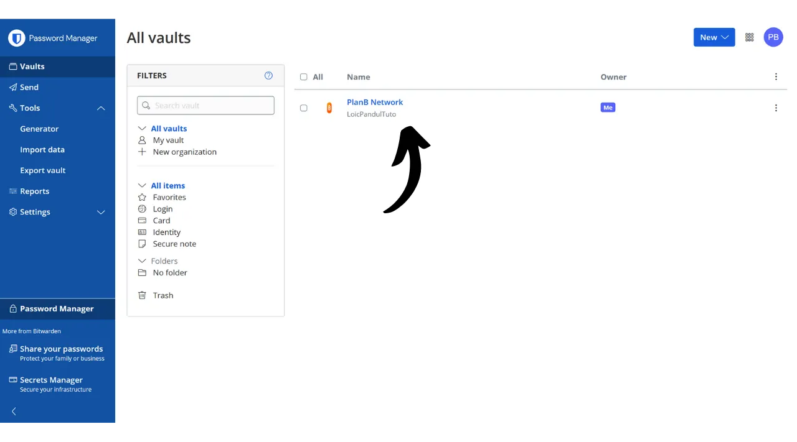

इस पर क्लिक करके, आप इसकी जानकारी देख सकते हैं और उसमें बदलाव कर सकते हैं।

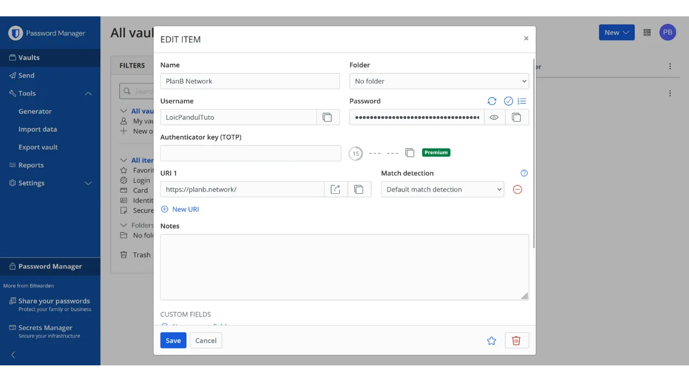

दाईं ओर तीन छोटे बिंदुओं पर क्लिक करके, आप जल्दी से पासवर्ड या पहचानकर्ता कॉपी कर सकते हैं।

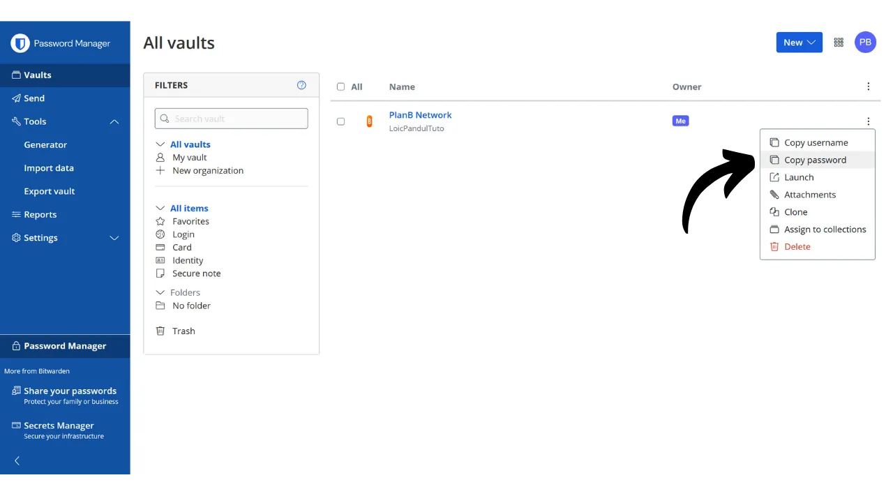

बधाई हो, आपने सफलतापूर्वक अपना पहला पासवर्ड अपने मैनेजर में सेव कर लिया है! अगर आप अपने पहचानकर्ताओं को बेहतर तरीके से व्यवस्थित करना चाहते हैं, तो आप विशेष फोल्डर बना सकते हैं। ऐसा करने के लिए, स्क्रीन के ऊपर दाईं ओर स्थित "*नया*" बटन पर क्लिक करें, फिर "*फोल्डर*" चुनें।

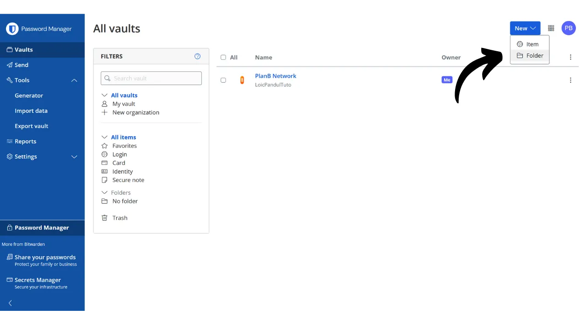

अपने फोल्डर के लिए एक नाम दर्ज करें।

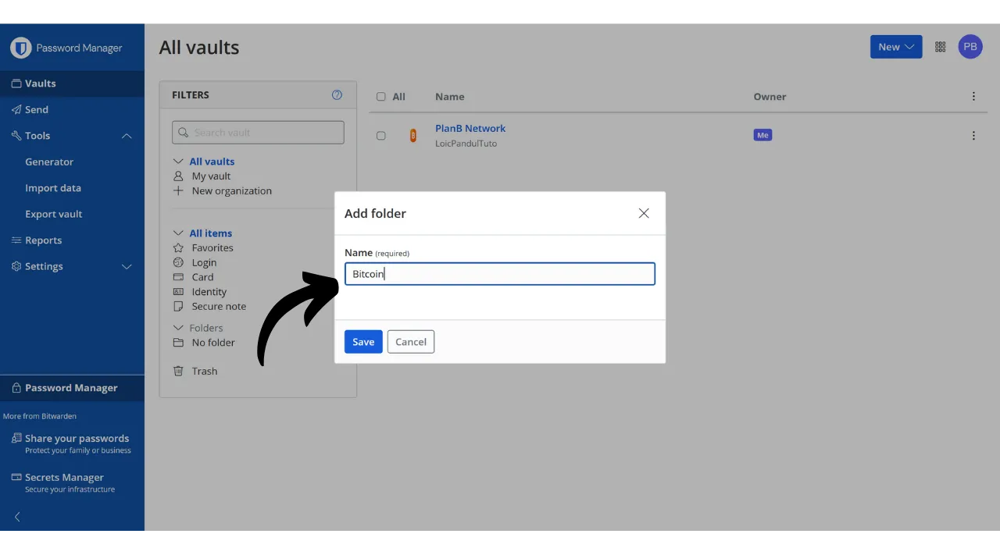

फिर "*सेव*" पर क्लिक करें।

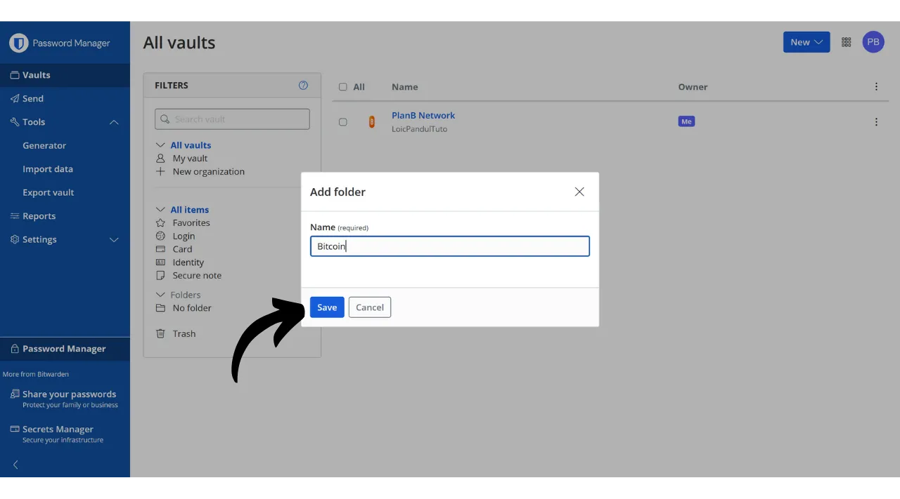

आपका फोल्डर अब आपके मैनेजर में दिखाई दे रहा है।

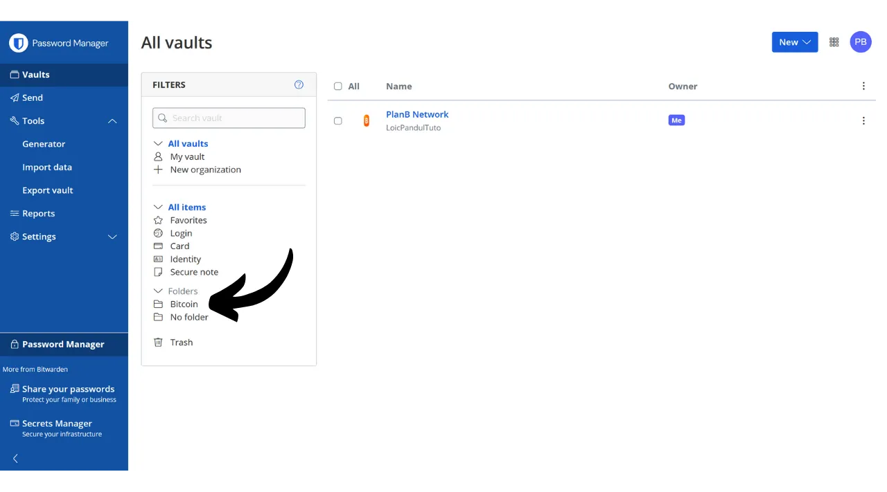

जब आप एक फोल्डर बना रहे होते हैं, तो आप उसे एक पहचानकर्ता (identifier) से जोड़ सकते हैं, जैसा कि हमने पहले किया था, या फिर किसी मौजूदा पहचानकर्ता को बदलकर भी ऐसा कर सकते हैं। उदाहरण के लिए, अगर मैं अपने PlanB Network के पहचानकर्ता पर क्लिक करता हूँ, तो मैं उसे "*Bitcoin*" फोल्डर में वर्गीकृत करने का विकल्प चुन सकता हूँ।

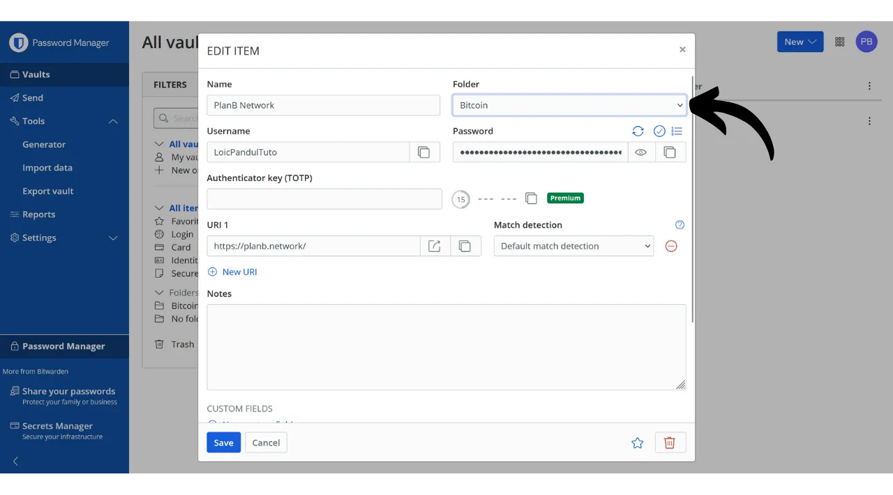

इस तरह, आप अपने पासवर्ड मैनेजर को इस तरह से व्यवस्थित कर सकते हैं कि आपके पहचानकर्ता ढूंढना आसान हो जाए। आप इन्हें फोल्डर्स में बाँट सकते हैं जैसे व्यक्तिगत, पेशेवर, बैंक, ईमेल, सोशल नेटवर्क, सब्सक्रिप्शन, शॉपिंग, प्रशासन, स्ट्रीमिंग, स्टोरेज, यात्रा, स्वास्थ्य आदि।

अगर आप सिर्फ वेब वर्जन में ही Bitwarden का इस्तेमाल करना पसंद करते हैं, तो ऐसा करना पूरी तरह से संभव है। मैं सुझाव दूंगा कि आप अपने ब्राउज़र के फेवरेट्स में अपने पासवर्ड मैनेजर को जोड़ लें ताकि इसे आसानी से एक्सेस किया जा सके और फिशिंग के जोखिम से बचा जा सके। हालांकि, Bitwarden कई तरह के क्लाइंट्स भी ऑफर करता है जिससे आप अपने मैनेजर को विभिन्न डिवाइसों पर इस्तेमाल कर सकते हैं और इसे रोजमर्रा के उपयोग के लिए सरल बना सकते हैं। वे खासतौर पर एक मोबाइल ऐप, एक ब्राउज़र एक्सटेंशन, और डेस्कटॉप सॉफ्टवेयर भी प्रदान करते हैं। चलिए देखते हैं कि इन्हें एक साथ कैसे सेटअप किया जाए।

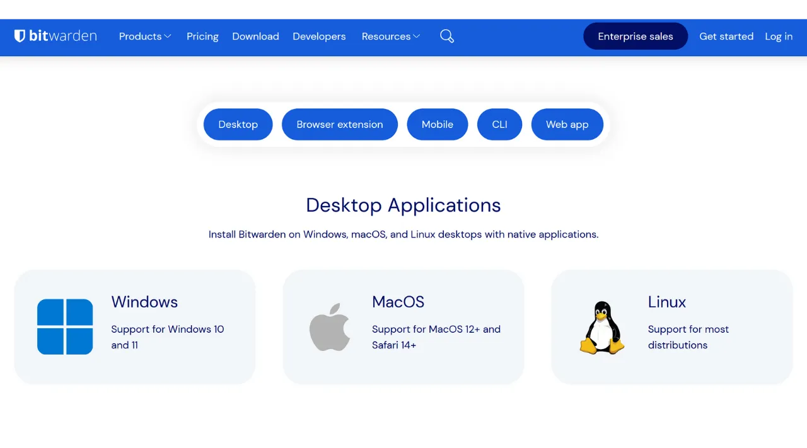

## Bitwarden ब्राउज़र एक्सटेंशन का उपयोग कैसे करें?

1. **इंस्टॉल करें**: सबसे पहले, अपने ब्राउज़र के एक्सटेंशन स्टोर में जाकर Bitwarden एक्सटेंशन को खोजें और इंस्टॉल करें।

2. **लॉग इन करें**: एक्सटेंशन इंस्टॉल होने के बाद, उस पर क्लिक करें और अपने Bitwarden अकाउंट में लॉग इन करें। अगर आपका अकाउंट नहीं है, तो पहले एक नया अकाउंट बनाएं।

3. **पासवर्ड सेव करें**: जब आप किसी वेबसाइट पर लॉग इन करते हैं, तो Bitwarden आपको पासवर्ड सेव करने का विकल्प देगा। इसे सेव करने के लिए 'Save' पर क्लिक करें।

4. **ऑटोफिल का उपयोग करें**: जब आप किसी वेबसाइट पर वापस जाते हैं, तो Bitwarden आपके लिए यूज़रनेम और पासवर्ड ऑटोफिल कर सकता है। इसके लिए एक्सटेंशन आइकन पर क्लिक करें और 'Autofill' चुनें।

5. **पासवर्ड जनरेट करें**: अगर आपको एक नया पासवर्ड चाहिए, तो एक्सटेंशन में 'Password Generator' का उपयोग करें। यह आपको एक मजबूत पासवर्ड बनाने में मदद करेगा।

6. **सेटिंग्स और सिक्योरिटी**: एक्सटेंशन की सेटिंग्स में जाकर आप अपनी सिक्योरिटी प्रेफरेंसेस को एडजस्ट कर सकते हैं, जैसे कि ऑटो-लॉगआउट टाइम सेट करना।

बस, अब आप Bitwarden ब्राउज़र एक्सटेंशन का आसानी से उपयोग कर सकते हैं!

सबसे पहले, अगर आप चाहें तो ब्राउज़र एक्सटेंशन सेट कर सकते हैं। यह एक्सटेंशन आपके मैनेजर का एक छोटा संस्करण है और आपको नए पासवर्ड को ऑटोमैटिकली सेव करने, सुरक्षित पासवर्ड के लिए generate सुझाव देने, और वेबसाइट लॉगिन पेजों पर आपके क्रेडेंशियल्स को ऑटोमैटिकली भरने की सुविधा देता है।

इस एक्सटेंशन का रोज़ाना उपयोग बेहद सुविधाजनक है, लेकिन यह नए हमलों के रास्ते भी खोल सकता है। इसलिए कुछ साइबर सुरक्षा विशेषज्ञ पासवर्ड मैनेजर के लिए ब्राउज़र एक्सटेंशन का उपयोग करने से मना करते हैं। हालांकि, अगर आप Bitwarden एक्सटेंशन का उपयोग करना चाहते हैं, तो यहां बताया गया है कि कैसे आगे बढ़ें:

शुरुआत करने के लिए [आधिकारिक बिटवॉर्डन डाउनलोड पेज](https://bitwarden.com/download/#downloads-web-browser) पर जाएं।

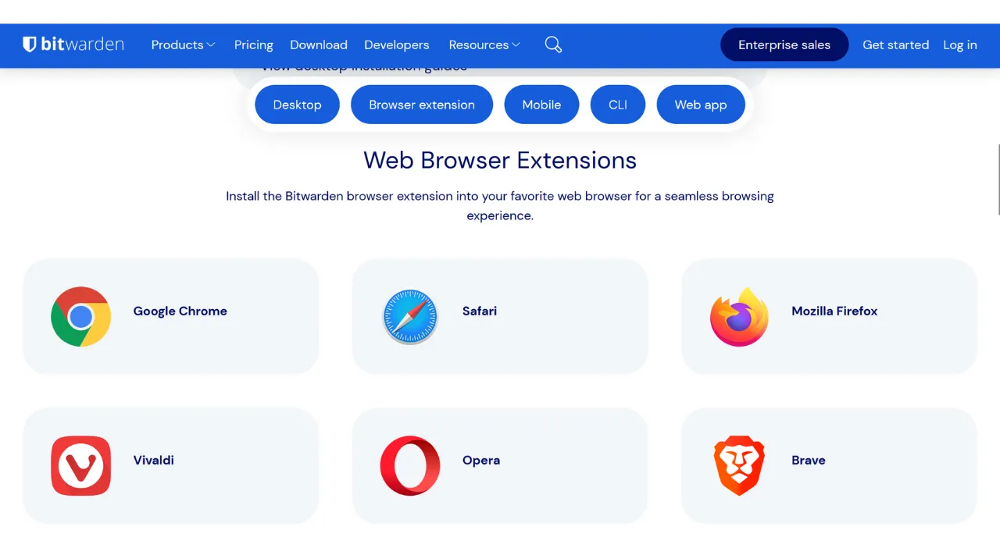

सूची में से अपना ब्राउज़र चुनें। इस उदाहरण में, मैं Firefox का उपयोग कर रहा हूँ, इसलिए मुझे Firefox ऐड-ऑन स्टोर पर आधिकारिक Bitwarden एक्सटेंशन पर भेजा जाता है। अन्य ब्राउज़रों के लिए प्रक्रिया लगभग समान है।

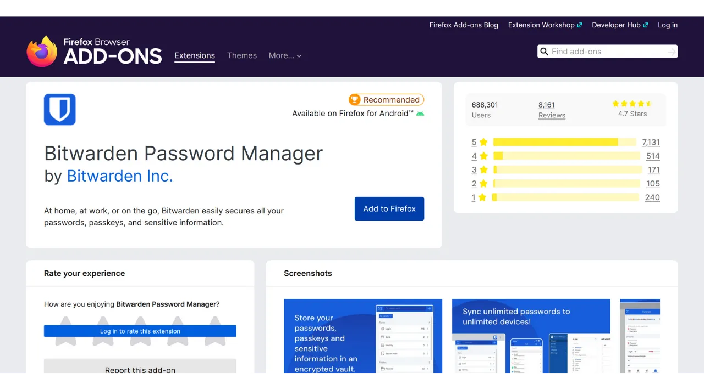

"*Add to Firefox*" बटन पर क्लिक करें।

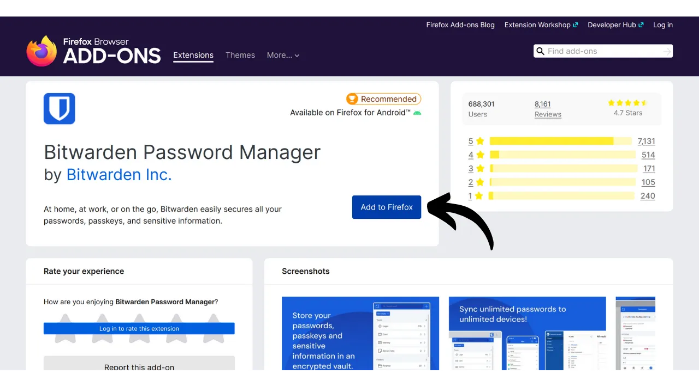

आप Bitwarden को अपने एक्सटेंशन बार में जोड़ सकते हैं ताकि उसे आसानी से एक्सेस किया जा सके। लॉग इन करने के लिए एक्सटेंशन पर क्लिक करें।

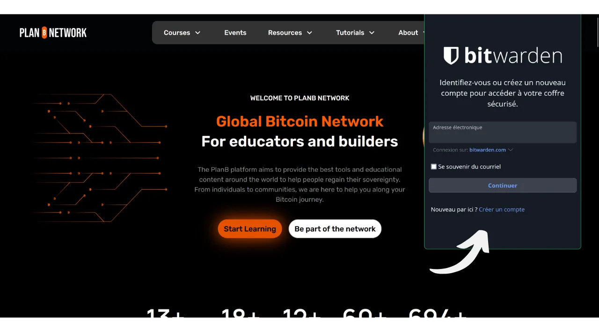

कृपया अपना ईमेल दर्ज करें Address।

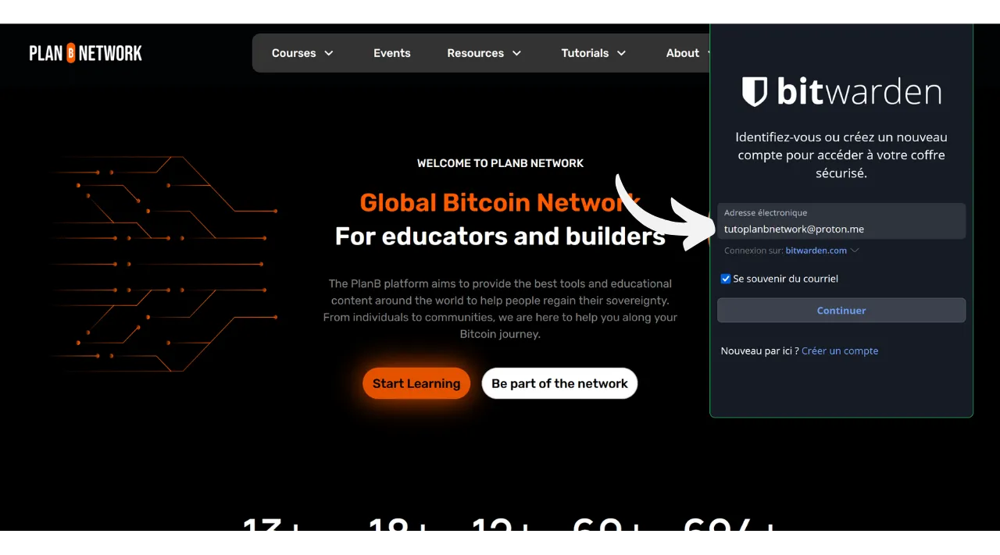

फिर आपका मास्टर पासवर्ड।

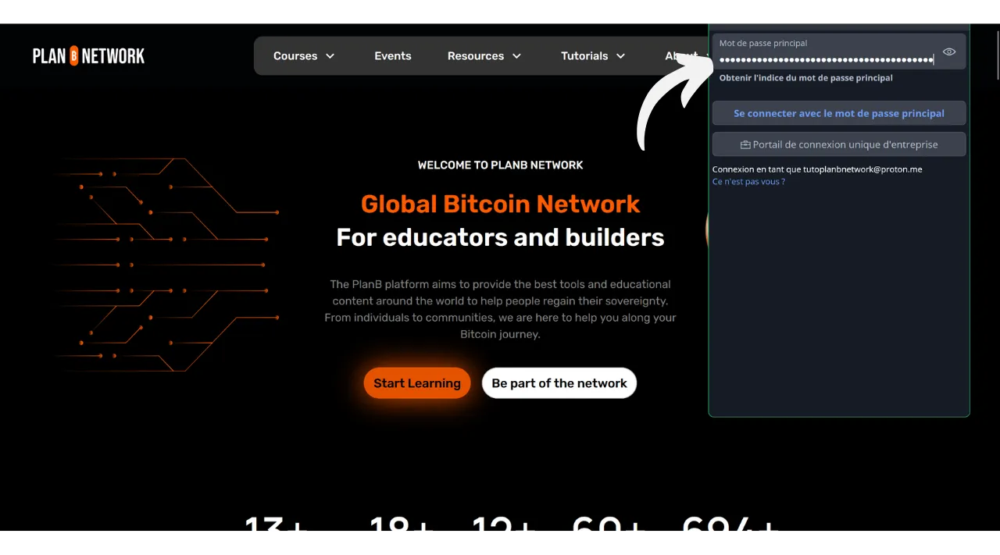

और अंत में, अपने प्रमाणीकरण ऐप से 6 अंकों का कोड दर्ज करें।

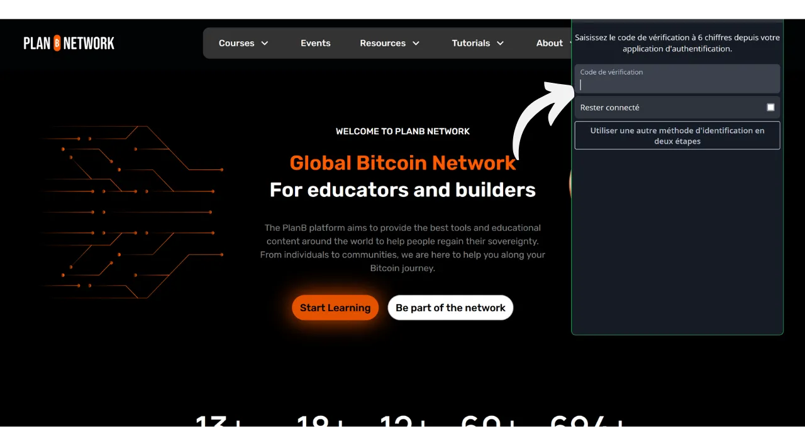

अब आप अपने ब्राउज़र एक्सटेंशन के माध्यम से अपने Bitwarden मैनेजर से जुड़े हुए हैं।

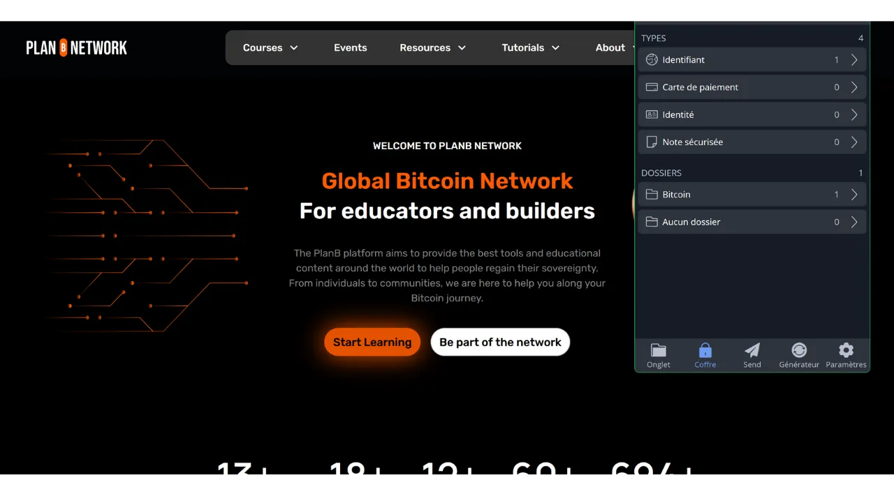

उदाहरण के लिए, अगर मैं PlanB नेटवर्क साइट पर वापस जाता हूँ और अपने खाते में लॉगिन करने की कोशिश करता हूँ, तो आप देख सकते हैं कि ब्राउज़र में जो Bitwarden एक्सटेंशन है, वह लॉगिन फील्ड्स को पहचान लेता है और मुझे अपने पहले से सेव किए गए पहचानकर्ता को चुनने का विकल्प अपने आप दे देता है।

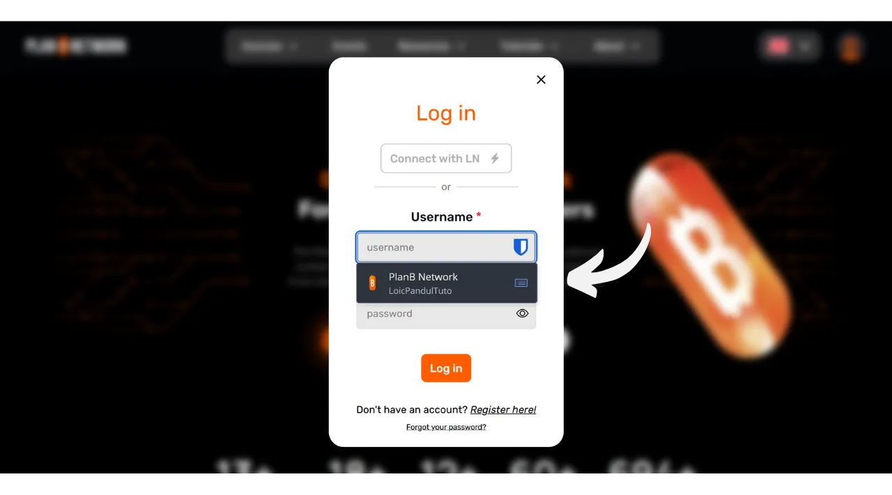

यदि मैं इस पहचानकर्ता का चयन करता हूँ, तो Bitwarden मेरे लिए लॉगिन फ़ील्ड्स को भर देता है। एक्सटेंशन की यह विशेषता वेबसाइटों से जल्दी जुड़ने की सुविधा देती है, बिना Bitwarden वेब एप्लिकेशन या सॉफ़्टवेयर से क्रेडेंशियल्स को कॉपी-पेस्ट किए।

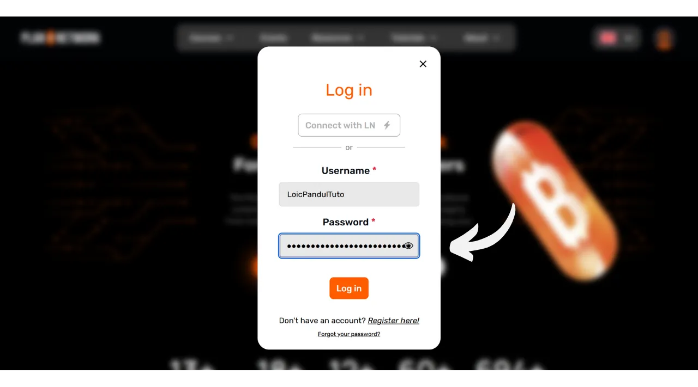

यह एक्सटेंशन नए खातों के निर्माण का पता लगाने के लिए भी डिज़ाइन किया गया है। उदाहरण के लिए, जब आप PlanB नेटवर्क पर एक नया खाता बनाते हैं, तो Bitwarden स्वतः ही नए पहचानकर्ता को सहेजने का सुझाव देता है।

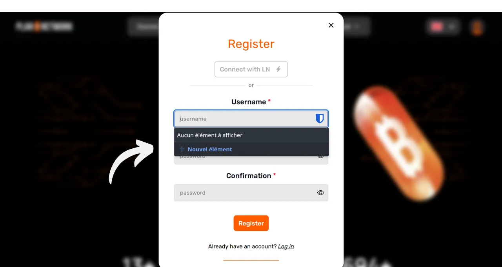

इस सुझाव पर क्लिक करने से जो दिखाई देता है, एक्सटेंशन खुल जाता है। यह मुझे नए पहचानकर्ता का विवरण और generate एक मजबूत, अनोखा पासवर्ड दर्ज करने की अनुमति देता है।

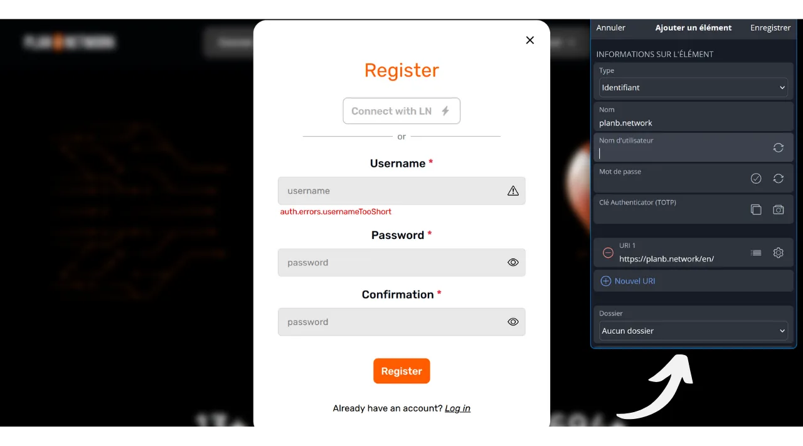

जानकारी पूरी करने के बाद और "*Save*" पर क्लिक करने पर, एक्सटेंशन क्रेडेंशियल्स को सेव कर लेता है।

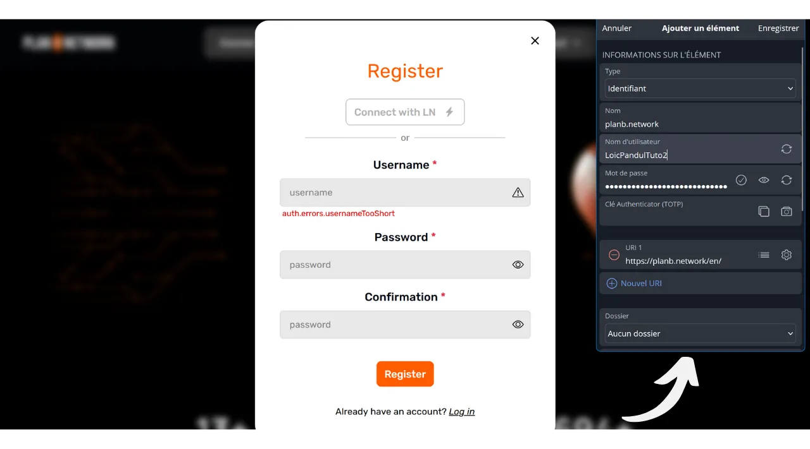

फिर, एक्सटेंशन अपने आप हमारी साख को वेबसाइट के सही स्थानों पर भर देता है।

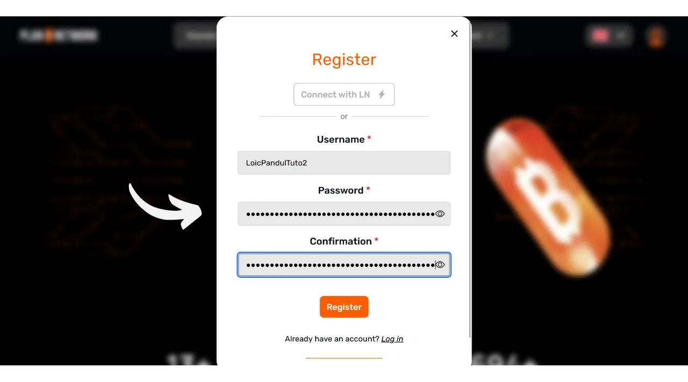

## Bitwarden सॉफ़्टवेयर का उपयोग कैसे करें?

1. **डाउनलोड और इंस्टॉल करें**: सबसे पहले, Bitwarden की आधिकारिक वेबसाइट पर जाएं और अपने डिवाइस के लिए उपयुक्त वर्जन डाउनलोड करें। फिर इसे इंस्टॉल करें।

2. **खाता बनाएं**: इंस्टॉल करने के बाद, Bitwarden खोलें और एक नया खाता बनाएं। इसके लिए आपको एक ईमेल आईडी और एक मास्टर पासवर्ड की आवश्यकता होगी। मास्टर पासवर्ड को सुरक्षित और याद रखने योग्य बनाएं क्योंकि यह आपके सभी पासवर्ड्स की चाबी है।

3. **लॉगिन करें**: खाता बनाने के बाद, अपने ईमेल और मास्टर पासवर्ड का उपयोग करके लॉगिन करें।

4. **पासवर्ड जोड़ें**: अब आप अपने विभिन्न ऑनलाइन खातों के पासवर्ड Bitwarden में जोड़ सकते हैं। इसके लिए "Add Item" या "Add Login" विकल्प का उपयोग करें और आवश्यक जानकारी भरें।

5. **ब्राउज़र एक्सटेंशन**: Bitwarden का ब्राउज़र एक्सटेंशन इंस्टॉल करें ताकि आप सीधे अपने ब्राउज़र से पासवर्ड मैनेज कर सकें। यह आपको वेबसाइटों पर ऑटो-फिल करने में मदद करेगा।

6. **सुरक्षा जांच**: Bitwarden में एक सिक्योरिटी ऑडिट फीचर होता है जो आपको कमजोर या डुप्लिकेट पासवर्ड की पहचान करने में मदद करता है। इसे समय-समय पर चेक करें।

7. **सिंक करें**: Bitwarden आपके सभी डिवाइस पर डेटा को सिंक करता है, जिससे आप कहीं भी और किसी भी डिवाइस से अपने पासवर्ड एक्सेस कर सकते हैं।

8. **दो-स्तरीय प्रमाणीकरण**: अपनी सुरक्षा बढ़ाने के लिए दो-स्तरीय प्रमाणीकरण (2FA) सेट करें। यह आपके खाते को और भी सुरक्षित बनाता है।

इन सरल चरणों का पालन करके, आप Bitwarden का प्रभावी ढंग से उपयोग कर सकते हैं और अपने पासवर्ड को सुरक्षित रख सकते हैं।

Bitwarden डेस्कटॉप सॉफ़्टवेयर को इंस्टॉल करने के लिए, सबसे पहले [डाउनलोड पेज](https://bitwarden.com/download/#downloads-desktop) पर जाएं। वहां से अपने ऑपरेटिंग सिस्टम के अनुसार सही वर्जन चुनें और डाउनलोड करें।

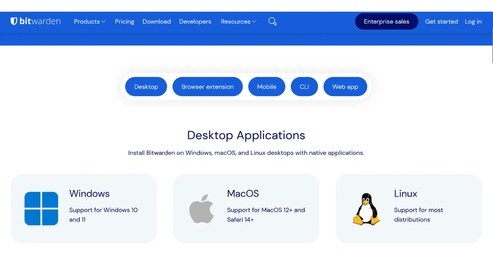

डाउनलोड पूरा होने के बाद, अपने कंप्यूटर पर सॉफ्टवेयर इंस्टॉल करें। जब आप पहली बार Bitwarden सॉफ्टवेयर को खोलेंगे, तो आपको अपने पासवर्ड मैनेजर को अनलॉक करने के लिए अपनी लॉगिन जानकारी दर्ज करनी होगी।

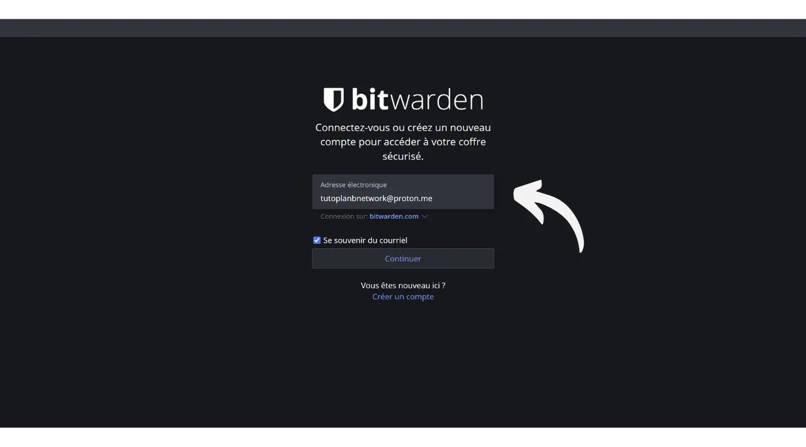

फिर, आप अपने मैनेजर के होमपेज पर पहुँचेंगे। Interface लगभग वैसा ही है जैसा कि वेब एप्लिकेशन पर होता है।

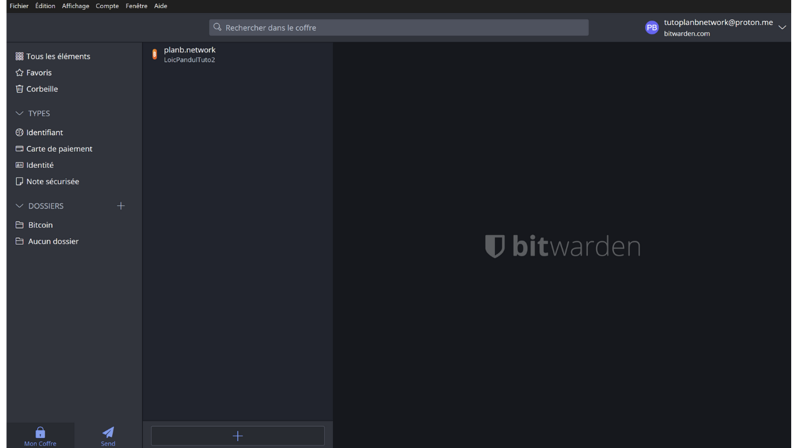

## Bitwarden एप्लिकेशन का उपयोग कैसे करें?

1. **डाउनलोड और इंस्टॉल करें**: सबसे पहले, अपने डिवाइस के लिए Bitwarden एप्लिकेशन डाउनलोड करें। यह ऐप स्टोर या गूगल प्ले स्टोर पर उपलब्ध है।

2. **खाता बनाएं**: एप्लिकेशन खोलें और एक नया खाता बनाने के लिए "साइन अप" पर क्लिक करें। अपनी ईमेल आईडी और एक मजबूत पासवर्ड दर्ज करें।

3. **लॉग इन करें**: खाता बनाने के बाद, अपनी ईमेल और पासवर्ड का उपयोग करके लॉग इन करें।

4. **पासवर्ड जोड़ें**: एप्लिकेशन में लॉग इन करने के बाद, आप अपने विभिन्न ऑनलाइन खातों के पासवर्ड जोड़ सकते हैं। "Add Item" पर क्लिक करें और आवश्यक जानकारी भरें।

5. **पासवर्ड मैनेज करें**: Bitwarden आपके सभी पासवर्ड को सुरक्षित रूप से स्टोर करता है। आप इन्हें कभी भी देख सकते हैं, एडिट कर सकते हैं या डिलीट कर सकते हैं।

6. **ब्राउज़र एक्सटेंशन का उपयोग करें**: Bitwarden का ब्राउज़र एक्सटेंशन भी उपलब्ध है, जिससे आप सीधे अपने ब्राउज़र में पासवर्ड ऑटोफिल कर सकते हैं।

7. **सुरक्षा सेटिंग्स**: अपनी सुरक्षा बढ़ाने के लिए, टू-फैक्टर ऑथेंटिकेशन सेट करें। यह आपके खाते को अतिरिक्त सुरक्षा प्रदान करता है।

8. **सिंक करें**: Bitwarden आपके सभी डिवाइस पर डेटा सिंक करता है, जिससे आप कहीं भी और किसी भी डिवाइस से अपने पासवर्ड एक्सेस कर सकते हैं।

इस तरह, Bitwarden का उपयोग करके आप अपने पासवर्ड को सुरक्षित और व्यवस्थित रख सकते हैं।

अपने फोन से पासवर्ड एक्सेस करने के लिए, आप Bitwarden मोबाइल एप्लिकेशन इंस्टॉल कर सकते हैं। सबसे पहले [डाउनलोड पेज](https://bitwarden.com/download/#downloads-mobile) पर जाएं और अपने स्मार्टफोन का उपयोग करके अपने ऑपरेटिंग सिस्टम के अनुसार दिए गए QR कोड को स्कैन करें।

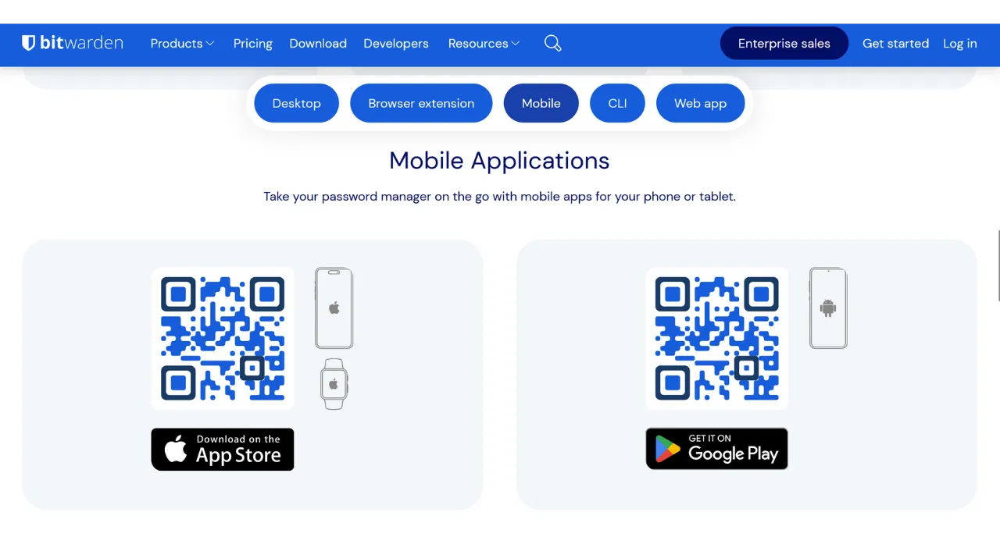

आधिकारिक Bitwarden मोबाइल एप्लिकेशन डाउनलोड और इंस्टॉल करें। एप्लिकेशन को पहली बार खोलते समय, अपने क्रेडेंशियल्स दर्ज करें ताकि आप अपने पासवर्ड मैनेजर का एक्सेस अनलॉक कर सकें।

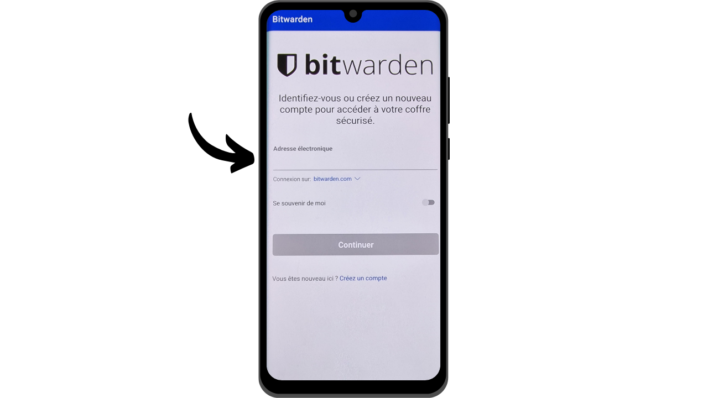

जुड़ने के बाद, आप सीधे एप्लिकेशन से अपने सभी पासवर्ड देख और प्रबंधित कर सकेंगे।

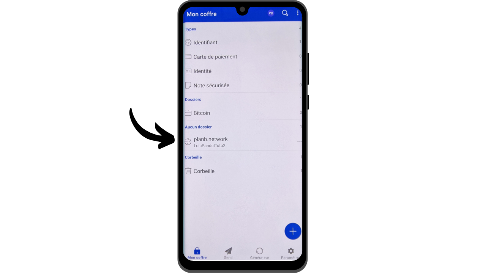

आपके एप्लिकेशन की सुरक्षा बढ़ाने के लिए, मैं आपको सलाह देता हूँ कि आप सेटिंग्स में जाकर पिन सुरक्षा को सक्रिय करें। यह आपके फोन के खोने या चोरी होने की स्थिति में अतिरिक्त सुरक्षा प्रदान करेगा।

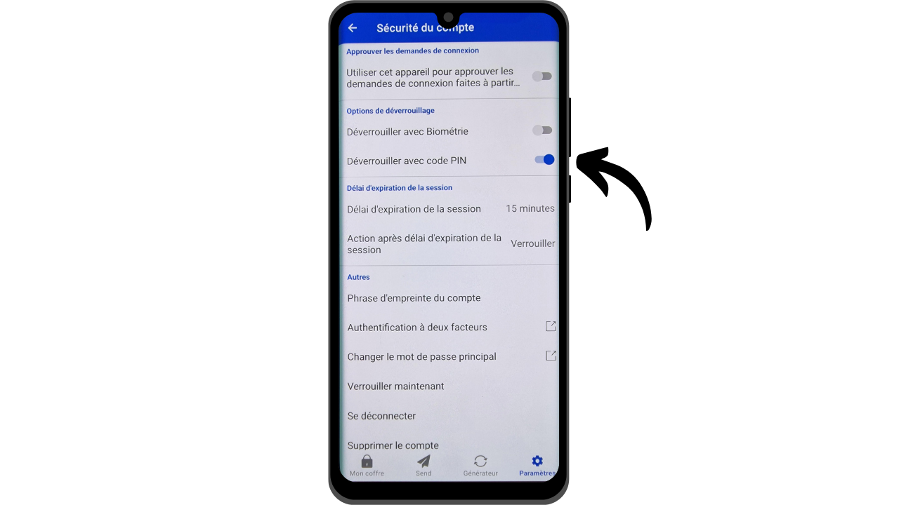

## Bitwarden का बैकअप कैसे करें?

Bitwarden का बैकअप करना एक अच्छा तरीका है ताकि आपकी सभी पासवर्ड और सुरक्षित जानकारी सुरक्षित रहे। यहाँ कुछ सरल कदम दिए गए हैं जिनसे आप Bitwarden का बैकअप कर सकते हैं:

1. **Bitwarden में लॉग इन करें**: सबसे पहले अपने Bitwarden अकाउंट में लॉग इन करें।

2. **वेब वॉल्ट खोलें**: अपने ब्राउज़र में Bitwarden की वेबसाइट पर जाएं और वेब वॉल्ट खोलें।

3. **एक्सपोर्ट ऑप्शन चुनें**: वेब वॉल्ट में, सेटिंग्स या टूल्स सेक्शन में जाएं और 'एक्सपोर्ट' ऑप्शन पर क्लिक करें।

4. **फाइल फॉर्मेट चुनें**: आपको फाइल फॉर्मेट चुनने का विकल्प मिलेगा। आमतौर पर, CSV या JSON फॉर्मेट में बैकअप लिया जाता है।

5. **पासवर्ड डालें**: सुरक्षा के लिए, आपको अपना मास्टर पासवर्ड डालना होगा।

6. **फाइल डाउनलोड करें**: एक्सपोर्ट प्रक्रिया पूरी होने के बाद, फाइल को अपने कंप्यूटर पर सुरक्षित स्थान पर सेव कर लें।

7. **फाइल को सुरक्षित रखें**: बैकअप फाइल को सुरक्षित स्थान पर रखें, जैसे कि एक एन्क्रिप्टेड ड्राइव या क्लाउड स्टोरेज।

इन सरल चरणों का पालन करके, आप अपने Bitwarden डेटा का बैकअप आसानी से ले सकते हैं और उसे सुरक्षित रख सकते हैं।

यह सुनिश्चित करने के लिए कि आप कभी भी अपने पासवर्ड्स की पहुँच न खोएं, भले ही आप अपना मास्टर पासवर्ड भूल जाएं या Bitwarden के सर्वर पर कोई समस्या हो जाए, मैं आपको सलाह देता हूँ कि आप नियमित रूप से अपने मैनेजर का एन्क्रिप्टेड बैकअप किसी बाहरी माध्यम पर करें।

विचार यह है कि आप अपने सभी Bitwarden क्रेडेंशियल्स को एक ऐसे पासवर्ड से एन्क्रिप्ट करें जो आपके मास्टर पासवर्ड से अलग हो और इस एन्क्रिप्टेड बैकअप को एक USB स्टिक या Hard ड्राइव पर सेव करें, जिसे आप अपने घर पर रखें। इसके बाद, आप डिक्रिप्शन पासवर्ड की एक भौतिक प्रति उस स्थान से अलग रख सकते हैं जहां बैकअप माध्यम रखा गया है। उदाहरण के लिए, आप USB स्टिक को घर पर रख सकते हैं और एन्क्रिप्शन पासवर्ड की भौतिक प्रति को किसी विश्वसनीय मित्र को सौंप सकते हैं।

इस विधि से यह सुनिश्चित होता है कि अगर आपकी बैकअप डिवाइस चोरी भी हो जाए, तो भी आपका डेटा डिक्रिप्शन पासवर्ड के बिना नहीं खोला जा सकेगा। इसी तरह, आपका दोस्त भी आपके डेटा तक नहीं पहुंच पाएगा जब तक कि उसके पास वह फिजिकल डिवाइस न हो।

हालांकि, अगर कोई समस्या होती है, तो आप पासवर्ड और बाहरी माध्यम का उपयोग करके अपने क्रेडेंशियल्स तक फिर से पहुंच सकते हैं, बिना Bitwarden पर निर्भर हुए। इस तरह, भले ही Bitwarden के सर्वर नष्ट हो जाएं, आपके पास अपने पासवर्ड वापस पाने की संभावना बनी रहेगी।

इसलिए, मैं आपको सलाह देता हूँ कि आप नियमित रूप से इन बैकअप्स को करें ताकि वे हमेशा आपके सबसे हाल के क्रेडेंशियल्स को शामिल करें। अपने दोस्त को, जिसके पास एन्क्रिप्शन पासवर्ड की एक कॉपी है, हर नए बैकअप के लिए परेशान करने से बचने के लिए, आप इस पासवर्ड को अपने पासवर्ड मैनेजर में सेव कर सकते हैं। यह बैकअप के रूप में नहीं है, क्योंकि आपके दोस्त के पास पहले से ही एक भौतिक कॉपी है, बल्कि आपके भविष्य के एक्सपोर्ट प्रक्रियाओं को सरल बनाने के लिए है।

निर्यात करने के लिए आगे बढ़ना बहुत आसान है: अपने बिटवॉर्डन मैनेजर के "*टूल्स*" सेक्शन में जाएं, फिर "*वॉल्ट निर्यात करें*" का चयन करें।

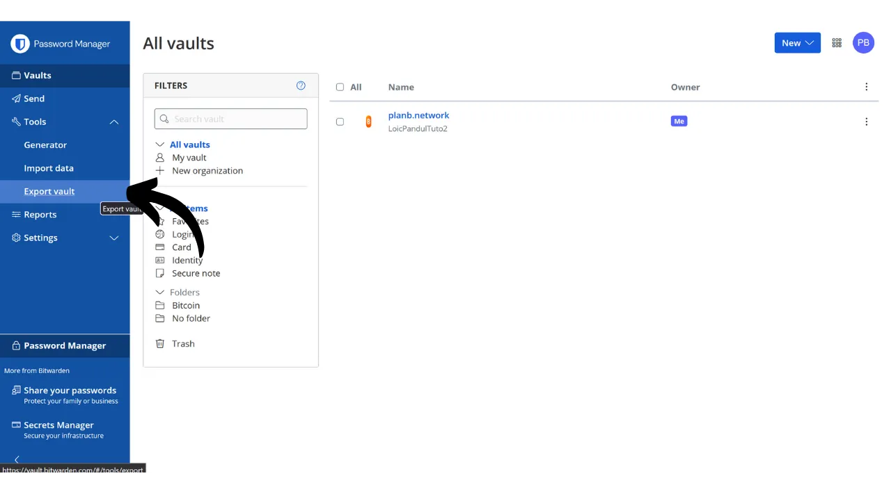

फॉर्मेट के लिए "*.json (Encrypted)*" चुनें।

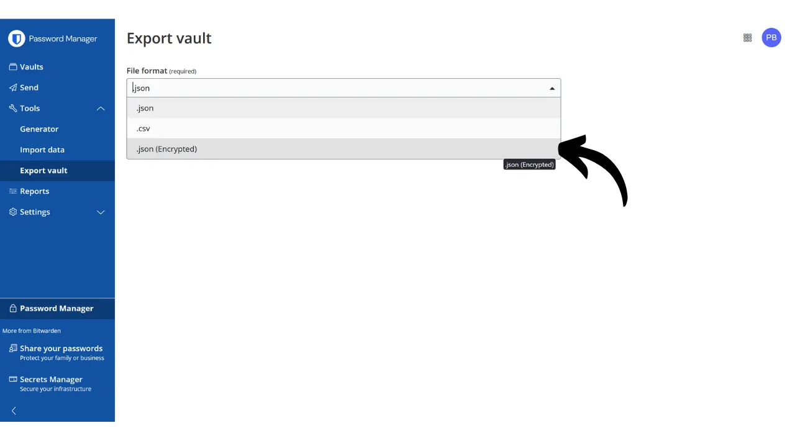

फिर "*पासवर्ड से सुरक्षित*" विकल्प चुनें।

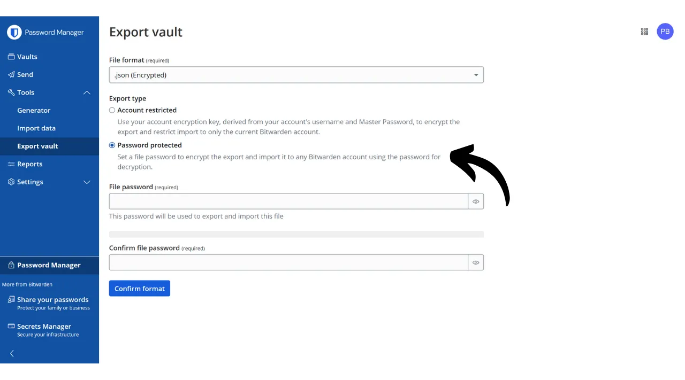

यहाँ, यह महत्वपूर्ण है कि आप एक मजबूत, अनोखा और यादृच्छिक रूप से उत्पन्न पासवर्ड चुनें ताकि बैकअप को एन्क्रिप्ट किया जा सके। इससे यह सुनिश्चित होता है कि, यदि आपके एन्क्रिप्टेड बैकअप की चोरी भी हो जाए, तो भी किसी हमलावर के लिए इसे बलपूर्वक डिक्रिप्ट करना असंभव होगा।

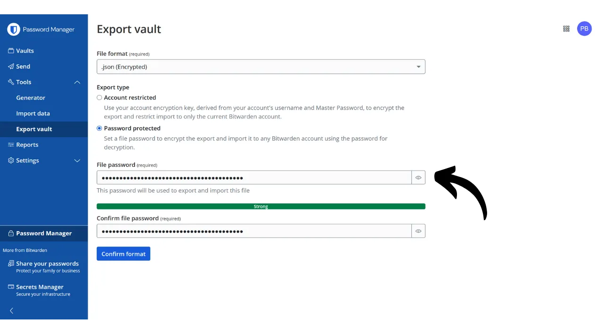

"*फॉर्मेट की पुष्टि करें*" पर क्लिक करें और निर्यात जारी रखने के लिए अपना मास्टर पासवर्ड दर्ज करें।

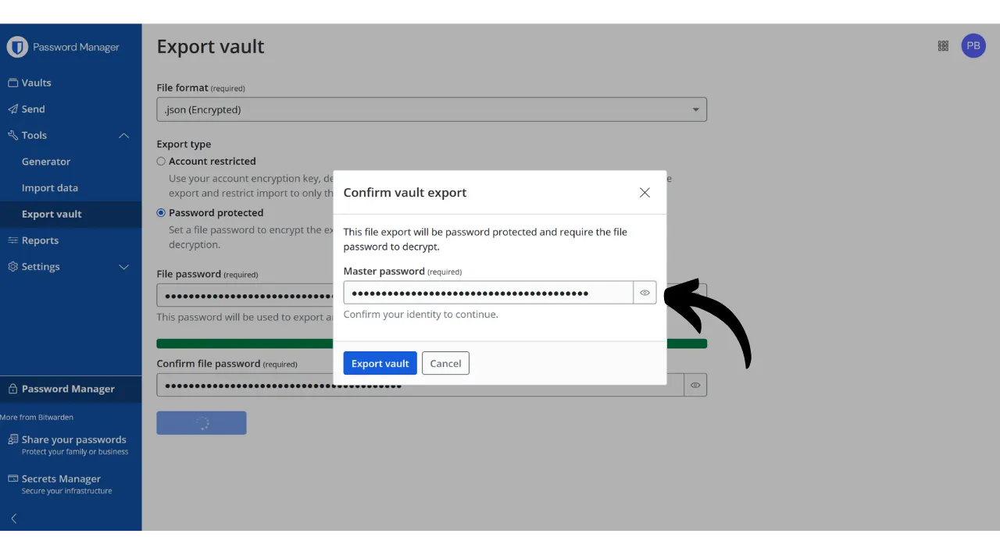

जब एक्सपोर्ट पूरा हो जाए, तो आपको अपनी एन्क्रिप्टेड बैकअप फाइल डाउनलोड्स में मिलेगी। इसे किसी सुरक्षित बाहरी स्टोरेज डिवाइस, जैसे कि यूएसबी स्टिक या Hard ड्राइव में ट्रांसफर कर लें। अपनी जरूरत के हिसाब से इस प्रक्रिया को समय-समय पर दोहराते रहें। उदाहरण के लिए, आप हर हफ्ते या हर महीने बैकअप को रिन्यू कर सकते हैं।
