> [ग्राफीनओएस](https://grapheneos.org/) एक गोपनीयता और सुरक्षा पर केंद्रित मोबाइल ऑपरेटिंग सिस्टम है, जो एंड्रॉइड ऐप्स के साथ संगत है। इसे एक गैर-लाभकारी ओपन सोर्स प्रोजेक्ट के रूप में विकसित किया गया है।
ग्राफीनओएस, जिसे मूल रूप से 2014 में 'कॉपरहेडओएस' के रूप में स्थापित किया गया था, पारंपरिक एंड्रॉइड कोड (एओएसपी) पर आधारित है, लेकिन इसमें कई बदलाव और सुधार किए गए हैं जो उपयोगकर्ता की गोपनीयता और सुरक्षा को बढ़ाने के लिए हैं। ग्राफीनओएस उपयोगकर्ता को उनके फोन पर नियंत्रण देता है, न कि बड़ी टेक कंपनियों को।

### सारांश:

- आपको अक्टूबर 2023 तक के डेटा पर प्रशिक्षित किया गया है।
- तैयारी
- आपको अक्टूबर 2023 तक के डेटा पर प्रशिक्षित किया गया है।
- ऐप विकल्प
- नुकसान या कमियाँ
- आपको अक्टूबर 2023 तक के डेटा पर प्रशिक्षित किया गया है।

आपको अक्टूबर 2023 तक के डेटा पर प्रशिक्षित किया गया है।

## ग्राफीनओएस का उपयोग क्यों करें?

ग्राफीनओएस एक प्राइवेसी और सुरक्षा पर केंद्रित ऑपरेटिंग सिस्टम है। अगर आप अपने स्मार्टफोन की सुरक्षा को लेकर चिंतित हैं और अपनी प्राइवेसी को प्राथमिकता देते हैं, तो ग्राफीनओएस आपके लिए एक बेहतरीन विकल्प हो सकता है। यह एंड्रॉइड पर आधारित है लेकिन इसमें कई अतिरिक्त सुरक्षा फीचर्स होते हैं जो आपके डेटा को सुरक्षित रखने में मदद करते हैं। इसके अलावा, यह ओपन-सोर्स है, जिसका मतलब है कि कोई भी इसके कोड की जांच कर सकता है और सुनिश्चित कर सकता है कि इसमें कोई छिपी हुई खामियां नहीं हैं। कुल मिलाकर, अगर आप एक सुरक्षित और प्राइवेट स्मार्टफोन अनुभव चाहते हैं, तो ग्राफीनओएस एक अच्छा विकल्प है।

आधुनिक फोन $500-$1000 की ट्रैकिंग और डेटा संग्रहण करने वाली डिवाइस हैं। हमारे जीवन का हर पहलू इनसे होकर गुजरता है, और दुर्भाग्यवश इस डेटा का बहुत सारा हिस्सा किसी न किसी रूप में तीसरे पक्ष के साथ साझा किया जाता है।

GrapheneOS खासतौर पर इस डेटा शेयरिंग को कम करने और आपके डिवाइस की सुरक्षा को संभावित हमलों से बचाने के लिए बनाया गया है। GrapheneOS का कोई खाता नहीं होता। आपको ऐप्स डाउनलोड करने या ऑपरेटिंग सिस्टम के साथ इंटरैक्ट करने के लिए किसी खाते की जरूरत नहीं होती। सीधे शब्दों में कहें, तो आप उत्पाद नहीं हैं।

GrapheneOS आपके एंड्रॉइड अनुभव को कुछ सरल मूल सिद्धांतों के माध्यम से अतिरिक्त सुरक्षा प्रदान करता है।

1. **हमले की सतह को कम करना** - अनावश्यक कोड (या ब्लोटवेयर) को हटा दें।

2. **कमजोरी के जोखिम की रोकथाम** - उपयोगकर्ता को इतनी स्वतंत्रता दें कि वे उन समझौतों को चुन सकें जिनके साथ वे सहज हैं।

3. **सैंडबॉक्स कंटेनमेंट** - GrapheneOS मौजूदा एंड्रॉइड सैंडबॉक्स को और मजबूत करता है, जिससे हर ऐप की आपके फोन के बाकी हिस्सों से संवाद करने की क्षमता को और अधिक सीमित कर देता है।

ग्राफीनओएस की विशेषताओं के तकनीकी विवरण के बारे में अधिक जानने के लिए [यहाँ](https://grapheneos.org/features) क्लिक करें।

### संक्रमण को आसान बनाना

अगर आप सालों से Google या Apple के इकोसिस्टम में जमे हुए हैं, तो अचानक से उस सारी सुविधा को खो देने का ख्याल डरावना हो सकता है। लेकिन कुछ सोच-समझकर ऐप इंस्टॉल करने के फैसलों के साथ (जिसके बारे में बाद में बताया जाएगा), इस अपेक्षित कठिनाई को काफी हद तक कम या खत्म किया जा सकता है।

जितने अच्छे विकल्प बनते जा रहे हैं, फिर भी ऐसे बदलाव का विचार थोड़ा डराने वाला हो सकता है। अगर आप खुद को इस स्थिति में पाते हैं, तो मेरी सबसे अच्छी सलाह यह है कि अपने नए GrapheneOS डिवाइस को कुछ समय के लिए अपने मौजूदा फोन के साथ चलाएं। इसके बाद, आप धीरे-धीरे हर हफ्ते 2-3 ऐप्स का उपयोग कम कर सकते हैं, जब तक कि आप खुद को केवल GrapheneOS डिवाइस का उपयोग करते हुए न पाएं।

अगर आप इस तरीके को अपनाते हैं, तो खुद के साथ सख्त रहें और जितनी जल्दी हो सके निगरानी वाले विकल्पों पर अपनी निर्भरता खत्म कर दें। हम इंसान आलसी होते हैं और अक्सर कम मेहनत वाले रास्ते को चुनते हैं। याद रखें कि आपने शुरुआत में बदलाव क्यों किया था।

आपने अपनी व्यक्तिगत जानकारी के साथ भुगतान करने के बजाय, अपने समय से भुगतान करना चुना, और कभी-कभी अपने Hard से कमाए गए पैसे से भी (यह इस पर निर्भर करता है कि आप कौन-कौन से वैकल्पिक ऐप्स इंस्टॉल करते हैं)।

## शुरू करना

GrapheneOS फिलहाल केवल [Google Pixel](https://grapheneos.org/faq#supported-devices) फोन की रेंज के लिए ही उपलब्ध है, जो कि थोड़ा विडंबनापूर्ण है। लेकिन इसके पीछे एक ठोस कारण है। Pixel फोन बेहतरीन हार्डवेयर-आधारित सुरक्षा प्रदान करते हैं, जो OS को मजबूत बनाने के काम को पूरा करते हैं। इसमें विशेष कंपोनेंट आइसोलेशन और वेरिफाइड बूट जैसी चीजें शामिल हैं।

### डिवाइस चुनना

जब आप उस Pixel फोन को चुन रहे हों जिस पर आप GrapheneOS इंस्टॉल करना चाहते हैं, तो यह सुनिश्चित करें कि आप यह जांच लें कि वह डिवाइस कब तक डिफ़ॉल्ट सुरक्षा अपडेट प्राप्त करता रहेगा।

जब यह लिखा जा रहा था, उस समय Pixel 6a सबसे सस्ता मॉडल था जो लंबे समय तक अच्छे समर्थन के साथ उपलब्ध था, जिसकी गारंटी जुलाई 2027 तक थी। अगर आप इस मॉडल को चुनते हैं, तो फैक्ट्री से आने वाले स्टॉक OS के संस्करण के साथ OEM अनलॉकिंग काम नहीं करेगी। आपको इसे जून 2022 या उसके बाद के संस्करण में ओवर-द-एयर अपडेट के माध्यम से अपडेट करना होगा। अपडेट करने के बाद, आपको OEM अनलॉकिंग को ठीक करने के लिए डिवाइस को फैक्ट्री रीसेट भी करना होगा। अन्य सभी मॉडल जो कैरियर अनलॉक हैं, वे बॉक्स से बाहर ही GrapheneOS के लिए तैयार होंगे।

जब आप कोई डिवाइस चुन रहे हों, तो यह सुनिश्चित करना भी ज़रूरी है कि आप अनलॉक्ड वर्जन खरीदें। कुछ कैरियर्स, जैसे कि Verizon, अपने यूनिट्स को बूटलोडर लॉक करके भेजते हैं, जिससे आगे की प्रक्रिया पूरी तरह से रुक जाती है।

### ग्राफीनओएस इंस्टॉल करना

GrapheneOS [वेब इंस्टॉलर](https://grapheneos.org/install/web) पूरे प्रोसेस को बहुत आसान बना देता है, जिसे कोई भी व्यक्ति 10 मिनट से कम समय में पूरा कर सकता है।

निम्नलिखित निर्देश ऊपर दिए गए लिंक से लिए गए एक संक्षिप्त संस्करण हैं।

आपको बस यह सब अपने पास रखना है:

- पिक्सल
- फोन से आपके कंप्यूटर तक जाने के लिए एक यूएसबी केबल।
- वेब ब्राउज़र चलाने के लिए एक कंप्यूटर (कोई भी क्रोमियम-आधारित ब्राउज़र: क्रोम, एज, ब्रेव आदि) की आवश्यकता होती है।

चलो इसमें गहराई से उतरते हैं:

पहला कदम है **सेटिंग्स** > **फोन के बारे में** पर जाना और बिल्ड नंबर पर बार-बार टैप करना जब तक कि आपको **'डेवलपर मोड'** सक्रिय होने का संदेश न दिखे।

2. इसके बाद **सेटिंग्स** > **सिस्टम** > **डेवलपर विकल्प** में जाएं और **'OEM अनलॉकिंग'** को सक्षम करें।

3. अब डिवाइस को रीबूट करें और जब फोन वापस चालू हो रहा हो, तब वॉल्यूम डाउन बटन को दबाए रखें।

4. अपने फोन को लैपटॉप से जोड़ें और अगर अनुमति के लिए पूछा जाए, तो कनेक्शन की अनुमति दें।

वेब इंस्टॉलर पेज पर 'Unlock the bootloader' पर क्लिक करें।

6. इसके बाद आपको फोन के विकल्प बदलते हुए दिखाई देंगे। वॉल्यूम बटन का उपयोग करके चयन को 'अनलॉक' पर ले जाएं और पावर बटन का उपयोग करके इसे स्वीकार करें।

7. इसके बाद वेब इंस्टॉलर पेज पर "डाउनलोड रिलीज़" पर क्लिक करें।

8. जब डाउनलोड पूरा हो जाए, तो अगले चरण पर जाएं और 'फ्लैश रिलीज़' पर क्लिक करें। इसमें एक या दो मिनट लगेंगे और आपको फोन को बिल्कुल भी छूने की ज़रूरत नहीं है।

9. अंत में, वेब इंस्टॉलर के अगले चरण पर जाएं और **लॉक बूटलोडर** पर क्लिक करें। आपको चयन बदलना होगा और पहले की तरह पावर बटन से पुष्टि करनी होगी।

10. जब आप 'Start' शब्द देखें, तो पावर बटन से इसकी पुष्टि करें और डिवाइस आपके नए गूगल-फ्री ऑपरेटिंग सिस्टम में बूट हो जाएगा।

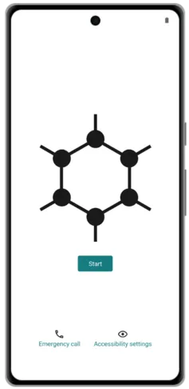

ग्राफीनओएस की शुरूआती स्क्रीन

प्रारंभिक बूट और सेटअप के बाद, यह एक अच्छी आदत है कि आप सेटिंग्स > सिस्टम > डेवलपर विकल्प में जाकर OEM अनलॉकिंग को बंद कर दें।

आप यह अतिरिक्त, वैकल्पिक लेकिन अनुशंसित कदम भी उठाना चाह सकते हैं कि इंस्टॉल को ऑडिटर ऐप के माध्यम से सत्यापित करें। इस कदम को पूरा करने के लिए आपको एक अलग एंड्रॉइड फोन की आवश्यकता होगी जिसमें यह ऐप इंस्टॉल हो। इसके लिए निर्देश [यहां](https://attestation.app/tutorial) मिल सकते हैं।

ऊपर बताए गए सरल चरणों का विवरण देने वाला वीडियो

अगर ये सरल कदम भी आपको मुश्किल लग रहे हैं, तो आप GrapheneOS सॉफ्टवेयर के साथ पहले से इंस्टॉल किए हुए Pixel फोन खरीदने पर विचार कर सकते हैं। बस इस बात का ध्यान रखें कि आप उस प्रदाता पर थोड़ा भरोसा कर रहे हैं।

### पहले से इंस्टॉल किए गए ऐप्स

अब जब आपने सेटअप कर लिया है, तो आप देख सकते हैं कि GrapheneOS पहली बार इंस्टॉल करने पर कितना साधारण लगता है। डिफ़ॉल्ट रूप से आपके पास ये ऐप्स इंस्टॉल होंगे:

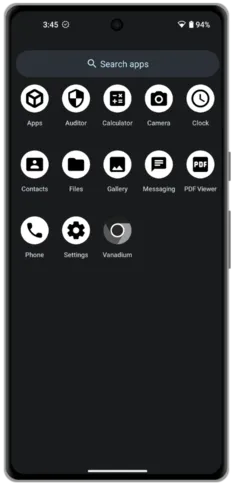

डिफ़ॉल्ट ऐप्स

आप शायद 'ऑडिटर' और 'वैनेडियम' से परिचित न हों।

- [ऑडिटर ऐप](https://play.google.com/store/apps/details?id=app.attestation.auditor) हार्डवेयर-आधारित सुरक्षा विशेषताओं का उपयोग करके डिवाइस की पहचान के साथ-साथ ऑपरेटिंग सिस्टम की प्रामाणिकता और अखंडता को सत्यापित करता है। यह सुनिश्चित करेगा कि डिवाइस स्टॉक ऑपरेटिंग सिस्टम पर चल रहा है, बूटलोडर लॉक है और ऑपरेटिंग सिस्टम के साथ कोई छेड़छाड़ नहीं की गई है।
- [वैनाडियम](https://github.com/GrapheneOS/Vanadium) एक क्रोमियम वेब ब्राउज़र का संस्करण है जिसे गोपनीयता और सुरक्षा के लिए मजबूत बनाया गया है।

## अनुकूलन

फोन की सेटिंग्स एक व्यक्तिगत चीज़ होती हैं, लेकिन जब मैं GrapheneOS इंस्टॉल करता हूँ, तो यहाँ कुछ पहली चीज़ें हैं जिन्हें मैं बदलता हूँ ताकि मुझे अपने जैसा महसूस हो सके।

### वॉलपेपर सेट करना और थीम अपडेट करना

सेटिंग्स > वॉलपेपर और स्टाइल पर जाएं। यहां से:

- वेब से डाउनलोड की गई तस्वीरों को होम और लॉक स्क्रीन के बैकग्राउंड के रूप में अपडेट करें।
- यूआई (यूज़र इंटरफ़ेस) में इस्तेमाल होने वाले एक्सेंट रंगों का चयन करना।
- डार्क थीम चालू करें।

### बैटरी प्रतिशत कैसे दिखाएं:

1. **एंड्रॉइड फोन पर:**
   - सेटिंग्स में जाएं।
   - "बैटरी" या "डिस्प्ले" विकल्प खोजें।
   - "बैटरी प्रतिशत दिखाएं" विकल्प को ऑन करें।

2. **आईफोन पर:**
   - सेटिंग्स में जाएं।
   - "बैटरी" विकल्प पर टैप करें।
   - "बैटरी प्रतिशत" को ऑन करें।

अब आपकी बैटरी का प्रतिशत स्क्रीन पर दिखाई देगा।

**सेटिंग्स** > **बैटरी** पर जाएं, फिर **स्टेटस बार में बैटरी प्रतिशत दिखाएं** को सक्षम करें।

### संपर्क आयात करें

**दूसरे एंड्रॉइड फोन से** - कॉन्टैक्ट्स ऐप में जाएं और VCF में एक्सपोर्ट करने का विकल्प खोजें।

**iOS से** - Export Contact जैसी ऐप का उपयोग करें और 'vCard' एक्सपोर्ट विकल्प का चयन करके VCF फाइल एक्सपोर्ट करें।

जब आपके पास VCF फाइल हो जाए, तो आप इसे माइक्रोएसडी कार्ड या यूएसबी ड्राइव जैसे बाहरी स्टोरेज विकल्प के साथ अपने GrapheneOS डिवाइस में ट्रांसफर कर सकते हैं। अगर आपके पास ये विकल्प नहीं हैं, तो आप नीचे दी गई कई ऐप्स में से किसी एक के जरिए इसे शेयर करने का विकल्प चुन सकते हैं।

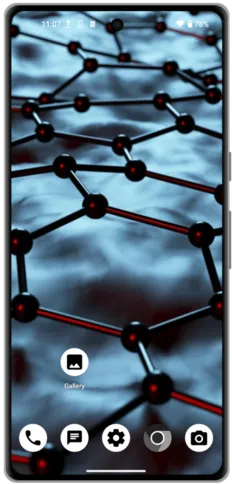

व्यक्तिगत होम स्क्रीन

## वैकल्पिक ऐप्स

अपने फोन को उपयोगी बनाने के लिए, आपको कुछ एप्लिकेशन इंस्टॉल करने की आवश्यकता होगी! नीचे दिए गए विकल्पों को मैंने व्यक्तिगत रूप से इस्तेमाल किया है या फिर उन्हें व्यापक गोपनीयता समुदाय से मजबूत सिफारिशें मिली हैं। कई अन्य बेहतरीन विकल्प भी उपलब्ध हैं जिनका यहाँ उल्लेख नहीं किया गया है, और [Awesome Privacy](https://awesome-privacy.xyz) सभी प्रकार के उपकरणों के लिए गोपनीयता बनाए रखने वाले एप्लिकेशनों की एक बेहद विस्तृत सूची प्रदान करता है।

सिर्फ इसलिए कि कोई ऐप मुफ्त और ओपन सोर्स सॉफ्टवेयर (FOSS) है, इसका मतलब यह नहीं है कि वह संभावित गोपनीयता लीक से मुक्त है। अपने पसंदीदा ऐप्स की गोपनीयता ऑडिट के खिलाफ प्रदर्शन देखने के लिए [Exodus](https://reports.exodus-privacy.eu.org/en/) का उपयोग करें।

### एफ-ड्रॉइड

[F-Droid](https://f-droid.org/) एक इंस्टॉल करने योग्य कैटलॉग है जो एंड्रॉइड के लिए फ्री और ओपन सोर्स सॉफ़्टवेयर (FOSS) एप्लिकेशन्स का संग्रह है। इसका क्लाइंट आपके डिवाइस पर एप्लिकेशन्स को ब्राउज़, इंस्टॉल और अपडेट करना आसान बनाता है। यह ध्यान देने योग्य है कि F-Droid के माध्यम से अपडेट कभी-कभी अन्य ऐप स्टोर्स की तुलना में धीमे हो सकते हैं। यह मुख्य रूप से इस बात पर निर्भर करता है कि ऐप मुख्य F-Droid रिपॉजिटरी से मिल रहा है या किसी कस्टम रिपॉजिटरी से।

F-Droid को इंस्टॉल करने के लिए, अपने GrapheneOS फोन पर ब्राउज़र के जरिए उनकी वेबसाइट पर जाएं और डाउनलोड पर टैप करें। इससे एक `.apk` फाइल डाउनलोड होगी। इसके बाद आपसे पूछा जाएगा कि क्या आप ऐप इंस्टॉल करना चाहेंगे।

F-Droid के डिफ़ॉल्ट रिपॉजिटरी में मिलने वाले ऐप्लिकेशन्स के अलावा, कई ओपन सोर्स प्रोजेक्ट्स अपनी खुद की रिपॉजिटरी भी होस्ट करते हैं, जिसे आप F-Droid ऐप की सेटिंग्स में जोड़ सकते हैं। अगर ऐसा है, तो संबंधित प्रोजेक्ट अपनी वेबसाइट पर आपको इसे करने के लिए बहुत ही आसान स्टेप्स बताएगा।

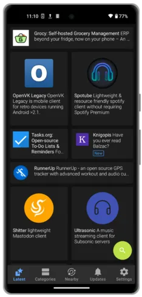

एफ-ड्रॉइड होम स्क्रीन

### ऑरोरा स्टोर

[Aurora Store](https://auroraoss.com/) गूगल प्ले स्टोर का एक फ्री और ओपन सोर्स सॉफ़्टवेयर (FOSS) संस्करण है। ऑरोरा स्टोर दिखने और उपयोग करने में पारंपरिक प्ले स्टोर जैसा ही लगता है और यह आपको उन सभी ऐप्स को डाउनलोड और अपडेट करने की सुविधा देता है जो आप सामान्यतः गूगल विकल्प के माध्यम से पाते हैं।

Aurora की सबसे खास बात है गुमनाम लॉग इन। इसका मतलब है कि आप अपने पसंदीदा ऐप्स को डाउनलोड कर सकते हैं जो F-Droid या सीधे APK के जरिए उपलब्ध नहीं हैं, बिना अपने Google अकाउंट में लॉग इन किए।

इससे पहले कि आप इसे अपनी डिफ़ॉल्ट इंस्टॉल विकल्प बनाने की जल्दी करें, याद रखें कि जिन कई ऐप्स से हम दूर होने की कोशिश कर रहे हैं, वे प्ले स्टोर से इंस्टॉल किए गए थे। सिर्फ इसलिए कि वे ऑरोरा से उपलब्ध हैं, इसका मतलब यह नहीं है कि उनमें ट्रैकिंग फीचर्स नहीं हो सकते। यह हमेशा संभव नहीं होगा, लेकिन जब भी आप कर सकते हैं, ऑरोरा से डाउनलोड करने से पहले एक एफ-ड्रॉइड विकल्प खोजने की कोशिश करें।

Aurora को इंस्टॉल करने के लिए, बस F-Droid में 'Aurora Store' सर्च करें।

Aurora में कुछ संभावित हमले के रास्ते भी हो सकते हैं, क्योंकि "गुमनाम खाते" वास्तव में Aurora द्वारा बनाए और नियंत्रित किए जाते हैं। सैद्धांतिक रूप से, वे हानिकारक अपडेट या ऐप्स आपके फोन पर भेज सकते हैं, हालांकि आपको अभी भी डिवाइस पर इंस्टॉल प्रॉम्प्ट को स्वीकार करना होगा। Aurora में कभी-कभी कुछ ऐप्स नहीं दिखने की समस्या भी होती है, जो क्षेत्र और डिवाइस की गलत पहचान के कारण होती है। आमतौर पर इसे नीचे दिए गए चरणों से हल किया जा सकता है।

**सर्वोत्तम सुझाव** - कभी-कभी Aurora Store पर रेट लिमिटिंग का सामना करना पड़ सकता है, जिससे आपके लिए ऐप्स को खोजने और इंस्टॉल करने की क्षमता सीमित हो जाती है। इसे हल करने के लिए, **सेटिंग्स** > **ऐप्स** > **Aurora** > **डिफ़ॉल्ट रूप से खोलें** पर जाएं, फिर डोमेन `play.google.com` जोड़ें। अब, जब भी आप किसी प्रोडक्ट या सर्विस की वेबसाइट पर जाते हैं जिसमें 'प्ले स्टोर के माध्यम से डाउनलोड करें' लिंक होता है, तो उस पर टैप करने से वह ऐप Aurora में खुलेगा और आप उसे डाउनलोड कर सकेंगे।

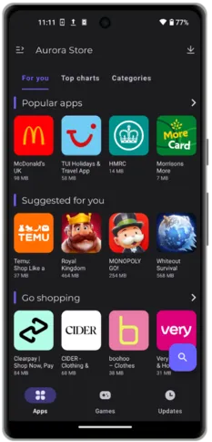

ऑरोरा स्टोर का होम स्क्रीन

### एपीके डाउनलोड

एंड्रॉइड पर ऐप्स को `.apk` फाइल के जरिए भी डाउनलोड और इंस्टॉल किया जा सकता है। यह एक बेहतरीन विकल्प है जिसमें किसी थर्ड पार्टी ऐप स्टोर की जरूरत नहीं होती। बस सीधे प्रोजेक्ट या सर्विस की वेबसाइट या GitHub रिपॉजिटरी से फाइल डाउनलोड कर लें।

इस तरीके का एक नुकसान यह है कि आपको स्वचालित अपडेट नहीं मिलते हैं, इसलिए आपको उस सेवा के संचार चैनलों पर नजर रखनी होगी ताकि नए रिलीज़ के बारे में जानकारी मिल सके। हालांकि, एक शानदार प्रोजेक्ट है जिसका नाम Obtainium है, जो इस समस्या को हल करने का प्रयास करता है। [Obtainium](https://github.com/ImranR98/Obtainium) आपको ओपन-सोर्स ऐप्स को सीधे उनके रिलीज़ पेज से इंस्टॉल और अपडेट करने की सुविधा देता है, और जब नए रिलीज़ उपलब्ध होते हैं, तो आपको सूचनाएं भी मिलती हैं।

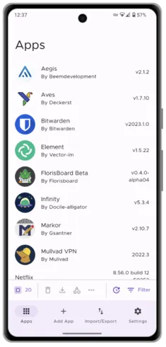

ओब्टेनियम पूर्वावलोकन

### वेब ऐप्स

ऐसे समय में जब आप किसी सेवा का कम ही उपयोग करना चाहते हैं और कोई ऐप डाउनलोड नहीं करना चाहते, तो आप बस वेब वर्जन का उपयोग कर सकते हैं। आजकल कई वेबसाइट्स प्रोग्रेसिव वेब ऐप (PWA) सपोर्ट भी देती हैं। इसमें आप किसी विशेष वेबसाइट (जैसे Twitter.com) को अपने फोन की होम स्क्रीन पर बुकमार्क कर सकते हैं। फिर जब आप उस आइकन पर टैप करते हैं, तो यह एक फुल स्क्रीन ऐप की तरह खुलता है, जिसमें ब्राउज़र के सामान्य विकर्षण नहीं होते। आप नीचे देख सकते हैं कि यह कैसा दिखता है।

Vanadium, जो GrapheneOS का मूल ब्राउज़र है, में यह करने के लिए, बस अपनी पसंद की वेबसाइट पर जाएं, स्क्रीन के ऊपर दाईं ओर तीन वर्टिकल डॉट्स पर टैप करें और फिर **'Add to Home Screen'** पर टैप करें।

इस तरीके का एकमात्र नकारात्मक पहलू यह है कि क्योंकि यह सिर्फ एक बुकमार्क की गई वेब पेज है, आपको किसी भी प्रकार की सूचनाएं नहीं मिलेंगी। हालांकि, कुछ लोग इसे एक सकारात्मक बात भी मान सकते हैं!

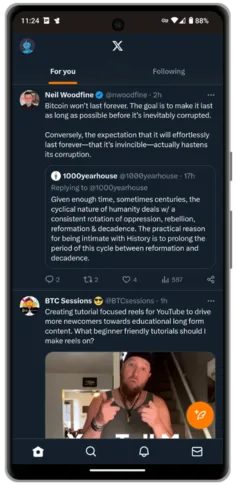

ट्विटर पीडब्ल्यूए (प्रोग्रेसिव वेब ऐप)

### वेब ब्राउज़र्स

आप वैनाडियम के प्री-पैकेज्ड विकल्प के साथ सच में गलत नहीं हो सकते। यह ऐप किसी भी अन्य मोबाइल ब्राउज़र की तरह ही काम करता है और मुझे कभी भी कोई संगतता समस्या नहीं हुई है।

जब आपको Tor के मूल `.onion` साइट्स तक पहुंचने की ज़रूरत हो, तो आप Tor ब्राउज़र APK सीधे उनकी [वेबसाइट](https://www.torproject.org/download/#android) से या F-Droid के माध्यम से डाउनलोड कर सकते हैं।

### वीपीएन (VPNs) का मतलब है वर्चुअल प्राइवेट नेटवर्क। यह एक तकनीक है जो आपके इंटरनेट कनेक्शन को सुरक्षित और निजी बनाती है। जब आप वीपीएन का इस्तेमाल करते हैं, तो यह आपके डिवाइस से इंटरनेट तक जाने वाले डेटा को एन्क्रिप्ट कर देता है, जिससे आपकी ऑनलाइन गतिविधियाँ सुरक्षित रहती हैं। यह आपके असली आईपी एड्रेस को छुपाकर आपको एक नया आईपी एड्रेस देता है, जिससे आपकी पहचान छुपी रहती है और आप गुमनाम रूप से इंटरनेट ब्राउज़ कर सकते हैं। वीपीएन का उपयोग अक्सर तब किया जाता है जब लोग सार्वजनिक वाई-फाई का इस्तेमाल कर रहे होते हैं या जब वे किसी ऐसी वेबसाइट या सेवा का उपयोग करना चाहते हैं जो उनके देश में उपलब्ध नहीं है।

अगर आप अपने इंटरनेट सेवा प्रदाता (ISP) से अपनी ऑनलाइन गतिविधियों को सुरक्षित रखना चाहते हैं, तो एक वर्चुअल प्राइवेट नेटवर्क (VPN) ऐप एक अच्छा विकल्प है। VPN आपके इंटरनेट ट्रैफिक को एक एन्क्रिप्टेड सुरंग के माध्यम से VPN सेवा प्रदाता द्वारा नियंत्रित एक साझा IP Address तक भेजता है, ताकि आपकी डिवाइस की गतिविधियों को आपसे जोड़ा न जा सके।

निम्नलिखित तीन सम्मानित विकल्प हैं जो आपको Bitcoin में सेवा के लिए भुगतान करने की अनुमति देते हैं और इसके लिए किसी भी व्यक्तिगत जानकारी की आवश्यकता नहीं होती है। ये सभी तीन विकल्प F-Droid के माध्यम से उपलब्ध हैं।

- [Mullvad](https://f-droid.org/packages/net.mullvad.mullvadvpn/) एक वीपीएन सेवा है जो आपकी ऑनलाइन गोपनीयता और सुरक्षा को बढ़ाने में मदद करती है।
- आप अक्टूबर 2023 तक के डेटा पर प्रशिक्षित हैं।
- [iVPN](https://f-droid.org/en/packages/net.ivpn.client/) एक ऐप है जिसे आप F-Droid से डाउनलोड कर सकते हैं।

### संदेश भेजना

हाल के वर्षों में एन्क्रिप्टेड मैसेजिंग समाधान बहुतायत में उपलब्ध हो गए हैं। लेकिन समस्या यह है कि भले ही आपके फोन पर सबसे अच्छा और सबसे निजी विकल्प इंस्टॉल हो, अगर आपके संपर्कों में से कोई भी इसका उपयोग नहीं करता है, तो इसका क्या फायदा?

ज्यादातर लोग जिन्हें प्राइवेसी के क्षेत्र में कोई दिलचस्पी नहीं है, वे शायद WhatsApp या iMessage का इस्तेमाल कर रहे होंगे। WhatsApp को Aurora Store से डाउनलोड किया जा सकता है, लेकिन iMessage GrapheneOS पर काम नहीं करेगा (जाहिर है!)।

- [सिग्नल](https://signal.org/) एक बहुत ही लोकप्रिय एंड-टू-एंड एन्क्रिप्टेड (E2EE) मैसेंजर है, जिसकी एक मजबूत प्रतिष्ठा और कई विशेषताएँ हैं। सिग्नल पर साइन अप करने के लिए एक फोन नंबर की आवश्यकता होती है, इसलिए यदि आप उन लोगों से चैट करना चाहते हैं जिन्हें आप अपना फोन नंबर नहीं बताना चाहते, तो शायद कुछ अन्य विकल्पों पर विचार करें। सिग्नल को ऑरोरा स्टोर से डाउनलोड करना होगा।
- [सिंप्लेक्स](https://f-droid.org/en/packages/chat.simplex.app/) एक नया E2EE मैसेंजर है। इसमें कोई यूज़र आईडी नहीं होती, न ही फोन नंबर या व्यक्तिगत जानकारी की ज़रूरत होती है। लोग आपको आपके व्यक्तिगत QR कोड को स्कैन करके या आपकी यूनिक लिंक पर जाकर ढूंढ सकते हैं। सिंप्लेक्स उन्नत उपयोगकर्ताओं को अपना खुद का सर्वर चलाने की अनुमति भी देता है, जिससे किसी केंद्रीकृत इकाई पर निर्भरता और कम हो जाती है। सिंप्लेक्स का कोई डेस्कटॉप क्लाइंट नहीं है, इसलिए अगर आपके लिए मल्टी-डिवाइस सपोर्ट प्राथमिकता है, तो यह उपयुक्त नहीं हो सकता। एंड्रॉइड के लिए सिंप्लेक्स F-Droid के माध्यम से उपलब्ध है।
- [Threema](https://threema.ch/en/faq/libre_installation) Simplex की तरह ही एक अनुभव प्रदान करता है, लेकिन यह काफी समय से मौजूद है और इसलिए थोड़ा अधिक परिपक्व लगता है। Threema मुफ्त नहीं है, इसका लाइफटाइम लाइसेंस $4.99 में मिलता है और इसे Bitcoin के साथ खरीदा जा सकता है। Threema वेब क्लाइंट और नेटिव डेस्कटॉप एप्लिकेशन प्रदान करता है। इसका एंड्रॉइड एप्लिकेशन F-Droid के माध्यम से उपलब्ध है।
- [Telegram FOSS](https://f-droid.org/en/packages/org.telegram.messenger/) आधिकारिक Telegram ऐप का एक अनौपचारिक FOSS Fork संस्करण है, जो एंड्रॉइड के लिए है। Telegram में E2EE 'सीक्रेट चैट्स' होती हैं, लेकिन डिफ़ॉल्ट विकल्प निजी नहीं होता। Telegram FOSS को F-Droid से डाउनलोड किया जा सकता है।

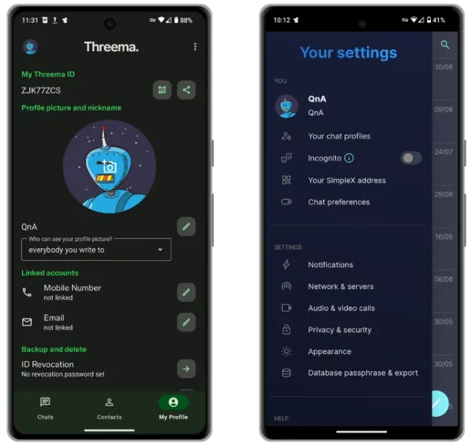

बाएं: थ्रीमा, दाएं: सिम्प्लेक्स

### आप अक्टूबर 2023 तक के डेटा पर प्रशिक्षित हैं।

- [Spotube](https://f-droid.org/packages/oss.krtirtho.spotube/) एक ऐसा Spotify क्लाइंट है जो विभिन्न प्लेटफॉर्म्स पर काम करता है और इसके लिए आपको प्रीमियम अकाउंट की जरूरत नहीं होती। Spotube को आप F-Droid से प्राप्त कर सकते हैं।
- [ViMusic](https://f-droid.org/en/packages/it.vfsfitvnm.vimusic/) एक शानदार ऐप है जो आपको YouTube म्यूजिक से कोई भी गाना मुफ्त में स्ट्रीम करने की सुविधा देता है। ViMusic को F-Droid से डाउनलोड किया जा सकता है।
- [न्यूपाइप](https://f-droid.org/packages/org.schabi.newpipe/) आपको यूट्यूब का अनुभव बिना किसी परेशान करने वाले विज्ञापनों और संदिग्ध अनुमतियों के देता है। न्यूपाइप के साथ आप चैनलों को सब्सक्राइब कर सकते हैं, बैकग्राउंड में सुन सकते हैं और यहां तक कि ऑफलाइन देखने के लिए डाउनलोड भी कर सकते हैं। न्यूपाइप एफ-ड्रॉइड के माध्यम से उपलब्ध है।
- [AntennaPod](https://f-droid.org/packages/de.danoeh.antennapod/) एक पॉडकास्ट प्लेयर है जो आपको आपके सभी पसंदीदा शो को सब्सक्राइब और मैनेज करने की सुविधा देता है। AntennaPod F-Droid के माध्यम से उपलब्ध है।

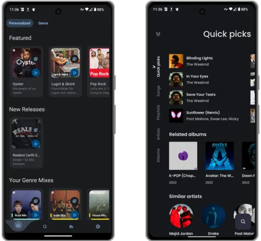

बाएं: स्पॉट्यूब, दाएं: वीम्यूजिक

### नक्शे

अगर आप GrapheneOS में ड्राइविंग करते समय और मैप्स ऐप का उपयोग करते समय वॉइस असिस्टेंस चाहते हैं, तो आपको [RHVoice](https://rhvoice.org/installation/) इंस्टॉल करना होगा और इसे [कॉन्फ़िगर](https://discuss.grapheneos.org/d/2488-organic-maps-app-voice-instructions-are-not-available) करना होगा।

- [मैजिक अर्थ](https://www.magicearth.com/) एक मैप्स का विकल्प है जो टर्न-बाय-टर्न नेविगेशन, 3D और ऑफलाइन मैप्स को सपोर्ट करता है। मैजिक अर्थ को ऑरोरा स्टोर से डाउनलोड किया जा सकता है।
- [ऑर्गेनिक मैप्स](https://f-droid.org/en/packages/app.organicmaps/) यात्रियों, पर्यटकों, पर्वतारोहियों और साइकिल चालकों के लिए एक बेहतरीन नक्शा विकल्प है, जो भीड़-स्रोतित ओपनस्ट्रीटमैप डेटा पर आधारित है। यह एक प्राइवेसी-केंद्रित, ओपन-सोर्स Fork है, जो पहले मैप्सविथमी के नाम से जाना जाता था। यह बिना इंटरनेट कनेक्शन के 100% फीचर्स का समर्थन करता है और इसे एफ-ड्रॉइड से डाउनलोड किया जा सकता है।
- [OsmAnd](https://f-droid.org/en/packages/net.osmand.plus/) एक और बेहतरीन मैप्स विकल्प है जो ऊपर बताए गए सभी फीचर्स को सपोर्ट करता है।

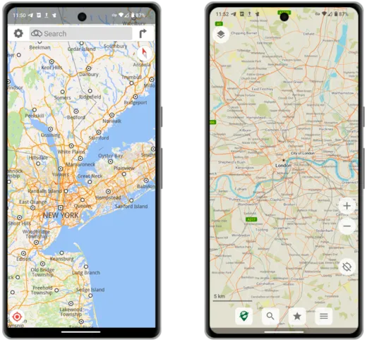

बाएं: मैजिक अर्थ, दाएं: ऑर्गेनिक मैप्स

### ईमेल

- प्रोटॉन मेल एक मुफ्त निजी ईमेल सेवा है जो ऑडिटेड एंड-टू-एंड एन्क्रिप्शन (E2EE) का समर्थन करती है। प्रोटॉन एक पेड वर्जन भी प्रदान करता है जो कस्टम डोमेन और उपनाम (aliasing) का समर्थन करता है। प्रोटॉन मेल को सीधे एपीके के रूप में या ऑरोरा के माध्यम से डाउनलोड किया जा सकता है।
- [Tutanota](https://tutanota.com/) वही सुविधाएँ प्रदान करता है जो Proton Mail करता है, जिसमें वैकल्पिक भुगतान सेवाएँ भी शामिल हैं। इसे सीधे APK के रूप में या F-Droid के माध्यम से डाउनलोड किया जा सकता है।
- [K-9 मेल](https://f-droid.org/en/packages/com.fsck.k9/) एक ओपन सोर्स ईमेल क्लाइंट है जो लगभग हर ईमेल प्रदाता के साथ काम करता है। यह कई खातों, एकीकृत इनबॉक्स और OpenPGP एन्क्रिप्शन मानक का समर्थन करता है।

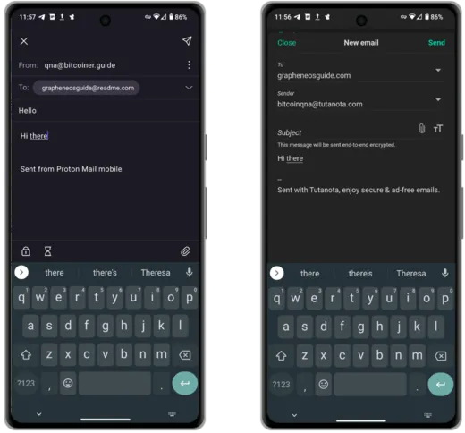

बाएं: प्रोटॉन मेल, दाएं: टुटानोता

### उत्पादकता

- [Syncthing](https://f-droid.org/packages/com.nutomic.syncthingandroid/) एक फाइल सिंक्रोनाइज़ेशन प्रोग्राम है। यह दो या अधिक डिवाइसों के बीच फाइलों को रियल टाइम में सिंक्रोनाइज़ करता है, और आपकी फाइलें सुरक्षित रहती हैं ताकि कोई और उन्हें न देख सके। आपका डेटा सिर्फ आपका है और आपको यह चुनने का हक है कि इसे कहाँ स्टोर किया जाए, क्या इसे किसी तीसरे पक्ष के साथ साझा किया जाए, और इसे इंटरनेट पर कैसे भेजा जाए। Syncthing F-Droid के माध्यम से उपलब्ध है।
- [KDE Connect](https://f-droid.org/packages/org.kde.kdeconnect_tp/) आपके सभी उपकरणों को आपके होम नेटवर्क से कनेक्ट होने पर एक-दूसरे से आसानी से बात करने की सुविधा देता है। आप सभी उपकरणों के बीच आसानी से फाइलें, फोटो, और क्लिपबोर्ड डेटा भेज सकते हैं (यहां तक कि iOS पर भी!)। KDE Connect को F-Droid से डाउनलोड किया जा सकता है।
- [Notesnook](https://f-droid.org/en/packages/com.streetwriters.notesnook/) एक E2EE नोट्स ऐप्लिकेशन है जो आपके विचारों और टू-डू लिस्ट्स को आपके सभी डिवाइसों पर सिंक करने में मदद करता है। उनका मुफ्त प्लान ज्यादातर व्यक्तिगत उपयोग के लिए पर्याप्त है। Notesnook F-Droid पर उपलब्ध है।
- [स्टैंडर्ड नोट्स](https://f-droid.org/en/packages/com.standardnotes/) नोट्सनूक के बहुत ही समान है, लेकिन इसके सभी फीचर्स का उपयोग करने के लिए एक पेड प्लान की आवश्यकता होती है। स्टैंडर्ड नोट्स एफ-ड्रॉइड के माध्यम से उपलब्ध है।
- [Anysoft Keyboard](https://f-droid.org/packages/com.menny.android.anysoftkeyboard/) एक कीबोर्ड ऐप है जो आपके फोन पर टाइपिंग के अनुभव को आपकी पसंद के अनुसार पूरी तरह से कस्टमाइज़ करने की सुविधा देता है। इसे F-Droid से डाउनलोड किया जा सकता है।
- [GBoard](https://play.google.com/store/apps/details?id=com.google.android.inputmethod.latin&hl=en&gl=US) गूगल का डिफॉल्ट कीबोर्ड ऐप है। मेरे अनुभव में, यह टाइप और स्वाइप करने का सबसे अच्छा अनुभव प्रदान करता है। अगर आप इस ऐप को डाउनलोड करते हैं, तो सुनिश्चित करें कि आप सभी नेटवर्क संबंधित अनुमतियों को पूरी तरह से बंद कर दें। इसे ऑरोरा के माध्यम से डाउनलोड किया जा सकता है।

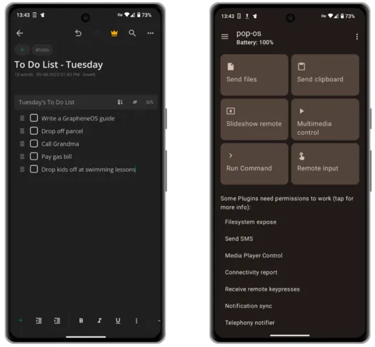

बाईं ओर: नोट्सनूक, दाईं ओर: केडीई कनेक्ट

### लाइफस्टाइल

- [जियोमेट्रिक वेदर](https://f-droid.org/en/packages/wangdaye.com.geometricweather/) एक खूबसूरती से डिज़ाइन किया गया ओपन सोर्स मौसम ऐप है, जो F-Droid के माध्यम से उपलब्ध है। यह विभिन्न आकारों के विजेट्स का समर्थन करता है, जिससे आप अपने चुने हुए स्थान का मौसम सीधे अपने होम स्क्रीन पर देख सकते हैं।
- [Translate You](https://f-droid.org/packages/com.bnyro.translate/) एक ओपन सोर्स और प्राइवेसी को सुरक्षित रखने वाला अनुवाद ऐप है जो 200 से अधिक भाषाओं का समर्थन करता है। Translate You F-Droid के माध्यम से उपलब्ध है।
- [प्रोटॉन कैलेंडर](https://proton.me/calendar/download) एक सरल उपयोग करने वाला E2EE है जो आपके प्रोटॉन ईमेल खातों के साथ आसानी से जुड़ता है। प्रोटॉन कैलेंडर को APK के रूप में या ऑरोरा स्टोर के माध्यम से डाउनलोड किया जा सकता है।
- [PassAndroid](https://f-droid.org/en/packages/org.ligi.passandroid/) एक ऐप है जो बोर्डिंग पास, कूपन, मूवी टिकट और सदस्यता कार्ड आदि को दिखाने और स्टोर करने के लिए उपयोग किया जाता है। बस संबंधित `pkpass` या `espass` फाइल डाउनलोड करें और ऐप के साथ खोलें। PassAndroid F-Droid के माध्यम से उपलब्ध है।

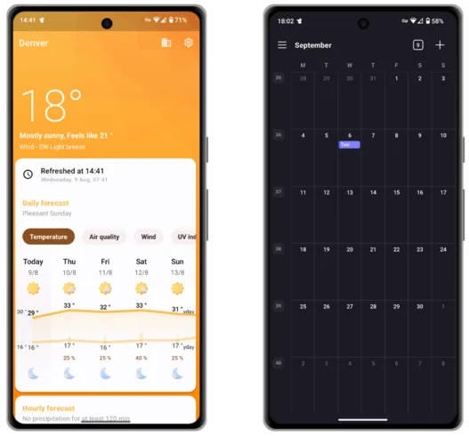

बाएँ: ज्यामितीय मौसम, दाएँ: प्रोटॉन कैलेंडर

### सुरक्षा/गोपनीयता

- [बिटवॉर्डन](https://mobileapp.bitwarden.com/fdroid/) आपके सभी उपकरणों के लिए एक मुफ्त और एंड-टू-एंड एन्क्रिप्टेड क्रॉस प्लेटफॉर्म पासवर्ड मैनेजर समाधान प्रदान करता है। उनकी पेड सेवा आपको ऐप में 2FA कोड्स को इंटीग्रेट करने की सुविधा देती है। बिटवॉर्डन का सर्वर साइड स्वयं होस्ट किया जा सकता है और एंड्रॉइड ऐप एफ-ड्रॉइड के माध्यम से उपलब्ध है।
- [प्रोटॉन पास](https://proton.me/pass/download) एक मुफ्त सेवा प्रदान करता है जो बिटवॉर्डन के समान है, लेकिन [प्रोटॉन अनलिमिटेड](https://proton.me/pricing) ग्राहक अतिरिक्त उन्नत सुविधाओं का लाभ उठा सकते हैं। प्रोटॉन पास APK या ऑरोरा के माध्यम से उपलब्ध है।
- [फ्रीओटीपी](https://f-droid.org/packages/org.fedorahosted.freeotp/) एक दो-कारक प्रमाणीकरण एप्लिकेशन है जो एक-बार पासवर्ड प्रोटोकॉल का उपयोग करने वाले सिस्टम्स के लिए है। टोकन को आसानी से एक क्यूआर कोड स्कैन करके जोड़ा जा सकता है। फ्रीओटीपी एफ-ड्रॉइड के माध्यम से उपलब्ध है।
- [Aegis](https://f-droid.org/en/packages/com.beemdevelopment.aegis/) एक मुफ्त, सुरक्षित और ओपन सोर्स ऐप है जो एंड्रॉइड पर आपके ऑनलाइन सेवाओं के लिए 2-स्टेप वेरिफिकेशन टोकन को मैनेज करने में मदद करता है। Aegis F-Droid के माध्यम से उपलब्ध है।
- [क्रिप्टोमेटर](https://f-droid.org/en/packages/org.cryptomator.lite/) एक पेड, क्रॉस-प्लेटफॉर्म सेवा है जो आपके डेटा को लोकली एन्क्रिप्ट करती है ताकि आप इसे सुरक्षित रूप से अपने पसंदीदा क्लाउड सेवा पर अपलोड कर सकें। क्रिप्टोमेटर को एफ-ड्रॉइड के माध्यम से डाउनलोड किया जा सकता है।

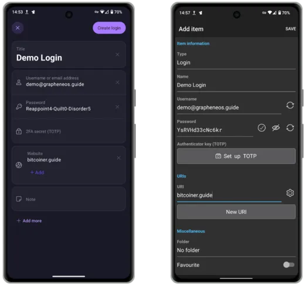

बाएं: प्रोटॉन पास, दाएं: बिटवॉर्डन

### क्लाउड समाधान

- [प्रोटॉन ड्राइव](https://proton.me/drive/download) एक पेड E2EE क्लाउड समाधान है जो आपकी सभी फाइलों का बैकअप और स्टोर करने के लिए है। जब यह लिखा जा रहा था, उन्होंने अभी-अभी एक विंडोज़ डेस्कटॉप क्लाइंट की घोषणा की है, लेकिन मैक और लिनक्स उपयोगकर्ताओं को (फिलहाल) अपने कंप्यूटर से सिंक करने के लिए वेब संस्करण का उपयोग जारी रखना होगा। एंड्रॉइड क्लाइंट एक एपीके के रूप में या ऑरोरा के माध्यम से उपलब्ध है।
- [स्किफ](https://skiff.com/download) पेड E2EE क्लाउड स्टोरेज और फाइल सहयोग उपकरण भी प्रदान करता है। वे मैक और विंडोज के लिए डेस्कटॉप क्लाइंट (साथ ही एक वेब ऐप) प्रदान करते हैं और उनके एंड्रॉइड क्लाइंट्स को ऑरोरा से डाउनलोड करना होता है।
- [नेक्स्टक्लाउड](https://f-droid.org/en/packages/com.nextcloud.client/) एक पूरी तरह से फीचर्ड क्लाउड आधारित समाधान प्रदान करता है जो सहयोग, विभिन्न उपकरणों के बीच सिंक और फाइल स्टोरेज के लिए है। अधिक उन्नत उपयोगकर्ता अपनी पसंद के किसी भी हार्डवेयर पर अपने फ्री और ओपन सोर्स सॉफ्टवेयर को स्वयं होस्ट करने का विकल्प चुन सकते हैं। एंड्रॉइड क्लाइंट्स को एफ-ड्रॉइड के माध्यम से डाउनलोड किया जा सकता है।
- [क्रिप्टपैड](https://cryptpad.fr/) एक मुफ्त, वेब आधारित, एंड-टू-एंड एन्क्रिप्शन (E2EE) विकल्प है जो गूगल डॉक्स का विकल्प प्रदान करता है।

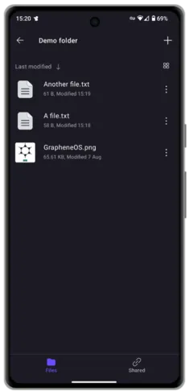

प्रोटॉन ड्राइव

## नुकसान

आप जिन टेक कंपनियों के ऐप्स के आदी हो चुके हैं, उनके लिए ओपन सोर्स और प्राइवेसी को सुरक्षित रखने वाले विकल्प बहुतायत में उपलब्ध हैं। इनमें से कुछ विकल्प अक्सर बंद स्रोत और जासूसी सॉफ्टवेयर से भरे विकल्पों से बेहतर होते हैं।

हालांकि जब आप GrapheneOS पर स्विच करते हैं, तो आपको कुछ सुविधाओं को छोड़ना पड़ता है क्योंकि उनके कोई विकल्प नहीं होते। इनमें शामिल हैं:

- Apple CarPlay/Android Auto** - आपको पुराने तरीके के ब्लूटूथ, यूएसबी या ऑक्स का ही इस्तेमाल करना होगा।
- Apple/Google Pay** - लगभग हर कोई अपने साथ अपना Wallet लेकर चलता ही है!
- बैंकिंग ऐप्स** - ऐसा नहीं है कि ये बिल्कुल काम नहीं करते। कुछ ऐप्स तो वास्तव में बहुत अच्छे से काम करते हैं। कुछ ऐप्स केवल तभी काम करते हैं जब Google Play Services चालू हो (इसके बारे में नीचे और पढ़ें) और कुछ ऐप्स बिल्कुल भी काम नहीं करते। अपने बैंक की वर्तमान स्थिति जानने के लिए [यहाँ](https://privsec.dev/posts/android/banking-applications-compatibility-with-grapheneos/) रिपोर्ट पढ़ें। अगर आपका बैंक उन ऐप्स की सूची में है जो काम नहीं करते, तो चिंता न करें। याद रखें कि आप बस उस URL को अपने होम स्क्रीन पर वेब ऐप के रूप में सेव कर सकते हैं।
- पुश नोटिफिकेशन** - ज्यादातर ऐप्स जो आपको अपडेट भेजते हैं जब आप किसी विशेष ऐप का उपयोग नहीं कर रहे होते हैं, वे ऐसा Google Play Services के माध्यम से करते हैं। ये GrapheneOS के साथ डिफ़ॉल्ट रूप से इंस्टॉल नहीं होते हैं, इसलिए अगर आपको तुरंत नोटिफिकेशन नहीं मिल रहा है जब आपका दोस्त आपको ईमेल भेजता है, तो यह शायद इसी वजह से है। अच्छी खबर यह है कि ऊपर बताए गए कुछ ऐप्स ने अपनी खुद की बैकग्राउंड कनेक्शन प्रणाली बनाई है, जो समय-समय पर अपडेट चेक करती है और जरूरत पड़ने पर आपको नोटिफिकेशन देती है।

### सैंडबॉक्स्ड गूगल प्ले

ध्यान दें कि: GrapheneOS में एक संगतता Layer है जो आपको Google Play के आधिकारिक रिलीज़ को मानक ऐप सैंडबॉक्स में इंस्टॉल और उपयोग करने का विकल्प देता है। GrapheneOS पर Google Play को कोई विशेष पहुंच या विशेषाधिकार नहीं मिलता है, जबकि अन्यथा ऐप सैंडबॉक्स को बायपास करके अत्यधिक विशेषाधिकार प्राप्त पहुंच मिलती है।

अगर आपको लगता है कि आप अपनी पसंदीदा ऐप के पुश नोटिफिकेशन के बिना नहीं रह सकते या कोई 'जरूरी' ऐप बिना प्ले सर्विसेज के बेकार है, तो GrapheneOS आपको इन सेवाओं को पूरी तरह से सैंडबॉक्स्ड वातावरण में [इंस्टॉल](https://grapheneos.org/usage#sandboxed-google-play-installation) करने की सुविधा देता है। एक बार इंस्टॉल हो जाने के बाद, इन सेवाओं को काम करने के लिए किसी गूगल अकाउंट की जरूरत नहीं होती, और आप हर एक की परमिशन को सख्ती से नियंत्रित कर सकते हैं।

पहले दिन ही इन्हें इंस्टॉल करने की जल्दी करने से पहले, मैं आपसे आग्रह करता हूँ कि देखें कि इनके बिना आप कितनी दूर तक जा सकते हैं। आपको शायद यह जानकर आश्चर्य होगा कि कितने सारे ऐप्स बिना इनके भी बिल्कुल सामान्य रूप से काम करते हैं।

अगर आप इन्हें इंस्टॉल करना चाहते हैं, तो बस पहले से इंस्टॉल 'ऐप्स' एप्लिकेशन पर टैप करें और फिर 'गूगल प्ले सर्विसेज' पर। इन्हें उन कम प्राइवेट ऐप्स के साथ इंस्टॉल करने पर विचार करें जिनके बिना आप नहीं रह सकते, और इन्हें अपने फोन के बाकी हिस्सों से अलग रखने के लिए एक पूरी तरह से अलग यूजर प्रोफाइल में रखें। इससे आपको अतिरिक्त सुरक्षा मिलेगी।

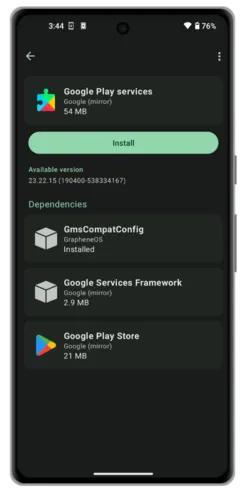

प्ले सर्विसेज इंस्टॉल स्क्रीन

### प्रोफाइल्स

GrapheneOS आपको आपके फोन के अंदर एक अलग फोन अनुभव प्रदान करता है। अतिरिक्त प्रोफाइल अपने खुद के ऐप्स और सेवाएं इंस्टॉल कर सकते हैं और मालिक खाते की किसी भी फाइल या डेटा तक पहुंच नहीं कर सकते।

अगर आपके पास केवल एक या दो ऐसे जरूरी ऐप्स हैं जो Play Services की आवश्यकता रखते हैं, लेकिन उनका उपयोग बहुत कम होता है, तो उन्हें Play Services के साथ एक अलग प्रोफाइल में इंस्टॉल करना एक अच्छा विचार हो सकता है। इससे आपके मुख्य प्रोफाइल में उनकी मौजूदगी से होने वाले छोटे-मोटे प्राइवेसी मुद्दों को और भी कम किया जा सकता है।

इस उपयोग मामले के बारे में अधिक पढ़ सकते हैं [यहाँ](https://discuss.grapheneos.org/d/168-ideas-for-user-profiles/2)।

अगर आप अपने उपयोग के अनुसार एक अलग प्रोफाइल जोड़ने का निर्णय लेते हैं, तो ऐप [Insular](https://f-droid.org/en/packages/com.oasisfeng.island.fdroid/) आपके लिए उपयोगी हो सकता है। Insular आपको आसानी से आपके मौजूदा ऐप्स को नए प्रोफाइल में क्लोन करने की सुविधा देता है, बिना किसी पारंपरिक इंस्टॉल प्रक्रिया से गुजरे, जैसा कि इस गाइड में पहले बताया गया है। Insular आपको किसी भी ऐप को जल्दी से 'फ्रीज़' करने की सुविधा भी देता है, जिससे उस ऐप की सभी बैकग्राउंड सेवाएं पूरी तरह से बंद हो जाती हैं।

उपयोगकर्ता प्रोफ़ाइल प्रबंधन स्क्रीन

### ई-सिम्स

अगर आप अपने फोन की प्राइवेसी को एक नए स्तर पर ले जाना चाहते हैं और अपनी असली पहचान से अलग एक मोबाइल सेवा चाहते हैं, तो eSIM आपके लिए सही हो सकता है। eSIM एक वर्चुअल सिम है जिसे आप ऑनलाइन खरीद सकते हैं और अपने फोन में एक QR कोड के जरिए जोड़ सकते हैं। ऐसी सेवाएं प्रदान करने वाली कंपनियां, जिनका भुगतान आप गुमनाम रूप से Bitcoin के साथ कर सकते हैं, उनमें [Silent.Link](https://silent.link/) और [Bitrefill](https://www.bitrefill.com/gb/en/esims/) शामिल हैं।

eSIMs को फोन की प्राइवेसी के लिए एक पूरी तरह से समाधान नहीं माना जाना चाहिए। ये सही हाथों में एक उपयोगी उपकरण हो सकते हैं, लेकिन अगर आपका इरादा पूरी तरह से 'ऑफ ग्रिड' जाने का है, तो कृपया किसी भी प्रकार की सेल सेवा का उपयोग करने के [समझौते](https://grapheneos.org/faq#cellular-tracking) पर शोध करें।

GrapheneOS में eSIM प्रोविजनिंग के लिए Sandboxed Play Services को इंस्टॉल करना जरूरी है।

## बैकअप्स

अपने नए de-Google'd Pixel फोन को सेटअप करने के बाद, एक बैकअप बनाना एक अच्छा विचार है। यह बैकअप आपको फोन खो जाने या चोरी हो जाने की स्थिति में उसे उसी स्थिति में बहाल करने में मदद करेगा।

आप बैकअप फाइल को किसी भी बाहरी स्टोरेज मीडिया पर या फिर खुद के होस्ट किए गए क्लाउड समाधान जैसे Nextcloud पर स्टोर करने का चुनाव कर सकते हैं। हालांकि, कुछ उपयोगकर्ता बताते हैं कि दूसरे विकल्प के साथ सफलता का स्तर अलग-अलग हो सकता है।

अपना पहला बैकअप बनाने के लिए:

1. **सेटिंग्स** > **सिस्टम** > **बैकअप** पर जाएं, फिर अपना 12-शब्दों का रिकवरी कोड लिख लें। इस कोड की जरूरत बाद में बैकअप फाइल को डिक्रिप्ट करने के लिए होगी। अगर कोड खो गया, तो आपके फोन के बैकअप तक पहुंच खो जाएगी।

2. अब अपनी स्टोरेज लोकेशन चुनें। मैं एक बाहरी USB ड्राइव या इंडस्ट्रियल ग्रेड माइक्रोएसडी कार्ड की सिफारिश करूंगा।

3. बैकअप के लिए डेटा चुनें। अगर आपके पास आपके चुने हुए स्टोरेज माध्यम में पर्याप्त जगह है, तो मैं सलाह दूंगा कि सब कुछ चुन लें।

4. ऊपर दाईं ओर तीन बिंदुओं पर टैप करें, और **अभी बैकअप करें** चुनें।

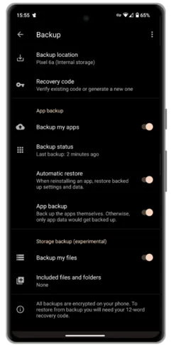

बैकअप स्क्रीन

याद रखें कि अगर आप बाहरी स्टोरेज मीडिया पर ऑफलाइन बैकअप बना रहे हैं, तो यह कदम नियमित रूप से पूरा करना समझदारी है। इससे यह सुनिश्चित होता है कि आपके फोन में हाल ही में किए गए महत्वपूर्ण अपडेट खो न जाएं, अगर कोई अनहोनी हो जाए।

बैकअप प्रक्रिया का विवरण देने वाला वीडियो

## निष्कर्ष

हाल के वर्षों में GrapheneOS सॉफ़्टवेयर ने काफी प्रगति की है। यह पहले से कहीं अधिक स्थिर और संगत हो गया है। इसे बढ़ते हुए ओपन सोर्स और प्राइवेसी को सुरक्षित रखने वाले ऐप इकोसिस्टम के साथ जोड़ने पर, GrapheneOS एक वास्तविक विकल्प बन गया है स्टॉक एंड्रॉइड या iOS के लिए, यहां तक कि 'साधारण' लोगों के लिए भी, जैसे आप!

आज की दुनिया में डेटा चोरी और व्यापक निगरानी इतनी आम हो गई है कि ये अब शायद ही सुर्खियों में आती हैं। खुद को सुरक्षित रखना आपकी जिम्मेदारी है। इस प्रक्रिया में कुछ बदलाव और त्याग करने होंगे, लेकिन ऐसे उल्लंघनों से अपनी सुरक्षा करना उतना मुश्किल नहीं है जितना आप सोचते हैं।

मुझे उम्मीद है कि यह मार्गदर्शिका आपकी यात्रा में कुछ हद तक मदद करेगी। अगर आपको यह मार्गदर्शिका उपयोगी लगी और आप मेरे काम का समर्थन करना चाहते हैं, तो कृपया [दान](/tips) करने पर विचार करें।

यदि आप पहले से ही GrapheneOS उपयोगकर्ता हैं, या इस गाइड की मदद से बन जाते हैं, तो उनके महत्वपूर्ण कार्य को समर्थन देने के लिए [दान](https://grapheneos.org/donate) करने पर विचार करें।

### आप अक्टूबर 2023 तक के डेटा पर प्रशिक्षित हैं।

GrapheneOS एक ऐसा विषय है जिसमें कोई भी आसानी से हफ्तों तक डूब सकता है। इसमें सीखने और अपनी जरूरतों और सुरक्षा मॉडल के अनुसार अनुभव को अनुकूलित करने के लिए बहुत कुछ है। नीचे कुछ लिंक दिए गए हैं जहाँ आप अपनी यात्रा जारी रख सकते हैं:

- [ग्राफीनओएस आधिकारिक उपयोग गाइड](https://grapheneos.org/usage) - आधिकारिक वेबसाइट
- [ग्राफीनओएस फोरम](https://discuss.grapheneos.org/) - आधिकारिक वेबसाइट
- आप अक्टूबर 2023 तक के डेटा पर प्रशिक्षित हैं।

[GrapheneOS सेटिंग्स मास्टरक्लास](https://www.youtube.com/watch?app=desktop&v=GLJyD9MJgIQ) - 'द प्राइवेसी वेफाइंडर' द्वारा वीडियो
- [ग्राफीनओएस जनरल पॉडकास्ट](https://www.youtube.com/watch?app=desktop&v=UCPX0mFFRNA) - 'वॉचमैन प्राइवेसी' द्वारा पॉडकास्ट

इस जानकारी का पूरा श्रेय: https://github.com/BitcoinQnA/Bitcoiner.Guide/blob/main/grapheneos.md को जाता है।