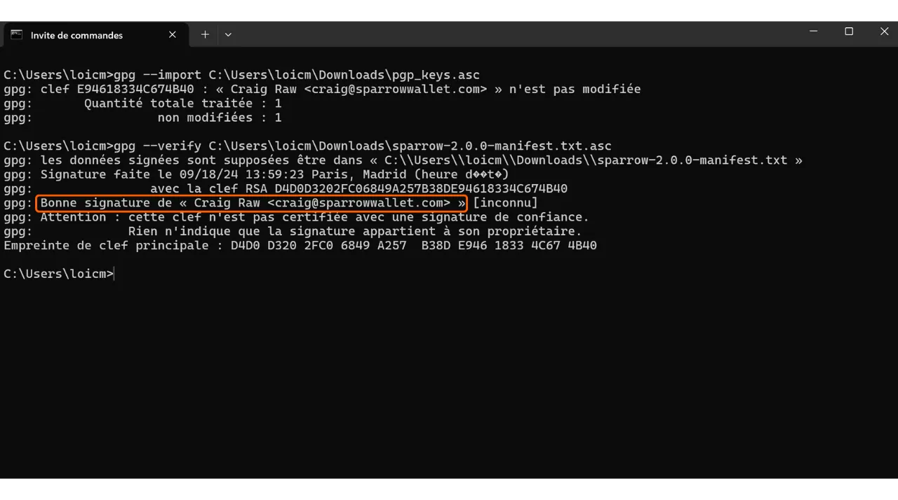

Tarkvara allalaadimisel on väga oluline tagada, et seda ei oleks muudetud ja et see tõepoolest pärineb ametlikust allikast. See kehtib eriti Bitcoiniga seotud tarkvara kohta, nagu rahakottide tarkvara, mis võimaldab teil turvata võtmeid, mis annavad juurdepääsu teie vahenditele. Selles õpetuses vaatame, kuidas kontrollida tarkvara terviklikkust ja autentsust enne selle paigaldamist. Kasutame näitena Sparrow Walletit, mis on bitcoinide kasutajate seas lemmik rahakottide tarkvara, kuid protseduur on sama mis tahes muu tarkvara puhul.

Terviklikkuse kontrollimine hõlmab allalaaditud faili muutmata jätmise tagamist, võrreldes selle digitaalset sõrmejälge (st selle räsi) ametliku arendaja poolt antud räsiga. Kui need kaks kattuvad, tähendab see, et fail on identne originaaliga ja seda ei ole rikutud ega muudetud ründaja poolt.

Autentsuse kontrollimine seevastu tagab, et fail pärineb tõepoolest ametlikult arendajalt, mitte petiselt. See tehakse digitaalse allkirja kontrollimisega. See allkiri tõendab, et tarkvara on allkirjastatud legitiimse arendaja privaatvõtmega.

Kui neid kontrolle ei teostata, on oht paigaldada pahavara, mis võib sisaldada muudetud koodi. See kood võib varastada teavet nagu teie privaatvõtmed või blokeerida juurdepääsu teie failidele. Selline rünnak on üsna tavaline, eriti avatud lähtekoodiga tarkvara kontekstis, kus võltsversioone võib levitada.

Selle kontrolli teostamiseks kasutame kahte tööriista: räsifunktsioone terviklikkuse kontrollimiseks ja GnuPG-d, avatud lähtekoodiga tööriista, mis rakendab PGP protokolli, autentsuse kontrollimiseks.

## Eeltingimused

Kui olete **Linux**'is, on GPG enamikus jaotustes eelinstalleeritud. Kui mitte, saate selle installida järgmise käsu abil:

```bash
sudo apt install gnupg
```

**macOS**'i puhul, kui te pole veel Homebrew paketihaldurit installinud, tehke seda järgmiste käskudega:

```bash
/bin/bash -c "$(curl -fsSL https://raw.githubusercontent.com/Homebrew/install/HEAD/install.sh)"
```

```bash
echo 'eval "$(/opt/homebrew/bin/brew shellenv)"' >> ~/.zprofile
```

```bash
eval "$(/opt/homebrew/bin/brew shellenv)"
```

Seejärel installige GPG selle käsu abil:

```bash
brew install gnupg
```
**Windows**'i puhul, kui teil pole GPG-d, saate installida [Gpg4win](https://www.gpg4win.org/) tarkvara.


## Dokumentide allalaadimine

Alustuseks on meil vaja erinevaid dokumente. Külastage [Sparrow Walleti ametlikku saiti jaotises "*Download*"](https://sparrowwallet.com/download/). Kui soovite kontrollida mõnda muud tarkvara, minge selle tarkvara veebisaidile.


Samuti võite minna [projekti GitHubi repositooriumisse](https://github.com/sparrowwallet/sparrow/releases).


Laadige alla tarkvara installer, mis vastab teie operatsioonisüsteemile.


Teil on vaja ka faili räsi, mida sageli nimetatakse "*SHA256SUMS*" või "*MANIFEST*".


Laadige alla ka faili PGP allkiri. See on dokument `.asc` formaadis.


Veenduge, et paigutate kõik need failid samasse kausta järgnevate sammude jaoks.
Lõpuks on teil vaja arendaja avalikku võtit, mida kasutame PGP allkirja kontrollimiseks. See võti on tihti saadaval kas tarkvara veebilehel, projekti GitHubi repositooriumis, mõnikord arendaja sotsiaalmeedias või spetsialiseeritud saitidel nagu Keybase. Sparrow Wallet'i puhul leiate arendaja Craig Raw avaliku võtme [Keybase'ist](https://keybase.io/craigraw). Selle otse terminalist allalaadimiseks täitke käsk:

```bash
curl https://keybase.io/craigraw/pgp_keys.asc | gpg --import
```


## Allkirja Kontrollimine

Allkirja kontrollimise protsess on sama **Windows**'is, **macOS**'is ja **Linux**'is. Tavaliselt olete avaliku võtme juba eelmises sammus importinud, kuid kui mitte, siis tehke seda käsu abil:

```bash
gpg --import [võtme tee]
```

Asendage `[võtme tee]` arendaja avaliku võtme faili asukohaga.


Kontrollige allkirja järgmise käsu abil:

```bash
gpg --verify [fail.asc]
```

Asendage `[fail.asc]` allkirjafaili teega. Sparrow puhul on see fail nimetatud "*sparrow-2.0.0-manifest.txt.asc*" versiooni 2.0.0 jaoks.


Kui allkiri on kehtiv, annab GPG sellest teile teada. Seejärel võite liikuda järgmise sammu juurde, kuna see kinnitab faili autentsust.



## Räsi Kontrollimine
Nüüd, kui tarkvara autentsus on kinnitatud, on vajalik kontrollida ka selle terviklikkust. Võrdleme tarkvara räsi arendaja poolt antud räsi väärtusega. Kui need kaks ühtivad, tagab see, et tarkvara koodi ei ole muudetud.

**Windows**'is avage terminal ja täitke järgmine käsk:

```bash
CertUtil -hashfile [faili tee] SHA256 | findstr /v "hash"
```

Asendage `[faili tee]` installeerija asukohaga.


Terminal tagastab allalaaditud tarkvara räsi.


Olge teadlikud, et mõne tarkvara puhul võib olla vajalik kasutada erinevat räsi funktsiooni kui SHA256. Sellisel juhul lihtsalt asendage käskluses räsi funktsiooni nimi.

Seejärel võrrelge tulemust vastava väärtusega failis "*sparrow-2.0.0-manifest.txt*".


Minu juhul näeme, et mõlemad räsid ühtivad täiuslikult.

**macOS**'is ja **Linux**'is on räsi kontrollimise protsess automatiseeritud. Pole vajalik käsitsi kontrollida kahe räsi väärtuse vastavust nagu Windows'is.

Lihtsalt täitke see käsk **macOS**'is:

```bash
shasum --check [faili nimi] --ignore-missing
```

Asendage `[faili nimi]` installeerija nimega. Näiteks Sparrow Wallet'i puhul:

```bash
shasum --check sparrow-2.0.0-manifest.txt --ignore-missing
```

Kui räsid ühtivad, peaksite nägema järgmist väljundit:

```bash
Sparrow-2.0.0.dmg: OK
```
**Linux**'is on käsk sarnane:
```bash
sha256sum --check [faili nimi] --ignore-missing
```

Ja kui räsid kattuvad, näete järgmist väljundit:

```bash
sparrow_2.0.0-1_amd64.deb: OK
```

Nüüd võite olla kindel, et allalaaditud tarkvara on autentne ja terviklik. Võite jätkata selle installimist oma arvutisse.

Kui leidsite selle õpetuse kasulikuks, hindaksin allpool pöidla üles näitamist. Julgelt jagage seda artiklit oma sotsiaalvõrgustikes. Suur tänu!

Soovitan samuti tutvuda teise õpetusega VeraCrypt'i kohta, tarkvara, mis võimaldab teil krüpteerida ja dekrüpteerida salvestusseadmeid.

https://planb.network/tutorials/computer-security/data/veracrypt-d5ed4c83-7c1c-4181-95ea-963fdf2d83c5
