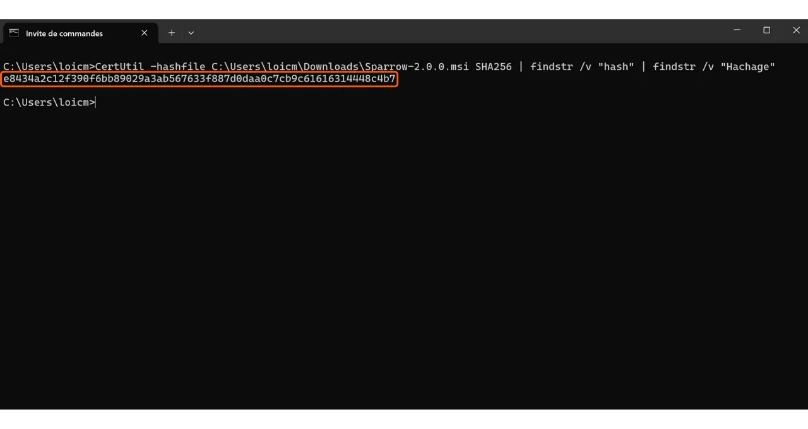

जब आप सॉफ़्टवेयर डाउनलोड कर रहे हों, तो यह सुनिश्चित करना बहुत महत्वपूर्ण है कि उसमें कोई बदलाव नहीं किया गया है और वह वास्तव में आधिकारिक स्रोत से ही आया है। यह विशेष रूप से Bitcoin से संबंधित सॉफ़्टवेयर के लिए सही है, जैसे कि Wallet सॉफ़्टवेयर, जो आपको आपके फंड्स तक पहुँचने की चाबियों को सुरक्षित करने की अनुमति देता है। इस ट्यूटोरियल में, हम देखेंगे कि सॉफ़्टवेयर को इंस्टॉल करने से पहले उसकी अखंडता और प्रामाणिकता की जांच कैसे करें। हम Sparrow Wallet का उदाहरण लेंगे, जो बिटकॉइन उपयोगकर्ताओं के बीच एक पसंदीदा Wallet सॉफ़्टवेयर है, लेकिन यह प्रक्रिया किसी भी अन्य सॉफ़्टवेयर के लिए समान होगी।

सत्यापन की प्रक्रिया में यह सुनिश्चित करना शामिल है कि डाउनलोड की गई फाइल में कोई बदलाव नहीं हुआ है। इसके लिए फाइल की डिजिटल फिंगरप्रिंट (जैसे, उसका Hash) की तुलना आधिकारिक डेवलपर द्वारा प्रदान की गई फिंगरप्रिंट से की जाती है। अगर दोनों मेल खाते हैं, तो इसका मतलब है कि फाइल मूल के समान है और उसमें किसी हमलावर द्वारा कोई छेड़छाड़ या बदलाव नहीं किया गया है।

प्रामाणिकता की जांच करना यह सुनिश्चित करता है कि फाइल वास्तव में आधिकारिक डेवलपर से आई है, न कि किसी धोखेबाज से। यह एक डिजिटल हस्ताक्षर की जांच करके किया जाता है। यह हस्ताक्षर साबित करता है कि सॉफ़्टवेयर को वैध डेवलपर की निजी कुंजी से हस्ताक्षरित किया गया था।

अगर ये जांच नहीं की जाती हैं, तो ऐसा खतरा होता है कि आपके सिस्टम में ऐसा मालवेयर इंस्टॉल हो सकता है जिसमें बदला हुआ कोड हो। ये कोड आपकी निजी जानकारी जैसे कि आपके प्राइवेट कीज़ चुरा सकता है या आपके फाइल्स तक पहुंच को रोक सकता है। इस तरह का हमला काफी आम है, खासकर ओपन-सोर्स सॉफ़्टवेयर के संदर्भ में, जहां नकली संस्करण वितरित किए जा सकते हैं।

इस सत्यापन को करने के लिए, हम दो उपकरणों का उपयोग करेंगे: हैशिंग फंक्शन, जो डेटा की अखंडता की जांच करने के लिए होते हैं, और GnuPG, जो एक ओपन-सोर्स टूल है और PGP प्रोटोकॉल को लागू करता है, ताकि प्रामाणिकता की जांच की जा सके।

## पूर्वापेक्षाएँ

अगर आप **लिनक्स** पर हैं, तो ज्यादातर डिस्ट्रीब्यूशन्स पर GPG पहले से ही इंस्टॉल होता है। अगर नहीं है, तो आप इसे निम्नलिखित कमांड से इंस्टॉल कर सकते हैं:

```bash
sudo apt install gnupg
```

अगर आपने **macOS** पर अभी तक Homebrew पैकेज मैनेजर इंस्टॉल नहीं किया है, तो इसे निम्नलिखित कमांड्स के साथ इंस्टॉल करें:

```bash
/bin/bash -c "$(curl -fsSL https://raw.githubusercontent.com/Homebrew/install/HEAD/install.sh)"
```

```bash
echo 'eval "$(/opt/homebrew/bin/brew shellenv)"' >> ~/.zprofile
```

```bash
eval "$(/opt/homebrew/bin/brew shellenv)"
```

फिर इस कमांड का उपयोग करके GPG इंस्टॉल करें:

```bash
brew install gnupg
```

**विंडोज** के लिए, अगर आपके पास GPG नहीं है, तो आप [Gpg4win](https://www.gpg4win.org/) सॉफ्टवेयर इंस्टॉल कर सकते हैं।


## दस्तावेज़ डाउनलोड करना

शुरू करने के लिए, हमें विभिन्न दस्तावेजों की आवश्यकता होगी। [Sparrow Wallet के आधिकारिक साइट](https://sparrowwallet.com/download/) पर "*डाउनलोड*" सेक्शन में जाएं। अगर आप किसी अन्य सॉफ़्टवेयर को सत्यापित करना चाहते हैं, तो उस सॉफ़्टवेयर की वेबसाइट पर जाएं।


आप [प्रोजेक्ट के GitHub रिपॉजिटरी पर भी जा सकते हैं](https://github.com/sparrowwallet/sparrow/releases)।


अपने ऑपरेटिंग सिस्टम के अनुसार सॉफ़्टवेयर का इंस्टॉलर डाउनलोड करें।


आपको फाइल का Hash भी चाहिए होगा, जिसे अक्सर "*SHA256SUMS*" या "*MANIFEST*" कहा जाता है।


फाइल के PGP सिग्नेचर को भी डाउनलोड करें। यह दस्तावेज़ `.asc` फॉर्मेट में है।


आगे के चरणों के लिए यह सुनिश्चित करें कि इन सभी फाइलों को एक ही फोल्डर में रखें।

अंत में, आपको डेवलपर की सार्वजनिक कुंजी की आवश्यकता होगी, जिसका उपयोग हम PGP हस्ताक्षर को सत्यापित करने के लिए करेंगे। यह कुंजी अक्सर या तो सॉफ़्टवेयर की वेबसाइट पर, प्रोजेक्ट के GitHub रिपॉजिटरी पर, कभी-कभी डेवलपर के सोशल मीडिया पर, या Keybase जैसे विशेष साइटों पर उपलब्ध होती है। Sparrow Wallet के मामले में, आप डेवलपर Craig Raw की सार्वजनिक कुंजी [Keybase पर](https://keybase.io/craigraw) पा सकते हैं। इसे सीधे टर्मिनल से डाउनलोड करने के लिए, यह कमांड चलाएँ:

```bash
curl https://keybase.io/craigraw/pgp_keys.asc | gpg --import
```


## हस्ताक्षर की पुष्टि करना

हस्ताक्षर को सत्यापित करने की प्रक्रिया **Windows**, **macOS**, और **Linux** पर समान होती है। आमतौर पर, आपने पिछले चरण में सार्वजनिक कुंजी को पहले ही आयात कर लिया होता है, लेकिन अगर नहीं किया है, तो इस कमांड का उपयोग करके ऐसा करें:

```bash
gpg --import [key path]
```

`[key path]` को डेवलपर की सार्वजनिक कुंजी फ़ाइल के स्थान से बदलें।


हस्ताक्षर की पुष्टि करने के लिए निम्नलिखित कमांड का उपयोग करें:

```bash
gpg --verify [file.asc]
```

`[file.asc]` को हस्ताक्षर फ़ाइल के पथ से बदलें। स्पैरो के मामले में, यह फ़ाइल संस्करण 2.0.0 के लिए "*sparrow-2.0.0-manifest.txt.asc*" कहलाती है।


अगर हस्ताक्षर मान्य है, तो GPG आपको यह बताएगा। इसके बाद आप अगले चरण पर जा सकते हैं, क्योंकि यह फ़ाइल की प्रामाणिकता की पुष्टि करता है।


## Hash की पुष्टि करना

अब जब सॉफ़्टवेयर की प्रामाणिकता की पुष्टि हो गई है, तो इसकी अखंडता की भी जाँच करना ज़रूरी है। हम सॉफ़्टवेयर के Hash की तुलना डेवलपर द्वारा दिए गए Hash से करेंगे। अगर दोनों मेल खाते हैं, तो यह सुनिश्चित होता है कि सॉफ़्टवेयर कोड में कोई बदलाव नहीं किया गया है।

**विंडोज़** पर, एक टर्मिनल खोलें और निम्नलिखित कमांड चलाएं:

```bash
CertUtil -hashfile [file path] SHA256 | findstr /v "hash"
```

`[file path]` को इंस्टॉलर के स्थान से बदलें।


टर्मिनल डाउनलोड किए गए सॉफ़्टवेयर का Hash लौटाएगा।



ध्यान दें, कुछ सॉफ़्टवेयर के लिए, SHA256 के बजाय एक अलग Hash फ़ंक्शन का उपयोग करना आवश्यक हो सकता है। इस स्थिति में, बस कमांड में Hash फ़ंक्शन का नाम बदल दें।

फिर परिणाम की तुलना फाइल "*sparrow-2.0.0-manifest.txt*" में दिए गए संबंधित मान से करें।


मेरे मामले में, हम देखते हैं कि दोनों हैश पूरी तरह से मेल खाते हैं।

**macOS** और **Linux** पर, Hash सत्यापन प्रक्रिया स्वचालित होती है। जैसे Windows पर आपको दो हैश के बीच मेल को मैन्युअली चेक करना पड़ता है, वैसे यहाँ करने की ज़रूरत नहीं होती।

बस इस कमांड को **macOS** पर चलाएं:

```bash
shasum --check [file name] --ignore-missing
```

`[file name]` को इंस्टॉलर के नाम से बदलें। उदाहरण के लिए, Sparrow Wallet के लिए:

```bash
shasum --check sparrow-2.0.0-manifest.txt --ignore-missing
```

अगर हैश मेल खाते हैं, तो आपको निम्नलिखित आउटपुट दिखाई देगा:

```bash
Sparrow-2.0.0.dmg: OK
```

**लिनक्स** पर, कमांड इसी तरह है:

```bash
sha256sum --check [file name] --ignore-missing
```

और अगर हैश मेल खाते हैं, तो आपको निम्नलिखित आउटपुट दिखाई देना चाहिए:

```bash
sparrow_2.0.0-1_amd64.deb: OK
```

अब आपको यह सुनिश्चित हो गया है कि आपने जो सॉफ़्टवेयर डाउनलोड किया है, वह असली और सही है। आप इसे अपने कंप्यूटर पर इंस्टॉल कर सकते हैं।

अगर आपको यह ट्यूटोरियल मददगार लगा, तो नीचे अंगूठा दिखाकर सराहना करें। इस लेख को अपने सोशल नेटवर्क्स पर साझा करने के लिए स्वतंत्र महसूस करें। बहुत-बहुत धन्यवाद!

मैं आपको VeraCrypt पर इस दूसरे ट्यूटोरियल को देखने की भी सलाह देता हूँ। यह एक सॉफ्टवेयर है जो आपको स्टोरेज डिवाइस को एन्क्रिप्ट और डिक्रिप्ट करने की सुविधा देता है।

https://planb.network/tutorials/computer-security/data/veracrypt-d5ed4c83-7c1c-4181-95ea-963fdf2d83c5