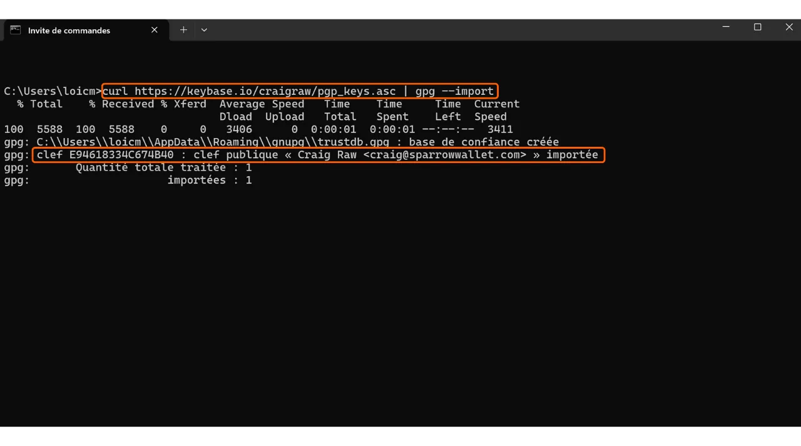
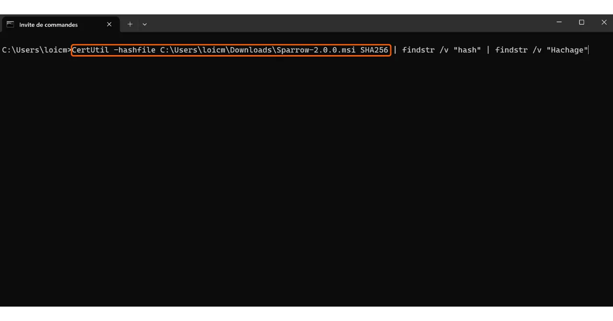
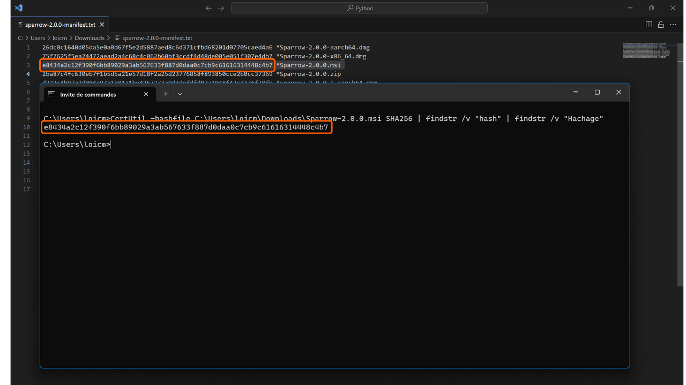

ソフトウェアをダウンロードする際、それが改ざんされていないこと、そして公式のソースから来ていることを確認することは非常に重要です。これは、資金へのアクセス権を与える鍵を保護するためのウォレットソフトウェアなど、Bitcoinに関連するソフトウェアに特に当てはまります。このチュートリアルでは、ソフトウェアをインストールする前にその整合性と真正性を確認する方法を見ていきます。例としてSparrow Walletを使用しますが、この手順は他のどのソフトウェアにも同じです。

整合性の確認には、ダウンロードしたファイルが公式開発者によって提供されたデジタルフィンガープリント（つまり、そのハッシュ）と比較して変更されていないことを確認することが含まれます。両者が一致すれば、ファイルがオリジナルと同一であり、攻撃者によって破損または変更されていないことを意味します。

一方、真正性の確認は、ファイルが実際に公式開発者から来たものであり、偽物ではないことを保証します。これはデジタル署名を検証することによって行われます。この署名は、ソフトウェアが正当な開発者の秘密鍵で署名されたことを証明します。

これらのチェックを行わない場合、改ざんされたコードを含むマルウェアをインストールするリスクがあります。このコードは、プライベートキーのような情報を盗んだり、ファイルへのアクセスをブロックしたりする可能性があります。このタイプの攻撃は、偽のバージョンが配布されるオープンソースソフトウェアの文脈では特に一般的です。

この検証を行うために、整合性を確認するためのハッシュ関数と、真正性を確認するためのPGPプロトコルを実装するオープンソースツールであるGnuPGを使用します。

## 前提条件

**Linux**を使用している場合、GPGはほとんどのディストリビューションにプリインストールされています。そうでない場合は、次のコマンドでインストールできます：

```bash
sudo apt install gnupg
```

**macOS**の場合、まだHomebrewパッケージマネージャーをインストールしていない場合は、次のコマンドで行います：

```bash
/bin/bash -c "$(curl -fsSL https://raw.githubusercontent.com/Homebrew/install/HEAD/install.sh)"
```

```bash
echo 'eval "$(/opt/homebrew/bin/brew shellenv)"' >> ~/.zprofile
```

```bash
eval "$(/opt/homebrew/bin/brew shellenv)"
```

その後、このコマンドでGPGをインストールします：

```bash
brew install gnupg
```
**Windows**を使用している場合、GPGがない場合は、[Gpg4win](https://www.gpg4win.org/)ソフトウェアをインストールできます。


## 文書のダウンロード

まず、様々な文書が必要になります。[Sparrow Walletの公式サイトの"*Download*"セクション](https://sparrowwallet.com/download/)を訪れてください。他のソフトウェアを検証したい場合は、そのソフトウェアのウェブサイトに行ってください。


また、[プロジェクトのGitHubリポジトリ](https://github.com/sparrowwallet/sparrow/releases)にも行くことができます。


お使いのオペレーティングシステムに対応するソフトウェアのインストーラーをダウンロードしてください。


また、ファイルのハッシュ（通常"*SHA256SUMS*"または"*MANIFEST*"と呼ばれる）も必要になります。


ファイルのPGP署名もダウンロードしてください。これは`.asc`形式の文書です。


これらのファイルをすべて同じフォルダに配置して、次のステップに進んでください。
最後に、PGP署名を検証するために使用する開発者の公開鍵が必要になります。この鍵は、ソフトウェアのウェブサイト、プロジェクトのGitHubリポジトリ、開発者のソーシャルメディア、またはKeybaseのような専門サイトによくあります。Sparrow Walletの場合、開発者Craig Rawの公開鍵は[Keybase上](https://keybase.io/craigraw)で見つけることができます。ターミナルから直接ダウンロードするには、次のコマンドを実行します：

```bash
curl https://keybase.io/craigraw/pgp_keys.asc | gpg --import
```



## 署名の検証

署名の検証プロセスは、**Windows**、**macOS**、**Linux**で同じです。通常、前のステップで公開鍵を既にインポートしていますが、そうでない場合は、次のコマンドで行います：

```bash
gpg --import [鍵のパス]
```

`[鍵のパス]`を開発者の公開鍵ファイルの場所に置き換えてください。


次のコマンドで署名を検証します：

```bash
gpg --verify [file.asc]
```

`[file.asc]`を署名ファイルのパスに置き換えてください。Sparrowの場合、このファイルはバージョン2.0.0について"*sparrow-2.0.0-manifest.txt.asc*"と呼ばれています。


署名が有効であれば、GPGがこれを示します。次のステップに進むことができます。これはファイルの真正性が確認されたことを意味します。


## ハッシュの検証
ソフトウェアの真正性が確認されたので、その完整性も検証する必要があります。開発者によって提供されたハッシュとソフトウェアのハッシュを比較します。二つが一致すれば、ソフトウェアコードが改ざんされていないことが保証されます。

**Windows**では、ターミナルを開いて次のコマンドを実行します：

```bash
CertUtil -hashfile [ファイルパス] SHA256 | findstr /v "hash"
```

`[ファイルパス]`をインストーラーの場所に置き換えてください。



ターミナルはダウンロードしたソフトウェアのハッシュを返します。


一部のソフトウェアでは、SHA256以外のハッシュ関数を使用する必要がある場合があります。その場合は、コマンド内のハッシュ関数の名前を単純に置き換えてください。

その後、"*sparrow-2.0.0-manifest.txt*"ファイル内の対応する値と結果を比較します。



私の場合、二つのハッシュが完全に一致していることがわかります。

**macOS**と**Linux**では、ハッシュ検証プロセスが自動化されています。Windowsで行うように二つのハッシュ間の一致を手動でチェックする必要はありません。

**macOS**ではこのコマンドを実行します：

```bash
shasum --check [ファイル名] --ignore-missing
```

`[ファイル名]`をインストーラーの名前に置き換えてください。例えば、Sparrow Walletの場合：

```bash
shasum --check sparrow-2.0.0-manifest.txt --ignore-missing
```

ハッシュが一致する場合、次の出力が表示されます：

```bash
Sparrow-2.0.0.dmg: OK
```
**Linux**では、コマンドは以下のように似ています：
```bash
sha256sum --check [ファイル名] --ignore-missing
```

そして、ハッシュが一致する場合、以下の出力が表示されます：

```bash
sparrow_2.0.0-1_amd64.deb: OK
```

これで、ダウンロードしたソフトウェアが本物であり、完全な状態であることが保証されます。これで、お使いのマシンにそのインストールを進めることができます。

このチュートリアルが役に立ったと思われる場合、下記でサムズアップをいただけると嬉しいです。この記事をソーシャルネットワークで共有していただけると幸いです。どうもありがとうございます！

また、ストレージデバイスの暗号化と復号を可能にするソフトウェアであるVeraCryptについての別のチュートリアルもお勧めします。

https://planb.network/tutorials/computer-security/data/veracrypt-d5ed4c83-7c1c-4181-95ea-963fdf2d83c5
