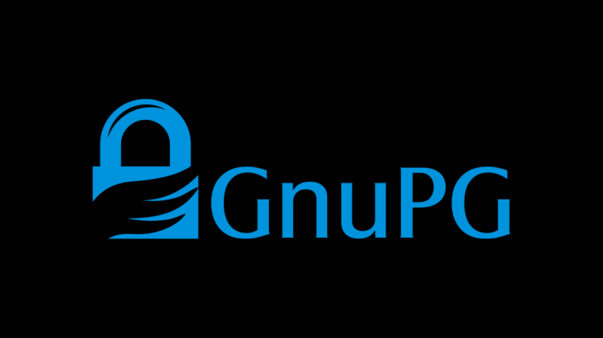
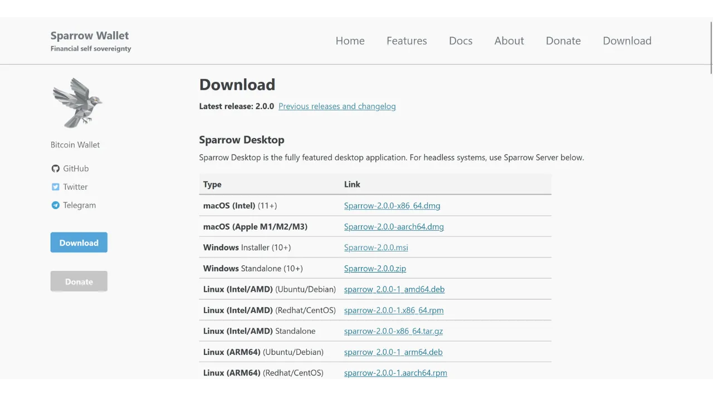
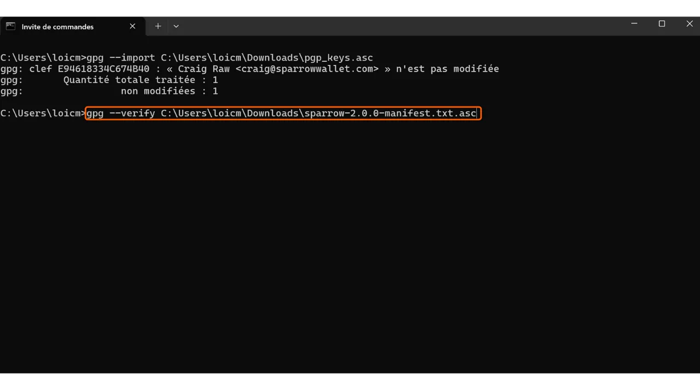

Ao baixar software, é muito importante garantir que ele não foi alterado e que realmente vem da fonte oficial. Isso é especialmente verdadeiro para softwares relacionados ao Bitcoin, como softwares de carteira, que permitem que você proteja as chaves que dão acesso aos seus fundos. Neste tutorial, veremos como verificar a integridade e autenticidade de um software antes de instalá-lo. Usaremos o Sparrow Wallet como exemplo, um software de carteira muito apreciado entre os usuários de bitcoin, mas o procedimento será o mesmo para qualquer outro software.

Verificar a integridade envolve garantir que o arquivo baixado não foi modificado, comparando sua impressão digital (ou seja, seu hash) com o fornecido pelo desenvolvedor oficial. Se os dois coincidirem, significa que o arquivo é idêntico ao original e não foi corrompido ou modificado por um atacante.

Por outro lado, verificar a autenticidade garante que o arquivo realmente vem do desenvolvedor oficial e não de um impostor. Isso é feito verificando uma assinatura digital. Esta assinatura prova que o software foi assinado com a chave privada do desenvolvedor legítimo.

Se essas verificações não forem realizadas, há um risco de instalar malware que poderia conter código modificado. Esse código poderia roubar informações, como suas chaves privadas, ou bloquear o acesso aos seus arquivos. Esse tipo de ataque é bastante comum, especialmente no contexto de software de código aberto, onde versões falsificadas podem ser distribuídas.

Para realizar essa verificação, usaremos duas ferramentas: funções de hash para verificar a integridade e o GnuPG, uma ferramenta de código aberto que implementa o protocolo PGP, para verificar a autenticidade.

## Pré-requisitos

Se você estiver no **Linux**, o GPG já vem pré-instalado na maioria das distribuições. Caso contrário, você pode instalá-lo com o seguinte comando:

```bash
sudo apt install gnupg
```

Para **macOS**, se você ainda não instalou o gerenciador de pacotes Homebrew, faça-o com os seguintes comandos:

```bash
/bin/bash -c "$(curl -fsSL https://raw.githubusercontent.com/Homebrew/install/HEAD/install.sh)"
```

```bash
echo 'eval "$(/opt/homebrew/bin/brew shellenv)"' >> ~/.zprofile
```

```bash
eval "$(/opt/homebrew/bin/brew shellenv)"
```

Em seguida, instale o GPG com este comando:

```bash
brew install gnupg
```
Para **Windows**, se você não tem o GPG, pode instalar o software [Gpg4win](https://www.gpg4win.org/).


## Baixando Documentos

Para começar, precisaremos de vários documentos. Visite o site oficial do [Sparrow Wallet na seção "*Download*"](https://sparrowwallet.com/download/). Se desejar verificar outro software, vá ao site desse software.



Você também pode ir [ao repositório GitHub do projeto](https://github.com/sparrowwallet/sparrow/releases).


Baixe o instalador do software correspondente ao seu sistema operacional.


Você também precisará do hash do arquivo, muitas vezes chamado de "*SHA256SUMS*" ou "*MANIFEST*".


Baixe também a assinatura PGP do arquivo. Este é o documento no formato `.asc`.


Certifique-se de colocar todos esses arquivos na mesma pasta para os próximos passos.
Finalmente, você precisará da chave pública do desenvolvedor, que usaremos para verificar a assinatura PGP. Esta chave geralmente está disponível no site do software, no repositório GitHub do projeto, às vezes nas redes sociais do desenvolvedor, ou em sites especializados como o Keybase. No caso do Sparrow Wallet, você pode encontrar a chave pública do desenvolvedor Craig Raw [no Keybase](https://keybase.io/craigraw). Para baixá-la diretamente do terminal, execute o comando:

```bash
curl https://keybase.io/craigraw/pgp_keys.asc | gpg --import
```


## Verificando a Assinatura

O processo de verificação da assinatura é o mesmo no **Windows**, **macOS** e **Linux**. Normalmente, você já importou a chave pública durante a etapa anterior, mas, se não, faça isso com o comando:

```bash
gpg --import [caminho da chave]
```

Substitua `[caminho da chave]` pelo local do arquivo da chave pública do desenvolvedor.


Verifique a assinatura com o seguinte comando:

```bash
gpg --verify [arquivo.asc]
```

Substitua `[arquivo.asc]` pelo caminho do arquivo de assinatura. No caso do Sparrow, este arquivo é chamado de "*sparrow-2.0.0-manifest.txt.asc*" para a versão 2.0.0.



Se a assinatura for válida, o GPG indicará isso para você. Você pode então prosseguir para a próxima etapa, pois isso confirma a autenticidade do arquivo.


## Verificando o Hash
Agora que a autenticidade do software foi confirmada, também é necessário verificar sua integridade. Compararemos o hash do software com o hash fornecido pelo desenvolvedor. Se os dois coincidirem, isso garante que o código do software não foi alterado.

No **Windows**, abra um terminal e execute o seguinte comando:

```bash
CertUtil -hashfile [caminho do arquivo] SHA256 | findstr /v "hash"
```

Substitua `[caminho do arquivo]` pelo local do instalador.


O terminal retornará o hash do software baixado.


Esteja ciente de que, para alguns softwares, pode ser necessário usar uma função de hash diferente da SHA256. Nesse caso, simplesmente substitua o nome da função de hash no comando.

Em seguida, compare o resultado com o valor correspondente no arquivo "*sparrow-2.0.0-manifest.txt*".


No meu caso, vemos que os dois hashes coincidem perfeitamente.

No **macOS** e **Linux**, o processo de verificação de hash é automatizado. Não é necessário verificar manualmente a correspondência entre os dois hashes como no Windows.

Basta executar este comando no **macOS**:

```bash
shasum --check [nome do arquivo] --ignore-missing
```

Substitua `[nome do arquivo]` pelo nome do instalador. Por exemplo, para o Sparrow Wallet:

```bash
shasum --check sparrow-2.0.0-manifest.txt --ignore-missing
```

Se os hashes coincidirem, você deverá ver a seguinte saída:

```bash
Sparrow-2.0.0.dmg: OK
```
No **Linux**, o comando é similar:
```bash
sha256sum --check [nome do arquivo] --ignore-missing
```

E se os hashes coincidirem, você deverá ver a seguinte saída:

```bash
sparrow_2.0.0-1_amd64.deb: OK
```

Agora você tem a certeza de que o software que baixou é autêntico e está intacto. Você pode prosseguir com sua instalação em sua máquina.

Se você achou este tutorial útil, eu apreciaria um joinha abaixo. Sinta-se livre para compartilhar este artigo em suas redes sociais. Muito obrigado!

Eu também recomendo conferir este outro tutorial sobre VeraCrypt, um software que permite criptografar e descriptografar dispositivos de armazenamento.

https://planb.network/tutorials/computer-security/data/veracrypt-d5ed4c83-7c1c-4181-95ea-963fdf2d83c5
