VPN ("*वर्चुअल प्राइवेट नेटवर्क*") एक सेवा है जो आपके फोन या कंप्यूटर और VPN प्रदाता द्वारा प्रबंधित एक दूरस्थ सर्वर के बीच एक सुरक्षित और एन्क्रिप्टेड कनेक्शन स्थापित करती है।

तकनीकी रूप से, जब आप एक वीपीएन से जुड़ते हैं, तो आपकी इंटरनेट ट्रैफिक एक एन्क्रिप्टेड सुरंग के माध्यम से वीपीएन सर्वर तक पुनर्निर्देशित होती है। इस प्रक्रिया से इंटरनेट सेवा प्रदाताओं (आईएसपी) या दुर्भावनापूर्ण तत्वों जैसे तीसरे पक्ष के लिए आपके डेटा को इंटरसेप्ट करना या पढ़ना मुश्किल हो जाता है। वीपीएन सर्वर तब एक मध्यस्थ के रूप में कार्य करता है जो आपकी ओर से उस सेवा से जुड़ता है जिसे आप उपयोग करना चाहते हैं। यह आपके कनेक्शन को एक नया आईपी Address असाइन करता है, जो उन साइटों से आपके वास्तविक आईपी Address को छिपाने में मदद करता है जिन्हें आप विजिट करते हैं। हालांकि, कुछ ऑनलाइन विज्ञापनों के विपरीत, वीपीएन का उपयोग करने से आपको इंटरनेट पर गुमनाम रूप से ब्राउज़ करने की अनुमति नहीं मिलती, क्योंकि यह वीपीएन प्रदाता पर एक प्रकार के विश्वास की आवश्यकता होती है जो आपकी सभी ट्रैफिक को देख सकता है।

VPN का उपयोग करने के फायदे कई हैं। सबसे पहले, यह आपके ऑनलाइन गतिविधियों की गोपनीयता को ISPs या सरकारों से सुरक्षित रखता है, बशर्ते कि VPN प्रदाता आपकी जानकारी साझा न करे। दूसरा, यह आपके डेटा को सुरक्षित करता है, खासकर जब आप सार्वजनिक वाई-फाई नेटवर्क से जुड़े होते हैं, जो MITM (मैन-इन-द-मिडल) हमलों के प्रति संवेदनशील होते हैं। तीसरा, आपके IP को छुपाकर, VPN आपको भौगोलिक प्रतिबंधों और सेंसरशिप को पार करने की अनुमति देता है, ताकि आप उस सामग्री तक पहुंच सकें जो अन्यथा आपके क्षेत्र में उपलब्ध नहीं होती या अवरुद्ध होती।

जैसा कि आप देख सकते हैं, VPN आपके इंटरनेट ट्रैफिक की निगरानी का जोखिम VPN प्रदाता पर स्थानांतरित कर देता है। इसलिए, जब आप अपने VPN प्रदाता का चयन कर रहे हों, तो यह देखना महत्वपूर्ण है कि पंजीकरण के लिए कौन-कौन सी व्यक्तिगत जानकारी मांगी जा रही है। यदि प्रदाता आपके फोन नंबर, ईमेल, बैंक कार्ड विवरण, या इससे भी बुरा, आपके पोस्टल पते जैसी जानकारी मांगता है, तो आपके ट्रैफिक को आपकी पहचान से जोड़ने का जोखिम बढ़ जाता है। अगर प्रदाता से कोई समझौता हो जाता है या कानूनी रूप से डेटा जब्त कर लिया जाता है, तो आपके ट्रैफिक को आपकी व्यक्तिगत जानकारी से जोड़ना आसान हो जाएगा। इसलिए, यह सलाह दी जाती है कि ऐसे प्रदाता का चयन करें जो किसी भी व्यक्तिगत जानकारी की मांग न करे और गुमनाम भुगतान स्वीकार करे, जैसे कि बिटकॉइन के माध्यम से।

इस ट्यूटोरियल में, मैं एक सरल, प्रभावी और किफायती VPN समाधान प्रस्तुत कर रहा हूँ, जिसके उपयोग के लिए किसी भी व्यक्तिगत जानकारी की आवश्यकता नहीं होती है।

## IVPN का परिचय

IVPN एक VPN सेवा है जो खासतौर पर उन उपयोगकर्ताओं के लिए बनाई गई है जो गोपनीयता की तलाश में हैं। YouTube पर अक्सर प्रचारित किए जाने वाले लोकप्रिय VPN प्रदाताओं के विपरीत, IVPN अपनी पारदर्शिता, सुरक्षा और गोपनीयता के सम्मान के लिए अलग पहचान रखता है।

IVPN की गोपनीयता नीति बहुत सख्त है: साइन-अप के समय कोई व्यक्तिगत जानकारी नहीं मांगी जाती। आप बिना ईमेल, नाम, या फोन नंबर दिए खाता खोल सकते हैं। भुगतान के लिए, आपको क्रेडिट कार्ड की जानकारी देने की जरूरत नहीं है, क्योंकि IVPN बिटकॉइन (ऑनचेन और लाइटनिंग) में भुगतान स्वीकार करता है। इसके अलावा, IVPN का दावा है कि वे कोई गतिविधि लॉग नहीं रखते, जिसका मतलब है कि, सिद्धांत रूप में, आपकी इंटरनेट गतिविधि कंपनी द्वारा रिकॉर्ड नहीं की जाती।

IVPN पूरी तरह से ओपन-सोर्स है, चाहे वो उनका सॉफ्टवेयर हो, एप्लिकेशन हो, या उनकी वेबसाइट। इसका मतलब है कि कोई भी उनके कोड को देख और जांच सकता है। वे हर साल स्वतंत्र सुरक्षा ऑडिट भी करवाते हैं, जिनके नतीजे उनकी वेबसाइट पर प्रकाशित किए जाते हैं।

IVPN केवल खुद के होस्ट किए गए सर्वरों का उपयोग करता है, जिससे AWS, गूगल क्लाउड, या माइक्रोसॉफ्ट एज़्योर जैसी तीसरी पार्टी की क्लाउड सेवाओं के उपयोग से जुड़े जोखिमों को खत्म कर देता है।

यह सेवा कई उन्नत सुविधाएँ प्रदान करती है, जैसे मल्टी-हॉप, जो ट्रैफिक को अलग-अलग क्षेत्रों में स्थित कई सर्वरों के माध्यम से भेजता है ताकि गुमनामी को बढ़ाया जा सके। IVPN एक ट्रैकर और विज्ञापन ब्लॉकर भी शामिल करता है, और विभिन्न VPN प्रोटोकॉल में से चुनने का विकल्प भी देता है।

स्वाभाविक रूप से, इस तरह की सेवा की गुणवत्ता की एक कीमत होती है, लेकिन एक उचित मूल्य अक्सर गुणवत्ता और ईमानदारी का संकेत होता है। यह यह भी दर्शा सकता है कि कंपनी का व्यापार मॉडल ऐसा है जिसमें व्यक्तिगत डेटा बेचने की आवश्यकता नहीं होती। IVPN दो प्रकार की योजनाएँ प्रदान करता है: स्टैंडर्ड प्लान, जो 2 डिवाइस तक कनेक्ट करने की अनुमति देता है, और प्रो प्लान, जो 7 कनेक्शन तक की अनुमति देता है और इसमें "*मल्टी-हॉप*" प्रोटोकॉल शामिल है जो आपके ट्रैफिक को कई सर्वरों के माध्यम से रूट करता है।

मुख्यधारा के VPN प्रदाताओं के विपरीत, IVPN एक अलग मॉडल पर काम करता है जहाँ आप सेवा के लिए समय खरीदते हैं, न कि बार-बार सब्सक्रिप्शन के आधार पर। आप एक बार बिटकॉइन में भुगतान करते हैं और चुने गए समय के लिए सेवा का उपयोग कर सकते हैं। उदाहरण के लिए, अगर आप एक साल की सेवा खरीदते हैं, तो आप उस अवधि के लिए सेवा का उपयोग कर सकते हैं। उसके बाद, आपको अधिक समय खरीदने के लिए IVPN वेबसाइट पर वापस जाना होगा।

[IVPN दरें](https://www.ivpn.net/en/pricing/) खरीदी गई एक्सेस अवधि के आधार पर प्रगतिशील होती हैं। यहाँ स्टैंडर्ड प्लान की कीमतें दी गई हैं:

- 1 हफ्ता: ₹2
- 1 महीने का शुल्क: ₹6
- 1 साल: ₹60
- 2 साल: ₹100
- 3 साल: 140 रुपये

और प्रो प्लान के लिए:

- 1 हफ्ता: 4 डॉलर
- 1 महीने की कीमत: ₹10
- 1 साल: ₹100
- 2 साल: 160 डॉलर
- 3 साल: 220 रुपये

## कंप्यूटर पर IVPN कैसे इंस्टॉल करें?

1. सबसे पहले, IVPN की आधिकारिक वेबसाइट पर जाएं और अपने ऑपरेटिंग सिस्टम के अनुसार सही वर्जन डाउनलोड करें।

2. डाउनलोड पूरा होने के बाद, इंस्टॉलर फाइल पर डबल-क्लिक करें ताकि इंस्टॉलेशन प्रक्रिया शुरू हो सके।

3. स्क्रीन पर दिए गए निर्देशों का पालन करें। आपको कुछ विकल्प चुनने के लिए कहा जा सकता है, जैसे कि इंस्टॉलेशन लोकेशन।

4. इंस्टॉलेशन प्रक्रिया पूरी होने के बाद, IVPN ऐप को ओपन करें।

5. अब, अपने IVPN अकाउंट से लॉगिन करें। अगर आपके पास अकाउंट नहीं है, तो आपको एक नया अकाउंट बनाना होगा।

6. लॉगिन करने के बाद, आप अपनी पसंद के सर्वर लोकेशन को चुन सकते हैं और कनेक्ट बटन पर क्लिक कर सकते हैं।

7. एक बार कनेक्ट हो जाने पर, आपका इंटरनेट कनेक्शन सुरक्षित हो जाएगा और आप गुमनाम रूप से ब्राउज़ कर सकते हैं।

बस, अब आप IVPN का उपयोग कर सकते हैं!

अपने ऑपरेटिंग सिस्टम के लिए [सॉफ़्टवेयर का नवीनतम संस्करण](https://www.ivpn.net/en/apps-windows/) डाउनलोड करें, फिर इंस्टॉलेशन विज़ार्ड में दिए गए चरणों का पालन करके इंस्टॉलेशन प्रक्रिया पूरी करें। 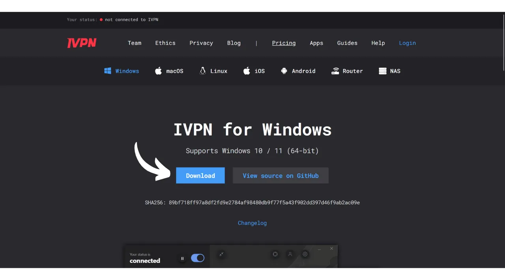

लिनक्स उपयोगकर्ताओं के लिए, अपने वितरण के अनुसार निर्देशों के लिए [इस पेज](https://www.ivpn.net/en/apps-linux/) पर जाएं।

इंस्टॉलेशन पूरा होने के बाद, आपको अपना अकाउंट आईडी दर्ज करनी होगी। हम इस ट्यूटोरियल के अगले हिस्सों में देखेंगे कि इसे कैसे प्राप्त किया जाए।

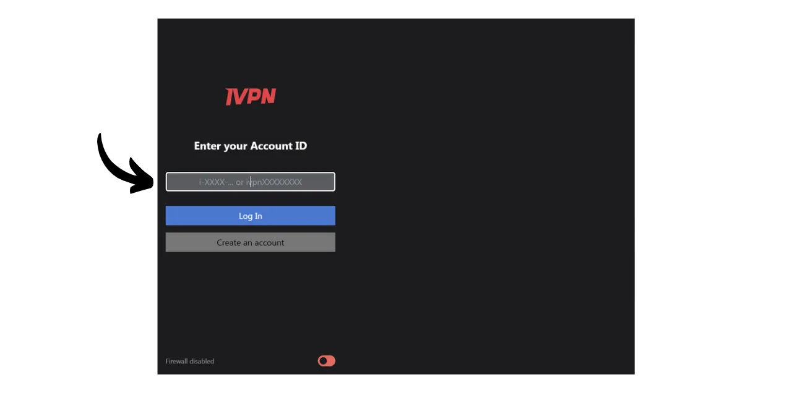

## स्मार्टफोन पर IVPN कैसे इंस्टॉल करें?

1. **एप स्टोर पर जाएं**: सबसे पहले अपने स्मार्टफोन के ऐप स्टोर पर जाएं। अगर आप एंड्रॉइड फोन इस्तेमाल कर रहे हैं तो गूगल प्ले स्टोर खोलें, और अगर आप आईफोन इस्तेमाल कर रहे हैं तो ऐप स्टोर खोलें।

2. **IVPN सर्च करें**: सर्च बार में "IVPN" टाइप करें और सर्च करें।

3. **ऐप डाउनलोड करें**: जब IVPN ऐप दिखाई दे, तो उसे डाउनलोड करने के लिए "इंस्टॉल" या "गेट" बटन पर टैप करें।

4. **ऐप खोलें**: डाउनलोड पूरा होने के बाद, ऐप को खोलें।

5. **साइन इन करें या अकाउंट बनाएं**: अगर आपके पास पहले से IVPN अकाउंट है, तो अपनी लॉगिन जानकारी डालकर साइन इन करें। अगर नहीं है, तो नया अकाउंट बनाने के लिए "साइन अप" या "रजिस्टर" विकल्प चुनें।

6. **सेटअप पूरा करें**: ऐप में दिए गए निर्देशों का पालन करें और अपनी पसंद के अनुसार सेटिंग्स को कस्टमाइज़ करें।

7. **कनेक्ट करें**: एक बार सेटअप पूरा हो जाने के बाद, VPN सर्वर से कनेक्ट करने के लिए "कनेक्ट" बटन पर टैप करें।

अब आपका IVPN आपके स्मार्टफोन पर इंस्टॉल हो चुका है और आप इसे सुरक्षित रूप से इस्तेमाल कर सकते हैं।

अपने ऐप स्टोर से IVPN डाउनलोड करें, चाहे आप iOS उपयोगकर्ता हों तो [AppStore](https://apps.apple.com/us/app/ivpn-secure-vpn-for-privacy/id1193122683) से, Android उपयोगकर्ता हों तो [Google Play Store](https://play.google.com/store/apps/details?id=net.ivpn.client) से, या [F-Droid](https://f-droid.org/en/packages/net.ivpn.client) से। अगर आप Android का उपयोग कर रहे हैं, तो आपके पास [IVPN साइट](https://www.ivpn.net/en/apps-android/) से सीधे `.apk` फाइल डाउनलोड करने का विकल्प भी है।

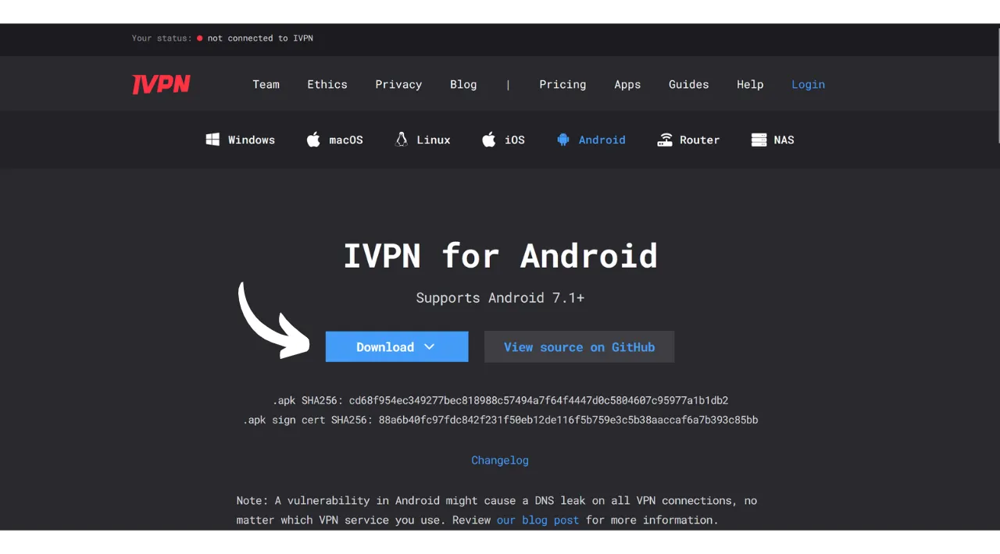

ऐप का पहली बार उपयोग करने पर, आपको लॉग आउट कर दिया जाएगा। सेवा को सक्रिय करने के लिए आपको अपना खाता आईडी दर्ज करनी होगी।

अब, चलिए आपके उपकरणों पर IVPN को सक्रिय करने की प्रक्रिया शुरू करते हैं।

## IVPN के लिए भुगतान और सक्रिय करने का तरीका इस प्रकार है:

1. **खरीदारी करें**: सबसे पहले, IVPN की आधिकारिक वेबसाइट पर जाएं और अपनी पसंद का प्लान चुनें। 

2. **भुगतान करें**: अपनी पसंद के प्लान को चुनने के बाद, भुगतान के लिए उपलब्ध विकल्पों में से एक चुनें। आप क्रेडिट/डेबिट कार्ड, पेपाल, या अन्य उपलब्ध विकल्पों का उपयोग कर सकते हैं।

3. **खाता बनाएं**: भुगतान करने के बाद, आपको एक खाता बनाने के लिए कहा जाएगा। अपनी ईमेल आईडी और पासवर्ड डालकर खाता बनाएं।

4. **सक्रिय करें**: खाता बनाने के बाद, आपको एक ईमेल प्राप्त होगा जिसमें आपके खाता सक्रिय करने के लिए लिंक होगा। उस लिंक पर क्लिक करें और अपने खाते को सक्रिय करें।

5. **ऐप डाउनलोड करें**: अब, IVPN ऐप को अपने डिवाइस पर डाउनलोड और इंस्टॉल करें।

6. **लॉग इन करें**: ऐप खोलें और अपने बनाए गए खाते की जानकारी से लॉग इन करें।

7. **सर्वर चुनें और कनेक्ट करें**: लॉग इन करने के बाद, अपनी पसंद का सर्वर चुनें और कनेक्ट पर क्लिक करें।

बस, अब आपका IVPN सक्रिय है और आप इसे उपयोग कर सकते हैं।

आप IVPN की आधिकारिक वेबसाइट पर [भुगतान पृष्ठ](https://www.ivpn.net/en/pricing/) पर जाएं।

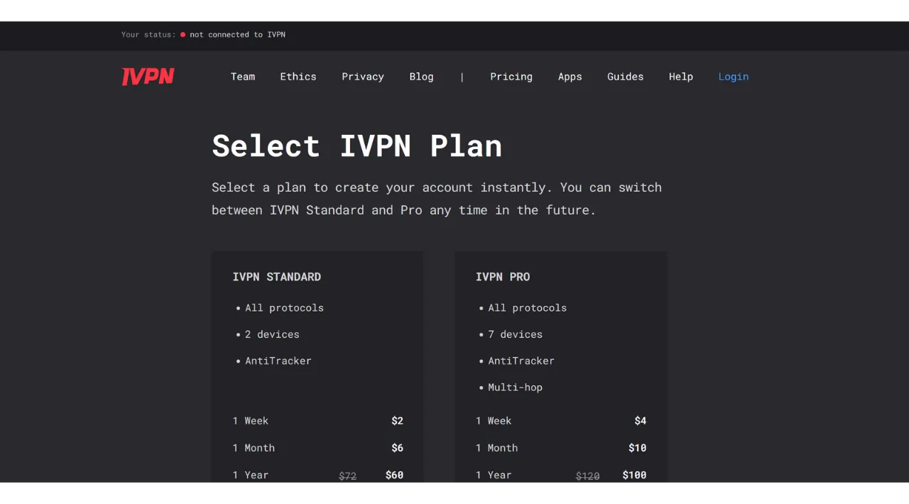

अपनी ज़रूरतों के हिसाब से सबसे उपयुक्त योजना चुनें। इस ट्यूटोरियल के लिए, हम स्टैंडर्ड योजना का चयन करेंगे, जो हमें हमारे कंप्यूटर और स्मार्टफोन पर वीपीएन सक्रिय करने की अनुमति देती है।

IVPN तब आपका खाता बनाएगा। आपको कोई व्यक्तिगत जानकारी देने की आवश्यकता नहीं है। केवल आपका खाता आईडी ही आपको लॉग इन करने की अनुमति देगा। यह एक तरह से एक्सेस की की तरह काम करता है। इसे किसी सुरक्षित जगह पर, जैसे आपके पासवर्ड मैनेजर में, सुरक्षित रखें। आप इसका एक पेपर कॉपी भी बना सकते हैं।

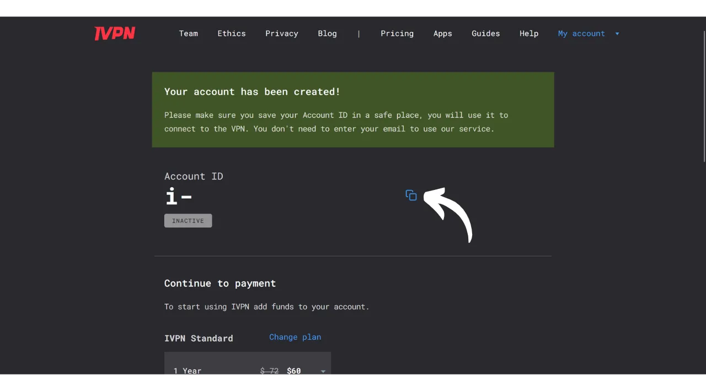

उसी पेज पर, अपनी सेवा की सदस्यता की अवधि चुनें।

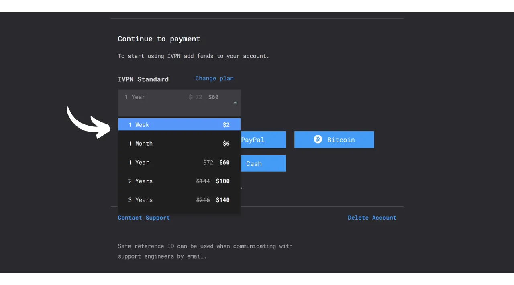

फिर अपना भुगतान विधि चुनें। मेरी ओर से, मैं भुगतान Lightning Network के माध्यम से करूंगा, इसलिए मैं "*Bitcoin*" बटन पर क्लिक करता हूँ।

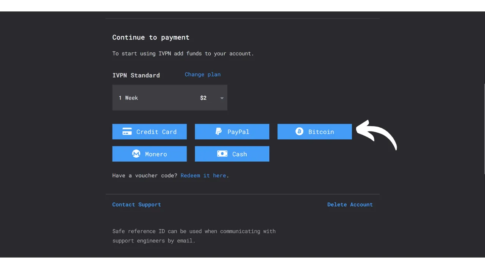

सुनिश्चित करें कि सब कुछ आपकी पसंद के अनुसार है, फिर "*लाइटनिंग से भुगतान करें*" बटन पर क्लिक करें।

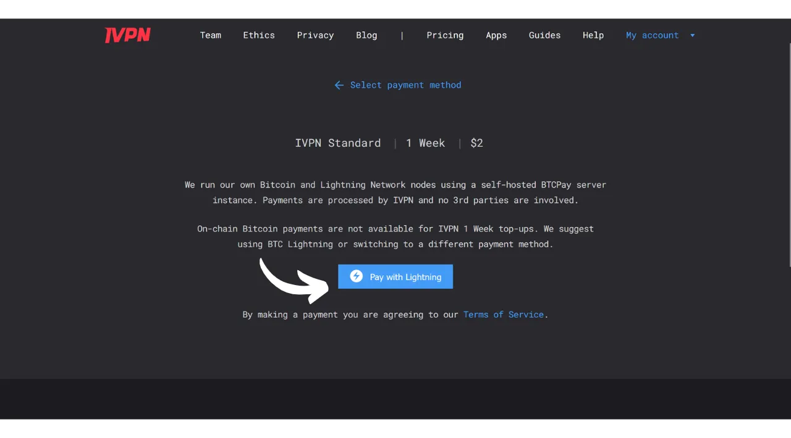

आपको उनके BTCPay सर्वर पर एक लाइटनिंग Invoice प्रस्तुत किया जाएगा। अपने लाइटनिंग Wallet से QR कोड स्कैन करें और भुगतान की प्रक्रिया आगे बढ़ाएं।

 Once the invoice is paid, click on the "*Return to IVPN*" button.

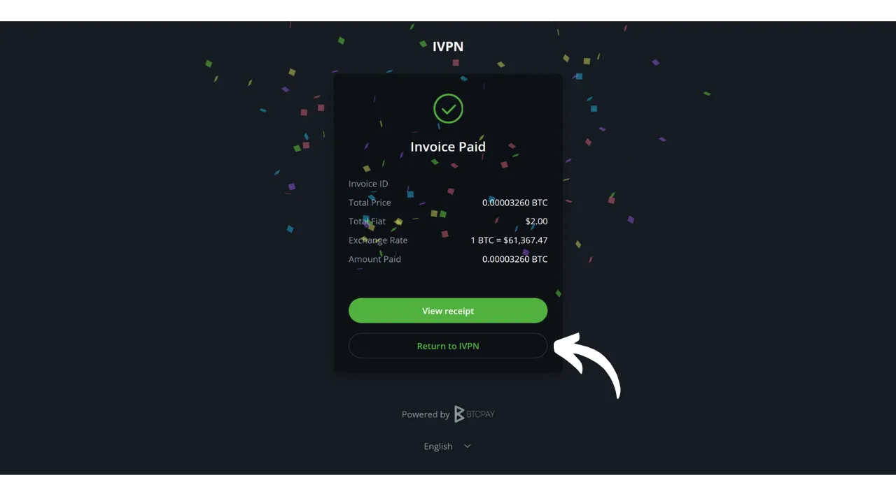

आपका खाता अब "*सक्रिय*" दिख रहा है, और आप देख सकते हैं कि आपकी VPN की पहुंच किस तारीख तक मान्य है। इस तारीख के बाद, आपको अपना भुगतान नवीनीकृत करना होगा।

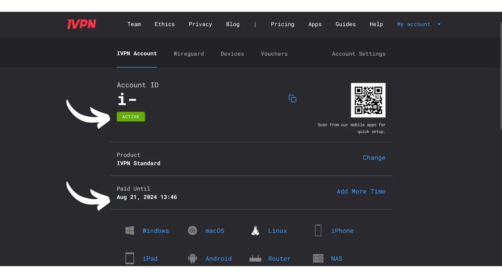

अपने पीसी पर IVPN के माध्यम से अपना कनेक्शन सक्रिय करने के लिए, बस अपने अकाउंट आईडी को कॉपी करें।

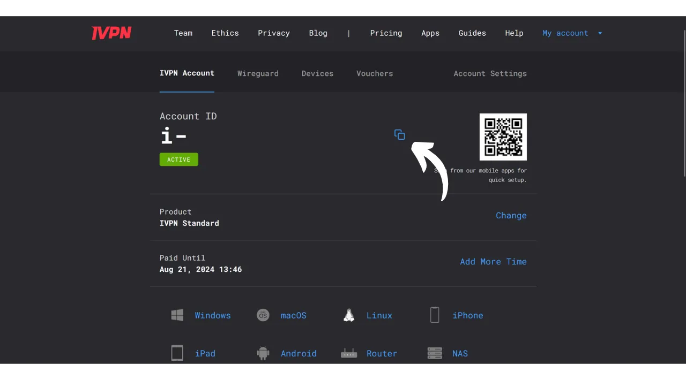

और इसे उस सॉफ़्टवेयर में चिपका दें जिसे आपने पहले डाउनलोड किया था।

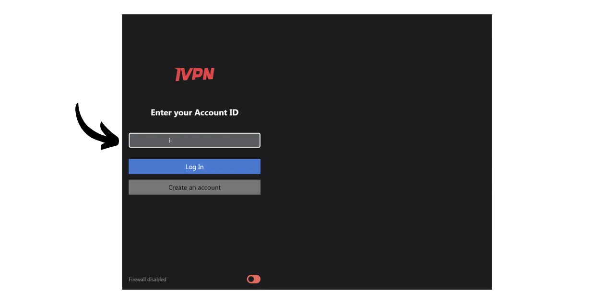

फिर "*लॉगिन*" बटन पर क्लिक करें।

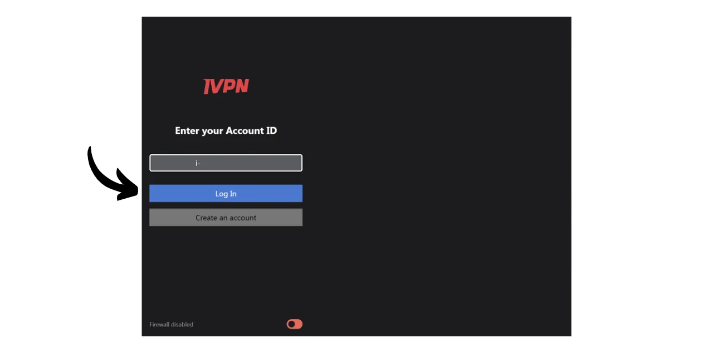

चेकमार्क पर क्लिक करें ताकि वीपीएन कनेक्शन सक्रिय हो जाए, और बस हो गया, अब आपके कंप्यूटर का इंटरनेट ट्रैफिक एन्क्रिप्टेड हो गया है और यह IVPN सर्वर के माध्यम से रूट हो रहा है।

आपके स्मार्टफोन के लिए प्रक्रिया बिल्कुल वही है। अपनी IVPN खाता आईडी पेस्ट करें या वेबसाइट से जुड़े क्यूआर कोड को स्कैन करें। फिर, कनेक्शन स्थापित करने के लिए चेकमार्क पर क्लिक करें।

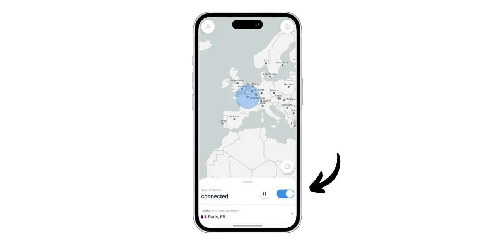

## IVPN का उपयोग और कॉन्फ़िगर कैसे करें?

IVPN एक वर्चुअल प्राइवेट नेटवर्क (VPN) सेवा है जो आपकी ऑनलाइन गोपनीयता और सुरक्षा को बढ़ाती है। इसे सेटअप और उपयोग करना काफी आसान है। यहां कुछ सरल चरण दिए गए हैं जिनसे आप IVPN का उपयोग और कॉन्फ़िगर कर सकते हैं:

1. **IVPN डाउनलोड करें**: सबसे पहले, IVPN की आधिकारिक वेबसाइट पर जाएं और अपने डिवाइस के लिए उपयुक्त ऐप डाउनलोड करें। यह Windows, macOS, iOS, Android और Linux के लिए उपलब्ध है।

2. **खाता बनाएं**: यदि आपने पहले से खाता नहीं बनाया है, तो वेबसाइट पर जाकर एक नया खाता बनाएं। आपको एक ईमेल और पासवर्ड की आवश्यकता होगी।

3. **ऐप इंस्टॉल करें**: डाउनलोड की गई फाइल को खोलें और इंस्टॉलेशन प्रक्रिया को पूरा करें। यह प्रक्रिया आपके डिवाइस के अनुसार थोड़ी अलग हो सकती है।

4. **लॉग इन करें**: ऐप इंस्टॉल होने के बाद, उसे खोलें और अपने खाते की जानकारी का उपयोग करके लॉग इन करें।

5. **सर्वर चुनें**: एक बार लॉग इन करने के बाद, आपको विभिन्न सर्वर लोकेशन्स की सूची दिखाई देगी। अपनी आवश्यकताओं के अनुसार एक सर्वर चुनें। आमतौर पर, निकटतम सर्वर सबसे तेज़ होता है।

6. **कनेक्ट करें**: सर्वर चुनने के बाद, "कनेक्ट" बटन पर क्लिक करें। कुछ ही क्षणों में आपका डिवाइस VPN से कनेक्ट हो जाएगा।

7. **सेटिंग्स कॉन्फ़िगर करें**: यदि आप उन्नत सेटिंग्स को कॉन्फ़िगर करना चाहते हैं, तो ऐप की सेटिंग्स में जाएं। यहां आप प्रोटोकॉल, किल स्विच, और अन्य सुरक्षा विकल्पों को सेट कर सकते हैं।

8. **डिस्कनेक्ट करें**: जब आप VPN का उपयोग करना समाप्त कर लें, तो "डिस्कनेक्ट" बटन पर क्लिक करें।

इन सरल चरणों का पालन करके, आप आसानी से IVPN का उपयोग और कॉन्फ़िगर कर सकते हैं और अपनी ऑनलाइन गतिविधियों को सुरक्षित बना सकते हैं।

उपयोग और सेटिंग्स के मामले में, यह काफी सरल है। मुख्य Interface से, आप चेकमार्क का उपयोग करके कनेक्शन को आसानी से सक्रिय या निष्क्रिय कर सकते हैं।

आपके पास अपने VPN को एक निश्चित समय के लिए रोकने का विकल्प भी है।

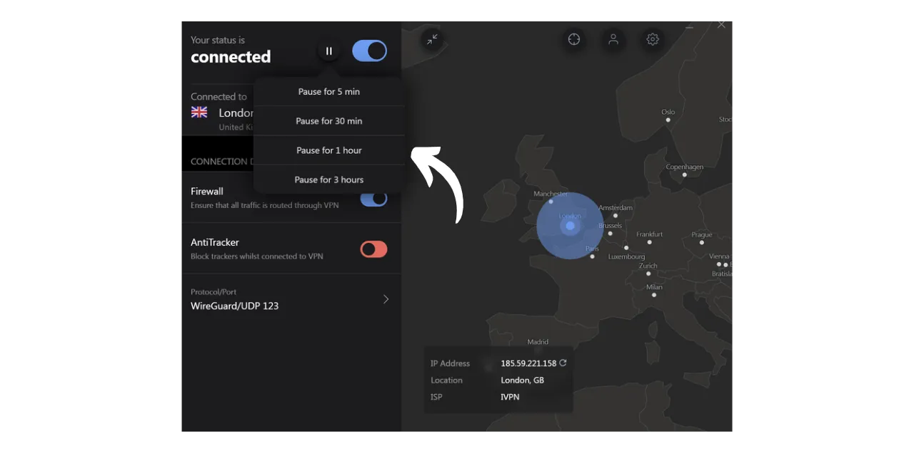

वर्तमान सर्वर पर क्लिक करके, आप उपलब्ध सर्वरों में से कोई दूसरा सर्वर चुन सकते हैं।

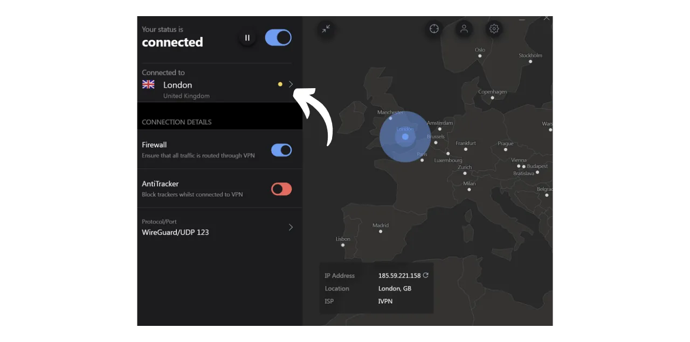

आप एकीकृत फ़ायरवॉल और एंटी-ट्रैकर फ़ंक्शन को सक्रिय या निष्क्रिय भी कर सकते हैं।

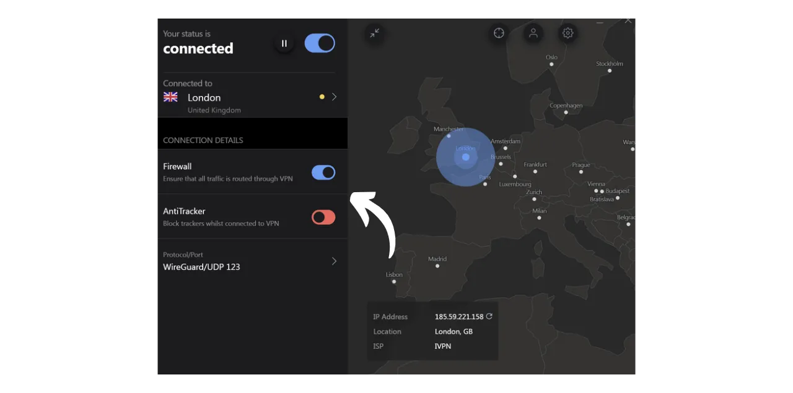

अतिरिक्त सेटिंग्स तक पहुँचने के लिए, सेटिंग्स आइकन पर क्लिक करें।

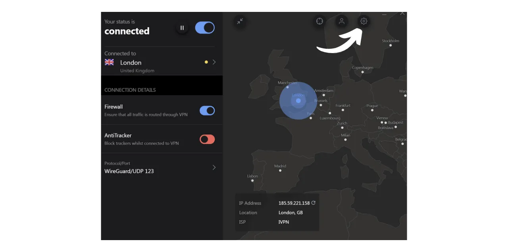

"*खाता*" टैब में, आपको अपने खाते से संबंधित सेटिंग्स मिलेंगी।

"*जनरल*" टैब में कई क्लाइंट सेटिंग्स होती हैं। मैं आपको सलाह देता हूँ कि "*लॉगिन पर लॉन्च*" और "*लॉन्च पर*" विकल्पों को "*ऑटोकनेक्ट*" सेक्शन में चेक कर लें ताकि जब आप अपनी मशीन शुरू करें, तो VPN के साथ कनेक्शन अपने आप स्थापित हो जाए।

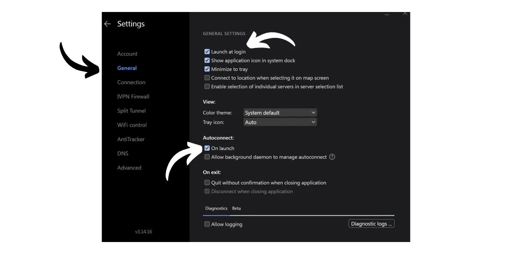

"*कनेक्शन*" टैब में, आपको कनेक्शन से संबंधित विभिन्न विकल्प मिलेंगे। यहीं पर आप उपयोग किए जाने वाले वीपीएन प्रोटोकॉल को बदल सकते हैं।

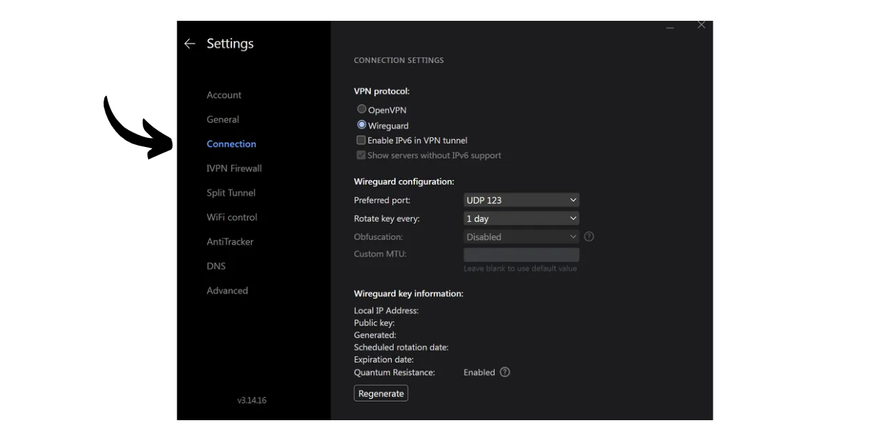

"*IVPN फ़ायरवॉल*" टैब आपको कंप्यूटर शुरू होते ही फ़ायरवॉल को व्यवस्थित रूप से सक्रिय करने की अनुमति देता है, जिससे यह सुनिश्चित होता है कि वीपीएन के बाहर कोई कनेक्शन स्थापित न हो।

"*स्प्लिट टनल*" टैब आपको कुछ सॉफ़्टवेयर को VPN कनेक्शन से बाहर रखने का विकल्प देता है। यहां जो भी एप्लिकेशन जोड़े जाएंगे, वे VPN चालू होने पर भी सामान्य इंटरनेट कनेक्शन के साथ काम करते रहेंगे।

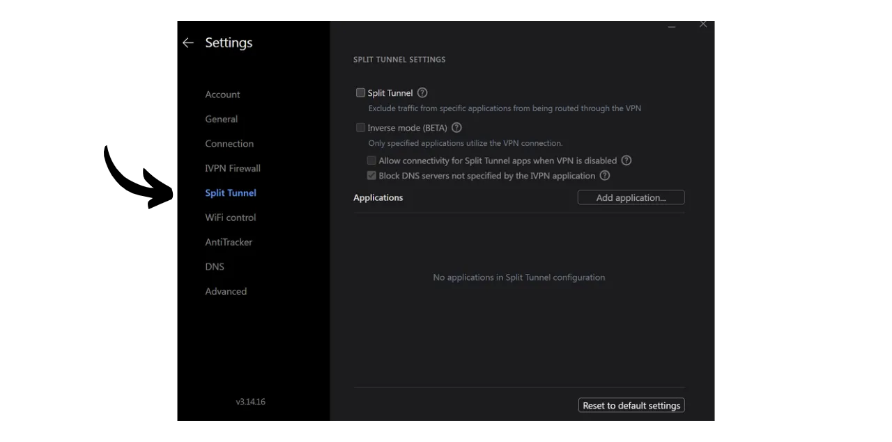

"*WiFi नियंत्रण*" टैब में, आपके पास उन नेटवर्क्स के अनुसार विशेष क्रियाएं सेट करने का विकल्प होता है जिनसे आप जुड़े होते हैं। उदाहरण के लिए, आप अपने घर के नेटवर्क को "*विश्वसनीय*" के रूप में चिन्हित कर सकते हैं और सेट कर सकते हैं कि इस नेटवर्क पर VPN सक्रिय न हो, लेकिन किसी अन्य WiFi नेटवर्क पर यह अपने आप सक्रिय हो जाए।

"*एंटीट्रैकर*" मेन्यू में, अपने एंटी-ट्रैकर के लिए ब्लॉकिंग प्रोफाइल चुनें। यह आपके इंटरनेट ब्राउज़ करते समय विज्ञापनों, मैलवेयर और डेटा ट्रैकर्स को ब्लॉक करने के लिए डिज़ाइन किया गया है। यह कंपनियों को आपके ब्राउज़िंग डेटा को इकट्ठा करने और बेचने से रोककर आपकी प्राइवेसी को बढ़ाता है। एक "*हार्डकोर मोड*" भी उपलब्ध है, जो गूगल और मेटा के स्वामित्व वाले सभी डोमेन और सभी निर्भर सेवाओं को पूरी तरह से ब्लॉक कर देता है।

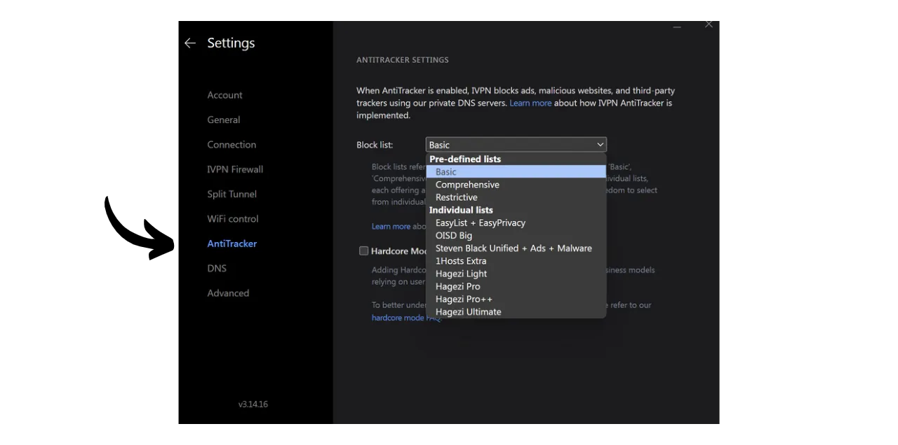

तो लीजिए, अब आप IVPN का पूरा आनंद लेने के लिए तैयार हैं। अगर आप अपने ऑनलाइन खातों की सुरक्षा को और बढ़ाना चाहते हैं, तो मैं आपको हमारे KeePass ट्यूटोरियल को देखने के लिए आमंत्रित करता हूँ। यह एक मुफ्त और ओपन-सोर्स समाधान है।

https://planb.network/tutorials/computer-security/authentication/keepass-f8073bb7-5b4a-4664-9246-228e307be246
अगर आप IVPN की तरह फीचर्स और कीमतों में समान किसी और VPN प्रदाता को खोजने में रुचि रखते हैं, तो मैं आपको हमारे Mullvad पर ट्यूटोरियल को देखने की सलाह देता हूँ।

https://planb.network/tutorials/computer-security/communication/mullvad-968ec5f5-b3f0-4d23-a9e0-c07a3e85aaa8