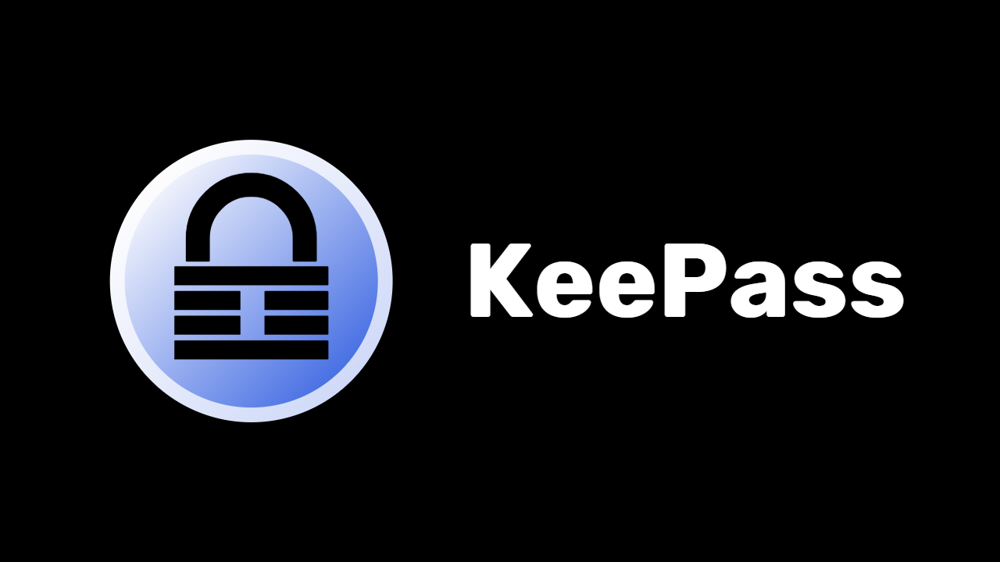
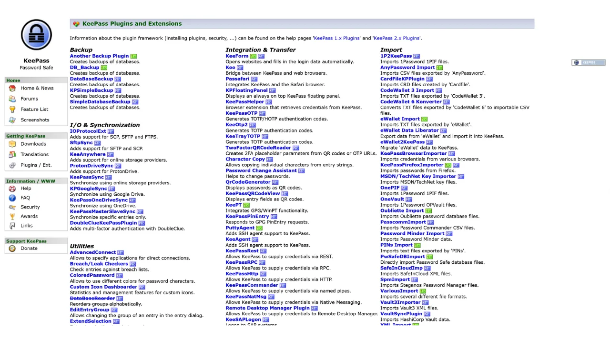
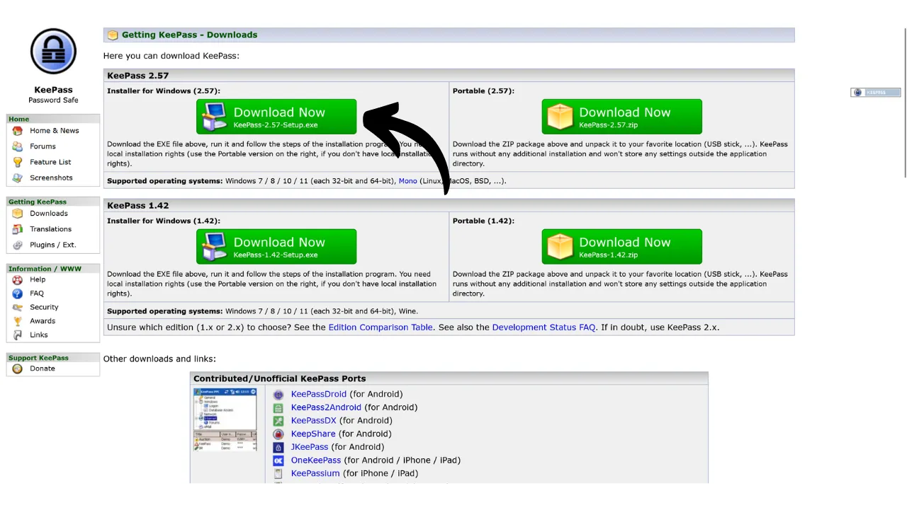
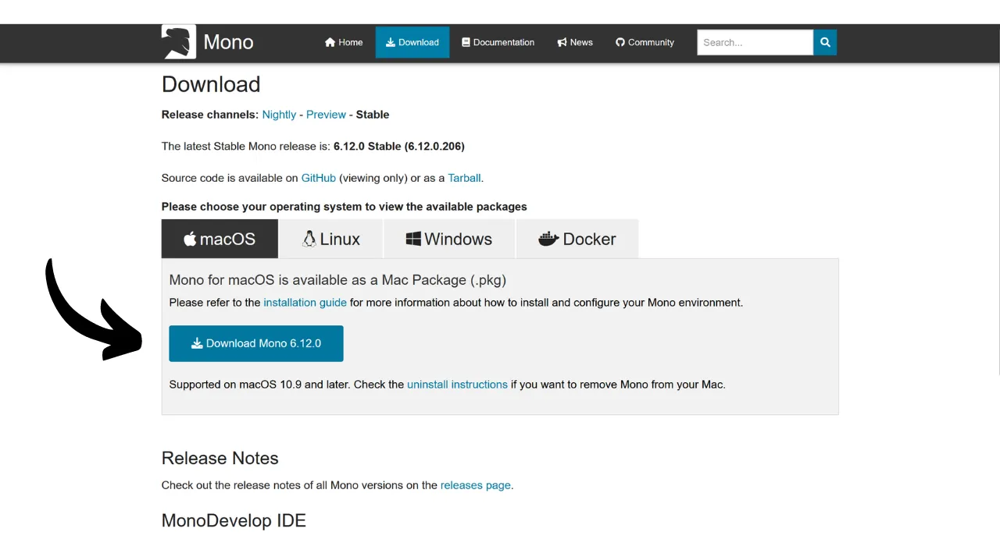
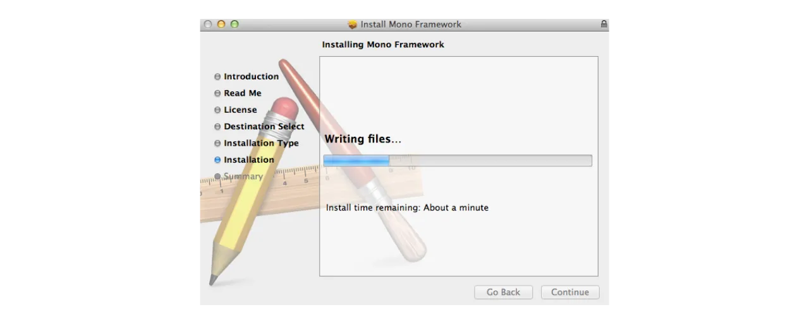
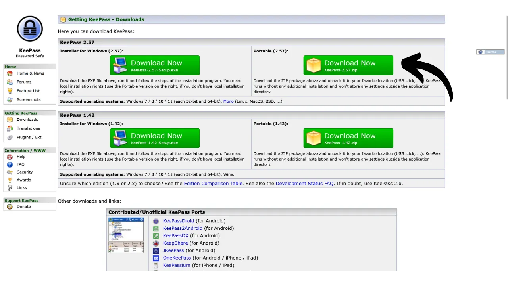

डिजिटल युग में, हमें अपने दैनिक जीवन के विभिन्न पहलुओं को कवर करने वाले कई ऑनलाइन खातों का प्रबंधन करना पड़ता है, जिनमें बैंकिंग, वित्तीय प्लेटफॉर्म, ईमेल, फाइल स्टोरेज, स्वास्थ्य, प्रशासन, सोशल नेटवर्क, वीडियो गेम्स आदि शामिल हैं।

इन खातों पर अपनी पहचान सत्यापित करने के लिए, हम एक पहचानकर्ता का उपयोग करते हैं, जो अक्सर एक ईमेल Address होता है, और इसके साथ एक पासवर्ड होता है। बहुत सारे अनोखे पासवर्ड याद रखने की असमर्थता के कारण, कोई एक ही पासवर्ड का पुनः उपयोग करने या एक सामान्य आधार को थोड़ा बदलकर याद रखने में आसानी के लिए उपयोग करने का लालच महसूस कर सकता है। हालांकि, ये तरीके आपके खातों की सुरक्षा को गंभीर रूप से खतरे में डालते हैं।

पासवर्ड के लिए पहला सिद्धांत यह है कि उन्हें दोबारा इस्तेमाल न करें। हर ऑनलाइन खाते को एक अनोखे और पूरी तरह से अलग पासवर्ड से सुरक्षित किया जाना चाहिए। यह इसलिए महत्वपूर्ण है क्योंकि अगर कोई हमलावर आपके किसी एक पासवर्ड को हैक कर लेता है, तो आप नहीं चाहेंगे कि उसे आपके सभी खातों तक पहुंच मिल जाए। हर खाते के लिए अलग पासवर्ड रखने से संभावित हमलों को अलग-थलग किया जा सकता है और उनके प्रभाव को सीमित किया जा सकता है। उदाहरण के लिए, अगर आप एक ही पासवर्ड वीडियो गेम प्लेटफॉर्म और अपने ईमेल के लिए इस्तेमाल करते हैं, और वह पासवर्ड गेमिंग प्लेटफॉर्म से संबंधित किसी फिशिंग साइट के जरिए हैक हो जाता है, तो हमलावर आसानी से आपके ईमेल तक पहुंच सकता है और आपके अन्य सभी ऑनलाइन खातों पर नियंत्रण कर सकता है।

दूसरा महत्वपूर्ण सिद्धांत है पासवर्ड की मजबूती। एक पासवर्ड को मजबूत तब माना जाता है जब उसे आसानी से अनुमान नहीं लगाया जा सके, यानी उसे ट्रायल और एरर के जरिए नहीं तोड़ा जा सके। इसका मतलब है कि आपके पासवर्ड जितने हो सके उतने रैंडम, लंबे और विभिन्न प्रकार के कैरेक्टर्स (छोटे अक्षर, बड़े अक्षर, नंबर और प्रतीक) शामिल करने चाहिए।

इन दो पासवर्ड सुरक्षा सिद्धांतों (विशिष्टता और मजबूती) को रोजमर्रा की जिंदगी में लागू करना मुश्किल हो सकता है, क्योंकि हमारे सभी खातों के लिए एक अनोखा, यादृच्छिक और मजबूत पासवर्ड याद रखना लगभग असंभव है। यहीं पर पासवर्ड मैनेजर काम आता है।

एक पासवर्ड मैनेजर मजबूत पासवर्ड बनाता है और उन्हें सुरक्षित रूप से स्टोर करता है, जिससे आप अपने सभी ऑनलाइन खातों तक पहुंच सकते हैं बिना उन्हें अलग-अलग याद किए। आपको केवल एक पासवर्ड याद रखना होता है, जिसे मास्टर पासवर्ड कहते हैं, जो आपको मैनेजर में सेव किए गए सभी पासवर्ड्स तक पहुंच देता है। पासवर्ड मैनेजर का उपयोग आपकी ऑनलाइन सुरक्षा को बढ़ाता है क्योंकि यह पासवर्ड के पुनः उपयोग को रोकता है और व्यवस्थित रूप से रैंडम पासवर्ड जनरेट करता है। लेकिन यह आपके खातों के दैनिक उपयोग को भी सरल बनाता है क्योंकि यह आपकी संवेदनशील जानकारी तक पहुंच को केंद्रीकृत करता है।

इस ट्यूटोरियल में, हम सीखेंगे कि अपनी ऑनलाइन सुरक्षा को बढ़ाने के लिए एक लोकल पासवर्ड मैनेजर कैसे सेटअप और उपयोग करें। यहाँ, मैं आपको KeePass से परिचित कराऊंगा। हालांकि, अगर आप एक शुरुआती हैं और एक ऑनलाइन पासवर्ड मैनेजर चाहते हैं जो कई डिवाइसों के बीच सिंक कर सके, तो मैं आपको हमारे Bitwarden पर ट्यूटोरियल का अनुसरण करने की सलाह देता हूँ।

https://planb.network/tutorials/computer-security/authentication/bitwarden-0532f569-fb00-4fad-acba-2fcb1bf05de9
---
*सावधान: पासवर्ड मैनेजर पासवर्ड स्टोर करने के लिए बहुत अच्छा होता है, लेकिन **आपको कभी भी अपने Bitcoin Wallet के Mnemonic वाक्यांश को इसमें नहीं रखना चाहिए!** याद रखें, Mnemonic वाक्यांश को केवल भौतिक रूप में, जैसे कि कागज के टुकड़े या धातु पर ही सुरक्षित रखना चाहिए।*

---
## KeePass का परिचय

KeePass एक मुफ्त और ओपन-सोर्स पासवर्ड मैनेजर है, जो उन लोगों के लिए बेहतरीन है जो स्थानीय प्रबंधन के लिए एक मुफ्त और सुरक्षित समाधान चाहते हैं। यह एक सॉफ्टवेयर है जिसे आपके पीसी पर इंस्टॉल किया जाता है और बिना किसी प्लगइन के जोड़ के, यह इंटरनेट से संपर्क नहीं करता। यह Bitwarden से बिल्कुल अलग तरीका है, जिसे हमने पिछले ट्यूटोरियल में कवर किया था। Bitwarden, KeePass के विपरीत, कई डिवाइसों पर सिंक्रोनाइज़ेशन की अनुमति देता है और इसलिए आपके पासवर्ड को एक ऑनलाइन सर्वर पर स्टोर करने की आवश्यकता होती है।

डिफ़ॉल्ट रूप से, KeePass ब्राउज़र एक्सटेंशन जैसे Bitwarden का समर्थन नहीं करता है; इसलिए, आपको अपने पासवर्ड को सॉफ़्टवेयर से मैन्युअल रूप से कॉपी और पेस्ट करना होगा। हालांकि यह एक बाधा की तरह लग सकता है, लेकिन पासवर्ड को कॉपी और पेस्ट करना, ऑटो-फिल का उपयोग करने के बजाय, आपकी ऑनलाइन सुरक्षा के लिए एक अच्छी प्रैक्टिस है।

KeePass को इस तरह से बनाया गया है कि यह हल्का और उपयोग में आसान हो, साथ ही उच्च सुरक्षा मानकों का पालन करे। यह सॉफ़्टवेयर आपके डाटाबेस को स्थानीय रूप से एन्क्रिप्ट करता है ताकि आपके पासवर्ड की सुरक्षा सर्वोत्तम हो सके। KeePass एकमात्र पासवर्ड मैनेजर है जिसे ANSSI (फ्रांसीसी साइबर सुरक्षा प्राधिकरण) द्वारा मान्यता प्राप्त है।

KeePass का एक मुख्य लाभ इसकी लचीलापन है। इसे कई अलग-अलग तरीकों से इस्तेमाल किया जा सकता है, जैसे कि बिना कंप्यूटर पर इंस्टॉल किए, सीधे USB स्टिक पर। इसके अलावा, इसके [प्लगइन वातावरण](https://keepass.info/plugins.html) की बदौलत, KeePass को विशेष जरूरतों के अनुसार कस्टमाइज़ भी किया जा सकता है।



## KeePass डाउनलोड कैसे करें?

KeePass को इंस्टॉल करने की प्रक्रिया आपके ऑपरेटिंग सिस्टम पर निर्भर करती है। अगर आप Windows या Linux का इस्तेमाल कर रहे हैं, तो इंस्टॉलेशन काफी आसान है। लेकिन अगर आप macOS पर हैं, तो एक अतिरिक्त कदम की जरूरत होती है क्योंकि KeePass .NET प्लेटफॉर्म पर विकसित किया गया है, जो macOS द्वारा सीधे सपोर्ट नहीं किया जाता। इसलिए, आपको Apple डिवाइस पर KeePass चलाने के लिए एक संगत वातावरण सेट करना होगा।

Debian/Ubuntu उपयोगकर्ताओं के लिए, टर्मिनल खोलें और निम्नलिखित कमांड दर्ज करें:

```bash
सिस्टम को अपडेट करने के लिए "sudo apt-get update" कमांड का उपयोग किया जाता है। यह आपके पैकेज मैनेजर को नवीनतम पैकेज लिस्ट से अपडेट करता है ताकि आप नए सॉफ़्टवेयर या अपडेट्स इंस्टॉल कर सकें।

आप अपने सिस्टम पर Keepass2 इंस्टॉल करने के लिए इस कमांड का उपयोग कर सकते हैं। बस टर्मिनल खोलें और यह कमांड टाइप करें: `sudo apt-get install keepass2`। यह आपके सिस्टम पर Keepass2 को इंस्टॉल कर देगा। ध्यान रखें कि इसके लिए आपके पास इंटरनेट कनेक्शन होना चाहिए और आपको अपने सिस्टम का पासवर्ड भी डालना पड़ सकता है।

```
For Fedora:
```

आप अपने सिस्टम पर Keepass इंस्टॉल करने के लिए यह कमांड चला सकते हैं:

```
sudo dnf install keepass
```

यह कमांड आपके सिस्टम पर Keepass पासवर्ड मैनेजर को इंस्टॉल कर देगी। ध्यान रखें कि इस कमांड को चलाने के लिए आपके पास एडमिनिस्ट्रेटिव (sudo) अधिकार होने चाहिए।

```
For Arch Linux:
```

आप अपने सिस्टम पर Keepass इंस्टॉल करने के लिए `sudo pacman -S keepass` कमांड का उपयोग कर रहे हैं। यह कमांड Arch Linux या उसके जैसे अन्य डिस्ट्रीब्यूशन्स पर पैकेज मैनेजर 'pacman' का उपयोग करके Keepass सॉफ़्टवेयर को इंस्टॉल करने के लिए है। बस इस कमांड को टर्मिनल में टाइप करें और एंटर दबाएं। ध्यान दें कि इसके लिए आपके पास एडमिनिस्ट्रेटिव (sudo) अधिकार होने चाहिए।

```
If you are on a Windows computer, go to the [official KeePass download page](https://keepass.info/download.html), and download the latest version of the installer:

Click on the downloaded file to run it, then follow the instructions of the setup wizard to complete the installation (see next section).
For macOS users, the installation is a bit more complex. If you wish to use the original version of KeePass as on Windows, follow the instructions below. Otherwise, you can opt for [KeePassXC](https://keepassxc.org/), an alternative version compatible with macOS, which offers a slightly different interface.
To use KeePass, you will need a runtime environment for .NET applications. I recommend installing Mono for this. Go to the [official Mono page](https://www.mono-project.com/download/stable/#download-mac) in the "*macOS*" section, and click on the link to download the installation package (`.pkg`).

Open the downloaded `.pkg` file and follow the instructions to install Mono on your Mac.

Next, go to the official KeePass website and download the latest portable version in `.zip` format.

After downloading the `.zip` file, double-click to extract it. You will get a folder containing several files, including `KeePass.exe`. Open a terminal, navigate to the KeePass folder (replace `xx` with the version number):
```

cd ~/Downloads/KeePass-2.xx

```
And finally, run KeePass with Mono:
```

mono KeePass.exe का मतलब है कि आप KeePass नामक सॉफ़्टवेयर को चलाने के लिए Mono का उपयोग कर रहे हैं। Mono एक ऐसा प्लेटफॉर्म है जो आपको .NET एप्लिकेशन को विभिन्न ऑपरेटिंग सिस्टम्स पर चलाने की सुविधा देता है। अगर आप Linux या macOS पर KeePass चला रहे हैं, तो आप इस कमांड का उपयोग कर सकते हैं। बस यह सुनिश्चित करें कि आपके सिस्टम पर Mono इंस्टॉल हो।

```