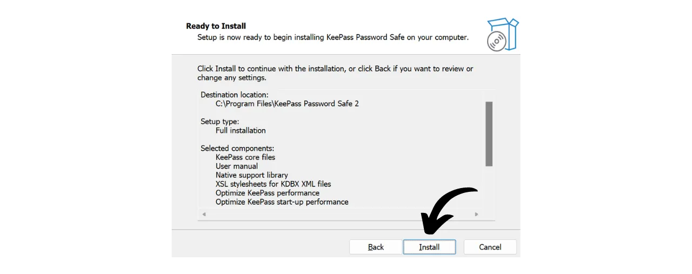
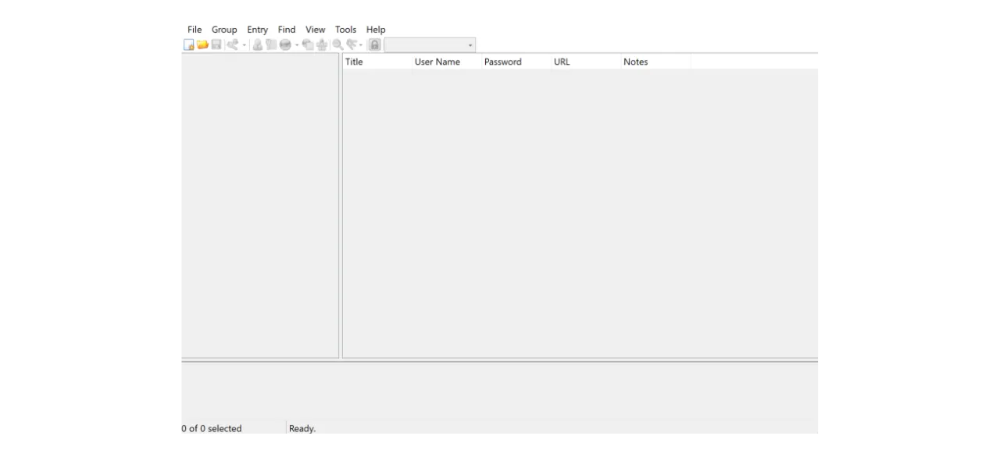
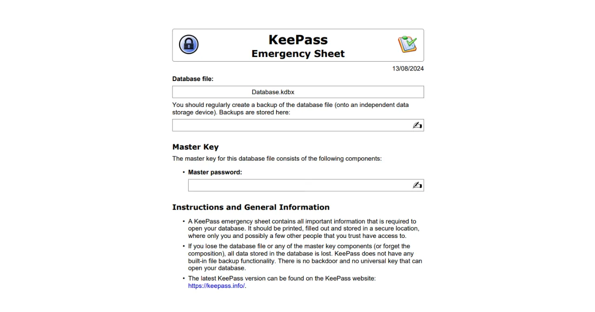
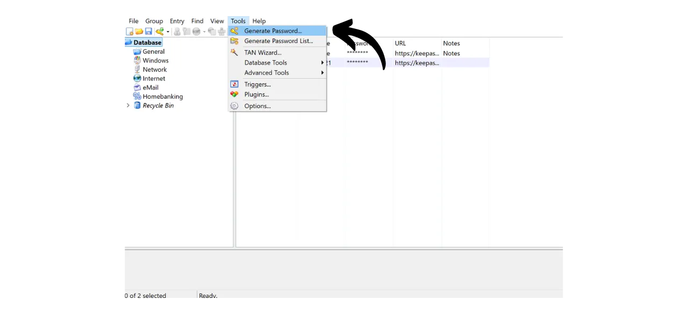
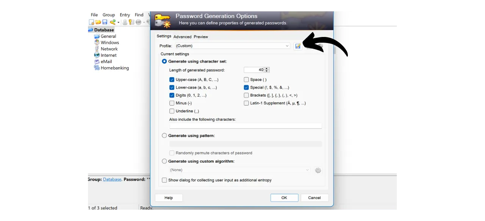
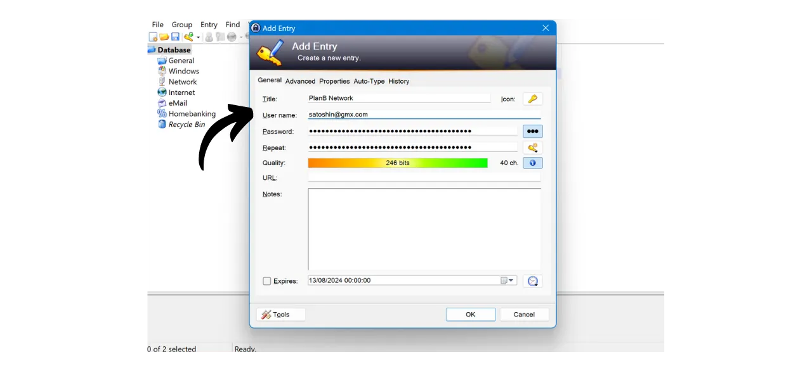
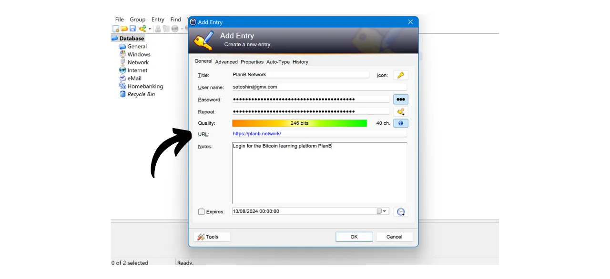

在数字时代，我们需要管理众多在线账户，这些账户涵盖了我们日常生活的各个方面，包括银行、金融平台、电子邮件、文件存储、健康、行政管理、社交网络、视频游戏等。

为了在这些账户上认证自己，我们通常使用一个标识符，通常是电子邮件地址，配以密码。面对无法记住大量唯一密码的困境，人们可能会被诱惑去重复使用相同的密码，或者稍微修改一个共同的基础密码以便于记忆。然而，这些做法严重威胁到你的账户安全。

密码的第一个原则是不重复使用。每个在线账户都应该受到一个独一无二且完全不同的密码的保护。这一点很重要，因为如果攻击者设法破解了你的一个密码，你不希望他们能够访问你的所有账户。为每个账户设置独特的密码可以隔离潜在的攻击并限制其范围。例如，如果你对一个视频游戏平台和你的电子邮件使用相同的密码，而该密码通过与游戏平台相关的钓鱼网站被破解，攻击者随后可以轻松访问你的电子邮件并控制你的所有其他在线账户。

第二个基本原则是密码的强度。如果一个密码很难通过暴力破解（即通过试错猜出）来破解，那么这个密码就被认为是强密码。这意味着你的密码必须尽可能随机，长度足够，且包含多样的字符（小写字母、大写字母、数字和符号）。

在日常生活中应用这两个密码安全原则（唯一性和强度）可能证明是困难的，因为几乎不可能记住我们所有账户的一个独特、随机且强大的密码。这就是密码管理器发挥作用的地方。

密码管理器生成并安全存储强密码，使你能够访问所有在线账户而无需单独记住它们。你只需要记住一个密码，即主密码，它让你能够访问管理器中保存的所有密码。使用密码管理器可以增强你的在线安全，因为它防止了密码的重复使用，并系统地生成随机密码。但它也通过集中访问你的敏感信息简化了你的账户日常使用。
在本教程中，我们将学习如何设置和使用本地密码管理器来增强你的在线安全。这里，我将向你介绍KeePass。然而，如果你是初学者，并希望拥有一个能够在多个设备之间同步的在线密码管理器，我推荐你跟随我们关于Bitwarden的教程：
https://planb.network/tutorials/computer-security/authentication/bitwarden-0532f569-fb00-4fad-acba-2fcb1bf05de9

---

*注意：密码管理器非常适合存储密码，但是**你绝不应该在其中存储你的比特币钱包的助记词！**记住，助记词应该专门保存在物理格式中，如纸张或金属。*

---

## KeePass简介

KeePass是一个免费且开源的密码管理器，非常适合那些想要一个免费且安全的本地管理解决方案的人。它是需要安装在你的PC上的软件，没有添加插件的情况下，不会与互联网通信。这与我们在之前的教程中介绍的Bitwarden有着根本的不同。与KeePass不同，Bitwarden允许跨多个设备同步，因此需要在在线服务器上存储你的密码。
默认情况下，KeePass不支持像Bitwarden这样的浏览器扩展；因此，您需要手动从软件中复制和粘贴您的密码。虽然这可能看起来是一个限制，但与使用自动填充相比，复制和粘贴密码是您在线安全的一个好习惯。
KeePass旨在同时轻便和易用，同时坚持高安全标准。该软件在本地加密您的数据库，以最佳保护您的凭证。KeePass也是唯一一个由法国网络安全机构ANSSI（法国网络安全局）验证的密码管理器。

KeePass的主要优势之一是其灵活性。它可以通过多种不同的方式使用，例如在USB驱动器上使用，无需在计算机上安装。此外，得益于其[插件环境](https://keepass.info/plugins.html)，KeePass可以定制以满足更具体的需求。

## 如何下载KeePass？

KeePass的安装过程取决于您使用的操作系统。对于Windows或Linux用户，安装相对简单。然而，如果您使用的是macOS，由于KeePass在.NET平台上开发，而该平台不被macOS直接支持，因此需要一个额外的步骤。因此，您需要配置一个兼容的环境，以允许KeePass在苹果设备上运行。

对于Debian/Ubuntu用户，在终端中输入以下命令：

```bash
sudo apt-get update
sudo apt-get install keepass2
```

对于Fedora：

```bash
sudo dnf install keepass
```

对于Arch Linux：

```bash
sudo pacman -S keepass
```

如果您使用的是Windows计算机，请转到[官方KeePass下载页面](https://keepass.info/download.html)，并下载安装程序的最新版本：

点击下载的文件运行它，然后按照设置向导的指示完成安装（见下一节）。

对于macOS用户，安装过程稍微复杂一些。如果您希望使用与Windows上的原版KeePass相同的版本，请按照以下说明操作。否则，您可以选择[KeePassXC](https://keepassxc.org/)，这是一个与macOS兼容的替代版本，提供了略有不同的界面。

要使用KeePass，您将需要一个用于.NET应用程序的运行时环境。我推荐安装Mono。转到[官方Mono页面](https://www.mono-project.com/download/stable/#download-mac)的"*macOS*"部分，并点击链接下载安装包（`.pkg`）。

打开下载的`.pkg`文件并按照说明安装Mono到您的Mac上。

接下来，转到官方KeePass网站并下载最新的便携版`.zip`格式。

下载`.zip`文件后，双击解压。您将得到一个包含几个文件的文件夹，包括`KeePass.exe`。打开终端，导航到KeePass文件夹（将`xx`替换为版本号）：

```bash
cd ~/Downloads/KeePass-2.xx
```

最后，使用Mono运行KeePass：

```bash
mono KeePass.exe
```

## 如何安装KeePass？

首次启动时，您可以选择界面语言。

接受许可协议的条款。
选择安装KeePass的文件夹。

您可以选择性地修改将要安装的应用程序组件。如果您有足够的空间，可以简单选择“*完整安装*”。

最后，您可以选择在桌面上添加快捷方式。

点击“*安装*”按钮。

等待安装过程，然后点击“*完成*”按钮。

## 如何配置KeePass？

现在，您已进入KeePass界面。
要创建您的第一个数据库，请点击“*文件*”标签。

然后点击“*新建*”菜单。

软件将创建一个新的数据库，您的密码将被存储在此。您需要选择此文件夹的位置。选择一个容易访问的位置。

之后，您应该考虑定期备份此文件夹，以避免因计算机丢失、损坏或被盗而丢失您的凭据。例如，您可以每周将数据库复制到USB闪存驱动器上。包含您数据库的文件名为`Database.kdbx`（该文档用您的主密码加密）。为了更多关于备份最佳实践的建议，我还推荐咨询这个其他教程：

https://planb.network/tutorials/computer-security/data/proton-drive-03cbe49f-6ddc-491f-8786-bc20d98ebb16

接下来是您主密码的选择。

正如我们在介绍中看到的，这个密码非常重要，因为它让您能够访问数据库中保存的所有其他密码。这个密码将用于加密`Database.kdbx`数据库。它呈现两个主要风险：丢失和泄露。如果您失去了这个密码的访问权限，您将无法再访问所有的凭据。如果您的密码被盗，除了加密的数据库外，攻击者还将能够访问您的所有账户。

为了最小化丢失的风险，我推荐在纸上物理备份您的主密码，并将其存放在安全的地方。如果可能的话，将这份备份密封在一个安全的信封中，定期确保没有其他人访问过它。

为了防止您的主密码被泄露，它必须非常强大。它应该尽可能长，使用各种字符，并且是随机选择的。在2024年，一个安全密码的最低推荐是13个字符，包括数字、小写和大写字母，以及符号，前提是密码是真正随机的。然而，我推荐选择至少20个字符的密码，包括所有可能的字符类型，以确保其安全性更长时间。

在专用框中输入您的主密码，并在下一个框中确认它，然后点击“*确定*”。

为您的数据库命名并在必要时添加描述。如果您创建了多个数据库，例如一个用于个人使用，另一个用于专业使用，这可以帮助您区分不同的数据库。

对于其他设置，我推荐保持默认选项。然后点击“*确定*”按钮。
KeePass随后会提供打印紧急情况表格的选项。

在这张表格上，你会找到你的数据库在文件中的位置，一个手动记录主密码的空间，以及访问它的指南。这张表格应该交给可信的人，因为它允许在出现问题时恢复对你的凭证的访问。

然而，由于这张表格通过揭示你的主密码提供了访问你的密码的途径，必须谨慎使用。建议至少将其保存在密封的信封中，这样可以定期检查以确保没有被查阅。你没有义务使用这张表格，并且可能会考虑为你的亲人考虑其他备份方法。

然后你可以访问你的密码管理器。

在你开始保存你的凭证之前，我建议更改密码生成设置。为此，请转到“*工具*”标签并选择“*生成密码...*”。

在这里，我建议你将生成的密码长度增加到40个字符。现在你有了一个密码管理器来记住它们，就没有必要在字符数量上吝啬了。此外，你不需要手写密码，因为你可以复制和粘贴它们。所以，对你来说拥有40个字符的非常长的密码没有什么不同，然而，它们的安全性大大增强了。我建议你这样做，并且还要勾选特殊字符框。

通过点击小保存图标来确认。

为你的密码配置文件添加一个名称。

## 如何使用KeePass保护你的账户？

要在你的KeePass管理器中注册一个新的凭证，只需点击带绿色箭头的钥匙图标。

在生成和保存窗口中，点击小钥匙图标并选择你的40字符密码配置文件。

输入此账户的用户名以及一个标题，以便您能在数据库中轻松找到它。  如果您希望以后使用快捷方式，也可以添加一个URL，必要时还可以添加备注。  如果一切符合您的满意，请点击“*OK*”保存密码。  您可以在KeePass管理器的首页找到您的密码。  要复制密码，只需双击它。它将在您的剪贴板上保留12秒，允许您在下次登录时将其粘贴到网站上。  如果您希望延长密码在剪贴板上保留的时间，请点击“*工具*”标签，然后点击“*选项...*”。  在“*安全性*”标签下，通过更改“*剪贴板自动清除时间*”框中的秒数来调整持续时间。然后点击“*OK*”保存您的更改。  在界面的左侧，您会注意到有几个文件夹用于组织您的密码。  您可以选择删除默认文件夹或通过右键点击并选择“*添加组...*”来添加新的文件夹。  为新文件夹选择一个名称并选择一个图标。您也可以以`.ico`格式导入您自己的图标。然后点击“*OK*”按钮完成文件夹的创建。  您的文件夹出现在左侧。  要将密码添加到文件夹，只需将其从数据库拖到所需的文件夹即可。  此功能帮助您组织密码管理器并更轻松地找到您的凭据。
查找密码的另一种方法是使用搜索功能。在界面顶部的搜索栏中输入您希望找到的标识符的标题，您将直接访问它。  请保持警惕，因为KeePass有点像文本文档。在关闭应用程序之前，如果您已经向管理器添加了新项目，请记得保存数据库。您可以通过点击保存图标或使用键盘快捷键`Ctrl+S`来实现。 
如果您让KeePass在后台保持打开状态，软件默认不会关闭。然而，如果您关闭KeePass或关闭计算机，重新打开软件时，您将需要输入主密码来解密数据库。 
这涵盖了KeePass的基本功能。当然，这个面向初学者的教程只是浅尝辄止地介绍了这款软件提供的许多选项。还有大量的附加功能等待探索，更不用说[社区开发的所有插件](https://keepass.info/plugins.html)可以进一步扩展KeePass的功能。

如果您有兴趣学习如何通过2FA大幅提高在线账户的安全性以避免黑客攻击，我还推荐查看这个其他教程：

https://planb.network/tutorials/computer-security/authentication/authy-a76ab26b-71b0-473c-aa7c-c49153705eb7
