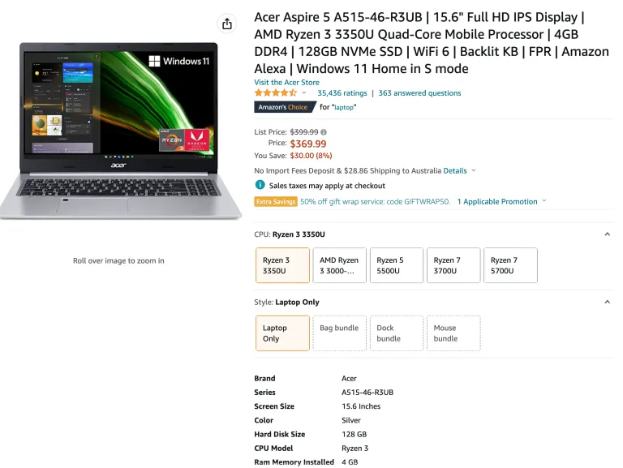
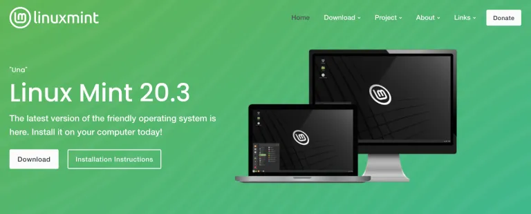
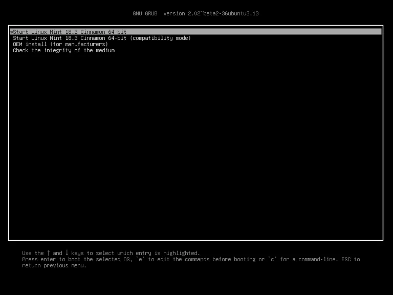

## Co je špatně na používání běžného počítače?

Při provádění transakcí s bitcoiny je ideální, pokud váš počítač neobsahuje žádný malware. To je samozřejmě jasné.

Pokud uchováváte vaši Bitcoin seed frázi (obvykle 12 nebo 24 slov) mimo počítač pomocí zařízení pro podepisování (například hardware peněženka - to je její hlavní účel), pak byste si mohli myslet, že mít "čistý" počítač není tak důležité - to ale není pravda.

Počítač napadený malwarem může číst vaše Bitcoin adresy, čímž vystaví váš zůstatek útočníkovi - nemohou vzít bitcoiny pouze tím, že znají adresu, ale mohou vidět, kolik jich máte, a na základě toho spočítat, zda jste pro ně atraktivním cílem. Mohou také nějakým způsobem zjistit, kde bydlíte, například, a vyžadovat od vás výkupné za to, že vám neublíží nebo neublíží vašim blízkým.

## Jaké je řešení?

Doporučuji většině lidí, kteří používají bitcoiny, používat speciální počítač bez malware (s přístupem k internetu) pro provádění Bitcoin transakcí. Navrhuji používat open-source operační systém jako Linux Mint, ale pokud musíte, použijte Windows nebo Mac - to je lepší než používat běžný, často používaný počítač, který nevyhnutelně obsahuje skrytý malware.

Jednou z překážek, na které lidé narazí, je instalace nového operačního systému na takové počítače. Tento průvodce má pomoci s tím.

Existuje mnoho variant Linuxu a já jsem jich několik vyzkoušel. Moje doporučení pro lidi používající bitcoiny je Linux Mint, protože je snadno instalovatelný, velmi rychlý (zejména při spouštění a vypínání), není přeplněný (každý další kus softwaru je riziko) a málokdy se mi na něm stalo, že by spadl nebo se choval divně (ve srovnání s jinými verzemi jako Ubuntu a Debian).

Někteří mohou být velmi odolní vůči novému operačnímu systému, preferují Windows nebo Mac OS. Chápu to, ale operační systémy Windows a Apple jsou uzavřeného typu, takže musíme věřit tomu, co dělají; nemyslím si, že je to dobrá politika, ale není to všechno nebo nic. Raději bych viděl, aby lidé používali speciální čerstvě nainstalovaný počítač s Windows nebo Mac OS, než dobře používaný počítač (na kterém se mohlo nahromadit jakékoliv malware). Ještě lepší je použít čerstvě nainstalovaný počítač s Linuxem, což je to, co budu ukazovat.

Pokud máte obavy z používání Linuxu kvůli neznámému, je to přirozené, ale stejně tak je přirozené věnovat čas učení se. Online je k dispozici mnoho informací. Zde je vynikající krátké video, které představuje základy příkazové řádky, které velmi doporučuji.
Vyberte si počítač

Začnu tím, co považuji za nejlepší možnost. Poté sdělím svůj názor na alternativy.

Ideální možnost:

Pokud si to můžete dovolit a pokud velikost vašeho bitcoinového portfolia to ospravedlňuje, doporučuji získat zcela nový základní model notebooku. Nejzákladnější modely, které se dnes vyrábějí, jsou dostatečně dobré pro to, co budou používány. Specifikace procesoru a RAM nejsou relevantní, protože budou všechny dostatečně dobré.

Vyhněte se:

- Jakémukoli tabletu kombinovanému, včetně Surface Pro
- Chromebookům – často mají příliš nízkou kapacitu úložiště
- Jakémukoli počítači s eMMC diskem; pokud má SSD disk, to je perfektní
- Macům – jsou drahé a hardware se v mém zkušenosti dobře neslučuje s Linuxovými operačními systémy
- Čemukoli repasovanému nebo použitému (i když to není absolutní překážka)

Místo toho hledejte notebook s Windows 11 (v současné době je Windows 11 nejnovější verze. Nebojte se, tohoto softwaru se zbavíme.). Hledal jsem na amazon.com "Windows 11 Laptop" a našel jsem tento dobrý příklad:

Cena tohoto výše uvedeného je dobrá. Specifikace jsou dostatečně dobré. Má vestavěnou kameru, kterou můžeme použít pro transakce QR kódem PSBT (jinak byste museli koupit USB kameru, abyste to mohli udělat). Nebojte se toho, že to není dobře známá značka (je levná). Pokud chcete lepší značku, bude to stát více, například:



Některé z levnějších mají pouze 64Gb místa na disku; nezkoušel jsem notebooky s tak malými disky – pravděpodobně je v pořádku mít 64Gb, ale může to být na hraně.

## Další možnosti – Tails

Tails je operační systém, který se spouští z USB flash disku a dočasně přebírá hardware jakéhokoli počítače. Používá pouze Tor spojení, takže byste museli být pohodlní s používáním Toru. Žádná data, která během vaší relace zapíšete do paměti, nejsou uložena na disk (začínáte vždy od nuly), pokud nenastavíte trvalé úložiště (na USB flash disku) – které zabezpečíte heslem.

Není to špatná možnost a je zdarma, ale pro naše účely je to trochu neohrabané. Instalace nového softwaru na něj není snadná. Jednou z dobrých vlastností je, že obsahuje Electrum, ale nevýhodou je, že jste ho neinstalovali sami. Ujistěte se, že použité USB má alespoň 8Gb.

Vaše flexibilita je snížena, pokud používáte Tails. Možná nebudete moci následovat různé návody pro nastavení toho, co potřebujete, a zprovoznění. Například, pokud budete následovat můj návod na instalaci Bitcoin Core, jsou potřeba úpravy, aby to fungovalo. Nemyslím si, že budu dělat specifický návod pro Tails, takže budete muset rozvíjet své dovednosti a udělat to sami.

Také si nejsem jistý, jak dobře budou hardware peněženky interagovat s tímto OS.

Přesto všechno, počítač s Tails pro Bitcoin transakce je pěkná další možnost a určitě pomůže vašim celkovým dovednostem soukromí naučit se používat Tails.

## Další možnosti – Live OS Boot

Je to velmi podobné Tails, kromě toho, že operační systém není zaměřen na soukromí. Základní způsob použití je nahrát na USB flash disk operační systém Linux dle vašeho výběru a nastavit počítač, aby se spouštěl z toho místo z interního disku. Jak to udělat, je vysvětleno později.

Výhodou je, že jste méně omezeni a věci budou fungovat bez pokročilých úprav.

Nejsem si jistý, jak dobře takový systém izoluje malware na stávajícím počítači od USB bootovacího disku, který používáte a který drží nový operační systém. Pravděpodobně to dělá dobře a pravděpodobně to není tak dobré jako Tails. Protože to nevím, mám raději dedikovaný notebook.
Další možnosti – Váš vlastní použitý notebook nebo stolní počítač

Použití použitého počítače není ideální, hlavně proto, že neznám vnitřní fungování sofistikovaného malwaru, ani zda je vymazání disku dostatečné k jeho odstranění. Pravděpodobně ano, ale nechci podcenit, jak chytrí mohou být zlovolní hackeři. Můžete se rozhodnout, já se nechci zavázat.

Pokud se rozhodnete použít starý stolní počítač místo starého notebooku, bude to v pořádku, kromě toho, že to bude trvale zabírat místo pro vaše pravděpodobně vzácné bitcoinové transakce; neměli byste ho používat pro nic jiného. Zatímco s notebookem ho můžete jednoduše odložit a dokonce schovat pro extra bezpečnost.

## Instalace Linux Mint na jakýkoli počítač
Zde jsou instrukce, jak odstranit jakýkoliv operační systém z vašeho nového laptopu a nainstalovat Linux Mint, ale můžete je přizpůsobit pro instalaci téměř jakékoli verze Linuxu na téměř jakýkoliv počítač.
Budeme používat jakýkoliv počítač k zápisu operačního systému na nějaké paměťové zařízení. Nezáleží na tom, které paměťové zařízení, pokud je kompatibilní s USB portem, a doporučuji minimálně 16Gb.

Získejte něco takového:


Nebo můžete použít něco jako toto:


Dále, přejděte na linuxmint.com



Najeďte myší na menu Download nahoře a poté klikněte na odkaz „Linux Mint 20.3“ nebo jakákoliv jiná nejnovější doporučená verze v době, kdy toto děláte.


Bude zde několik „příchutí“ na výběr. Pro postup podle tohoto průvodce zvolte „Cinnamon“. Klikněte na tlačítko Download.


Na další stránce můžete posunout dolů a vidět zrcadla (Mirrors jsou různé servery, které drží kopii souboru, který chceme). Můžete ověřit stažení pomocí SHA256 a gpg (doporučeno), ale to zde vysvětlovat nebudu, protože jsem na to již napsal průvodce.


Vyberte zrcadlo, které je vám nejbližší, a klikněte na jeho odkaz (zelený text ve sloupci zrcadla). Soubor začne stahovat – verze, kterou stahuji, má 2.1 gigabajtů.

Jakmile je staženo, můžete soubor zapsat na přenosné paměťové zařízení a udělat ho bootovatelným. Nejjednodušší způsob, jak to udělat, je použít Balena Etcher. Stáhněte si ho a nainstalujte, pokud ho nemáte.

Poté ho spusťte:


Klikněte na flash from file a vyberte soubor LinuxMint, který jste stáhli.

Poté klikněte na Select target. Ujistěte se, že je paměťové zařízení připojeno a že vybíráte správný disk, jinak můžete zničit obsah špatného disku!

Poté vyberte Flash! Možná budete muset zadat své heslo. Když je to dokončeno, disk pravděpodobně nebude čitelný vaším počítačem s Windows nebo Mac, protože byl přeměněn na Linuxové zařízení. Stačí ho vytáhnout.
Příprava cílového počítače

Zapněte nový laptop a během jeho spouštění držte stisknutou klávesu BIOS. Typicky je to F2, ale může to být F1, F8, F10, F11, F12 nebo Delete. Zkuste každou, dokud to nezjistíte, nebo vyhledejte na internetu model vašeho počítače a položte správnou otázku.

Např. „BIOS key Dell laptops“.

Každý počítač bude mít jiné menu BIOSu. Prozkoumejte a najděte, které menu vám umožní konfigurovat pořadí bootování. Pro naše účely chceme, aby počítač se pokusil bootovat z USB připojeného zařízení (pokud je nějaké připojeno), než se pokusí bootovat z interního pevného disku (jinak se načte Windows). Jakmile to nastavíte, možná budete muset uložit před odchodem nebo se to uloží automaticky.

Restartujte počítač a měl by se načíst z USB paměťového zařízení. Nyní můžeme nainstalovat Linux na interní disk a Windows bude odstraněn navždy.

Když se dostanete na následující obrazovku, vyberte „OEM install (pro výrobce)“. Pokud místo toho vyberete „Start Linux Mint“, získáte sezení Linux Mint načtené z paměťového zařízení, ale jakmile počítač vypnete, žádné vaše informace nebudou uloženy – je to v podstatě dočasné sezení, abyste to mohli vyzkoušet.

Budete provázeni grafickým průvodcem, který vám položí několik otázek, jež by měly být přímočaré. Jedna se bude týkat nastavení jazyka, další vašeho domácího internetového připojení a hesla. Pokud budete vyzváni k instalaci dalšího softwaru, odmítněte to. Když dojdete k otázce týkající se typu instalace, někteří lidé mohou váhat – musíte vybrat „Vymazat disk a nainstalovat Linux Mint“. Také nedoporučujeme šifrovat disk a nevybírat LVM.

Nakonec se dostanete na plochu. V tomto bodě ještě nejste úplně hotovi. Ve skutečnosti vystupujete jako výrobce (tj. někdo, kdo sestavuje počítač a nastavuje Linux pro zákazníka). Musíte dvakrát kliknout na ikonu na ploše „Nainstalovat Linux Mint“, abyste instalaci dokončili.


Nezapomeňte odstranit paměťový disk a poté restartovat. Po restartu budete operační systém používat poprvé jako nový uživatel. Gratulujeme.

Jedna z prvních věcí, které byste měli udělat (a pravidelně opakovat), je udržovat systém aktualizovaný.

Otevřete aplikaci Terminál a zadejte následující:

```bash
sudo apt-get update
```

stiskněte <enter>, potvrďte svou volbu, a poté tento příkaz:

```bash
sudo apt-get upgrade
```

stiskněte <enter> a potvrďte svou volbu.

Nechte to pracovat, může to trvat několik minut.

Dále rád instalují Tor (s velkým T):

```bash
sudo apt-get install tor
```

> _DODATEK: Linux Mint můžete také spustit z „OEM instalace“ (Ujistěte se, že jste připojeni k internetu, jinak by mohly nastat chyby). Pokud to uděláte, později budete muset kliknout na ikonu „poslat koncovému uživateli“, která by měla být na ploše. Poté restartujete a spustíte operační systém, jako byste počítač otevírali poprvé._

Tento průvodce vysvětlil, proč byste mohli potřebovat speciální počítač pro transakce s Bitcoinem, a jak na něm nainstalovat čistý operační systém Linux Mint.