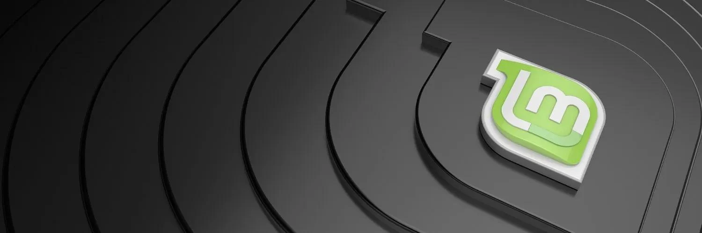

## अगर आप एक साधारण कंप्यूटर का इस्तेमाल करते हैं तो इसमें कोई बुराई नहीं है। साधारण कंप्यूटर भी बहुत सारे काम कर सकते हैं जैसे इंटरनेट ब्राउज़िंग, डॉक्यूमेंट बनाना, ईमेल भेजना आदि। लेकिन अगर आपको बहुत भारी सॉफ़्टवेयर चलाना है या गेमिंग करनी है, तो आपको एक पावरफुल कंप्यूटर की ज़रूरत हो सकती है। साधारण कंप्यूटर की अपनी सीमाएँ होती हैं, इसलिए यह इस बात पर निर्भर करता है कि आपको किस काम के लिए कंप्यूटर चाहिए।

Bitcoin लेनदेन करते समय, यह सबसे अच्छा होता है कि आपके कंप्यूटर में कोई मैलवेयर न हो। जाहिर है।

अगर आप अपने Bitcoin seed वाक्यांश (आमतौर पर 12 या 24 शब्द) को कंप्यूटर से दूर एक साइनिंग डिवाइस (जैसे Hardware Wallet - इसका मुख्य उद्देश्य) पर रखते हैं, तो आपको लग सकता है कि "साफ" कंप्यूटर होना इतना महत्वपूर्ण नहीं है - लेकिन यह सच नहीं है।

अगर आपके कंप्यूटर में मालवेयर आ गया है, तो वह आपके Bitcoin एड्रेस को पढ़ सकता है, जिससे आपका बैलेंस एक हमलावर के सामने उजागर हो सकता है। वे सिर्फ Address जानकर Bitcoin नहीं ले सकते, लेकिन वे देख सकते हैं कि आपके पास कितना है और यह तय कर सकते हैं कि आप उनके लिए एक योग्य लक्ष्य हैं या नहीं। वे यह भी पता लगा सकते हैं कि आप कहां रहते हैं, और फिर आपसे फिरौती वसूलने के लिए आपके नाखून या बच्चों को नुकसान पहुंचाने की धमकी दे सकते हैं।

## समाधान क्या है?

मैं ज्यादातर बिटकॉइन उपयोगकर्ताओं को प्रोत्साहित करता हूँ कि वे Bitcoin लेन-देन के लिए एक विशेष, मैलवेयर-मुक्त कंप्यूटर का उपयोग करें (जिसमें इंटरनेट की सुविधा हो)। मैं लोगों को सलाह देता हूँ कि वे एक ओपन-सोर्स ऑपरेटिंग सिस्टम जैसे लिनक्स मिंट का उपयोग करें, लेकिन अगर ज़रूरी हो तो विंडोज़ या मैक का भी उपयोग कर सकते हैं – यह एक सामान्य, अधिक उपयोग किए गए कंप्यूटर से बेहतर है जिसमें अक्सर मैलवेयर छिपा होता है।

एक बाधा जो लोगों को सामना करना पड़ता है, वह है ऐसे कंप्यूटरों पर नया ऑपरेटिंग सिस्टम इंस्टॉल करना। यह गाइड उसी में मदद करने के लिए है।

लिनक्स की कई किस्में हैं और मैंने कई को आजमाया है। बिटकॉइन उपयोगकर्ताओं के लिए मेरी सिफारिश है कि वे लिनक्स मिंट का उपयोग करें। यह इंस्टॉल करने में आसान है, बहुत तेज़ है (खासकर बूटअप और शटडाउन के समय), इसमें अनावश्यक सॉफ्टवेयर नहीं होते (हर अतिरिक्त सॉफ्टवेयर एक जोखिम होता है), और मेरे अनुभव में यह शायद ही कभी क्रैश हुआ है या अजीब व्यवहार किया है (अन्य संस्करणों जैसे उबंटू और डेबियन की तुलना में)।

कुछ लोग नए ऑपरेटिंग सिस्टम के प्रति बहुत प्रतिरोधी हो सकते हैं, वे विंडोज़ या मैक ओएस को पसंद करते हैं। मैं समझता हूँ, लेकिन विंडोज़ और एप्पल के ऑपरेटिंग सिस्टम बंद स्रोत हैं, इसलिए हमें उन पर भरोसा करना पड़ता है कि वे क्या कर रहे हैं; मुझे नहीं लगता कि यह एक अच्छी नीति है, लेकिन यह सब या कुछ भी नहीं है। मैं चाहूँगा कि लोग एक समर्पित, नए इंस्टॉल किए गए विंडोज़ या मैक ओएस कंप्यूटर का उपयोग करें बजाय एक पुराने कंप्यूटर के (जिसमें कौन जानता है कितना मालवेयर जमा हो चुका है)। इससे एक कदम बेहतर है एक नए इंस्टॉल किए गए लिनक्स कंप्यूटर का उपयोग करना, जिसे मैं दिखाने जा रहा हूँ।

अगर आप अनजान होने की वजह से Linux का इस्तेमाल करने में घबराते हैं, तो यह स्वाभाविक है, लेकिन कुछ समय सीखने में लगाना भी स्वाभाविक है। ऑनलाइन बहुत सारी जानकारी उपलब्ध है। यहाँ एक बेहतरीन छोटा वीडियो है जो कमांड लाइन के मूल बातें बताता है, जिसे मैं आपको देखने की सलाह देता हूँ।

कंप्यूटर चुनें।

मैं पहले उस विकल्प से शुरू करूंगा जो मुझे सबसे अच्छा लगता है। फिर मैं अन्य विकल्पों पर अपनी राय दूंगा।

आदर्श विकल्प:

मेरी सलाह है कि अगर आप इसे खरीद सकते हैं और आपके Bitcoin स्टैक का आकार इसे सही ठहराता है, तो एक नया एंट्री-लेवल लैपटॉप ले लें। आजकल बनाए जा रहे सबसे बुनियादी मॉडल भी उस काम को संभालने के लिए पर्याप्त होते हैं जिसके लिए आप इसे इस्तेमाल करने वाले हैं। प्रोसेसर और रैम की विशेषताएँ ज्यादा मायने नहीं रखतीं, क्योंकि वे सभी पर्याप्त अच्छे होंगे।

बचें:


- कोई भी टैबलेट कॉम्बो, जिसमें सर्फेस प्रो शामिल है।
- क्रोमबुक्स – अक्सर इनकी स्टोरेज क्षमता बहुत कम होती है।
- कोई भी कंप्यूटर जिसमें eMMC ड्राइव हो; अगर उसमें SSD ड्राइव है, तो वह बेहतरीन है।
- मैक – ये महंगे होते हैं, और मेरे अनुभव में इनका हार्डवेयर लिनक्स ऑपरेटिंग सिस्टम के साथ अच्छी तरह से मेल नहीं खाता।
- कुछ भी जो रीफर्बिश्ड हो या सेकंड हैंड हो (हालांकि यह पूरी तरह से सौदा खत्म करने वाला नहीं है)

इसके बजाय, एक Windows 11 लैपटॉप देखें (फिलहाल Windows 11 सबसे नया संस्करण है। हम उस सॉफ़्टवेयर से छुटकारा पा लेंगे, चिंता न करें।)। मैंने amazon.com पर "Windows 11 लैपटॉप" खोजा और यह अच्छा उदाहरण मिला:

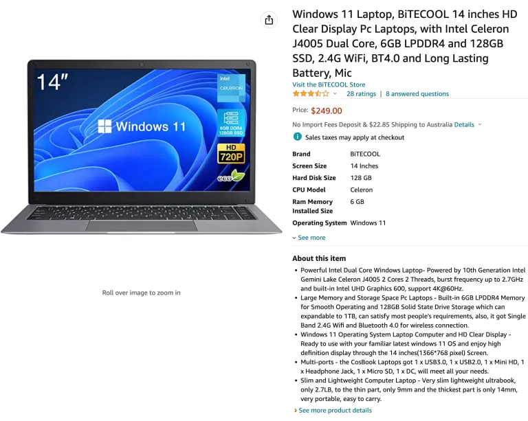

इसका ऊपर वाला दाम अच्छा है। इसके स्पेसिफिकेशन भी ठीक-ठाक हैं। इसमें एक बिल्ट-इन कैमरा है जिसका उपयोग हम QR कोड PSBT लेनदेन के लिए कर सकते हैं (वरना आपको इसके लिए एक USB कैमरा खरीदना पड़ेगा)। इस बात की चिंता मत करें कि यह कोई बहुत प्रसिद्ध ब्रांड नहीं है (यह सस्ता है)। अगर आप एक बेहतर ब्रांड चाहते हैं, तो उसकी कीमत ज्यादा होगी, जैसे:

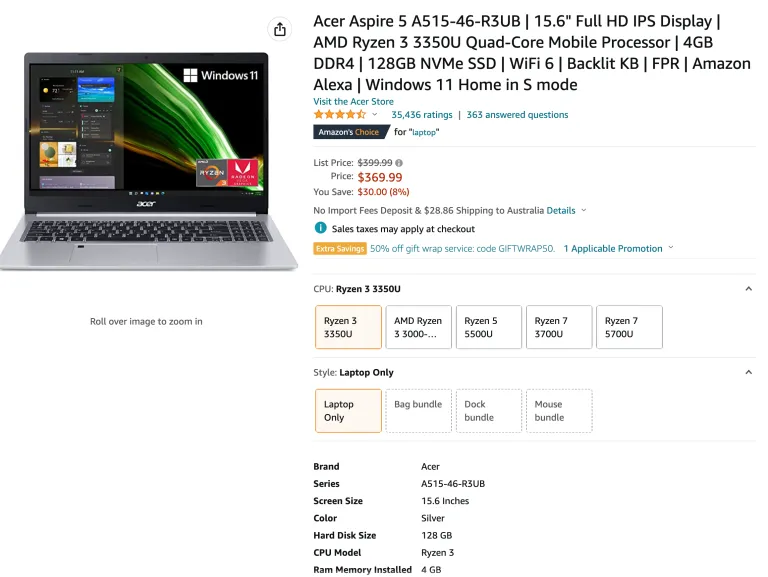

कुछ सस्ते लैपटॉप्स में केवल 64Gb की ड्राइव स्पेस होती है; मैंने इतने छोटे ड्राइव वाले लैपटॉप्स का परीक्षण नहीं किया है - 64Gb होना शायद ठीक है, लेकिन यह थोड़ा कम भी पड़ सकता है।

## अन्य विकल्प - टेल्स (पूंछ)

Tails एक ऑपरेटिंग सिस्टम है जो USB थंब ड्राइव से बूट होता है और किसी भी कंप्यूटर के हार्डवेयर को अस्थायी रूप से अपने नियंत्रण में ले लेता है। यह केवल Tor कनेक्शन का उपयोग करता है, इसलिए आपको Tor का उपयोग करने में सहज होना चाहिए। आपके सत्र के दौरान जो भी डेटा आप मेमोरी में लिखते हैं, वह ड्राइव पर सेव नहीं होता (यह हर बार नए सिरे से शुरू होता है) जब तक कि आप सेटिंग्स में बदलाव करके एक स्थायी स्टोरेज विकल्प नहीं बनाते (USB थंब ड्राइव पर) – जिसे आप एक पासवर्ड से लॉक करते हैं।

यह एक बुरा विकल्प नहीं है और यह मुफ्त है, लेकिन हमारे उद्देश्य के लिए यह थोड़ा जटिल है। इस पर नया सॉफ़्टवेयर इंस्टॉल करना आसान नहीं है। एक अच्छी बात यह है कि इसमें Electrum पहले से आता है, लेकिन इसका नकारात्मक पहलू यह है कि आपने इसे खुद इंस्टॉल नहीं किया। सुनिश्चित करें कि आप जो USB ड्राइव इस्तेमाल कर रहे हैं, वह कम से कम 8Gb की हो।

अगर आप Tails का इस्तेमाल करते हैं, तो आपकी लचीलापन कम हो जाती है। हो सकता है कि आप विभिन्न गाइड्स का पालन करके जो आपको चाहिए उसे सेटअप न कर पाएं और उसे सही से काम में न ला पाएं। उदाहरण के लिए, अगर आप मेरे Bitcoin Core इंस्टॉल करने के गाइड का पालन करते हैं, तो इसे काम करने के लिए कुछ बदलावों की जरूरत होती है। मुझे नहीं लगता कि मैं Tails के लिए कोई विशेष गाइड बनाऊंगा, इसलिए आपको अपनी स्किल्स को बढ़ाना होगा और इसे खुद ही करना होगा।

मुझे भी यह नहीं पता कि हार्डवेयर वॉलेट इस ऑपरेटिंग सिस्टम के साथ कितनी अच्छी तरह से काम करेंगे।

यह सब कहने के बाद, Bitcoin लेन-देन के लिए एक Tails कंप्यूटर एक अच्छा अतिरिक्त विकल्प है, और Tails का उपयोग करना सीखने से निश्चित रूप से आपकी समग्र गोपनीयता कौशल में मदद मिलेगी।

## अन्य विकल्प - लाइव OS बूट

यह Tails के बहुत समान है, बस फर्क इतना है कि यह ऑपरेटिंग सिस्टम गोपनीयता के लिए समर्पित नहीं है। इसे इस्तेमाल करने का मूल तरीका यह है कि आप अपनी पसंद के Linux ऑपरेटिंग सिस्टम को एक USB ड्राइव पर फ्लैश करें और कंप्यूटर को आंतरिक ड्राइव के बजाय उससे बूट करने के लिए सेट करें। इसे कैसे करना है, यह आगे समझाया गया है।

फायदा यह है कि आप कम बंधनों में रहते हैं और चीजें बिना किसी जटिल समायोजन के भी काम करेंगी।

मुझे यह नहीं पता कि ऐसा सिस्टम मौजूदा कंप्यूटर पर मालवेयर को उस USB बूट ड्राइव से कितना अच्छी तरह से अलग करता है, जिसमें नया ऑपरेटिंग सिस्टम होता है। यह शायद अच्छा काम करता होगा, लेकिन शायद Tails जितना अच्छा नहीं होगा। क्योंकि मुझे यकीन नहीं है, मेरी पसंद एक समर्पित लैपटॉप है।

अन्य विकल्प - आपका खुद का इस्तेमाल किया हुआ लैपटॉप या डेस्कटॉप कंप्यूटर।

पुराना कंप्यूटर इस्तेमाल करना आदर्श नहीं है, खासकर इसलिए क्योंकि मुझे जटिल मैलवेयर के अंदरूनी कामकाज की जानकारी नहीं है, और न ही यह पता है कि ड्राइव को फॉर्मेट करना इसे हटाने के लिए पर्याप्त है या नहीं। शायद यह पर्याप्त हो, लेकिन मैं चालाक हैकर्स की चतुराई को कम नहीं आंकना चाहता। आप तय कर सकते हैं, मैं कोई निर्णय नहीं लेना चाहता।

अगर आप पुराने लैपटॉप की जगह पुराने डेस्कटॉप का इस्तेमाल करना चुनते हैं, तो यह ठीक है, बस यह आपके शायद-कम इस्तेमाल होने वाले Bitcoin लेन-देन के लिए स्थायी रूप से जगह घेर लेगा; आपको इसे किसी और काम के लिए नहीं इस्तेमाल करना चाहिए। जबकि लैपटॉप के साथ, आप इसे बस कहीं रख सकते हैं, और अतिरिक्त सुरक्षा के लिए छुपा भी सकते हैं।

## किसी भी कंप्यूटर पर लिनक्स मिंट इंस्टॉल करना

ये निर्देश आपके नए लैपटॉप से किसी भी ऑपरेटिंग सिस्टम को हटाकर Linux Mint इंस्टॉल करने के लिए हैं, लेकिन आप इन्हें किसी भी कंप्यूटर पर लगभग किसी भी Linux वर्जन को इंस्टॉल करने के लिए भी अनुकूलित कर सकते हैं।

हम किसी भी कंप्यूटर का उपयोग करके ऑपरेटिंग सिस्टम को किसी भी प्रकार की मेमोरी स्टिक पर फ्लैश करने जा रहे हैं। यह मायने नहीं रखता कि कौन सी मेमोरी स्टिक है, बस यह USB पोर्ट के साथ संगत होनी चाहिए, और मैं सुझाव देता हूँ कि कम से कम 16Gb की हो।

इनमें से एक चीज़ ले लो:

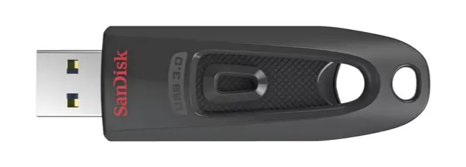

या आप कुछ ऐसा उपयोग कर सकते हैं:

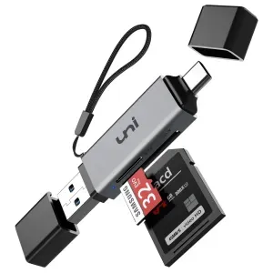

अब linuxmint.com पर जाएं।

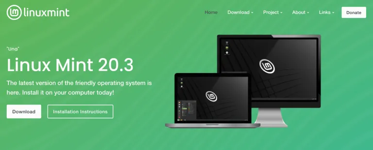

ऊपर दिए गए डाउनलोड मेन्यू पर माउस ले जाएं और फिर "Linux Mint 20.3" या उस समय की नवीनतम अनुशंसित संस्करण लिंक पर क्लिक करें।

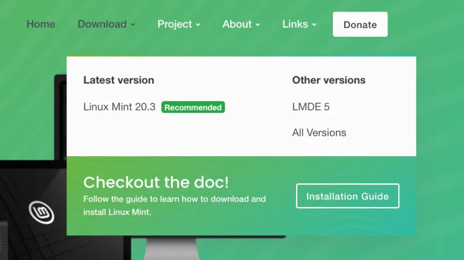

आपके पास चुनने के लिए कुछ "फ्लेवर" होंगे। इस गाइड के साथ चलने के लिए "सिनेमन" चुनें। डाउनलोड बटन पर क्लिक करें।

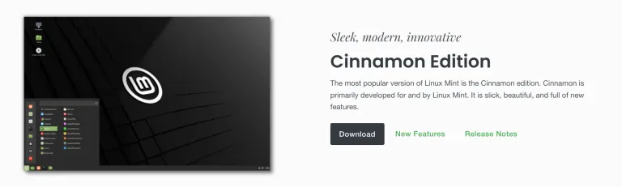

अगले पेज पर, आप नीचे स्क्रॉल करके मिरर्स देख सकते हैं (मिरर्स वे विभिन्न सर्वर होते हैं जिनमें उस फाइल की एक कॉपी होती है जिसे हम डाउनलोड करना चाहते हैं)। आप SHA256 और gpg का उपयोग करके डाउनलोड को सत्यापित कर सकते हैं (यह अनुशंसित है), लेकिन मैं यहाँ इसे समझाने से छोड़ रहा हूँ क्योंकि मैंने पहले से ही इस पर गाइड्स लिखी हैं।

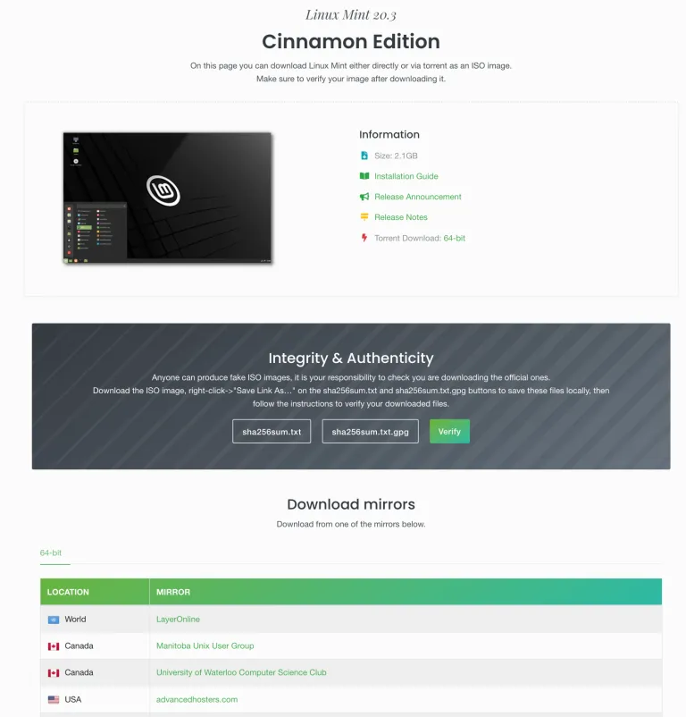

अपने सबसे नज़दीकी मिरर को चुनें और उसके लिंक (मिरर कॉलम में Green टेक्स्ट) पर क्लिक करें। फाइल डाउनलोड होना शुरू हो जाएगी - मैं जो वर्जन डाउनलोड कर रहा हूँ, वह 2.1 गीगाबाइट्स का है।

डाउनलोड करने के बाद, आप उस फाइल को एक पोर्टेबल मेमोरी डिवाइस में फ्लैश कर सकते हैं और उसे बूटेबल बना सकते हैं। ऐसा करने का सबसे आसान तरीका है Balena Etcher का उपयोग करना। अगर आपके पास यह नहीं है, तो इसे डाउनलोड और इंस्टॉल कर लें।

फिर इसे चलाओ:

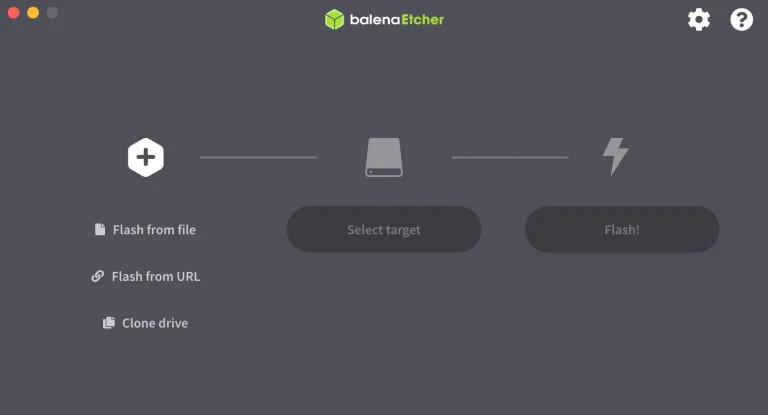

फ्लैश फाइल पर क्लिक करें, और जो LinuxMint फाइल आपने डाउनलोड की है उसे चुनें।

फिर "Select target" पर क्लिक करें। सुनिश्चित करें कि मेमोरी डिवाइस प्लग इन है और सही ड्राइव का चयन कर रहे हैं, नहीं तो आप गलती से गलत ड्राइव की सामग्री को नष्ट कर सकते हैं!

उसके बाद, Flash चुनें! आपको अपना पासवर्ड डालने की ज़रूरत पड़ सकती है। जब यह पूरा हो जाए, तो हो सकता है कि आपका ड्राइव आपके Windows या Mac कंप्यूटर द्वारा पढ़ा न जा सके क्योंकि यह एक Linux डिवाइस में बदल चुका होगा। बस इसे बाहर निकाल लें।

लक्ष्य कंप्यूटर को तैयार करना

नए लैपटॉप को चालू करें, और जब यह पावर अप हो रहा हो, तो BIOS कुंजी को दबाए रखें। यह आमतौर पर F2 होती है, लेकिन यह F1, F8, F10, F11, F12 या Delete भी हो सकती है। सही कुंजी पाने के लिए एक-एक करके कोशिश करें, या अपने कंप्यूटर के मॉडल का नाम इंटरनेट पर खोजें और सही सवाल पूछें।

उदाहरण के लिए "डेल लैपटॉप के लिए BIOS कुंजी"।

हर कंप्यूटर का BIOS मेनू अलग होता है। आपको यह देखना होगा कि कौन सा मेनू आपको बूट ऑर्डर को कॉन्फ़िगर करने की अनुमति देता है। हमारे उद्देश्य के लिए, हम चाहते हैं कि कंप्यूटर पहले USB से जुड़े डिवाइस से बूट करने की कोशिश करे (अगर कोई जुड़ा हुआ है), उसके बाद ही आंतरिक Hard ड्राइव से बूट करने की कोशिश करे (अन्यथा Windows लोड हो जाएगा)। एक बार जब आप इसे सेट कर लें, तो आपको बाहर निकलने से पहले इसे सेव करना पड़ सकता है या यह अपने आप सेव हो सकता है।

कंप्यूटर को रीबूट करें और यह USB मेमोरी डिवाइस से लोड होना चाहिए। हम आंतरिक ड्राइव पर लिनक्स इंस्टॉल नहीं कर सकते और विंडोज़ हमेशा के लिए हटा दिया जाएगा।

जब आप अगले स्क्रीन पर पहुँचें, तो "OEM install (for manufacturers)" चुनें। अगर आप इसके बजाय "Start Linux Mint" चुनते हैं, तो आपको मेमोरी डिवाइस से लोड किया हुआ एक Linux Mint सेशन मिलेगा, लेकिन जैसे ही आप कंप्यूटर बंद करेंगे, आपकी कोई भी जानकारी सेव नहीं होगी – यह मूल रूप से एक अस्थायी सेशन है ताकि आप इसे आज़मा सकें।

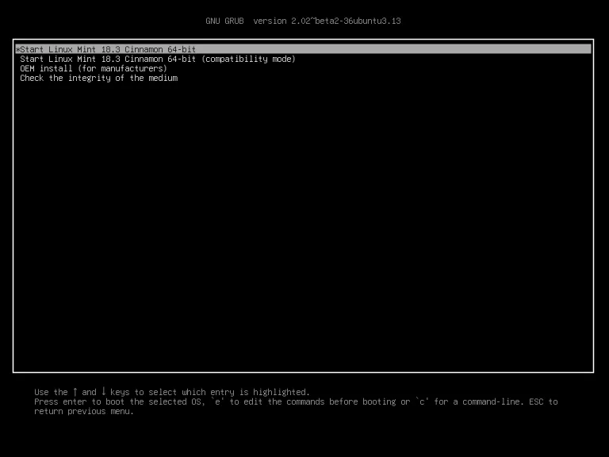

आपको एक ग्राफिकल विजार्ड के माध्यम से ले जाया जाएगा जो आपसे कुछ सीधे-सादे सवाल पूछेगा। एक सवाल भाषा सेटिंग्स के बारे में होगा, दूसरा आपके घर के इंटरनेट नेटवर्क कनेक्शन और पासवर्ड के बारे में। अगर अतिरिक्त सॉफ़्टवेयर इंस्टॉल करने के लिए कहा जाए, तो उसे अस्वीकार कर दें। जब आप इंस्टॉलेशन प्रकार के सवाल पर पहुँचें, तो कुछ लोग हिचकिचा सकते हैं – आपको "डिस्क मिटाएं और Linux Mint इंस्टॉल करें" चुनना होगा। साथ ही, ड्राइव को एन्क्रिप्ट न करें और LVM का चयन न करें।

आखिरकार, आप डेस्कटॉप तक पहुँच जाएंगे। इस समय, आपका काम पूरी तरह से खत्म नहीं हुआ है। आप वास्तव में निर्माता की तरह काम कर रहे हैं (यानी कोई व्यक्ति जो कंप्यूटर बना रहा है और ग्राहक के लिए लिनक्स सेट कर रहा है)। आपको डेस्कटॉप पर "Install Linux Mint" आइकन पर डबल क्लिक करना होगा ताकि इसे अंतिम रूप दिया जा सके।

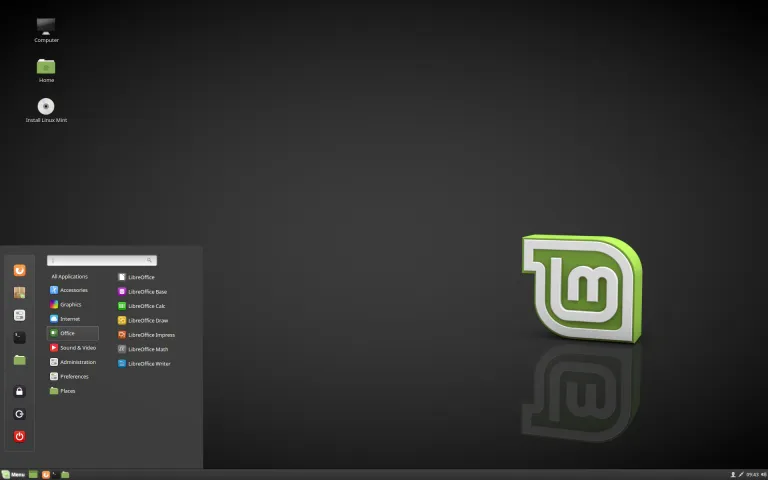

याद रखें कि मेमोरी स्टिक को निकाल लें, और फिर कंप्यूटर को रीबूट करें। रीबूट के बाद, आप पहली बार एक नए उपयोगकर्ता के रूप में ऑपरेटिंग सिस्टम का उपयोग करेंगे। बधाई हो।

सबसे पहले जो काम करना चाहिए (और इसे नियमित रूप से करना चाहिए), वह है सिस्टम को अपडेट रखना।

टर्मिनल एप्लिकेशन खोलें, और निम्नलिखित टाइप करें:

```bash
sudo apt-get update
```

<enter> दबाएं, अपनी पसंद की पुष्टि करें, और फिर यह कमांड दर्ज करें:

```bash
sudo apt-get upgrade
```

<एंटर> दबाएं और अपनी पसंद की पुष्टि करें।

इसे अपना काम करने दो, इसमें कुछ मिनट लग सकते हैं।

अगला, मैं Tor इंस्टॉल करना पसंद करता हूँ (यह केस सेंसिटिव है):

```bash
sudo apt-get install tor
```

**प्रो टिप:** आप Linux Mint को "OEM इंस्टॉल" से भी बूट कर सकते हैं (सुनिश्चित करें कि आप इंटरनेट से जुड़े हैं, नहीं तो आपको त्रुटियाँ मिल सकती हैं)। अगर आप ऐसा करते हैं, तो बाद में आपको "शिप टू एंड यूजर" आइकन पर क्लिक करना होगा जो डेस्कटॉप पर होना चाहिए। इसके बाद आप कंप्यूटर को फिर से चालू करें और ऑपरेटिंग सिस्टम को ऐसे शुरू करें जैसे आप पहली बार कंप्यूटर खोल रहे हों।

इस गाइड में बताया गया है कि आपको Bitcoin लेनदेन के लिए एक समर्पित कंप्यूटर की आवश्यकता क्यों हो सकती है, और उस पर एक नया Linux Mint ऑपरेटिंग सिस्टम कैसे स्थापित करें।