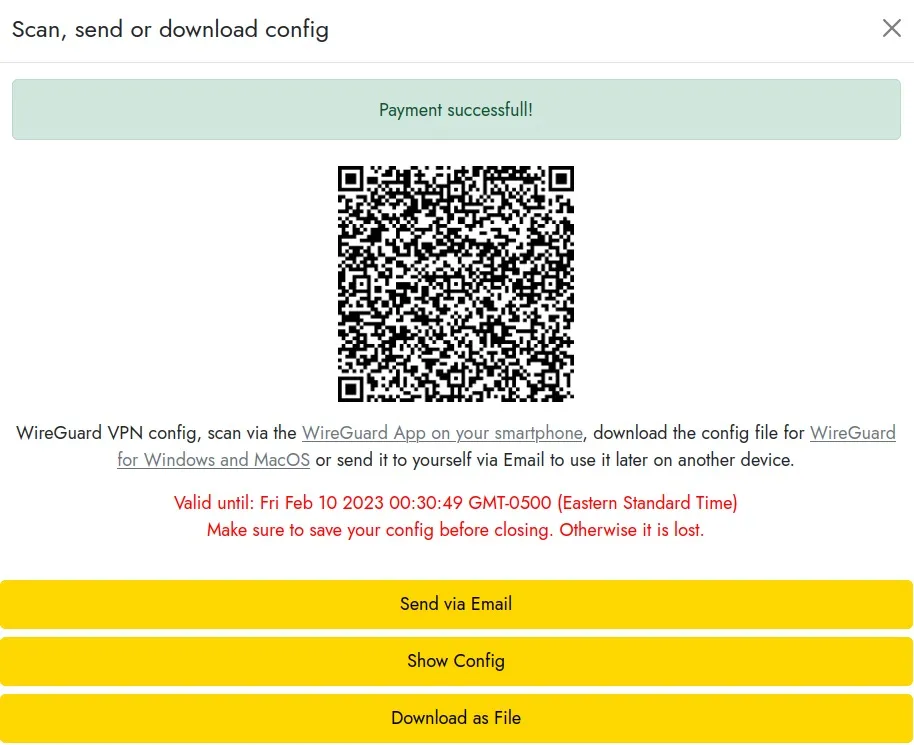

LN VPN एक ऐसा कस्टमाइज़ेबल VPN सेवा है जो केवल लाइटनिंग पेमेंट्स को स्वीकार करता है। आज, मैं आपको दिखाऊंगा कि इसे कैसे उपयोग करें और इंटरनेट ब्राउज़ करते समय कम से कम निशान कैसे छोड़ें।

बहुत सारे अच्छे VPN सेवा प्रदाता हैं, और हमने इस लेख में उनका विस्तृत समीक्षा किया है (हाइपरलिंक)। लेकिन LN VPN सबसे अलग है, और हम इसे आपको बताने का मौका नहीं छोड़ सकते थे।

ज्यादातर VPN सेवा प्रदाता जैसे ProtonVPN और Mullvad बिटकॉइन से भुगतान करने का विकल्प देते हैं, लेकिन इसके लिए आपको एक खाता बनाना होता है और लंबी या छोटी अवधि के लिए एक योजना खरीदनी होती है, जो हर किसी के बजट में फिट नहीं बैठती।

LN VPN आपको केवल एक घंटे के लिए भी VPN का उपयोग करने की सुविधा देता है, और यह Lightning Network के माध्यम से Bitcoin भुगतान के कार्यान्वयन के कारण संभव हो पाता है। त्वरित और गुमनाम, लाइटनिंग भुगतान माइक्रोपेमेंट्स के लिए एक नई दुनिया के दरवाजे खोलते हैं।

नोट💡: **यह गाइड बताता है कि Linux Ubuntu 22.04 LTS सिस्टम से LN VPN का उपयोग कैसे करें।**

## पूर्वापेक्षाएँ: वायरगार्ड

सरल शब्दों में, Wireguard का उपयोग आपके कंप्यूटर और दूरस्थ सर्वर के बीच एक सुरक्षित सुरंग बनाने के लिए किया जाता है, जिसके माध्यम से आप इंटरनेट ब्राउज़ करेंगे। इस सर्वर का IP Address आपके रूप में दिखाई देगा जब तक आप इस गाइड का पालन करके Contract नहीं कर लेते।

वायरगार्ड इंस्टॉलेशन गाइड का आधिकारिक लिंक: https://www.wireguard.com/install/

```
Wireguard installation
$ sudo apt-get update
$ sudo apt install wireguard
```

## पूर्वापेक्षाएँ: लाइटनिंग Bitcoin Wallet

अगर आपके पास अभी तक Lightning Bitcoin या Wallet नहीं है, तो चिंता की कोई बात नहीं है। हमने आपके लिए यहाँ एक बहुत ही सरल गाइड तैयार किया है। (LN ट्यूटोरियल सेक्शन आपकी मदद कर सकता है)

## चरण 1: Contract एक पट्टा (लीज़)

https://lnvpn.com पर जाएं, वहां आपको VPN टनल के एग्जिट IP के देश और अवधि का चयन करना होगा। जब ये सेटिंग्स कर लें, तो "Pay with lightning" पर क्लिक करें।


एक लाइटनिंग Invoice प्रदर्शित किया जाएगा, और आपको बस इसे अपने लाइटनिंग Wallet से स्कैन करना है।

जब Invoice का भुगतान हो जाए, तो आपको अपने वायरगार्ड कॉन्फ़िगरेशन सेटिंग्स के जनरेट होने के लिए कुछ सेकंड से लेकर दो मिनट तक इंतजार करना होगा। अगर इसमें थोड़ा ज्यादा समय लगता है, तो घबराएं नहीं, हमने यह प्रक्रिया दर्जनों बार की है, और कभी-कभी इसमें थोड़ा ज्यादा समय लग जाता है।

आपको अक्टूबर 2023 तक के डेटा पर प्रशिक्षित किया गया है।

अगली स्क्रीन दिखाई देगी और आपको बस "डाउनलोड ऐज़ फाइल" पर क्लिक करना है ताकि आप अपनी कॉन्फ़िग फाइल प्राप्त कर सकें। इस फाइल का नाम कुछ इस तरह होगा: lnvpn-xx-xx.conf, जहां "xx" मौजूदा तारीख के अनुसार होगा।



## चरण 2: सुरंग को सक्रिय करें

सबसे पहले, आपको पिछले चरण में प्राप्त की गई कॉन्फ़िग फाइल का नाम बदलना होगा ताकि उसे Wireguard द्वारा स्वचालित रूप से पहचाना जा सके।

अपने डाउनलोड फोल्डर में जाएं, चाहे वह टर्मिनल विंडो में हो या फाइल एक्सप्लोरर के साथ, और lnvpn-xx-xx.conf फाइल का नाम बदलकर wg0.conf कर दें, इस तरह:

```
$ sudo ln -s usrbin/resolvectl usrlocal/bin/resolvconf
$ sudo wg-quick up ~/Downloads/wg0.conf
```

लो जी! सुरंग चालू हो गई है!

## चरण 3: सत्यापन करें

आप किसी ऑनलाइन सेवा जैसे whatismyip का उपयोग करके यह सत्यापित कर सकते हैं कि आपका सार्वजनिक IP Address अब वही है जो आपने अभी सक्रिय किए गए VPN से प्राप्त किया है।

## चरण 4: अक्षम करें

जब आपकी लीज़ समाप्त हो जाती है, तो आपको इंटरनेट का एक्सेस फिर से पाने के लिए कनेक्शन को डिसेबल करना होगा। इसके बाद, जब भी आप LN VPN के साथ लीज़ स्थापित करना चाहें, तो आप स्टेप 1 से 3 को दोहरा सकते हैं।

सुरंग को बंद कर दो।

```
$ sudo ip link delete dev wg0
```

तो लीजिए, अब आप जान गए हैं कि LN VPN, एक अनोखी VPN सेवा, का उपयोग कैसे करना है!