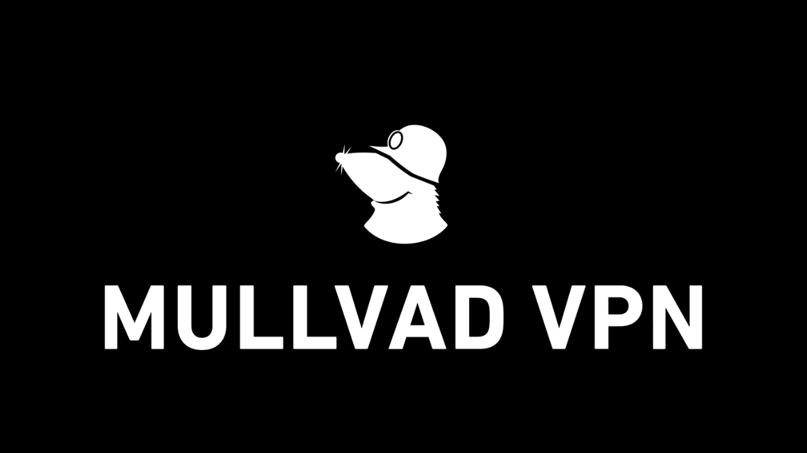

VPN ("*वर्चुअल प्राइवेट नेटवर्क*") एक सेवा है जो आपके फोन या कंप्यूटर और एक दूरस्थ सर्वर के बीच एक सुरक्षित और एन्क्रिप्टेड कनेक्शन स्थापित करती है, जिसे एक VPN प्रदाता द्वारा प्रबंधित किया जाता है।

तकनीकी रूप से, जब आप एक VPN से कनेक्ट होते हैं, तो आपकी इंटरनेट ट्रैफिक एक एन्क्रिप्टेड सुरंग के माध्यम से VPN सर्वर तक पुनर्निर्देशित होती है। इस प्रक्रिया से इंटरनेट सेवा प्रदाताओं (ISPs) या दुर्भावनापूर्ण तत्वों जैसे तीसरे पक्ष के लिए आपके डेटा को इंटरसेप्ट करना या पढ़ना मुश्किल हो जाता है। VPN सर्वर फिर एक मध्यस्थ के रूप में कार्य करता है जो आपकी ओर से उस सेवा से कनेक्ट होता है जिसका आप उपयोग करना चाहते हैं। यह आपके कनेक्शन को एक नया IP Address असाइन करता है, जो उन साइटों से आपके वास्तविक IP Address को छिपाने में मदद करता है जिन्हें आप विजिट करते हैं। हालांकि, कुछ ऑनलाइन विज्ञापनों के विपरीत, VPN का उपयोग करने से आपको इंटरनेट पर गुमनाम रूप से ब्राउज़ करने की अनुमति नहीं मिलती है, क्योंकि यह VPN प्रदाता पर एक स्तर के विश्वास की आवश्यकता होती है जो आपकी सभी ट्रैफिक देख सकता है।

VPN का उपयोग करने के कई फायदे हैं। सबसे पहले, यह आपके ऑनलाइन गतिविधियों की प्राइवेसी को ISPs या सरकारों से बचाता है, बशर्ते कि VPN प्रदाता आपकी जानकारी साझा न करे। दूसरा, यह आपके डेटा को सुरक्षित करता है, खासकर जब आप सार्वजनिक Wi-Fi नेटवर्क से जुड़े होते हैं, जो MITM ("**मैन-इन-द-मिडल**") हमलों के लिए असुरक्षित होते हैं। तीसरा, आपके IP Address को छुपाकर, VPN आपको भौगोलिक प्रतिबंधों और सेंसरशिप को पार करने की अनुमति देता है, जिससे आप उस सामग्री तक पहुंच सकते हैं जो अन्यथा आपके क्षेत्र में उपलब्ध नहीं होती या ब्लॉक होती।

जैसा कि आप देख सकते हैं, VPN आपके इंटरनेट ट्रैफिक की निगरानी का जोखिम VPN प्रदाता पर स्थानांतरित कर देता है। इसलिए, जब आप अपने VPN प्रदाता का चयन कर रहे हों, तो यह देखना महत्वपूर्ण है कि पंजीकरण के लिए कौन-कौन सी व्यक्तिगत जानकारी मांगी जा रही है। यदि प्रदाता आपके फोन नंबर, ईमेल Address, बैंक कार्ड विवरण, या इससे भी बुरा, आपके पोस्टल Address जैसी जानकारी मांगता है, तो आपके ट्रैफिक को आपकी पहचान से जोड़ने का जोखिम बढ़ जाता है। अगर प्रदाता से कोई समझौता हो जाता है या कानूनी रूप से डेटा जब्त कर लिया जाता है, तो आपके ट्रैफिक को आपकी व्यक्तिगत जानकारी से जोड़ना आसान हो जाएगा। इसलिए, यह सलाह दी जाती है कि ऐसे प्रदाता का चयन करें जो किसी भी व्यक्तिगत जानकारी की मांग न करे और गुमनाम भुगतान स्वीकार करे, जैसे कि बिटकॉइन के माध्यम से।

इस ट्यूटोरियल में, मैं एक सरल, प्रभावी और किफायती VPN समाधान प्रस्तुत करूंगा, जिसके उपयोग के लिए किसी भी व्यक्तिगत जानकारी की आवश्यकता नहीं होती है।

## मुलवाड वीपीएन का परिचय

Mullvad VPN एक स्वीडिश सेवा है जो अपनी उपयोगकर्ता गोपनीयता के लिए जानी जाती है। मुख्यधारा के VPN प्रदाताओं के विपरीत, Mullvad साइन-अप के समय कोई व्यक्तिगत जानकारी नहीं मांगता। आपको ईमेल, फोन नंबर या नाम देने की जरूरत नहीं होती; इसके बजाय, Mullvad आपको एक गुमनाम खाता नंबर देता है जिसका उपयोग भुगतान और सेवा का उपयोग करने के लिए किया जाता है। इसके अलावा, Mullvad का दावा है कि वे अपने सर्वरों से गुजरने वाली किसी भी गतिविधि का रिकॉर्ड नहीं रखते।

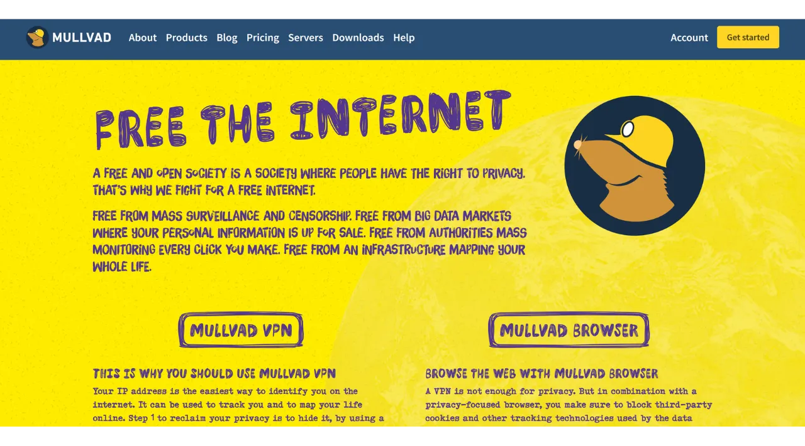

भुगतान के लिए, क्रेडिट कार्ड की जानकारी देना जरूरी नहीं है, क्योंकि Mullvad Bitcoin भुगतान स्वीकार करता है (उनकी आधिकारिक साइट पर केवल ऑनचेन, लेकिन एक अनौपचारिक तरीका भी है जिससे आप लाइटनिंग के जरिए भुगतान कर सकते हैं)। वे डाक के माध्यम से नकद भुगतान भी स्वीकार करते हैं।

Mullvad VPN अपनी पारदर्शिता और सुरक्षा के लिए भी जाना जाता है। उनका सॉफ्टवेयर ओपन-सोर्स है, और वे नियमित रूप से स्वतंत्र सुरक्षा ऑडिट करवाते हैं ताकि उनके एप्लिकेशन और इंफ्रास्ट्रक्चर का मूल्यांकन किया जा सके, जिसके परिणाम [उनकी वेबसाइट पर प्रकाशित किए जाते हैं](https://mullvad.net/fr/blog/tag/audits)। Mullvad के पीछे की कंपनी स्वीडन में स्थित है, जो अपनी सख्त गोपनीयता कानूनों के लिए प्रसिद्ध है। वे केवल स्वयं-होस्टेड सर्वरों का उपयोग करते हैं, जिससे थर्ड-पार्टी क्लाउड सेवाओं जैसे कि AWS, Google Cloud, या Microsoft Azure के साथ जुड़े जोखिमों को समाप्त कर देते हैं।

मुलवाड में वो सभी विशेषताएँ हैं जो एक अच्छे VPN क्लाइंट से उम्मीद की जाती हैं। इसमें एक किल स्विच शामिल है जो आपके ट्रैफिक को तब भी सुरक्षित रखता है जब VPN डिस्कनेक्ट हो जाए। इसके अलावा, आप कुछ विशेष एप्लिकेशनों के लिए VPN को बंद करने का विकल्प भी पा सकते हैं और अपने ट्रैफिक को कई VPN सर्वरों के माध्यम से रूट करने की सुविधा भी मिलती है।

स्वाभाविक रूप से, इस तरह की सेवा की गुणवत्ता की एक कीमत होती है, लेकिन एक उचित मूल्य अक्सर गुणवत्ता और ईमानदारी का संकेत होता है। यह इस बात का संकेत हो सकता है कि कंपनी का व्यापार मॉडल आपके व्यक्तिगत डेटा को तीसरे पक्ष को बेचे बिना काम करता है। मुलवाड वीपीएन 5 यूरो प्रति माह की एक समान दर पर उपलब्ध है, जिसे आप 5 अलग-अलग उपकरणों पर उपयोग कर सकते हैं।

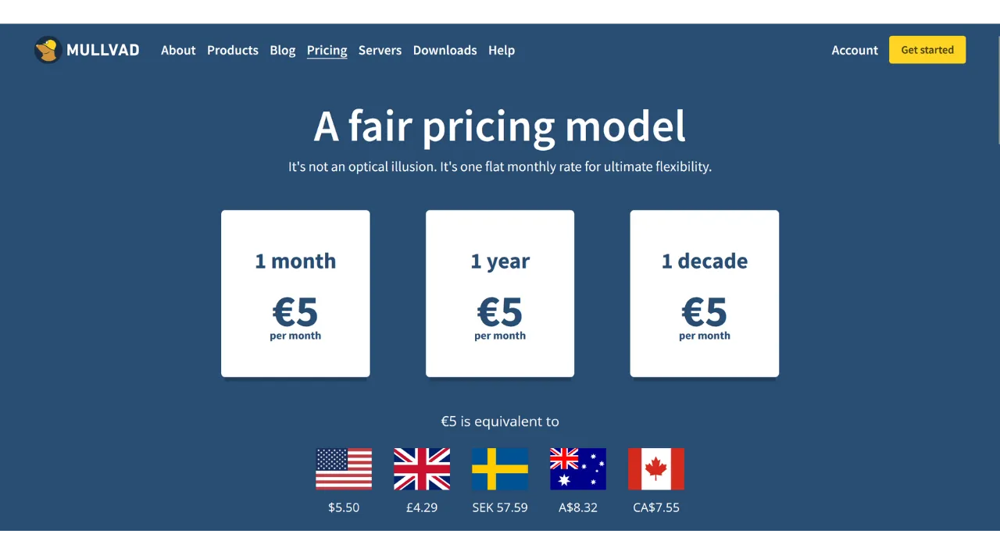

मुख्यधारा के VPN प्रदाताओं के विपरीत, Mullvad की सेवा का उपयोग करने के लिए एक अलग मॉडल है। यहाँ आपको बार-बार, स्वचालित सदस्यता लेने की बजाय सेवा के लिए समय खरीदना होता है। आप बस एक बार बिटकॉइन में भुगतान करते हैं और जितने समय के लिए सेवा चाहिए, उतने समय के लिए खरीद सकते हैं। उदाहरण के लिए, अगर आप एक साल की सेवा खरीदते हैं, तो आप उस अवधि के लिए सेवा का उपयोग कर सकते हैं। उसके बाद, आपको अपनी सेवा का समय बढ़ाने के लिए Mullvad की वेबसाइट पर वापस जाना होगा।

IVPN की तुलना में, जो एक और उच्च-गुणवत्ता वाली VPN सेवा प्रदाता है, Mullvad थोड़ी अधिक किफायती है। उदाहरण के लिए, अगर आप IVPN के साथ तीन साल की सदस्यता लेते हैं, तो मासिक खर्च लगभग €5.40 होता है। हालांकि, IVPN कुछ अतिरिक्त सेवाएं भी प्रदान करता है और Mullvad के मुकाबले एक सस्ता प्लान भी है (स्टैंडर्ड प्लान), लेकिन यह केवल 2 डिवाइस तक सीमित है और इसमें "मल्टी-हॉप" प्रोटोकॉल शामिल नहीं है।

मैंने IVPN और Mullvad की तुलना करने के लिए कुछ अनौपचारिक गति परीक्षण भी किए। हालांकि प्रदर्शन के मामले में IVPN थोड़ा बेहतर साबित हुआ, लेकिन Mullvad की गति भी काफी संतोषजनक थी। मुख्यधारा के VPN प्रदाताओं की तुलना में, IVPN और Mullvad कम से कम उतने ही प्रभावी साबित हुए, और कुछ मामलों में तो उनसे भी बेहतर।

## कंप्यूटर पर Mullvad VPN कैसे इंस्टॉल करें?

1. सबसे पहले, अपने वेब ब्राउज़र में Mullvad VPN की आधिकारिक वेबसाइट खोलें।

2. वेबसाइट पर जाकर "डाउनलोड" सेक्शन में जाएं।

3. अपने ऑपरेटिंग सिस्टम (Windows, macOS, Linux) के अनुसार सही वर्जन चुनें और डाउनलोड बटन पर क्लिक करें।

4. डाउनलोड पूरा होने के बाद, इंस्टॉलर फाइल को खोलें।

5. इंस्टॉलर के निर्देशों का पालन करें। यह आमतौर पर "नेक्स्ट" बटन पर क्लिक करते हुए होता है।

6. इंस्टॉलेशन प्रक्रिया पूरी होने के बाद, Mullvad VPN को ओपन करें।

7. अगर आपके पास पहले से अकाउंट है, तो लॉगिन करें। अगर नहीं, तो एक नया अकाउंट बनाएं।

8. लॉगिन करने के बाद, सर्वर लोकेशन चुनें और कनेक्ट बटन पर क्लिक करें।

अब आपका Mullvad VPN इंस्टॉल और कनेक्ट हो चुका है। आप सुरक्षित रूप से इंटरनेट ब्राउज़ कर सकते हैं।

[मुलवाड की आधिकारिक वेबसाइट](https://mullvad.net/en/download/) पर जाएं और "*डाउनलोड्स*" मेन्यू पर क्लिक करें।

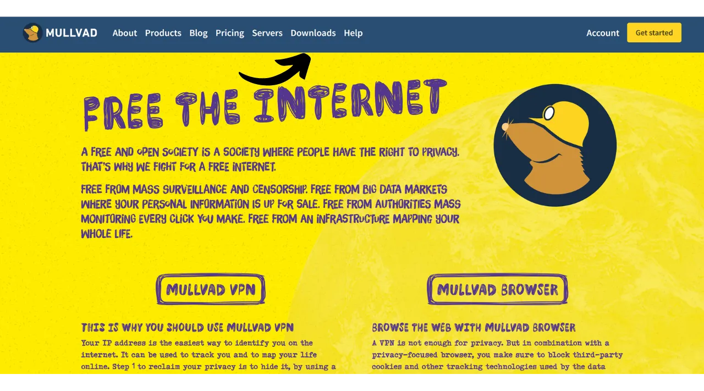

अगर आप Windows या macOS का इस्तेमाल कर रहे हैं, तो साइट से सीधे सॉफ़्टवेयर डाउनलोड करें और सेटअप विज़ार्ड द्वारा दिए गए निर्देशों का पालन करके इंस्टॉलेशन पूरा करें।

लिनक्स उपयोगकर्ताओं के लिए, आप अपनी वितरण के अनुसार निर्देश ["*Linux*"](https://mullvad.net/en/download/vpn/linux) सेक्शन में पा सकते हैं।

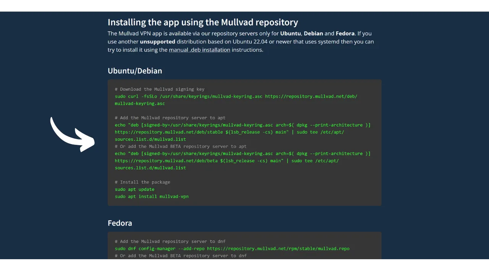

इंस्टॉलेशन पूरा होने के बाद, आपको अपना खाता आईडी दर्ज करनी होगी। हम इस ट्यूटोरियल के अगले हिस्सों में देखेंगे कि इसे कैसे प्राप्त किया जा सकता है।

## स्मार्टफोन पर Mullvad VPN कैसे इंस्टॉल करें?

1. **एप्लिकेशन स्टोर खोलें**: अपने स्मार्टफोन पर Google Play Store (एंड्रॉइड के लिए) या App Store (iPhone के लिए) खोलें।

2. **Mullvad VPN खोजें**: सर्च बार में "Mullvad VPN" टाइप करें और सर्च करें।

3. **एप्लिकेशन इंस्टॉल करें**: Mullvad VPN एप्लिकेशन को खोजने के बाद, "इंस्टॉल" बटन पर टैप करें। यह आपके फोन पर एप्लिकेशन डाउनलोड और इंस्टॉल करेगा।

4. **एप्लिकेशन खोलें**: इंस्टॉल होने के बाद, Mullvad VPN एप्लिकेशन को खोलें।

5. **लॉग इन करें या अकाउंट बनाएं**: अगर आपके पास पहले से अकाउंट है, तो अपनी लॉगिन जानकारी डालें। अगर नहीं, तो नया अकाउंट बनाएं।

6. **सर्वर से कनेक्ट करें**: एप्लिकेशन में उपलब्ध सर्वर लिस्ट से एक सर्वर चुनें और कनेक्ट बटन पर टैप करें।

7. **VPN कनेक्शन की पुष्टि करें**: जब आप कनेक्ट करेंगे, तो आपके फोन पर एक पॉप-अप आएगा जो VPN कनेक्शन की अनुमति मांगेगा। इसे स्वीकार करें।

अब आपका Mullvad VPN आपके स्मार्टफोन पर सेट हो गया है और आप सुरक्षित रूप से इंटरनेट ब्राउज़ कर सकते हैं।

अपने ऐप स्टोर से Mullvad VPN डाउनलोड करें, चाहे आप iOS उपयोगकर्ता हों तो [AppStore](https://apps.apple.com/us/app/mullvad-vpn/id1488466513) से, Android उपयोगकर्ता हों तो [Google Play Store](https://play.google.com/store/apps/details?id=net.mullvad.mullvadvpn) से, या [F-Droid](https://f-droid.org/packages/net.mullvad.mullvadvpn/) से। अगर आप Android का उपयोग कर रहे हैं, तो आपके पास [Mullvad साइट](https://mullvad.net/en/download/vpn/android) से सीधे `.apk` फाइल डाउनलोड करने का विकल्प भी है।

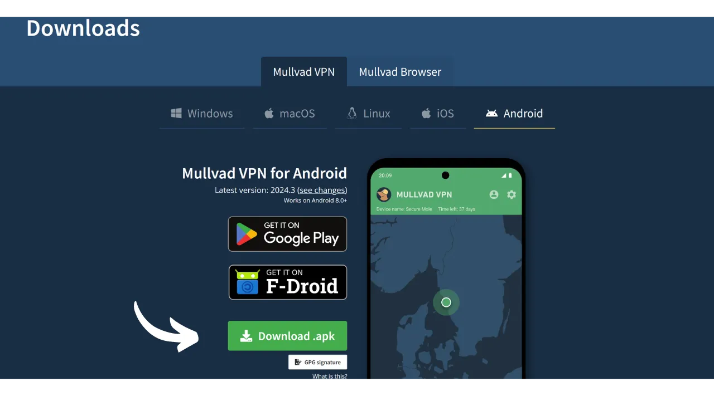

ऐप का पहली बार उपयोग करने पर, आपको लॉग आउट कर दिया जाएगा। सेवा को सक्रिय करने के लिए आपको अपना खाता आईडी दर्ज करनी होगी।

अब चलिए, अपने उपकरणों पर Mullvad को सक्रिय करने की प्रक्रिया शुरू करते हैं।

## मुलवाड वीपीएन के लिए भुगतान और सक्रियण कैसे करें?

1. **मुलवाड वेबसाइट पर जाएं**: सबसे पहले मुलवाड की आधिकारिक वेबसाइट पर जाएं।

2. **खाता बनाएं**: आपको एक खाता बनाने की आवश्यकता होगी। मुलवाड आपको एक खाता नंबर देगा, जो आपके लॉगिन के लिए उपयोग होगा।

3. **भुगतान विकल्प चुनें**: मुलवाड कई भुगतान विकल्प प्रदान करता है जैसे कि क्रेडिट/डेबिट कार्ड, पेपाल, क्रिप्टोकरेंसी, और यहां तक कि नकद भुगतान भी। अपनी सुविधा के अनुसार कोई भी विकल्प चुनें।

4. **भुगतान करें**: चुने गए भुगतान विकल्प के माध्यम से भुगतान प्रक्रिया पूरी करें।

5. **सक्रियण**: भुगतान के बाद, आपका खाता स्वतः सक्रिय हो जाएगा। आपको अपने खाता नंबर का उपयोग करके मुलवाड वीपीएन ऐप में लॉगिन करना होगा।

6. **वीपीएन का उपयोग शुरू करें**: एक बार लॉगिन करने के बाद, आप मुलवाड वीपीएन का उपयोग शुरू कर सकते हैं और अपनी ऑनलाइन गोपनीयता की सुरक्षा कर सकते हैं।

बस, इतना ही! अब आप सुरक्षित रूप से इंटरनेट ब्राउज़ कर सकते हैं।

[मुलवाड की आधिकारिक वेबसाइट](https://mullvad.net/) पर जाएं और "*शुरू करें*" बटन पर क्लिक करें।

"*generate खाता संख्या*" बटन पर क्लिक करें।

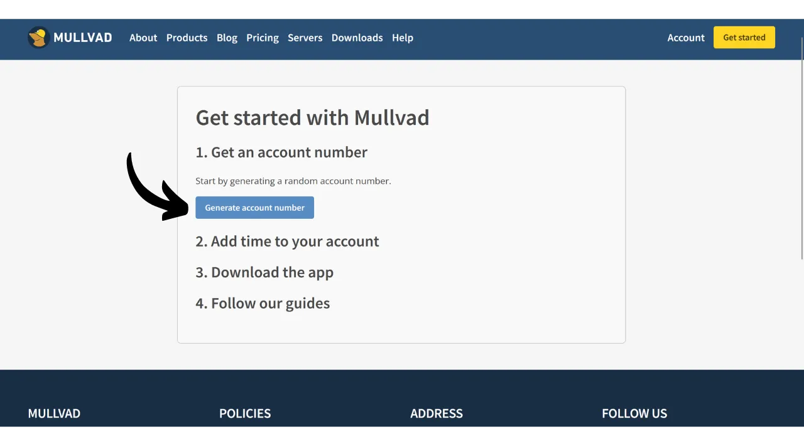Mullvad will then create your account. You do not need to provide any personal information. It is only your account number that will allow you to log in. It acts somewhat like an access key. Save it in a safe place like your password manager, for example. You can also make a paper copy.

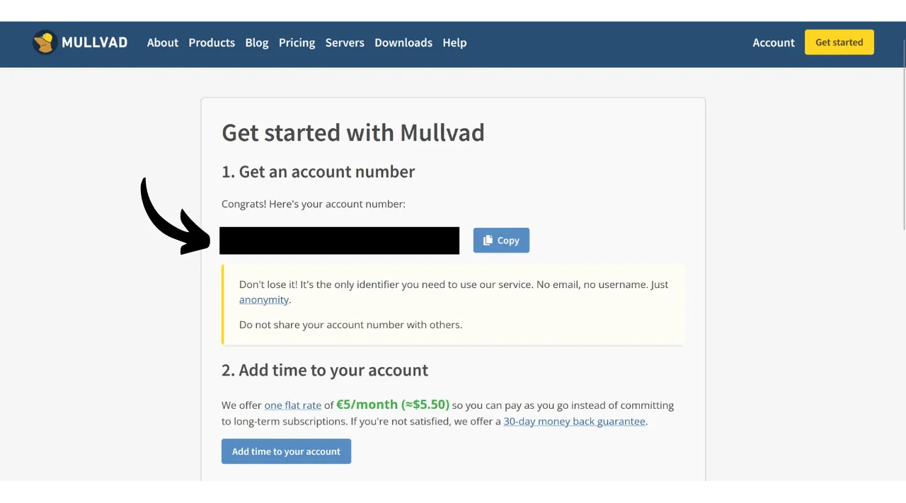

फिर "*अपने खाते में समय जोड़ें*" बटन पर क्लिक करें।

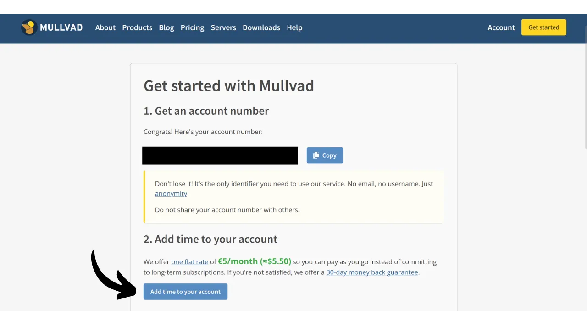

आप फिर अपने खाते के लॉगिन पेज पर पहुँचेंगे। अपना खाता नंबर दर्ज करें और फिर "*लॉग इन*" बटन पर क्लिक करें।

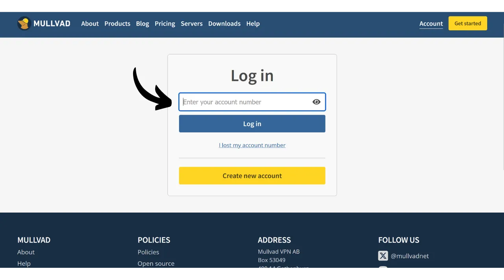

अपना भुगतान तरीका चुनें। मैं आपको बिटकॉइन में भुगतान करने की सलाह देता हूँ, क्योंकि इससे आपको 10% की छूट मिलेगी, जिससे लागत घटकर €4.50 प्रति माह हो जाएगी। अगर आप लाइटनिंग के माध्यम से भुगतान करना पसंद करते हैं, तो मैं अगले भाग में एक वैकल्पिक तरीका प्रदान करूंगा।

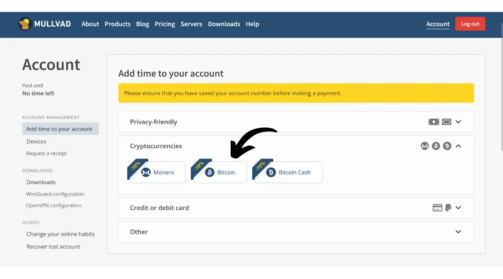

"*एक बार भुगतान Address बनाएँ*" बटन पर क्लिक करें।

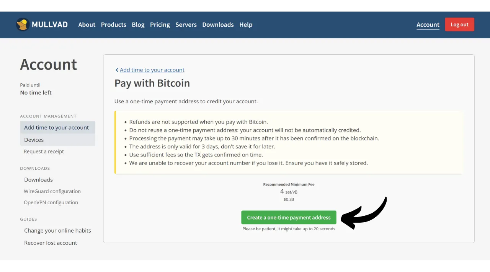

फिर आपको दिए गए Address पर दिए गए राशि का भुगतान अपने Bitcoin और Wallet से करें।

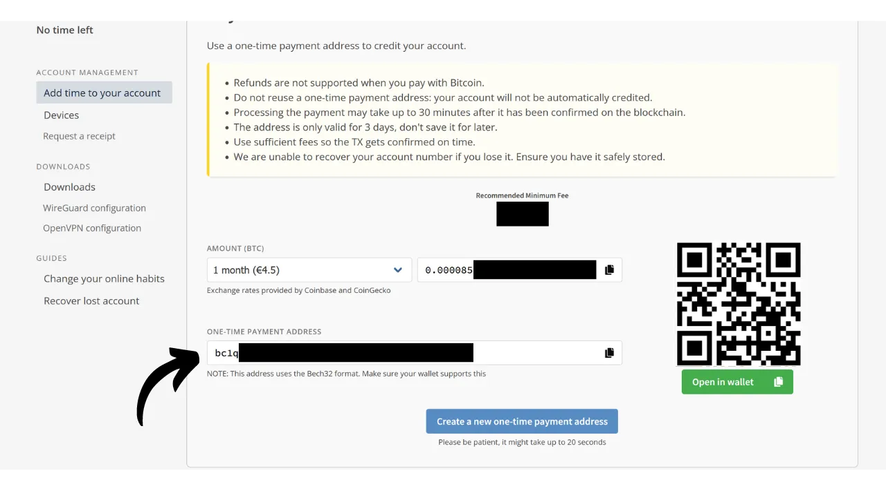

लेन-देन की पुष्टि होने के बाद साइट को आपका भुगतान पहचानने में कुछ मिनट लग सकते हैं। जैसे ही Mullvad आपका भुगतान पहचान लेता है, आपकी सदस्यता की अवधि पृष्ठ के ऊपर बाईं ओर दिखाई देगी, जहाँ पहले "*कोई समय शेष नहीं*" लिखा होता था।

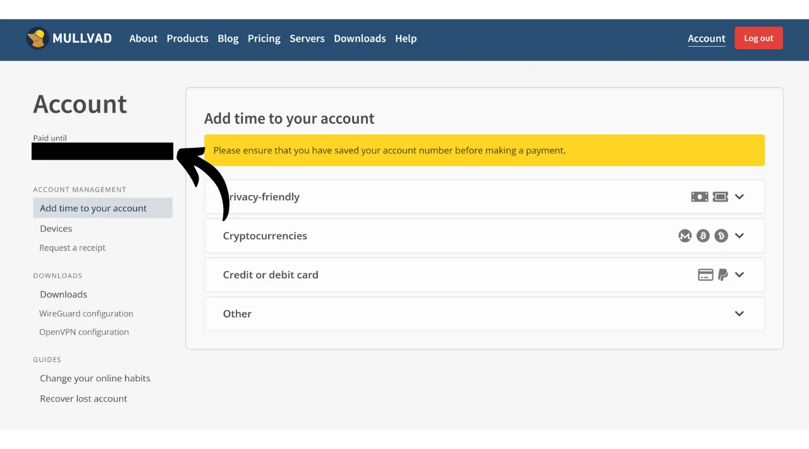

आप उसके बाद सॉफ्टवेयर में अपना खाता नंबर डालकर वीपीएन को सक्रिय कर सकते हैं।

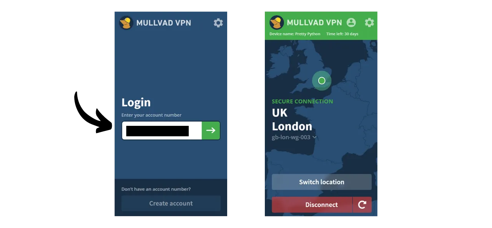

अपने मोबाइल एप्लिकेशन पर वीपीएन को सक्रिय करने के लिए प्रक्रिया बिल्कुल वही है। आपको बस अपना खाता नंबर दर्ज करना होगा।

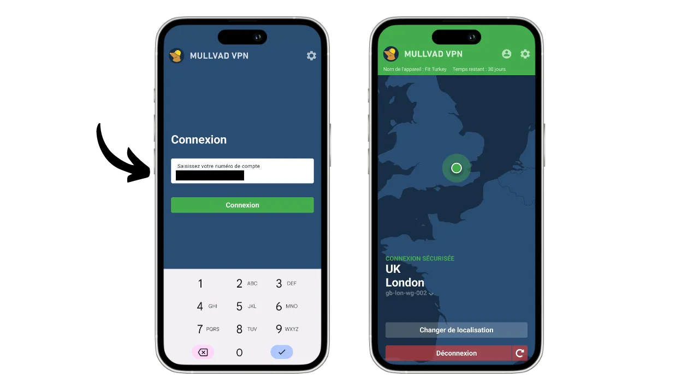

## मुलवाड वीपीएन के लिए लाइटनिंग के जरिए भुगतान कैसे करें?

1. सबसे पहले, मुलवाड वीपीएन की वेबसाइट पर जाएं और अपने अकाउंट में लॉगिन करें या नया अकाउंट बनाएं।

2. भुगतान के विकल्पों में से 'लाइटनिंग' को चुनें।

3. आपको एक इनवॉइस दिखाई देगा जिसमें भुगतान की राशि और एक QR कोड होगा।

4. अपने लाइटनिंग वॉलेट ऐप को खोलें और 'पे' या 'भुगतान करें' विकल्प पर क्लिक करें।

5. QR कोड को स्कैन करें या इनवॉइस की जानकारी को मैन्युअली दर्ज करें।

6. भुगतान की पुष्टि करें। 

7. आपका भुगतान सफलतापूर्वक हो जाने के बाद, मुलवाड वीपीएन की सेवा का उपयोग शुरू कर सकते हैं।

बस इतना ही! लाइटनिंग के जरिए भुगतान करना तेज और सुरक्षित है।

जैसा कि आपने समझा है, Mullvad अभी तक Lightning Network के माध्यम से भुगतान स्वीकार नहीं करता है। हालांकि, [Lounès](https://x.com/louneskmt) की सिफारिश के धन्यवाद, मैंने एक अनौपचारिक सेवा खोजी जो आपको इस सीमा को पार करने की अनुमति देती है। यह सेवा, [vpn.sovereign.engineering](https://vpn.sovereign.engineering/) पर उपलब्ध है, आपके भुगतान को लाइटनिंग पर स्वीकार करती है और इसके बदले में आपको Mullvad के लिए एक वैध योजना प्रदान करती है।

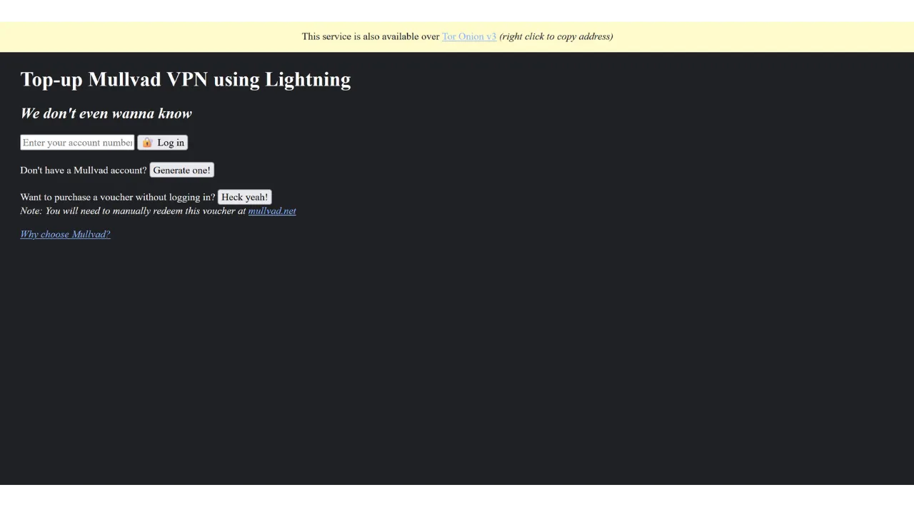

इस साइट पर आपके पास दो विकल्प हैं: आप साइट मैनेजर पर भरोसा कर सकते हैं और सीधे अपना खाता नंबर दर्ज कर सकते हैं, फिर "*लॉग इन*" पर क्लिक करें ताकि आपका Mullvad पैकेज स्वचालित रूप से मान्य हो जाए। या, आप "*हां, बिल्कुल!*" बटन पर क्लिक करके लाइटनिंग में एक वाउचर खरीद सकते हैं, जिसे आप फिर आधिकारिक Mullvad साइट पर अपने पैकेज के लिए उपयोग कर सकते हैं। 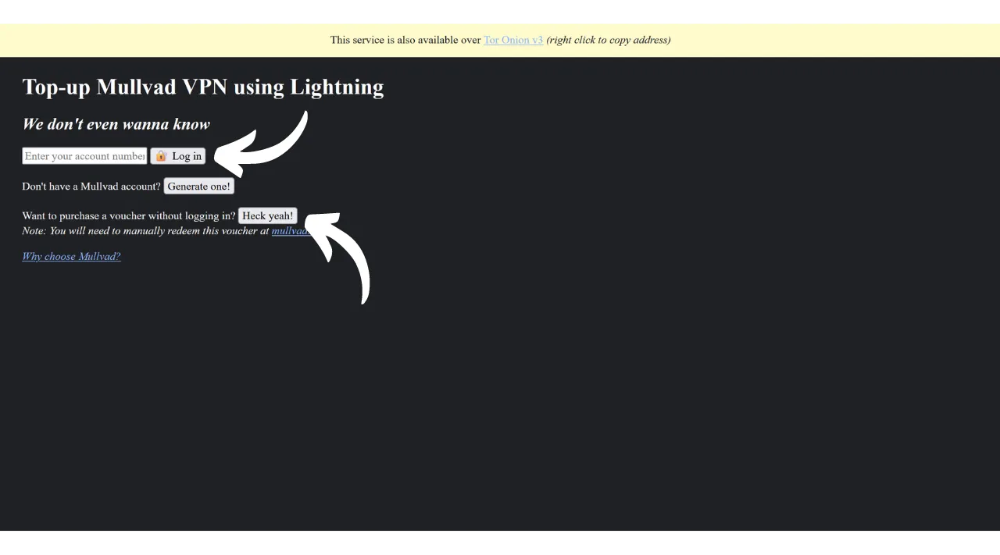 दोनों ही मामलों में, आपको अपने पैकेज की अवधि चुनने के लिए कहा जाएगा। आप 6 महीने और 1 साल के बीच चुन सकते हैं। 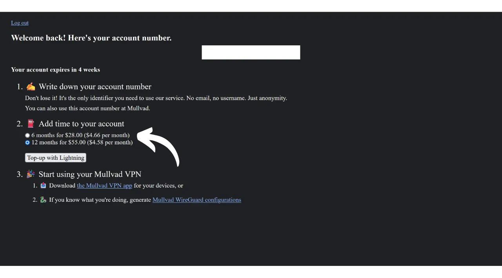 फिर "*लाइटनिंग के साथ टॉप-अप करें*" बटन पर क्लिक करें। 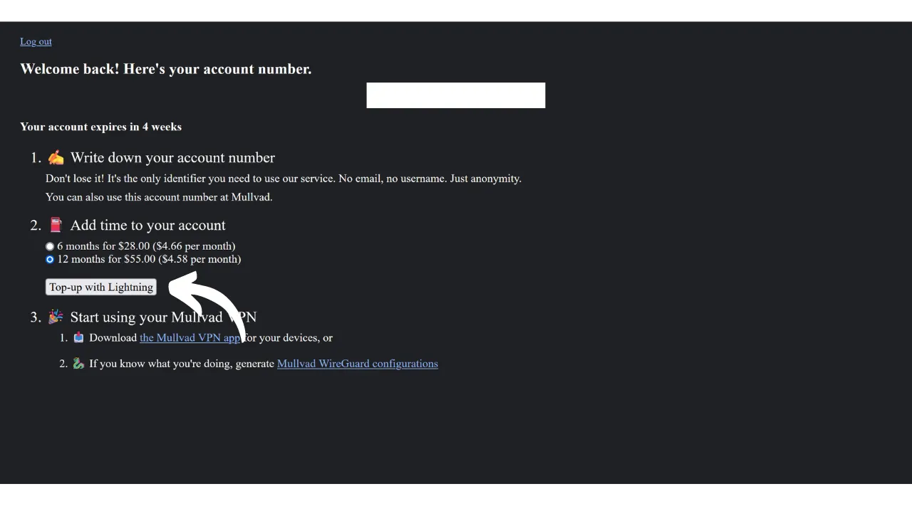 खरीदारी को अंतिम रूप देने के लिए, अपने लाइटनिंग Wallet के साथ Invoice का भुगतान करें। 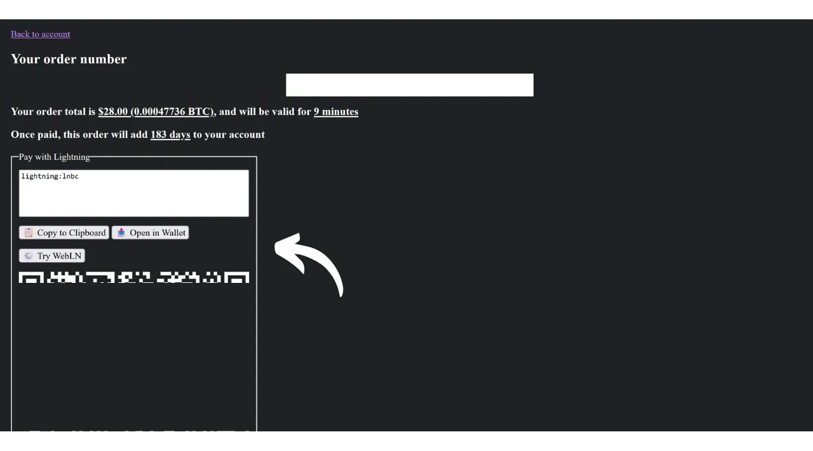 यदि आपने वाउचर खरीदने का विकल्प चुना है, तो Mullvad साइट पर, अपने खाते पर उपलब्ध भुगतान विधियों में से "*वाउचर*" का चयन करें। फिर, vpn.sovereign.engineering साइट से प्राप्त वाउचर नंबर को निर्दिष्ट बॉक्स में दर्ज करें। 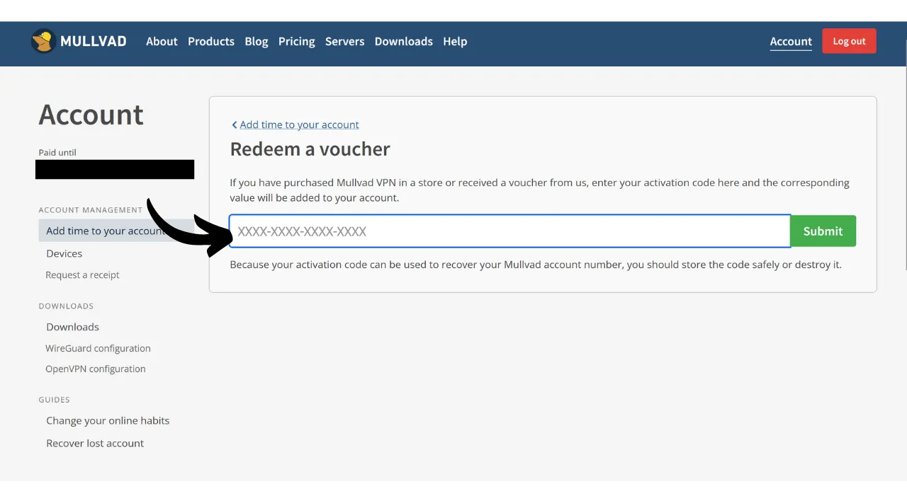 ## Mullvad VPN का उपयोग और कॉन्फ़िगर कैसे करें?

अब जब आपका खाता सक्रिय हो गया है और आपने अपना खाता नंबर Mullvad सॉफ़्टवेयर या ऐप में डाल दिया है, तो आप अपने VPN की सेवाओं का पूरी तरह से आनंद ले सकते हैं। VPN से डिस्कनेक्ट करने के लिए, बस "*Disconnect*" बटन पर क्लिक करें। "*Disconnect*" बटन के पास छोटे लाल तीर का उपयोग करके आप वर्तमान स्थान बदले बिना सर्वर बदल सकते हैं। अगर आप अपने VPN सर्वर के लिए शहर बदलना चाहते हैं, तो "*Switch location*" पर क्लिक करें और नया स्थान चुनें। स्क्रीन के शीर्ष पर, आप अपने डिवाइस का उपनाम और आपके पैकेज की शेष अवधि देख सकते हैं। छोटे आदमी के आइकन पर क्लिक करके, आप अपने खाते की विस्तृत जानकारी तक पहुंच सकते हैं। सेटिंग्स तक पहुंचने के लिए, गियर व्हील पर क्लिक करें। "*User Interface settings*" मेनू में, आप अपने सॉफ़्टवेयर की सेटिंग्स को कस्टमाइज़ कर सकते हैं, जिसमें Interface की भाषा और आपके सिस्टम पर इसका व्यवहार शामिल है। "*VPN settings*" मेनू में, आपको अपने VPN से संबंधित विकल्प मिलेंगे। मैं सुझाव दूंगा कि "*Launch app on start-up*" और "*Auto-connect*" विकल्पों को सक्षम करें ताकि आपकी VPN कनेक्शन आपके मशीन के शुरू होते ही स्वचालित रूप से शुरू हो जाए।

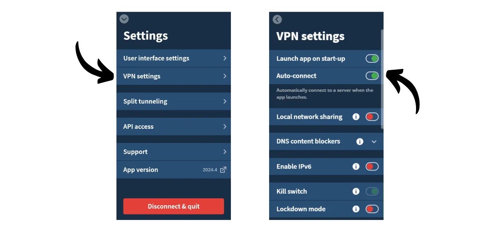 In the "*DNS content blockers*" submenu, you have the option to filter and block DNS requests to malicious, advertising, or unwanted websites.

अंत में, "*स्प्लिट टनलिंग*" मेनू आपको अपने कंप्यूटर पर कुछ विशेष एप्लिकेशनों को चुनने की सुविधा देता है, जिनके लिए इंटरनेट ट्रैफिक वीपीएन के माध्यम से नहीं जाएगा।

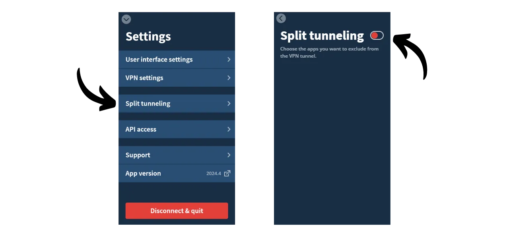

अपने Mullvad खाते का अवलोकन प्राप्त करने और विभिन्न जुड़े हुए उपकरणों का प्रबंधन करने के लिए, आप वेबसाइट पर "*Devices*" मेनू पर क्लिक कर सकते हैं।

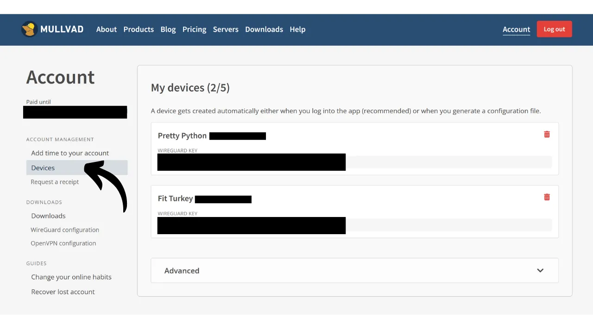

तो लीजिए, अब आप पूरी तरह से Mullvad VPN का आनंद लेने के लिए तैयार हैं। अगर आप Mullvad के समान फीचर्स और कीमत वाले किसी अन्य VPN प्रदाता को जानने में रुचि रखते हैं, तो मैं आपको IVPN पर हमारी ट्यूटोरियल देखने की भी सलाह देता हूँ।

https://planb.network/tutorials/computer-security/communication/ivpn-5a0cd5df-29f1-4382-a817-975a96646e68