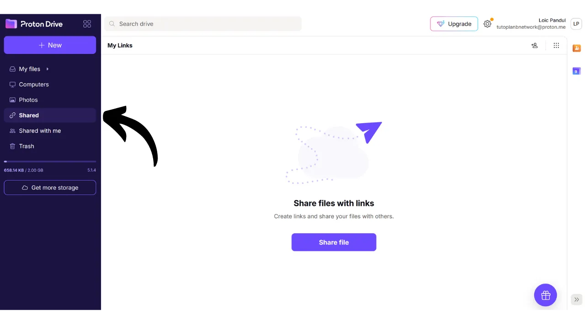
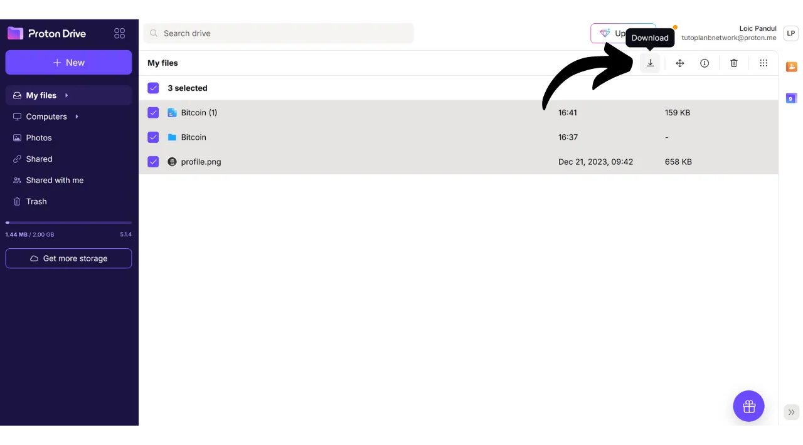

Hoy en día, es crucial establecer una estrategia para asegurar la accesibilidad, seguridad y copia de seguridad de tus archivos personales, como tus documentos personales, fotos o proyectos importantes. Perder estos datos puede ser catastrófico.

Para prevenir estos problemas, aconsejo mantener múltiples copias de seguridad de tus archivos en diferentes medios. Una estrategia comúnmente utilizada en informática es la estrategia de copia de seguridad "3-2-1", que asegura la protección de tus archivos:
- **3** copias de tus archivos;
- Guardadas en al menos **2** tipos diferentes de medios;
- Con al menos **1** copia mantenida fuera del sitio.

En otras palabras, es aconsejable almacenar tus archivos en 3 ubicaciones diferentes, utilizando diferentes tipos de medios, como tu computadora, un disco duro externo, una memoria USB o un servicio de almacenamiento en línea. Y finalmente, tener una copia fuera del sitio significa que deberías tener una copia de seguridad almacenada fuera de tu hogar o negocio. Este último punto ayuda a evitar la pérdida total de tus archivos en caso de desastres locales como incendios o inundaciones. Una copia externa, distante de tu hogar o negocio, asegura que tus datos sobrevivirán independientemente de los riesgos locales.

Para facilitar la implementación de la estrategia de copia de seguridad 3-2-1, puedes usar un servicio de almacenamiento en línea. Estas soluciones, comúnmente referidas como "nube", ofrecen protección adicional al almacenar tus datos en servidores seguros accesibles desde cualquier dispositivo. El término "nube" simplemente se refiere al almacenamiento de datos en servidores externos.

Muchas personas utilizan las soluciones de almacenamiento de grandes compañías digitales: Google Drive, Microsoft OneDrive o Apple iCloud.

Estas soluciones son convenientes para el uso diario y aseguran la accesibilidad de tus datos, pero no garantizan la confidencialidad. En este tutorial, propongo descubrir otra solución, tan fácil de usar como las herramientas de almacenamiento de Big Tech, pero con medidas adicionales para proteger tu privacidad. Esta solución es Proton Drive, la herramienta de almacenamiento en línea de la compañía suiza Proton. También veremos cómo implementar fácilmente una estrategia 3-2-1 adecuada para el uso diario.

## Introducción a Proton Drive
Proton Drive es una solución intrigante para el almacenamiento en línea porque combina facilidad de uso con seguridad para tus archivos. A diferencia de los servicios tradicionales de nube de los gigantes tecnológicos, Proton Drive implementa medidas para proteger tu privacidad. Asegura el cifrado de extremo a extremo para todos tus archivos, lo que significa que incluso los equipos de Proton no pueden acceder a tus datos. Además, Proton Drive es de código abierto, lo que permite a expertos independientes auditar libremente el código del software.

El modelo de negocio de Proton se basa en un sistema de suscripción, lo cual es tranquilizador ya que indica que la compañía se financia sin necesariamente explotar los datos de sus usuarios. En este tutorial, explicaré cómo usar la versión gratuita de Proton Drive, pero también hay varios niveles de suscripción que ofrecen más características. Este modelo de negocio es preferible a un sistema gratuito al estilo de Big Tech, lo que podría llevar a uno a preguntarse si nuestros datos personales se están utilizando para obtener beneficios. Esto no parece ser el caso con Proton.

Proton Drive ofrece mucho más que simples opciones de almacenamiento; también permite compartir, editar y colaborar en documentos en línea con herramientas de edición, similar a la suite de software de Google.
En cuanto a [precios](https://proton.me/pricing), la versión gratuita ofrece hasta 5 GB de almacenamiento e incluye características esenciales. Para extender las capacidades a 200 GB de almacenamiento, está disponible una suscripción específica a Proton Drive por 4 € al mes. Por otro lado, el paquete Proton Unlimited ofrece por 10 € al mes un espacio de almacenamiento de hasta 500 GB en Proton Drive, además de incluir todos los servicios pagos de Proton, como la VPN y el gestor de contraseñas, así como beneficios adicionales en herramientas gratuitas (correo electrónico y calendario). 
## ¿Cómo crear una cuenta de Proton?

Si aún no tienes una cuenta de Proton, necesitarás crear una. Te remito a nuestro tutorial de Proton Mail en el que explicamos detalladamente cómo crear una cuenta gratuita de Proton y configurarla:

https://planb.network/tutorials/computer-security/communication/proton-mail-c3b010ce-254d-4546-b382-19ab9261c6a2

## ¿Cómo configurar Proton Drive?

Una vez que hayas iniciado sesión en tu correo de Proton, haz clic en el icono con cuatro cuadraditos en la parte superior izquierda de la pantalla.

Luego haz clic en "*Drive*".

Ahora estás en tu Proton Drive.

## ¿Cómo usar Proton Drive?
Para agregar archivos a tu Proton Drive, cuando estés utilizando exclusivamente la versión web (discutiremos el uso de la versión local más adelante), simplemente necesitas arrastrar y soltar tus documentos directamente en la interfaz.  Luego puedes encontrar tu documento en la página de inicio.  Para agregar un nuevo elemento, haz clic en el botón "*Nuevo*" en la parte superior izquierda de la pantalla.  La función "*Subir archivo*" abre tu explorador de archivos local, permitiéndote seleccionar e importar nuevos documentos a Proton Drive, tal como lo harías arrastrando y soltando.  "*Subir carpeta*" te permite importar una carpeta entera.  "*Nueva carpeta*" te permite crear una carpeta para organizar mejor tus documentos en Proton Drive.  Haz clic en esta opción, asigna un nombre a tu carpeta.  Luego la encontrarás directamente en la página de inicio de Proton Drive.  Finalmente, "*Nuevo documento*" te permite crear un nuevo documento de texto directamente en Proton Drive.  Al hacer clic en él, se abre un nuevo documento en blanco.  Puedes escribir en él y editarlo.  Si haces clic en el botón "*Compartir*" en la parte superior derecha, puedes compartir el documento.  Solo necesitas ingresar el correo electrónico del colaborador al que deseas dar acceso al documento, ya sea en modo de solo lectura o con derechos de edición.  Si regresas a tu Proton Drive, puedes ver que el documento ha sido guardado con éxito.  En la pestaña "*Compartidos*", puedes encontrar los documentos que has compartido con otros.  Y en la pestaña "*Compartidos conmigo*", puedes ver los documentos que otros han compartido contigo.  Finalmente, en la pestaña "*Papelera*", puedes encontrar tus documentos recientemente eliminados.  La mayoría de los ajustes para tu Proton Drive están integrados en tu cuenta de Proton. Para instrucciones detalladas sobre cómo configurar tu cuenta, te invito a consultar este tutorial:
https://planb.network/tutorials/computer-security/communication/proton-mail-c3b010ce-254d-4546-b382-19ab9261c6a2

## ¿Cómo instalar el software de Proton Drive?
Proton Drive también ofrece software que permite la sincronización de tus archivos locales con tu espacio de almacenamiento en línea. Esta característica facilita y automatiza la implementación de nuestra estrategia de respaldo 3-2-1. Con el software de Proton Drive, obtienes 2 copias sincronizadas de tus archivos: una en tu computadora y la otra en los servidores de Proton, cumpliendo así con los criterios de 2 tipos de medios y respaldo fuera del sitio. Simplemente necesitarás crear una tercera copia, que configuraremos más adelante.
Para usar el software, haz clic en la pestaña "*Computadoras*" en tu cuenta de Proton Drive y selecciona el botón correspondiente a tu sistema operativo para proceder con la descarga.
Una vez instalado, necesitarás iniciar sesión para desbloquear tu cuenta, luego haz clic en "*Iniciar sesión*".

Selecciona los archivos locales que deseas sincronizar con tu Proton Drive.

Por ejemplo, he seleccionado solo la carpeta "*Proton Backup*". Luego haz clic en el botón "*Continuar*".

Luego llegarás a la interfaz del software, que es similar a la aplicación web.

A partir de ahora, tendrás una carpeta titulada "*Proton Drive*" localmente en tu computadora, que reunirá todos tus documentos almacenados en Proton en línea. Si agregas un archivo a esta carpeta desde tu computadora, automáticamente lo encontrarás en la página de inicio de la aplicación web de Proton Drive, y viceversa. Para las carpetas que elegiste sincronizar durante la instalación del software, también puedes encontrarlas en línea yendo a la sección "*Computadoras*" de Proton Drive y luego seleccionando tu computadora.

Así, todos tus archivos están respaldados y sincronizados tanto localmente en tu máquina como en los servidores en línea de Proton Drive.

## ¿Cómo hacer una copia de seguridad de Proton Drive?

Si has seguido los pasos anteriores, ahora tienes 2 ubicaciones de respaldo distintas para tus archivos importantes. Para completar nuestra estrategia de respaldo 3-2-1, necesitamos agregar una tercera copia.
Te sugiero realizar este respaldo adicional en un medio externo, como un disco duro externo o una memoria USB, por ejemplo. Dependiendo de la intensidad de tu uso, establece una frecuencia de actualización de respaldo apropiada (semanal, mensual, semestral...). En cada intervalo elegido, necesitarás descargar la totalidad de tu Proton Drive para respaldar los datos en el medio externo elegido. De esta manera, incluso en el evento de robo de tu computadora y la destrucción simultánea de los servidores de Proton, aún mantendrás acceso seguro a tus archivos gracias a la copia en la memoria USB.

Para hacer esto, ve a tu Proton Drive.

Selecciona todos tus archivos.

Luego haz clic en la pequeña flecha para descargarlos.

Luego repetiremos la operación con nuestros archivos sincronizados desde nuestra computadora.

Entonces encontrarás archivos .zip en tus descargas. Simplemente conecta el medio externo de tu elección a tu computadora, y luego transfiere estos archivos a él.

Si te preocupa que esta memoria USB pueda ser robada, considera encriptarla con software como VeraCrypt (haremos un tutorial sobre este software pronto).

Felicidades, ahora tienes una estrategia de respaldo 3-2-1 muy robusta, que te permite reducir drásticamente el riesgo de perder acceso a tus documentos personales, cualquiera que sea la circunstancia. Al elegir Proton Drive para tus respaldos en línea, también te beneficias de la encriptación de extremo a extremo, que garantiza la protección de tu privacidad.

Para aprender más sobre cómo asegurar tu presencia en línea y evitar el hacking, también recomiendo consultar nuestro tutorial detallado sobre el gestor de contraseñas Bitwarden:

https://planb.network/tutorials/computer-security/authentication/bitwarden-0532f569-fb00-4fad-acba-2fcb1bf05de9
