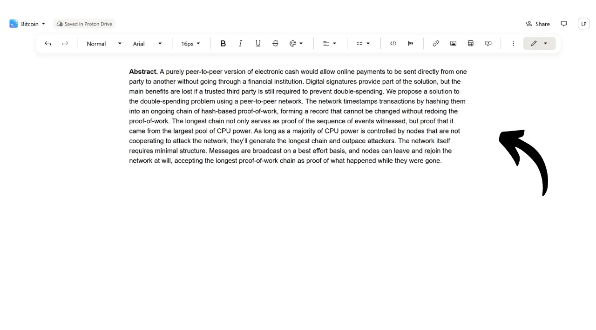
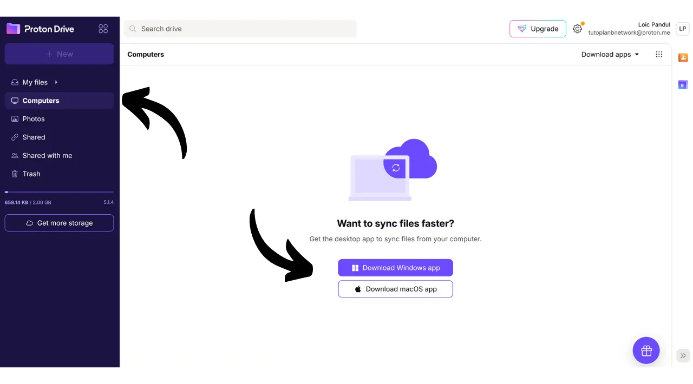

De nos jours, il est important de mettre en place une stratégie pour garantir l'accessibilité, la sécurité et la sauvegarde de vos fichiers personnels, tels que vos documents personnels, vos photos ou vos projets importants. La perte de ces données peut être catastrophique.

Pour prévenir ces problèmes, je vous conseille de maintenir plusieurs sauvegardes de vos fichiers sur des supports différents. Une méthode généralement utilisée en informatique est la stratégie de sauvegarde du "*3-2-1*", qui assure la protection de vos fichiers :
- **3** copies de vos fichiers ;
- Sauvegardées sur au moins **2** types de supports différents ;
- Avec au moins **1** copie conservée hors site.

Autrement dit, il est conseillé d'enregistrer vos fichiers à 3 endroits différents, en utilisant des supports de nature différente, tels que votre ordinateur, un disque dur externe, une clé USB ou un service de stockage en ligne. Et enfin, avoir une copie hors site signifie que vous devriez avoir une sauvegarde stockée en dehors de votre maison ou de votre entreprise. Ce dernier point permet d'éviter la perte totale de vos fichiers en cas de sinistres locaux tels que des incendies ou des inondations. Une copie externe, éloignée de votre domicile ou de votre entreprise, assure que vos données survivront indépendamment des risques locaux.

Pour faciliter la mise en place de la stratégie de sauvegarde du 3-2-1, vous pouvez utiliser un service de stockage en ligne. Ces solutions, communément appelées "*cloud*", vous offrent une protection supplémentaire en stockant vos données sur des serveurs sécurisés accessibles depuis n'importe quel appareil. Le terme de "*cloud*" désigne tout simplement la conservation de données sur des serveurs externes.

Beaucoup de personnes utilisent les solutions de stockage des grandes entreprises du numérique : Google Drive, Microsoft OneDrive ou encore Apple iCloud.

Ces solutions sont pratiques au quotidien et permettent d'assurer l'accessibilité de vos données, mais elles n'en assurent pas la confidentialité. Dans ce tutoriel, je vous propose de découvrir une autre solution, tout aussi simple à utiliser que les outils de stockage des Big Tech, mais qui dispose de mesures supplémentaires pour protéger votre vie privée. Cette solution, c'est Proton Drive, l'outil de stockage en ligne de l'entreprise suisse Proton. Nous allons également voir comment mettre en place facilement une stratégie du 3-2-1 adaptée pour un usage quotidien.

## Présentation de Proton Drive

Proton Drive est une solution très intéressante pour le stockage en ligne, car elle allie simplicité d'utilisation et sécurité pour vos fichiers. Contrairement aux services cloud traditionnels des géants de la tech, Proton Drive met en place des mesures de protection de votre vie privée. Il assure un chiffrement de bout en bout pour tous vos fichiers, ce qui signifie que même les équipes de Proton ne peuvent pas accéder à vos données. De plus, Proton Drive est open-source, ce qui permet à des experts indépendants d'auditer librement le code du logiciel.

Le modèle économique de Proton repose sur un système d'abonnement, ce qui est rassurant puisqu'il indique que l'entreprise se finance sans forcément exploiter les données de ses utilisateurs. Dans ce tutoriel, je vous explique comment utiliser la version gratuite de Proton Drive, mais il existe également plusieurs niveaux d'abonnement offrant plus de fonctionnalités. Ce modèle d'affaires est préférable à un système gratuit à la manière des Big Tech, qui pourrait amener à se demander si nos données personnelles sont utilisées à des fins lucratives. Cela ne semble pas être le cas avec Proton.

Proton Drive offre bien plus que de simples options de stockage ; il permet également de partager, de modifier et de collaborer sur des documents en ligne avec des outils d'édition, à la manière de la suite logicielle de Google.

Pour ce qui est des [tarifs](https://proton.me/pricing), la version gratuite vous offre jusqu'à 5 Go de stockage et intègre les fonctionnalités essentielles. Pour étendre les capacités à 200 Go de stockage, un abonnement spécifique à Proton Drive est disponible à 4 € par mois. Le forfait Proton Unlimited, quant à lui, propose pour 10 € par mois un espace de stockage allant jusqu'à 500 Go sur Proton Drive, en plus d'inclure tous les services payants de Proton, tels que le VPN et le gestionnaire de mots de passe, ainsi que des avantages supplémentaires sur les outils gratuits (boite mail et calendrier).

## Comment créer un compte Proton ?

Si vous n'avez pas encore de compte Proton, il va falloir en créer un. Je vous renvoie vers notre tutoriel Proton Mail dans lequel nous vous expliquons en détail comment créer un compte Proton gratuit et le configurer :

https://planb.network/tutorials/computer-security/communication/proton-mail-c3b010ce-254d-4546-b382-19ab9261c6a2

## Comment configurer Proton Drive ?

Une fois connecté sur votre boite mail Proton, cliquez en haut à gauche de l'écran sur l'icône avec quatre petits carrés.

Puis cliquez sur "*Drive*".

Vous arrivez maintenant sur votre Proton Drive.

## Comment utiliser Proton Drive ?

Pour ajouter des fichiers à votre Proton Drive, dans le cas où vous utilisez exclusivement la version web (nous verrons plus tard l'utilisation de la version locale), il vous suffit de glisser-déposer vos documents directement dans l'interface.

Vous pouvez ensuite retrouver votre document sur la page d'accueil.

Pour ajouter un nouvel élément, cliquez sur le bouton "*New*" en haut à gauche de l'écran.

La fonction "*Upload file*" ouvre votre explorateur de fichiers locaux, et vous permet de sélectionner et d'importer de nouveaux documents sur Proton Drive, tout comme vous le feriez par glisser-déposer.

"*Upload folder*" permet d'importer un dossier entier.

"*New folder*" vous permet de créer un dossier pour mieux organiser vos documents sur Proton Drive.

Cliquez sur cette option, attribuez un nom à votre dossier.

Puis vous le trouverez ensuite directement sur la page d'accueil de Proton Drive.

Enfin, "*New document*" vous permet de créer un nouveau document texte directement dans Proton Drive.

En cliquant dessus, un nouveau document vierge s'ouvre.

Vous pouvez écrire dessus et le modifier.

Si vous cliquez sur le bouton "*Share*" en haut à droite, vous pouvez partager le document.

Il suffit ensuite de renseigner l'email du contributeur auquel vous souhaitez donner accès au document, soit en lecture seule, soit avec des droits d'édition.

Si vous retournez sur votre Proton Drive, vous pouvez voir que le document a bien été enregistré.

Dans l'onglet "*Shared*", vous pouvez retrouver les documents que vous avez partagés avec d'autres personnes.

Et dans l'onglet "*Shared with me*", vous pouvez voir les documents que d'autres personnes ont partagé avec vous.

Enfin, dans l'onglet "*Trash*", vous pouvez retrouver vos documents récemment supprimés.

La plupart des paramètres de votre Proton Drive sont intégrés à votre compte Proton. Pour obtenir des instructions détaillées sur la configuration de votre compte, je vous invite donc à consulter ce tutoriel :

https://planb.network/tutorials/computer-security/communication/proton-mail-c3b010ce-254d-4546-b382-19ab9261c6a2

## Comment installer le logiciel Proton Drive ?

Proton Drive propose aussi un logiciel qui permet la synchronisation de vos fichiers locaux avec votre espace de stockage en ligne. Cette fonctionnalité facilite et automatise la mise en place de notre stratégie de sauvegarde 3-2-1. Avec le logiciel Proton Drive, vous obtenez 2 copies synchronisées de vos fichiers : une sur votre ordinateur et l'autre sur les serveurs de Proton, ce qui remplie ainsi les critères des 2 supports et de la sauvegarde hors site. Il vous restera simplement à créer une troisième copie, que nous mettrons en place plus tard.

Pour utiliser le logiciel, cliquez sur l'onglet "*Computers*" sur votre compte Proton Drive et sélectionnez le bouton correspondant à votre système d'exploitation pour procéder au téléchargement.

Une fois installé, vous devrez vous identifier pour déverrouiller votre compte, puis cliquez sur "*Sign in*".

Sélectionnez les fichiers locaux que vous souhaitez synchroniser avec votre Proton Drive.

Pour l'exemple, j'ai sélectionné uniquement le dossier "*Proton Backup*". Cliquez ensuite sur le bouton "*Continue*".

Vous arrivez ensuite sur l'interface du logiciel, qui est similaire à l'application web.

Désormais, vous disposerez en local sur votre ordinateur d'un dossier intitulé "*Proton Drive*", qui regroupera l'ensemble de vos documents stockés sur Proton en ligne. Si vous ajoutez un fichier dans ce dossier depuis votre ordinateur, vous le retrouverez automatiquement sur la page d'accueil de l'application web Proton Drive, et inversement. Pour les dossiers que vous avez choisis de synchroniser lors de l'installation du logiciel, vous pouvez également les retrouver en ligne en allant dans la section "*Computers*" de Proton Drive puis en sélectionnant votre ordinateur.

Ainsi, tous vos fichiers sont sauvegardés et synchronisés à la fois localement sur votre machine et sur les serveurs en ligne de Proton Drive.

## Comment faire une sauvegarde de Proton Drive ?

Si vous avez suivi les étapes précédentes, vous disposez maintenant de 2 emplacements de sauvegarde distincts pour vos fichiers importants. Pour compléter notre stratégie de sauvegarde 3-2-1, il nous reste à ajouter une troisième copie.

Je vous suggère de réaliser cette sauvegarde supplémentaire sur un support externe, comme un disque dur ou une clé USB par exemple. Selon l'intensité de votre usage, définissez une fréquence de mise à jour de la sauvegarde adaptée (hebdomadaire, mensuelle, semestrielle...). À chaque intervalle choisi, vous devrez télécharger l'intégralité de votre Proton Drive pour sauvegarder les données sur le support externe choisi. De cette manière, même en cas de vol de votre ordinateur et de destruction simultanée des serveurs de Proton, vous conserverez toujours un accès sécurisé à vos fichiers grâce à la copie sur la clé USB.

Pour ce faire, rendez-vous sur votre Proton Drive.

Sélectionnez l'intégralité de vos fichiers.

Puis cliquez sur la petite flèche pour les télécharger.

On va ensuite répéter l'opération avec nos fichiers synchronisés depuis notre ordinateur.

Vous trouverez ensuite des fichiers .zip dans vos téléchargements. Connectez simplement le support externe de votre choix à votre ordinateur, puis transférez-y ces fichiers.

Si vous craignez que cette clé USB soit volée, pensez à la chiffrer avec un logiciel tel que VeraCrypt (nous vous ferons un tutoriel sur ce logiciel prochainement).

Félicitations, vous disposez dorénavant d'une stratégie de sauvegarde 3-2-1 très robuste, qui vous permet de réduire drastiquement le risque de perte d'accès à vos documents personnels, quelles que soient les circonstances. En choisissant Proton Drive pour vos sauvegardes en ligne, vous bénéficiez en plus d'un chiffrement de bout en bout, qui vous garantit la protection de votre vie privée.

Pour en savoir plus sur votre sécurisation en ligne et éviter les piratages, je vous recommande également de consulter notre tutoriel détaillé sur le gestionnaire de mots de passe Bitwarden :

https://planb.network/tutorials/computer-security/authentication/bitwarden-0532f569-fb00-4fad-acba-2fcb1bf05de9
