आजकल यह बहुत जरूरी हो गया है कि आप अपनी व्यक्तिगत फाइलों जैसे कि दस्तावेज़, फोटो या महत्वपूर्ण प्रोजेक्ट्स की पहुंच, सुरक्षा और बैकअप सुनिश्चित करने के लिए एक रणनीति बनाएं। इन डेटा का खो जाना बहुत बड़ी समस्या हो सकती है।

इन समस्याओं से बचने के लिए, मैं सलाह देता हूँ कि अपनी फाइलों के कई बैकअप अलग-अलग माध्यमों पर रखें। कंप्यूटिंग में एक आमतौर पर इस्तेमाल की जाने वाली रणनीति है "3-2-1" बैकअप रणनीति, जो आपकी फाइलों की सुरक्षा सुनिश्चित करती है:

- आपकी फाइलों की 3 प्रतियाँ;
- कम से कम **2** अलग-अलग प्रकार के मीडिया पर सुरक्षित किया गया है।
- कम से कम **1** कॉपी साइट से बाहर रखी जानी चाहिए।

दूसरे शब्दों में, यह सलाह दी जाती है कि आप अपनी फाइलों को 3 अलग-अलग स्थानों पर स्टोर करें, और इसके लिए विभिन्न प्रकार के मीडिया का उपयोग करें, जैसे कि आपका कंप्यूटर, एक बाहरी Hard ड्राइव, एक यूएसबी स्टिक, या एक ऑनलाइन स्टोरेज सेवा। और अंत में, एक ऑफसाइट कॉपी का मतलब है कि आपके पास एक बैकअप होना चाहिए जो आपके घर या व्यवसाय के बाहर स्टोर किया गया हो। यह अंतिम बिंदु स्थानीय आपदाओं जैसे आग या बाढ़ के मामले में आपकी फाइलों के पूर्ण नुकसान से बचने में मदद करता है। आपके घर या व्यवसाय से दूर एक बाहरी कॉपी यह सुनिश्चित करती है कि आपके डेटा को स्थानीय जोखिमों के बावजूद सुरक्षित रखा जा सके।

3-2-1 बैकअप रणनीति को लागू करने में मदद करने के लिए, आप एक ऑनलाइन स्टोरेज सेवा का उपयोग कर सकते हैं। इन समाधानों को आमतौर पर "क्लाउड" कहा जाता है, जो आपके डेटा को सुरक्षित सर्वरों पर संग्रहीत करके अतिरिक्त सुरक्षा प्रदान करते हैं, जिन्हें किसी भी डिवाइस से एक्सेस किया जा सकता है। "क्लाउड" शब्द का मतलब बस बाहरी सर्वरों पर डेटा का भंडारण है।

बहुत से लोग प्रमुख डिजिटल कंपनियों के स्टोरेज समाधान का उपयोग करते हैं: गूगल ड्राइव, माइक्रोसॉफ्ट वनड्राइव, या एप्पल आईक्लाउड।

ये समाधान रोज़मर्रा के उपयोग के लिए सुविधाजनक हैं और आपके डेटा की पहुंच सुनिश्चित करते हैं, लेकिन ये गोपनीयता की गारंटी नहीं देते। इस ट्यूटोरियल में, मैं एक और समाधान खोजने का प्रस्ताव करता हूँ, जो उपयोग में उतना ही आसान है जितना कि बड़ी टेक कंपनियों के स्टोरेज टूल्स, लेकिन इसमें आपकी प्राइवेसी की सुरक्षा के लिए अतिरिक्त उपाय शामिल हैं। यह समाधान है Proton Drive, जो स्विस कंपनी Proton का ऑनलाइन स्टोरेज टूल है। हम यह भी देखेंगे कि रोज़मर्रा के उपयोग के लिए उपयुक्त 3-2-1 रणनीति को आसानी से कैसे लागू किया जा सकता है।

## प्रोटॉन ड्राइव का परिचय

प्रोटॉन ड्राइव ऑनलाइन स्टोरेज के लिए एक दिलचस्प समाधान है क्योंकि यह आपके फाइलों की सुरक्षा के साथ उपयोग में आसानी को जोड़ता है। बड़े टेक कंपनियों की पारंपरिक क्लाउड सेवाओं के विपरीत, प्रोटॉन ड्राइव आपकी प्राइवेसी की रक्षा के लिए उपाय लागू करता है। यह आपके सभी फाइलों के लिए एंड-टू-एंड एन्क्रिप्शन सुनिश्चित करता है, जिसका मतलब है कि प्रोटॉन की टीम भी आपके डेटा तक नहीं पहुंच सकती। इसके अलावा, प्रोटॉन ड्राइव ओपन-सोर्स है, जिससे स्वतंत्र विशेषज्ञ सॉफ़्टवेयर के कोड का स्वतंत्र रूप से ऑडिट कर सकते हैं।

प्रोटॉन का व्यवसाय मॉडल एक सब्सक्रिप्शन प्रणाली पर आधारित है, जो यह दर्शाता है कि कंपनी अपने उपयोगकर्ताओं के डेटा का शोषण किए बिना वित्त पोषित होती है। इस ट्यूटोरियल में, मैं आपको प्रोटॉन ड्राइव के मुफ्त संस्करण का उपयोग कैसे करें, यह समझाऊंगा, लेकिन इसके अलावा कई सब्सक्रिप्शन स्तर भी हैं जो अधिक सुविधाएँ प्रदान करते हैं। यह व्यवसाय मॉडल बिग टेक की शैली के मुफ्त सिस्टम से बेहतर है, जो यह सोचने पर मजबूर कर सकता है कि कहीं हमारी व्यक्तिगत जानकारी का लाभ के लिए उपयोग तो नहीं हो रहा। प्रोटॉन के मामले में ऐसा नहीं लगता।

प्रोटॉन ड्राइव सिर्फ साधारण स्टोरेज विकल्प ही नहीं देता, बल्कि यह दस्तावेज़ों को ऑनलाइन साझा करने, संपादित करने और उन पर सहयोग करने की सुविधा भी प्रदान करता है, जैसे कि गूगल के सॉफ्टवेयर सूट में होता है।

[मूल्य निर्धारण](https://proton.me/pricing) के बारे में, मुफ्त संस्करण में 5 GB तक का स्टोरेज और आवश्यक सुविधाएँ शामिल हैं। यदि आप 200 GB स्टोरेज की क्षमता बढ़ाना चाहते हैं, तो Proton Drive के लिए एक विशेष सब्सक्रिप्शन उपलब्ध है, जिसकी कीमत 4 € प्रति माह है। दूसरी ओर, Proton Unlimited पैकेज 10 € प्रति माह में Proton Drive पर 500 GB तक का स्टोरेज स्पेस प्रदान करता है, साथ ही Proton की सभी पेड सेवाएँ जैसे VPN और पासवर्ड मैनेजर भी शामिल हैं, और मुफ्त टूल्स (ईमेल और कैलेंडर) पर अतिरिक्त लाभ भी मिलते हैं।

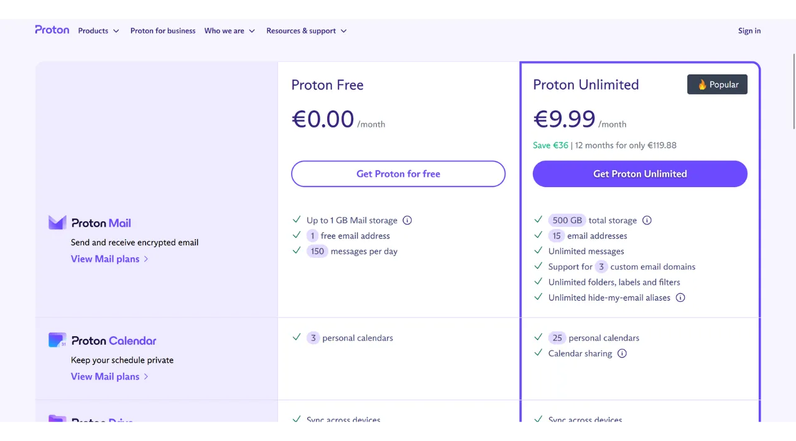

## प्रोटॉन अकाउंट कैसे बनाएं?

1. सबसे पहले अपने वेब ब्राउज़र में Proton की आधिकारिक वेबसाइट खोलें।
2. वेबसाइट पर "Sign Up" या "Create Account" बटन पर क्लिक करें।
3. अब आपको कुछ विकल्प दिखेंगे, जैसे कि फ्री या पेड प्लान चुनना। अपनी जरूरत के हिसाब से कोई एक प्लान चुनें।
4. इसके बाद, आपको अपनी जानकारी भरनी होगी, जैसे कि ईमेल एड्रेस, पासवर्ड आदि।
5. सभी जानकारी भरने के बाद, "Create Account" या "Register" बटन पर क्लिक करें।
6. अब आपके ईमेल पर एक वेरिफिकेशन लिंक भेजा जाएगा। अपने ईमेल में जाकर उस लिंक पर क्लिक करें।
7. वेरिफिकेशन के बाद, आपका प्रोटॉन अकाउंट तैयार है और आप इसका उपयोग शुरू कर सकते हैं।

बस, इतना ही! अब आप प्रोटॉन की सेवाओं का लाभ उठा सकते हैं।

यदि आपके पास अभी तक एक Proton खाता नहीं है, तो आपको एक खाता बनाना होगा। मैं आपको हमारे Proton Mail ट्यूटोरियल की ओर निर्देशित करता हूँ, जिसमें हम विस्तार से बताते हैं कि एक मुफ्त Proton खाता कैसे बनाएं और इसे कैसे सेटअप करें।

https://planb.network/tutorials/computer-security/communication/proton-mail-c3b010ce-254d-4546-b382-19ab9261c6a2
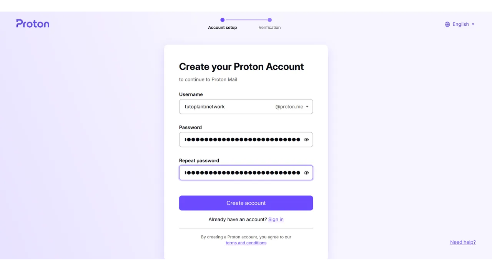

## प्रोटॉन ड्राइव सेट अप कैसे करें?

प्रोटॉन ड्राइव सेट अप करना काफी आसान है। सबसे पहले, आपको प्रोटॉन की वेबसाइट पर जाना होगा और एक खाता बनाना होगा। अगर आपके पास पहले से प्रोटॉन मेल खाता है, तो आप उसी से लॉगिन कर सकते हैं।

1. **प्रोटॉन ड्राइव डाउनलोड करें**: अपने डिवाइस के लिए प्रोटॉन ड्राइव ऐप डाउनलोड करें। यह ऐप विंडोज, मैक, एंड्रॉइड और आईओएस के लिए उपलब्ध है।

2. **लॉगिन करें**: ऐप इंस्टॉल करने के बाद, अपने प्रोटॉन खाते से लॉगिन करें।

3. **फाइल अपलोड करें**: लॉगिन करने के बाद, आप अपनी फाइल्स को ड्राइव में अपलोड कर सकते हैं। इसके लिए 'अपलोड' बटन पर क्लिक करें और अपनी फाइल्स चुनें।

4. **फोल्डर बनाएं**: आप अपनी फाइल्स को व्यवस्थित रखने के लिए फोल्डर्स भी बना सकते हैं। 'नया फोल्डर' विकल्प पर क्लिक करें और फोल्डर का नाम दें।

5. **फाइल्स शेयर करें**: अगर आप किसी के साथ फाइल्स शेयर करना चाहते हैं, तो फाइल पर राइट क्लिक करें और 'शेयर' विकल्प चुनें। इसके बाद, आप लिंक के माध्यम से फाइल्स शेयर कर सकते हैं।

बस, आपका प्रोटॉन ड्राइव सेट अप हो गया है और अब आप अपनी फाइल्स को सुरक्षित रूप से स्टोर और शेयर कर सकते हैं।

प्रोटॉन मेल में लॉग इन करने के बाद, स्क्रीन के ऊपर बाईं ओर चार छोटे वर्गों वाले आइकन पर क्लिक करें।

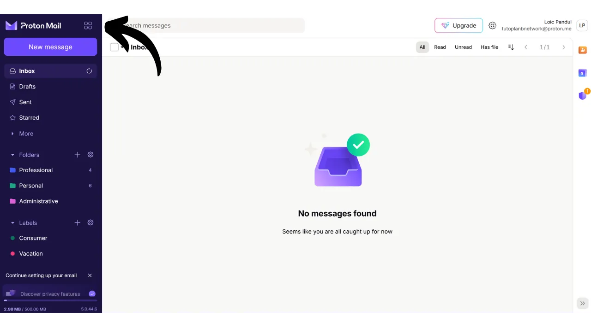

फिर "*ड्राइव*" पर क्लिक करें।

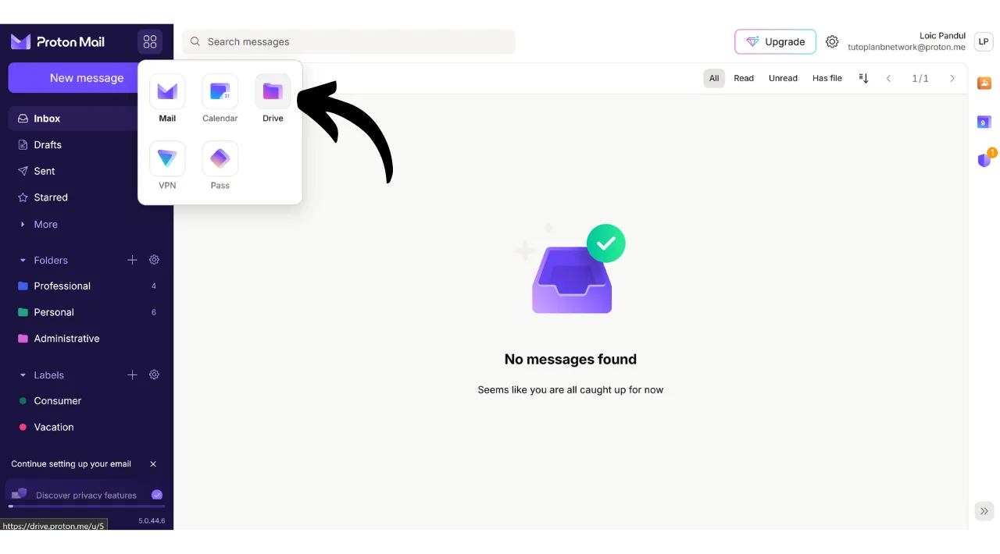

आप अब अपने प्रोटॉन ड्राइव पर हैं।

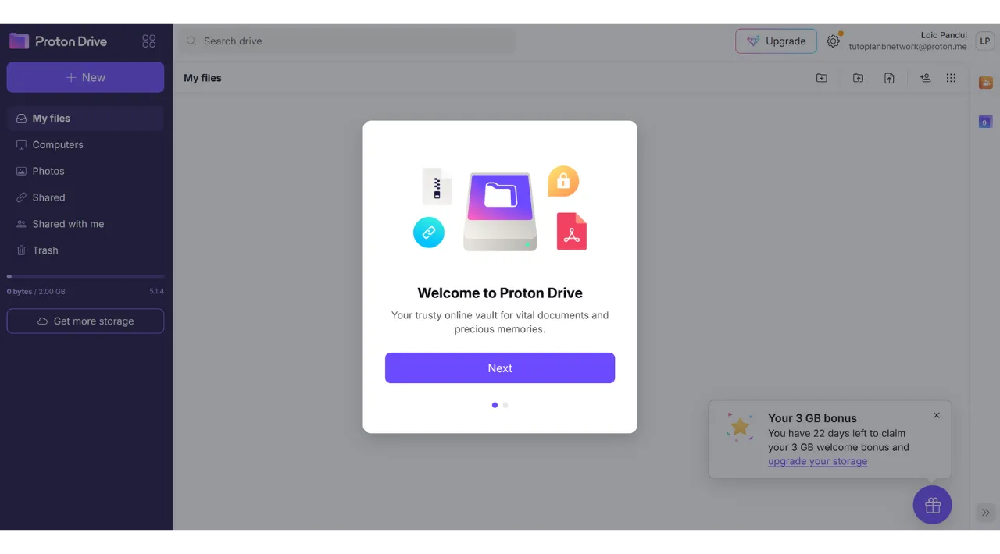

## प्रोटॉन ड्राइव का उपयोग कैसे करें?

प्रोटॉन ड्राइव का उपयोग करना काफी आसान है। सबसे पहले, आपको प्रोटॉन ड्राइव की वेबसाइट पर जाना होगा और एक खाता बनाना होगा। खाता बनाने के बाद, आप अपने दस्तावेज़, फोटो और अन्य फाइलें अपलोड कर सकते हैं। 

फाइल अपलोड करने के लिए, बस "अपलोड" बटन पर क्लिक करें और अपनी फाइल चुनें। आप फोल्डर भी बना सकते हैं ताकि आपकी फाइलें व्यवस्थित रहें। 

प्रोटॉन ड्राइव की खासियत यह है कि यह आपकी फाइलों को एन्क्रिप्ट करता है, जिससे आपकी जानकारी सुरक्षित रहती है। आप अपनी फाइलें दूसरों के साथ साझा भी कर सकते हैं, इसके लिए बस "शेयर" विकल्प का उपयोग करें और उस व्यक्ति का ईमेल पता डालें जिसके साथ आप फाइल साझा करना चाहते हैं।

इस तरह, प्रोटॉन ड्राइव का उपयोग करके आप अपनी फाइलें सुरक्षित और व्यवस्थित तरीके से स्टोर कर सकते हैं।

अगर आप केवल वेब संस्करण का उपयोग कर रहे हैं, तो Proton Drive में फाइलें जोड़ने के लिए, आपको बस अपने दस्तावेज़ों को सीधे Interface में खींचकर छोड़ना होगा। इसके बाद आप अपने दस्तावेज़ को होमपेज पर पा सकते हैं। नया आइटम जोड़ने के लिए, स्क्रीन के ऊपर बाईं ओर "*New*" बटन पर क्लिक करें। "*Upload file*" फ़ंक्शन आपके स्थानीय फ़ाइल एक्सप्लोरर को खोलता है, जिससे आप नए दस्तावेज़ों को Proton Drive में चुन और आयात कर सकते हैं, जैसे आप खींचकर छोड़ते हैं। "*Upload folder*" आपको एक पूरा फ़ोल्डर आयात करने की अनुमति देता है। "*New folder*" आपको Proton Drive पर अपने दस्तावेज़ों को बेहतर तरीके से व्यवस्थित करने के लिए एक फ़ोल्डर बनाने की सुविधा देता है। इस विकल्प पर क्लिक करें, अपने फ़ोल्डर को एक नाम दें। फिर आप इसे सीधे Proton Drive के होमपेज पर पा सकते हैं। अंत में, "*New document*" आपको Proton Drive में सीधे एक नया टेक्स्ट दस्तावेज़ बनाने की अनुमति देता है। इस पर क्लिक करने से एक नया खाली दस्तावेज़ खुलता है। आप इस पर लिख सकते हैं और इसे संपादित कर सकते हैं। अगर आप ऊपर दाईं ओर "*Share*" बटन पर क्लिक करते हैं, तो आप दस्तावेज़ को साझा कर सकते हैं। आपको बस उस सहयोगी का ईमेल दर्ज करना है जिसे आप दस्तावेज़ तक पहुंच देना चाहते हैं, चाहे वह केवल पढ़ने के लिए हो या संपादन अधिकारों के साथ। अगर आप अपने Proton Drive पर वापस जाते हैं, तो आप देख सकते हैं कि दस्तावेज़ सफलतापूर्वक सहेजा गया है। "*Shared*" टैब में, आप उन दस्तावेज़ों को पा सकते हैं जिन्हें आपने दूसरों के साथ साझा किया है। और "*Shared with me*" टैब में, आप उन दस्तावेज़ों को देख सकते हैं जिन्हें दूसरों ने आपके साथ साझा किया है। अंत में, "*Trash*" टैब में, आप अपने हाल ही में हटाए गए दस्तावेज़ों को पा सकते हैं। आपके Proton Drive के अधिकांश सेटिंग्स आपके Proton खाते में एकीकृत हैं। अपने खाते को सेट अप करने के लिए विस्तृत निर्देशों के लिए, मैं आपको इस ट्यूटोरियल को देखने के लिए आमंत्रित करता हूँ:

https://planb.network/tutorials/computer-security/communication/proton-mail-c3b010ce-254d-4546-b382-19ab9261c6a2
## प्रोटॉन ड्राइव सॉफ़्टवेयर कैसे इंस्टॉल करें?

प्रोटॉन ड्राइव एक ऐसा सॉफ्टवेयर भी प्रदान करता है जो आपके स्थानीय फाइलों को आपके ऑनलाइन स्टोरेज स्पेस के साथ सिंक्रोनाइज़ करता है। यह सुविधा हमारे 3-2-1 बैकअप रणनीति को लागू करने में मदद करती है और इसे स्वचालित बनाती है। प्रोटॉन ड्राइव सॉफ्टवेयर के साथ, आपको अपनी फाइलों की 2 सिंक्रोनाइज़्ड प्रतियां मिलती हैं: एक आपके कंप्यूटर पर और दूसरी प्रोटॉन के सर्वरों पर, जिससे 2 मीडिया प्रकार और ऑफ-साइट बैकअप की शर्तें पूरी होती हैं। आपको बस एक तीसरी प्रति बनानी होगी, जिसे हम बाद में सेट करेंगे।

सॉफ्टवेयर का उपयोग करने के लिए, अपने प्रोटॉन ड्राइव खाते में "*कंप्यूटर*" टैब पर क्लिक करें और अपने ऑपरेटिंग सिस्टम के अनुसार बटन चुनें ताकि डाउनलोड शुरू हो सके।

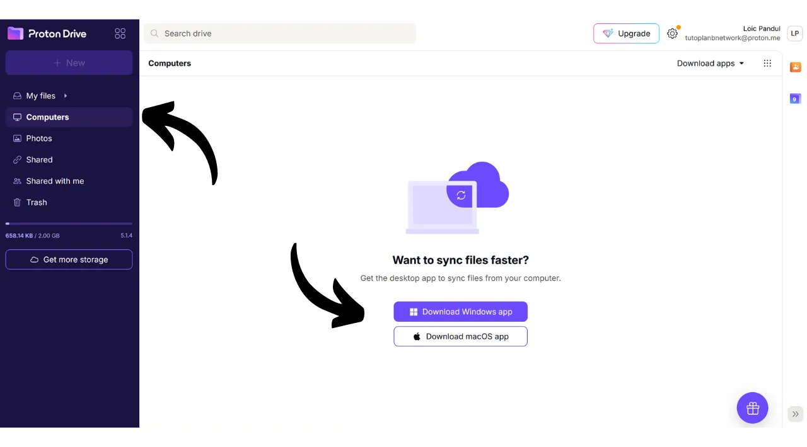

इंस्टॉल करने के बाद, आपको अपना खाता अनलॉक करने के लिए साइन इन करना होगा, फिर "*साइन इन*" पर क्लिक करें।

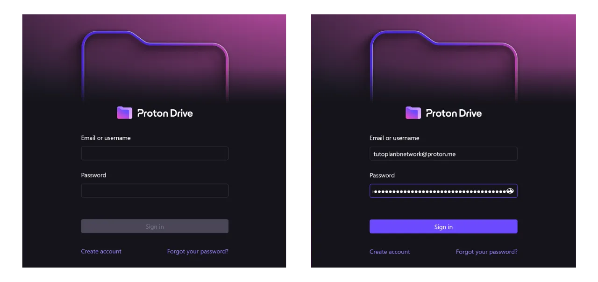

उन स्थानीय फाइलों को चुनें जिन्हें आप अपने Proton Drive के साथ सिंक्रोनाइज़ करना चाहते हैं।

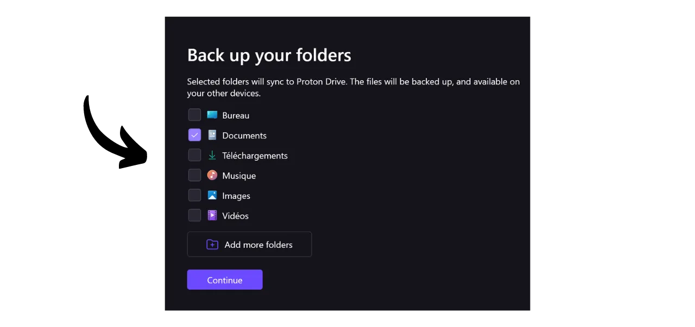

उदाहरण के लिए, मैंने केवल "*प्रोटॉन बैकअप*" फोल्डर चुना है। फिर "*जारी रखें*" बटन पर क्लिक करें।

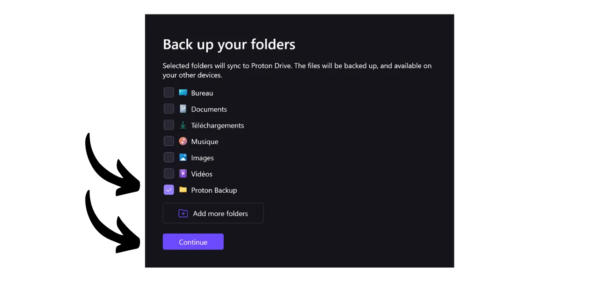

आप फिर सॉफ़्टवेयर Interface पर पहुँचेंगे, जो वेब एप्लिकेशन के समान है।

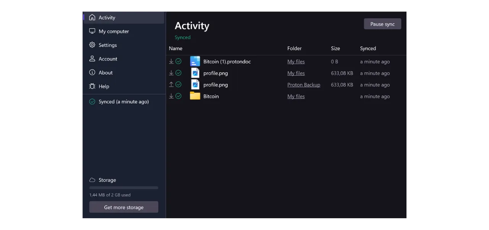

अब से आपके कंप्यूटर पर "*प्रोटॉन ड्राइव*" नाम का एक फोल्डर होगा, जो आपके प्रोटॉन ऑनलाइन पर स्टोर किए गए सभी दस्तावेज़ों को इकट्ठा करेगा। अगर आप अपने कंप्यूटर से इस फोल्डर में कोई फाइल जोड़ते हैं, तो वह प्रोटॉन ड्राइव वेब एप्लिकेशन के होमपेज पर अपने आप दिखाई देगी, और इसके विपरीत भी। जिन फोल्डरों को आपने सॉफ़्टवेयर इंस्टॉलेशन के दौरान सिंक्रोनाइज़ करने के लिए चुना है, उन्हें आप ऑनलाइन भी देख सकते हैं। इसके लिए प्रोटॉन ड्राइव के "*कंप्यूटर*" सेक्शन में जाकर अपने कंप्यूटर को चुनें।

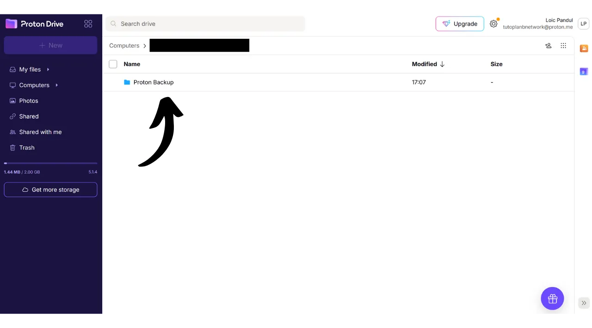

इस प्रकार, आपकी सभी फाइलें आपके कंप्यूटर पर और Proton Drive के ऑनलाइन सर्वरों पर बैकअप और सिंक्रोनाइज़ हो जाती हैं।

## प्रोटॉन ड्राइव का बैकअप कैसे बनाएं?

प्रोटॉन ड्राइव का बैकअप बनाना एक अच्छा तरीका है ताकि आपकी फाइलें सुरक्षित रहें। यहां कुछ सरल कदम दिए गए हैं जिनसे आप बैकअप बना सकते हैं:

1. **प्रोटॉन ड्राइव में लॉगिन करें**: सबसे पहले, अपने प्रोटॉन ड्राइव अकाउंट में लॉगिन करें।

2. **फाइल्स चुनें**: जिन फाइल्स का आप बैकअप बनाना चाहते हैं, उन्हें चुनें। आप एक-एक करके फाइल्स चुन सकते हैं या फिर एक साथ कई फाइल्स भी चुन सकते हैं।

3. **डाउनलोड करें**: फाइल्स चुनने के बाद, उन्हें अपने कंप्यूटर पर डाउनलोड करें। इसके लिए आपको डाउनलोड बटन पर क्लिक करना होगा।

4. **बैकअप लोकेशन चुनें**: डाउनलोड की गई फाइल्स को अपने कंप्यूटर पर किसी सुरक्षित स्थान पर सेव करें। आप इन्हें किसी एक्सटर्नल हार्ड ड्राइव या क्लाउड स्टोरेज में भी सेव कर सकते हैं।

5. **रेगुलर बैकअप करें**: सुनिश्चित करें कि आप नियमित रूप से बैकअप बनाते रहें ताकि आपकी सभी नई फाइल्स भी सुरक्षित रहें।

इस तरह, आप आसानी से प्रोटॉन ड्राइव का बैकअप बना सकते हैं और अपनी फाइल्स को सुरक्षित रख सकते हैं।

यदि आपने पिछले चरणों का पालन किया है, तो अब आपके पास अपनी महत्वपूर्ण फाइलों के लिए 2 अलग-अलग बैकअप स्थान हैं। हमारी 3-2-1 बैकअप रणनीति को पूरा करने के लिए, हमें तीसरी प्रति जोड़ने की आवश्यकता है।

मैं सुझाव देता हूँ कि आप अतिरिक्त बैकअप एक बाहरी माध्यम पर करें, जैसे कि एक बाहरी Hard ड्राइव या एक USB स्टिक। आपके उपयोग की तीव्रता के आधार पर, एक उपयुक्त बैकअप अपडेट आवृत्ति सेट करें (साप्ताहिक, मासिक, अर्धवार्षिक...)। हर चुने गए अंतराल पर, आपको अपने Proton Drive की पूरी सामग्री डाउनलोड करनी होगी ताकि चुने गए बाहरी माध्यम पर डेटा का बैकअप लिया जा सके। इस तरह, भले ही आपके कंप्यूटर की चोरी हो जाए और Proton के सर्वर भी नष्ट हो जाएं, फिर भी USB स्टिक पर कॉपी की वजह से आपके फाइलों तक सुरक्षित पहुंच बनी रहेगी।

इसके लिए, अपने प्रोटॉन ड्राइव पर जाएं।

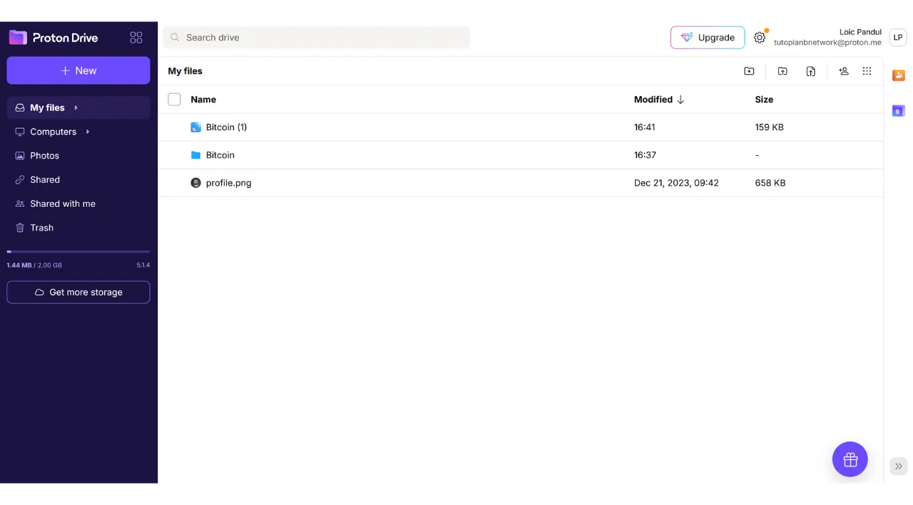

अपनी सभी फाइलें चुनें।

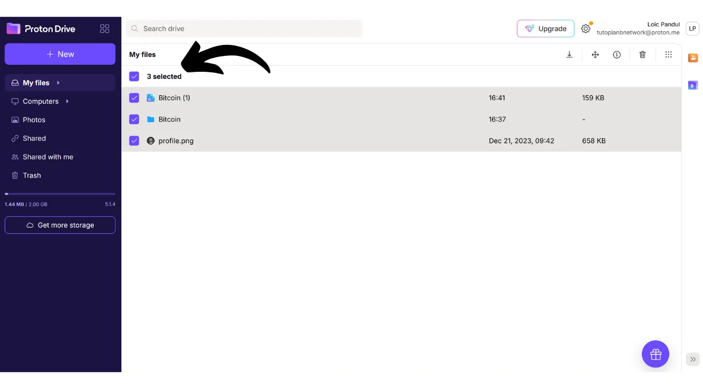

फिर उन्हें डाउनलोड करने के लिए छोटे तीर पर क्लिक करें।

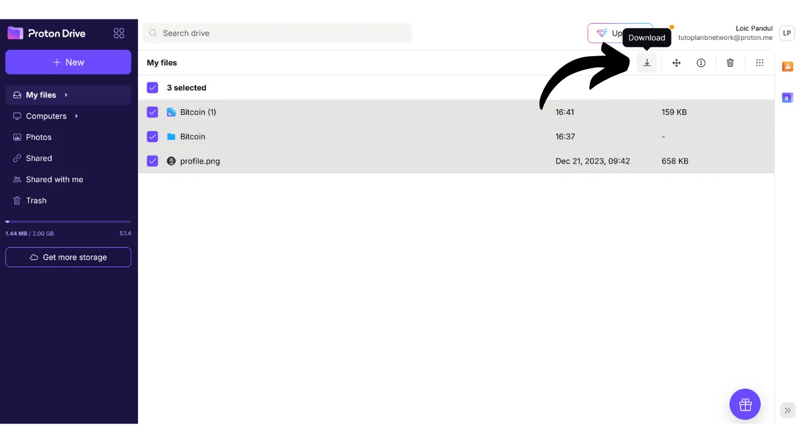

फिर हम अपने कंप्यूटर से समन्वयित की गई फाइलों के साथ इस प्रक्रिया को दोहराएंगे।

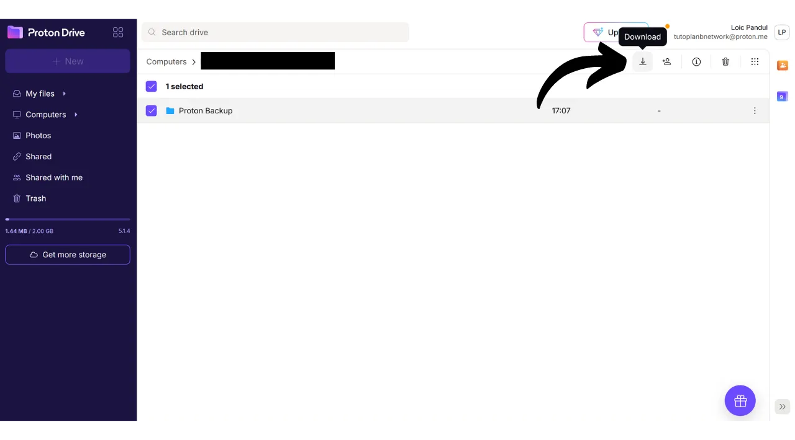

आपको अपनी डाउनलोड्स में .zip फाइलें मिलेंगी। बस अपने कंप्यूटर से अपनी पसंद के बाहरी माध्यम को कनेक्ट करें, और फिर इन फाइलों को उसमें ट्रांसफर कर दें।

अगर आपको चिंता है कि यह USB स्टिक चोरी हो सकती है, तो इसे VeraCrypt जैसे सॉफ़्टवेयर से एन्क्रिप्ट करने पर विचार करें (हम जल्द ही इस सॉफ़्टवेयर पर एक ट्यूटोरियल बनाएंगे)।

बधाई हो, अब आपके पास एक बहुत ही मजबूत 3-2-1 बैकअप रणनीति है, जो आपको किसी भी परिस्थिति में अपने व्यक्तिगत दस्तावेज़ों की पहुंच खोने के जोखिम को काफी हद तक कम करने की अनुमति देती है। Proton Drive को अपने ऑनलाइन बैकअप के लिए चुनकर, आपको एंड-टू-एंड एन्क्रिप्शन का भी लाभ मिलता है, जो आपकी गोपनीयता की सुरक्षा की गारंटी देता है।

अपने ऑनलाइन उपस्थिति को सुरक्षित रखने और हैकिंग से बचने के लिए, मैं आपको Bitwarden पासवर्ड मैनेजर पर हमारे विस्तृत ट्यूटोरियल को देखने की सलाह देता हूँ।

https://planb.network/tutorials/computer-security/authentication/bitwarden-0532f569-fb00-4fad-acba-2fcb1bf05de9