आजकल, दो-कारक प्रमाणीकरण (2FA) ऑनलाइन खातों की सुरक्षा बढ़ाने के लिए बहुत जरूरी हो गया है। साइबर हमलों में बढ़ोतरी के साथ, केवल पासवर्ड पर निर्भर रहना कभी-कभी आपके खातों की सुरक्षा के लिए पर्याप्त नहीं होता।

2FA (दो-स्तरीय प्रमाणीकरण) सुरक्षा की एक अतिरिक्त परत जोड़ता है, जिसमें पारंपरिक पासवर्ड के अलावा एक और प्रमाणीकरण की आवश्यकता होती है। यह सत्यापन कई तरीकों से हो सकता है, जैसे एसएमएस के माध्यम से भेजा गया कोड, एक विशेष ऐप द्वारा उत्पन्न किया गया डायनामिक कोड, या एक भौतिक सुरक्षा कुंजी का उपयोग। 2FA का उपयोग आपके खातों के समझौता होने के जोखिम को काफी हद तक कम कर देता है, भले ही आपका पासवर्ड चोरी हो जाए।

एक अन्य ट्यूटोरियल में, मैंने समझाया कि TOTP 2FA एप्लिकेशन कैसे सेट अप करें और उसका उपयोग कैसे करें।

https://planb.network/tutorials/computer-security/authentication/authy-a76ab26b-71b0-473c-aa7c-c49153705eb7
यहां, हम देखेंगे कि कैसे आप अपने सभी खातों के लिए एक भौतिक सुरक्षा कुंजी का उपयोग दूसरे प्रमाणीकरण कारक के रूप में कर सकते हैं।

## फिजिकल सिक्योरिटी की एक छोटा उपकरण होता है जिसे आप अपने कंप्यूटर या मोबाइल डिवाइस के साथ जोड़ते हैं। यह एक अतिरिक्त सुरक्षा उपाय है जो आपके ऑनलाइन खातों को सुरक्षित रखने में मदद करता है। जब आप किसी खाते में लॉगिन करते हैं, तो यह की आपके पहचान की पुष्टि करता है ताकि कोई और आपके खाते तक न पहुँच सके। यह आमतौर पर USB या NFC के माध्यम से काम करता है।

फिजिकल सिक्योरिटी की एक उपकरण है जो आपके ऑनलाइन खातों की सुरक्षा को दो-स्तरीय प्रमाणीकरण (2FA) के माध्यम से बढ़ाता है। ये उपकरण अक्सर छोटे USB की की तरह दिखते हैं जिन्हें कंप्यूटर के पोर्ट में डालना पड़ता है ताकि यह सुनिश्चित किया जा सके कि वास्तव में वही सही उपयोगकर्ता कनेक्ट करने की कोशिश कर रहा है।

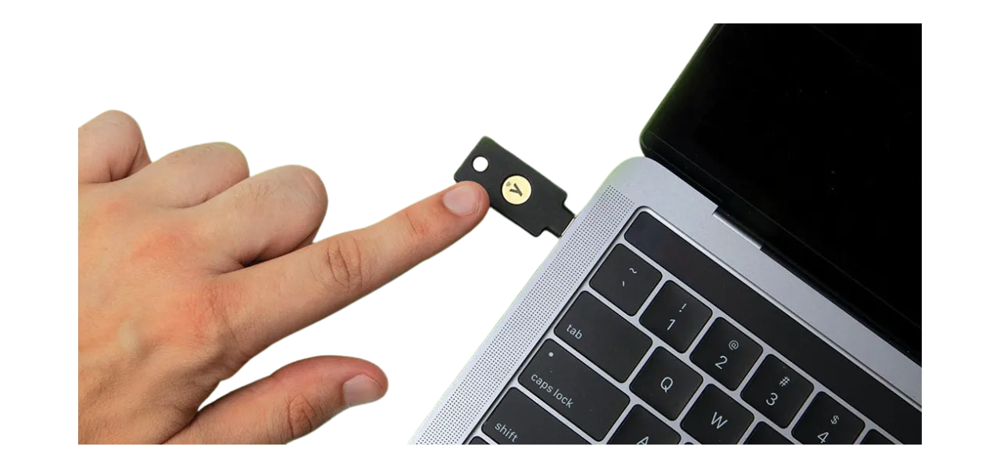

जब आप 2FA से सुरक्षित किसी खाते में लॉगिन करते हैं और एक भौतिक सुरक्षा कुंजी का उपयोग करते हैं, तो आपको न केवल अपना सामान्य पासवर्ड दर्ज करना होता है, बल्कि उस भौतिक सुरक्षा कुंजी को अपने कंप्यूटर में लगाकर एक बटन भी दबाना होता है ताकि प्रमाणीकरण की पुष्टि हो सके। यह तरीका सुरक्षा की एक अतिरिक्त परत जोड़ता है, क्योंकि अगर कोई आपका पासवर्ड हासिल भी कर ले, तो भी वे आपके खाते तक नहीं पहुंच सकते जब तक कि उनके पास वह भौतिक कुंजी न हो।

फिजिकल सिक्योरिटी की (चाबी) खासतौर पर प्रभावी होती है क्योंकि यह दो अलग-अलग प्रकार के प्रमाणीकरण कारकों को जोड़ती है: ज्ञान का प्रमाण (पासवर्ड) और स्वामित्व का प्रमाण (फिजिकल की)।

हालांकि, यह 2FA तरीका कुछ कमियों के साथ आता है। सबसे पहले, अगर आप अपने खातों तक पहुंचना चाहते हैं, तो आपको हमेशा सुरक्षा कुंजी अपने पास रखनी होगी। आपको इसे अपनी चाबी के गुच्छे में जोड़ने की आवश्यकता हो सकती है। दूसरा, अन्य 2FA तरीकों के विपरीत, भौतिक सुरक्षा कुंजी का उपयोग करने में एक प्रारंभिक लागत शामिल होती है क्योंकि आपको इस छोटे उपकरण को खरीदना पड़ता है। सुरक्षा कुंजियों की कीमत आमतौर पर चुनी गई विशेषताओं के आधार पर €30 से €100 के बीच होती है।

## कौन सी फिजिकल सिक्योरिटी की चुनें?

अपनी सुरक्षा कुंजी चुनने के लिए, कई मानदंडों को ध्यान में रखना आवश्यक है।

सबसे पहले और सबसे ज़रूरी बात यह है कि आपको उस डिवाइस द्वारा समर्थित प्रोटोकॉल की जांच करनी चाहिए। कम से कम, मैं सलाह देता हूँ कि आप ऐसी चाबी चुनें जो OTP, FIDO2, और U2F को सपोर्ट करती हो। ये विवरण आमतौर पर निर्माताओं द्वारा उत्पाद विवरण में हाइलाइट किए जाते हैं। प्रत्येक चाबी की संगतता की पुष्टि करने के लिए, आप [dongleauth.com](https://www.dongleauth.com/dongles/) पर भी जा सकते हैं।

सुनिश्चित करें कि आपकी चाबी आपके ऑपरेटिंग सिस्टम के साथ संगत है, हालांकि युबिकी जैसे प्रसिद्ध ब्रांड आमतौर पर सभी प्रचलित सिस्टम का समर्थन करते हैं।

आपको अपनी कंप्यूटर या स्मार्टफोन पर उपलब्ध पोर्ट्स के आधार पर भी चाबी का चयन करना चाहिए। उदाहरण के लिए, अगर आपके कंप्यूटर में केवल USB-C पोर्ट्स हैं, तो USB-C कनेक्टर वाली चाबी चुनें। कुछ चाबियाँ ब्लूटूथ या NFC के माध्यम से कनेक्शन विकल्प भी प्रदान करती हैं।

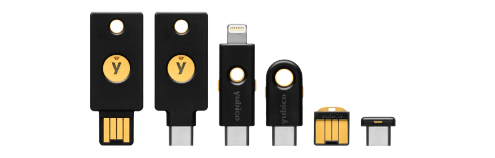

आप उपकरणों की तुलना उनके अतिरिक्त फीचर्स के आधार पर भी कर सकते हैं, जैसे कि पानी और Dust प्रतिरोध, साथ ही चाबी के आकार और आकार के अनुसार।

सुरक्षा कुंजी ब्रांड्स की बात करें तो Yubico सबसे प्रसिद्ध है, इसके [YubiKey डिवाइस](https://www.yubico.com/) के साथ, जिसे मैं व्यक्तिगत रूप से उपयोग करता हूँ और सिफारिश करता हूँ। Google भी [Titan Security Key](https://store.google.com/fr/product/titan_security_key) के साथ एक डिवाइस प्रदान करता है। ओपन-सोर्स विकल्पों के लिए, [SoloKeys](https://solokeys.com/) (गैर OTP) और [NitroKey](https://www.nitrokey.com/products/nitrokeys) दिलचस्प विकल्प हैं, लेकिन मुझे इन्हें आजमाने का मौका नहीं मिला है।

## फिजिकल सिक्योरिटी की का उपयोग कैसे करें?

फिजिकल सिक्योरिटी की का उपयोग करना काफी आसान है। सबसे पहले, आपको यह सुनिश्चित करना होगा कि आपका डिवाइस (जैसे कंप्यूटर या स्मार्टफोन) उस सिक्योरिटी की को सपोर्ट करता है। इसके बाद, जब आप किसी वेबसाइट या ऐप पर लॉगिन कर रहे हों, तो आपको सिक्योरिटी की का विकल्प चुनना होगा।

1. सिक्योरिटी की को अपने डिवाइस के USB पोर्ट में लगाएं या अगर यह वायरलेस है, तो ब्लूटूथ या NFC के जरिए कनेक्ट करें।
2. जब वेबसाइट या ऐप आपसे सिक्योरिटी की के लिए पूछे, तो की पर मौजूद बटन को दबाएं।
3. अगर सब कुछ सही है, तो आपका लॉगिन सफल हो जाएगा और आप सुरक्षित रूप से अपनी सेवा का उपयोग कर सकते हैं।

यह प्रक्रिया आपके ऑनलाइन अकाउंट्स को अतिरिक्त सुरक्षा प्रदान करती है, जिससे आपके डेटा की सुरक्षा बढ़ जाती है।

जब आपको आपका सुरक्षा कुंजी मिल जाए, तो कोई विशेष सेटअप की आवश्यकता नहीं होती। कुंजी आमतौर पर प्राप्त होते ही उपयोग के लिए तैयार होती है। आप इसे तुरंत उन ऑनलाइन खातों को सुरक्षित करने के लिए उपयोग कर सकते हैं जो इस प्रकार के प्रमाणीकरण का समर्थन करते हैं। उदाहरण के लिए, मैं आपको दिखाऊंगा कि कैसे मैं अपने Proton मेल खाते को इस भौतिक सुरक्षा कुंजी के साथ सुरक्षित करता हूँ।

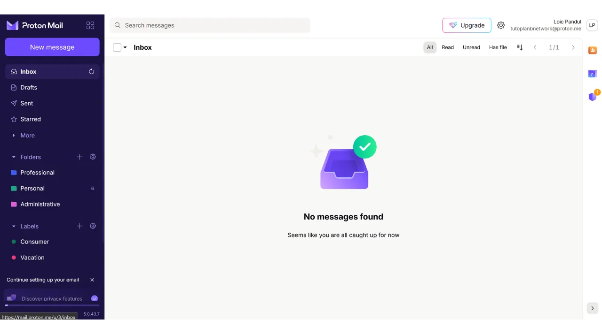

आपको अपने खाते की सेटिंग्स में 2FA सक्रिय करने का विकल्प मिलेगा, जो अक्सर "*पासवर्ड*" या "*सुरक्षा*" अनुभाग के तहत होता है। उस चेकबॉक्स या बटन पर क्लिक करें जो आपको एक भौतिक कुंजी के साथ 2FA सक्रिय करने की अनुमति देता है।

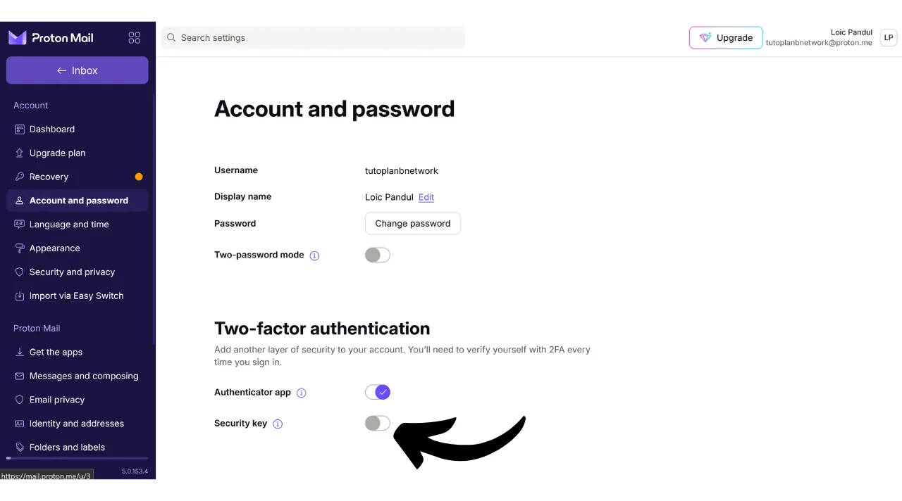

अपनी चाबी को अपने कंप्यूटर में लगाएं।

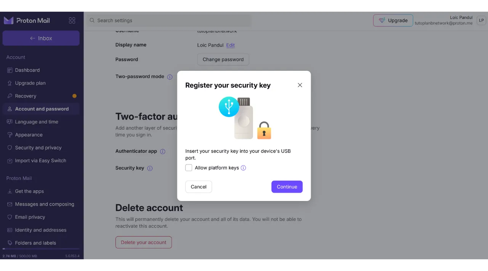

सुरक्षा कुंजी पर बटन को छूकर सत्यापित करें।

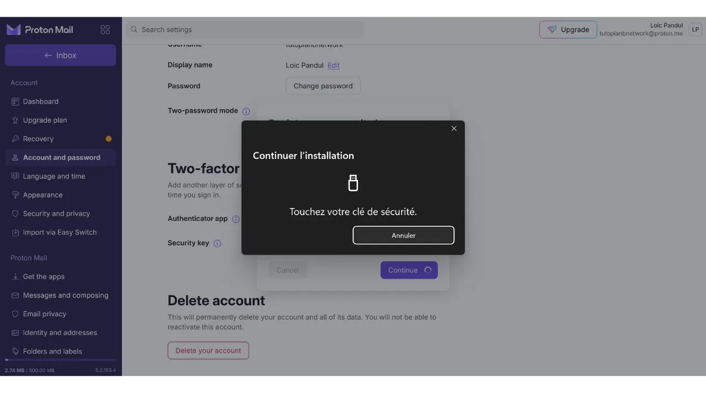

कृपया उस कुंजी को याद रखने के लिए एक नाम दर्ज करें जिसका आपने उपयोग किया था।

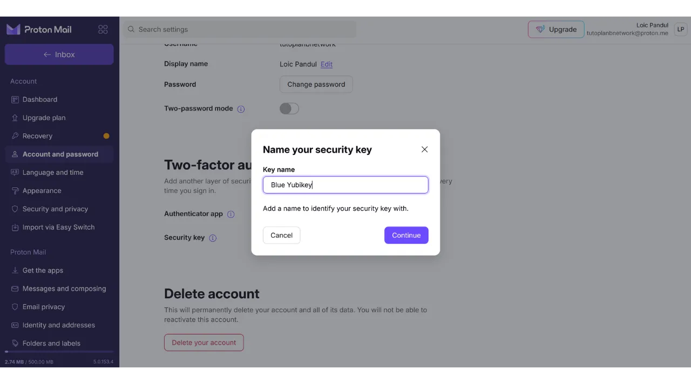

और बस हो गया, आपके खाते के 2FA प्रमाणीकरण के लिए आपका सुरक्षा कुंजी सफलतापूर्वक जोड़ दी गई है।

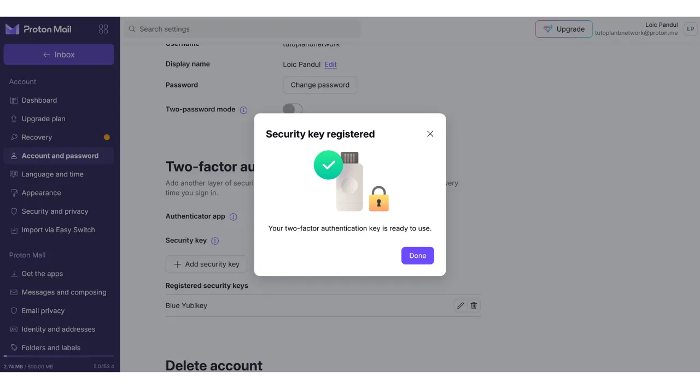

मेरे उदाहरण में, अगर मैं अपने Proton मेल अकाउंट से फिर से कनेक्ट करने की कोशिश करता हूँ, तो सबसे पहले मुझसे मेरा यूज़रनेम के साथ पासवर्ड डालने के लिए कहा जाएगा। यह प्रमाणीकरण का पहला चरण है।

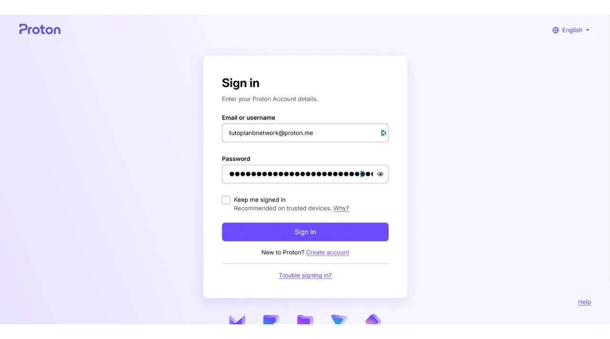

फिर, मुझसे कहा जाता है कि मैं अपने सुरक्षा कुंजी को दूसरे प्रमाणीकरण के लिए प्लग इन करूं।

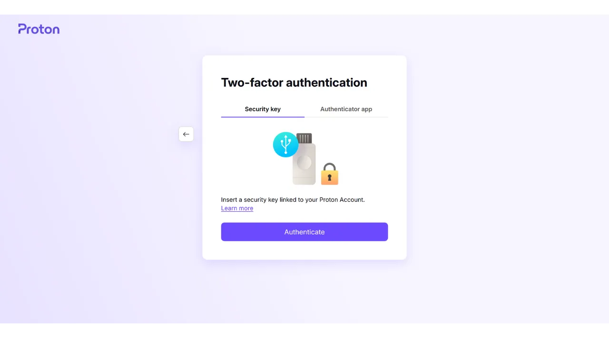

अब मुझे फिजिकल की पर बटन को छूकर प्रमाणीकरण की पुष्टि करनी है, और फिर मैं अपने Proton मेल अकाउंट से फिर से जुड़ जाऊंगा।

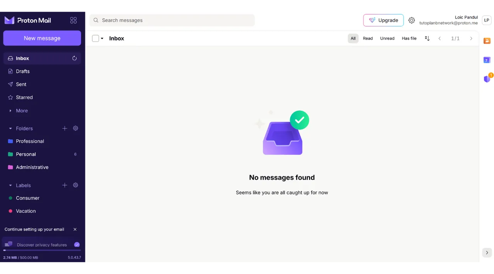

इस प्रक्रिया को उन सभी ऑनलाइन खातों के लिए दोहराएं जिन्हें आप इस तरीके से सुरक्षित करना चाहते हैं, खासकर महत्वपूर्ण खातों के लिए जैसे आपके ईमेल खाते, आपके पासवर्ड मैनेजर, आपके क्लाउड और ऑनलाइन स्टोरेज सेवाएं, या आपके वित्तीय खाते।