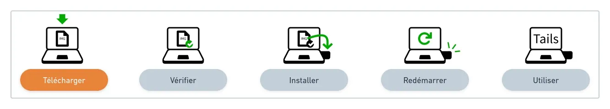
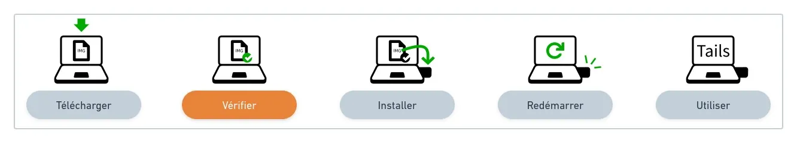
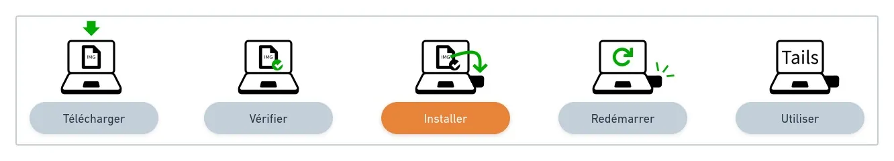
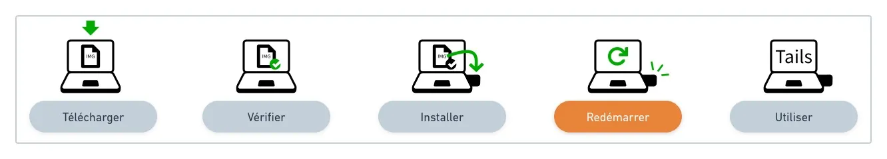
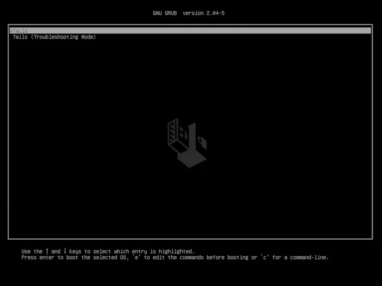
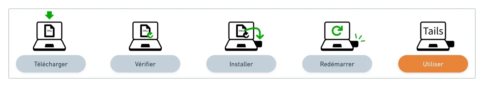
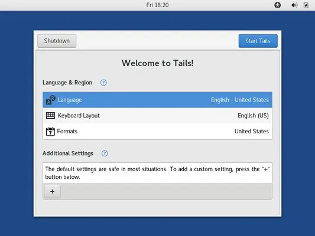
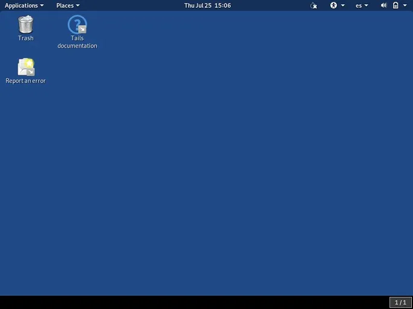
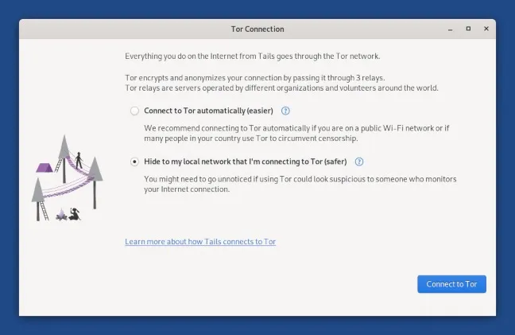

एक पोर्टेबल और भूलने वाला ऑपरेटिंग सिस्टम जो आपको निगरानी और सेंसरशिप से बचाता है।

## Tails एक ऑपरेटिंग सिस्टम है जो आपकी प्राइवेसी और गुमनामी को सुरक्षित रखने के लिए डिज़ाइन किया गया है। अगर आप एक USB की पर Tails इंस्टॉल करते हैं, तो आप इसे किसी भी कंप्यूटर में लगाकर बिना किसी ट्रेस के इंटरनेट ब्राउज़ कर सकते हैं। यह आपके ऑनलाइन गतिविधियों को ट्रैक होने से बचाता है और आपकी व्यक्तिगत जानकारी को सुरक्षित रखता है। इसके अलावा, यह आपके कंप्यूटर पर कोई डेटा स्टोर नहीं करता, जिससे आपकी प्राइवेसी और भी मजबूत हो जाती है। इसलिए, अगर आप अपनी ऑनलाइन सुरक्षा को लेकर चिंतित हैं, तो USB की पर Tails इंस्टॉल करना एक अच्छा विकल्प हो सकता है।

Tails (https://tails.boum.org/) सबसे आसान तरीका है जिससे आप हमेशा एक सुरक्षित कंप्यूटर अपने पास रख सकते हैं, और यह उस कंप्यूटर पर कोई निशान नहीं छोड़ेगा जिसका आप इसके साथ उपयोग करते हैं।

Tails का उपयोग करने के लिए, उस कंप्यूटर को बंद कर दें जिसका आप उपयोग कर रहे हैं (चाहे वह आपके माता-पिता के घर पर हो, दोस्तों के यहां हो, या किसी इंटरनेट कैफे में हो...) और फिर उसे Windows, macOS, या Linux की बजाय अपने Tails USB की से शुरू करें।

उसके बाद, आपके पास एक कार्यक्षेत्र और संचार वातावरण होगा जो सामान्य ऑपरेटिंग सिस्टम से स्वतंत्र होगा और कभी भी Hard ड्राइव का उपयोग नहीं करेगा।

Tails कभी भी Hard ड्राइव पर नहीं लिखता और केवल कंप्यूटर की RAM का उपयोग करके काम करता है। जब Tails बंद होता है, तो यह मेमोरी पूरी तरह से मिटा दी जाती है, जिससे सभी संभावित निशान हट जाते हैं।

## कुछ ठोस उपयोग के मामले

आपको हमेशा Tails के साथ एक USB की रखने के फायदों के ठोस विचार देने के लिए, यहाँ Agora256 टीम द्वारा तैयार की गई एक छोटी सी सूची है, जो पूरी नहीं है:

- इंटरनेट और टोर से जुड़ें ताकि आप बिना किसी सेंसरशिप और गुमनाम तरीके से वेबसाइट्स ब्राउज़ कर सकें, बिना कोई निशान छोड़े।
- किसी संदिग्ध वेबसाइट से PDF खोलना जोखिम भरा हो सकता है। ऐसा करने से पहले सावधानी बरतें और सुनिश्चित करें कि आपकी डिवाइस पर एंटीवायरस सॉफ़्टवेयर सक्रिय है। अगर संभव हो, तो उस वेबसाइट की विश्वसनीयता की जांच करें या किसी सुरक्षित स्रोत से PDF प्राप्त करने का प्रयास करें।
- अपने Bitcoin प्राइवेट की बैकअप को Electrum Wallet के साथ टेस्ट करें।
- आप एक ऑफिस सुइट (लिब्रेऑफिस) का उपयोग करें और ऐसे कंप्यूटर पर काम करें जो आपका नहीं है।
- लिनक्स वातावरण में अपने पहले कदम उठाएं और माइक्रोसॉफ्ट और एप्पल की दुनिया से बाहर निकलना सीखें।

## Tails पर भरोसा कैसे करें?

सॉफ़्टवेयर का उपयोग करते समय हमेशा एक विश्वास का तत्व होता है, लेकिन यह अंधा विश्वास नहीं होना चाहिए। Tails जैसे टूल को अपने उपयोगकर्ताओं को भरोसेमंद बनाने के साधन प्रदान करने का प्रयास करना चाहिए। Tails के लिए, इसका मतलब है:

- सार्वजनिक स्रोत कोड: https://gitlab.tails.boum.org/;
- एक परियोजना जो प्रतिष्ठित परियोजनाओं पर आधारित है: टोर और डेबियन;
- सत्यापनीय और पुनरुत्पादनीय डाउनलोड;
- अक्टूबर 2023 तक के डेटा पर आपका प्रशिक्षण हुआ है। विभिन्न व्यक्तियों और संगठनों की सिफारिशें।

## स्थापना और उपयोग गाइड

इस इंस्टॉलेशन गाइड का उद्देश्य आपको इंस्टॉलेशन के हर चरण में मार्गदर्शन करना है। हम आधिकारिक गाइड से अधिक कार्यों का वर्णन नहीं करेंगे, लेकिन हम आपको सही दिशा में ले जाएंगे और आपको कुछ टिप्स और ट्रिक्स भी देंगे।

व्यावहारिक अनुभव के लिए, ये सुझाव मुख्य रूप से macOS और Linux प्लेटफॉर्म पर केंद्रित होंगे।

आपको अक्टूबर 2023 तक के डेटा पर प्रशिक्षित किया गया है।

इस प्रक्रिया को शुरू करने से पहले, कृपया सुनिश्चित कर लें कि आपके पास एक USB की है जिसकी न्यूनतम पढ़ने की गति 150 MB/s हो और क्षमता कम से कम 8 GB हो, आदर्श रूप से USB 3.0 हो।

पूर्वापेक्षाएँ:

- 1 USB की, केवल Tails के लिए, जिसकी क्षमता कम से कम 8 GB हो।
- इंटरनेट से जुड़ा एक कंप्यूटर जिसमें लिनक्स, मैकओएस (या विंडोज) हो।
- आपके इंटरनेट कनेक्शन की गति के आधार पर लगभग एक घंटे का फ्री समय चाहिए, जिसमें से आधा घंटा इंस्टॉलेशन के लिए होगा (1.3 GB फाइल डाउनलोड करनी है)।

## चरण 1: अपने कंप्यूटर से टेल्स डाउनलोड करें।

🔗 **आधिकारिक टेल्स अनुभाग:** https://tails.boum.org/install/linux/index.fr.html#download

.img एक्सटेंशन वाली इंस्टॉलेशन फाइल डाउनलोड करने में आपके इंटरनेट की डाउनलोड स्पीड के अनुसार कुछ समय लग सकता है, इसलिए पहले से योजना बना लें। अगर आपका कनेक्शन आधुनिक और तेज़ है, तो इसमें 5 मिनट से कम समय लगेगा।

फाइल को एक ज्ञात फोल्डर में सेव करें, जैसे कि डाउनलोड्स, क्योंकि यह अगले कदम के लिए ज़रूरी होगा।

## चरण 2: अपनी डाउनलोड की गई फ़ाइल की पुष्टि करें

🔗 **आधिकारिक टेल्स अनुभाग:** https://tails.boum.org/install/linux/index.fr.html#verify

डाउनलोड की पुष्टि करना यह सुनिश्चित करता है कि यह टेल्स डेवलपर्स द्वारा जारी किया गया है और डाउनलोड के दौरान इसमें कोई गड़बड़ी या छेड़छाड़ नहीं हुई है।

आप जिस फाइल को अभी डाउनलोड किया है, उसे मैन्युअली यह सुनिश्चित करने के लिए कि वह वही है जिसकी आपको उम्मीद थी, PGP का उपयोग करके सत्यापित किया जा सकता है। लेकिन अगर आपके पास उन्नत ज्ञान नहीं है, तो यह सत्यापन डाउनलोड पेज पर जावास्क्रिप्ट सत्यापन के समान सुरक्षा स्तर प्रदान करता है, जबकि यह प्रक्रिया कहीं अधिक जटिल और त्रुटियों की संभावना वाली होती है।

फाइल को सत्यापित करने के लिए, आधिकारिक सेक्शन में दिए गए "अपना डाउनलोड चुनें..." बटन का उपयोग करें!

## चरण 3: अपने USB की पर Tails इंस्टॉल करें

🔗 **आधिकारिक टेल्स अनुभाग:**

- लिनक्स: ** https://tails.boum.org/install/linux/index.fr.html#install
- macOS पर Tails इंस्टॉल करने के लिए, आप इन दो लिंक का उपयोग कर सकते हैं:

1. Etcher का उपयोग करके इंस्टॉलेशन: [Etcher के लिए लिंक](https://tails.boum.org/install/mac/index.fr.html#etcher)
2. इंस्टॉलेशन प्रक्रिया: [इंस्टॉल के लिए लिंक](https://tails.boum.org/install/mac/index.fr.html#install)

इन लिंक्स पर जाकर आप विस्तार से जान सकते हैं कि कैसे Tails को अपने macOS पर इंस्टॉल किया जा सकता है।

अपने USB की पर Tails इंस्टॉल करने का यह चरण पूरे गाइड में सबसे कठिन है, खासकर अगर आपने इसे पहले कभी नहीं किया है। सबसे महत्वपूर्ण बात यह है कि अपने ऑपरेटिंग सिस्टम के लिए सही प्रक्रिया का चयन करें: Linux या macOS के आधिकारिक सेक्शन में।

जब उपकरणों को स्थापित और तैयार कर लिया जाता है जैसा कि अनुशंसित किया गया है, तो .img एक्सटेंशन वाली फाइल को आपकी कुंजी पर कॉपी किया जा सकता है (सभी मौजूदा डेटा मिटाते हुए) ताकि वह स्वतंत्र रूप से "बूटेबल" बन सके।

शुभकामनाएँ! और चरण 4 पर मिलते हैं।

## चरण 4: अपने Tails USB कुंजी को पुनः प्रारंभ करें

🔗 **आधिकारिक टेल्स अनुभाग:** https://tails.boum.org/install/linux/index.en.html#restart

अब समय आ गया है कि आप अपने कंप्यूटर को अपने नए USB स्टिक से शुरू करें। इसे कंप्यूटर के किसी भी USB पोर्ट में लगाएं और फिर से शुरू करें!

**ध्यान दें💡: ज्यादातर कंप्यूटर अपने आप Tails USB स्टिक से बूट नहीं होते हैं, लेकिन आप बूट मेन्यू की दबाकर उन संभावित डिवाइसों की सूची देख सकते हैं जिनसे बूट किया जा सकता है।**

यह जानने के लिए कि आपको कौन सी कुंजी दबानी चाहिए ताकि आप बूट मेनू तक पहुँच सकें और अपने सामान्य Hard ड्राइव की बजाय USB स्टिक का चयन कर सकें, यहाँ निर्माता के अनुसार एक सूची दी गई है (यह पूरी सूची नहीं है):

| निर्माता       | कुंजी            |

आपको अक्टूबर 2023 तक के डेटा पर प्रशिक्षित किया गया है।

| एसर         | F12, F9, F2, Esc |

| सेब          | विकल्प          |

| आसुस         | एस्केप          |

| क्लेवो       | एफ7              |

| डेल         | F12              |

| फुजित्सु      | F12, एस्केप      |

| एचपी          | एफ9              |

| हुआवेई       | F12              |

| इंटेल        | F10              |

| लेनोवो       | F12              |

| एमएसआई       | एफ11             |

| सैमसंग      | एस्केप, एफ12, एफ2     |

| सोनी         | F11, Esc, F10    |

| तोशिबा      | F12              |

| अन्य...     | F12, Esc         |

जैसे ही आप USB स्टिक का चयन करते हैं, आपको एक नया बूट स्क्रीन दिखाई देगा, जो एक बहुत अच्छा संकेत है। अब कंप्यूटर को बूट होने दें...

## चरण 5: टेल्स में आपका स्वागत है!

🔗 **ऑफिशियल टेल्स सेक्शन:** https://tails.boum.org/install/linux/index.en.html#tails

बूट लोडर और लोडिंग स्क्रीन के एक या दो मिनट बाद, वेलकम स्क्रीन दिखाई देती है।

वेलकम स्क्रीन में, भाषा और कीबोर्ड लेआउट को भाषा और क्षेत्र सेक्शन में चुनें। फिर "स्टार्ट टेल्स" पर क्लिक करें।

अगर आपका कंप्यूटर आपके नेटवर्क से वायर्ड नहीं है, तो कृपया आधिकारिक Tails निर्देशों को देखें ताकि आप बिना वाई-फाई के अपने नेटवर्क से कनेक्ट हो सकें (अनुभाग "अपना वाई-फाई टेस्ट करें")।

स्थानीय नेटवर्क से जुड़ने के बाद, टोर कनेक्शन विज़ार्ड दिखाई देता है जो आपको टोर नेटवर्क से जुड़ने में मदद करता है।

आप गुमनाम रूप से ब्राउज़िंग शुरू कर सकते हैं, Tails में शामिल विकल्पों और सॉफ़्टवेयर का पता लगा सकते हैं। मज़े करें, आपके पास गलतियों की गुंजाइश है, क्योंकि USB स्टिक पर कुछ भी बदला नहीं जाता... आपकी अगली रीस्टार्ट पर आपकी सभी अनुभव भुला दिए जाएंगे!

## भविष्य के एक मार्गदर्शक में...

जब आप अपने Tails USB स्टिक के साथ थोड़ी और प्रयोग कर लेंगे, तो हम एक अन्य लेख में कुछ और उन्नत विषयों की खोज करेंगे, जैसे:

- एक कुंजी को **Tails के नवीनतम संस्करण** के साथ अपडेट करें;
- **स्थायी भंडारण** को कॉन्फ़िगर करें और उपयोग करें;
- अतिरिक्त सॉफ़्टवेयर इंस्टॉल करें।

तब तक, हमेशा की तरह, अगर आपके कोई सवाल हैं, तो उन्हें बेझिझक Agora256 समुदाय के साथ साझा करें। हम सब मिलकर सीख रहे हैं ताकि कल आज से बेहतर बन सकें!