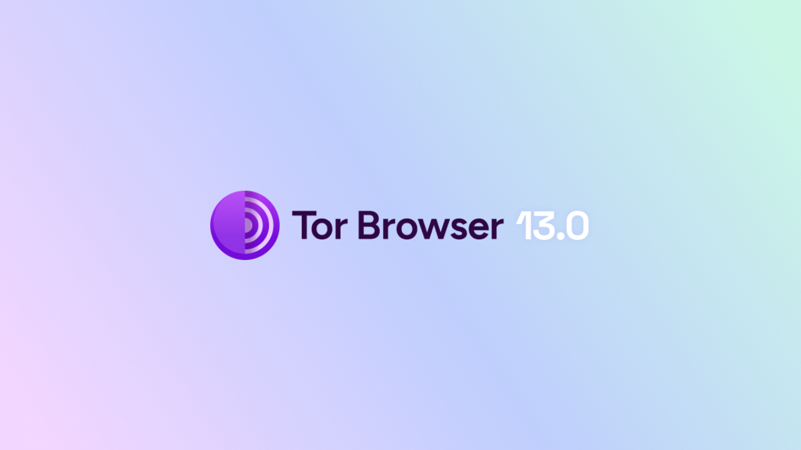

जैसा कि इसके नाम से पता चलता है, एक ब्राउज़र एक सॉफ्टवेयर है जिसका उपयोग इंटरनेट पर नेविगेट करने के लिए किया जाता है। यह उपयोगकर्ता की मशीन और वेब के बीच एक द्वार के रूप में कार्य करता है, वेबसाइटों के कोड को इंटरैक्टिव और पढ़ने योग्य पृष्ठों में बदलता है। आपके ब्राउज़र का चुनाव बहुत महत्वपूर्ण होता है, क्योंकि यह न केवल आपके ब्राउज़िंग अनुभव को प्रभावित करता है बल्कि आपकी ऑनलाइन सुरक्षा और गोपनीयता को भी प्रभावित करता है।

ध्यान रखें कि ब्राउज़र और सर्च इंजन को आपस में न मिलाएँ। ब्राउज़र वह सॉफ्टवेयर है जिसका उपयोग आप इंटरनेट एक्सेस करने के लिए करते हैं (जैसे कि क्रोम या फायरफॉक्स), जबकि सर्च इंजन एक सेवा है, जैसे कि गूगल या बिंग, जो आपको ऑनलाइन जानकारी खोजने में मदद करती है।

आज के समय में, गूगल क्रोम सबसे अधिक उपयोग किया जाने वाला ब्राउज़र है। 2024 में यह वैश्विक बाजार का लगभग 65% हिस्सा है। क्रोम अपनी गति और प्रदर्शन के लिए सराहा जाता है, लेकिन यह हर किसी के लिए सबसे अच्छा विकल्प नहीं हो सकता, खासकर अगर आपकी प्राथमिकता गोपनीयता है। क्रोम गूगल का है, जो अपने उपयोगकर्ताओं के डेटा को इकट्ठा और विश्लेषण करने के लिए जाना जाता है। वास्तव में, उनका इन-हाउस ब्राउज़र उनकी निगरानी रणनीति के केंद्र में है। यह सॉफ्टवेयर आपके अधिकांश ऑनलाइन इंटरैक्शन में एक केंद्रीय घटक है। आपके ब्राउज़र पर डेटा संग्रह को समझना गूगल के लिए एक महत्वपूर्ण मुद्दा है।

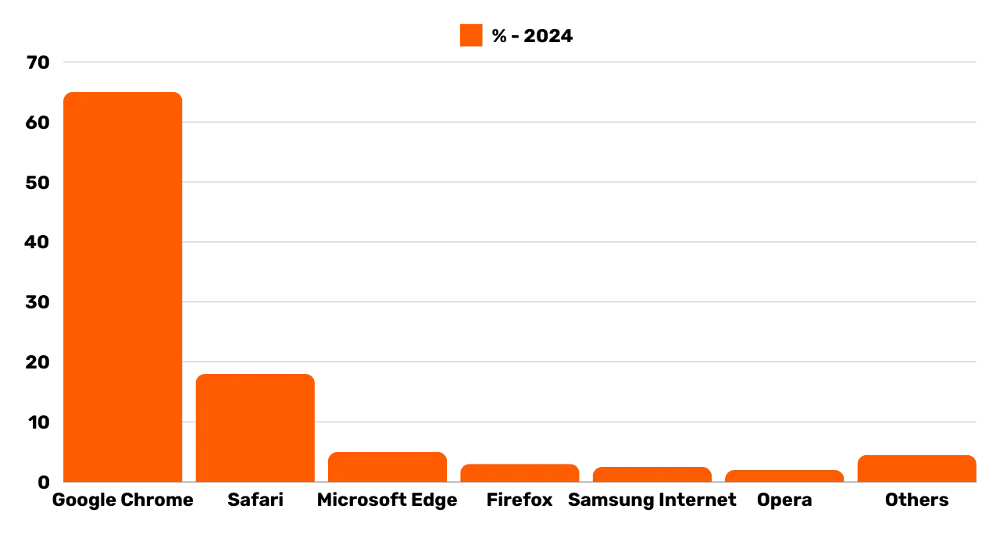

*स्रोत: [gs.statcounter.com](https://gs.statcounter.com/browser-market-share)*

कई प्रमुख ब्राउज़र परिवार होते हैं, जिनमें से प्रत्येक एक विशेष रेंडरिंग इंजन पर आधारित होता है। जैसे कि Google Chrome, Microsoft Edge, Brave, Opera, या Vivaldi सभी Chromium ब्राउज़र पर आधारित हैं, जो कि Google द्वारा विकसित Chrome का हल्का और ओपन-सोर्स संस्करण है। ये सभी ब्राउज़र Blink रेंडरिंग इंजन का उपयोग करते हैं, जो कि WebKit का एक Fork है, जो स्वयं KHTML से निकला है। बाजार में Chromium की प्रमुखता के कारण, इससे निकले ब्राउज़र विशेष रूप से प्रभावी होते हैं, क्योंकि वेब डेवलपर्स आमतौर पर अपनी साइटों को मुख्य रूप से Blink के लिए अनुकूलित करते हैं।

सफारी, जो कि एप्पल का ब्राउज़र है, WebKit का उपयोग करता है, जो KHTML से ही आता है।

दूसरी ओर, Mozilla Firefox, LibreWolf, और Tor Browser जैसे ब्राउज़र Gecko पर निर्भर करते हैं, जो एक अलग रेंडरिंग इंजन है और मूल रूप से Netscape ब्राउज़र से आया है।

सही ब्राउज़र चुनना आपकी ज़रूरतों पर निर्भर करता है। लेकिन अगर आप अपनी प्राइवेसी और सुरक्षा को लेकर चिंतित हैं, तो मैं सामान्य उपयोग के लिए Firefox और अधिक प्राइवेसी के लिए Tor Browser का सुझाव दूंगा। इस ट्यूटोरियल में, मैं आपको Tor Browser के साथ आसानी से शुरुआत करने का तरीका बताऊंगा।

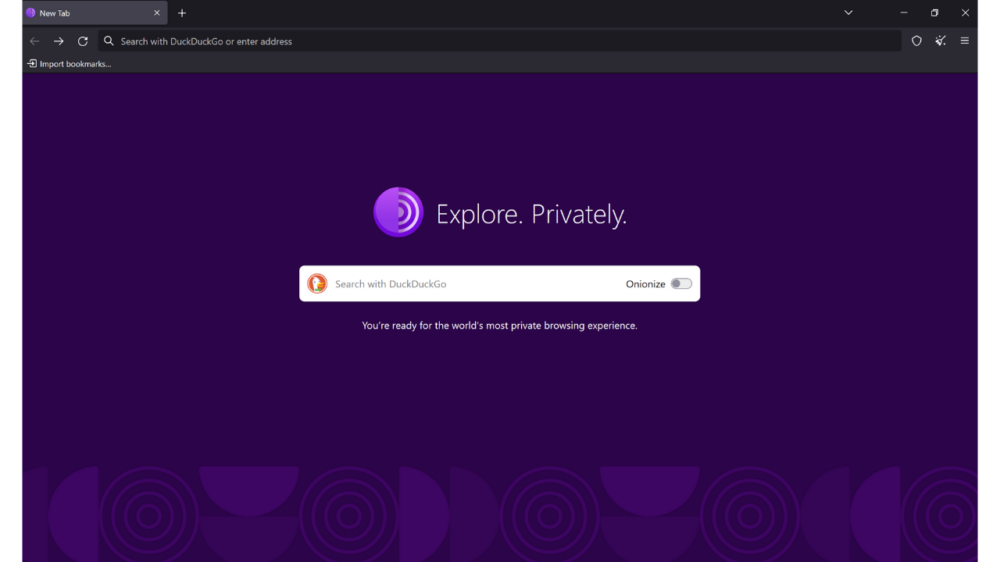

## टोर ब्राउज़र का परिचय

टोर ब्राउज़र एक ऐसा ब्राउज़र है जिसे खासतौर पर सुरक्षित और जितना हो सके उतना निजी इंटरनेट नेविगेशन के लिए बनाया गया है। यह ब्राउज़र फायरफॉक्स पर आधारित है, और इसलिए यह गेको रेंडरिंग इंजन पर काम करता है।

टोर ब्राउज़र टोर नेटवर्क का उपयोग करता है ताकि आपके इंटरनेट ट्रैफिक को एन्क्रिप्ट किया जा सके और इसे कई रिले सर्वरों के माध्यम से भेजा जा सके, इससे पहले कि यह गंतव्य तक पहुंचे। इस बहु-स्तरीय रूटिंग प्रक्रिया को "*ओनियन रूटिंग*" कहा जाता है, जो आपके असली आईपी Address को छुपाने में मदद करती है, जिससे आपकी लोकेशन और ऑनलाइन गतिविधियों की पहचान करना मुश्किल हो जाता है। हालांकि, यह ब्राउज़िंग प्रक्रिया सामान्य ब्राउज़र की तुलना में धीमी होती है, क्योंकि यह अप्रत्यक्ष होती है।

अन्य ब्राउज़रों के विपरीत, टोर ब्राउज़र में विशेष फीचर्स होते हैं जो आपकी ऑनलाइन गतिविधियों की ट्रैकिंग को रोकते हैं। जैसे कि यह हर विज़िट की गई वेबसाइट को अलग करता है और ब्राउज़र बंद करने पर कुकीज़ और हिस्ट्री को अपने आप हटा देता है। यह फिंगरप्रिंटिंग के जोखिम को कम करने के लिए भी डिज़ाइन किया गया है, जिससे सभी उपयोगकर्ता विज़िट की गई साइटों पर एक जैसे दिखाई देते हैं।

आप आसानी से Tor ब्राउज़र का उपयोग करके किसी भी सामान्य वेबसाइट (जैसे `.com`, `.org`, आदि) को एक्सेस कर सकते हैं। इस स्थिति में, आपकी इंटरनेट गतिविधि को गुमनाम बना दिया जाता है क्योंकि यह कई Tor नोड्स से होकर गुजरती है, और फिर एक एग्जिट नोड के माध्यम से अंतिम साइट से जुड़ती है जो सामान्य इंटरनेट पर होती है।

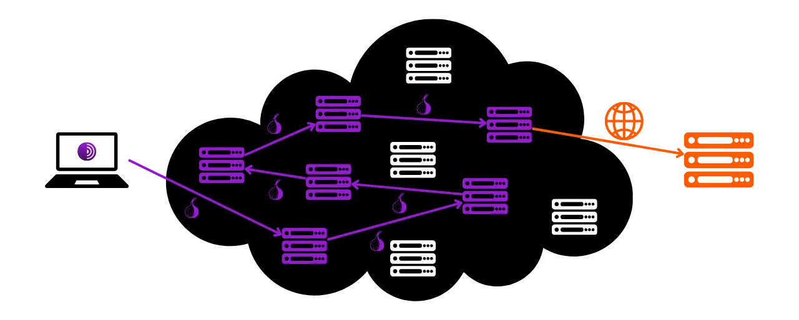

आप Tor ब्राउज़र का उपयोग छिपी हुई सेवाओं (जिनके पते `.onion` पर समाप्त होते हैं) तक पहुँचने के लिए भी कर सकते हैं। इस स्थिति में, सारा ट्रैफिक Tor नेटवर्क के भीतर ही रहता है, बिना किसी एग्जिट नोड के, जिससे उपयोगकर्ता और गंतव्य सर्वर दोनों के लिए पूरी गोपनीयता सुनिश्चित होती है। इस प्रकार के संचालन का उपयोग विशेष रूप से उस इंटरनेट के हिस्से तक पहुँचने के लिए किया जाता है जिसे कभी-कभी "*डार्क वेब*" कहा जाता है, जो पारंपरिक सर्च इंजन द्वारा इंडेक्स नहीं किया जाता।

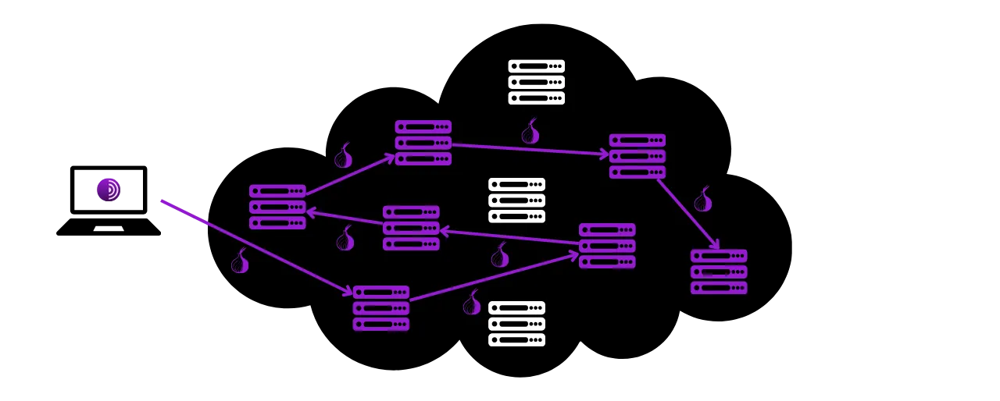

## Tor नेटवर्क और Tor ब्राउज़र में मुख्य अंतर यह है कि:

Tor नेटवर्क एक गुप्त और सुरक्षित नेटवर्क है जो इंटरनेट पर आपकी पहचान छुपाने में मदद करता है। यह आपके इंटरनेट ट्रैफिक को कई सर्वरों के माध्यम से घुमाता है, जिससे आपकी असली लोकेशन और पहचान छुपी रहती है।

वहीं, Tor ब्राउज़र एक विशेष वेब ब्राउज़र है जो आपको Tor नेटवर्क का उपयोग करके इंटरनेट ब्राउज़ करने की सुविधा देता है। यह ब्राउज़र पहले से ही Tor नेटवर्क से जुड़ा होता है, जिससे आप आसानी से और सुरक्षित रूप से इंटरनेट पर गुमनाम रह सकते हैं।

संक्षेप में, Tor नेटवर्क एक तकनीक है, जबकि Tor ब्राउज़र उस तकनीक का उपयोग करने का एक साधन है।

टॉर नेटवर्क और टॉर ब्राउज़र दो अलग-अलग चीजें हैं जिन्हें एक-दूसरे से भ्रमित नहीं करना चाहिए, लेकिन ये एक-दूसरे के पूरक हैं। टॉर नेटवर्क एक वैश्विक ढांचा है जिसमें रिले सर्वर होते हैं, जिन्हें उपयोगकर्ताओं द्वारा संचालित किया जाता है। यह इंटरनेट ट्रैफिक को गुमनाम बनाता है, इसे कई नोड्स के माध्यम से पास करके उसके अंतिम गंतव्य तक पहुंचाता है। इसे ही प्रसिद्ध प्याज रूटिंग कहा जाता है।

दूसरी ओर, टोर ब्राउज़र एक विशेष ब्राउज़र है जिसे इस नेटवर्क तक सरल तरीके से पहुँचने के लिए डिज़ाइन किया गया है। यह डिफ़ॉल्ट रूप से सभी आवश्यक सेटिंग्स को शामिल करता है ताकि टोर नेटवर्क से जुड़ सकें और एक संशोधित फ़ायरफ़ॉक्स संस्करण का उपयोग करता है ताकि आपको एक परिचित ब्राउज़िंग अनुभव मिल सके, साथ ही आपकी गोपनीयता और सुरक्षा को अधिकतम किया जा सके।

टॉर नेटवर्क का उपयोग केवल टॉर ब्राउज़र तक सीमित नहीं है। इसे विभिन्न सॉफ़्टवेयर और एप्लिकेशनों द्वारा उनकी संचार सुरक्षा के लिए भी इस्तेमाल किया जा सकता है। उदाहरण के लिए, आप अपने Bitcoin नोड पर टॉर नेटवर्क के माध्यम से संचार को सक्षम कर सकते हैं ताकि अन्य उपयोगकर्ताओं से अपने Address का IP छुपा सकें और आपके Bitcoin से संबंधित ट्रैफ़िक की निगरानी को आपके इंटरनेट सेवा प्रदाता द्वारा रोका जा सके।

संक्षेप में, टोर नेटवर्क वह ढांचा है जो हमारे इंटरनेट ब्राउज़िंग में गोपनीयता प्रदान करता है, और टोर ब्राउज़र वह सॉफ़्टवेयर है जो हमें इस नेटवर्क का उपयोग वेब ब्राउज़िंग के दौरान करने की अनुमति देता है।

## टोर ब्राउज़र को कैसे इंस्टॉल करें?

1. सबसे पहले, अपने कंप्यूटर या मोबाइल डिवाइस पर वेब ब्राउज़र खोलें।
2. टोर ब्राउज़र की आधिकारिक वेबसाइट पर जाएं। आप इसे सर्च इंजन में "Tor Browser" टाइप करके भी ढूंढ सकते हैं।
3. वेबसाइट पर पहुंचने के बाद, अपने ऑपरेटिंग सिस्टम (जैसे Windows, Mac, Linux, Android) के अनुसार सही वर्जन डाउनलोड करें।
4. डाउनलोड पूरा होने के बाद, डाउनलोड की गई फाइल को खोलें।
5. इंस्टॉलेशन प्रक्रिया शुरू करने के लिए निर्देशों का पालन करें। यह आमतौर पर "Next" या "आगे" बटन पर क्लिक करके होता है।
6. इंस्टॉलेशन पूरा होने के बाद, टोर ब्राउज़र को खोलें।
7. पहली बार जब आप टोर ब्राउज़र खोलेंगे, तो यह आपसे कनेक्शन सेटअप के लिए पूछेगा। "Connect" पर क्लिक करें।
8. कुछ ही क्षणों में, टोर ब्राउज़र आपके लिए तैयार हो जाएगा और आप इसे सुरक्षित ब्राउज़िंग के लिए उपयोग कर सकते हैं।

बस, आपका टोर ब्राउज़र इंस्टॉल हो गया है! अब आप इसे गुमनाम रूप से इंटरनेट ब्राउज़ करने के लिए इस्तेमाल कर सकते हैं।

टोर ब्राउज़र विंडोज, लिनक्स, और मैकोएस के लिए कंप्यूटर पर उपलब्ध है, साथ ही स्मार्टफोन पर एंड्रॉइड के लिए भी। अपने कंप्यूटर पर टोर ब्राउज़र इंस्टॉल करने के लिए [टोर प्रोजेक्ट की आधिकारिक वेबसाइट](https://www.torproject.org/) पर जाएं।

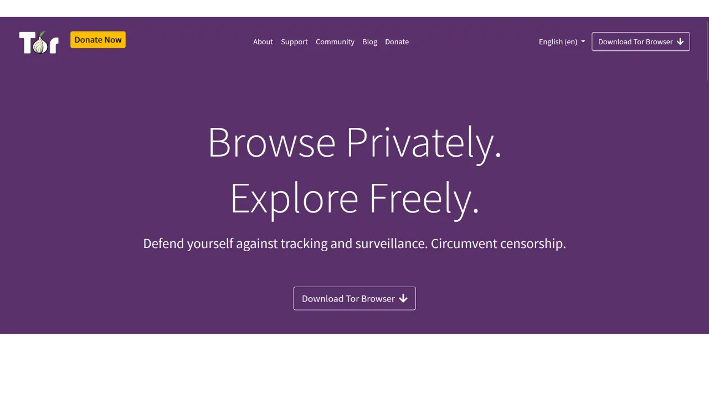

"*टोर ब्राउज़र डाउनलोड करें*" बटन पर क्लिक करें।

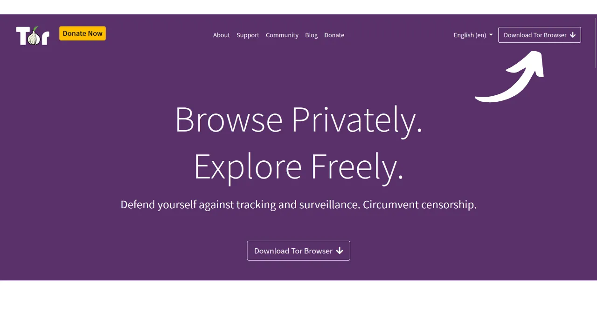

अपने ऑपरेटिंग सिस्टम के लिए उपयुक्त संस्करण चुनें।

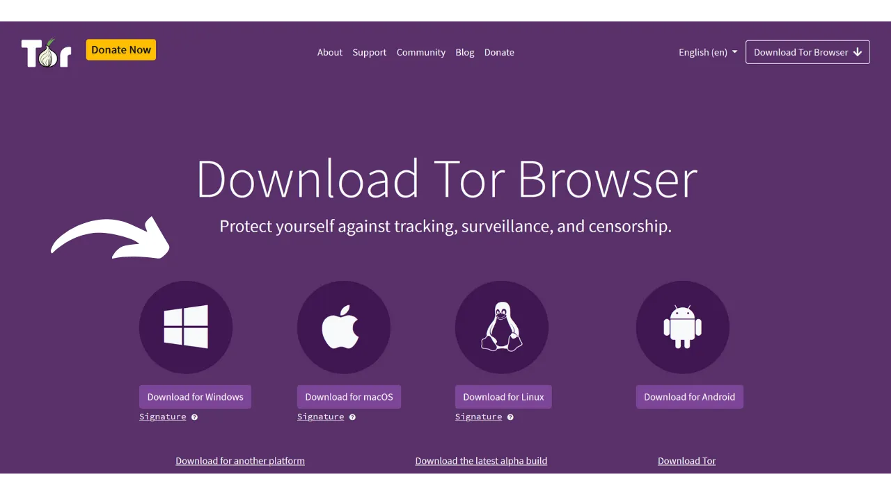

इंस्टॉलेशन शुरू करने के लिए एक्सीक्यूटेबल पर क्लिक करें, फिर अपनी भाषा चुनें।

उस फोल्डर को चुनें जहाँ सॉफ्टवेयर इंस्टॉल किया जाएगा, फिर "*Install*" बटन पर क्लिक करें।

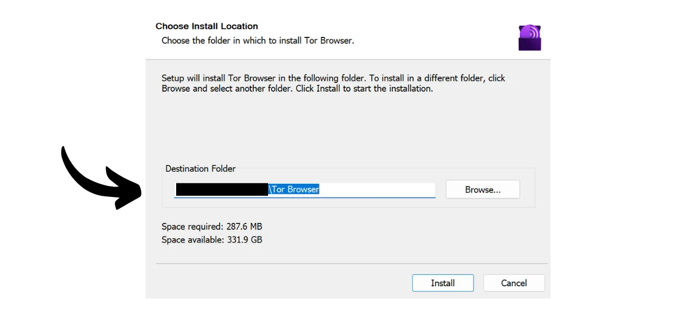

इंस्टॉलेशन पूरा होने का इंतज़ार करें।

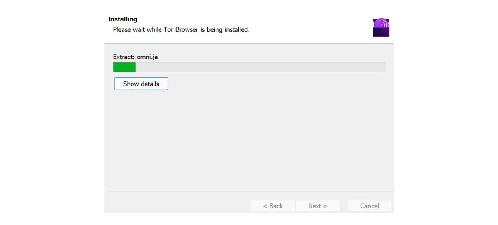

अंत में, "*समाप्त करें*" बटन पर क्लिक करें।

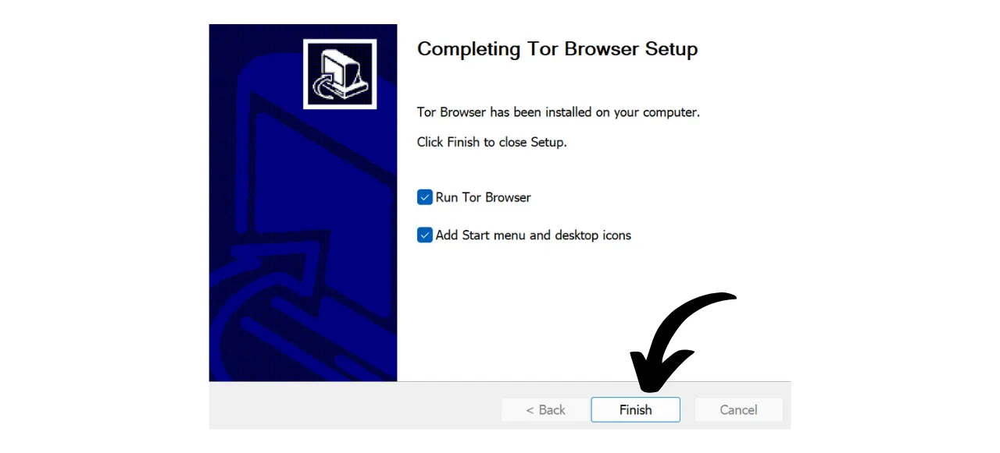

## टोर ब्राउज़र का उपयोग कैसे करें?

1. **डाउनलोड और इंस्टॉल करें**: सबसे पहले, टोर ब्राउज़र की आधिकारिक वेबसाइट पर जाएं और अपने ऑपरेटिंग सिस्टम के अनुसार इसे डाउनलोड करें। फिर इसे इंस्टॉल करें।

2. **ब्राउज़र खोलें**: इंस्टॉल करने के बाद, टोर ब्राउज़र को खोलें। यह आपको एक कनेक्शन सेटअप स्क्रीन दिखाएगा।

3. **कनेक्ट करें**: "कनेक्ट" बटन पर क्लिक करें। यह ब्राउज़र को टोर नेटवर्क से जोड़ देगा। यह प्रक्रिया कुछ समय ले सकती है।

4. **ब्राउज़िंग शुरू करें**: एक बार कनेक्ट हो जाने के बाद, आप टोर ब्राउज़र का उपयोग करके इंटरनेट पर गुमनाम रूप से ब्राउज़ कर सकते हैं। 

5. **सुरक्षा सेटिंग्स**: टोर ब्राउज़र में सुरक्षा सेटिंग्स को समायोजित करने का विकल्प होता है। आप इसे अपनी जरूरत के अनुसार बदल सकते हैं।

6. **अपडेट रखें**: सुनिश्चित करें कि आपका टोर ब्राउज़र हमेशा अपडेटेड हो ताकि आप नवीनतम सुरक्षा सुविधाओं का लाभ उठा सकें।

बस, अब आप टोर ब्राउज़र का सुरक्षित और गुमनाम रूप से उपयोग कर सकते हैं!

टोर ब्राउज़र का उपयोग एक सामान्य ब्राउज़र की तरह किया जाता है।

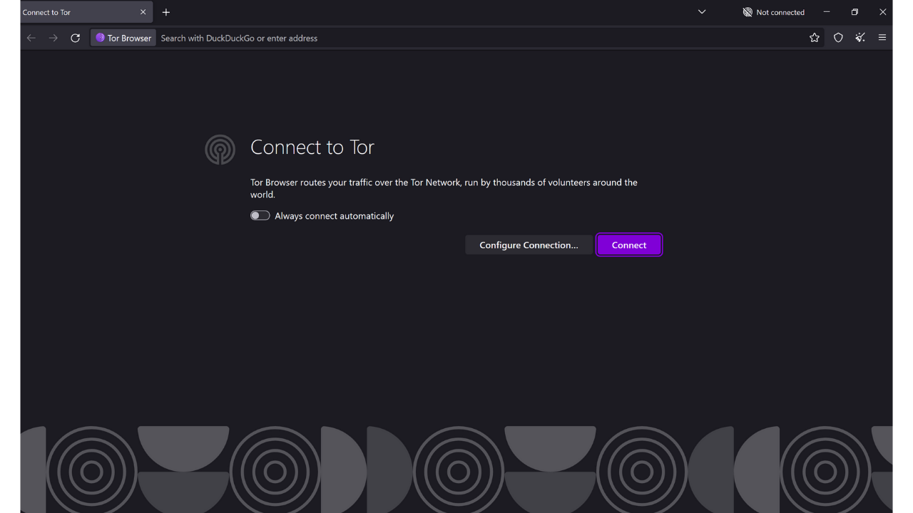

पहली बार जब आप ब्राउज़र खोलते हैं, तो यह आपको एक पेज दिखाता है जो आपको टोर नेटवर्क से जुड़ने के लिए आमंत्रित करता है। बस "*कनेक्ट*" बटन पर क्लिक करें और कनेक्शन स्थापित हो जाएगा।

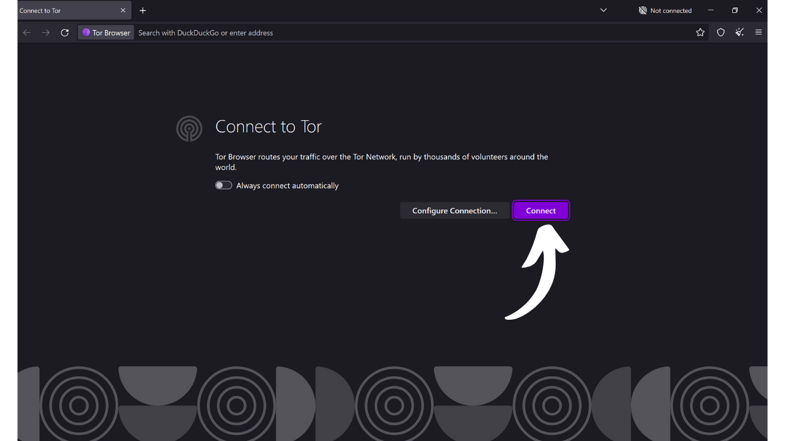

अगर आप चाहते हैं कि सॉफ़्टवेयर भविष्य में अपने आप टोर नेटवर्क से जुड़ जाए, तो "*हमेशा स्वचालित रूप से कनेक्ट करें*" विकल्प को चुनें।

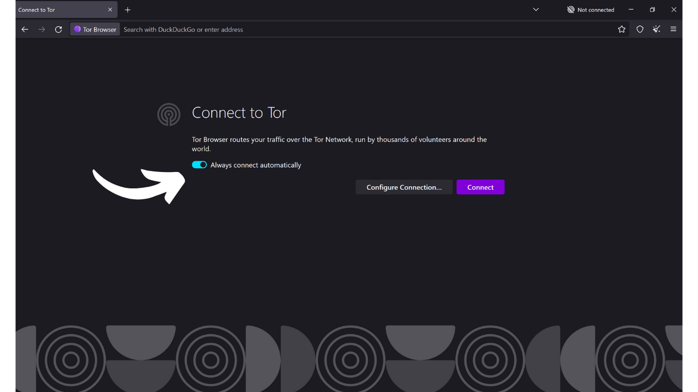

जब आप टोर नेटवर्क से जुड़ जाते हैं, तो आप होमपेज पर पहुँच जाएंगे।

इंटरनेट पर खोज करने के लिए, बस अपने सवाल को सर्च बार में टाइप करें और "*एंटर*" कुंजी दबाएं।

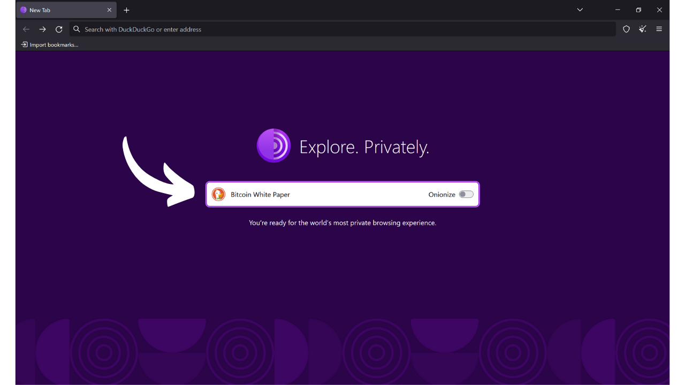

फिर, आपको अपने सर्च इंजन से परिणाम उसी तरह मिलेंगे जैसे अन्य ब्राउज़रों में मिलते हैं।

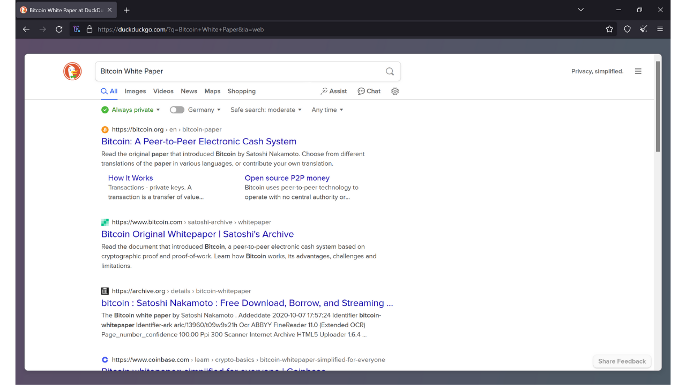

DuckDuckGo पर "*Onionize*" विकल्प आपको टोर नेटवर्क पर इसके छिपे हुए सेवा के माध्यम से सर्च इंजन का उपयोग करने की अनुमति देता है, जिसे आप इसके `.onion` Address के जरिए एक्सेस कर सकते हैं।

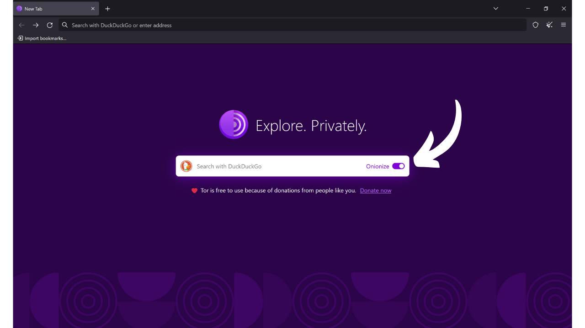

## टोर ब्राउज़र को कैसे कॉन्फ़िगर करें?

1. **डाउनलोड और इंस्टॉल करें**: सबसे पहले, टोर ब्राउज़र की आधिकारिक वेबसाइट से इसे डाउनलोड करें और अपने कंप्यूटर पर इंस्टॉल करें।

2. **ब्राउज़र खोलें**: इंस्टॉल करने के बाद, टोर ब्राउज़र को खोलें। यह आपको सीधे टोर नेटवर्क से कनेक्ट करने का विकल्प देगा।

3. **कनेक्ट करें**: "कनेक्ट" बटन पर क्लिक करें। यह ब्राउज़र को टोर नेटवर्क से जोड़ देगा। इसमें कुछ समय लग सकता है।

4. **सेटिंग्स जांचें**: कनेक्ट होने के बाद, आप ब्राउज़र की सेटिंग्स में जाकर अपनी जरूरत के अनुसार कॉन्फ़िगरेशन कर सकते हैं। 

5. **सुरक्षा स्तर सेट करें**: टूलबार में शील्ड आइकन पर क्लिक करें और सुरक्षा स्तर को अपनी जरूरत के अनुसार सेट करें। 

6. **ब्राउज़िंग शुरू करें**: अब आप सुरक्षित रूप से इंटरनेट ब्राउज़ कर सकते हैं। 

बस, आपका टोर ब्राउज़र कॉन्फ़िगर हो गया है!

आपके ब्राउज़र स्क्रीन के शीर्ष पर, आपको अपने पसंदीदा आयात करने का विकल्प मिलेगा। इससे आप अपने पुराने ब्राउज़र से बुकमार्क्स को स्वचालित रूप से टोर ब्राउज़र में जोड़ सकते हैं।

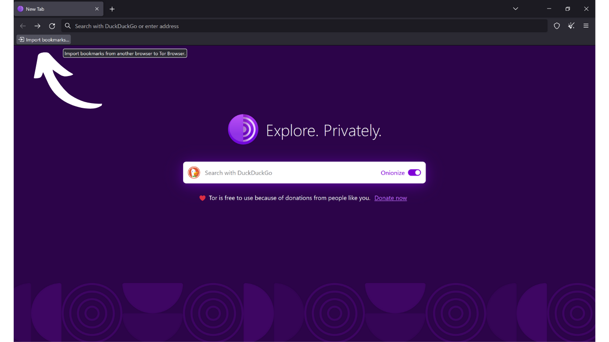

आपके पास नए बुकमार्क जोड़ने का विकल्प भी है। इसके लिए, जिस वेब पेज पर आप हैं, उसके ऊपर दाईं ओर स्थित स्टार आइकन पर क्लिक करें।

दाईं ओर के मेनू में, आप विभिन्न विकल्पों तक पहुँच सकते हैं।

The "*New identity*" button allows you to change your Tor identity. Specifically, this enables you to start a new user session on Tor, meaning changing your IP address and resetting cookies and open sessions.

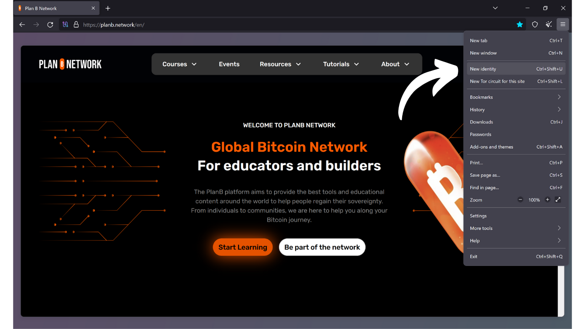

"*बुकमार्क्स*" मेन्यू आपको अपने बुकमार्क्स को प्रबंधित करने की सुविधा देता है।

"*इतिहास*" आपको आपके ब्राउज़िंग इतिहास तक पहुंच प्रदान करता है, अगर आपने इसे सेटिंग्स में सक्षम किया है।

"*ऐड-ऑन्स और थीम्स*" मेन्यू आपको अपने ब्राउज़र की दिखावट को कस्टमाइज़ करने या एक्सटेंशन जोड़ने की सुविधा देता है। चूंकि टोर ब्राउज़र मोज़िला फायरफॉक्स पर आधारित है, आप फायरफॉक्स के लिए उपलब्ध थीम्स और एक्सटेंशन का उपयोग कर सकते हैं।

आखिरकार, "*सेटिंग्स*" बटन आपको आपके ब्राउज़र की सेटिंग्स तक पहुंच प्रदान करता है।

सेटिंग्स के "*जनरल*" टैब में कई विकल्प होते हैं जो आपको टोर ब्राउज़र उपयोगकर्ता Interface को अपनी पसंद के अनुसार अनुकूलित करने की अनुमति देते हैं।

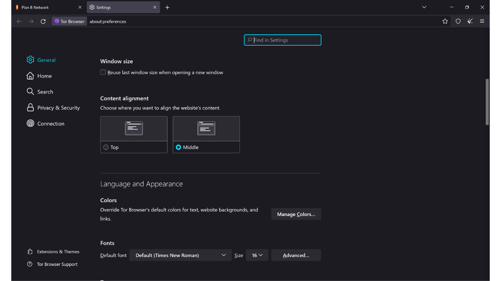

"*होम*" टैब में, आप उस डिफ़ॉल्ट पेज को बदलने का विकल्प चुन सकते हैं जो Tor ब्राउज़र खोलते समय और नए टैब खोलते समय दिखाया जाता है।

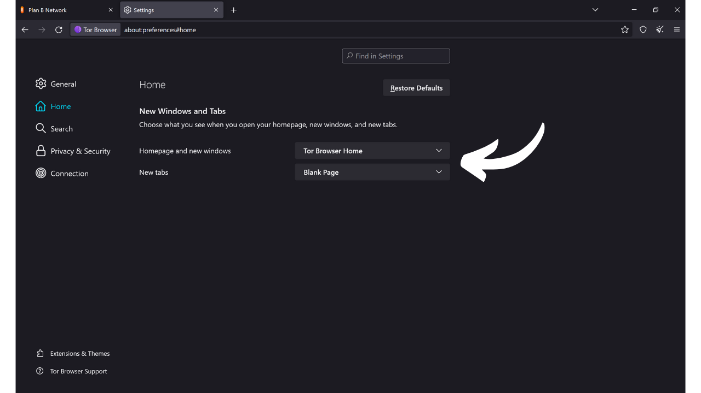

"*खोज*" टैब में, आप सर्च इंजन चुन सकते हैं। टोर ब्राउज़र डिफ़ॉल्ट रूप से DuckDuckGo का उपयोग करता है, जो उपयोगकर्ताओं की गोपनीयता की सुरक्षा पर केंद्रित है, लेकिन आप चाहें तो Google या Startpage भी चुन सकते हैं।

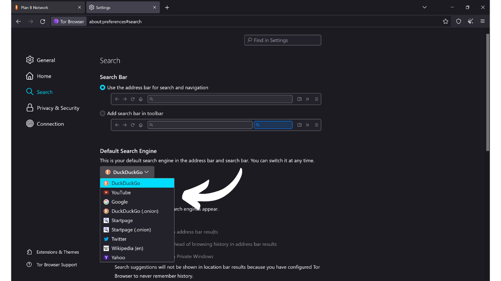

आप अपने सर्च इंजन में शॉर्टकट्स भी सेट कर सकते हैं।

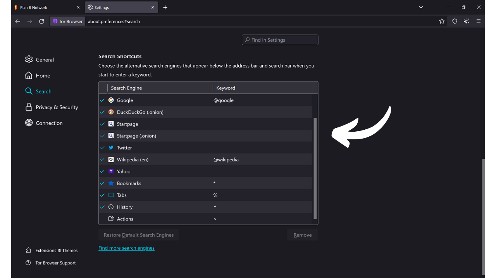

उदाहरण के लिए, आप ब्राउज़र के सर्च बार में "*@wikipedia*" टाइप कर सकते हैं और उसके बाद अपनी खोज शब्द, जैसे "*Bitcoin*", डाल सकते हैं।

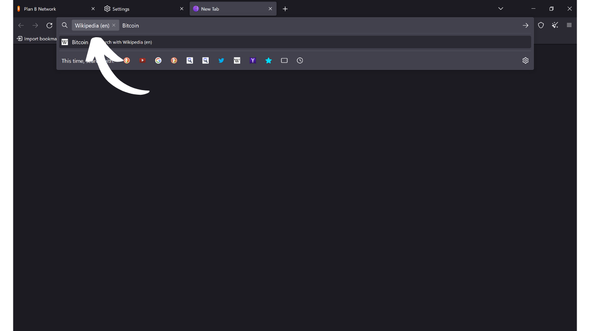

यह फीचर फिर आपके शब्द को सीधे विकिपीडिया साइट पर खोजता है।

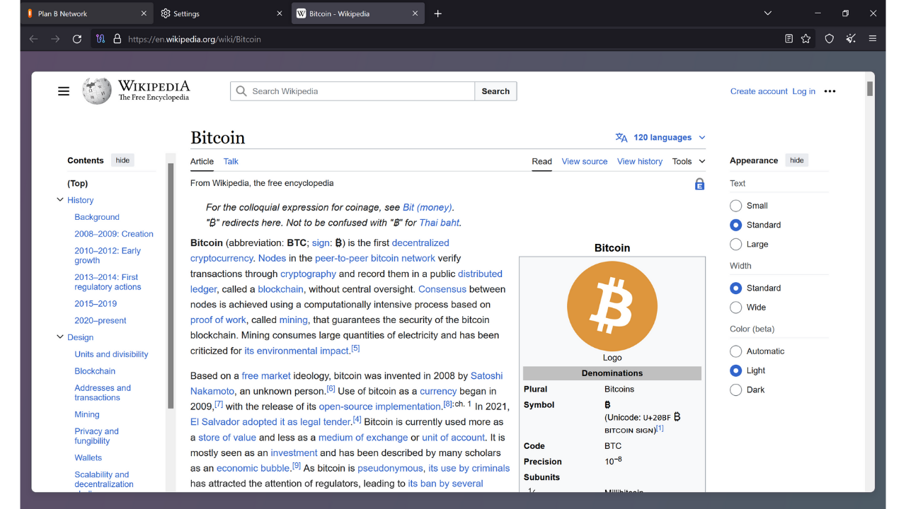

आप इस तरह से विभिन्न साइटों के लिए अन्य कस्टम शॉर्टकट भी सेट कर सकते हैं।

अगले चरण में, "*गोपनीयता और सुरक्षा*" टैब में आपको गोपनीयता और सुरक्षा से संबंधित सभी सेटिंग्स मिलेंगी।

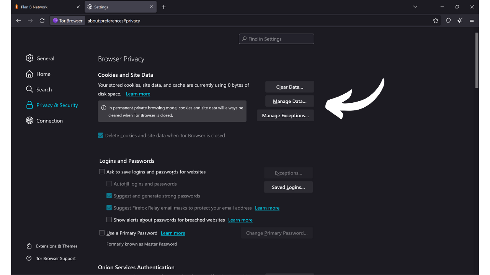

आपके पास अपनी ब्राउज़िंग हिस्ट्री को रखने या हटाने का विकल्प है।

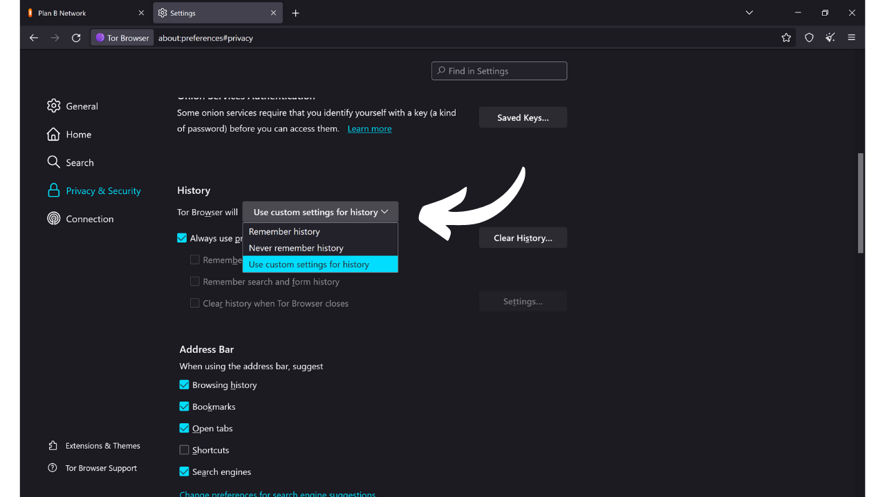

आप विभिन्न वेबसाइटों को दी गई एक्सेस अनुमतियों का प्रबंधन भी कर सकते हैं।

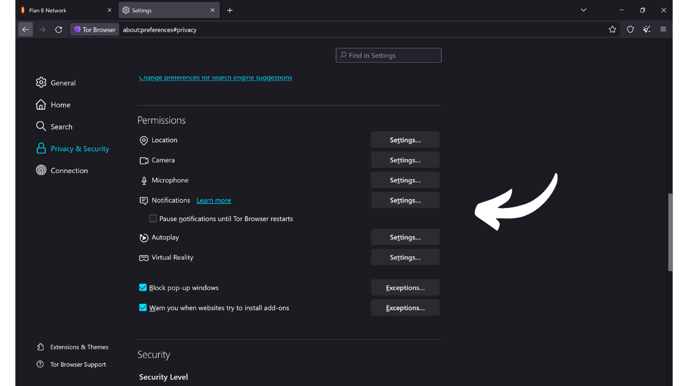

आपके ब्राउज़र की समग्र सुरक्षा के लिए, "*सुरक्षित*" और "*सबसे सुरक्षित*" मोड आपको उन वेब कार्यक्षमताओं और स्क्रिप्ट्स को समायोजित करने की अनुमति देते हैं जो आप जिन साइटों पर जाते हैं, वे निष्पादित करती हैं। इससे कमजोरियों का फायदा उठाने के जोखिम कम हो जाते हैं, लेकिन इसके बदले में यह साइटों की प्रदर्शनी और इंटरैक्टिविटी को प्रभावित करेगा। 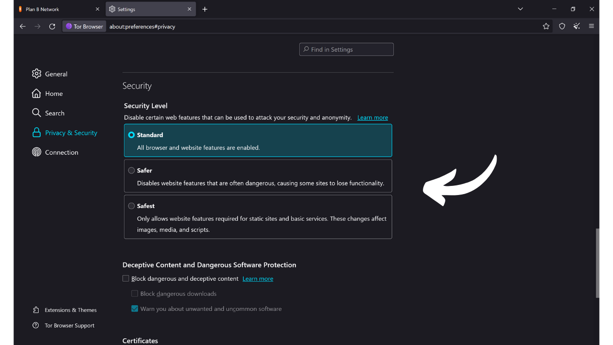 आपको अन्य सुरक्षा विकल्प भी मिलेंगे, जिनमें एक खतरनाक सामग्री अवरोधक और HTTPS-केवल मोड शामिल है, जो यह सुनिश्चित करता है कि साइटों के साथ कनेक्शन लगातार इस प्रोटोकॉल का पालन करें। 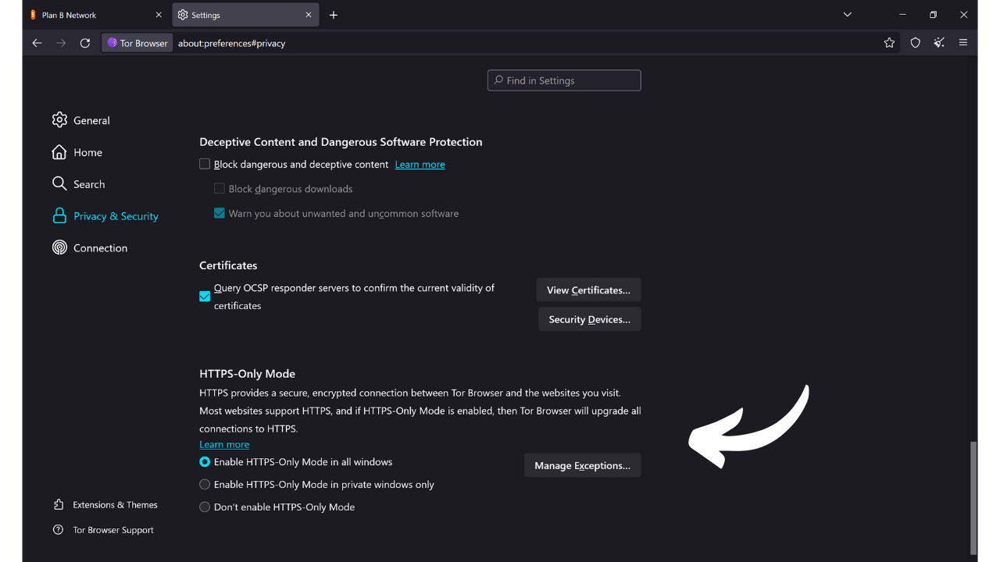 अंत में, "*कनेक्शन*" टैब में, आपको टोर नेटवर्क से कनेक्ट करने से संबंधित सभी सेटिंग्स मिलेंगी। यहीं पर आप उन क्षेत्रों से टोर तक पहुंचने के लिए एक ब्रिज कॉन्फ़िगर कर सकते हैं, जहां इसकी पहुंच सेंसर की जा सकती है। 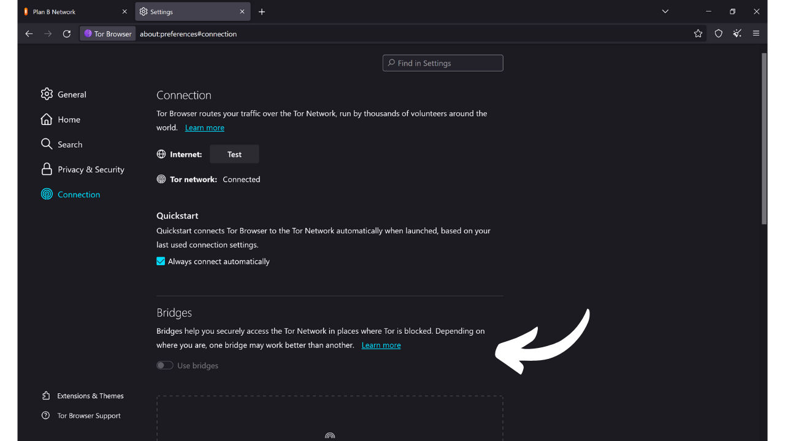 और बस, अब आप इंटरनेट पर अधिक सुरक्षित और निजी तरीके से नेविगेट करने के लिए तैयार हैं! यदि ऑनलाइन गोपनीयता एक ऐसा विषय है जो आपको रुचिकर लगता है, तो मैं आपको मल्लवाड वीपीएन पर इस अन्य ट्यूटोरियल को भी देखने की सिफारिश करता हूँ।

https://planb.network/tutorials/computer-security/communication/mullvad-968ec5f5-b3f0-4d23-a9e0-c07a3e85aaa8