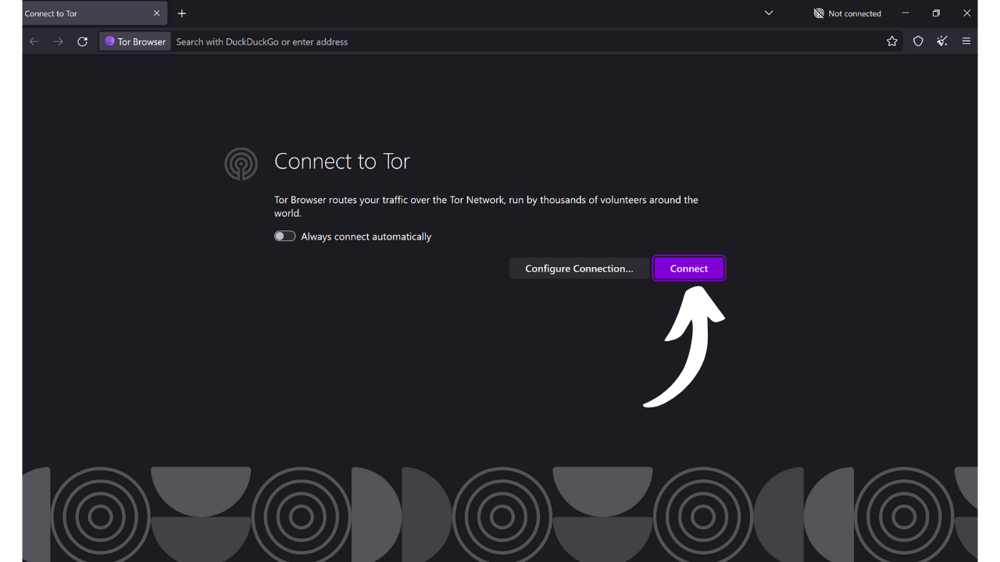
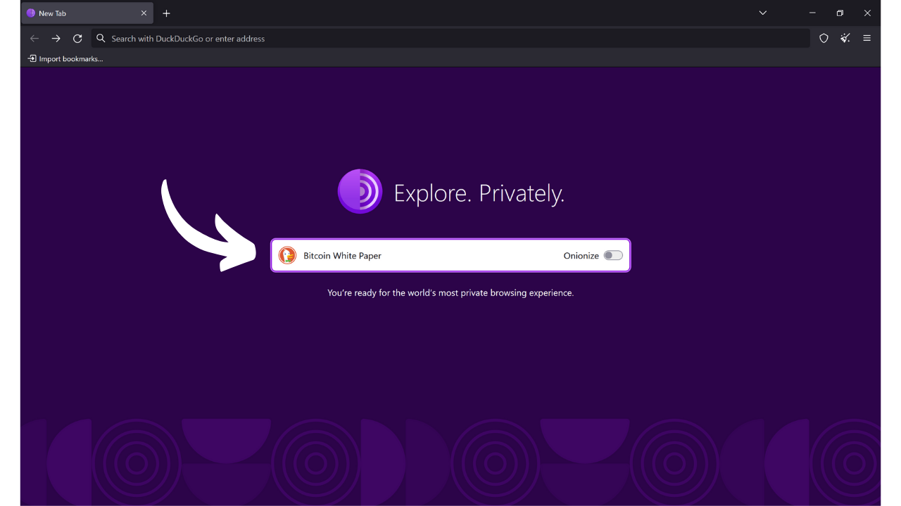

Come suggerisce il nome, un browser è un software utilizzato per navigare su Internet. Funziona come un portale tra il computer dell'utente e il web, traducendo il codice dei siti web in pagine interattive e leggibili. La scelta del tuo browser è molto importante, poiché influisce non solo sulla tua esperienza di navigazione ma anche sulla tua sicurezza e privacy online.

Fai attenzione a non confondere il browser con il motore di ricerca. Il browser è il software che utilizzi per accedere a Internet (come Chrome o Firefox), mentre il motore di ricerca è un servizio, come Google o Bing, ad esempio, che ti aiuta a trovare informazioni online.

Oggi, Google Chrome è di gran lunga il browser più utilizzato. Rappresenta circa il 65% del mercato globale nel 2024. Chrome è apprezzato per la sua velocità e prestazioni, ma non è necessariamente la scelta migliore per tutti, specialmente se la privacy è una priorità per te. Chrome appartiene a Google, un'azienda nota per la raccolta e l'analisi di enormi quantità di dati sui suoi utenti. E infatti, il loro browser interno è al centro della loro strategia di sorveglianza. Questo software è un componente centrale nella maggior parte delle tue interazioni online. Padronare la raccolta di dati sul tuo browser è un problema importante per Google.

*Fonte: [gs.statcounter.com](https://gs.statcounter.com/browser-market-share)*

Esistono diverse famiglie principali di browser, ciascuna basata su un motore di rendering specifico. Browser come Google Chrome, Microsoft Edge, Brave, Opera o Vivaldi sono tutti basati su Chromium, una versione leggera e open-source di Chrome sviluppata da Google. Tutti questi browser utilizzano il motore di rendering Blink, che è un fork di WebKit, a sua volta derivato da KHTML. La predominanza di Chromium nel mercato rende i browser derivati da esso particolarmente efficienti, poiché gli sviluppatori web tendono a ottimizzare principalmente i loro siti per Blink.

Safari, il browser di Apple, utilizza WebKit, che deriva anche da KHTML.

D'altra parte, browser come Mozilla Firefox, LibreWolf e Tor Browser si affidano a Gecko, un motore di rendering diverso, originariamente del browser Netscape.

La scelta del browser giusto dipende dalle tue esigenze. Ma se sei almeno preoccupato per la tua privacy, e quindi per la tua sicurezza, ti consiglio di optare per Firefox per un uso generale e Tor Browser per ancora più privacy. In questo tutorial, ti mostrerò come iniziare facilmente con il Tor Browser.

## Introduzione a Tor Browser

Tor Browser è un browser specificamente progettato per una navigazione su Internet sicura e il più privata possibile. Il browser si basa su Firefox, e quindi sul motore di rendering Gecko.
Tor Browser utilizza la rete Tor per criptare e instradare il tuo traffico attraverso più server di relay prima di trasmetterlo alla destinazione. Questo processo di instradamento multilivello, noto come "*onion routing*", aiuta a nascondere il tuo vero indirizzo IP, rendendo difficile identificare la tua posizione e le attività online. Tuttavia, la navigazione è necessariamente più lenta rispetto a un browser standard che non utilizza la rete Tor, poiché è indiretta.
A differenza di altri browser, Tor Browser integra funzionalità specifiche per prevenire il tracciamento delle tue attività online, come l'isolamento di ogni sito web visitato e l'eliminazione automatica dei cookie e della cronologia alla chiusura. È anche progettato per minimizzare i rischi di fingerprinting, rendendo tutti gli utenti il più simili possibile ai siti visitati.
È possibile utilizzare il Tor Browser per accedere a un sito web standard (`.com`, `.org`, ecc.). In questo caso, il tuo traffico viene anonimizzato passando attraverso diversi nodi Tor prima di raggiungere un nodo di uscita che comunica con il sito finale sul clearnet.

Puoi anche usare Tor Browser per accedere ai servizi nascosti (indirizzi che terminano in `.onion`). In questo scenario, tutto il traffico rimane all'interno della rete Tor, senza un nodo di uscita, garantendo totale privacy sia per l'utente che per il server di destinazione. Questa modalità di funzionamento è utilizzata in particolare per accedere a ciò che viene talvolta chiamato il "*dark web*", una parte di Internet non indicizzata dai motori di ricerca tradizionali.

## Qual è la differenza tra la rete Tor e il Tor browser?

La rete Tor e il Tor browser sono due cose distinte che non dovrebbero essere confuse, ma sono complementari. La rete Tor è un'infrastruttura globale di server relay, gestita dagli utenti, che anonimizza il traffico Internet facendolo passare attraverso diversi nodi prima di indirizzarlo alla sua destinazione finale. Questo è il famoso routing a cipolla.

Il Tor browser, d'altra parte, è un browser specifico progettato per facilitare l'accesso a questa rete in modo semplice. Integra di default tutte le impostazioni necessarie per connettersi alla rete Tor e utilizza una versione modificata di Firefox per fornire un'esperienza di navigazione familiare massimizzando privacy e sicurezza.

La rete Tor non è utilizzata solo dal Tor browser. Può essere utilizzata da vari software e applicazioni per proteggere le loro comunicazioni. Ad esempio, è possibile abilitare le comunicazioni tramite la rete Tor sul proprio nodo Bitcoin per nascondere il proprio indirizzo IP ad altri utenti e prevenire la sorveglianza del proprio traffico relativo a Bitcoin da parte del proprio fornitore di servizi Internet.
Per riassumere, la rete Tor è l'infrastruttura che fornisce privacy nella nostra navigazione su Internet, e il Tor Browser è il software che ci permette di utilizzare questa rete come parte della nostra navigazione web.

## Come installare Tor Browser?

Tor Browser è disponibile per Windows, Linux e macOS per computer, così come per Android su smartphone. Per installare Tor Browser sul tuo computer, visita [il sito ufficiale del Progetto Tor](https://www.torproject.org/).

Clicca sul pulsante "*Scarica Tor Browser*".

Scegli la versione adatta al tuo sistema operativo.

Clicca sull'eseguibile per avviare l'installazione, poi scegli la tua lingua.

Scegli la cartella dove il software sarà installato, poi clicca sul pulsante "*Installa*".

Attendi il completamento dell'installazione.

Infine, clicca sul pulsante "*Fine*".

## Come usare Tor Browser?

Tor Browser si usa come un browser standard.

Al primo avvio, il browser ti presenta una pagina che ti invita a connetterti alla rete Tor. Basta cliccare sul pulsante "*Connetti*" per stabilire la connessione.

Se vuoi che il software si connetta automaticamente alla rete Tor durante i tuoi futuri utilizzi, seleziona l'opzione "*Connetti sempre automaticamente*".

Una volta connesso alla rete Tor, arriverai alla homepage.
Per effettuare una ricerca su Internet, inserisci semplicemente la tua query nella barra di ricerca e premi il tasto "*invio*".

Successivamente, otterrai i risultati dal tuo motore di ricerca nello stesso modo in cui avviene con altri browser.

L'opzione "*Onionize*" su DuckDuckGo ti permette di utilizzare il motore di ricerca tramite il suo servizio nascosto sulla rete Tor, accedendo al suo indirizzo `.onion`.

## Come configurare Tor Browser?

In alto nella schermata del tuo browser, troverai un'opzione per importare i tuoi preferiti. Questo ti permette di integrare automaticamente i segnalibri dal tuo vecchio browser in Tor Browser.

Hai anche l'opzione di aggiungere nuovi segnalibri cliccando sull'icona a forma di stella situata in alto a destra della pagina web che stai visitando.

Nel menu a destra, accedi a varie opzioni.
Il pulsante "*Nuova identità*" ti permette di cambiare la tua identità Tor. Specificamente, questo ti consente di iniziare una nuova sessione utente su Tor, cambiando il tuo indirizzo IP e resettando i cookie e le sessioni aperte.

Il menu "*Segnalibri*" ti permette di gestire i tuoi segnalibri.

"*Cronologia*" ti dà accesso alla tua cronologia di navigazione, se l'hai abilitata nelle impostazioni.

Il menu "*Componenti aggiuntivi e temi*" ti permette di personalizzare l'aspetto del tuo browser o aggiungere estensioni. Poiché Tor Browser si basa su Mozilla Firefox, puoi utilizzare temi ed estensioni disponibili per Firefox.

Infine, il pulsante "*Impostazioni*" ti dà accesso alle impostazioni del tuo browser.

Nella scheda "*Generale*" delle impostazioni, ci sono varie opzioni che ti permettono di personalizzare l'interfaccia utente di Tor Browser.

Nella scheda "*Home*", puoi scegliere di cambiare la pagina predefinita che viene visualizzata all'apertura di Tor Browser e all'apertura di nuove schede.

Nella scheda "*Ricerca*", puoi scegliere il motore di ricerca. Tor Browser utilizza DuckDuckGo come predefinito, un motore di ricerca focalizzato sulla protezione della privacy degli utenti, ma puoi anche optare per Google o Startpage, ad esempio.

Puoi anche impostare scorciatoie nel tuo motore di ricerca.

Ad esempio, puoi digitare "*@wikipedia*" seguito dal tuo termine di ricerca, come "*Bitcoin*", nella barra di ricerca del browser.

Questa funzionalità esegue quindi una ricerca del tuo termine direttamente sul sito di Wikipedia.

Puoi così impostare altre scorciatoie personalizzate per diversi siti.

Successivamente, nella scheda "*Privacy & Sicurezza*", troverai tutte le impostazioni relative alla privacy e alla sicurezza.

Hai l'opzione di mantenere o cancellare la tua cronologia di navigazione.
Puoi anche gestire i permessi di accesso che concedi ai diversi siti web.

Per la sicurezza complessiva del tuo browser, le modalità "*Safer*" e "*Safest*" ti permettono di regolare le funzionalità web e gli script eseguiti dai siti che visiti. Questo minimizza i rischi di sfruttamento delle vulnerabilità, ma influirà anche sulla visualizzazione e sull'interattività dei siti in cambio. Troverai altre opzioni di sicurezza, inclusi un bloccatore di contenuti pericolosi e la modalità solo HTTPS, che garantisce che le connessioni con i siti rispettino costantemente questo protocollo. Infine, nella scheda "*Connection*", troverai tutte le impostazioni relative alla connessione alla rete Tor. Qui puoi configurare un bridge per accedere a Tor da regioni dove il suo accesso potrebbe essere censurato. Ed ecco fatto, ora sei pronto per navigare su Internet in modo più sicuro e privato! Se la privacy online è un argomento che ti interessa, ti consiglio anche di scoprire questo altro tutorial su Mullvad VPN:

https://planb.network/tutorials/computer-security/communication/mullvad-968ec5f5-b3f0-4d23-a9e0-c07a3e85aaa8
