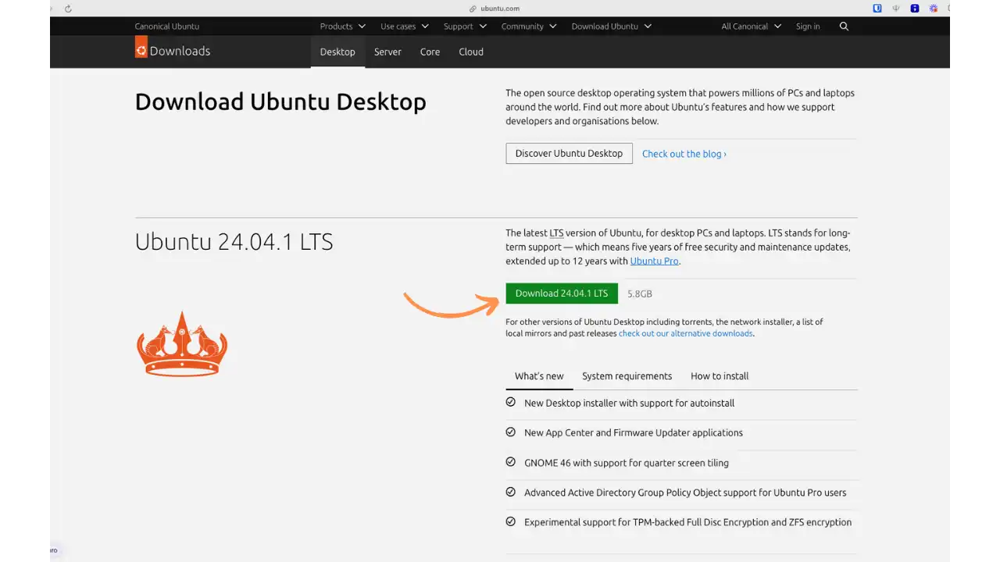

## Introduction

An operating system (OS) is the main software that manages all your computer's resources. Choosing an alternative operating system like Ubuntu can offer many advantages in terms of security, cost and privacy.

### Why Ubuntu?


- Enhanced security** : Linux distributions are renowned for their security and robustness
- Zero cost**: Ubuntu and most Linux distributions are free of charge
- Large community**: A community of users ready to help via forums and tutorials
- Respect for privacy**: Open source system for greater transparency
- Simplicity**: User-friendly interface and ease of use
- Rich ecosystem** : Extensive catalog of open source software
- Regular support**: Secure updates from Canonical

## Installation and configuration

### 1. Prerequisites

**Equipment required:**


- A USB key of at least 12 GB
- A computer with at least 25 GB available

### 2. Download


- Go to [ubuntu.com/download](https://ubuntu.com/download)
- Choose the stable version (LTS recommended)
- Download ISO image




### 3. Create a bootable USB key

You can use several tools, such as Balena Etcher :


- Download and install [Balena Etcher](https://etcher.balena.io/)


- Open Balena Etcher, then select the Ubuntu ISO image
- Select USB key as destination media
- Click on Flash and wait for the process to finish


### 4. Installing and securing Ubuntu

**4.1 Booting from USB memory stick** (in French)


- Switch off the computer
- Plug in the USB key (containing Ubuntu)
- Switch on your computer. On recent PCs, the system should automatically recognize the USB boot key. If this is not the case, reboot by holding down the BIOS/UEFI access key (usually F2, F12, or Delete, depending on the brand)
 - In the BIOS/UEFI menu, select your USB key as the boot device
 - Save and restart

**4.2 Launching the installation** (in French)

**Start-up screen**

When booting from the USB key, you'll see this screen, which allows you to start Ubuntu.


**Choice of language

Choose your preferred language for installation and the system.


**Accessibility options

Configure accessibility options if necessary (screen reader, high contrast, etc.).


**Keyboard configuration

Select your keyboard layout. A test field is available to check that the keys correspond to your configuration.


**Network connection**

Connect to your Wi-Fi or wired network to download updates during installation.


**Type of installation

Choose between "Try Ubuntu" (to test without installing) or "Install Ubuntu".


**Installation method

Select interactive installation.


**Application selection

Choose between the default installation or an extended selection of applications.


**Third-party applications

Decide whether or not to install additional drivers and proprietary software.


**Type of partitioning

You have two main options:


- "Erase disk and install Ubuntu": uses the entire disk for Ubuntu
- "Manual installation: create a dual boot with Windows or customize your partitions


**User account creation

Set your username and password for your Ubuntu account.


**Time zone

Select your geographical area to set the system time.


**Installation summary**

Check all your choices before starting the final installation. Once you click on "Install", the process begins.


**4.3 Upgrading Ubuntu after installation** (in French)

Updating your system is an important step after a new installation. You have two options:

**Option 1: Via the graphical user interface**


- Search for "Software and updates" in the applications menu
- The application will automatically check for available updates
- Follow the on-screen instructions to install the updates

**Option 2: Via Terminal


- Open Terminal (Ctrl + Alt + T)
- Type the following command to check for available updates:

```bash
sudo apt update
```


- Enter your password when prompted
- To install updates, type :

```bash
sudo apt upgrade
```


- Confirm installation by typing 'Y' then Enter

### 5. Discovering basic tasks

**5.1 Browsing the Internet

By default, you'll often find Firefox in the launch bar.

Launch Firefox and start browsing.

Other browsers (Chrome, Brave, etc.) can be installed via the Software Manager or via .deb packages.

**5.2 Word processing

Ubuntu comes with the LibreOffice suite (Writer for word processing).

To open it : Activities > Search for "LibreOffice Writer" or click on the icon if it appears in the bar.

You can create, edit and save documents in a variety of formats (including .docx).

**5.3 Installing applications

Software manager (called "Ubuntu Software"): graphical interface for searching and installing applications.

From Terminal, use the command :

```bash
sudo apt install nom-du-paquet
```

Example:

```bash
sudo apt install vlc
```

### 6. Conclusion and additional resources

Now you're ready to use Ubuntu on a daily basis: secure your system, browse, do office work, install software and keep your OS up to date!

To take the security of your digital life a step further, we recommend you take a look at our encrypted messaging service, which is perfectly suited to protecting your privacy and complements your Ubuntu installation:

https://planb.network/tutorials/computer-security/communication/proton-mail-c3b010ce-254d-4546-b382-19ab9261c6a2
