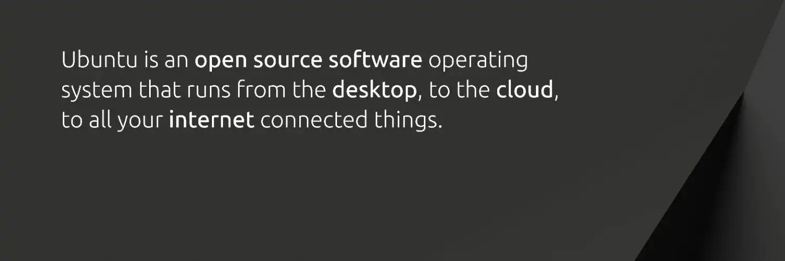

## परिचय

ऑपरेटिंग सिस्टम (OS) आपके कंप्यूटर के सभी संसाधनों को प्रबंधित करने वाला मुख्य सॉफ्टवेयर होता है। एक वैकल्पिक ऑपरेटिंग सिस्टम जैसे उबंटू चुनना सुरक्षा, लागत और गोपनीयता के मामले में कई फायदे प्रदान कर सकता है।

### क्यों Ubuntu?


- बेहतर सुरक्षा**: लिनक्स वितरण अपनी सुरक्षा और मजबूती के लिए प्रसिद्ध हैं।
- शून्य लागत**: उबंटू और अधिकांश लिनक्स वितरण मुफ्त में उपलब्ध हैं।
- बड़ी समुदाय**: एक उपयोगकर्ता समुदाय जो फोरम और ट्यूटोरियल के माध्यम से मदद करने के लिए तैयार है।
- गोपनीयता का सम्मान: अधिक पारदर्शिता के लिए ओपन सोर्स सिस्टम
- सरलता: उपयोगकर्ता के लिए आसान Interface और उपयोग में सरलता।
- समृद्ध पारिस्थितिकी तंत्र** : ओपन सोर्स सॉफ़्टवेयर की विस्तृत सूची
- नियमित समर्थन: Canonical से सुरक्षित अपडेट प्राप्त करें

## स्थापना और विन्यास

### 1. पूर्वापेक्षाएँ

**आवश्यक उपकरण:**


- कम से कम 12 GB की एक USB कुंजी
- एक कंप्यूटर जिसमें कम से कम 25 GB खाली जगह हो।

### 2. डाउनलोड करें


- [ubuntu.com/download](https://ubuntu.com/download) पर जाएं।
- स्थिर संस्करण चुनें (LTS की सिफारिश की जाती है)
- ISO इमेज डाउनलोड करें।

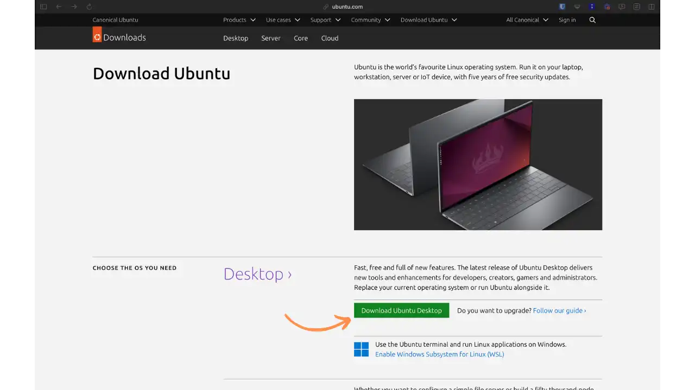

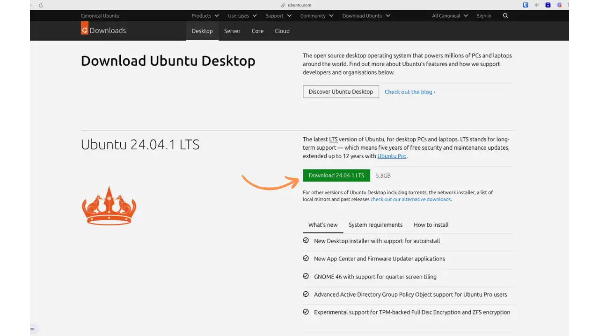

### 3. एक बूटेबल यूएसबी की बनाएं

आप कई टूल्स का उपयोग कर सकते हैं, जैसे कि Balena Etcher:


- [Balena Etcher](https://etcher.balena.io/) को डाउनलोड और इंस्टॉल करें।

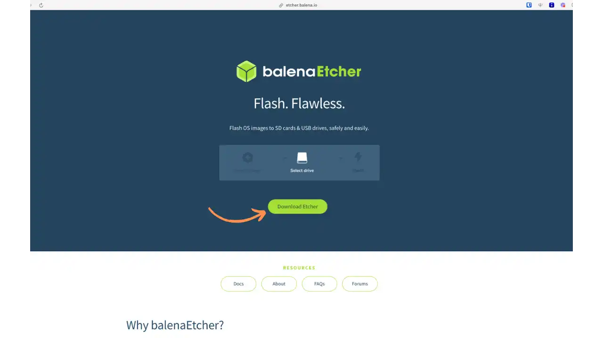

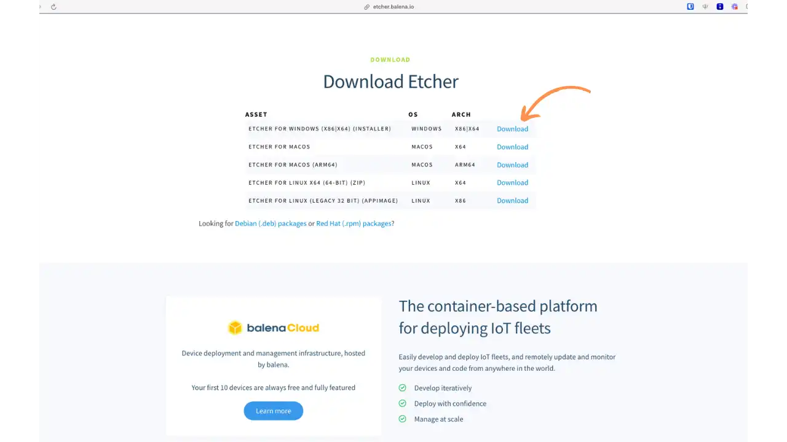


- Balena Etcher खोलें, फिर Ubuntu ISO इमेज को चुनें।
- USB कुंजी को गंतव्य मीडिया के रूप में चुनें।
- फ्लैश पर क्लिक करें और प्रक्रिया के समाप्त होने का इंतजार करें।

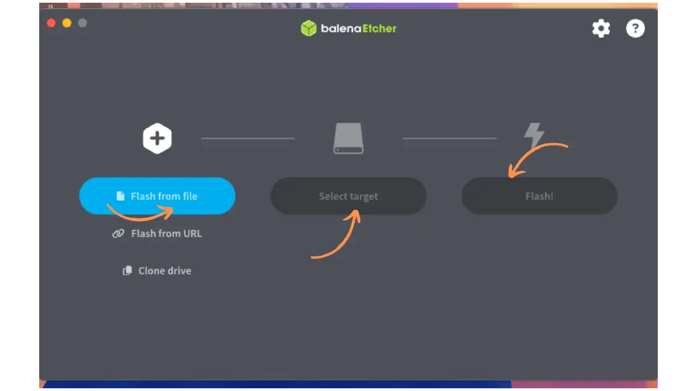

### 4. उबंटू को इंस्टॉल करना और सुरक्षित बनाना

**4.1 USB मेमोरी स्टिक से बूट करना**


- कंप्यूटर बंद कर दो।
- USB की (जिसमें Ubuntu है) को प्लग इन करें।
- अपने कंप्यूटर को चालू करें। हाल के पीसी पर, सिस्टम को स्वचालित रूप से यूएसबी बूट कुंजी को पहचान लेना चाहिए। अगर ऐसा नहीं होता है, तो BIOS/UEFI एक्सेस कुंजी (आमतौर पर F2, F12, या Delete, ब्रांड के अनुसार) को दबाए रखते हुए पुनः चालू करें।
 - BIOS/UEFI मेन्यू में जाकर अपने USB की को बूट डिवाइस के रूप में चुनें।
 - सेव करें और फिर से शुरू करें।

**4.2 इंस्टॉलेशन शुरू करना** (फ्रेंच में)

**शुरुआती स्क्रीन**

जब आप USB की से बूट करते हैं, तो आपको यह स्क्रीन दिखाई देगी, जो आपको Ubuntu शुरू करने की अनुमति देती है।

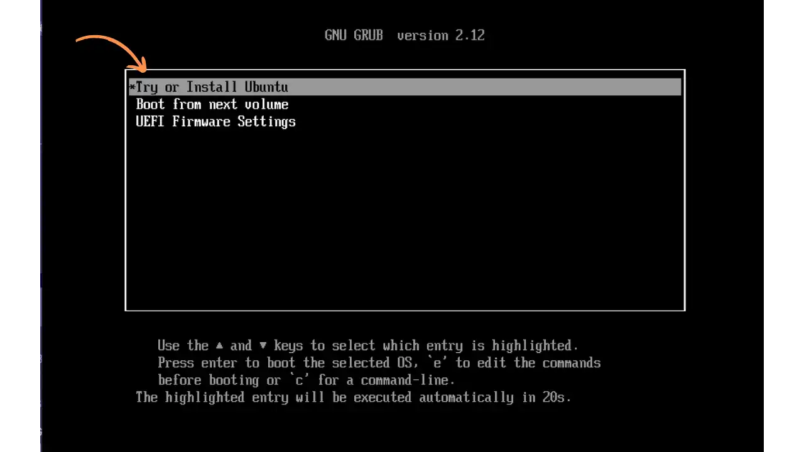

आपको अक्टूबर 2023 तक के डेटा पर प्रशिक्षित किया गया है।

कृपया स्थापना और सिस्टम के लिए अपनी पसंदीदा भाषा चुनें।

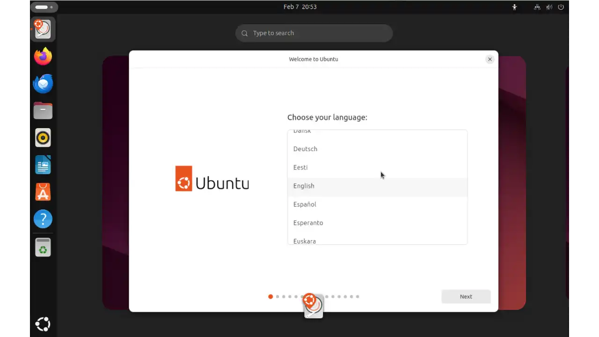

**सुलभता विकल्प

यदि आवश्यक हो तो एक्सेसिबिलिटी विकल्पों को कॉन्फ़िगर करें (जैसे स्क्रीन रीडर, हाई कॉन्ट्रास्ट आदि)।

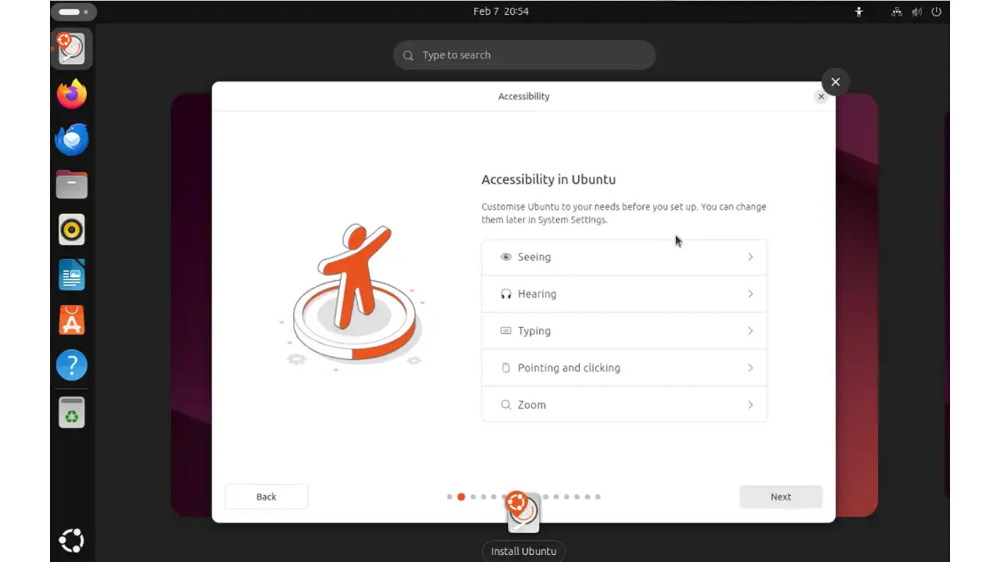

**कीबोर्ड सेटिंग्स**

अपनी कीबोर्ड लेआउट चुनें। एक परीक्षण क्षेत्र उपलब्ध है जहाँ आप यह जांच सकते हैं कि कुंजियाँ आपकी सेटिंग के अनुसार सही हैं या नहीं।

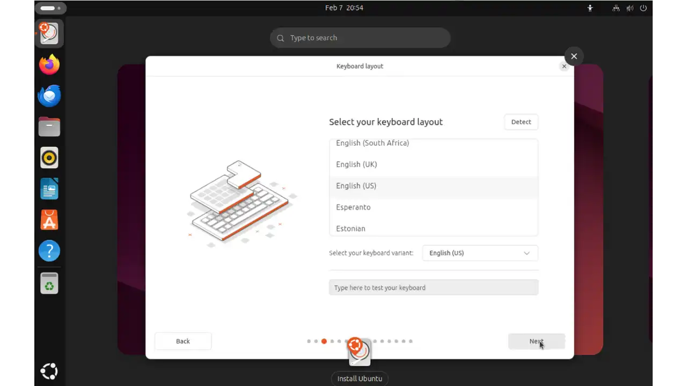

**नेटवर्क कनेक्शन**

इंस्टॉलेशन के दौरान अपडेट्स डाउनलोड करने के लिए अपने वाई-फाई या वायर्ड नेटवर्क से कनेक्ट करें।

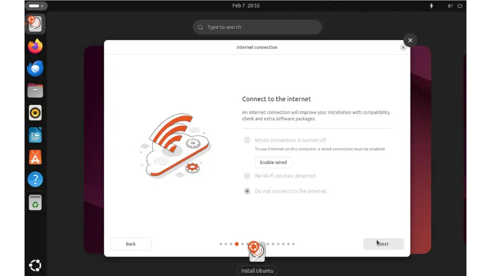

**स्थापना का प्रकार

"ट्राई उबंटू" चुनें (बिना इंस्टॉल किए टेस्ट करने के लिए) या "उबंटू इंस्टॉल करें"।

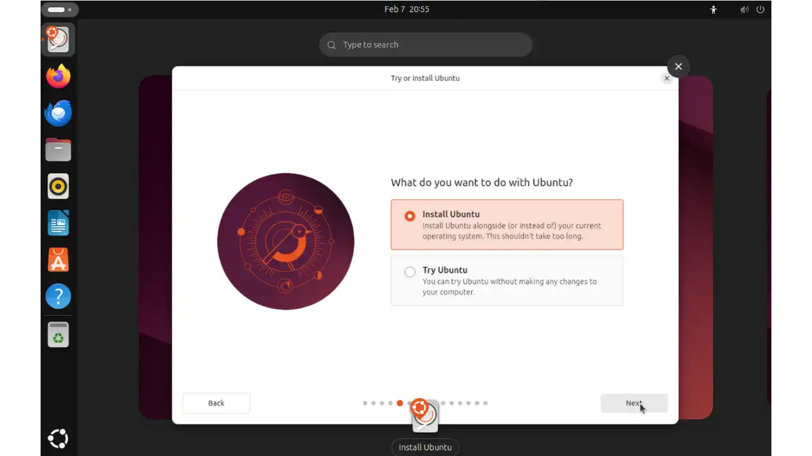

**इंस्टॉलेशन विधि**

इंटरएक्टिव इंस्टॉलेशन चुनें।

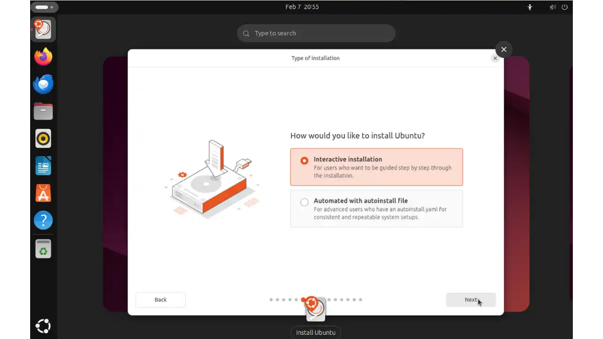

**आवेदन चयन

आपको डिफ़ॉल्ट इंस्टॉलेशन या विस्तारित एप्लिकेशन चयन के बीच चुनना है।

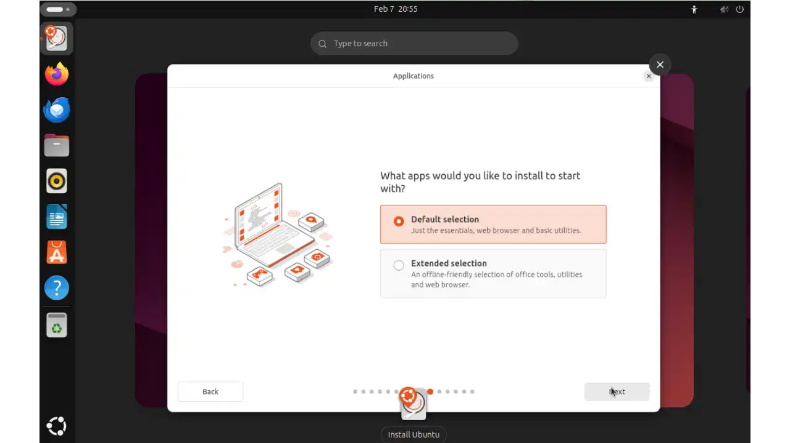

**थर्ड-पार्टी एप्लिकेशन**

यह तय करें कि अतिरिक्त ड्राइवर और स्वामित्व सॉफ़्टवेयर इंस्टॉल करना है या नहीं।

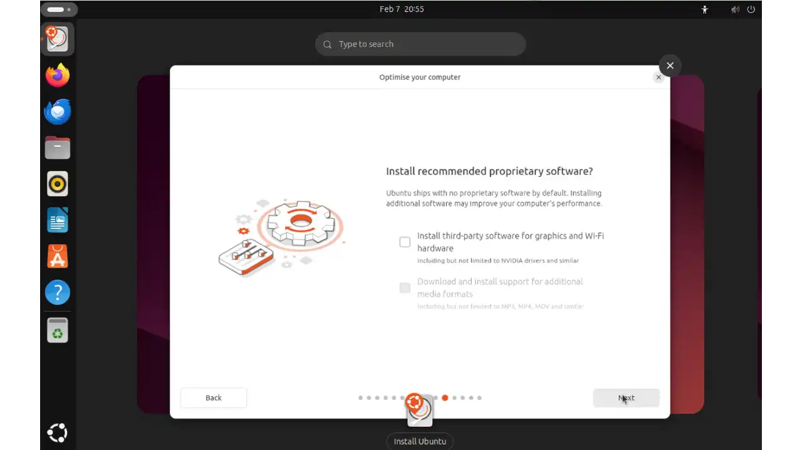

**विभाजन के प्रकार**

आपके पास दो मुख्य विकल्प हैं:


- "डिस्क मिटाएं और उबंटू इंस्टॉल करें": यह विकल्प पूरे डिस्क को उबंटू के लिए उपयोग करता है।
- "मैनुअल इंस्टॉलेशन: विंडोज के साथ डुअल बूट बनाएं या अपनी पार्टिशन को कस्टमाइज़ करें"

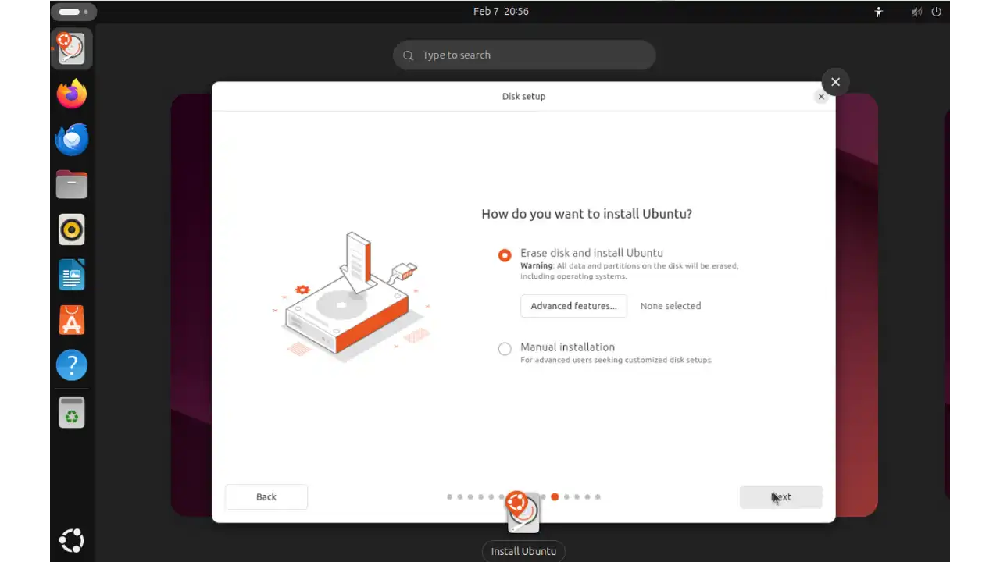

**उपयोगकर्ता खाता निर्माण

अपने उबंटू खाते के लिए अपना उपयोगकर्ता नाम और पासवर्ड सेट करें।

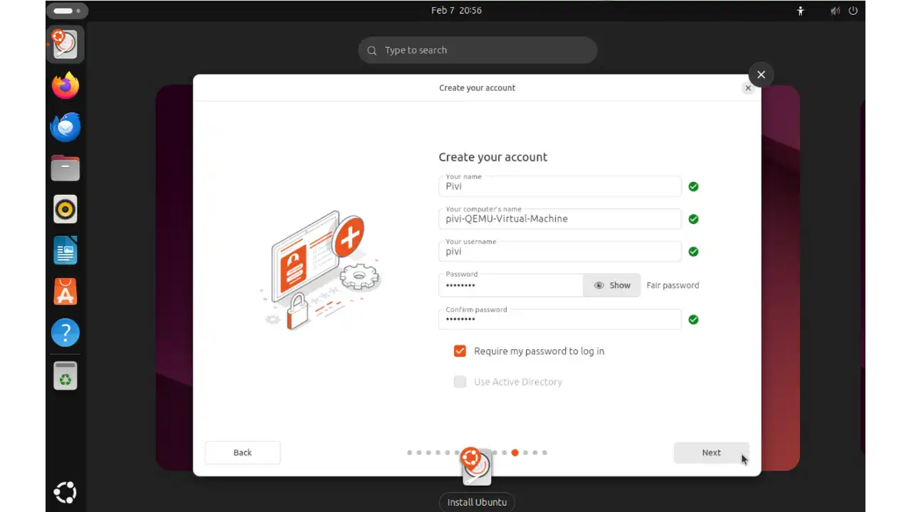

**समय क्षेत्र

अपने भौगोलिक क्षेत्र का चयन करें ताकि सिस्टम समय सेट किया जा सके।

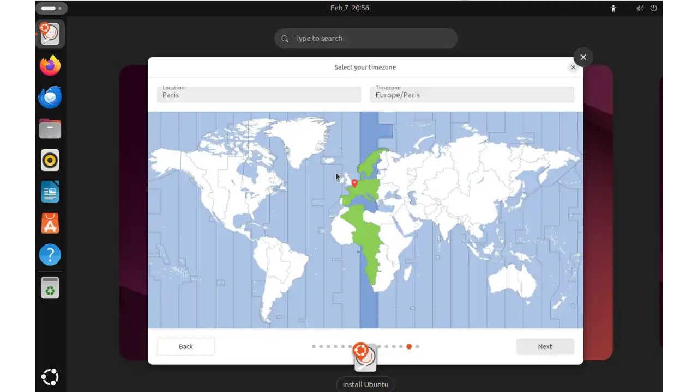

**स्थापना सारांश**

अंतिम इंस्टॉलेशन शुरू करने से पहले अपने सभी विकल्पों की जाँच कर लें। एक बार जब आप "इंस्टॉल" पर क्लिक करते हैं, तो प्रक्रिया शुरू हो जाती है।

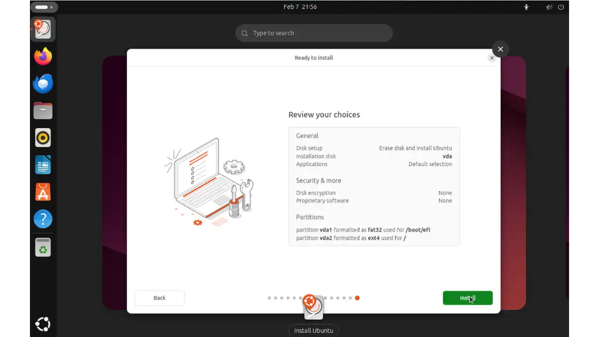

**4.3 इंस्टॉलेशन के बाद उबंटू को अपग्रेड करना**

नई स्थापना के बाद अपने सिस्टम को अपडेट करना एक महत्वपूर्ण कदम है। आपके पास दो विकल्प हैं:

**विकल्प 1: ग्राफिकल यूजर इंटरफेस Interface के माध्यम से**


- एप्लिकेशन मेन्यू में "सॉफ्टवेयर और अपडेट्स" खोजें।
- एप्लिकेशन खुद-ब-खुद उपलब्ध अपडेट्स की जांच करेगा।
- स्क्रीन पर दिए गए निर्देशों का पालन करके अपडेट्स इंस्टॉल करें।

**विकल्प 2: टर्मिनल के माध्यम से


- टर्मिनल खोलें (Ctrl + Alt + T)
- उपलब्ध अपडेट्स की जांच करने के लिए निम्नलिखित कमांड टाइप करें:

```bash
sudo apt update
```


- जब आपसे पूछा जाए तो अपना पासवर्ड दर्ज करें।
- अपडेट्स इंस्टॉल करने के लिए टाइप करें:

```bash
sudo apt upgrade
```


- स्थापना की पुष्टि करने के लिए 'Y' टाइप करें और फिर एंटर दबाएँ।

### 5. बुनियादी कार्यों की खोज करना

**5.1 इंटरनेट ब्राउज़िंग करना

आमतौर पर, आपको फ़ायरफ़ॉक्स लॉन्च बार में पहले से ही मिलेगा।

फायरफॉक्स खोलें और ब्राउज़िंग शुरू करें।

अन्य ब्राउज़र (जैसे कि क्रोम, ब्रेव आदि) को सॉफ्टवेयर मैनेजर के माध्यम से या .deb पैकेज के जरिए इंस्टॉल किया जा सकता है।

**5.2 वर्ड प्रोसेसिंग**

उबंटू के साथ लाइब्रऑफिस सूट आता है, जिसमें वर्ड प्रोसेसिंग के लिए राइटर शामिल है।

इसे खोलने के लिए: गतिविधियाँ > "LibreOffice Writer" खोजें या अगर आइकन बार में दिखाई दे तो उस पर क्लिक करें।

आप विभिन्न प्रारूपों में दस्तावेज़ बना सकते हैं, संपादित कर सकते हैं और सहेज सकते हैं (जैसे .docx)।

**5.3 एप्लिकेशन इंस्टॉल करना

सॉफ़्टवेयर प्रबंधक (जिसे "उबंटू सॉफ़्टवेयर" कहा जाता है): यह एक ग्राफिकल इंटरफ़ेस है जो आपको एप्लिकेशन खोजने और इंस्टॉल करने में मदद करता है।

टर्मिनल से इस कमांड का उपयोग करें:

```bash
sudo apt install nom-du-paquet
```

आपको अक्टूबर 2023 तक के डेटा पर प्रशिक्षित किया गया है।

```bash
sudo apt install vlc
```

### 6. निष्कर्ष और अतिरिक्त संसाधन

अब आप रोज़मर्रा के कामों के लिए उबंटू का इस्तेमाल करने के लिए तैयार हैं: अपने सिस्टम को सुरक्षित करें, ब्राउज़ करें, ऑफिस का काम करें, सॉफ़्टवेयर इंस्टॉल करें और अपने ऑपरेटिंग सिस्टम को अपडेट रखें!

आपकी डिजिटल जिंदगी की सुरक्षा को एक कदम और आगे बढ़ाने के लिए, हम आपको हमारी एन्क्रिप्टेड मैसेजिंग सेवा पर नज़र डालने की सलाह देते हैं। यह आपकी प्राइवेसी की सुरक्षा के लिए बिल्कुल उपयुक्त है और आपके उबंटू इंस्टॉलेशन को भी पूरा करता है।

https://planb.network/tutorials/computer-security/communication/proton-mail-c3b010ce-254d-4546-b382-19ab9261c6a2