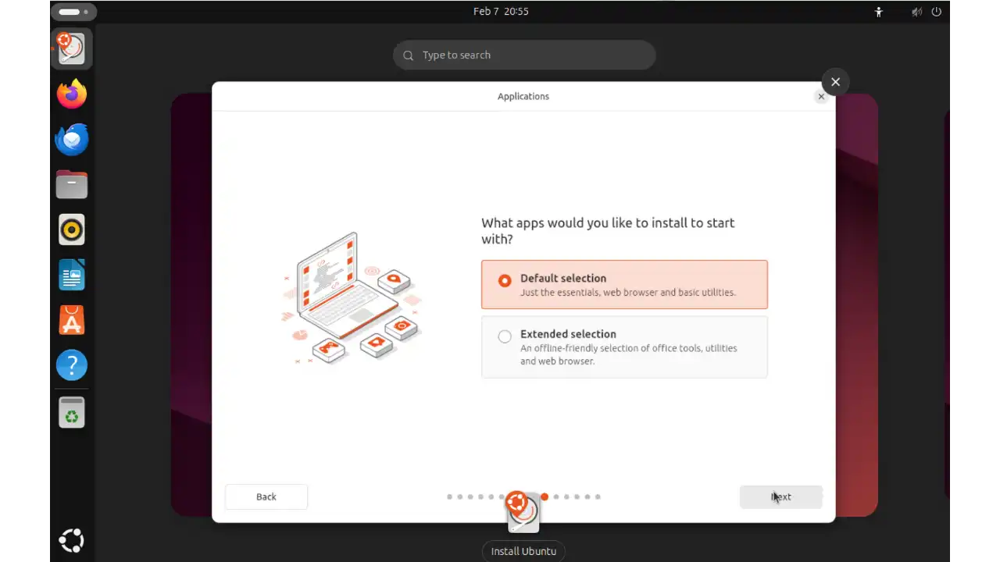
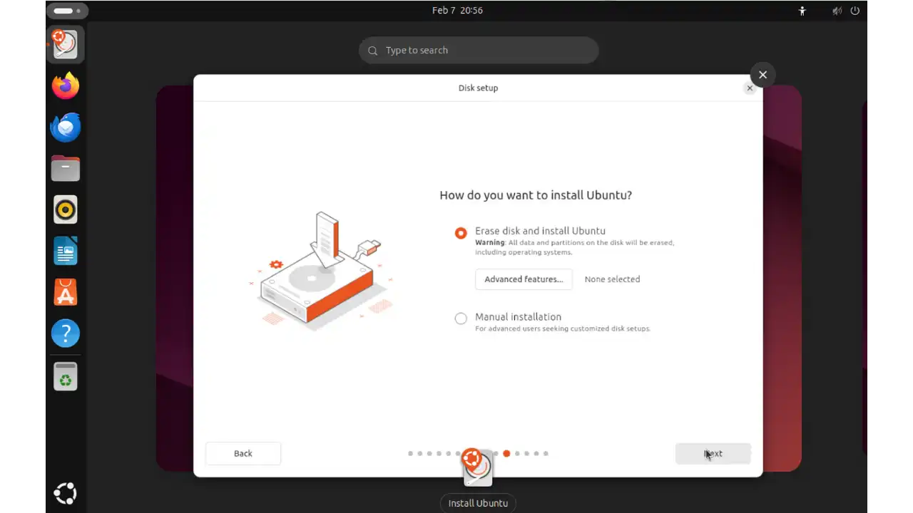
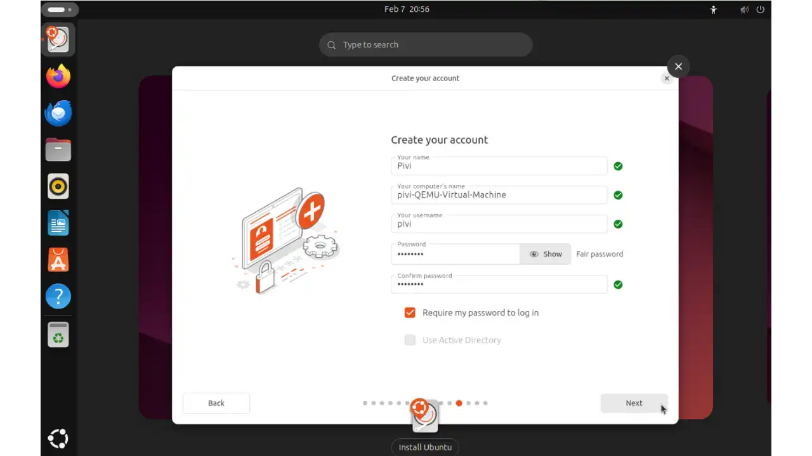

## Pendahuluan

Sistem operasi (OS) adalah perangkat lunak utama yang mengelola semua sumber daya komputer Anda. Memilih sistem operasi alternatif seperti Ubuntu dapat menawarkan banyak keuntungan dalam hal keamanan, biaya, dan privasi.

### Mengapa Ubuntu?


- Keamanan yang lebih baik** : Distribusi Linux terkenal dengan keamanan dan ketangguhannya
- Tanpa biaya**: Ubuntu dan sebagian besar distribusi Linux tidak dipungut biaya
- Komunitas yang besar**: Komunitas pengguna yang siap membantu melalui forum dan tutorial
- Menghormati privasi**: Sistem sumber terbuka untuk transparansi yang lebih baik
- Kesederhanaan**: Antarmuka yang ramah pengguna dan mudah digunakan
- Ekosistem yang kaya** : Katalog perangkat lunak sumber terbuka yang luas
- Dukungan reguler**: Pembaruan yang aman dari Canonical

## Instalasi dan konfigurasi

### 1. Prasyarat

**Peralatan yang dibutuhkan:**


- Kunci USB minimal 12 GB
- Komputer dengan setidaknya 25 GB tersedia

### 2. Unduh


- Buka [ubuntu.com/download](https://ubuntu.com/download)
- Pilih versi stabil (disarankan LTS)
- Unduh gambar ISO


### 3. Membuat kunci USB yang dapat di-boot

Anda dapat menggunakan beberapa alat bantu, seperti Balena Etcher :


- Unduh dan instal [Balena Etcher](https://etcher.balena.io/)


- Buka Balena Etcher, lalu pilih citra ISO Ubuntu
- Pilih kunci USB sebagai media tujuan
- Klik pada Flash dan tunggu sampai prosesnya selesai


### 4. Menginstal dan mengamankan Ubuntu

**4.1 Mem-boot dari stik memori USB** (dalam bahasa Prancis)


- Matikan komputer
- Colokkan kunci USB (berisi Ubuntu)
- Hidupkan komputer Anda. Pada PC terbaru, sistem akan secara otomatis mengenali kunci boot USB. Jika tidak demikian, lakukan boot ulang dengan menahan tombol akses BIOS/UEFI (biasanya F2, F12, atau Delete, tergantung merek)
 - Di menu BIOS/UEFI, pilih kunci USB Anda sebagai perangkat boot
 - Simpan dan mulai ulang

**4.2 Meluncurkan penginstalan** (dalam bahasa Prancis)

*layar pengaktifan** *Layar awal

Saat booting dari kunci USB, Anda akan melihat layar ini, yang memungkinkan Anda memulai Ubuntu.


**Pilihan bahasa

Pilih bahasa yang Anda sukai untuk instalasi dan sistem.


**Opsi aksesibilitas

Konfigurasikan opsi aksesibilitas jika perlu (pembaca layar, kontras tinggi, dll.).


**Konfigurasi keyboard

Pilih tata letak keyboard Anda. Bidang uji tersedia untuk memeriksa apakah tombol-tombol tersebut sesuai dengan konfigurasi Anda.


**Koneksi jaringan**

Sambungkan ke Wi-Fi atau jaringan kabel Anda untuk mengunduh pembaruan selama penginstalan.


**Jenis pemasangan

Pilih antara "Coba Ubuntu" (untuk menguji tanpa menginstal) atau "Instal Ubuntu".


**Metode instalasi

Pilih instalasi interaktif.


**Pemilihan aplikasi

Pilih antara instalasi default atau pilihan aplikasi yang diperluas.



**Aplikasi pihak ketiga

Memutuskan apakah akan menginstal driver tambahan dan perangkat lunak berpemilik atau tidak.


**Jenis partisi

Anda memiliki dua opsi utama:


- "Hapus disk dan instal Ubuntu": menggunakan seluruh disk untuk Ubuntu
- "Instalasi manual: buat dual boot dengan Windows atau sesuaikan partisi Anda



**Pembuatan akun pengguna

Tetapkan nama pengguna dan kata sandi untuk akun Ubuntu Anda.



**Zona waktu

Pilih area geografis Anda untuk mengatur waktu sistem.


**Ringkasan instalasi**

Periksa semua pilihan Anda sebelum memulai instalasi akhir. Setelah Anda mengklik "Instal", prosesnya akan dimulai.


**4.3 Memutakhirkan Ubuntu setelah instalasi** (dalam bahasa Prancis)

Memperbarui sistem Anda adalah langkah penting setelah instalasi baru. Anda memiliki dua opsi:

**Opsi 1: Melalui antarmuka pengguna grafis**


- Cari "Perangkat lunak dan pembaruan" di menu aplikasi
- Aplikasi akan secara otomatis memeriksa pembaruan yang tersedia
- Ikuti petunjuk di layar untuk menginstal pembaruan

**Opsi 2: Melalui Terminal


- Buka Terminal (Ctrl + Alt + T)
- Ketik perintah berikut untuk memeriksa pembaruan yang tersedia:

```bash
sudo apt update
```


- Masukkan kata sandi Anda saat diminta
- Untuk menginstal pembaruan, ketik :

```bash
sudo apt upgrade
```


- Konfirmasikan instalasi dengan mengetik 'Y' lalu Enter

### 5. Menemukan tugas-tugas dasar

**5.1 Menjelajahi Internet

Secara default, Anda akan sering menemukan Firefox di bilah peluncuran.

Luncurkan Firefox dan mulai menjelajah.

Peramban lain (Chrome, Brave, dll.) dapat diinstal melalui Pengelola Perangkat Lunak atau melalui paket .deb.

**5.2 Pengolah kata

Ubuntu dilengkapi dengan paket LibreOffice (Writer untuk pengolah kata).

Untuk membukanya: Aktivitas > Cari "LibreOffice Writer" atau klik ikonnya jika muncul di bar.

Anda dapat membuat, mengedit, dan menyimpan dokumen dalam berbagai format (termasuk .docx).

**5.3 Menginstal aplikasi

Manajer perangkat lunak (disebut "Perangkat Lunak Ubuntu"): antarmuka grafis untuk mencari dan menginstal aplikasi.

Dari Terminal, gunakan perintah :

```bash
sudo apt install nom-du-paquet
```

Contoh:

```bash
sudo apt install vlc
```

### 6. Kesimpulan dan sumber daya tambahan

Sekarang Anda siap untuk menggunakan Ubuntu setiap hari: mengamankan sistem Anda, menjelajah, melakukan pekerjaan kantor, menginstal perangkat lunak, dan selalu memperbarui OS Anda!

Untuk meningkatkan keamanan kehidupan digital Anda selangkah lebih maju, kami sarankan Anda untuk melihat layanan pesan terenkripsi kami, yang sangat cocok untuk melindungi privasi Anda dan melengkapi instalasi Ubuntu Anda:

https://planb.network/tutorials/computer-security/communication/proton-mail-c3b010ce-254d-4546-b382-19ab9261c6a2
