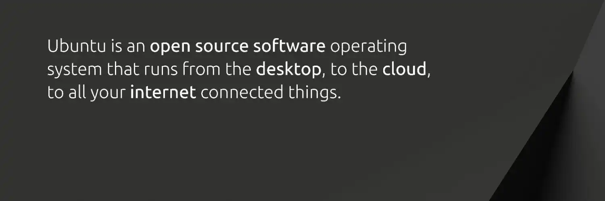
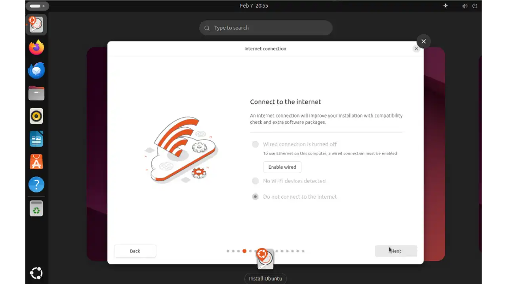

## Introduzione

Un sistema operativo (OS) è il software principale che gestisce tutte le risorse del computer. Scegliere un sistema operativo alternativo come Ubuntu può offrire molti vantaggi in termini di sicurezza, costi e privacy.

### Perché Ubuntu?


- Sicurezza migliorata** : Le distribuzioni Linux sono rinomate per la loro sicurezza e robustezza
- Costo zero**: Ubuntu e la maggior parte delle distribuzioni Linux sono gratuite
- Grande comunità**: Una comunità di utenti pronti ad aiutare tramite forum e tutorial
- Rispetto della privacy**: Sistema open source per una maggiore trasparenza
- Semplicità**: Interfaccia intuitiva e facilità d'uso
- Ricco ecosistema** : Ampio catalogo di software open source
- Supporto regolare**: Aggiornamenti sicuri da parte di Canonical

## Installazione e configurazione

### 1. Prerequisiti

**Attrezzatura richiesta:**


- Una chiave USB di almeno 12 GB
- Un computer con almeno 25 GB disponibili

### 2. Scaricare


- Vai a [ubuntu.com/download](https://ubuntu.com/download)
- Scegliere la versione stabile (si consiglia la LTS)
- Scarica l'immagine ISO


### 3. Creare una chiave USB avviabile

È possibile utilizzare diversi strumenti, come Balena Etcher :


- Scaricare e installare [Balena Etcher](https://etcher.balena.io/)


- Aprite Balena Etcher, quindi selezionate l'immagine ISO di Ubuntu
- Selezionare la chiave USB come supporto di destinazione
- Fare clic su Flash e attendere il completamento del processo


### 4. Installazione e protezione di Ubuntu

**4.1 Avvio da chiavetta USB** (in francese)


- Spegnere il computer
- Inserite la chiavetta USB (contenente Ubuntu)
- Accendere il computer. Sui PC recenti, il sistema dovrebbe riconoscere automaticamente la chiave di avvio USB. In caso contrario, riavviare tenendo premuto il tasto di accesso al BIOS/UEFI (di solito F2, F12 o Canc, a seconda della marca)
 - Nel menu BIOS/UEFI, selezionare la chiave USB come dispositivo di avvio
 - Salvare e riavviare

**4.2 Avvio dell'installazione** (in francese)

**Schermo di avvio**

Quando si avvia la chiavetta USB, viene visualizzata questa schermata, che consente di avviare Ubuntu.


**Scelta della lingua

Scegliere la lingua preferita per l'installazione e il sistema.


**Opzioni di accessibilità

Configurare le opzioni di accessibilità, se necessario (screen reader, contrasto elevato, ecc.).


**Configurazione della tastiera

Selezionare il layout della tastiera. È disponibile un campo di prova per verificare che i tasti corrispondano alla propria configurazione.


**Connessione alla rete**

Collegarsi alla rete Wi-Fi o cablata per scaricare gli aggiornamenti durante l'installazione.



**Tipo di installazione

Scegliete tra "Prova Ubuntu" (per testare senza installare) o "Installa Ubuntu".


**Metodo di installazione

Selezionare l'installazione interattiva.


**Selezione dell'applicazione

Scegliete tra l'installazione predefinita o una selezione estesa di applicazioni.


**Applicazioni di terze parti

Decidere se installare o meno driver aggiuntivi e software proprietario.


**Tipo di partizione

Avete due opzioni principali:


- "Cancella il disco e installa Ubuntu": utilizza l'intero disco per Ubuntu
- "Installazione manuale: creare un dual boot con Windows o personalizzare le partizioni"


**Creazione dell'account utente

Impostate il nome utente e la password per il vostro account Ubuntu.


**Fuso orario

Selezionare la propria area geografica per impostare l'ora del sistema.


**Riassunto dell'installazione**

Controllare tutte le scelte effettuate prima di avviare l'installazione finale. Una volta fatto clic su "Installa", il processo inizia.


**4.3 Aggiornamento di Ubuntu dopo l'installazione** (in francese)

L'aggiornamento del sistema è una fase importante dopo una nuova installazione. Sono disponibili due opzioni:

**Opzione 1: attraverso l'interfaccia grafica**


- Cercare "Software e aggiornamenti" nel menu Applicazioni
- L'applicazione controlla automaticamente gli aggiornamenti disponibili
- Seguire le istruzioni sullo schermo per installare gli aggiornamenti

**Opzione 2: via terminale


- Aprire il terminale (Ctrl + Alt + T)
- Digitare il seguente comando per verificare la disponibilità di aggiornamenti:

```bash
sudo apt update
```


- Inserire la password quando richiesto
- Per installare gli aggiornamenti, digitare :

```bash
sudo apt upgrade
```


- Confermare l'installazione digitando "Y" e poi Invio

### 5. Scoprire le attività di base

**5.1 Navigazione in Internet

Per impostazione predefinita, Firefox si trova spesso nella barra di avvio.

Avviare Firefox e iniziare a navigare.

Altri browser (Chrome, Brave, ecc.) possono essere installati tramite il Software Manager o tramite pacchetti .deb.

**5.2 Elaborazione testi

Ubuntu viene fornito con la suite LibreOffice (Writer per l'elaborazione dei testi).

Per aprirlo: Attività > Cercare "LibreOffice Writer" o fare clic sull'icona se appare nella barra.

È possibile creare, modificare e salvare documenti in diversi formati (compreso .docx).

**5.3 Installazione delle applicazioni

Gestore software (chiamato "Ubuntu Software"): interfaccia grafica per la ricerca e l'installazione di applicazioni.

Da Terminale, utilizzare il comando :

```bash
sudo apt install nom-du-paquet
```

Esempio:

```bash
sudo apt install vlc
```

### 6. Conclusioni e risorse aggiuntive

Ora siete pronti a usare Ubuntu quotidianamente: proteggete il vostro sistema, navigate, fate lavori d'ufficio, installate software e tenete aggiornato il vostro sistema operativo!

Per fare un ulteriore passo avanti nella sicurezza della vostra vita digitale, vi consigliamo di dare un'occhiata al nostro servizio di messaggistica criptata, che è perfettamente adatto a proteggere la vostra privacy e completa la vostra installazione di Ubuntu:

https://planb.network/tutorials/computer-security/communication/proton-mail-c3b010ce-254d-4546-b382-19ab9261c6a2
