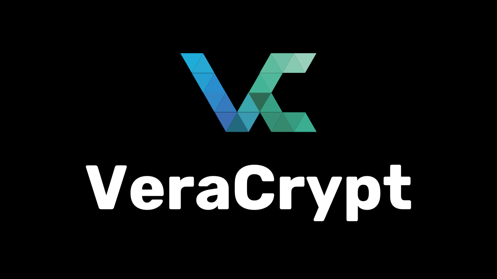

आजकल यह बहुत ज़रूरी है कि आप एक ऐसी रणनीति अपनाएँ जो आपकी फाइलों की पहुँच, सुरक्षा और बैकअप सुनिश्चित करे, जैसे कि आपके व्यक्तिगत दस्तावेज़, फोटो या महत्वपूर्ण प्रोजेक्ट्स। इन डेटा का खो जाना बहुत बड़ा नुकसान हो सकता है।

इन समस्याओं से बचने के लिए, मैं आपको सलाह देता हूँ कि आप अपनी फाइलों के कई बैकअप अलग-अलग माध्यमों पर रखें। कंप्यूटिंग में एक आमतौर पर इस्तेमाल की जाने वाली रणनीति है "3-2-1" बैकअप रणनीति, जो आपकी फाइलों की सुरक्षा सुनिश्चित करती है:

- आपकी फाइलों की 3 प्रतियाँ;
- कम से कम **2** अलग-अलग प्रकार के मीडिया पर सुरक्षित किया गया;
- कम से कम **1** कॉपी साइट से बाहर रखी जानी चाहिए।

दूसरे शब्दों में, यह सलाह दी जाती है कि आप अपनी फाइलों को तीन अलग-अलग स्थानों पर स्टोर करें, और इसके लिए अलग-अलग प्रकार के मीडिया का उपयोग करें, जैसे कि आपका कंप्यूटर, एक बाहरी Hard ड्राइव, एक यूएसबी स्टिक, या एक ऑनलाइन स्टोरेज सेवा। और अंत में, एक ऑफसाइट कॉपी का मतलब है कि आपकी बैकअप कॉपी आपके घर या व्यवसाय के बाहर कहीं सुरक्षित होनी चाहिए। यह आखिरी बिंदु स्थानीय आपदाओं जैसे आग या बाढ़ के मामले में आपकी फाइलों के पूरी तरह से खो जाने से बचने में मदद करता है। घर या व्यवसाय से दूर एक बाहरी कॉपी यह सुनिश्चित करती है कि आपका डेटा स्थानीय खतरों से स्वतंत्र रूप से सुरक्षित रहेगा।

3-2-1 बैकअप रणनीति को आसानी से लागू करने के लिए, आप एक ऑनलाइन स्टोरेज समाधान चुन सकते हैं, जिसमें आपके कंप्यूटर से फाइलों को आपके क्लाउड के साथ स्वचालित या समय-समय पर सिंक किया जाता है। इन ऑनलाइन बैकअप समाधानों में, निश्चित रूप से, वे बड़े डिजिटल कंपनियों के हैं जिन्हें आप जानते हैं: गूगल ड्राइव, माइक्रोसॉफ्ट वनड्राइव, या एप्पल आईक्लाउड। हालांकि, ये आपकी गोपनीयता की सुरक्षा के लिए सबसे अच्छे समाधान नहीं हैं। एक पिछले ट्यूटोरियल में, मैंने आपको एक वैकल्पिक समाधान से परिचित कराया था जो आपके दस्तावेजों को बेहतर गोपनीयता के लिए एन्क्रिप्ट करता है: प्रोटॉन ड्राइव।

https://planb.network/tutorials/computer-security/data/proton-drive-03cbe49f-6ddc-491f-8786-bc20d98ebb16
इस रणनीति को अपनाकर, जिसमें स्थानीय और क्लाउड बैकअप शामिल है, आप पहले से ही अपने डेटा के लिए दो अलग-अलग प्रकार के माध्यमों का लाभ उठा रहे हैं, जिनमें से एक ऑफसाइट है। 3-2-1 रणनीति को पूरा करने के लिए, आपको बस एक अतिरिक्त प्रति जोड़नी होगी। मैं आपको सलाह देता हूँ कि आप समय-समय पर अपने स्थानीय और क्लाउड पर मौजूद डेटा को एक भौतिक माध्यम, जैसे कि एक यूएसबी स्टिक या एक बाहरी Hard ड्राइव पर निर्यात करें। इस तरह, भले ही आपके ऑनलाइन स्टोरेज समाधान के सर्वर नष्ट हो जाएं और आपका कंप्यूटर भी खराब हो जाए, आपके पास इस बाहरी माध्यम पर तीसरी प्रति होगी ताकि आपका डेटा न खोए।

लेकिन यह भी महत्वपूर्ण है कि आप अपने डेटा स्टोरेज की सुरक्षा के बारे में सोचें ताकि आपके अलावा कोई और या आपके प्रियजन इसे एक्सेस न कर सकें। आमतौर पर, स्थानीय और ऑनलाइन डेटा सुरक्षित होते हैं। आपके कंप्यूटर पर, आपने शायद एक पासवर्ड सेट किया होगा, और आधुनिक कंप्यूटरों के Hard ड्राइव अक्सर डिफ़ॉल्ट रूप से एन्क्रिप्टेड होते हैं। आपके ऑनलाइन स्टोरेज (क्लाउड) के बारे में, मैंने आपको पिछले ट्यूटोरियल में दिखाया था कि कैसे एक मजबूत पासवर्ड और दो-कारक प्रमाणीकरण के साथ अपने खाते को सुरक्षित करें। हालांकि, आपके तीसरे कॉपी के लिए जो एक भौतिक माध्यम पर संग्रहीत है, उसकी सुरक्षा केवल उसकी भौतिक उपस्थिति है। अगर कोई चोर आपके USB स्टिक या आपके बाहरी Hard ड्राइव को चुरा लेता है, तो वे आसानी से आपके सभी डेटा तक पहुंच सकते हैं।

इस जोखिम से बचने के लिए, अपने भौतिक माध्यम को एन्क्रिप्ट करना उचित है। इस तरह, डेटा तक पहुंचने की किसी भी कोशिश के लिए सामग्री को डिक्रिप्ट करने के लिए एक पासवर्ड दर्ज करना होगा। बिना इस पासवर्ड के, डेटा तक पहुंचना असंभव होगा, जिससे आपके व्यक्तिगत फाइलें सुरक्षित रहेंगी, भले ही आपकी यूएसबी स्टिक या बाहरी Hard ड्राइव चोरी हो जाए।

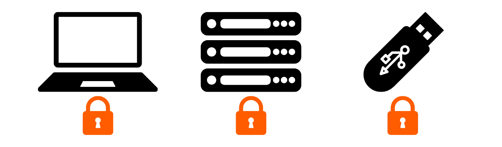

इस ट्यूटोरियल में, मैं आपको दिखाऊंगा कि कैसे आप VeraCrypt, जो एक ओपन-सोर्स टूल है, का उपयोग करके आसानी से एक बाहरी स्टोरेज माध्यम को एन्क्रिप्ट कर सकते हैं।

## वेरा क्रिप्ट का परिचय

VeraCrypt एक ओपन-सोर्स सॉफ्टवेयर है जो Windows, macOS, और Linux पर उपलब्ध है। यह आपको विभिन्न तरीकों से और अलग-अलग माध्यमों पर अपने डेटा को एन्क्रिप्ट करने की सुविधा देता है।

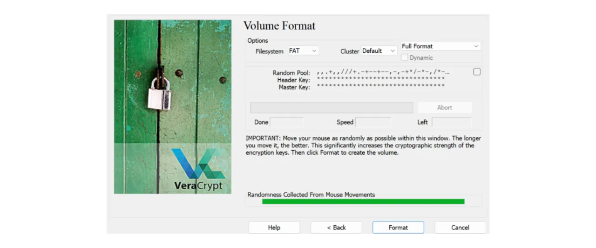

यह सॉफ़्टवेयर आपको तुरंत एन्क्रिप्टेड वॉल्यूम बनाने और बनाए रखने की सुविधा देता है, जिसका मतलब है कि आपका डेटा सेव होने से पहले अपने आप एन्क्रिप्ट हो जाता है और पढ़े जाने से पहले डिक्रिप्ट हो जाता है। इस तरीके से आपके फाइल्स सुरक्षित रहती हैं, भले ही आपका स्टोरेज माध्यम चोरी हो जाए। VeraCrypt न केवल फाइल्स को एन्क्रिप्ट करता है, बल्कि फाइल के नाम, मेटाडेटा, फोल्डर्स और यहां तक कि आपके स्टोरेज माध्यम की खाली जगह को भी एन्क्रिप्ट करता है।

VeraCrypt का उपयोग स्थानीय रूप से फाइलों या पूरे विभाजन, जिसमें सिस्टम डिस्क भी शामिल है, को एन्क्रिप्ट करने के लिए किया जा सकता है। इसे पूरी तरह से किसी बाहरी माध्यम जैसे USB स्टिक या डिस्क को एन्क्रिप्ट करने के लिए भी इस्तेमाल किया जा सकता है, जैसा कि हम इस ट्यूटोरियल में देखेंगे।

VeraCrypt का एक बड़ा फायदा यह है कि यह पूरी तरह से ओपन सोर्स है, जिसका मतलब है कि इसका कोड कोई भी देख और जांच सकता है। यह इसे प्राइवेट सॉल्यूशन्स के मुकाबले ज्यादा भरोसेमंद बनाता है।

## VeraCrypt को कैसे इंस्टॉल करें?

1. **डाउनलोड करें**: सबसे पहले, VeraCrypt की आधिकारिक वेबसाइट पर जाएं और अपने ऑपरेटिंग सिस्टम के अनुसार सॉफ़्टवेयर डाउनलोड करें।

2. **इंस्टॉलर चलाएं**: डाउनलोड पूरा होने के बाद, इंस्टॉलर फाइल पर डबल-क्लिक करें ताकि इंस्टॉलेशन प्रक्रिया शुरू हो सके।

3. **लाइसेंस एग्रीमेंट**: इंस्टॉलेशन के दौरान, आपको लाइसेंस एग्रीमेंट को स्वीकार करना होगा। इसे ध्यान से पढ़ें और "I Agree" पर क्लिक करें।

4. **इंस्टॉलेशन विकल्प**: आपको इंस्टॉलेशन के लिए कुछ विकल्प दिए जाएंगे। आमतौर पर, "Install" विकल्प को चुनें और आगे बढ़ें।

5. **इंस्टॉल करें**: अब "Install" बटन पर क्लिक करें। इंस्टॉलेशन प्रक्रिया शुरू हो जाएगी और कुछ मिनटों में पूरी हो जाएगी।

6. **इंस्टॉलेशन पूरा**: जब इंस्टॉलेशन पूरा हो जाए, तो "Finish" बटन पर क्लिक करें।

7. **VeraCrypt चलाएं**: अब आप अपने कंप्यूटर पर VeraCrypt को खोल सकते हैं और इसका उपयोग शुरू कर सकते हैं।

बस, इतना ही! अब आप VeraCrypt का उपयोग करके अपनी फाइल्स को सुरक्षित कर सकते हैं।

"[वेरा क्रिप्ट की आधिकारिक वेबसाइट](https://www.veracrypt.fr/en/Downloads.html)" पर जाएं और "*डाउनलोड्स*" टैब पर क्लिक करें।

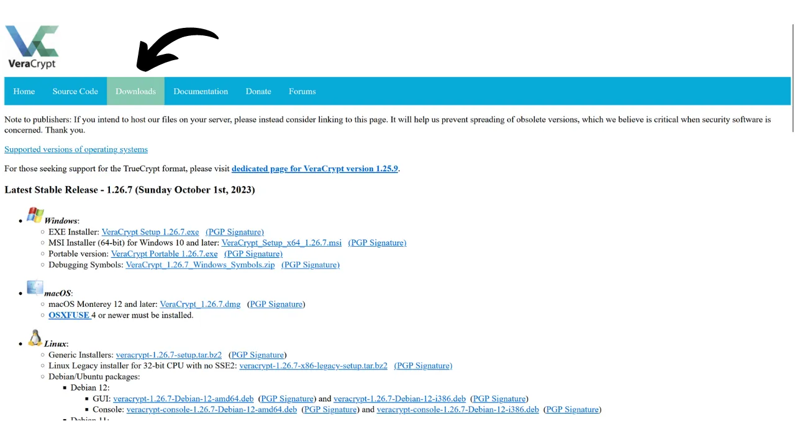

अपने ऑपरेटिंग सिस्टम के लिए उपयुक्त संस्करण डाउनलोड करें। अगर आप विंडोज़ पर हैं, तो "*EXE इंस्टॉलर*" चुनें।

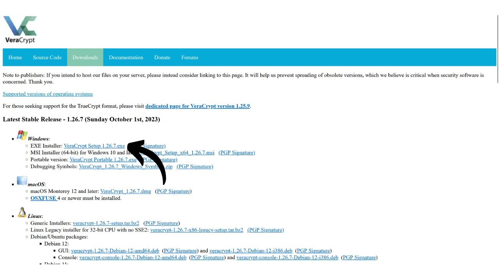

अपने Interface के लिए भाषा चुनें।

लाइसेंस की शर्तों को स्वीकार करें।

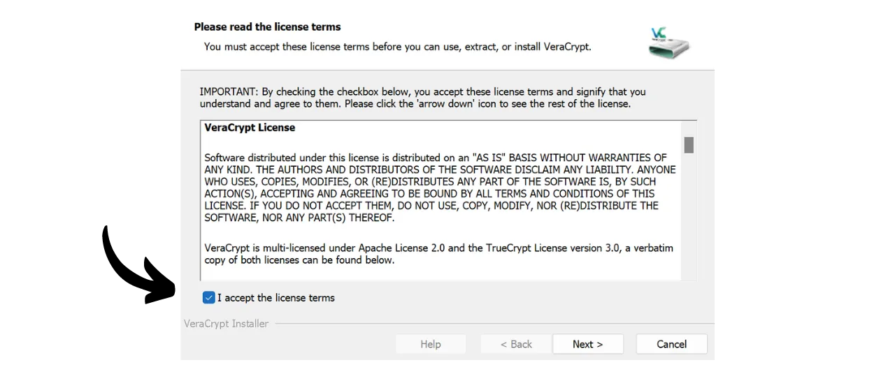

"*इंस्टॉल*" चुनें।

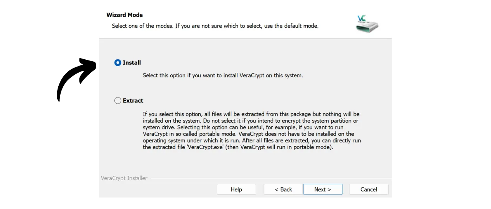

अंत में, उस फोल्डर को चुनें जहाँ सॉफ़्टवेयर इंस्टॉल होगा, फिर "*इंस्टॉल*" बटन पर क्लिक करें।

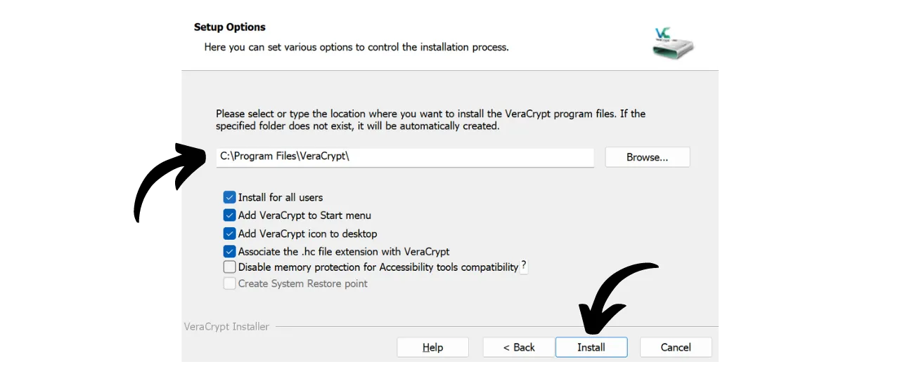

इंस्टॉलेशन पूरा होने का इंतज़ार करें।

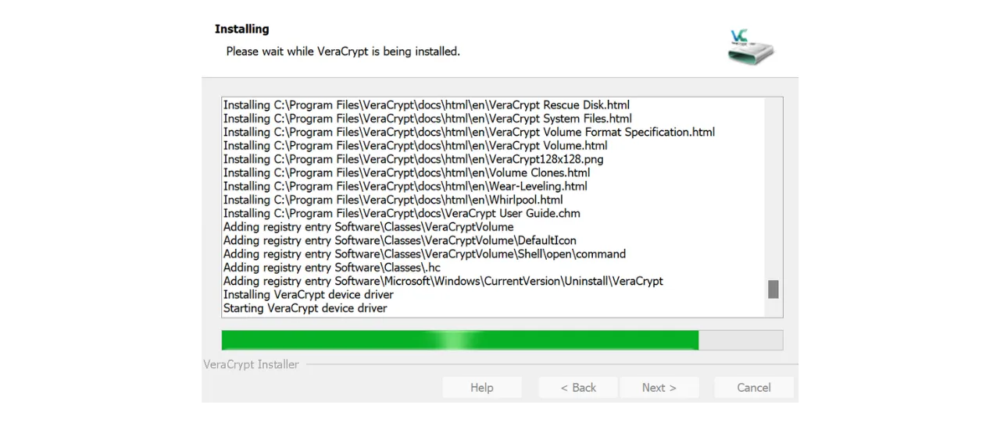

इंस्टॉलेशन पूरा हो गया है।

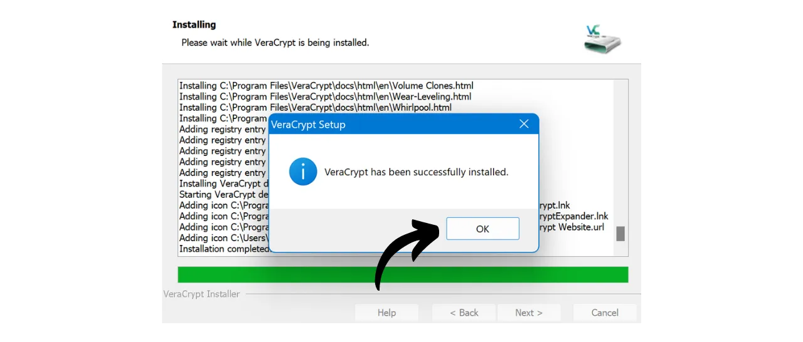

यदि आप चाहें, तो इस ओपन-सोर्स टूल के विकास को समर्थन देने के लिए बिटकॉइन में दान कर सकते हैं।

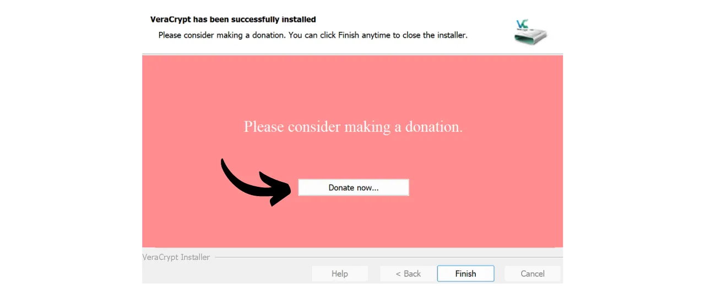

## VeraCrypt के साथ स्टोरेज डिवाइस को एन्क्रिप्ट कैसे करें?

1. **VeraCrypt डाउनलोड और इंस्टॉल करें**: सबसे पहले, VeraCrypt की आधिकारिक वेबसाइट से सॉफ़्टवेयर डाउनलोड करें और इसे अपने कंप्यूटर पर इंस्टॉल करें।

2. **VeraCrypt खोलें**: इंस्टॉल करने के बाद, VeraCrypt प्रोग्राम को खोलें।

3. **डिवाइस सिलेक्ट करें**: 'Select Device' बटन पर क्लिक करें और उस स्टोरेज डिवाइस को चुनें जिसे आप एन्क्रिप्ट करना चाहते हैं।

4. **क्रिप्टोग्राफिक एल्गोरिदम चुनें**: 'Create Volume' पर क्लिक करें और फिर 'Encrypt a non-system partition/drive' विकल्प चुनें। इसके बाद, एन्क्रिप्शन और हैश एल्गोरिदम चुनें। आमतौर पर, डिफ़ॉल्ट विकल्प अच्छे होते हैं।

5. **पासवर्ड सेट करें**: एक मजबूत पासवर्ड बनाएं और उसे याद रखें। यह पासवर्ड आपके एन्क्रिप्टेड डिवाइस को अनलॉक करने के लिए आवश्यक होगा।

6. **फॉर्मेटिंग विकल्प**: अगर आप डिवाइस को फॉर्मेट करना चाहते हैं, तो 'Quick Format' या 'Standard Format' में से एक विकल्प चुनें। ध्यान दें कि फॉर्मेटिंग से डिवाइस का सारा डेटा मिट जाएगा।

7. **एन्क्रिप्शन प्रक्रिया शुरू करें**: 'Encrypt' बटन पर क्लिक करें और प्रक्रिया को पूरा होने दें। इसमें कुछ समय लग सकता है, खासकर अगर डिवाइस बड़ा है।

8. **प्रक्रिया पूरी करें**: एन्क्रिप्शन प्रक्रिया पूरी होने के बाद, आपका स्टोरेज डिवाइस सुरक्षित रूप से एन्क्रिप्ट हो जाएगा।

अब आपका डिवाइस VeraCrypt के माध्यम से एन्क्रिप्ट हो चुका है और सुरक्षित है। जब भी आपको इसे एक्सेस करना हो, VeraCrypt का उपयोग करके इसे माउंट करें और पासवर्ड डालें।

पहली बार लॉन्च करने पर, आप इस Interface पर पहुंचेंगे:

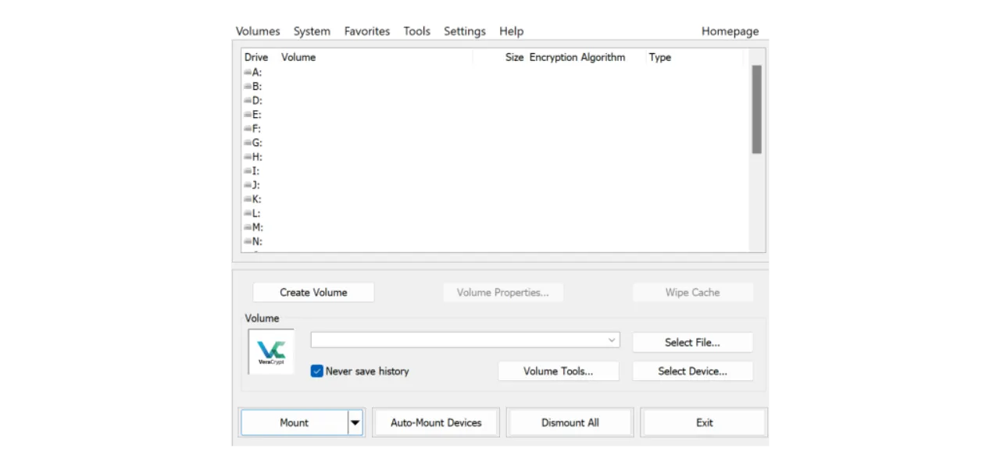

अपने चुने हुए स्टोरेज डिवाइस को एन्क्रिप्ट करने के लिए, सबसे पहले उसे अपनी मशीन से कनेक्ट करें। जैसा कि आप बाद में देखेंगे, यदि डिवाइस में पहले से ही ऐसा डेटा है जिसे आप हटाना नहीं चाहते, तो USB स्टिक या Hard ड्राइव पर नया एन्क्रिप्टेड वॉल्यूम बनाने की प्रक्रिया में काफी समय लग सकता है। इसलिए, मैं सुझाव देता हूँ कि समय बचाने के लिए एक खाली USB स्टिक का उपयोग करें या पहले से डिवाइस को खाली कर लें ताकि एन्क्रिप्टेड वॉल्यूम आसानी से बनाया जा सके।

VeraCrypt पर, "*Volumes*" टैब पर क्लिक करें।

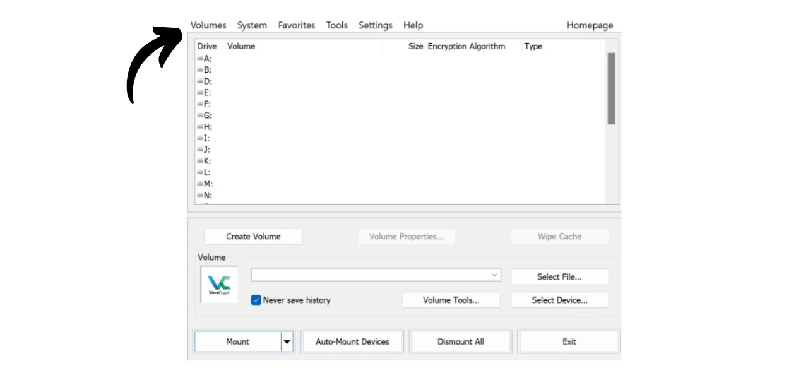

फिर "*नया वॉल्यूम बनाएं...*" मेनू पर।

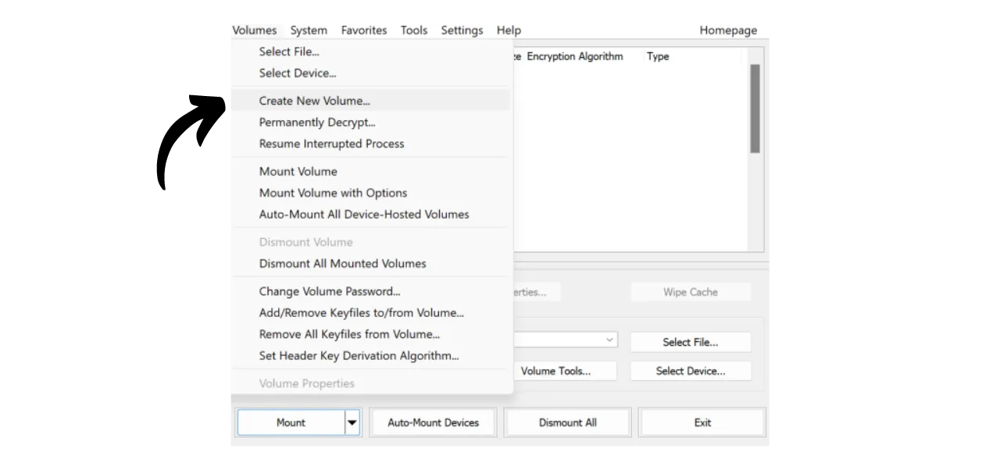

नई विंडो में, "*Encrypt a non-system partition/drive*" विकल्प चुनें और "*Next*" पर क्लिक करें।

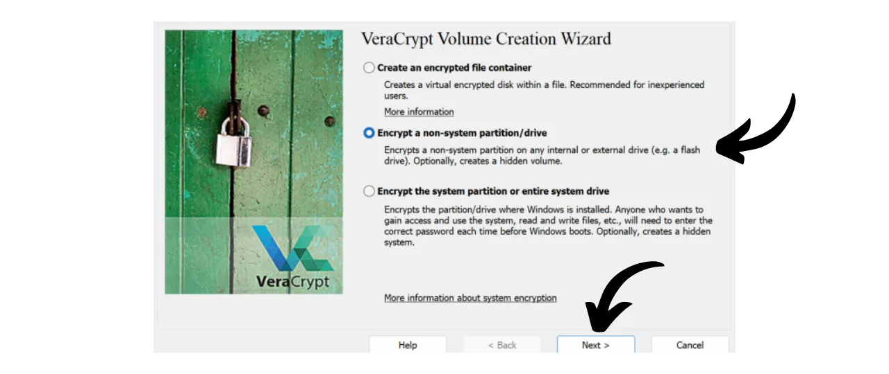

आपको फिर "*स्टैंडर्ड VeraCrypt वॉल्यूम*" और "*हिडन VeraCrypt वॉल्यूम*" के बीच चुनना होगा। पहला विकल्प आपके डिवाइस पर एक सामान्य एन्क्रिप्टेड वॉल्यूम बनाता है। "*हिडन VeraCrypt वॉल्यूम*" विकल्प एक सामान्य VeraCrypt वॉल्यूम के भीतर एक छिपा हुआ वॉल्यूम बनाने की अनुमति देता है। यह तरीका आपको इस छिपे हुए वॉल्यूम के अस्तित्व को नकारने की सुविधा देता है, खासकर जब कोई आपको मजबूर करे। उदाहरण के लिए, अगर कोई आपको शारीरिक रूप से मजबूर करता है कि आप अपने डिवाइस को डिक्रिप्ट करें, तो आप केवल सामान्य हिस्से को डिक्रिप्ट कर सकते हैं ताकि सामने वाले को संतुष्ट कर सकें, लेकिन छिपे हुए हिस्से को प्रकट नहीं करेंगे। मेरे उदाहरण में, मैं एक सामान्य वॉल्यूम के साथ रहूँगा।

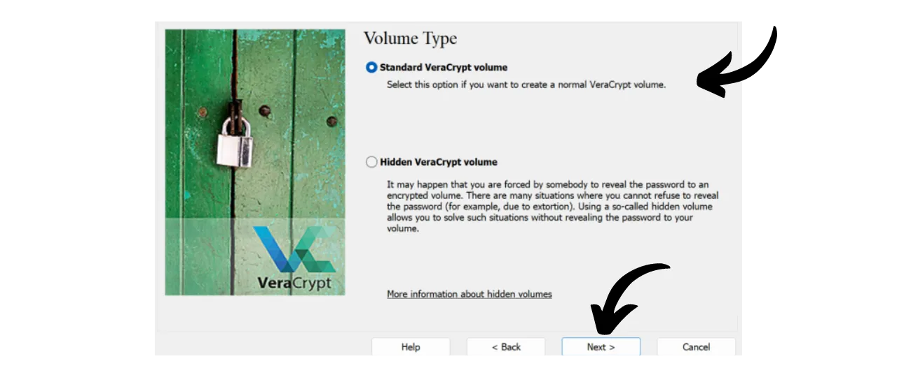

अगले पृष्ठ पर, "*Select Device...*" बटन पर क्लिक करें।

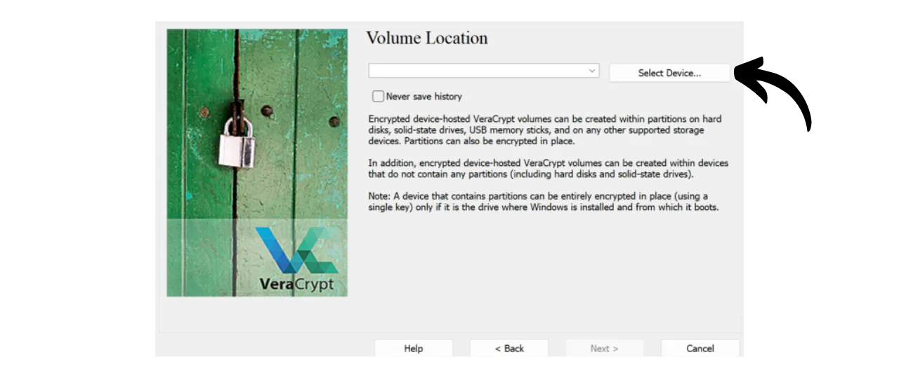

एक नई विंडो खुलती है जहाँ आप अपनी मशीन पर उपलब्ध डिस्क की सूची से अपने स्टोरेज डिवाइस के विभाजन का चयन कर सकते हैं। आमतौर पर, जिस विभाजन को आप एन्क्रिप्ट करना चाहते हैं, वह "*रिमूवेबल डिस्क N*" शीर्षक वाली लाइन के तहत सूचीबद्ध होगा। सही विभाजन का चयन करने के बाद, "*ओके*" बटन पर क्लिक करें।

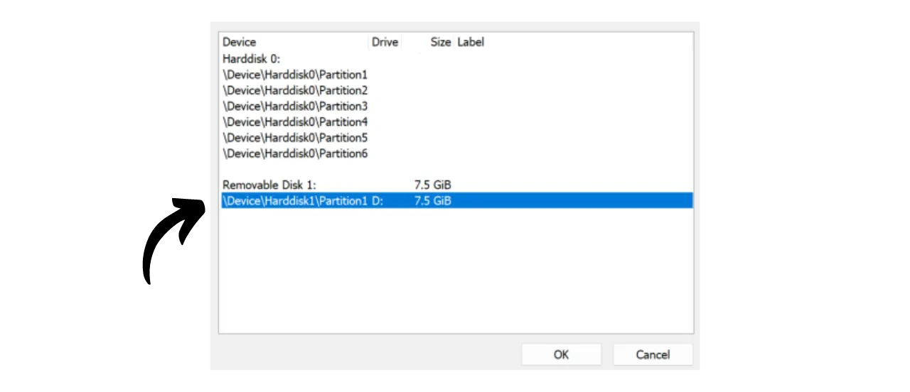

चुना हुआ समर्थन बॉक्स में दिखाई दे रहा है। अब आप "*Next*" बटन पर क्लिक कर सकते हैं।

अब आपको दो विकल्पों में से एक चुनना होगा: "*एन्क्रिप्टेड वॉल्यूम बनाएं और इसे फॉर्मेट करें*" या "*पार्टिशन को उसी जगह एन्क्रिप्ट करें*।" जैसा कि पहले बताया गया था, पहला विकल्प आपके USB स्टिक या Hard ड्राइव पर मौजूद सभी डेटा को स्थायी रूप से हटा देगा। इस विकल्प को तभी चुनें जब आपका डिवाइस खाली हो; अन्यथा, आप उसमें मौजूद सभी डेटा खो देंगे। यदि आप मौजूदा डेटा को सुरक्षित रखना चाहते हैं, तो आप उसे अस्थायी रूप से कहीं और स्थानांतरित कर सकते हैं। "*एन्क्रिप्टेड वॉल्यूम बनाएं और इसे फॉर्मेट करें*" विकल्प चुनें अगर आप तेज़ प्रक्रिया चाहते हैं जो सब कुछ मिटा देती है, या "*पार्टिशन को उसी जगह एन्क्रिप्ट करें*" का विकल्प चुनें। यह अंतिम विकल्प वॉल्यूम को एन्क्रिप्ट करने की अनुमति देता है बिना पहले से मौजूद डेटा को मिटाए, लेकिन यह प्रक्रिया बहुत लंबी होगी। इस उदाहरण के लिए, क्योंकि मेरी USB स्टिक खाली है, मैं "*एन्क्रिप्टेड वॉल्यूम बनाएं और इसे फॉर्मेट करें*" चुनता हूँ, जो सब कुछ मिटा देता है।

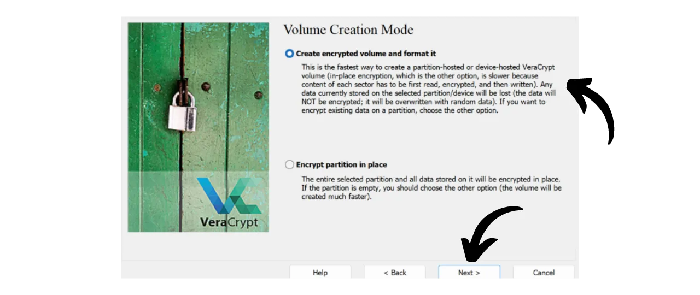

अब आपके पास एन्क्रिप्शन एल्गोरिदम और Hash फंक्शन चुनने का विकल्प होगा। अगर आपकी कोई विशेष आवश्यकता नहीं है, तो मैं सलाह दूंगा कि आप डिफ़ॉल्ट विकल्पों को ही चुनें। आगे बढ़ने के लिए "*Next*" पर क्लिक करें।

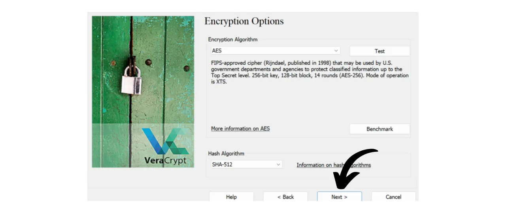

सुनिश्चित करें कि आपके वॉल्यूम के लिए दर्शाया गया आकार सही है, ताकि USB स्टिक पर उपलब्ध पूरे स्थान को एन्क्रिप्ट किया जा सके, न कि सिर्फ एक हिस्से को। एक बार सत्यापित हो जाने पर, "*अगला*" पर क्लिक करें।

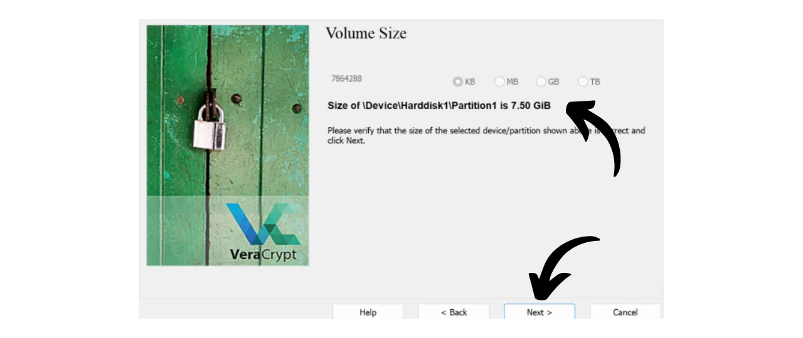

इस चरण में, आपको अपने डिवाइस को एन्क्रिप्ट और डिक्रिप्ट करने के लिए एक पासवर्ड सेट करना होगा। यह महत्वपूर्ण है कि आप एक मजबूत पासवर्ड चुनें ताकि कोई हमलावर आपके कंटेंट को ब्रूट फोर्स अटैक से डिक्रिप्ट न कर सके। पासवर्ड जितना संभव हो उतना लंबा और रैंडम होना चाहिए, और इसमें कई प्रकार के कैरेक्टर शामिल होने चाहिए। मैं आपको सलाह देता हूँ कि आप कम से कम 20 कैरेक्टर का एक रैंडम पासवर्ड चुनें जिसमें छोटे अक्षर, बड़े अक्षर, नंबर और प्रतीक शामिल हों।

मैं आपको सलाह देता हूँ कि आप अपना पासवर्ड एक पासवर्ड मैनेजर में सुरक्षित रखें। इससे इसे एक्सेस करना आसान हो जाता है और भूलने का खतरा भी खत्म हो जाता है। हमारे विशेष मामले में, पासवर्ड मैनेजर कागज के माध्यम से बेहतर है। वास्तव में, अगर चोरी हो जाती है, तो भले ही आपका स्टोरेज डिवाइस चोरी हो जाए, मैनेजर में रखा पासवर्ड हमलावर को नहीं मिल सकता, जिससे डेटा तक पहुंचने से रोका जा सकता है। इसके विपरीत, अगर आपका पासवर्ड मैनेजर समझौता कर लिया जाता है, तो भी पासवर्ड का उपयोग करने और डेटा तक पहुंचने के लिए डिवाइस की भौतिक पहुंच आवश्यक होती है।

पासवर्ड प्रबंधन के बारे में अधिक जानकारी के लिए, मैं आपको यह अन्य संपूर्ण ट्यूटोरियल देखने की सलाह देता हूँ:

https://planb.network/tutorials/computer-security/authentication/bitwarden-0532f569-fb00-4fad-acba-2fcb1bf05de9
अपना पासवर्ड दो निर्धारित स्थानों में दर्ज करें, फिर "*Next*" पर क्लिक करें।

VeraCrypt आपसे पूछेगा कि क्या आप एन्क्रिप्टेड वॉल्यूम में 4 GiB से बड़े फाइल्स स्टोर करने की योजना बना रहे हैं। यह सवाल सॉफ्टवेयर को सबसे उपयुक्त फाइल सिस्टम चुनने में मदद करता है। आमतौर पर, FAT सिस्टम का उपयोग किया जाता है क्योंकि यह अधिकांश ऑपरेटिंग सिस्टम के साथ संगत होता है, लेकिन यह 4 GiB की अधिकतम फाइल साइज सीमा लगाता है। अगर आपको बड़ी फाइल्स को मैनेज करना है, तो आप exFAT सिस्टम का विकल्प चुन सकते हैं।

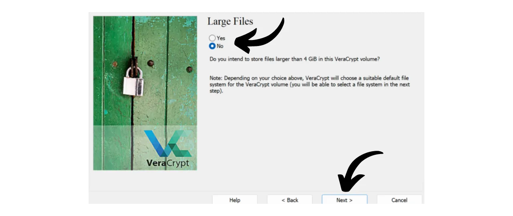

अगले चरण में, आप एक पेज पर पहुँचेंगे जो आपको एक रैंडम कुंजी generate करने की अनुमति देगा। यह कुंजी महत्वपूर्ण है क्योंकि इसका उपयोग आपके डेटा को एन्क्रिप्ट और डिक्रिप्ट करने के लिए किया जाएगा। इसे आपके मीडिया के एक विशेष हिस्से में संग्रहीत किया जाएगा, जो कि आपके द्वारा पहले से स्थापित पासवर्ड से सुरक्षित है। एक मजबूत एन्क्रिप्शन कुंजी generate करने के लिए, VeraCrypt को एंट्रॉपी की आवश्यकता होती है। इसलिए सॉफ्टवेयर आपसे कहता है कि आप विंडो पर माउस को रैंडम तरीके से घुमाएँ; इन मूवमेंट्स का उपयोग कुंजी generate करने के लिए किया जाता है। माउस को तब तक घुमाते रहें जब तक कि एंट्रॉपी गेज पूरी तरह से भर न जाए। फिर, एन्क्रिप्टेड वॉल्यूम बनाने की प्रक्रिया शुरू करने के लिए "*Format*" पर क्लिक करें।

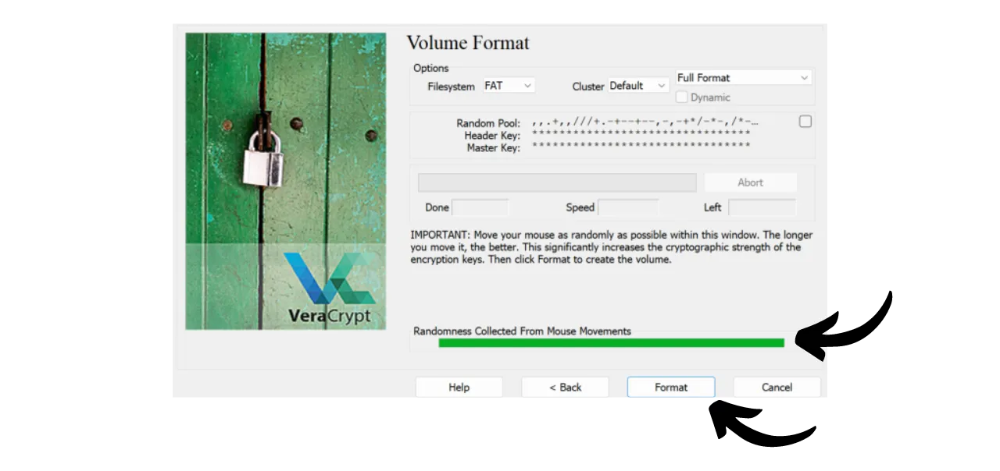

कृपया प्रतीक्षा करें जब तक फॉर्मेटिंग पूरी नहीं हो जाती। बड़े डेटा के लिए इसमें काफी समय लग सकता है।

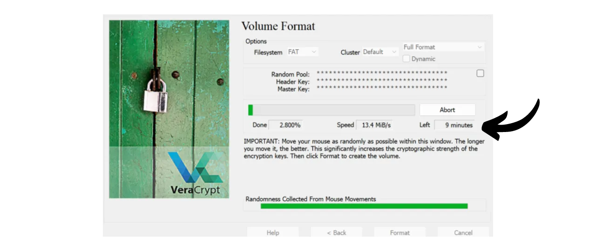

फिर आपको एक पुष्टि प्राप्त होगी।

## VeraCrypt के साथ एन्क्रिप्टेड ड्राइव का उपयोग कैसे करें?

1. **VeraCrypt डाउनलोड और इंस्टॉल करें**: सबसे पहले, VeraCrypt की आधिकारिक वेबसाइट से इसे डाउनलोड करें और अपने कंप्यूटर पर इंस्टॉल करें।

2. **ड्राइव एन्क्रिप्ट करें**: 
   - VeraCrypt खोलें और 'Create Volume' पर क्लिक करें।
   - 'Encrypt a non-system partition/drive' विकल्प चुनें और 'Next' पर क्लिक करें।
   - उस ड्राइव या पार्टिशन का चयन करें जिसे आप एन्क्रिप्ट करना चाहते हैं और 'Next' पर क्लिक करें।
   - एन्क्रिप्शन एल्गोरिदम और हैश एल्गोरिदम चुनें। डिफ़ॉल्ट विकल्प आमतौर पर सुरक्षित होते हैं।
   - पासवर्ड सेट करें। यह पासवर्ड मजबूत और याद रखने लायक होना चाहिए।
   - 'Format' पर क्लिक करें। ध्यान दें कि यह प्रक्रिया ड्राइव के सभी डेटा को मिटा देगी, इसलिए पहले बैकअप लेना न भूलें।

3. **एन्क्रिप्टेड ड्राइव माउंट करें**:
   - VeraCrypt में, एक खाली ड्राइव लेटर चुनें।
   - 'Select Device' पर क्लिक करें और एन्क्रिप्टेड ड्राइव का चयन करें।
   - 'Mount' पर क्लिक करें और पासवर्ड दर्ज करें।

4. **ड्राइव का उपयोग करें**: अब आप एन्क्रिप्टेड ड्राइव को सामान्य ड्राइव की तरह उपयोग कर सकते हैं। जब भी आप काम खत्म कर लें, ड्राइव को अनमाउंट करना न भूलें।

5. **ड्राइव अनमाउंट करें**: 
   - VeraCrypt में, माउंटेड ड्राइव को चुनें और 'Dismount' पर क्लिक करें।

बस, अब आप VeraCrypt के साथ सुरक्षित रूप से अपनी एन्क्रिप्टेड ड्राइव का उपयोग कर सकते हैं!

अभी के लिए, आपकी मीडिया एन्क्रिप्टेड है और इसलिए आप इसे खोल नहीं सकते। इसे डिक्रिप्ट करने के लिए, VeraCrypt पर जाएं।

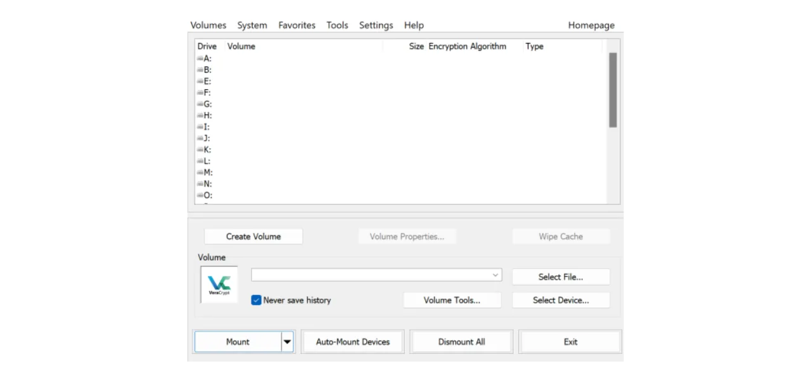

सूची में से एक ड्राइव अक्षर चुनें। उदाहरण के लिए, मैंने "*L:*" चुना।

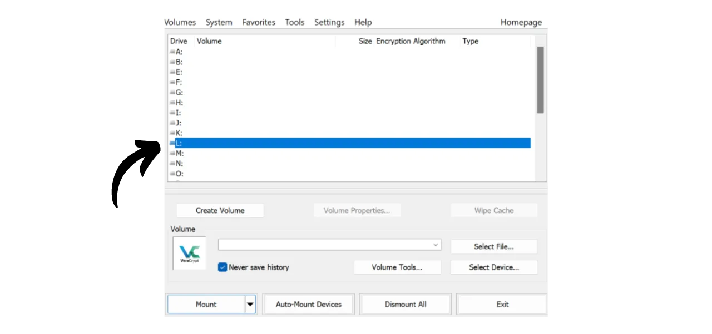

"*डिवाइस चुनें...*" बटन पर क्लिक करें।

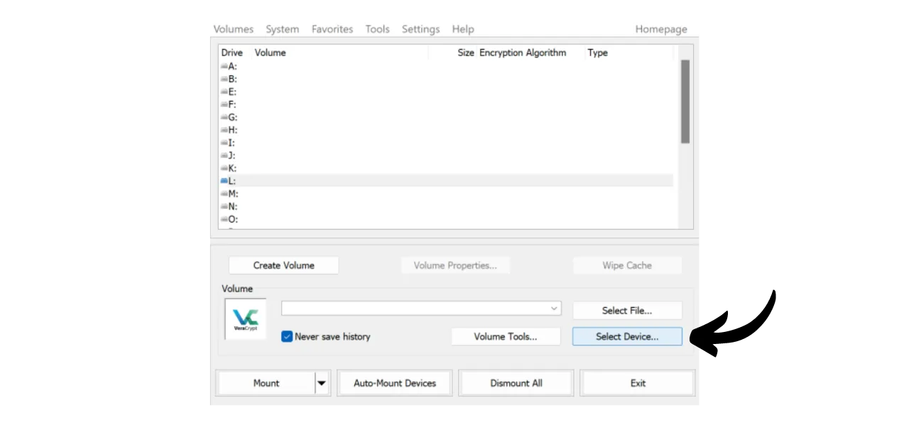

अपनी मशीन पर मौजूद सभी डिस्क की सूची में से, अपने मीडिया पर एन्क्रिप्टेड वॉल्यूम को चुनें, फिर "*OK*" बटन पर क्लिक करें।

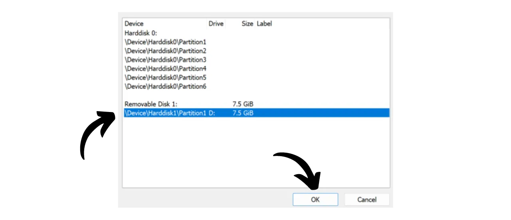

आप देख सकते हैं कि आपकी ध्वनि का स्तर सही चुना गया है।

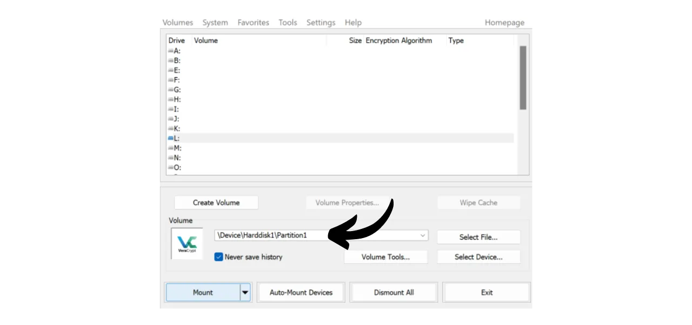

"*माउंट*" बटन पर क्लिक करें।

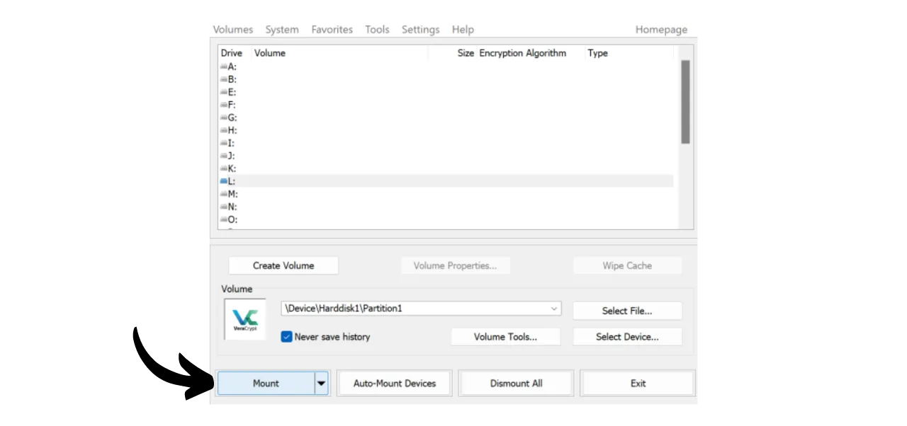

वॉल्यूम बनाने के दौरान चुना गया पासवर्ड दर्ज करें, फिर "*ओके*" पर क्लिक करें।

आप देख सकते हैं कि आपका वॉल्यूम अब डिक्रिप्ट हो चुका है और ड्राइव लेटर "*L:*" पर उपलब्ध है।

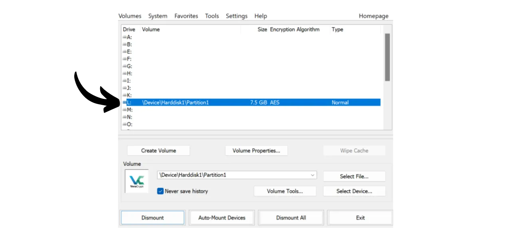

इसे एक्सेस करने के लिए, अपनी फाइल एक्सप्लोरर खोलें और "*L:*" ड्राइव पर जाएं (या उस ड्राइव लेटर पर जाएं जो आपने पिछले चरणों में चुना था)। 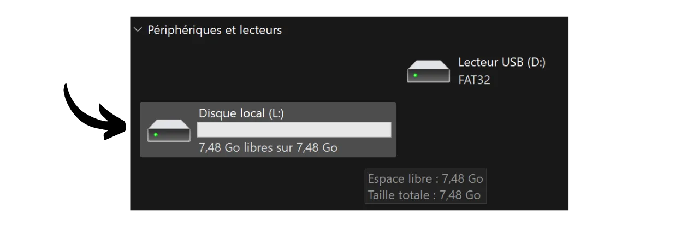

अपने व्यक्तिगत फाइलों को मीडिया में जोड़ने के बाद, वॉल्यूम को फिर से एन्क्रिप्ट करने के लिए बस "*Dismount*" बटन पर क्लिक करें।

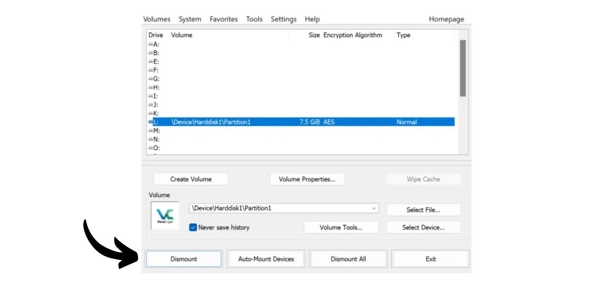

आपकी वॉल्यूम अब "*L:*" अक्षर के तहत नहीं दिखाई देती है। इसका मतलब है कि यह फिर से एन्क्रिप्ट कर दी गई है।

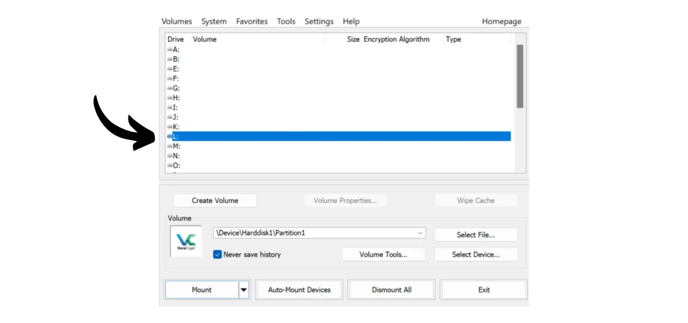

अब आप अपना स्टोरेज मीडिया हटा सकते हैं।

बधाई हो, अब आपके पास एक सुरक्षित माध्यम है जिसमें आप अपने व्यक्तिगत डेटा को एन्क्रिप्ट करके स्टोर कर सकते हैं। इस तरह, आपके पास 3-2-1 रणनीति पूरी हो जाती है - आपके कंप्यूटर पर एक कॉपी, ऑनलाइन स्टोरेज समाधान के साथ।

यदि आप VeraCrypt के विकास में सहयोग करना चाहते हैं, तो आप इस [पृष्ठ](https://www.veracrypt.fr/en/Donation.html) पर जाकर बिटकॉइन में दान भी कर सकते हैं।