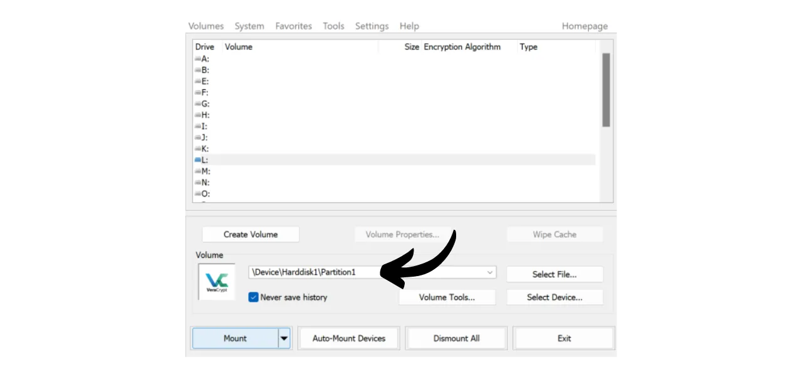
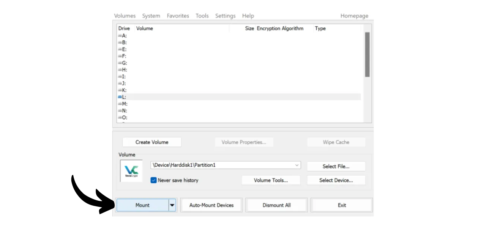

I dagens samfunn er det viktig å implementere en strategi for å sikre tilgjengeligheten, sikkerheten og backup av filene dine, som dine personlige dokumenter, bilder eller viktige prosjekter. Å miste disse dataene kan være katastrofalt.

For å forhindre disse problemene, råder jeg deg til å opprettholde flere sikkerhetskopier av filene dine på forskjellige medier. En ofte brukt strategi i databehandling er "3-2-1" backup-strategien, som sikrer beskyttelsen av filene dine:
- **3** kopier av filene dine;
- Lagret på minst **2** forskjellige typer medier;
- Med minst **1** kopi oppbevart utenfor stedet.

Med andre ord, det er tilrådelig å lagre filene dine på 3 forskjellige steder, ved å bruke medier av forskjellig natur, som din datamaskin, en ekstern harddisk, en USB-stikk, eller en nettbasert lagringstjeneste. Og til slutt, å ha en kopi utenfor stedet betyr at du bør ha en sikkerhetskopi lagret utenfor hjemmet eller bedriften din. Dette siste punktet hjelper til med å unngå totalt tap av filene dine i tilfelle lokale katastrofer som branner eller flommer. En ekstern kopi, langt fra hjemmet eller bedriften din, sikrer at dataene dine vil overleve uavhengig av lokale risikoer.

For å enkelt implementere denne 3-2-1 backup-strategien, kan du velge en nettbasert lagringsløsning, ved automatisk eller periodisk synkronisering av filene fra datamaskinen din med de i skyen din. Blant disse nettbaserte backup-løsningene, finnes det selvfølgelig de fra store digitale selskaper du kjenner: Google Drive, Microsoft OneDrive, eller Apple iCloud. Imidlertid er disse ikke de beste løsningene for å beskytte ditt privatliv. I en tidligere veiledning introduserte jeg deg for et alternativ som krypterer dokumentene dine for bedre konfidensialitet: Proton Drive.

https://planb.network/tutorials/computer-security/data/proton-drive-03cbe49f-6ddc-491f-8786-bc20d98ebb16

Ved å adoptere denne strategien for lokal og skybackup, drar du allerede nytte av to forskjellige typer medier for dataene dine, hvorav den ene er utenfor stedet. For å fullføre 3-2-1-strategien, trenger du bare å legge til en ekstra kopi. Det jeg råder deg til å gjøre, er ganske enkelt å periodisk eksportere dataene dine som er til stede lokalt og på skyen din til et fysisk medium, som en USB-stikk eller en ekstern harddisk. På denne måten, selv om serverne til din nettbaserte lagringsløsning blir ødelagt og datamaskinen din bryter ned samtidig, har du fortsatt denne tredje kopien på et eksternt medium slik at du ikke mister dataene dine.

Men det er også viktig å tenke på sikkerheten til datalagringen din for å sikre at ingen andre enn deg eller dine kjære kan få tilgang til den. Både lokale og nettbaserte data er normalt sikre. På datamaskinen din har du sannsynligvis satt opp et passord, og harddiskene til moderne datamaskiner er ofte kryptert som standard. Når det gjelder din nettbaserte lagring (sky), viste jeg deg i den forrige veiledningen hvordan du sikrer kontoen din med et sterkt passord og tofaktorautentisering. Imidlertid, for din tredje kopi lagret på et fysisk medium, er den eneste sikkerheten dens fysiske besittelse. Hvis en innbruddstyv klarer å stjele USB-stikken eller den eksterne harddisken din, kunne de enkelt få tilgang til alle dataene dine.

For å forhindre denne risikoen, er det tilrådelig å kryptere det fysiske mediet ditt. Slik vil ethvert forsøk på å få tilgang til dataene kreve inntasting av et passord for å dekryptere innholdet. Uten dette passordet, vil det være umulig å få tilgang til dataene, og sikre dine personlige filer selv i tilfelle tyveri av USB-stikken eller den eksterne harddisken din.

I denne veiledningen vil jeg vise deg hvordan du enkelt kan kryptere et eksternt lagringsmedium ved hjelp av VeraCrypt, et åpen kildekode-verktøy.
## Introduksjon til VeraCrypt

VeraCrypt er en åpen kildekode-programvare tilgjengelig på Windows, macOS og Linux, som lar deg kryptere dataene dine på ulike måter og på forskjellige medier.

Denne programvaren muliggjør opprettelsen og vedlikeholdet av krypterte volumer på farten, noe som betyr at dataene dine automatisk krypteres før de lagres og dekrypteres før de leses. Denne metoden sikrer at filene dine forblir beskyttet selv i tilfelle tyveri av lagringsmediet ditt. VeraCrypt krypterer ikke bare filer, men også filnavn, metadata, mapper og til og med ledig plass på lagringsmediet ditt.

VeraCrypt kan brukes til å kryptere filer lokalt eller hele partisjoner, inkludert systemdisken. Det kan også brukes til å fullstendig kryptere et eksternt medium som en USB-stikk eller en disk, som vi vil se i denne veiledningen.

En stor fordel med VeraCrypt over proprietære løsninger er at det er helt åpen kildekode, noe som betyr at koden kan verifiseres av hvem som helst.

## Hvordan installere VeraCrypt?

Gå til [den offisielle VeraCrypt-nettsiden](https://www.veracrypt.fr/en/Downloads.html) i fanen "*Downloads*".

Last ned versjonen som passer for ditt operativsystem. Hvis du er på Windows, velg "*EXE Installer*".

Velg språket for grensesnittet ditt.

Aksepter vilkårene for lisensen.

Velg "*Install*".

Til slutt, velg mappen der programvaren skal installeres, og klikk på "*Install*" knappen.

Vent til installasjonen er fullført.

Installasjonen er ferdig.

Hvis du ønsker, kan du donere bitcoins for å støtte utviklingen av dette åpen kildekode-verktøyet.

## Hvordan kryptere et lagringsenhet med VeraCrypt?

Ved første oppstart, vil du komme til dette grensesnittet:

For å kryptere lagringsenheten du velger, start med å koble den til maskinen din. Som du vil se senere, vil prosessen med å opprette et nytt kryptert volum på en USB-stikk eller en harddisk ta mye lengre tid hvis enheten allerede inneholder data som du ikke ønsker å slette. Derfor anbefaler jeg å bruke en tom USB-stikk eller tømme enheten på forhånd for å opprette det krypterte volumet, for å spare tid.

På VeraCrypt, klikk på fanen "*Volumes*".

Deretter på menyen "*Create New Volume...*".

I det nye vinduet som åpnes, velg alternativet "*Encrypt a non-system partition/drive*" og klikk på "*Next*".

Du må deretter velge mellom "*Standard VeraCrypt-volum*" og "*Skjult VeraCrypt-volum*". Det første alternativet oppretter et standard kryptert volum på enheten din. Alternativet "*Skjult VeraCrypt-volum*" lar deg opprette et skjult volum innenfor et standard VeraCrypt-volum. Denne metoden gjør det mulig for deg å nekte eksistensen av dette skjulte volumet i tilfelle tvang. For eksempel, hvis noen fysisk tvinger deg til å dekryptere enheten din, kan du bare dekryptere den standard delen for å tilfredsstille angriperen, men ikke avsløre den skjulte delen. I mitt eksempel vil jeg holde meg til et standard volum. 
På den følgende siden, klikk på "*Velg enhet...*" knappen.

Et nytt vindu åpnes hvor du kan velge partisjonen på lagringsenheten din fra listen over disker tilgjengelig på maskinen din. Normalt vil partisjonen du ønsker å kryptere være oppført under en linje med tittelen "*Flyttbar Disk N*". Etter å ha valgt den passende partisjonen, klikk på "*OK*" knappen.

Det valgte støttet vises i boksen. Du kan nå klikke på "*Neste*" knappen. 
Deretter må du velge mellom alternativene "*Opprett kryptert volum og formater det*" eller "*Krypter partisjon på stedet*". Som nevnt tidligere, vil det første alternativet permanent slette alle data på USB-stikken eller harddisken din. Velg dette alternativet kun hvis enheten din er tom; ellers vil du miste alle dataene den inneholder. Hvis du ønsker å beholde eksisterende data, kan du midlertidig overføre det et annet sted, velge "*Opprett kryptert volum og formater det*" for en raskere prosess som sletter alt, eller velge "*Krypter partisjon på stedet*". Dette siste alternativet lar deg kryptere volumet uten å slette de allerede eksisterende dataene, men prosessen vil være mye lengre. For dette eksemplet, siden min USB-stikk er tom, velger jeg "*Opprett kryptert volum og formater det*", alternativet som sletter alt.

Deretter vil du ha muligheten til å velge krypteringsalgoritmen og hash-funksjonen. Med mindre du har spesifikke behov, råder jeg deg til å beholde standardalternativene. Klikk på "*Neste*" for å fortsette.

Sørg for at den angitte størrelsen for volumet ditt er korrekt, for å kryptere hele det tilgjengelige rommet på USB-stikken, og ikke bare en del. Når dette er verifisert, klikk på "*Neste*".

På dette stadiet må du angi et passord for å kryptere og dekryptere enheten din. Det er viktig å velge et sterkt passord for å forhindre at en angriper kan dekryptere innholdet ditt med brute force-angrep. Passordet bør være tilfeldig, så langt som mulig, og inkludere flere typer tegn. Jeg råder deg til å velge et tilfeldig passord på minst 20 tegn inkludert små bokstaver, store bokstaver, tall og symboler.

Jeg råder deg også til å lagre passordet ditt i en passordbehandler. Dette gjør det lettere å få tilgang til og eliminerer risikoen for å glemme. For vårt spesifikke tilfelle er en passordbehandler å foretrekke fremfor et papirmedium. Faktisk, i tilfelle av et innbrudd, selv om lagringsenheten din kan bli stjålet, kan ikke passordet i behandleren finnes av angriperen, noe som vil forhindre tilgang til dataene. Omvendt, hvis passordbehandleren din er kompromittert, er fysisk tilgang til enheten fortsatt nødvendig for å utnytte passordet og få tilgang til dataene.

For mer informasjon om håndtering av passord, råder jeg deg til å oppdage denne andre komplette opplæringen:
Skriv inn passordet ditt i de 2 angitte feltene, og klikk deretter på "*Neste*". 
VeraCrypt vil deretter spørre deg om du planlegger å lagre filer større enn 4 GiB i det krypterte volumet. Dette spørsmålet lar programvaren velge det mest passende filsystemet. Generelt brukes FAT-systemet fordi det er kompatibelt med flertallet av operativsystemer, men det pålegger en maksimal filstørrelsesgrense på 4 GiB. Hvis du trenger å håndtere større filer, kan du velge exFAT-systemet.

Deretter kommer du til en side som lar deg generere en tilfeldig nøkkel. Denne nøkkelen er viktig, da den vil bli brukt til å kryptere og dekryptere dataene dine. Den vil bli lagret i en spesifikk seksjon av mediet ditt, som selv er sikret av passordet du tidligere etablerte. For å generere en sterk krypteringsnøkkel, trenger VeraCrypt entropi. Derfor ber programvaren deg om å bevege musen tilfeldig over vinduet; disse bevegelsene brukes deretter til å generere nøkkelen. Fortsett å bevege musen til entropimåleren er helt fylt. Klikk deretter på "*Format*" for å starte opprettingen av det krypterte volumet.

Vent mens formateringen utføres. Dette kan ta lang tid for store volumer.

Du vil deretter motta en bekreftelse.

## Hvordan bruke et kryptert drev med VeraCrypt?

For øyeblikket er mediet ditt kryptert og derfor kan du ikke åpne det. For å dekryptere det, gå til VeraCrypt.

Velg et stasjonsbokstav fra listen. For eksempel valgte jeg "*L:*".

Klikk på "*Velg Enhet...*" knappen.

Fra listen over alle diskene på maskinen din, velg det krypterte volumet på mediet ditt, og klikk deretter på "*OK*" knappen.

Du kan se at volumet ditt er godt valgt.

Klikk på "*Monter*" knappen.

Skriv inn passordet du valgte under opprettelsen av volumet, og klikk deretter på "*OK*".

Du kan se at volumet ditt nå er dekryptert og tilgjengelig på stasjonsbokstaven "*L:*".

For å få tilgang til det, åpne filutforskeren din og gå til "*L:*" stasjonen (eller en annen bokstav avhengig av den du valgte i de tidligere trinnene). 
Etter å ha lagt til dine personlige filer på mediet, for å kryptere volumet igjen, klikk bare på "*Dismount*" knappen.

Volumet ditt vises ikke lenger under bokstaven "*L:*". Det er dermed kryptert igjen.

Du kan nå fjerne lagringsmediet ditt.

Gratulerer, du har nå et kryptert medium for å trygt lagre dine personlige data, og har dermed en komplett 3-2-1 strategi i tillegg til kopien på datamaskinen din og din nettbaserte lagringsløsning.
Hvis du ønsker å støtte utviklingen av VeraCrypt, kan du også gi en donasjon i bitcoins [på denne siden](https://www.veracrypt.fr/en/Donation.html).