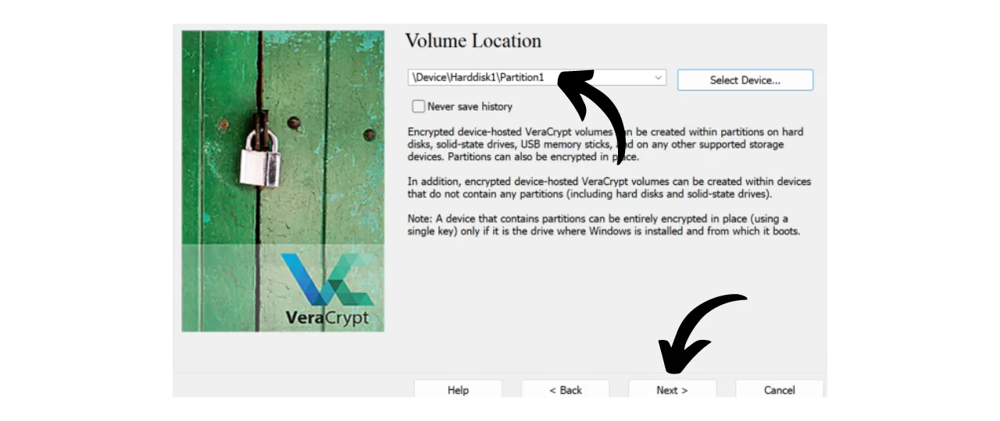
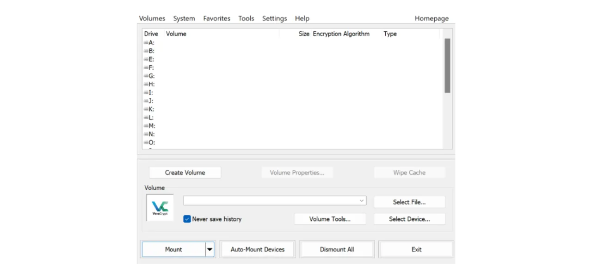
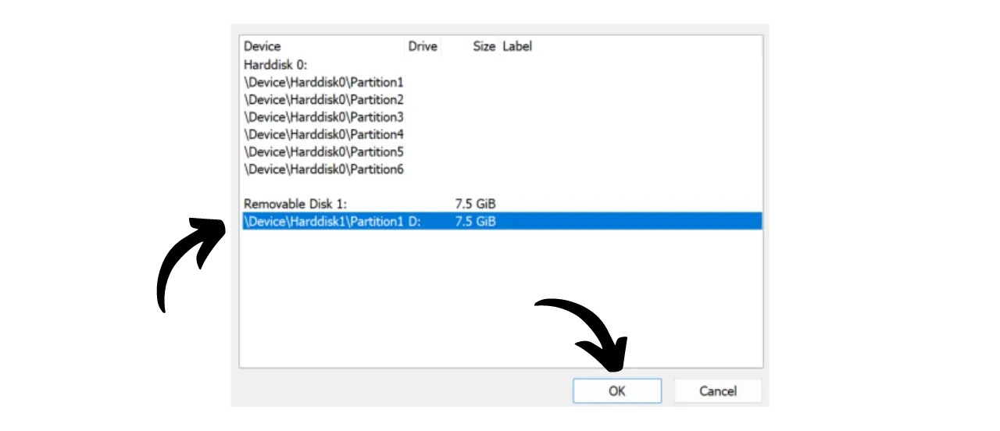
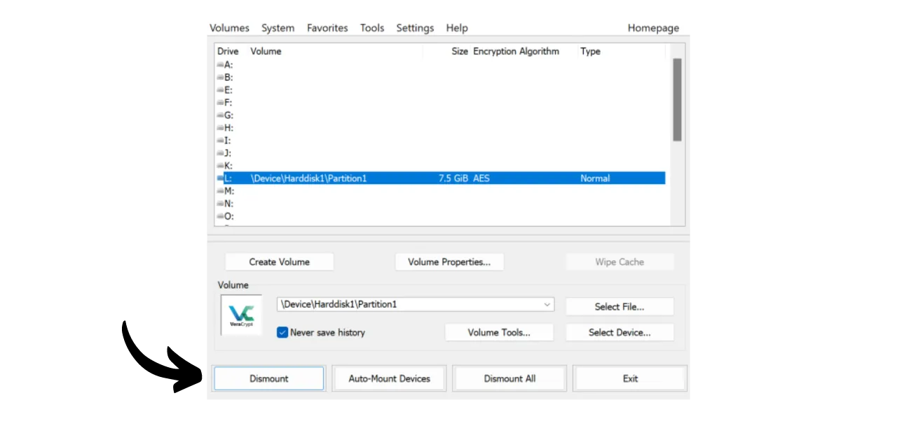

Ngày nay, việc triển khai một chiến lược để đảm bảo khả năng truy cập, bảo mật và sao lưu các tệp của bạn, như tài liệu cá nhân, ảnh hoặc các dự án quan trọng, là rất quan trọng. Việc mất mát những dữ liệu này có thể gây ra hậu quả thảm khốc.

Để ngăn chặn những vấn đề này, tôi khuyên bạn nên duy trì nhiều bản sao lưu của các tệp trên các phương tiện khác nhau. Một chiến lược thường được sử dụng trong lĩnh vực máy tính là chiến lược sao lưu "3-2-1", giúp bảo vệ các tệp của bạn:
- **3** bản sao của các tệp của bạn;
- Được lưu trữ trên ít nhất **2** loại phương tiện khác nhau;
- Với ít nhất **1** bản sao được giữ ở nơi khác.

Nói cách khác, bạn nên lưu trữ các tệp của mình ở 3 địa điểm khác nhau, sử dụng các phương tiện có bản chất khác nhau, như máy tính của bạn, ổ cứng ngoài, USB, hoặc dịch vụ lưu trữ trực tuyến. Và cuối cùng, việc có một bản sao ở nơi khác nghĩa là bạn nên có một bản sao lưu được lưu trữ ngoài nhà hoặc doanh nghiệp của mình. Điểm này giúp tránh mất mát toàn bộ các tệp trong trường hợp xảy ra thảm họa địa phương như hỏa hoạn hoặc lũ lụt. Một bản sao ngoại vi, cách xa nhà hoặc doanh nghiệp của bạn, đảm bảo rằng dữ liệu của bạn sẽ tồn tại độc lập với các rủi ro địa phương.

Để dễ dàng triển khai chiến lược sao lưu 3-2-1 này, bạn có thể chọn một giải pháp lưu trữ trực tuyến, bằng cách đồng bộ hóa tự động hoặc định kỳ các tệp từ máy tính của bạn với những tệp trong đám mây của bạn. Trong số các giải pháp sao lưu trực tuyến này, rõ ràng có những giải pháp từ các công ty kỹ thuật số lớn bạn biết: Google Drive, Microsoft OneDrive, hoặc Apple iCloud. Tuy nhiên, đây không phải là những giải pháp tốt nhất để bảo vệ quyền riêng tư của bạn. Trong một hướng dẫn trước đây, tôi đã giới thiệu cho bạn một lựa chọn thay thế mã hóa tài liệu của bạn để bảo mật tốt hơn: Proton Drive.

https://planb.network/tutorials/computer-security/data/proton-drive-03cbe49f-6ddc-491f-8786-bc20d98ebb16

Bằng cách áp dụng chiến lược sao lưu cục bộ và đám mây này, bạn đã được hưởng lợi từ hai loại phương tiện khác nhau cho dữ liệu của mình, một trong số đó là ở nơi khác. Để hoàn thành chiến lược 3-2-1, bạn chỉ cần thêm một bản sao nữa. Điều tôi khuyên bạn làm là đơn giản chỉ cần xuất kỳ dữ liệu hiện có cục bộ và trên đám mây của bạn sang một phương tiện vật lý, như một USB hoặc ổ cứng ngoài. Theo cách này, ngay cả khi máy chủ của giải pháp lưu trữ trực tuyến của bạn bị phá hủy và máy tính của bạn hỏng cùng một lúc, bạn vẫn có bản sao thứ ba này trên một phương tiện ngoại vi để không mất dữ liệu.

Nhưng cũng quan trọng là phải suy nghĩ về việc bảo mật lưu trữ dữ liệu của bạn để đảm bảo rằng không ai ngoài bạn hoặc người thân của bạn có thể truy cập vào nó. Dữ liệu cục bộ và trực tuyến thường được bảo mật. Trên máy tính của bạn, có lẽ bạn đã thiết lập một mật khẩu, và ổ cứng của các máy tính hiện đại thường được mã hóa mặc định. Đối với lưu trữ trực tuyến (đám mây) của bạn, tôi đã chỉ cho bạn trong hướng dẫn trước cách bảo vệ tài khoản của bạn với một mật khẩu mạnh và xác thực hai yếu tố. Tuy nhiên, đối với bản sao thứ ba của bạn được lưu trữ trên một phương tiện vật lý, sự bảo mật duy nhất là việc sở hữu vật lý của nó. Nếu một kẻ trộm quản lý để ăn cắp USB hoặc ổ cứng ngoài của bạn, họ có thể dễ dàng truy cập vào tất cả dữ liệu của bạn.

Để ngăn chặn rủi ro này, việc mã hóa phương tiện vật lý của bạn là điều khuyến khích. Như vậy, bất kỳ nỗ lực nào để truy cập dữ liệu sẽ yêu cầu nhập một mật khẩu để giải mã nội dung. Không có mật khẩu này, sẽ không thể truy cập vào dữ liệu, bảo vệ các tệp cá nhân của bạn ngay cả trong trường hợp bị mất cắp USB hoặc ổ cứng ngoài của bạn.

Trong hướng dẫn này, tôi sẽ chỉ cho bạn cách mã hóa một thiết bị lưu trữ ngoại vi một cách dễ dàng sử dụng VeraCrypt, một công cụ mã nguồn mở.
## Giới thiệu về VeraCrypt

VeraCrypt là phần mềm mã nguồn mở có sẵn trên Windows, macOS và Linux, cho phép bạn mã hóa dữ liệu của mình theo nhiều cách khác nhau và trên các phương tiện khác nhau.

Phần mềm này cho phép tạo và bảo trì các khối lượng được mã hóa ngay lập tức, nghĩa là dữ liệu của bạn được tự động mã hóa trước khi được lưu và được giải mã trước khi được đọc. Phương pháp này đảm bảo rằng các tệp của bạn vẫn được bảo vệ ngay cả trong trường hợp thiết bị lưu trữ của bạn bị đánh cắp. VeraCrypt không chỉ mã hóa các tệp mà còn mã hóa tên tệp, metadata, thư mục và thậm chí là không gian trống trên thiết bị lưu trữ của bạn.

VeraCrypt có thể được sử dụng để mã hóa các tệp cục bộ hoặc toàn bộ phân vùng, bao gồm cả đĩa hệ thống. Nó cũng có thể được sử dụng để mã hóa hoàn toàn một thiết bị ngoại vi như một ổ USB hoặc một đĩa như chúng ta sẽ thấy trong hướng dẫn này.

Một lợi thế lớn của VeraCrypt so với các giải pháp sở hữu là nó hoàn toàn mã nguồn mở, nghĩa là mã của nó có thể được xác minh bởi bất kỳ ai.

## Cách cài đặt VeraCrypt?

Truy cập [trang web chính thức của VeraCrypt](https://www.veracrypt.fr/en/Downloads.html) trong tab "*Downloads*".

Tải xuống phiên bản phù hợp với hệ điều hành của bạn. Nếu bạn sử dụng Windows, chọn "*EXE Installer*".

Chọn ngôn ngữ cho giao diện của bạn.

Chấp nhận các điều khoản của giấy phép.

Chọn "*Install*".

Cuối cùng, chọn thư mục nơi phần mềm sẽ được cài đặt, sau đó nhấn vào nút "*Install*".

Chờ đợi quá trình cài đặt hoàn tất.

Việc cài đặt đã hoàn thành.

Nếu bạn muốn, bạn có thể quyên góp bằng bitcoin để hỗ trợ sự phát triển của công cụ mã nguồn mở này.

## Cách mã hóa một thiết bị lưu trữ với VeraCrypt?

Khi khởi chạy lần đầu, bạn sẽ đến giao diện này:

Để mã hóa thiết bị lưu trữ mà bạn chọn, bắt đầu bằng cách kết nối nó với máy tính của bạn. Như bạn sẽ thấy sau, quá trình tạo một khối lượng mã hóa mới trên một ổ USB hoặc một ổ cứng sẽ mất nhiều thời gian hơn nếu thiết bị đã chứa dữ liệu mà bạn không muốn xóa. Do đó, tôi khuyên bạn nên sử dụng một ổ USB trống hoặc làm trống thiết bị trước khi tạo khối lượng mã hóa, để tiết kiệm thời gian.

Trên VeraCrypt, nhấn vào tab "*Volumes*".

Sau đó vào menu "*Create New Volume...*".

Trong cửa sổ mới mở ra, chọn tùy chọn "*Encrypt a non-system partition/drive*" và nhấn vào "*Next*".

Sau đó, bạn sẽ phải lựa chọn giữa "*Standard VeraCrypt volume*" và "*Hidden VeraCrypt Volume*". Lựa chọn đầu tiên tạo một khối lượng mã hóa tiêu chuẩn trên thiết bị của bạn. Lựa chọn "*Hidden VeraCrypt Volume*" cho phép tạo một khối lượng ẩn bên trong một khối lượng VeraCrypt tiêu chuẩn. Phương pháp này cho phép bạn phủ nhận sự tồn tại của khối lượng ẩn này trong trường hợp bị ép buộc. Ví dụ, nếu ai đó vật lý ép bạn giải mã thiết bị của mình, bạn chỉ cần giải mã phần tiêu chuẩn để thỏa mãn kẻ tấn công mà không tiết lộ phần ẩn. Trong ví dụ của tôi, tôi sẽ chọn một khối lượng tiêu chuẩn. 
Trên trang tiếp theo, nhấp vào nút "*Select Device...*".

Một cửa sổ mới mở ra nơi bạn có thể chọn phân vùng của thiết bị lưu trữ từ danh sách các ổ đĩa có sẵn trên máy của bạn. Thông thường, phân vùng bạn muốn mã hóa sẽ được liệt kê dưới dòng có tiêu đề "*Removable Disk N*". Sau khi chọn phân vùng phù hợp, nhấp vào nút "*OK*".

Hỗ trợ đã chọn xuất hiện trong ô. Bạn giờ có thể nhấp vào nút "*Next*". 
Tiếp theo, bạn sẽ cần chọn giữa các tùy chọn "*Create encrypted volume and format it*" hoặc "*Encrypt partition in place*". Như đã đề cập trước đó, lựa chọn đầu tiên sẽ xóa vĩnh viễn tất cả dữ liệu trên USB hoặc ổ cứng của bạn. Chỉ chọn tùy chọn này nếu thiết bị của bạn trống; nếu không, bạn sẽ mất tất cả dữ liệu mà nó chứa. Nếu bạn muốn giữ dữ liệu hiện có, bạn có thể tạm thời chuyển chúng sang nơi khác, chọn "*Create encrypted volume and format it*" cho quá trình nhanh hơn mà xóa sạch mọi thứ, hoặc chọn "*Encrypt partition in place*". Tùy chọn cuối cùng này cho phép mã hóa khối lượng mà không xóa dữ liệu đã có, nhưng quá trình sẽ mất nhiều thời gian hơn. Trong ví dụ này, vì USB của tôi trống, tôi chọn "*Create encrypted volume and format it*", tùy chọn xóa sạch mọi thứ.

Tiếp theo, bạn sẽ có tùy chọn chọn thuật toán mã hóa và hàm băm. Trừ khi bạn có nhu cầu cụ thể, tôi khuyên bạn nên giữ các tùy chọn mặc định. Nhấp vào "*Next*" để tiếp tục.

Đảm bảo kích thước chỉ định cho khối lượng của bạn là chính xác, để mã hóa toàn bộ không gian có sẵn trên USB, chứ không chỉ một phần. Sau khi xác minh, nhấp vào "*Next*".

Tại giai đoạn này, bạn sẽ cần thiết lập một mật khẩu để mã hóa và giải mã thiết bị của mình. Việc chọn một mật khẩu mạnh là quan trọng để ngăn chặn kẻ tấn công giải mã nội dung của bạn bằng cách tấn công brute force. Mật khẩu nên ngẫu nhiên, càng dài càng tốt, và bao gồm nhiều loại ký tự. Tôi khuyên bạn nên chọn một mật khẩu ngẫu nhiên ít nhất 20 ký tự bao gồm chữ cái thường, chữ cái in hoa, số và ký hiệu.

Tôi cũng khuyên bạn nên lưu mật khẩu của mình trong một trình quản lý mật khẩu. Điều này giúp dễ dàng truy cập và loại bỏ nguy cơ quên mật khẩu. Trong trường hợp cụ thể của chúng ta, một trình quản lý mật khẩu được ưa chuộng hơn là phương tiện giấy. Thực tế, trong trường hợp bị đột nhập, mặc dù thiết bị lưu trữ của bạn có thể bị đánh cắp, nhưng mật khẩu trong trình quản lý không thể bị kẻ tấn công tìm thấy, điều này sẽ ngăn chặn việc truy cập vào dữ liệu. Ngược lại, nếu trình quản lý mật khẩu của bạn bị xâm phạm, vẫn cần truy cập vật lý vào thiết bị để khai thác mật khẩu và truy cập dữ liệu.

Để biết thêm thông tin về quản lý mật khẩu, tôi khuyên bạn nên khám phá hướng dẫn hoàn chỉnh khác này:
Nhập mật khẩu của bạn vào 2 trường được chỉ định, sau đó nhấp vào "*Tiếp theo*". 
VeraCrypt sau đó sẽ hỏi bạn liệu bạn có kế hoạch lưu trữ các tệp lớn hơn 4 GiB trong tập tin được mã hóa hay không. Câu hỏi này cho phép phần mềm chọn hệ thống tệp phù hợp nhất. Thông thường, hệ thống FAT được sử dụng vì nó tương thích với đa số hệ điều hành, nhưng nó đặt ra giới hạn kích thước tệp tối đa là 4 GiB. Nếu bạn cần quản lý các tệp lớn hơn, bạn có thể chọn hệ thống exFAT.

Tiếp theo, bạn sẽ đến trang cho phép bạn tạo một khóa ngẫu nhiên. Khóa này rất quan trọng, vì nó sẽ được sử dụng để mã hóa và giải mã dữ liệu của bạn. Nó sẽ được lưu trữ trong một phần cụ thể của phương tiện lưu trữ của bạn, bản thân nó được bảo vệ bởi mật khẩu bạn đã thiết lập trước đó. Để tạo một khóa mã hóa mạnh mẽ, VeraCrypt cần entropy. Đó là lý do tại sao phần mềm yêu cầu bạn di chuyển chuột một cách ngẫu nhiên trên cửa sổ; những chuyển động này sau đó được sử dụng để tạo ra khóa. Tiếp tục di chuyển chuột cho đến khi thanh đo lường entropy được lấp đầy hoàn toàn. Sau đó, nhấp vào "*Định dạng*" để bắt đầu tạo tập tin được mã hóa.

Chờ trong khi việc định dạng được thực hiện. Điều này có thể mất một thời gian dài cho các tập tin lớn.

Sau đó, bạn sẽ nhận được một xác nhận.

## Làm thế nào để sử dụng một ổ đĩa được mã hóa với VeraCrypt?

Bây giờ, phương tiện lưu trữ của bạn đã được mã hóa và do đó bạn không thể mở nó. Để giải mã, hãy truy cập VeraCrypt.

Chọn một chữ cái ổ đĩa từ danh sách. Ví dụ, tôi chọn "*L:*".

Nhấp vào nút "*Chọn Thiết Bị...*".

Từ danh sách tất cả các ổ đĩa trên máy của bạn, chọn tập tin được mã hóa trên phương tiện lưu trữ của bạn, sau đó nhấp vào nút "*OK*".

Bạn có thể thấy rằng tập tin của bạn đã được chọn đúng.

Nhấp vào nút "*Mount*".

Nhập mật khẩu đã chọn trong quá trình tạo tập tin, sau đó nhấp vào "*OK*".

Bạn có thể thấy rằng tập tin của bạn bây giờ đã được giải mã và có thể truy cập trên ổ đĩa chữ "*L:*".

Để truy cập vào đó, mở trình quản lý tệp của bạn và đi đến ổ đĩa "*L:*" (hoặc một chữ cái khác tùy thuộc vào chữ bạn đã chọn trong các bước trước). 
Sau khi thêm các tệp cá nhân của bạn vào phương tiện lưu trữ, để mã hóa lại tập tin, chỉ cần nhấp vào nút "*Dismount*".

Tập tin của bạn không còn xuất hiện dưới chữ "*L:*" nữa. Nó do đó đã được mã hóa lại.

Bây giờ bạn có thể gỡ bỏ phương tiện lưu trữ của mình.

Xin chúc mừng, bạn giờ đây đã có một phương tiện được mã hóa để lưu trữ dữ liệu cá nhân của mình một cách an toàn, như vậy bạn đã có một chiến lược hoàn chỉnh 3-2-1 bổ sung cho bản sao trên máy tính và giải pháp lưu trữ trực tuyến của bạn.
Nếu bạn muốn hỗ trợ sự phát triển của VeraCrypt, bạn cũng có thể thực hiện quyên góp bằng bitcoins [trên trang này](https://www.veracrypt.fr/en/Donation.html).