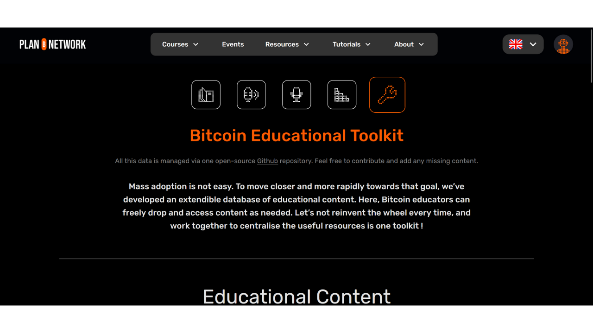
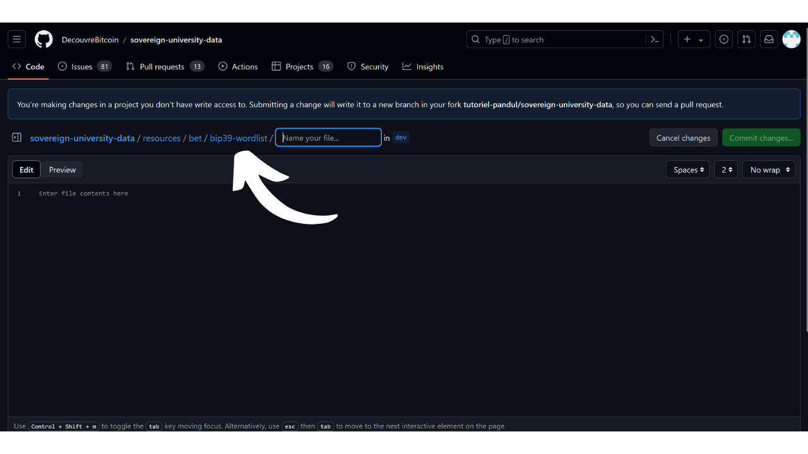
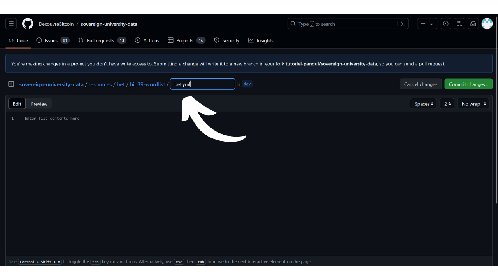

Mise PlanB je poskytovat přední vzdělávací zdroje o Bitcoinu v co nejvíce jazycích. Veškerý obsah publikovaný na webu je open-source a hostovaný na GitHubu, což umožňuje každému podílet se na obohacování platformy.

Kromě tutoriálů a školení nabízí PlanB Network také rozsáhlou knihovnu různorodého vzdělávacího obsahu o Bitcoinu, přístupného všem, [v sekci "BET" (_Bitcoin Educational Toolkit_) ](https://planb.network/resources/bet). Tato databáze zahrnuje vzdělávací plakáty, memy, humorné propagační plakáty, technické diagramy, loga a další nástroje pro uživatele. Cílem této iniciativy je podporovat jednotlivce a komunity vyučující o Bitcoinu po celém světě tím, že jim poskytne potřebné vizuální zdroje.

Chcete se podílet na obohacování této databáze, ale nevíte jak? Tento tutoriál je pro vás!

*Je nezbytné, aby veškerý obsah začleněný na web byl bez autorských práv nebo respektoval licenci zdrojového souboru. Také všechny vizuály publikované na PlanB Network jsou k dispozici pod licencí [CC-BY-SA](https://creativecommons.org/licenses/by-sa/4.0/).*

- Nejprve potřebujete mít účet na GitHubu. Pokud nevíte, jak vytvořit účet, připravili jsme podrobný tutoriál, který vás provede.

https://planb.network/tutorials/contribution/others/create-github-account-a75fc39d-f0d0-44dc-9cd5-cd94aee0c07c


- Přejděte na [GitHubový repozitář PlanB věnovaný datům](https://github.com/PlanB-Network/bitcoin-educational-content/tree/dev/resources/bet) v sekci `resources/bet/`:

- Klikněte vpravo nahoře na tlačítko `Add file`, poté na `Create new file`:

- Pokud jste předtím nikdy nepřispívali k obsahu PlanB Network, budete muset vytvořit svůj fork původního repozitáře. Forknutí repozitáře znamená vytvoření kopie tohoto repozitáře na vašem vlastním účtu GitHub, což vám umožní pracovat na projektu bez ovlivnění původního repozitáře. Klikněte na tlačítko `Fork this repository`:

- Poté se dostanete na stránku GitHubu pro úpravy:

- Vytvořte složku pro váš obsah. Chcete-li to provést, do pole `Name your file...` napište název vašeho obsahu malými písmeny s pomlčkami místo mezer. V mém příkladu, řekněme, že chci přidat PDF vizuál seznamu 2048 slov BIP39. Takže pojmenuji mou složku `bip39-wordlist`: 
- Pro potvrzení vytvoření složky jednoduše přidejte lomítko za název ve stejném poli, například: `bip39-wordlist/`. Přidání lomítka automaticky vytvoří složku místo souboru:

- V této složce vytvoříte první YAML soubor pojmenovaný `bet.yml`:

- Vyplňte tento soubor informacemi týkajícími se vašeho obsahu pomocí této šablony:

```yaml
builder: 
type: 
links:
  download: 
  view: 
    - en: 
tags:
  - 
  - 
contributors:
  - 
```
- **`builder`**: Uveďte identifikátor vaší organizace na síti PlanB Network. Pokud ještě nemáte pro vaši společnost identifikátor "builder", můžete si jej vytvořit podle tohoto návodu.

https://planb.network/tutorials/contribution/resource/add-builder-b5834c46-6dcc-4064-8d68-1ef529991d3d

 Pokud žádný nemáte, můžete jednoduše použít své jméno, pseudonym nebo název vaší společnosti, aniž byste vytvořili profil builder.
- **`type`**: Vyberte povahu vašeho obsahu z následujících dvou možností:
	- `Educational Content` pro vzdělávací obsahy.
	- `Visual Content` pro ostatní typy různorodého obsahu.

- **`links`**: Poskytněte odkazy na své obsahy. Máte dvě možnosti:
	- Pokud se rozhodnete hostovat svůj obsah přímo na GitHubu PlanB, budete muset přidat odkazy na tento soubor v následujících krocích.
	- Pokud jsou vaše obsahy hostovány jinde, například na vašem osobním webu, uveďte zde příslušné odkazy:
	    - `download`: Odkaz ke stažení vašeho obsahu.
	    - `view`: Odkaz pro zobrazení vašeho obsahu (může být stejný jako odkaz ke stažení). Pokud je váš obsah dostupný v několika jazycích, přidejte odkaz pro každý jazyk.

- **`tags`**: Přidejte dva tagy spojené s vaším obsahem. Příklady:
	- bitcoin
	- technologie
	- ekonomie
	- vzdělávání
	- meme...

- **`contributors`**: Uveďte svůj identifikátor přispěvatele, pokud jeden máte.

Například váš YAML soubor by mohl vypadat takto:

```yaml
builder: PlanB-Network
type: Educational Content
links:
  download: https://workspace.planb.network/s/fojeJa7ZbftQTwo
  view:
- V mém příkladu nechám odkazy zatím prázdné, protože svůj PDF soubor přidám přímo na GitHub:

- Jakmile dokončíte úpravy tohoto souboru, uložte je kliknutím na tlačítko `Commit changes...`:

- Přidejte název pro vaše úpravy, stejně jako krátký popis:

- Klikněte na zelené tlačítko `Propose changes`:

- Poté se dostanete na stránku, která shrnuje všechny vaše změny:

- Klikněte na obrázek vašeho profilu GitHub v pravém horním rohu, poté na `Your Repositories`:

- Vyberte váš fork repozitáře PlanB Network:

- Na vrchu okna byste měli vidět oznámení s vaší novou větví. Pravděpodobně se jmenuje `patch-1`. Klikněte na ni:

- Nyní jste ve vaší pracovní větvi (**ujistěte se, že jste ve stejné větvi jako vaše předchozí úpravy, to je důležité!**):

- Vraťte se do složky `resources/bet/` a vyberte složku vašeho obsahu, kterou jste právě vytvořili v předchozím commitu:

- Ve složce vašeho obsahu klikněte na tlačítko `Add file`, poté na `Create new file`:

- Tuto novou složku pojmenujte `assets` a potvrďte její vytvoření umístěním lomítka `/` na konci:

- V této složce `assets` vytvořte soubor pojmenovaný `.gitkeep`: 
- Klikněte na tlačítko `Commit changes...`: - Ponechte název commitu ve výchozím nastavení a ujistěte se, že je zaškrtnuto políčko `Commit directly to the patch-1 branch`, poté klikněte na `Commit changes`: 
- Vraťte se do složky `assets`: 
- Klikněte na tlačítko `Add file`, poté na `Upload files`: 
- Otevře se nová stránka. Přetáhněte miniaturu, která reprezentuje váš obsah, do oblasti. Tento obrázek bude zobrazen na webu PlanB Network: 
- Může to být náhled, logo nebo ikona: 
- Jakmile je obrázek nahrán, ujistěte se, že je zaškrtnuto políčko `Commit directly to the patch-1 branch`, poté klikněte na `Commit changes`: 
- Buďte opatrní, váš obrázek musí být pojmenován `logo` a musí být ve formátu `.webp`. Celý název souboru by tedy měl být: `logo.webp`: 
- Vraťte se do vaší složky `assets` a klikněte na mezi soubor `.gitkeep`: 
- Jakmile jste na souboru, klikněte na tři malé tečky v pravém horním rohu a poté na `Delete file`: 
- Ujistěte se, že jste stále na stejné pracovní větvi, poté klikněte na tlačítko `Commit changes`: 
- Přidejte název a popis k vašemu commitu, poté klikněte na `Commit changes`: 
- Vraťte se do složky vašeho obsahu: 
- Klikněte na tlačítko `Add file`, poté na `Create new file`: 
- Vytvořte nový YAML soubor pojmenováním ho indikátorem vašeho mateřského jazyka. Tento soubor bude použit pro popis obsahu. Například, pokud chci napsat můj popis v angličtině, pojmenuji tento soubor `en.yml`: 
- Vyplňte tento YAML soubor použitím této šablony:

```yaml
name: 
description: |
  
```

- Pro klíč `name` můžete přidat název vašeho obsahu;
- Pro klíč `description` stačí přidat krátký odstavec, který popisuje váš obsah. Popis musí být ve stejném jazyce jako název souboru. Není nutné překládat tento popis do všech podporovaných jazyků na webu, jelikož to udělají týmy PlanB pomocí jejich modelu.
Například, zde je, jak by váš soubor mohl vypadat:

```yaml
name: BIP39 WORDLIST
description: |
  Kompletní a číslovaný seznam 2048 anglických slov z BIP39 slovníku používaného pro kódování mnemonických frází. Dokument lze vytisknout na jedné stránce.
```


- Klikněte na tlačítko `Commit changes...`:

- Ujistěte se, že je zaškrtnuto políčko `Commit directly to the patch-1 branch`, přidejte název, poté klikněte na `Commit changes`:

- Složka vašeho obsahu by nyní měla vypadat takto:

*Pokud nechcete přidávat obsah na GitHub a již jste si v předchozích krocích zaznamenali odkazy v souboru `bet.yml`, můžete tuto sekci přeskočit a přejít přímo na část týkající se vytvoření Pull Requestu.*
- Vraťte se do složky `/assets`:

- Klikněte na tlačítko `Add file` a poté na `Upload files`:

- Otevře se nová stránka. Přetáhněte do oblasti obsah, který chcete sdílet:

- Například jsem přidal PDF soubor seznamu BIP39:

- Jakmile je obsah nahrán, ujistěte se, že je zaškrtnuto políčko `Commit directly to the patch-1 branch`, a poté klikněte na `Commit changes`:

- Vraťte se do vaší složky `/assets` a klikněte na soubor, který jste právě nahráli:

- Získejte mezičlánek URL vašeho souboru. Například v mém případě je URL:

```url
https://github.com/tutorial-pandul/bitcoin-educational-content/blob/patch-1/resources/bet/bip39-wordlist/assets/BIP39-WORDLIST.pdf
```

- Ponechte pouze poslední část URL od `/resources` dále:

```url
/resources/bet/bip39-wordlist/assets/BIP39-WORDLIST.pdf
```

- K základu URL přidejte následující informace, abyste měli správný odkaz:

```url
https://github.com/DiscoverBitcoin/bitcoin-educational-content/blob/dev/resources/bet/bip39-wordlist/assets/BIP39-WORDLIST.pdf
```

To, co zde děláme, je předvídání budoucího odkazu na váš soubor, jakmile bude váš návrh sloučen do zdrojového repozitáře sítě PlanB.
- Vraťte se do vašeho souboru `bet.yml` a klikněte na ikonu tužky: 
- Tam přidejte váš odkaz:

- Jakmile jsou vaše změny dokončeny, klikněte na tlačítko `Commit changes...`:

- Přidejte název pro vaše změny, stejně jako krátký popis:

- Klikněte na zelené tlačítko `Commit changes`:


---

- Pokud je pro vás vše v pořádku, vraťte se do kořenové složky vašeho forku:

- Měli byste vidět zprávu, která oznamuje, že vaše větev byla upravena. Klikněte na tlačítko `Compare & pull request`:

- Přidejte jasný název a popis pro váš PR:

- Klikněte na tlačítko `Create pull request`:

Gratulujeme! Váš PR byl úspěšně vytvořen. Administrátor jej nyní zkontroluje a pokud je vše v pořádku, sloučí ho do hlavního repozitáře sítě PlanB. Váš BET by se na webu měl objevit o několik dní později.

Nezapomeňte sledovat průběh vašeho PR. Administrátor vám může zanechat komentář s žádostí o dodatečné informace. Dokud váš PR není validován, můžete ho konzultovat na kartě Pull requests v GitHub repozitáři sítě PlanB:

Moc vám děkujeme za váš cenný příspěvek! :)
