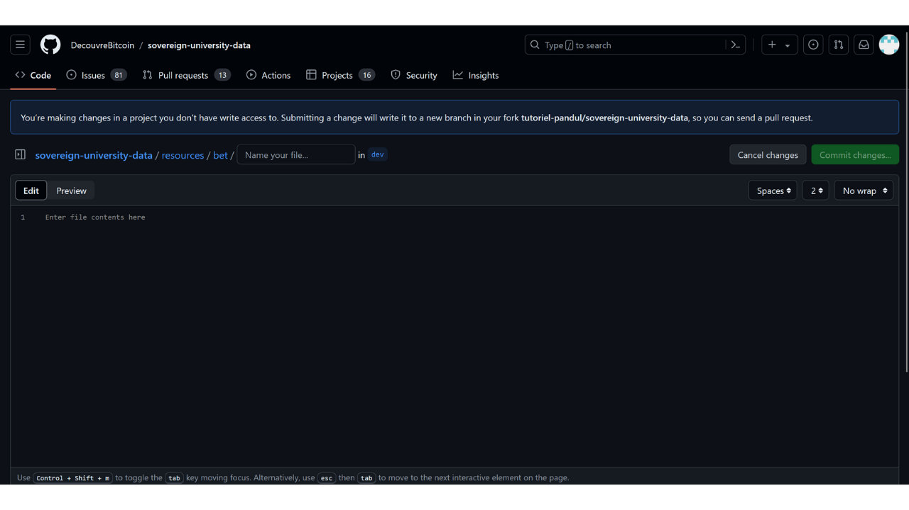
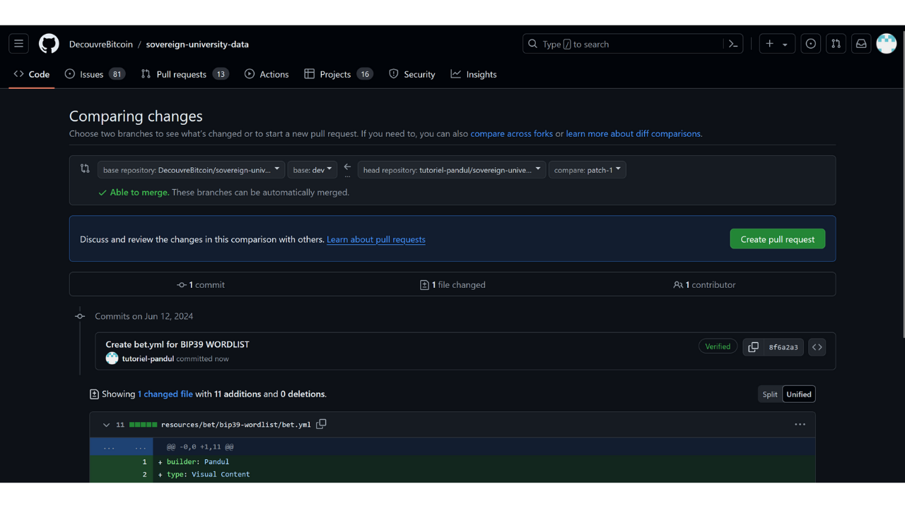

PlanB missiooniks on pakkuda juhtivaid haridusressursse Bitcoin'i kohta võimalikult paljudes keeltes. Kõik saidil avaldatud sisu on avatud lähtekoodiga ja majutatud GitHub'is, mis võimaldab kõigil platvormi rikastamises osaleda.

Lisaks õpetustele ja koolitustele pakub PlanB võrgustik ka laia valikut erinevat hariduslikku sisu Bitcoin'i kohta, mis on kõigile kättesaadav [BET (_Bitcoin Educational Toolkit_) sektsioonis](https://planb.network/resources/bet). See andmebaas sisaldab hariduslikke plakateid, meeme, humoorikaid propagandaplakateid, tehnilisi diagramme, logosid ja muid tööriistu kasutajatele. Selle algatuse eesmärk on toetada üksikisikuid ja kogukondi üle maailma Bitcoin'i õpetamisel, pakkudes neile vajalikke visuaalseid ressursse.

Kas soovite osaleda selle andmebaasi rikastamises, kuid ei tea, kuidas? See õpetus on teile!

*On hädavajalik, et kõik saidile integreeritud sisu oleks vaba õigustest või austaks lähtefaili litsentsi. Samuti on kõik PlanB võrgustikus avaldatud visuaalid kättesaadavad [CC-BY-SA](https://creativecommons.org/licenses/by-sa/4.0/) litsentsi alusel.*

- Esiteks, teil peab olema konto GitHub'is. Kui te ei tea, kuidas kontot luua, oleme teinud [üksikasjaliku õpetuse, mis juhendab teid](https://planb.network/tutorials/contribution/others/create-github-account-a75fc39d-f0d0-44dc-9cd5-cd94aee0c07c).
- Minge [PlanB-le pühendatud GitHubi repositooriumisse andmete jaoks](https://github.com/PlanB-Network/bitcoin-educational-content/tree/dev/resources/bet) `resources/bet/` sektsioonis:

- Klõpsake paremal üleval nupul `Add file`, seejärel `Create new file`:

- Kui te pole varem PlanB võrgustiku sisule kaasa aidanud, peate looma oma haru (fork) originaalrepositooriumist. Repositooriumi haru loomine tähendab selle repositooriumi koopia loomist oma GitHubi kontole, mis võimaldab teil projekti kallal töötada ilma originaalrepositooriumit mõjutamata. Klõpsake nupul `Fork this repository`:

- Seejärel jõuate GitHubi redigeerimislehele:

- Looge oma sisu jaoks kaust. Selleks kirjutage `Name your file...` kasti oma sisu nimi väiketähtedega ja tühikute asemel sidekriipsudega. Minu näites, kui soovin lisada PDF-visuaali 2048-sõnalise BIP39 nimekirjaga, nimetan oma kausta `bip39-wordlist`: 
- Kausta loomise kinnitamiseks lisage lihtsalt nimele samas kastis kaldkriips, näiteks: `bip39-wordlist/`. Kaldkriipsu lisamine loob automaatselt kausta, mitte faili:

- Selles kaustas loote esimese YAML-faili nimega `bet.yml`:

- Täitke see fail oma sisuga seotud teabega, kasutades seda malli:

```yaml
builder: 
type: 
links:
  download: 
  view: 
    - et: 
tags:
  - 
  - 
contributors:
  - 
```

Siin on üksikasjad, mida iga välja jaoks täita:
```yaml
builder: Näita oma organisatsiooni identifikaatorit PlanB võrgustikus. Kui teie ettevõttel ei ole veel "builder" identifikaatorit, saate selle luua [selle õpetuse järgi](https://planb.network/tutorials/contribution/resource/add-builder-b5834c46-6dcc-4064-8d68-1ef529991d3d). Kui teil seda veel ei ole, võite lihtsalt kasutada oma nime, pseudonüümi või ettevõtte nime ilma builder profiili loomata.
type: Valige oma sisu tüüp järgmiste kahe võimaluse hulgast:
	- `Educational Content` haridusliku sisu jaoks.
	- `Visual Content` muud tüüpi mitmekesise sisu jaoks.

links: Esitage oma sisu lingid. Teil on kaks võimalust:
	- Kui otsustate oma sisu otse PlanB GitHub'is majutada, peate järgnevate sammude käigus lisama lingid sellesse faili.
	- Kui teie sisu on majutatud mujal, nagu teie isiklikul veebilehel, märkige vastavad lingid siin:
	    - `download`: Link oma sisu allalaadimiseks.
	    - `view`: Link oma sisu vaatamiseks (võib olla sama mis allalaadimislink). Kui teie sisu on saadaval mitmes keeles, lisage iga keele jaoks link.

tags: Lisage oma sisuga seotud kaks märksõna. Näited:
	- bitcoin
	- tehnoloogia
	- majandus
	- haridus
	- meme...

contributors: Mainige oma kaastöötaja identifikaatorit, kui teil on üks.

Näiteks võiks teie YAML fail välja näha selline:

```yaml
builder: PlanB-Network
type: Educational Content
links:
  download: https://workspace.planb.network/s/fojeJa7ZbftQTwo
  view:
- Minu näites jätan lingid esialgu tühjaks, kuna lisan oma PDF-i otse GitHub'ile:

- Kui olete selle faili muudatustega valmis, salvestage need, klõpsates nupul `Commit changes...`:

- Lisage oma muudatustele pealkiri ja lühike description:

- Klõpsake rohelisel nupul `Propose changes`:

- Seejärel jõuate lehele, mis võtab kokku kõik teie muudatused:

- Klõpsake üleval paremal oma GitHubi profiilipildil, seejärel `Your Repositories`:

- Valige oma PlanB Networki repositooriumi fork:

- Peaksite akna ülaosas nägema teavitust oma uue haruga. See on tõenäoliselt nimetatud `patch-1`. Klõpsake sellel:

- Nüüd olete oma tööharul (**veenduge, et olete samal harul kui teie eelmised muudatused, see on oluline!**):

- Minge tagasi kausta `resources/bet/` ja valige kaust, mille oma eelmise kohustusega just lõite:

- Oma sisu kaustas klõpsake nupul `Add file`, seejärel `Create new file`:

- Nimetage see uus kaust `assets` ja kinnitage selle loomine, pannes lõppu kaldkriipsu `/`:

- Selles `assets` kaustas looge fail nimega `.gitkeep`: 
```
- Klõpsake nupul `Commit changes...`: - Jätke commit'i pealkiri vaikimisi seadistusele ja veenduge, et `Commit directly to the patch-1 branch` kast on märgitud, seejärel klõpsake `Commit changes`: 
- Pöörduge tagasi `assets` kausta: 
- Klõpsake nupul `Add file`, seejärel `Upload files`: 
- Avaneb uus leht. Lohistage sisu esindav pisipilt alasse. See pilt kuvatakse PlanB Network saidil: 
- See võib olla eelvaade, logo või ikoon: 
- Kui pilt on üles laaditud, veenduge, et `Commit directly to the patch-1 branch` kast on märgitud, seejärel klõpsake `Commit changes`: 
- Olge ettevaatlik, teie pilt peab olema nimetatud `logo` ja peab olema `.webp` formaadis. Täielik failinimi peaks seega olema: `logo.webp`: 
- Pöörduge tagasi oma `assets` kausta ja klõpsake vahendajafailil `.gitkeep`: 
- Faili avamisel klõpsake paremas ülanurgas asuvatel kolmel väikesel punktil ja seejärel `Delete file`: 
- Veenduge, et olete endiselt samal tööharul, seejärel klõpsake nupul `Commit changes`: 
- Lisage oma commit'ile pealkiri ja kirjeldus, seejärel klõpsake `Commit changes`: 
- Pöörduge tagasi oma sisu kausta: 
- Klõpsake nupul `Add file`, seejärel `Create new file`: 
- Looge uus YAML fail, nimetades selle oma emakeele indikaatoriga. Seda faili kasutatakse sisu kirjelduse jaoks. Näiteks, kui tahan kirjeldust kirjutada inglise keeles, nimetan selle faili `en.yml`: 
- Täitke see YAML fail kasutades järgnevat malli:

```yaml
name: 
description: |
  
```

- `name` võtme jaoks võite lisada oma sisu nime;
- `description` võtme jaoks peate lihtsalt lisama lühikese lõigu, mis kirjeldab teie sisu. Kirjeldus peab olema sama keeles, mis faili nimi. Te ei pea seda kirjeldust tõlkima kõikidesse saidi toetatud keeltesse, kuna PlanB meeskonnad teevad seda oma mudeli abil.
Näiteks, siin on, kuidas teie fail võib välja näha:

```yaml
name: BIP39 WORDLIST
description: |
  Täielik ja nummerdatud nimekiri 2048 inglise sõnast BIP39 sõnastikust, mida kasutatakse mnemooniliste fraaside kodeerimiseks. Dokumenti saab printida ühele lehele.
```


- Klõpsake nupul `Commit changes...`:

- Veenduge, et `Commit directly to the patch-1 branch` kast on märgitud, lisage pealkiri, seejärel klõpsake `Commit changes`:

- Teie sisu kaust peaks nüüd välja nägema selline:

*Kui eelistate mitte lisada sisu GitHub'ile ja olete juba eelmistes etappides `bet.yml` failis lingid märkinud, võite selle osa vahele jätta ja otse Pull Request'i loomise osa juurde minna.*
- Naaske `/assets` kausta:

- Klõpsake nupul `Add file`, seejärel `Upload files`:

- Avaneb uus leht. Lohistage soovitud sisu alale:

- Näiteks lisasin BIP39 nimekirja PDF-faili:

- Kui sisu on üles laaditud, veenduge, et ruut `Commit directly to the patch-1 branch` oleks märgitud, seejärel klõpsake `Commit changes`:

- Naaske oma `/assets` kausta ja klõpsake just üles laaditud failil:

- Hankige oma faili vaheline URL. Näiteks minu puhul on URL:

```url
https://github.com/tutorial-pandul/bitcoin-educational-content/blob/patch-1/resources/bet/bip39-wordlist/assets/BIP39-WORDLIST.pdf
```

- Jätke URL-ist alles ainult viimane osa alates `/resources`:

```url
/resources/bet/bip39-wordlist/assets/BIP39-WORDLIST.pdf
```

- Lisage URL-i alusele järgmine teave, et saada õige link:

```url
https://github.com/DiscoverBitcoin/bitcoin-educational-content/blob/dev/resources/bet/bip39-wordlist/assets/BIP39-WORDLIST.pdf
```

Mida me siin teeme, on tulevase lingi etteaimamine teie failile, kui teie ettepanek on PlanB Networki allikarepositooriumiga ühendatud.
- Minge tagasi oma `bet.yml` faili ja klõpsake pliiatsi ikoonil: 
- Lisage oma link sinna:

- Kui olete muudatustega valmis, klõpsake nupul `Commit changes...`:

- Lisage oma muudatustele pealkiri ja lühidescription:

- Klõpsake rohelisel nupul `Commit changes`:


---

- Kui kõik tundub teile hea, naaske oma fork'i juurkausta:

- Peaksite nägema teadet, et teie haru on muudetud. Klõpsake nupul `Compare & pull request`:

- Lisage oma PR-ile selge pealkiri ja description:

- Klõpsake nupul `Create pull request`:

Palju õnne! Teie PR on edukalt loodud. Administraator vaatab selle nüüd üle ja kui kõik on korras, ühendab selle PlanB Networki pearepositooriumiga. Teie BET ilmub veebisaidile mõne päeva pärast.

Jälgige kindlasti oma PR-i edenemist. Administraator võib jätta kommentaari, paludes lisateavet. Niikaua kui teie PR ei ole kinnitatud, saate seda vaadata PlanB Networki GitHubi repositooriumi Pull requests vahekaardil:

Suur tänu teie väärtusliku panuse eest! :)
