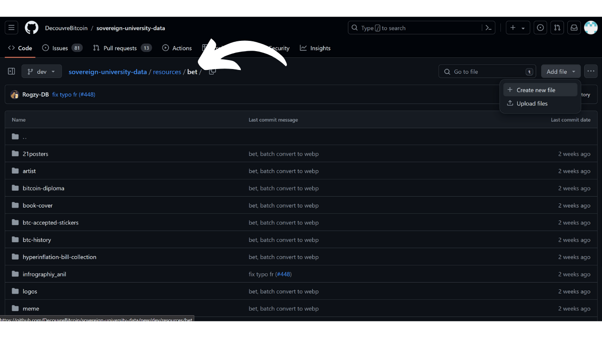
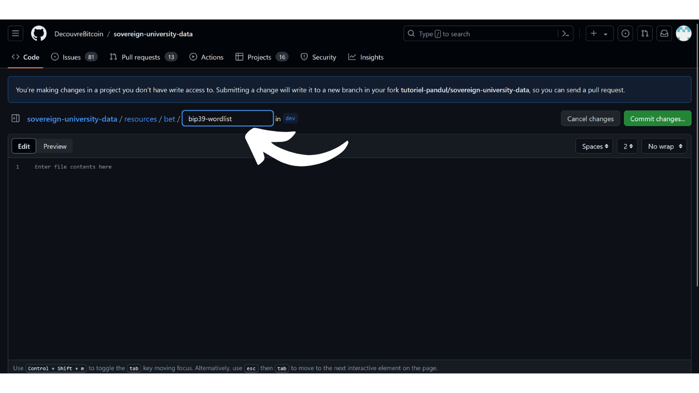

PlanB的使命是提供领先的比特币教育资源，尽可能多的语言。网站上发布的所有内容都是开源的，并托管在GitHub上，这允许任何人参与丰富平台。

除了教程和培训，PlanB网络还提供了一个关于比特币的广泛的多样化教育内容库，所有人都可以访问，在“BET”(_比特币教育工具包_)部分[查看](https://planb.network/resources/bet)。这个数据库包括教育海报、模因、幽默宣传海报、技术图表、标志以及其他用户工具。这项倡议的目标是通过提供必要的视觉资源，支持全世界教授比特币的个人和社区。

如果你想参与丰富这个数据库，但不知道如何做？这个教程是为你准备的！

*所有整合到网站的内容必须是免版权的，或者尊重源文件的许可。此外，PlanB网络上发布的所有视觉内容都在[CC-BY-SA](https://creativecommons.org/licenses/by-sa/4.0/)许可下提供。*

- 首先，你需要在GitHub上有一个账户。如果你不知道如何创建账户，我们制作了[一个详细的教程来指导你](https://planb.network/tutorials/contribution/others/create-github-account-a75fc39d-f0d0-44dc-9cd5-cd94aee0c07c)。
- 前往[PlanB专门用于数据的GitHub仓库](https://github.com/PlanB-Network/bitcoin-educational-content/tree/dev/resources/bet)在`resources/bet/`部分：

- 点击右上角的`Add file`按钮，然后点击`Create new file`：

- 如果你之前从未为PlanB网络的内容做出过贡献，你将需要创建你自己的原始仓库的分支。分支一个仓库意味着在你自己的GitHub账户上创建该仓库的一个副本，这允许你在不影响原始仓库的情况下工作。点击`Fork this repository`按钮：

- 然后你将进入GitHub编辑页面：

- 为你的内容创建一个文件夹。为此，在`Name your file...`框中，用短划线代替空格写下你的内容名称。在我的例子中，假设我想添加一个2048词BIP39列表的PDF视觉文件。所以，我将我的文件夹命名为`bip39-wordlist`： 
- 要确认创建文件夹，只需在同一个框中的名称后添加一个斜杠，例如：`bip39-wordlist/`。添加斜杠会自动创建一个文件夹而不是文件：

- 在这个文件夹中，你将创建一个名为`bet.yml`的第一个YAML文件：

- 使用以下模板填写与你的内容相关的信息：

```yaml
builder: 
type: 
links:
  download: 
  view: 
    - en: 
tags:
  - 
  - 
contributors:
  - 
```
- **`builder`**: 指明您的组织在PlanB网络上的标识符。如果您的公司还没有一个“builder”标识符，您可以[按照这个教程创建一个](https://planb.network/tutorials/contribution/resource/add-builder-b5834c46-6dcc-4064-8d68-1ef529991d3d)。如果您没有，您可以简单地使用您的名字、假名或公司名称，而不需要创建builder档案。
- **`type`**: 在以下两个选项中选择您内容的性质：
	- `Educational Content` 用于教育内容。
	- `Visual Content` 用于其他类型的多样化内容。

- **`links`**: 提供您内容的链接。您有两个选项：
	- 如果您选择将内容直接托管在PlanB的GitHub上，您将需要在后续步骤中添加这个文件的链接。
	- 如果您的内容托管在其他地方，如您的个人网站上，请在这里指明相应的链接：
	    - `download`: 下载您内容的链接。
	    - `view`: 查看您内容的链接（可以与下载链接相同）。如果您的内容有多种语言版本，请为每种语言添加一个链接。

- **`tags`**: 添加与您的内容相关的两个标签。例如：
	- 比特币
	- 技术
	- 经济
	- 教育
	- 表情包...

- **`contributors`**: 如果您有贡献者标识符，请提及。

例如，您的YAML文件可能看起来像这样：

```yaml
builder: PlanB-Network
type: Educational Content
links:
  download: https://workspace.planb.network/s/fojeJa7ZbftQTwo
  view:
- 在我的例子中，我现在会留空链接，因为我将直接在GitHub上添加我的PDF：

- 一旦您对这个文件的修改完成，通过点击`Commit changes...`按钮保存它们：

- 为您的修改添加一个标题，以及一个简短的描述：

- 点击绿色的`Propose changes`按钮：

- 然后您将到达一个总结您所有更改的页面：

- 点击右上角的GitHub个人资料图片，然后点击`Your Repositories`：

- 选择您fork的PlanB Network仓库：

- 您应该会在窗口顶部看到一个带有您新分支的通知。它可能被称为`patch-1`。点击它：

- 您现在在您的工作分支上（**确保您在与之前修改相同的分支上，这很重要！**）：

- 返回到`resources/bet/`文件夹，并选择您在上一个提交中刚创建的内容文件夹：

- 在您内容的文件夹中，点击`Add file`按钮，然后点击`Create new file`：

- 将这个新文件夹命名为`assets`并通过在末尾添加斜杠`/`确认其创建：

- 在这个`assets`文件夹中，创建一个名为`.gitkeep`的文件： 
- 点击 `Commit changes...` 按钮：- 保留默认的提交标题，并确保选中了 `Commit directly to the patch-1 branch` 框，然后点击 `Commit changes`：
- 返回到 `assets` 文件夹：
- 点击 `Add file` 按钮，然后点击 `Upload files`：
- 一个新页面将会打开。将代表您内容的缩略图拖放到该区域。这张图片将会在 PlanB 网络站点上显示：
- 它可以是预览图、一个标志或图标：
- 一旦图片上传完毕，确保选中了 `Commit directly to the patch-1 branch` 框，然后点击 `Commit changes`：
- 注意，您的图片必须命名为 `logo` 并且必须是 `.webp` 格式。因此，完整的文件名应该是：`logo.webp`：
- 返回到您的 `assets` 文件夹并点击中间的文件 `.gitkeep`：
- 一旦在文件上，点击右上角的三个小点然后点击 `Delete file`：
- 确保您仍在同一个工作分支上，然后点击 `Commit changes` 按钮：
- 添加一个标题和描述到您的提交，然后点击 `Commit changes`：
- 返回到您内容的文件夹：
- 点击 `Add file` 按钮，然后点击 `Create new file`：
- 通过用您的母语指示符命名来创建一个新的 YAML 文件。这个文件将用于内容描述。例如，如果我想用英语写我的描述，我会将这个文件命名为 `en.yml`：
- 使用此模板填写这个 YAML 文件：

```yaml
name: 
description: |
  
```

- 对于 `name` 键，您可以添加您内容的名称；
- 对于 `description` 键，您只需要添加一个简短的段落来描述您的内容。描述必须与文件名的语言相同。您不需要将此描述翻译成站点支持的所有语言，因为 PlanB 团队将使用他们的模型来做这件事。
例如，您的文件可能看起来像这样：

```yaml
name: BIP39 WORDLIST
description: |
  完整且编号的来自 BIP39 字典的 2048 个英文单词列表，用于编码助记词短语。该文档可以打印在单页上。
```


- 点击 `Commit changes...` 按钮：

- 确保选中了 `Commit directly to the patch-1 branch` 框，添加一个标题，然后点击 `Commit changes`：

- 您的内容文件夹现在应该看起来像这样：

*如果您不希望在GitHub上添加内容，并且在之前的步骤中已经在`bet.yml`文件中记录了链接，您可以跳过此部分，直接前往创建Pull Request的部分。*
- 返回到`/assets`文件夹：

- 点击`Add file`按钮，然后点击`Upload files`：

- 一个新页面将会打开。将您希望分享的内容拖放到该区域：

- 例如，我添加了BIP39列表的PDF文件：

- 一旦内容上传完毕，确保勾选了`Commit directly to the patch-1 branch`框，然后点击`Commit changes`：

- 返回到您的`/assets`文件夹并点击您刚刚上传的文件：

- 检索您文件的中间URL。例如，在我的案例中，URL是：

```url
https://github.com/tutorial-pandul/bitcoin-educational-content/blob/patch-1/resources/bet/bip39-wordlist/assets/BIP39-WORDLIST.pdf
```

- 仅保留URL中从`/resources`开始的最后一部分：

```url
/resources/bet/bip39-wordlist/assets/BIP39-WORDLIST.pdf
```

- 在URL的基础上添加以下信息以获得正确的链接：

```url
https://github.com/DiscoverBitcoin/bitcoin-educational-content/blob/dev/resources/bet/bip39-wordlist/assets/BIP39-WORDLIST.pdf
```

我们在这里所做的是预测一旦您的提案被合并到PlanB Network的源仓库后，您的文件的未来链接。
- 回到您的`bet.yml`文件并点击铅笔图标：
- 在那里添加您的链接：

- 一旦您的更改完成，点击`Commit changes...`按钮：

- 为您的更改添加一个标题以及一个简短的描述：

- 点击绿色的`Commit changes`按钮：


---

- 如果一切看起来都不错，返回到您fork的根目录：

- 您应该会看到一条消息，指示您的分支已被修改。点击`Compare & pull request`按钮：

- 为您的PR添加一个清晰的标题和描述：

- 点击`Create pull request`按钮：

恭喜！您的PR已经成功创建。现在，一位管理员将会审查它，如果一切顺利，将其合并到PlanB Network的主仓库中。您应该会在几天后在网站上看到您的BET。

确保跟踪您PR的进展。管理员可能会留下评论，要求提供额外的信息。只要您的PR未被验证，您就可以在PlanB Network GitHub仓库的Pull requests标签中查看它：

非常感谢您的宝贵贡献！:)
