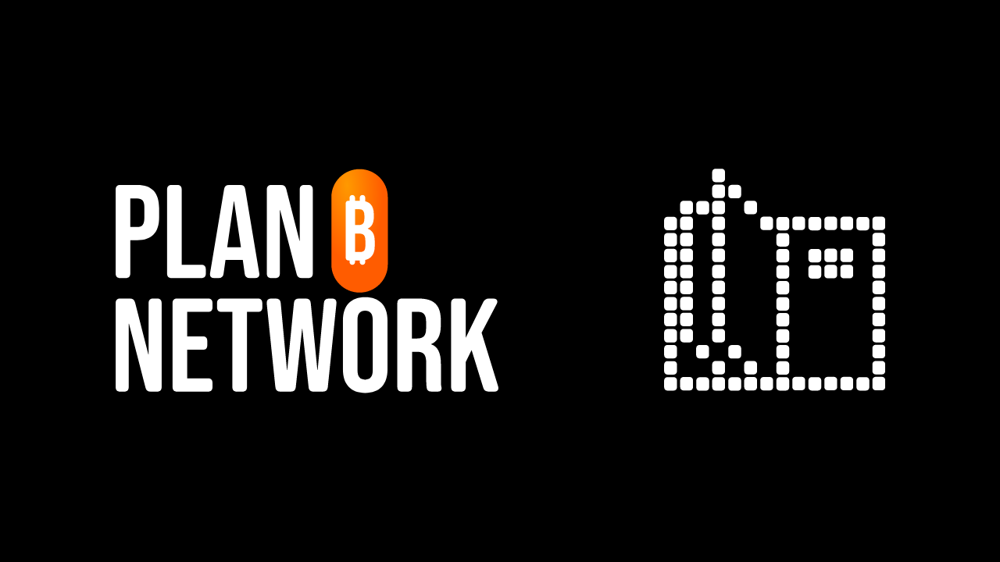
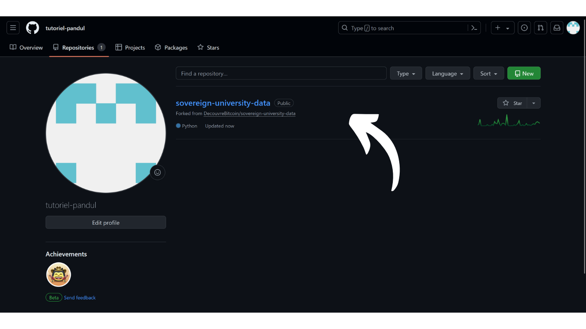

Die Mission von PlanB ist es, erstklassige Bildungsressourcen über Bitcoin in möglichst vielen Sprachen bereitzustellen. Alle Inhalte, die auf der Seite veröffentlicht werden, sind Open-Source und werden auf GitHub gehostet, was es jedem ermöglicht, zur Bereicherung der Plattform beizutragen.

**Möchten Sie ein Buch zum Thema Bitcoin auf der PlanB Netzwerkseite hinzufügen und die Sichtbarkeit Ihrer Arbeit erhöhen, wissen aber nicht wie? Dieses Tutorial ist für Sie!**

- Zuerst benötigen Sie ein GitHub-Konto. Wenn Sie nicht wissen, wie Sie ein Konto erstellen, haben wir ein detailliertes Tutorial erstellt, um Sie anzuleiten.

https://planb.network/tutorials/contribution/others/create-github-account-a75fc39d-f0d0-44dc-9cd5-cd94aee0c07c


- Gehen Sie zu [dem GitHub-Repository von PlanB, das den Daten gewidmet ist](https://github.com/PlanB-Network/bitcoin-educational-content/tree/dev/resources/books) im Abschnitt `resources/books/`:

- Klicken Sie oben rechts auf den Button `Add file`, dann auf `Create new file`:

- Wenn Sie noch nie zu den Inhalten des PlanB Netzwerks beigetragen haben, müssen Sie Ihren Fork des Original-Repositorys erstellen. Ein Repository zu forken bedeutet, eine Kopie dieses Repositorys auf Ihrem eigenen GitHub-Konto zu erstellen, was es Ihnen ermöglicht, am Projekt zu arbeiten, ohne das Original-Repository zu beeinflussen. Klicken Sie auf den Button `Fork this repository`:

- Sie gelangen dann zur GitHub-Bearbeitungsseite:

- Erstellen Sie einen Ordner für Ihr Buch. Um dies zu tun, schreiben Sie in das Feld `Name your file...` den Namen Ihres Buches in Kleinbuchstaben mit Bindestrichen anstelle von Leerzeichen. Wenn Ihr Buch zum Beispiel "*Mein Bitcoin Buch*" heißt, sollten Sie `mein-bitcoin-buch` notieren:

- Um die Erstellung des Ordners zu bestätigen, fügen Sie einfach einen Schrägstrich nach Ihrem Buchnamen in dasselbe Feld ein, zum Beispiel: `mein-bitcoin-buch/`. Das Hinzufügen eines Schrägstrichs erstellt automatisch einen Ordner anstelle einer Datei:

- In diesem Ordner erstellen Sie eine erste YAML-Datei mit dem Namen `book.yml`:

- Füllen Sie diese Datei mit Informationen über Ihr Buch mit dieser Vorlage aus:

```yaml
author: 
level: 
tags:
  - 
  - 
```

Hier sind die Details, die für jedes Feld ausgefüllt werden müssen:
- **`author`**: Geben Sie den Namen des Autors des Buches an.
- **`level`**: Geben Sie das erforderliche Niveau an, um das Buch gut lesen und verstehen zu können. Wählen Sie ein Niveau aus den folgenden:
	- `beginner`
	- `intermediate`
- `advanced` - `expert`
- **`tags`**: Fügen Sie zwei oder drei Tags hinzu, die zu Ihrem Buch passen. Zum Beispiel:
    - `bitcoin`
    - `history`
    - `technology`
    - `economy`
    - `education`...

Zum Beispiel könnte Ihre YAML-Datei so aussehen:

```yaml
author: Loïc Morel
level: beginner
tags:
  - bitcoin
  - technology
```


- Sobald Sie mit den Änderungen an dieser Datei fertig sind, speichern Sie sie, indem Sie auf den Button `Commit changes...` klicken:

- Fügen Sie einen Titel für Ihre Änderungen sowie eine kurze Beschreibung hinzu: 
- Klicken Sie auf den grünen Button `Propose changes` (Änderungen vorschlagen): 
- Sie gelangen dann auf eine Seite, die alle Ihre Änderungen zusammenfasst: 
- Klicken Sie oben rechts auf Ihr GitHub-Profilbild und dann auf `Your Repositories` (Ihre Repositories): 
- Wählen Sie Ihren Fork des PlanB Network-Repository aus: 
- Sie sollten oben im Fenster eine Benachrichtigung mit Ihrem neuen Branch sehen. Er heißt wahrscheinlich `patch-1`. Klicken Sie darauf: 
- Sie befinden sich jetzt auf Ihrem Arbeitsbranch: 
- Gehen Sie zurück zum Ordner `resources/books/` und wählen Sie den Ordner Ihres Buches aus, den Sie im vorherigen Commit erstellt haben: 
- Klicken Sie im Ordner Ihres Buches auf den Button `Add file` (Datei hinzufügen), dann auf `Create new file` (Neue Datei erstellen): 
- Benennen Sie diesen neuen Ordner `assets` und bestätigen Sie dessen Erstellung, indem Sie am Ende ein Schrägstrich `/` setzen: 
- Erstellen Sie in diesem `assets`-Ordner eine Datei mit dem Namen `.gitkeep`: 
- Klicken Sie auf den Button `Commit changes...` (Änderungen übernehmen): 
- Belassen Sie den Commit-Titel wie vorgegeben und stellen Sie sicher, dass das Kästchen `Commit directly to the patch-1 branch` (Direkt in den Branch patch-1 übernehmen) angekreuzt ist, dann klicken Sie auf `Commit changes` (Änderungen übernehmen): 
- Kehren Sie zum `assets`-Ordner zurück: 
- Klicken Sie auf den Button `Add file` (Datei hinzufügen), dann auf `Upload files` (Dateien hochladen): 
- Eine neue Seite wird geöffnet. Ziehen Sie das Coverbild Ihres Buches in den Bereich. Dieses Bild wird auf der PlanB Network-Website angezeigt: 
- Achten Sie darauf, dass das Bild im Format eines Buches sein muss, um sich am besten unserer Website anzupassen, wie zum Beispiel: 
- Sobald das Bild hochgeladen ist, stellen Sie sicher, dass das Kästchen `Commit directly to the patch-1 branch` (Direkt in den Branch patch-1 übernehmen) angekreuzt ist, dann klicken Sie auf `Commit changes` (Änderungen übernehmen): - Bitte beachten Sie, dass Ihr Bild `cover_en` benannt sein muss, wenn das Cover auf Englisch ist und im `.webp`-Format sein muss. Daher sollte der vollständige Dateiname `cover_en.webp`, `cover_fr.webp`, `cover_it.webp` usw. lauten. Wenn Sie für jede Sprache ein unterschiedliches Coverbild verwenden möchten, zum Beispiel im Falle einer Buchübersetzung, können Sie diese am gleichen Ort im `assets`-Ordner platzieren: 
- Gehen Sie zurück zu Ihrem `assets`-Ordner und klicken Sie auf die Zwischendatei `.gitkeep`: 
- Einmal auf der Datei, klicken Sie auf die 3 kleinen Punkte oben rechts und dann auf `Delete file` (Datei löschen): 
- Stellen Sie sicher, dass Sie immer noch auf dem gleichen Arbeitsbranch sind, dann klicken Sie auf den Button `Commit changes...` (Änderungen übernehmen): 
- Fügen Sie Ihrem Commit einen Titel und eine Beschreibung hinzu, dann klicken Sie auf `Commit changes` (Änderungen übernehmen): 
- Kehren Sie zurück zum Ordner Ihres Buches: 
- Klicken Sie auf den `Add file`-Button und dann auf `Create new file`:

- Erstellen Sie eine neue YAML-Datei, indem Sie sie mit dem Sprachkürzel des Buches benennen. Diese Datei wird für die Beschreibung des Buches verwendet. Wenn ich zum Beispiel meine Beschreibung auf Englisch schreiben möchte, benenne ich diese Datei `en.yml`:

- Füllen Sie diese YAML-Datei mit dieser Vorlage aus:
```yaml
title: ""
publication_year: 
cover: cover_en.webp
original: true
description: |

contributors:
  - 
```

Hier sind die Details, die für jedes Feld ausgefüllt werden müssen:
- **`title`**: Geben Sie den Namen des Buches in Anführungszeichen an.
- **`publication_year`**: Geben Sie das Jahr der Veröffentlichung des Buches an.
- **`cover`**: Geben Sie den Namen der Datei an, die dem Coverbild entspricht, in Übereinstimmung mit der Sprache der YAML-Datei, die Sie gerade bearbeiten. Wenn Sie zum Beispiel die `en.yml`-Datei bearbeiten und zuvor das englische Coverbild mit dem Titel `cover_en.webp` hinzugefügt haben, geben Sie einfach `cover_en.webp` in diesem Feld an.
- **`description`**: Fügen Sie einen kurzen Absatz hinzu, der das Buch beschreibt. Die Beschreibung muss in der gleichen Sprache sein, wie im Titel der YAML-Datei angegeben.
- **`contributors`**: Fügen Sie Ihre Mitwirkenden-ID hinzu, falls Sie eine haben.

Zum Beispiel könnte Ihre YAML-Datei so aussehen:

```yaml
title: "Mein Bitcoin-Buch"
publication_year: 2021
cover: cover_en.webp
original: true
description: |
Entdecken Sie die bahnbrechende Welt von Bitcoin mit diesem umfassenden Leitfaden für Anfänger. Mein Bitcoin-Buch entmystifiziert die Komplexitäten von Bitcoin und bietet eine klare und prägnante Einführung in die Funktionsweise des Protokolls. Von seiner revolutionären Technologie bis hin zu seinem potenziellen Einfluss auf die Weltwirtschaft bietet dieses Buch wertvolle Einblicke und praktisches Wissen. Perfekt für Bitcoin-Neulinge, deckt es die Grundlagen, Sicherheitstipps und die Zukunft der digitalen Finanzen ab. Tauchen Sie ein in die Zukunft des Geldes und stärken Sie sich mit dem Wissen, das digitale Zeitalter selbstbewusst zu navigieren.

contributors:
  - pretty-private


- Klicken Sie auf den `Commit changes...`-Button:

- Stellen Sie sicher, dass das Kästchen `Commit directly to the patch-1 branch` angekreuzt ist, fügen Sie einen Titel hinzu und klicken Sie auf `Commit changes`:

- Der Buchordner sollte jetzt so aussehen:

- Wenn alles für Sie gut aussieht, kehren Sie zurück zur Wurzel Ihres Forks:

- Sie sollten eine Nachricht sehen, die darauf hinweist, dass Ihr Branch geändert wurde. Klicken Sie auf den `Compare & pull request`-Button:

- Fügen Sie einen klaren Titel und eine Beschreibung zu Ihrem PR hinzu:

- Klicken Sie auf den `Create pull request`-Button:

Herzlichen Glückwunsch! Ihr PR wurde erfolgreich erstellt. Ein Administrator wird ihn nun überprüfen und, wenn alles in Ordnung ist, in das Hauptrepository des PlanB-Netzwerks zusammenführen. Sie sollten Ihr Buch ein paar Tage später auf der Website sehen.

Folgen Sie unbedingt dem Fortschritt Ihres PR. Ein Administrator könnte einen Kommentar hinterlassen, der nach zusätzlichen Informationen fragt. Solange Ihr PR nicht validiert ist, können Sie ihn im `Pull requests`-Tab im GitHub-Repository des PlanB-Netzwerks einsehen.
Vielen Dank für Ihren wertvollen Beitrag! :)
