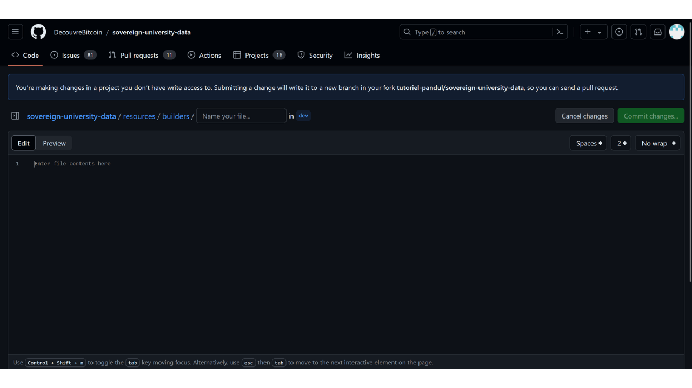
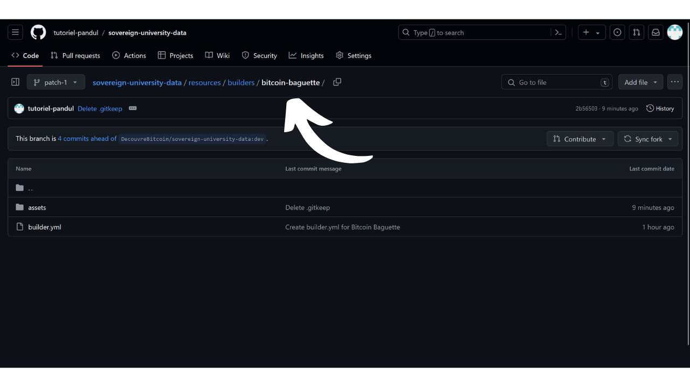
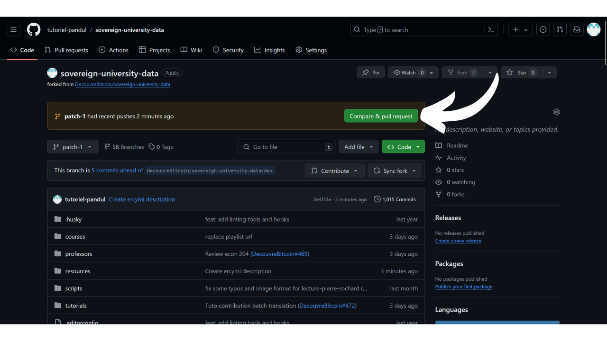

PlanB missiooniks on pakkuda tipptasemel haridusressursse Bitcoin'i kohta võimalikult paljudes keeltes. Kõik saidil avaldatud sisu on avatud lähtekoodiga ja majutatud GitHub'is, mis võimaldab kõigil platvormi rikastamises osaleda.

Kas soovite PlanB võrgustiku saidile lisada uue Bitcoin "ehitaja" ja anda oma ettevõttele või tarkvarale nähtavust, kuid ei tea, kuidas? See õpetus on teile!

- Esiteks peate omama GitHub'i kontot. Kui te ei tea, kuidas kontot luua, oleme koostanud [üksikasjaliku õpetuse, mis juhendab teid](https://planb.network/tutorials/contribution/others/create-github-account-a75fc39d-f0d0-44dc-9cd5-cd94aee0c07c).
- Minge [PlanB-le pühendatud GitHub'i andmerepositooriumisse](https://github.com/PlanB-Network/bitcoin-educational-content/tree/dev/resources/builders) jaotisesse `resources/builder/`:

- Klõpsake paremal üleval nupul `Add file`, seejärel `Create new file`:

- Kui te pole varem PlanB võrgustiku sisule kaasa aidanud, peate looma oma hargi (fork) algsest repositooriumist. Repositooriumi hargitsemine tähendab selle repositooriumi koopia loomist oma GitHub'i kontole, mis võimaldab teil projekti kallal töötada ilma algset repositooriumit mõjutamata. Klõpsake nupul `Fork this repository`:

- Seejärel jõuate GitHub'i redigeerimislehele:

- Looge oma ettevõtte jaoks kaust. Selleks kirjutage kasti `Name your file...` oma ettevõtte nimi väiketähtedega ja tühikute asemel sidekriipsudega. Näiteks, kui teie ettevõtte nimi on "Bitcoin Baguette", peaksite kirjutama `bitcoin-baguette`:

- Kausta loomise kinnitamiseks lisage lihtsalt oma nimele samas kastis kaldkriips, näiteks: `bitcoin-baguette/`. Kaldkriipsu lisamine loob automaatselt kausta, mitte faili:

- Selles kaustas loote esimese YAML-faili nimega `builder.yml`:

- Täitke see fail oma ettevõtte kohta käiva teabega, kasutades seda malli:

```yaml
name:

address_line_1:
address_line_2:
address_line_3: 

language:
  - 

links:
  website:
  twitter:
  Github:
  youtube:
  nostr:

tags:
  - 
  - 

category:
```

Siin on, mida iga võtme jaoks täita:
- `name`: Teie ettevõtte nimi (kohustuslik);
- `address` : Teie ettevõtte asukoht (valikuline);
- `language` : Riigid, kus teie ettevõte tegutseb, või toetatud keeled (valikuline);
- `links` : Teie ettevõtte erinevad ametlikud lingid (valikuline);
- `tags` : 2 terminit, mis iseloomustavad teie ettevõtet (kohustuslik);
- `category` : Kategooria, mis kõige paremini kirjeldab valdkonda, milles teie ettevõte tegutseb järgmiste valikute hulgast:
	- `wallet` (rahakott),
	- `infrastructure` (infrastruktuur),
	- `exchange` (vahetus),
	- `education` (haridus),
	- `service` (teenus),
	- `communities` (kogukonnad),
	- `conference` (konverents),
	- `privacy` (privaatsus),
	- `investment` (investeering),
	- `node` (sõlm),
	- `mining` (kaevandamine),
	- `news` (uudised),
	- `manufacturer` (tootja).
Näiteks võib teie YAML fail välja näha selline:
```yaml
name: Bitcoin Baguette

aadress_rida_1: Pariis, Prantsusmaa
aadress_rida_2:
aadress_rida_3: 

keel:
  - fr
  - en

lingid:
  veebileht: https://bitcoin-baguette.com
  twitter: https://twitter.com/bitcoinbaguette
  Github:
  youtube:
  nostr:

märksõnad:
  - bitcoin
  - haridus

kategooria: haridus
```


- Kui olete failis muudatused lõpetanud, salvestage need, klõpsates nupul `Commit changes...`:

- Lisage oma muudatustele pealkiri koos lühikirjeldusega:

- Klõpsake rohelisel nupul `Propose changes`:

- Seejärel jõuate lehele, mis kokkuvõtlikult kuvab kõik teie muudatused:

- Klõpsake üleval paremal oma GitHubi profiilipildil, seejärel valige `Your Repositories`:

- Valige oma PlanB Networki repositooriumi fork:

- Akna ülaosas peaks nägema teadet teie uue haru kohta. See on tõenäoliselt nimetatud `patch-1`. Klõpsake sellel:

- Nüüd olete oma tööharul (**veenduge, et olete samal harul kui teie eelmised muudatused, see on oluline!**):

- Minge tagasi kausta `resources/builders/` ja valige äri, mille te just eelmises commit'is lõite:

- Oma äri kaustas klõpsake nupul `Add file`, seejärel valige `Create new file`:

- Nimetage see uus kaust `assets` ja kinnitage selle loomine, pannes lõppu kaldkriipsu `/`:

- Selles `assets` kaustas looge fail nimega `.gitkeep`:

- Klõpsake nupul `Commit changes...`:

- Jätke commit'i pealkiri vaikimisi, veenduge, et ruut `Commit directly to the patch-1 branch` oleks märgitud, seejärel klõpsake `Commit changes`: 
- Minge tagasi `assets` kausta:

- Klõpsake nupul `Add file`, seejärel valige `Upload files`:

- Avaneb uus leht. Lohistage oma ettevõtte või tarkvara pilt alale. See pilt kuvatakse PlanB Networki saidil:

- See võib olla logo või ikoon:

- Kui pilt on üles laaditud, kontrollige, et ruut `Commit directly to the patch-1 branch` oleks märgitud, seejärel klõpsake `Commit changes`:

- Olge ettevaatlik, teie pilt peab olema ruudukujuline, peab olema nimetatud `logo` ja peab olema `.webp` formaadis. Täielik failinimi peaks seega olema: `logo.webp`:

- Minge tagasi oma `assets` kausta ja klõpsake `.gitkeep` vahefailil:
- Faili juures olles klõpsake paremas ülanurgas kolmel väikesel punktil ja seejärel valige `Delete file`:

- Kontrollige, et olete endiselt samal tööharul, seejärel klõpsake nupul `Commit changes`:

- Lisage oma commit'ile pealkiri ja kirjeldus, seejärel klõpsake `Commit changes`:

- Minge tagasi oma ettevõtte kausta:

- Klõpsake nupul `Add file`, seejärel valige `Create new file`:

- Looge uus YAML-fail, nimetades selle oma emakeele tähise järgi. Seda faili kasutatakse ehitaja kirjelduse jaoks. Näiteks, kui tahan oma kirjeldust kirjutada inglise keeles, nimetan selle faili `en.yml`:

- Täitke see YAML-fail kasutades järgmist malli:
```yaml
description: |
 
contributors:
 - 
```

- Võtme `contributors` jaoks võite lisada oma kaastöötaja identifikaatori PlanB võrgustikus, kui teil see on. Kui ei, jätke see väli tühjaks.
- Võtme `description` jaoks peate lihtsalt lisama lühikese lõigu, mis kirjeldab teie ettevõtet või teie tarkvara. Kirjeldus peab olema sama keeles, mis faili nimi. Te ei pea seda kirjeldust tõlkima kõikidesse saidil toetatud keeltesse, kuna PlanB meeskonnad teevad seda kasutades oma mudelit. Näiteks siin on, kuidas teie fail võiks välja näha:
```yaml
description: |
Asutatud 2017. aastal, Bitcoin Baguette on Pariisis asuv ühendus, mis on pühendunud Bitcoin'i kohtumiste ja tehniliste töötubade korraldamisele. Me toome kokku entusiaste, eksperte ja uudishimulikke meeli, et uurida ja arutada Bitcoin'i tehnoloogia keerukusi. Meie üritused pakuvad platvormi teadmiste jagamiseks, võrgustike loomiseks ja sügavama arusaama saavutamiseks Bitcoin'i sisemisest toimimisest. Liitu meiega Bitcoin Baguette'is, et olla osa Pariisi Bitcoin'i kogukonnast ja püsida kursis valdkonna viimaste arengutega.

contributors:
- 
```

- Klõpsake nupul `Commit changes`:

- Veenduge, et ruut `Commit directly to the patch-1 branch` oleks märgitud, lisage pealkiri, seejärel klõpsake `Commit changes`:

- Teie ettevõtte kaust peaks nüüd välja nägema selline:

- Kui kõik on teie rahuloluks, naaske oma fork'i juurde:

- Peaksite nägema sõnumit, mis näitab, et teie harul on toimunud muudatusi. Klõpsake nupul `Compare & pull request`:

- Lisage oma PR-ile selge pealkiri ja description:

- Klõpsake nupul `Create pull request`:

Palju õnne! Teie PR on edukalt loodud. Administraator vaatab selle nüüd üle ja kui kõik on korras, integreeritakse see PlanB võrgustiku peamisse repositooriumisse. Teie ehitaja profiil peaks veebisaidil ilmuma mõne päeva pärast.

Jälgige kindlasti oma PR-i edenemist. Administraator võib jätta kommentaari, paludes lisateavet. Niikaua kui teie PR ei ole kinnitatud, saate seda vaadata PlanB võrgustiku GitHubi repositooriumi `Pull requests` vahekaardil:

Suur tänu teie väärtusliku panuse eest! :)
