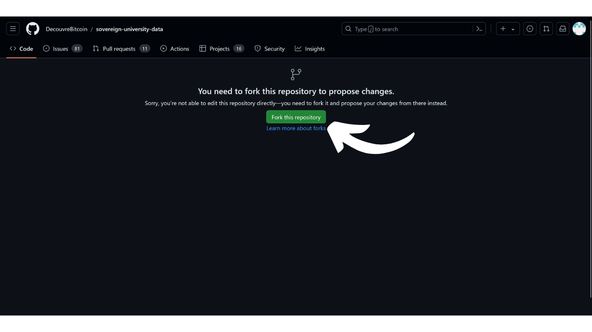
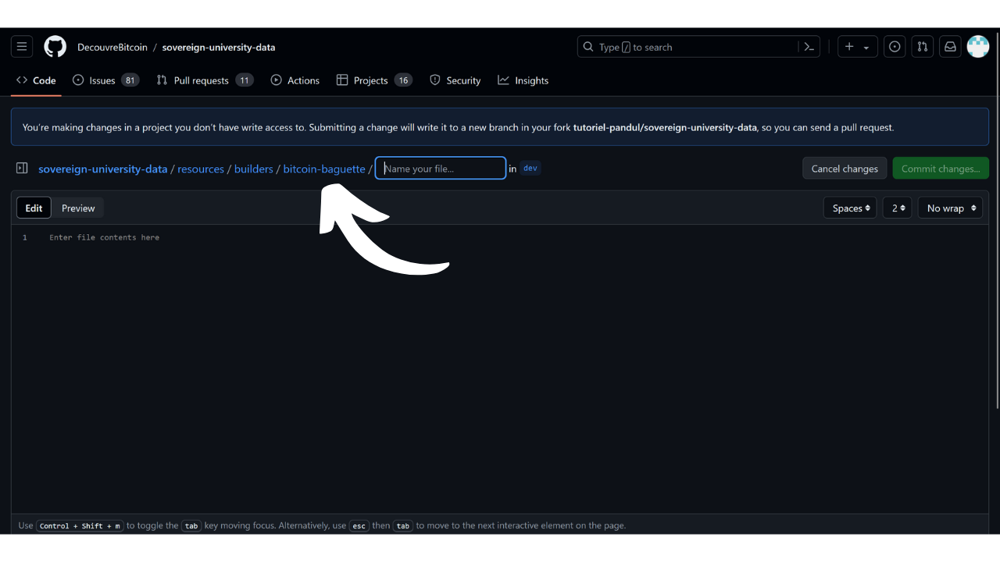
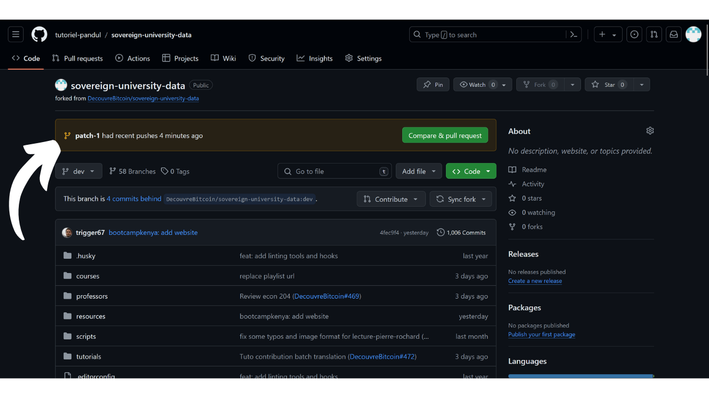
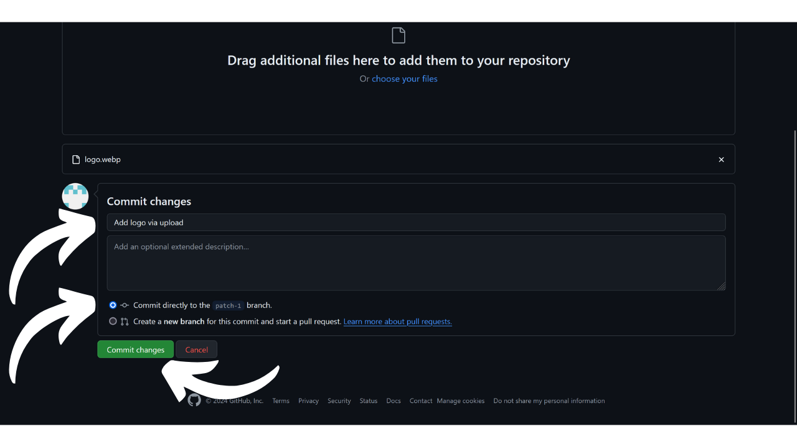
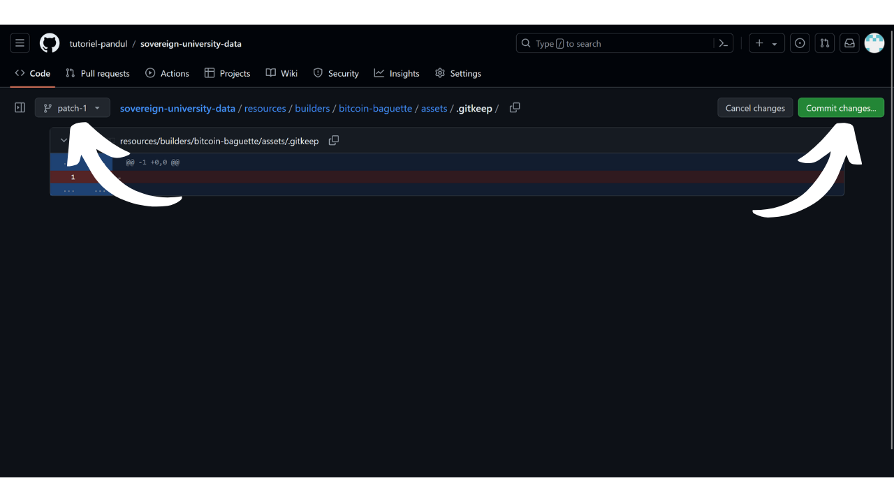
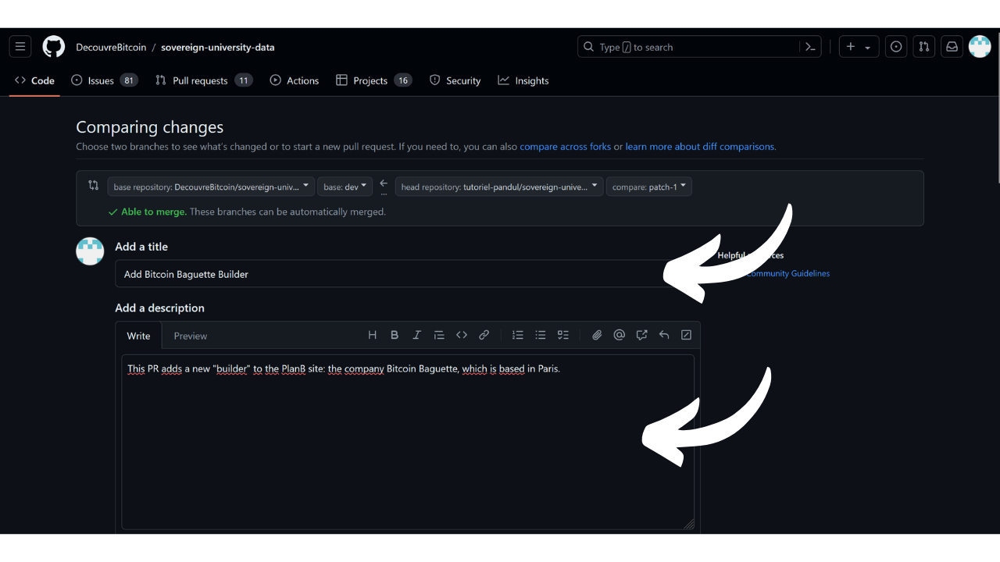

PlanB的使命是提供顶级的比特币教育资源，尽可能多的语言。网站上发布的所有内容都是开源的，并托管在GitHub上，这允许任何人参与丰富平台。

您想在PlanB网络站点上添加一个新的比特币“构建者”，并为您的公司或软件提供曝光机会，但不知道如何操作？这个教程是为您准备的！

- 首先，您需要拥有一个GitHub账户。如果您不知道如何创建账户，我们制作了[一个详细的教程来指导您](https://planb.network/tutorials/contribution/others/create-github-account-a75fc39d-f0d0-44dc-9cd5-cd94aee0c07c)。
- 转到[PlanB专用于数据的GitHub仓库](https://github.com/PlanB-Network/bitcoin-educational-content/tree/dev/resources/builders)的`resources/builder/`部分：

- 点击右上角的`Add file`按钮，然后点击`Create new file`：

- 如果您以前从未为PlanB网络的内容做出过贡献，您将需要创建原始仓库的分支。分支一个仓库意味着在您自己的GitHub账户上创建该仓库的副本，这允许您在不影响原始仓库的情况下进行项目工作。点击`Fork this repository`按钮：

- 然后您将进入GitHub编辑页面：

- 为您的公司创建一个文件夹。为此，在`Name your file...`框中，用破折号代替空格写下您公司的名称。例如，如果您的公司叫“Bitcoin Baguette”，您应该写`bitcoin-baguette`：

- 要验证文件夹的创建，只需在同一个框中的名称后添加斜杠，例如：`bitcoin-baguette/`。添加斜杠会自动创建一个文件夹而不是文件：

- 在这个文件夹中，您将创建一个名为`builder.yml`的第一个YAML文件：

- 使用此模板填写有关您公司的信息：

```yaml
name:

address_line_1:
address_line_2:
address_line_3: 

language:
  - 

links:
  website:
  twitter:
  Github:
  youtube:
  nostr:

tags:
  - 
  - 

category:
```

以下是每个键的填写内容：
- `name`：您公司的名称（必填）；
- `address`：您的业务地点（可选）；
- `language`：您的业务运营的国家或支持的语言（可选）；
- `links`：您的业务的各种官方链接（可选）；
- `tags`：描述您业务的2个术语（必填）；
- `category`：最能描述您的业务运营领域的类别，以下选项之一：
	- `wallet`（钱包），
	- `infrastructure`（基础设施），
	- `exchange`（交易所），
	- `education`（教育），
	- `service`（服务），
	- `communities`（社区），
	- `conference`（会议），
	- `privacy`（隐私），
	- `investment`（投资），
	- `node`（节点），
	- `mining`（挖矿），
	- `news`（新闻），
	- `manufacturer`（制造商）。
例如，您的YAML文件可能看起来像这样：
```yaml
name: 比特币法棍

address_line_1: 巴黎，法国
address_line_2:
address_line_3: 

language:
  - fr
  - en

links:
  网站: https://bitcoin-baguette.com
  推特: https://twitter.com/bitcoinbaguette
  Github:
  youtube:
  nostr:

tags:
  - 比特币
  - 教育

category: 教育
```


- 完成对此文件的更改后，点击 `Commit changes...` 按钮保存更改：

- 为您的更改添加标题，以及简短的描述：

- 点击绿色的 `Propose changes` 按钮：

- 接下来，您将看到一个页面，总结您所有的更改：

- 点击右上角的GitHub个人资料图片，然后点击 `Your Repositories`：

- 选择您fork的PlanB Network仓库：

- 您应该会在窗口顶部看到一个带有新分支的通知。它可能被称为 `patch-1`。点击它：

- 现在您处于工作分支上（**确保您处于与之前修改相同的分支上，这很重要！**）：

- 返回到 `resources/builders/` 文件夹，并选择您在上一个提交中刚创建的业务文件夹：

- 在您的业务文件夹中，点击 `Add file` 按钮，然后点击 `Create new file`：

- 将这个新文件夹命名为 `assets` 并通过在末尾添加斜杠 `/` 来确认其创建：

- 在这个 `assets` 文件夹中，创建一个名为 `.gitkeep` 的文件：

- 点击 `Commit changes...` 按钮：

- 保留默认的提交标题，并确保选中了 `Commit directly to the patch-1 branch` 框，然后点击 `Commit changes`： 
- 返回到 `assets` 文件夹：

- 点击 `Add file` 按钮，然后点击 `Upload files`：

- 一个新页面将打开。将您公司或软件的图片拖放到区域中。这张图片将在PlanB Network站点上显示：

- 它可以是标志或图标：

- 图片上传后，验证 `Commit directly to the patch-1 branch` 框是否被选中，然后点击 `Commit changes`：

- 注意，您的图片必须是正方形，必须命名为 `logo`，并且必须是 `.webp` 格式。因此，完整的文件名应该是：`logo.webp`：

- 返回到您的 `assets` 文件夹并点击 `.gitkeep` 中间文件：
- 在文件上，点击右上角的三个小点，然后点击`删除文件`：

- 确认您仍在同一个工作分支上，然后点击`提交更改`按钮：

- 为您的提交添加标题和描述，然后点击`提交更改`：

- 返回到您公司的文件夹：

- 点击`添加文件`按钮，然后点击`创建新文件`：

- 通过用您的母语指示符命名来创建一个新的YAML文件。这个文件将用于描述构建器。例如，如果我想用英语写我的描述，我会将这个文件命名为`en.yml`：

- 使用以下模板填写这个YAML文件：
```yaml
description: |
 
contributors:
 - 
```

- 对于`contributors`键，如果您有PlanB网络的贡献者标识符，可以添加您的贡献者标识符。如果没有，请将此字段留空。
- 对于`description`键，您只需添加一个简短的段落来描述您的公司或您的软件。描述必须与文件名的语言相同。您不需要将此描述翻译成站点支持的所有语言，因为PlanB团队将使用他们的模型来进行翻译。例如，这里是您的文件可能的样子：
```yaml
description: |
成立于2017年，比特币法棍是一个位于巴黎的协会，致力于组织比特币聚会和技术研讨会。我们汇集了热情者、专家和好奇心强的人，探索和讨论比特币技术的复杂性。我们的活动提供了一个知识分享、网络建设和深入理解比特币内部运作的平台。加入比特币法棍，成为巴黎比特币社区的一部分，并与最新的领域进展保持同步。

contributors:
- 
```

- 点击`提交更改`按钮：

- 确保选中了`直接提交到patch-1分支`框，添加标题，然后点击`提交更改`：

- 您的公司文件夹现在应该看起来像这样：

- 如果一切都令您满意，请返回到您分叉的根目录：

- 您应该看到一条消息，指示您的分支已经发生了变化。点击`比较并请求拉取`按钮：

- 为您的PR添加一个清晰的标题和描述：

- 点击`创建拉取请求`按钮：

恭喜！您的PR已成功创建。管理员现在将对其进行审查，如果一切顺利，将其整合到PlanB网络的主仓库中。您应该在几天后看到您的构建器简介出现在网站上。

确保跟踪您PR的进展。管理员可能会留下评论，要求提供额外信息。只要您的PR未被验证，您就可以在PlanB网络GitHub仓库的`拉取请求`标签中查看它：

非常感谢您的宝贵贡献！:)
