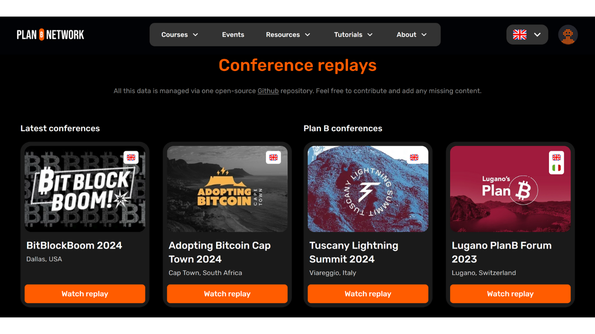
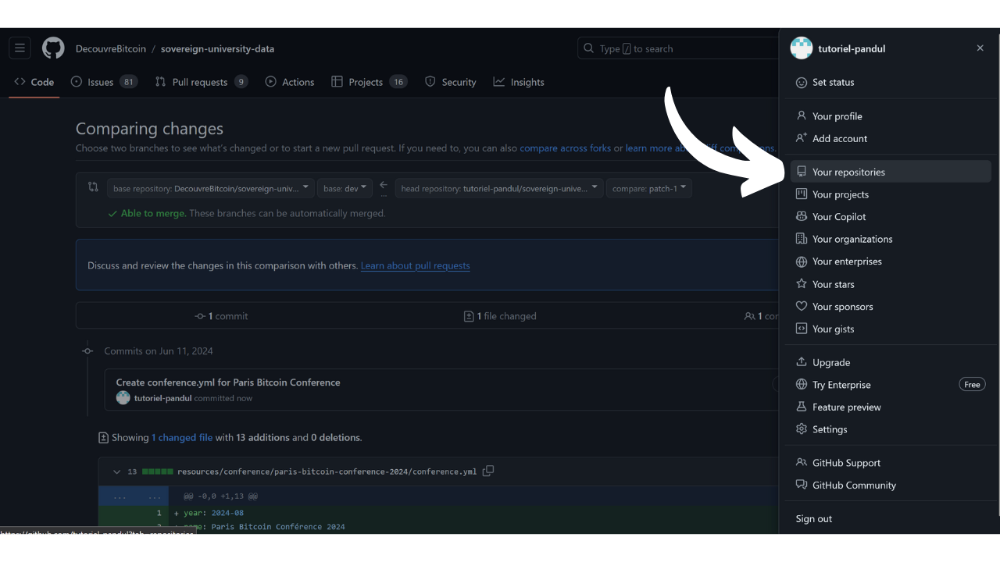
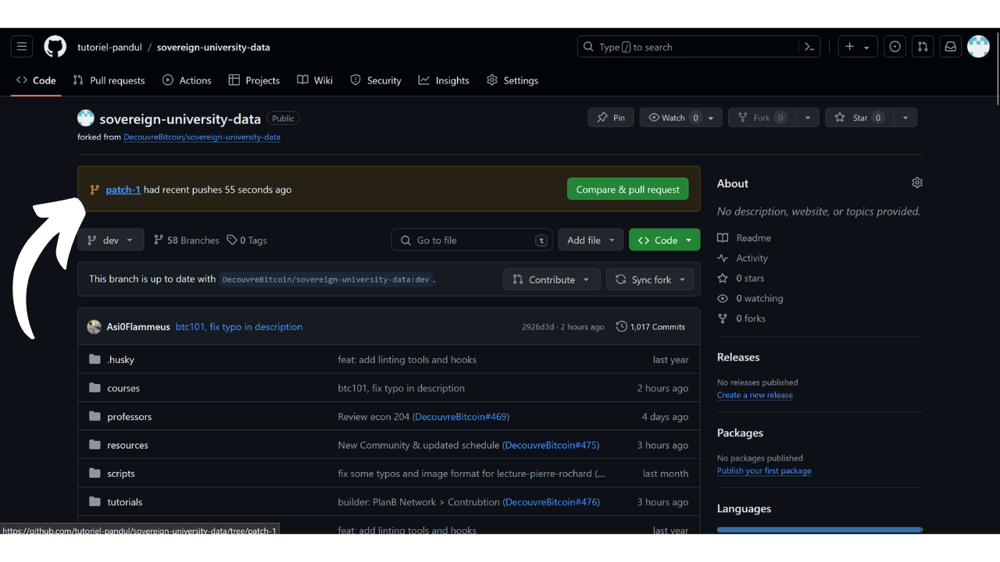
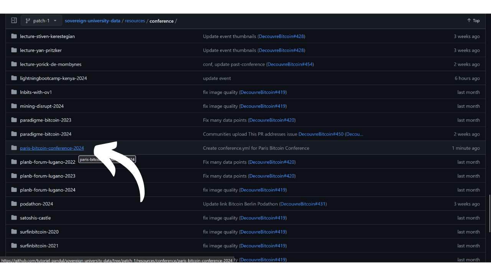
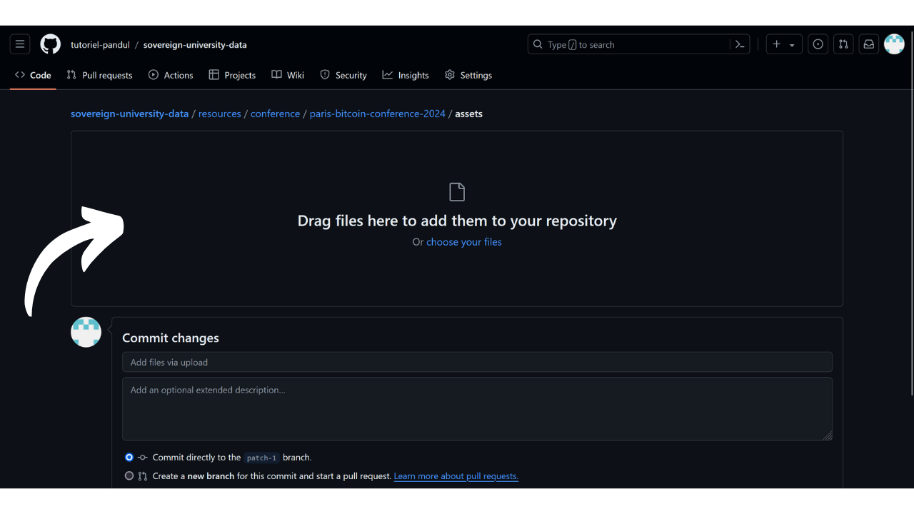

Die Mission von PlanB ist es, erstklassige Bildungsressourcen über Bitcoin in so vielen Sprachen wie möglich bereitzustellen. Alle Inhalte, die auf der Seite veröffentlicht werden, sind Open-Source und werden auf GitHub gehostet, was es jedem ermöglicht, zur Bereicherung der Plattform beizutragen.

Möchten Sie die Wiederholung Ihrer Bitcoin-Konferenz auf der PlanB Netzwerkseite hinzufügen und diesem Ereignis Sichtbarkeit verleihen, wissen aber nicht wie? Dieses Tutorial ist für Sie!

Wenn Sie jedoch eine Konferenz hinzufügen möchten, die in der Zukunft stattfinden wird, rate ich Ihnen, dieses andere Tutorial zu lesen, in dem wir erklären, wie man eine neue Veranstaltung auf der Seite hinzufügt.

https://planb.network/tutorials/contribution/resource/add-event-1d3df554-c2d8-4e93-853f-58f672c5e097



- Zuerst müssen Sie ein Konto auf GitHub haben. Wenn Sie nicht wissen, wie man ein Konto erstellt, haben wir ein detailliertes Tutorial erstellt, um Sie zu führen.

https://planb.network/tutorials/contribution/others/create-github-account-a75fc39d-f0d0-44dc-9cd5-cd94aee0c07c


- Gehen Sie zu [dem GitHub-Repository von PlanB, das den Daten gewidmet ist](https://github.com/PlanB-Network/bitcoin-educational-content/tree/dev/resources/conference) im Abschnitt `resources/conference/`:

- Klicken Sie oben rechts auf den `Add file`-Button, dann auf `Create new file`:

- Wenn Sie noch nie zu den Inhalten des PlanB Netzwerks beigetragen haben, müssen Sie Ihren Fork des Original-Repositorys erstellen. Ein Repository zu forken bedeutet, eine Kopie dieses Repositorys auf Ihrem eigenen GitHub-Konto zu erstellen, was es Ihnen ermöglicht, am Projekt zu arbeiten, ohne das Original-Repository zu beeinflussen. Klicken Sie auf den `Fork this repository`-Button:

- Sie gelangen dann zur GitHub-Bearbeitungsseite:

- Erstellen Sie einen Ordner für Ihre Konferenz. Dazu schreiben Sie in das Feld `Name your file...` den Namen Ihrer Konferenz in Kleinbuchstaben mit Bindestrichen statt Leerzeichen. Zum Beispiel, wenn Ihre Konferenz "Paris Bitcoin Conference" heißt, sollten Sie `paris-bitcoin-conference` notieren. Fügen Sie auch das Jahr Ihrer Konferenz hinzu, zum Beispiel: `paris-bitcoin-conference-2024`:

- Um die Erstellung des Ordners zu validieren, notieren Sie einfach einen Schrägstrich nach Ihrem Namen im selben Feld, zum Beispiel: `paris-bitcoin-conference-2024/`. Das Hinzufügen eines Schrägstrichs erstellt automatisch einen Ordner anstatt einer Datei:

- In diesem Ordner erstellen Sie eine erste YAML-Datei mit dem Namen `conference.yml`:

Füllen Sie diese Datei mit Informationen zu Ihrer Konferenz anhand dieser Vorlage aus:
```yaml
year: 
name: 
builder: 
location: 
language: 
  - 
links:
  website: 
  twitter: 
tags: 
  - 
  - 
```

Zum Beispiel könnte Ihre YAML-Datei so aussehen:

```yaml
year: 2024-08
name: Paris Bitcoin Conference 2024
builder: Paris Bitcoin Conference
location: Paris, Frankreich
language: 
  - fr
  - en
links:
  website: https://paris.bitcoin.fr/conference
  twitter: https://twitter.com/ParisBitcoinConference
tags: 
  - International
  - Allgemeines Publikum
```


Wenn Sie noch keinen "*builder*" Identifikator für Ihre Organisation haben, können Sie diesen hinzufügen, indem Sie diesem anderen Tutorial folgen.
https://planb.network/tutorials/contribution/resource/add-builder-b5834c46-6dcc-4064-8d68-1ef529991d3d

- Sobald Sie die Änderungen an dieser Datei abgeschlossen haben, speichern Sie sie, indem Sie auf den `Commit changes...` Button klicken:

- Fügen Sie einen Titel für Ihre Änderungen hinzu, sowie eine kurze Beschreibung:

- Klicken Sie auf den grünen `Propose changes` Button:

- Sie gelangen dann auf eine Seite, die alle Ihre Änderungen zusammenfasst:

- Klicken Sie oben rechts auf Ihr GitHub-Profilbild und dann auf `Your Repositories`:

- Wählen Sie Ihren Fork des PlanB Network Repositories aus:

- Sie sollten eine Benachrichtigung am oberen Rand des Fensters mit Ihrem neuen Branch sehen. Er heißt wahrscheinlich `patch-1`. Klicken Sie darauf:

- Sie befinden sich jetzt auf Ihrem Arbeitsbranch:

- Kehren Sie zum Ordner `resources/conference/` zurück und wählen Sie den Ordner Ihrer Konferenz aus, den Sie im vorherigen Commit erstellt haben:

- Im Ordner Ihrer Konferenz klicken Sie auf den `Add file` Button und dann auf `Create new file`:

- Benennen Sie diesen neuen Ordner `assets` und bestätigen Sie seine Erstellung, indem Sie am Ende einen Schrägstrich `/` setzen:

- In diesem `assets` Ordner erstellen Sie eine Datei namens `.gitkeep`:

- Klicken Sie auf den `Commit changes...` Button:

- Lassen Sie den Commit-Titel als Standard und stellen Sie sicher, dass das Kästchen `Commit directly to the patch-1 branch` angekreuzt ist, dann klicken Sie auf `Commit changes`:

- Kehren Sie zum `assets` Ordner zurück:

- Klicken Sie auf den `Add file` Button und dann auf `Upload files`:

- Eine neue Seite wird geöffnet. Ziehen Sie ein Bild, das Ihre Konferenz repräsentiert und auf der PlanB Network Seite angezeigt wird, per Drag-and-Drop hinein: 
- Es kann ein Logo, ein Thumbnail oder sogar ein Poster sein:

- Sobald das Bild hochgeladen ist, überprüfen Sie, ob das Kästchen `Commit directly to the patch-1 branch` angekreuzt ist, dann klicken Sie auf `Commit changes`:

- Achten Sie darauf, dass Ihr Bild `thumbnail` genannt wird und im `.webp` Format vorliegt. Der vollständige Dateiname sollte also `thumbnail.webp` sein:

- Kehren Sie zu Ihrem `assets` Ordner zurück und klicken Sie auf die Zwischendatei `.gitkeep`:

- Einmal bei der Datei, klicken Sie auf die 3 kleinen Punkte in der oberen rechten Ecke und dann auf `Delete file`:

- Überprüfen Sie, dass Sie sich immer noch auf demselben Arbeitsbranch befinden, und klicken Sie dann auf den `Commit changes` Button:

- Fügen Sie einen Titel und eine Beschreibung zu Ihrem Commit hinzu und klicken Sie dann auf `Commit changes`:

- Kehren Sie zu Ihrem Konferenzordner zurück: 
- Klicken Sie auf den `Datei hinzufügen`-Button und dann auf `Neue Datei erstellen`:

- Erstellen Sie eine neue Markdown (.md) Datei, indem Sie sie mit dem Indikator Ihrer Muttersprache benennen. Diese Datei wird für die Wiederholungen Ihrer Konferenz verwendet. Zum Beispiel, wenn ich die Beschreibungen der Konferenzen auf Englisch schreiben möchte, werde ich diese Datei en.md nennen:

- Füllen Sie diese Markdown-Datei mit dieser Vorlage aus, die Sie an die Konfiguration Ihrer Konferenz anpassen können:

```markdown
---
name: Paris Bitcoin Konferenz 2024
description: Die größte Bitcoin-Konferenz in Frankreich mit über 8.000 Teilnehmern jedes Jahr!
--- 

# Hauptbühne

## Freitagvormittag


## Freitagnachmittag


## Samstagvormittag


## Samstagnachmittag


# Workshop-Raum

## Die Zukunft des Bitcoin-Minings: Herausforderungen und Innovationen


Sprecher: Satoshi Nakamoto, Satoshi Nakamoto

## Ist Privatsphäre bei Bitcoin noch möglich?


Sprecher: Satoshi Nakamoto

## Bitcoin Core: Tiefgang in den Code


Sprecher: Satoshi Nakamoto, Satoshi Nakamoto, Satoshi Nakamoto, Satoshi Nakamoto

## Aufbau und Sicherung von Bitcoin-Wallets mit Miniscript


Sprecher: Satoshi Nakamoto
```


- Füllen Sie zu Beginn Ihres Dokuments, im "Front Matter", das Feld `name:` mit dem Namen Ihrer Konferenz und dem Jahr der Wiederholungen aus. Im Feld `description:` schreiben Sie eine kurze Beschreibung Ihres Events in der Sprache der Datei. Zum Beispiel sollte für eine Datei namens `en.md` die Beschreibung auf Englisch sein. Das PlanB Network-Team wird sich um die Übersetzung Ihrer Beschreibung mit ihrem Modell kümmern.
- Überschriften erster Ebene, gekennzeichnet durch ein `#`, werden verwendet, um die Konferenz nach Szenen zu organisieren. Zum Beispiel `# Hauptbühne` für die Hauptbühne und `# Workshop-Raum` für eine Bühne, die Workshops gewidmet ist.

- Überschriften zweiter Ebene, gekennzeichnet durch ein doppeltes `##`, werden verwendet, um die verschiedenen Wiederholungsvideos zu trennen. Wenn die Konferenzen kontinuierlich über einen halben Tag gefilmt wurden, geben Sie zum Beispiel `## Freitagvormittag` an. Wenn die Konferenzen einzeln gefilmt und ausgestrahlt wurden, benennen Sie die Konferenz direkt mit einer Überschrift zweiter Ebene.

- Fügen Sie unter jeder Überschrift zweiter Ebene einen Link zum entsprechenden Wiederholungsvideo ein. Die Syntax sollte sein: ``, wobei `XXXXXXXXXXXX` durch den tatsächlichen Videolink ersetzt wird.

- Wenn das Format es zulässt (individuelle Konferenzen), können Sie die Namen der Sprecher hinzufügen. Dazu fügen Sie das Feld `Sprecher:` gefolgt vom Namen oder Pseudonym des Sprechers unter dem Videolink hinzu. Im Falle mehrerer Sprecher trennen Sie jeden Namen mit einem Komma, wie zum Beispiel: `Sprecher: Satoshi Nakamoto, Satoshi Nakamoto, Satoshi Nakamoto, Satoshi Nakamoto`.

---

- Sobald Sie Ihre Änderungen an dieser Datei abgeschlossen haben, speichern Sie sie, indem Sie auf den `Änderungen übernehmen...`-Button klicken:

- Fügen Sie einen Titel für Ihre Änderungen hinzu sowie eine kurze Beschreibung:

- Klicken Sie auf `Commit changes`: 
- Ihr Konferenzordner sollte nun so aussehen: 
- Wenn alles zu Ihrer Zufriedenheit ist, kehren Sie zum Wurzelverzeichnis Ihres Forks zurück: 
- Sie sollten eine Nachricht sehen, die darauf hinweist, dass Ihr Branch Änderungen erfahren hat. Klicken Sie auf den `Compare & pull request` Button: 
- Fügen Sie einen klaren Titel und eine Beschreibung für Ihren PR hinzu: 
- Klicken Sie auf den `Create pull request` Button: 
Herzlichen Glückwunsch! Ihr PR wurde erfolgreich erstellt. Ein Administrator wird ihn nun überprüfen und, wenn alles in Ordnung ist, in das Hauptrepository des PlanB-Netzwerks mergen. Die Aufzeichnungen Ihrer Konferenz sollten einige Tage später auf der Website erscheinen.

Bitte verfolgen Sie den Fortschritt Ihres PR. Es ist möglich, dass ein Administrator einen Kommentar hinterlässt und um zusätzliche Informationen bittet. Solange Ihr PR nicht validiert ist, können Sie ihn unter dem `Pull requests` Tab im GitHub-Repository des PlanB-Netzwerks einsehen: 

Vielen Dank für Ihren wertvollen Beitrag! :)
