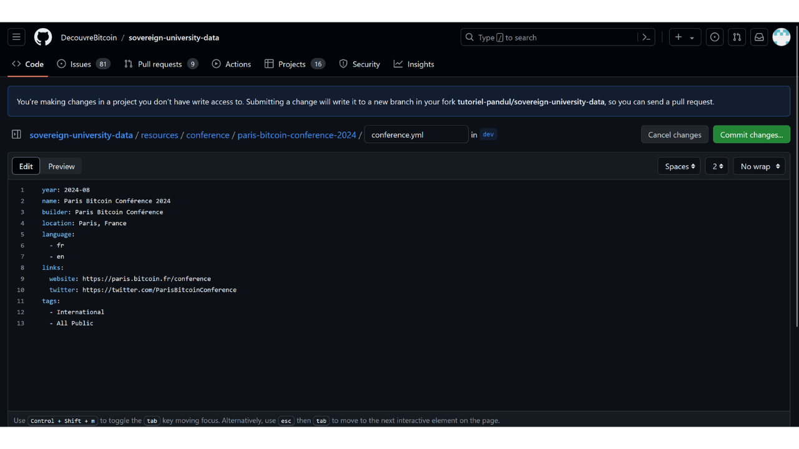
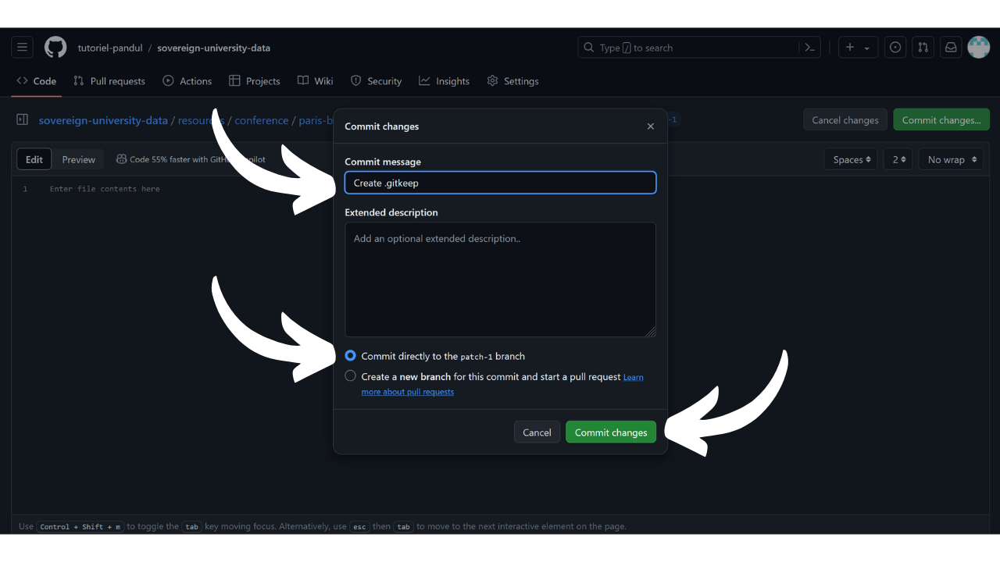
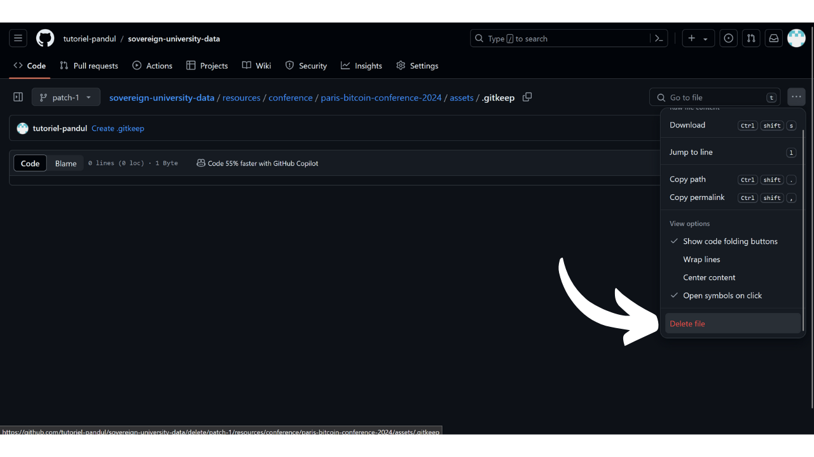
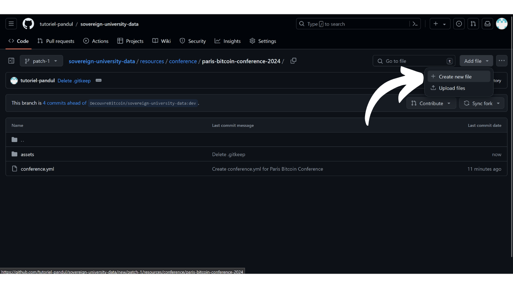
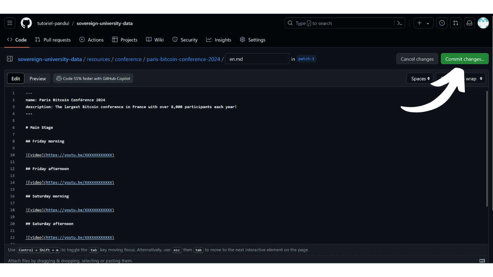
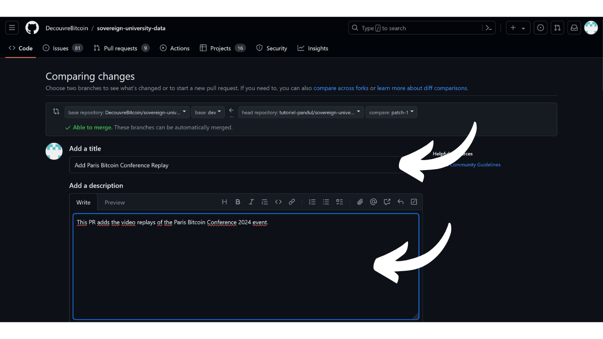
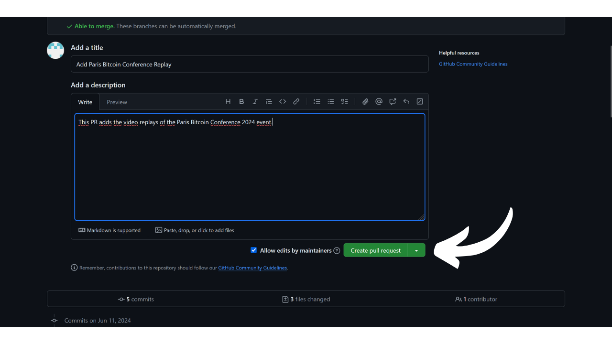

La misión de PlanB es proporcionar recursos educativos de primera categoría sobre Bitcoin en tantos idiomas como sea posible. Todo el contenido publicado en el sitio es de código abierto y alojado en GitHub, permitiendo a cualquiera contribuir al enriquecimiento de la plataforma.

¿Quieres añadir la repetición de tu conferencia sobre Bitcoin en el sitio de la Red PlanB y dar visibilidad a este evento, pero no sabes cómo? ¡Este tutorial es para ti!

Sin embargo, si quieres añadir una conferencia que tendrá lugar en el futuro, te aconsejo que leas este otro tutorial en el que explicamos cómo añadir un nuevo evento al sitio.

https://planb.network/tutorials/contribution/resource/add-event-1d3df554-c2d8-4e93-853f-58f672c5e097


- Primero, necesitas tener una cuenta en GitHub. Si no sabes cómo crear una cuenta, hemos hecho un tutorial detallado para guiarte.

https://planb.network/tutorials/contribution/others/create-github-account-a75fc39d-f0d0-44dc-9cd5-cd94aee0c07c


- Ve al [repositorio de GitHub de PlanB dedicado a datos](https://github.com/PlanB-Network/bitcoin-educational-content/tree/dev/resources/conference) en la sección `resources/conference/`:

- Haz clic en la parte superior derecha en el botón `Add file`, luego en `Create new file`:

- Si nunca has contribuido con los contenidos de la Red PlanB antes, necesitarás crear tu fork del repositorio original. Hacer un fork de un repositorio significa crear una copia de ese repositorio en tu propia cuenta de GitHub, lo que te permite trabajar en el proyecto sin afectar al repositorio original. Haz clic en el botón `Fork this repository`:

- Luego llegarás a la página de edición de GitHub:

- Crea una carpeta para tu conferencia. Para hacerlo, en el cuadro `Name your file...`, escribe el nombre de tu conferencia en minúsculas con guiones en lugar de espacios. Por ejemplo, si tu conferencia se llama "Paris Bitcoin Conference", deberías anotar `paris-bitcoin-conference`. También añade el año de tu conferencia, por ejemplo: `paris-bitcoin-conference-2024`:

- Para validar la creación de la carpeta, simplemente anota una barra inclinada después de tu nombre en el mismo cuadro, por ejemplo: `paris-bitcoin-conference-2024/`. Añadir una barra inclinada crea automáticamente una carpeta en lugar de un archivo:

- En esta carpeta, crearás un primer archivo YAML llamado `conference.yml`:

Llena este archivo con información relacionada con tu conferencia usando esta plantilla:
```yaml
year: 
name: 
builder: 
location: 
language: 
  - 
links:
  website: 
  twitter: 
tags: 
  - 
  - 
```

Por ejemplo, tu archivo YAML podría verse así:

```yaml
year: 2024-08
name: Paris Bitcoin Conference 2024
builder: Paris Bitcoin Conference
location: Paris, Francia
language: 
  - fr
  - en
links:
  website: https://paris.bitcoin.fr/conference
  twitter: https://twitter.com/ParisBitcoinConference
tags: 
  - Internacional
  - Todo Público
```


Si aún no tienes un identificador de "*builder*" para tu organización, puedes agregarlo siguiendo este otro tutorial.
https://planb.network/tutorials/contribution/resource/add-builder-b5834c46-6dcc-4064-8d68-1ef529991d3d

- Una vez que hayas terminado de hacer cambios en este archivo, guárdalos haciendo clic en el botón `Commit changes...`:

- Agrega un título para tus cambios, así como una breve descripción:

- Haz clic en el botón verde `Propose changes`:

- Luego llegarás a una página que resume todos tus cambios:

- Haz clic en la foto de tu perfil de GitHub en la esquina superior derecha, luego en `Your Repositories`:

- Selecciona tu bifurcación del repositorio de PlanB Network:

- Deberías ver una notificación en la parte superior de la ventana con tu nueva rama. Probablemente se llame `patch-1`. Haz clic en ella:

- Ahora estás en tu rama de trabajo:

- Regresa a la carpeta `resources/conference/` y selecciona la carpeta de tu conferencia que acabas de crear en el commit anterior:

- En la carpeta de tu conferencia, haz clic en el botón `Add file`, luego en `Create new file`:

- Nombra esta nueva carpeta `assets` y confirma su creación poniendo una barra `/` al final:

- En esta carpeta `assets`, crea un archivo llamado `.gitkeep`:

- Haz clic en el botón `Commit changes...`:

- Deja el título del commit como predeterminado, y asegúrate de que la casilla `Commit directly to the patch-1 branch` esté marcada, luego haz clic en `Commit changes`:

- Regresa a la carpeta `assets`:

- Haz clic en el botón `Add file`, luego en `Upload files`:

- Se abrirá una nueva página. Arrastra y suelta una imagen que represente tu conferencia y que se mostrará en el sitio de PlanB Network: 
- Puede ser un logotipo, una miniatura o incluso un póster:

- Una vez que la imagen esté subida, verifica que la casilla `Commit directly to the patch-1 branch` esté marcada, luego haz clic en `Commit changes`:

- Ten cuidado, tu imagen debe llamarse `thumbnail` y debe estar en formato `.webp`. El nombre completo del archivo debería ser, por lo tanto: `thumbnail.webp`:

- Regresa a tu carpeta `assets` y haz clic en el archivo intermediario `.gitkeep`:

- Una vez en el archivo, haz clic en los 3 pequeños puntos en la esquina superior derecha y luego en `Delete file`:

- Verifica que aún estés en la misma rama de trabajo, luego haz clic en el botón `Commit changes`:

- Agrega un título y una descripción a tu commit, luego haz clic en `Commit changes`:

- Vuelve a tu carpeta de conferencias: 
- Haz clic en el botón `Add file`, luego en `Create new file`:

- Crea un nuevo archivo markdown (.md) nombrándolo con el indicador de tu lengua materna. Este archivo se utilizará para las repeticiones de tu conferencia. Por ejemplo, si quiero escribir las descripciones de las conferencias en español, nombraré este archivo es.md:

- Rellena este archivo markdown utilizando esta plantilla que puedes adaptar a la configuración de tu conferencia:

```markdown
---
name: Conferencia Bitcoin París 2024
description: ¡La mayor conferencia de Bitcoin en Francia con más de 8,000 participantes cada año!
--- 

# Escenario Principal

## Viernes por la mañana


## Viernes por la tarde


## Sábado por la mañana


## Sábado por la tarde


# Sala de Talleres

## El Futuro de la Minería de Bitcoin: Desafíos e Innovaciones


Ponente: Satoshi Nakamoto, Satoshi Nakamoto

## ¿Es Aún Posible la Privacidad en Bitcoin?


Ponente: Satoshi Nakamoto

## Bitcoin Core: Inmersión Profunda en el Código Fuente


Ponente: Satoshi Nakamoto, Satoshi Nakamoto, Satoshi Nakamoto, Satoshi Nakamoto

## Construyendo y Asegurando Carteras de Bitcoin con Miniscript


Ponente: Satoshi Nakamoto
```


- Al principio de tu documento, en el "front matter", rellena el campo `name:` con el nombre de tu conferencia y el año de las repeticiones. En el campo `description:`, escribe una breve descripción de tu evento en el idioma del archivo. Por ejemplo, para un archivo llamado `es.md`, la descripción debe estar en español. El equipo de PlanB Network se encargará de traducir tu descripción utilizando su modelo.
- Los títulos de primer nivel, marcados por un `#`, se utilizan para organizar la conferencia por escenas. Por ejemplo, `# Escenario Principal` para el escenario principal y `# Sala de Talleres` para un escenario dedicado a talleres.

- Los títulos de segundo nivel, marcados por un doble `##`, se utilizan para separar los diferentes videos de repetición. Si las conferencias se filmaron continuamente durante medio día, indica, por ejemplo, `## Viernes por la mañana`. Si las conferencias se filmaron y transmitieron individualmente, nombra la conferencia directamente con un título de segundo nivel.

- Bajo cada título de segundo nivel, inserta un enlace al video de repetición correspondiente. La sintaxis debe ser: ``, reemplazando `XXXXXXXXXXXX` con el enlace real del video.

- Si el formato lo permite (conferencias individuales), puedes añadir los nombres de los ponentes. Para hacerlo, añade el campo `Speaker:` seguido por el nombre o pseudónimo del ponente bajo el enlace del video. En caso de múltiples ponentes, separa cada nombre con una coma, así por ejemplo: `Ponente: Satoshi Nakamoto, Satoshi Nakamoto, Satoshi Nakamoto, Satoshi Nakamoto`.

---

- Una vez que tus modificaciones a este archivo estén completas, guárdalas haciendo clic en el botón `Commit changes...`:

- Añade un título para tus modificaciones, así como una breve descripción:

- Haz clic en `Commit changes`: 
- Tu carpeta de conferencia ahora debería verse así:

- Si todo es de tu satisfacción, regresa a la raíz de tu bifurcación (fork):

- Deberías ver un mensaje indicando que tu rama ha sufrido modificaciones. Haz clic en el botón `Compare & pull request`:

- Añade un título claro y una descripción para tu PR:

- Haz clic en el botón `Create pull request`:

¡Felicidades! Tu PR ha sido creado exitosamente. Un administrador lo revisará ahora y, si todo está en orden, lo fusionará en el repositorio principal de PlanB Network. Deberías ver las repeticiones de tu conferencia aparecer en el sitio web unos días después.

Por favor, asegúrate de seguir el progreso de tu PR. Es posible que un administrador deje un comentario solicitando información adicional. Mientras tu PR no esté validado, puedes verlo bajo la pestaña `Pull requests` en el repositorio de GitHub de PlanB Network:


¡Muchas gracias por tu valiosa contribución! :)
