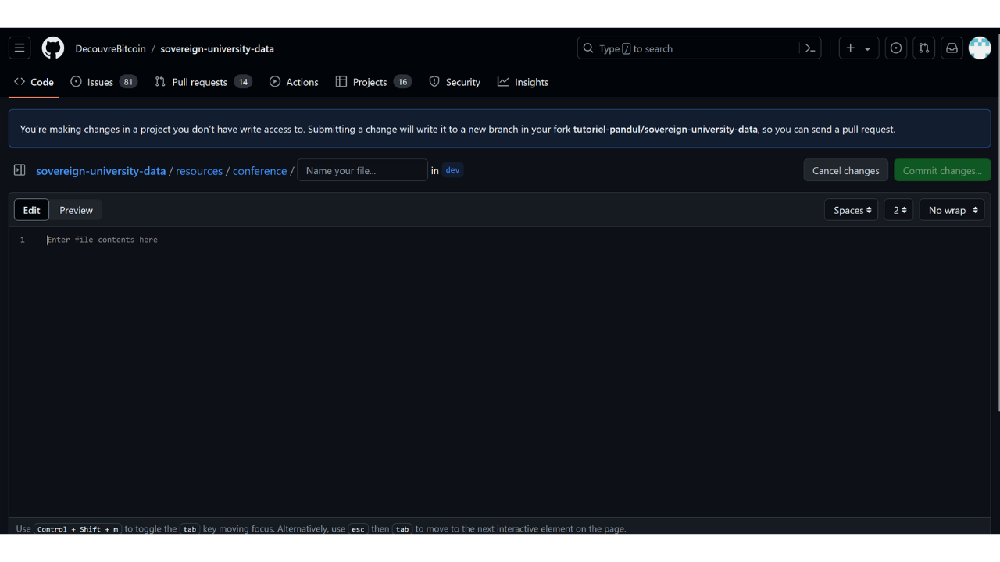
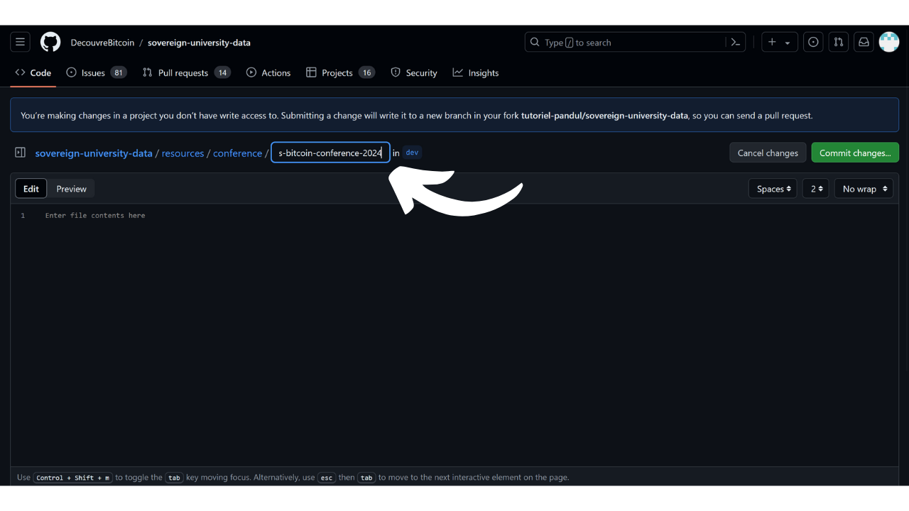
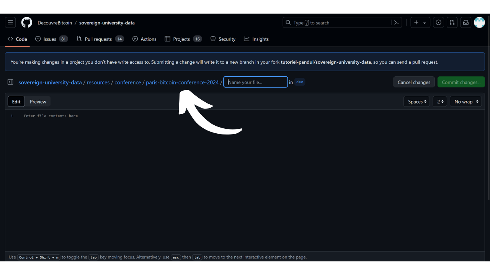

PlanB का मिशन है कि वह Bitcoin पर उच्च-स्तरीय शैक्षिक संसाधन जितनी अधिक भाषाओं में संभव हो, उपलब्ध कराए। साइट पर प्रकाशित सभी सामग्री ओपन-सोर्स है और GitHub पर होस्ट की गई है, जिससे कोई भी व्यक्ति इस प्लेटफ़ॉर्म को समृद्ध बनाने में योगदान दे सकता है।

क्या आप अपनी Bitcoin कॉन्फ्रेंस की रिकॉर्डिंग को PlanB नेटवर्क साइट पर जोड़ना चाहते हैं और इस इवेंट को अधिक लोगों तक पहुँचाना चाहते हैं, लेकिन आपको पता नहीं है कैसे? तो यह ट्यूटोरियल आपके लिए है!

हालांकि, अगर आप भविष्य में होने वाले किसी सम्मेलन को जोड़ना चाहते हैं, तो मैं आपको सलाह दूंगा कि आप इस दूसरे ट्यूटोरियल को पढ़ें जिसमें हम समझाते हैं कि साइट पर नया इवेंट कैसे जोड़ा जाए।

https://planb.network/tutorials/contribution/resource/add-event-1d3df554-c2d8-4e93-853f-58f672c5e097


- सबसे पहले, आपके पास GitHub पर एक खाता होना चाहिए। अगर आपको खाता बनाना नहीं आता, तो हमने आपकी मदद के लिए एक विस्तृत ट्यूटोरियल तैयार किया है।

https://planb.network/tutorials/contribution/others/create-github-account-a75fc39d-f0d0-44dc-9cd5-cd94aee0c07c

- [PlanB के डेटा के लिए समर्पित GitHub रिपॉजिटरी](https://github.com/PlanB-Network/Bitcoin-educational-content/tree/dev/resources/conference) के `resources/conference/` सेक्शन में जाएं:


- ऊपर दाईं ओर `Add file` बटन पर क्लिक करें, फिर `Create new file` पर क्लिक करें।


- यदि आपने पहले कभी PlanB Network की सामग्री में योगदान नहीं दिया है, तो आपको मूल रिपॉजिटरी का अपना Fork बनाना होगा। रिपॉजिटरी को फोर्क करने का मतलब है कि उस रिपॉजिटरी की एक कॉपी अपने GitHub अकाउंट पर बनाना, जिससे आप प्रोजेक्ट पर काम कर सकते हैं बिना मूल रिपॉजिटरी को प्रभावित किए। `Fork this repository` बटन पर क्लिक करें:


- इसके बाद आप GitHub संपादन पृष्ठ पर पहुँच जाएंगे:




- अपने सम्मेलन के लिए एक फोल्डर बनाएं। ऐसा करने के लिए, `अपने फाइल का नाम दें...` बॉक्स में, अपने सम्मेलन का नाम छोटे अक्षरों में लिखें और स्पेस की जगह डैश (-) का उपयोग करें। उदाहरण के लिए, अगर आपके सम्मेलन का नाम "Paris Bitcoin Conference" है, तो आपको `paris-Bitcoin-conference` लिखना चाहिए। इसके साथ ही अपने सम्मेलन का वर्ष भी जोड़ें, जैसे: `paris-Bitcoin-conference-2024`।




- फोल्डर बनाने की पुष्टि करने के लिए, बस अपने नाम के बाद उसी बॉक्स में एक स्लैश डालें, जैसे: `paris-Bitcoin-conference-2024/`। स्लैश जोड़ने से स्वचालित रूप से एक फोल्डर बन जाता है, न कि एक फाइल।




- इस फोल्डर में, आप एक पहला YAML फाइल बनाएंगे जिसका नाम होगा `conference.yml`:


इस फाइल को अपने सम्मेलन से संबंधित जानकारी से भरें, इस टेम्पलेट का उपयोग करते हुए:

```yaml
year:
name:
builder:
location:
language:
-
links:
website:
twitter:
tags:
-
-
```

उदाहरण के लिए, आपकी YAML फाइल कुछ इस तरह दिख सकती है:

```yaml
year: 2024-08
name: Paris Bitcoin Conference 2024
builder: Paris Bitcoin Conference
location: Paris, France
language:
- fr
- en
links:
website: https://paris.bitcoin.fr/conference
twitter: https://twitter.com/ParisBitcoinConference
tags:
- International
- All Public
```


यदि आपके संगठन के पास अभी तक "*बिल्डर*" पहचानकर्ता नहीं है, तो आप इसे जोड़ने के लिए इस अन्य ट्यूटोरियल का पालन कर सकते हैं।

https://planb.network/tutorials/contribution/resource/add-builder-b5834c46-6dcc-4064-8d68-1ef529991d3d

- जब आप इस फाइल में बदलाव कर लें, तो उन्हें `Commit changes...` बटन पर क्लिक करके सेव कर लें।


- अपने बदलावों के लिए एक शीर्षक जोड़ें, साथ ही एक संक्षिप्त विवरण भी दें:


- Green `परिवर्तन प्रस्तावित करें` बटन पर क्लिक करें:


- फिर आप एक पृष्ठ पर पहुँचेंगे जो आपके सभी बदलावों का सारांश प्रस्तुत करेगा।


- ऊपर दाईं ओर अपने GitHub प्रोफाइल चित्र पर क्लिक करें, फिर 'Your Repositories' पर क्लिक करें।


- अपने PlanB नेटवर्क रिपॉजिटरी का Fork चुनें:


- आपको विंडो के शीर्ष पर अपने नए ब्रांच के साथ एक सूचना दिखाई देनी चाहिए। इसे शायद `patch-1` कहा जाता है। इस पर क्लिक करें:


- आप अब अपनी कार्यशील शाखा पर हैं:


- `resources/conference/` फोल्डर में वापस जाएं और उस फोल्डर को चुनें जो आपने पिछले कमिट में अपने कॉन्फ्रेंस के लिए बनाया था।


- अपने सम्मेलन के फोल्डर में, `Add file` बटन पर क्लिक करें, फिर `Create new file` पर क्लिक करें।


- इस नए फोल्डर का नाम `assets` रखें और इसके बनने की पुष्टि करने के लिए अंत में एक स्लैश `/` लगाएं:


- इस `assets` फोल्डर में एक फाइल बनाएं जिसका नाम हो `.gitkeep`:


- 'परिवर्तन सहेजें...' बटन पर क्लिक करें।


- कमिट शीर्षक को डिफ़ॉल्ट पर छोड़ दें, और सुनिश्चित करें कि `Commit directly to the patch-1 branch` बॉक्स चेक किया हुआ है, फिर `Commit changes` पर क्लिक करें।


- `assets` फोल्डर में वापस जाएं:


- 'फाइल जोड़ें' बटन पर क्लिक करें, फिर 'फाइल अपलोड करें' पर क्लिक करें।


- एक नया पेज खुलेगा। उस पर अपनी कॉन्फ्रेंस का प्रतिनिधित्व करने वाली छवि को खींचकर छोड़ें, जो PlanB नेटवर्क साइट पर दिखाई जाएगी: 
- यह एक लोगो हो सकता है, एक थंबनेल, या यहाँ तक कि एक पोस्टर भी।


- जब छवि अपलोड हो जाए, तो यह सुनिश्चित करें कि `Commit directly to the patch-1 branch` बॉक्स चेक किया हुआ है, फिर `Commit changes` पर क्लिक करें।


- सावधान रहें, आपकी छवि का नाम `thumbnail` होना चाहिए और यह `.webp` फॉर्मेट में होनी चाहिए। इसलिए पूरी फाइल का नाम होना चाहिए: `thumbnail.webp`।


- अपने `assets` फोल्डर में वापस जाएं और `.gitkeep` मध्यवर्ती फ़ाइल पर क्लिक करें:


- फाइल पर जाने के बाद, ऊपर दाईं ओर तीन छोटे बिंदुओं पर क्लिक करें, फिर 'फाइल हटाएं' पर क्लिक करें।


- यह सुनिश्चित करें कि आप अभी भी उसी कार्यशील शाखा पर हैं, फिर 'Commit changes' बटन पर क्लिक करें।


- अपने कमिट को एक शीर्षक और विवरण दें, फिर 'Commit changes' पर क्लिक करें:


- अपने सम्मेलन फ़ोल्डर में वापस जाएँ:


- `Add file` बटन पर क्लिक करें, फिर `Create new file` पर क्लिक करें:


- अपने मूल भाषा के संकेतक के साथ एक नया मार्कडाउन (.md) फ़ाइल बनाएं। इस फ़ाइल का उपयोग आपके सम्मेलन के रिप्ले के लिए किया जाएगा। उदाहरण के लिए, अगर मैं सम्मेलनों के विवरण अंग्रेज़ी में लिखना चाहता हूँ, तो मैं इस फ़ाइल का नाम en.md रखूँगा।


- इस मार्कडाउन फाइल को इस टेम्पलेट का उपयोग करके भरें, जिसे आप अपनी कॉन्फ्रेंस की सेटिंग के अनुसार अनुकूलित कर सकते हैं:

```markdown
---
name: Paris Bitcoin Conference 2024
description: The largest Bitcoin conference in France with over 8,000 participants each year!
---
# Main Stage
## Friday morning

## Friday afternoon

## Saturday morning

## Saturday afternoon

# Workshop Room
## The Future of Bitcoin Mining: Challenges and Innovations

Speaker: Satoshi Nakamoto, Satoshi Nakamoto
## Is Privacy Still Possible On Bitcoin?

Speaker: Satoshi Nakamoto
## Bitcoin Core: Deep Dive into the Codebase

Speaker: Satoshi Nakamoto, Satoshi Nakamoto, Satoshi Nakamoto, Satoshi Nakamoto
## Building and Securing Bitcoin Wallets With Miniscript

Speaker: Satoshi Nakamoto
```


- अपने दस्तावेज़ की शुरुआत में, "फ्रंट मैटर" में, `name:` फील्ड में अपने सम्मेलन का नाम और रिप्ले का वर्ष भरें। `description:` फील्ड में, अपनी घटना का एक संक्षिप्त विवरण उस भाषा में लिखें जिसमें फाइल है। उदाहरण के लिए, यदि फाइल का नाम `en.md` है, तो विवरण अंग्रेज़ी में होना चाहिए। PlanB नेटवर्क टीम आपके विवरण का अनुवाद अपने मॉडल का उपयोग करके करेगी।
- पहले स्तर के शीर्षक, जिन्हें `#` से चिह्नित किया जाता है, का उपयोग सम्मेलन को दृश्यों के अनुसार व्यवस्थित करने के लिए किया जाता है। उदाहरण के लिए, मुख्य मंच के लिए `# मुख्य मंच` और कार्यशालाओं के लिए समर्पित मंच के लिए `# कार्यशाला कक्ष`।
- दूसरे स्तर के शीर्षक, जो दोहरे `##` से चिन्हित होते हैं, का उपयोग विभिन्न रिप्ले वीडियो को अलग करने के लिए किया जाता है। अगर कॉन्फ्रेंस को आधे दिन के दौरान लगातार फिल्माया गया था, तो उदाहरण के लिए, `## शुक्रवार सुबह` लिखें। अगर कॉन्फ्रेंस को व्यक्तिगत रूप से फिल्माया और प्रसारित किया गया था, तो सीधे कॉन्फ्रेंस का नाम दूसरे स्तर के शीर्षक के साथ दें।
- हर दूसरे स्तर के शीर्षक के नीचे, संबंधित रिप्ले वीडियो का लिंक डालें। इसका सिंटैक्स इस प्रकार होना चाहिए: ``, जहाँ `XXXXXXXXXXXX` को असली वीडियो लिंक से बदलें।
- यदि प्रारूप अनुमति देता है (व्यक्तिगत सम्मेलन), तो आप वक्ताओं के नाम जोड़ सकते हैं। इसके लिए, वीडियो लिंक के नीचे `वक्ता:` फ़ील्ड जोड़ें और उसके बाद वक्ता का नाम या उपनाम लिखें। यदि कई वक्ता हों, तो प्रत्येक नाम को अल्पविराम से अलग करें, जैसे उदाहरण के लिए: `वक्ता: Satoshi Nakamoto, Satoshi Nakamoto, Satoshi Nakamoto, Satoshi Nakamoto`।

---

- जब इस फाइल में आपके द्वारा किए गए बदलाव पूरे हो जाएं, तो उन्हें `Commit changes...` बटन पर क्लिक करके सेव कर लें।


- अपने संशोधनों के लिए एक शीर्षक जोड़ें, साथ ही एक संक्षिप्त विवरण भी दें:


- 'परिवर्तन सहेजें' पर क्लिक करें।


- आपका सम्मेलन फ़ोल्डर अब इस तरह दिखना चाहिए:


- यदि सब कुछ आपकी संतुष्टि के अनुसार है, तो अपने Fork की जड़ पर वापस जाएँ।


- आपको एक संदेश दिखाई देना चाहिए जो यह दर्शाता है कि आपकी शाखा में बदलाव हुए हैं। `Compare & pull request` बटन पर क्लिक करें:


- अपने पीआर के लिए एक स्पष्ट शीर्षक और विवरण जोड़ें:


- 'पुल रिक्वेस्ट बनाएं' बटन पर क्लिक करें।


बधाई हो! आपका पीआर सफलतापूर्वक बना लिया गया है। अब एक प्रशासक इसे देखेगा और अगर सब कुछ सही पाया गया, तो इसे PlanB नेटवर्क के मुख्य भंडार में मिला दिया जाएगा। कुछ दिनों बाद आपको अपनी कॉन्फ्रेंस के रिप्ले वेबसाइट पर दिखाई देने लगेंगे।

कृपया अपने PR की प्रगति पर नज़र रखें। यह संभव है कि कोई प्रशासक अतिरिक्त जानकारी मांगते हुए टिप्पणी छोड़ सकता है। जब तक आपका PR मान्य नहीं हो जाता, आप इसे PlanB नेटवर्क के GitHub रिपॉजिटरी के `Pull requests` टैब के तहत देख सकते हैं।


आपके मूल्यवान योगदान के लिए बहुत-बहुत धन्यवाद! :)