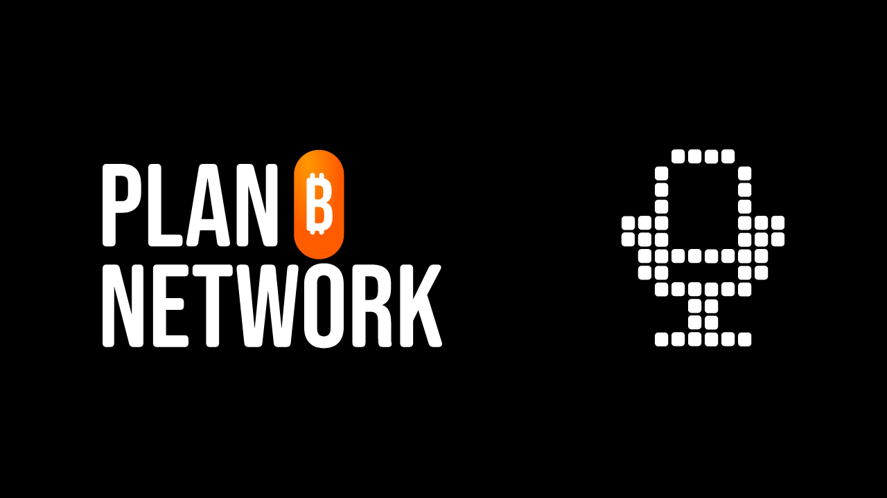
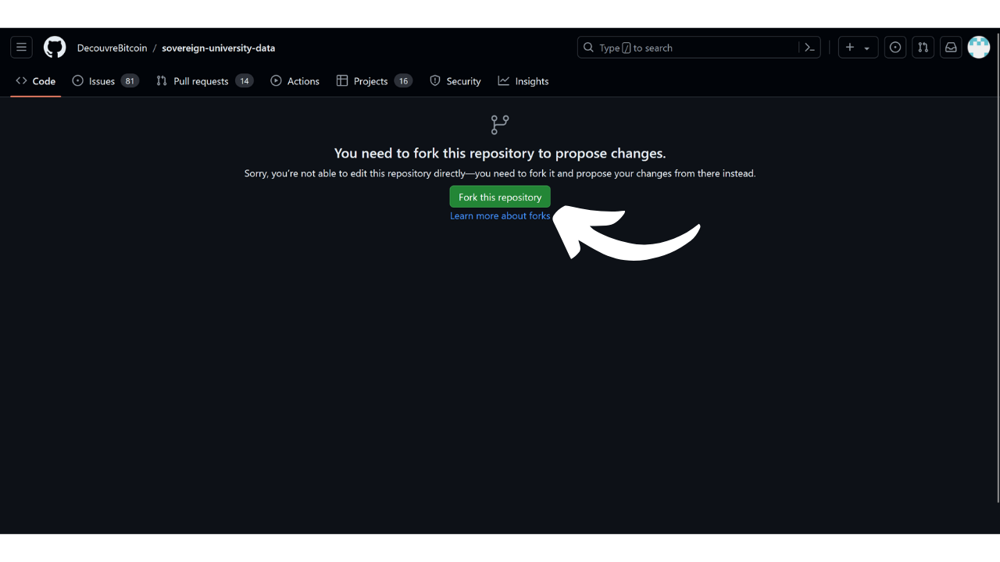
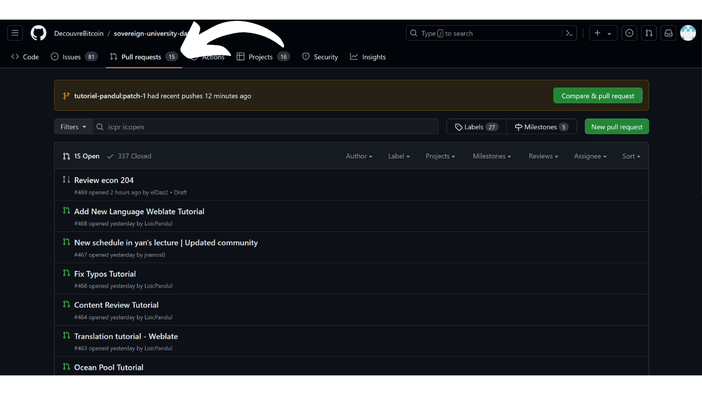

PlanB का मिशन है कि Bitcoin पर उच्च स्तरीय शैक्षिक संसाधन जितनी अधिक भाषाओं में हो सके, उपलब्ध कराए जाएं। साइट पर प्रकाशित सभी सामग्री ओपन-सोर्स है और GitHub पर होस्ट की गई है, जिससे किसी को भी इस प्लेटफॉर्म को समृद्ध बनाने में योगदान देने का अवसर मिलता है।

अगर आप PlanB Network साइट पर Bitcoin सम्मेलन जोड़ना चाहते हैं और अपने इवेंट की दृश्यता बढ़ाना चाहते हैं, लेकिन आपको नहीं पता कैसे? तो यह ट्यूटोरियल आपके लिए है!


- सबसे पहले, आपके पास GitHub पर एक खाता होना चाहिए। अगर आपको खाता बनाना नहीं आता है, तो हमने आपकी मदद के लिए एक विस्तृत ट्यूटोरियल तैयार किया है।

https://planb.network/tutorials/contribution/others/create-github-account-a75fc39d-f0d0-44dc-9cd5-cd94aee0c07c

- [PlanB के डेटा के लिए समर्पित GitHub रिपॉजिटरी](https://github.com/PlanB-Network/Bitcoin-educational-content/tree/dev/resources/conference) में `resources/conference/` सेक्शन पर जाएं:


- ऊपरी दाएँ कोने में `Add file` बटन पर क्लिक करें, फिर `Create new file` पर क्लिक करें।


- यदि आपने पहले कभी PlanB Network की सामग्री में योगदान नहीं दिया है, तो आपको मूल रिपॉजिटरी का अपना Fork बनाना होगा। रिपॉजिटरी को फोर्क करने का मतलब है कि उस रिपॉजिटरी की एक कॉपी अपने GitHub खाते पर बनाना, जिससे आप प्रोजेक्ट पर काम कर सकते हैं बिना मूल रिपॉजिटरी को प्रभावित किए। `Fork इस रिपॉजिटरी` बटन पर क्लिक करें:




- इसके बाद आप GitHub संपादन पृष्ठ पर पहुँच जाएंगे:


- अपने सम्मेलन के लिए एक फोल्डर बनाएं। ऐसा करने के लिए, `Name your file...` बॉक्स में अपने सम्मेलन का नाम छोटे अक्षरों में लिखें और स्पेस की जगह डैश का उपयोग करें। उदाहरण के लिए, अगर आपके सम्मेलन का नाम "Paris Bitcoin Conference" है, तो आपको `paris-Bitcoin-conference` लिखना चाहिए। इसके साथ ही अपने सम्मेलन का वर्ष भी जोड़ें, जैसे: `paris-Bitcoin-conference-2024`।


- फोल्डर बनाने की पुष्टि करने के लिए, बस अपने नाम के बाद उसी बॉक्स में एक स्लैश डालें, जैसे: `paris-Bitcoin-conference-2024/`। स्लैश जोड़ने से स्वचालित रूप से एक फोल्डर बन जाता है, न कि एक फाइल।


- इस फोल्डर में, आप एक पहला YAML फाइल बनाएंगे जिसका नाम होगा `events.yml`:


- इस फाइल को अपने सम्मेलन की जानकारी से इस टेम्पलेट का उपयोग करके भरें:

```yaml
start_date:
end_date:
address_line_1:
address_line_2:
address_line_3:
name:
builder:
type: conference
book_online: false
book_in_person: false
price_dollars: 0
description:
language:
-
links:
website:
replay_url:
live_url :
tags:
-
```

उदाहरण के लिए, आपकी YAML फाइल कुछ इस तरह दिख सकती है:

```yaml
start_date: 2024-08-15
end_date: 2024-08-18
address_line_1: Paris, France
address_line_2:
address_line_3:
name: Paris Bitcoin Conference 2024
builder: Paris Bitcoin Conference
type: conference
book_online: false
book_in_person: false
price_dollars: 0
description: The largest Bitcoin conference in France with over 8,000 participants each year!
language:
- fr
- en
- es
- it
links:
website: https://paris.bitcoin.fr/conference
replay_url:
live_url :
tags:
- Bitcoiner
- General
- International
```


अगर आपके संगठन के पास अभी तक "*builder*" पहचानकर्ता नहीं है, तो आप इसे जोड़ने के लिए इस दूसरे ट्यूटोरियल का पालन कर सकते हैं।

https://planb.network/tutorials/contribution/resource/add-builder-b5834c46-6dcc-4064-8d68-1ef529991d3d

- जब आप इस फाइल में बदलाव कर लें, तो उन्हें `Commit changes...` बटन पर क्लिक करके सेव कर लें।


- अपने बदलावों के लिए एक शीर्षक जोड़ें, साथ ही एक संक्षिप्त विवरण भी दें:


- Green `परिवर्तन प्रस्तावित करें` बटन पर क्लिक करें:


- फिर आप एक पृष्ठ पर पहुँचेंगे जो आपके सभी बदलावों का सारांश प्रस्तुत करेगा।


- ऊपर दाईं ओर अपने GitHub प्रोफाइल चित्र पर क्लिक करें, फिर 'Your Repositories' पर क्लिक करें।


- अपने PlanB नेटवर्क रिपॉजिटरी का Fork चुनें:


- आपको विंडो के शीर्ष पर एक सूचना दिखाई देनी चाहिए जिसमें आपकी नई शाखा का नाम होगा। यह शायद `patch-1` कहलाती है। इस पर क्लिक करें:


- आप अब अपनी कार्यशील शाखा पर हैं:


- `resources/conference/` फोल्डर में वापस जाएं और उस कॉन्फ्रेंस के फोल्डर को चुनें जिसे आपने पिछले कमिट में अभी-अभी बनाया था।


- अपने सम्मेलन के फोल्डर में, `Add file` बटन पर क्लिक करें, फिर `Create new file` पर क्लिक करें:


- इस नए फोल्डर का नाम `assets` रखें और इसके बनने की पुष्टि करने के लिए अंत में एक स्लैश `/` लगाएं:


- इस `assets` फोल्डर में एक फाइल बनाएं जिसका नाम हो `.gitkeep`:


- 'परिवर्तन सहेजें...' बटन पर क्लिक करें:


- कृपया कमिट शीर्षक को डिफ़ॉल्ट पर छोड़ दें, और सुनिश्चित करें कि `Commit directly to the patch-1 branch` बॉक्स चेक किया हुआ है, फिर `Commit changes` पर क्लिक करें।


- `assets` फोल्डर में वापस जाएं:


- `Add file` बटन पर क्लिक करें, फिर `Upload files` पर क्लिक करें: 
- एक नया पेज खुलेगा। उस पर अपनी कॉन्फ्रेंस का प्रतिनिधित्व करने वाली एक छवि को खींचकर छोड़ें, जो PlanB नेटवर्क साइट पर दिखाई जाएगी।


- यह एक लोगो हो सकता है, एक थंबनेल, या फिर एक पोस्टर भी।


- जब छवि अपलोड हो जाए, तो यह सुनिश्चित करें कि `Commit directly to the patch-1 branch` बॉक्स पर टिक लगा हुआ है, फिर `Commit changes` पर क्लिक करें।


- सावधान रहें, आपकी छवि का नाम `thumbnail` होना चाहिए और यह `.webp` फॉर्मेट में होनी चाहिए। इसलिए पूरी फाइल का नाम इस प्रकार होना चाहिए: `thumbnail.webp`।


- अपने `assets` फोल्डर में वापस जाएं और मध्यवर्ती फाइल `.gitkeep` पर क्लिक करें:


- फाइल पर जाने के बाद, ऊपर दाईं ओर तीन छोटे बिंदुओं पर क्लिक करें और फिर 'फाइल हटाएं' पर क्लिक करें।


- सुनिश्चित करें कि आप अभी भी उसी कार्यशील शाखा पर हैं, फिर 'Commit changes' बटन पर क्लिक करें।


- अपने कमिट को एक शीर्षक और विवरण दें, फिर 'Commit changes' पर क्लिक करें:


- अपनी रिपॉजिटरी की जड़ में वापस जाएं:


- आपको एक संदेश दिखाई देना चाहिए जो यह दर्शाता है कि आपकी शाखा में बदलाव हुए हैं। `Compare & pull request` बटन पर क्लिक करें:


- अपने PR के लिए एक स्पष्ट शीर्षक और विवरण जोड़ें:


- 'पुल रिक्वेस्ट बनाएं' बटन पर क्लिक करें।


बधाई हो! आपका पीआर सफलतापूर्वक बना लिया गया है। अब एक प्रशासक इसे जांचेगा और अगर सब कुछ सही पाया गया, तो इसे PlanB नेटवर्क के मुख्य रिपॉजिटरी में मिला दिया जाएगा। कुछ दिनों बाद आपको अपनी घटना वेबसाइट पर दिखाई देनी चाहिए।

अपने पीआर की प्रगति पर नज़र रखना सुनिश्चित करें। एक व्यवस्थापक अतिरिक्त जानकारी मांगते हुए टिप्पणी छोड़ सकता है। जब तक आपका पीआर मान्य नहीं हो जाता, आप इसे PlanB Network GitHub रिपॉजिटरी के `Pull requests` टैब में देख सकते हैं।



आपके मूल्यवान योगदान के लिए बहुत-बहुत धन्यवाद! :)