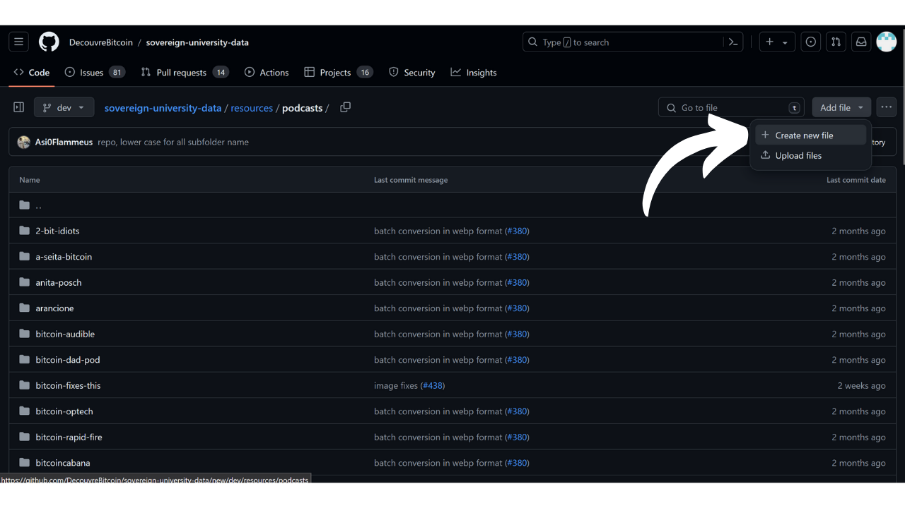
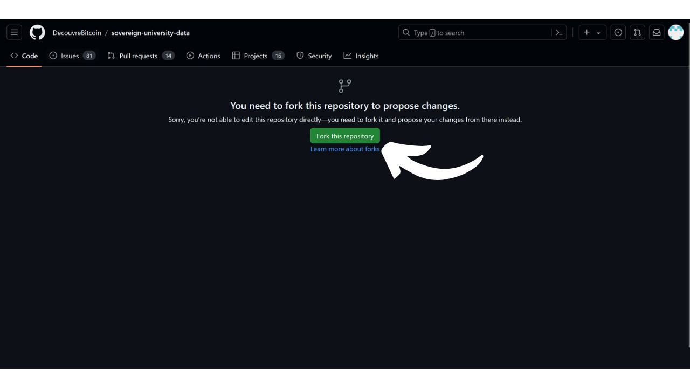
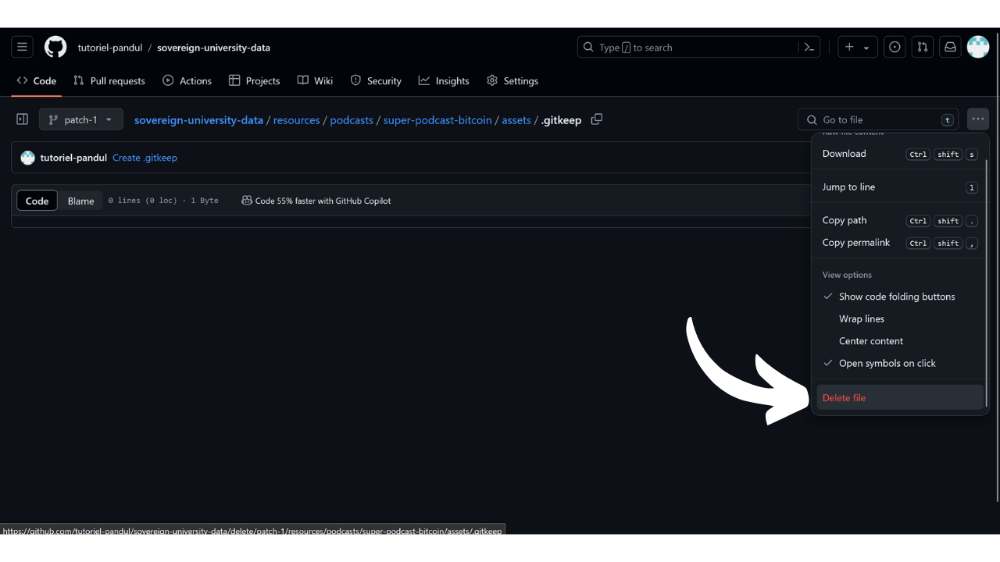

A missão da PlanB é fornecer recursos educacionais de primeira linha sobre Bitcoin em tantos idiomas quanto possível. Todo o conteúdo publicado no site é de código aberto e hospedado no GitHub, permitindo que qualquer pessoa participe do enriquecimento da plataforma.

Você está procurando adicionar um podcast sobre Bitcoin ao site da Rede PlanB e aumentar a visibilidade do seu programa, mas não sabe como? Este tutorial é para você!

- Primeiro, você precisa ter uma conta no GitHub. Se você não sabe como criar uma, fizemos um tutorial detalhado para guiá-lo.

https://planb.network/tutorials/contribution/others/create-github-account-a75fc39d-f0d0-44dc-9cd5-cd94aee0c07c


- Vá para [o repositório GitHub da PlanB dedicado a dados](https://github.com/PlanB-Network/bitcoin-educational-content/tree/dev/resources/podcasts) na seção `resources/podcasts/`:

- Clique no canto superior direito no botão `Add file`, depois em `Create new file`:

- Se você nunca contribuiu para o conteúdo da Rede PlanB antes, precisará criar seu fork do repositório original. Fazer um fork de um repositório significa criar uma cópia desse repositório em sua própria conta do GitHub, permitindo que você trabalhe no projeto sem afetar o repositório original. Clique no botão `Fork this repository`:

- Você então chegará à página de edição do GitHub:

- Crie uma pasta para o seu podcast. Para fazer isso, na caixa `Name your file...`, escreva o nome do seu podcast em letras minúsculas com hífens no lugar de espaços. Por exemplo, se seu programa se chama "Super Podcast Bitcoin", você deve escrever `super-podcast-bitcoin`:

- Para validar a criação da pasta, simplesmente adicione uma barra após o nome do seu podcast na mesma caixa, por exemplo: `super-podcast-bitcoin/`. Adicionar uma barra cria automaticamente uma pasta em vez de um arquivo:

- Nesta pasta, você criará um primeiro arquivo YAML chamado `podcast.yml`:

- Preencha este arquivo com informações sobre o seu podcast usando este modelo:

```yaml
name: 
host: 
language: 
links:
  podcast: 
  twitter: 
  website: 
description: |
  
tags:
  - 
  - 
contributors:
  - 
```

Aqui estão os detalhes para preencher em cada campo:

- **`name`**: Indique o nome do seu podcast.
- **`host`**: Liste os nomes ou pseudônimos dos palestrantes ou do apresentador do podcast. Cada nome deve ser separado por uma vírgula.
- **`language`**: Indique o código de idioma da língua falada no seu podcast. Por exemplo, para inglês, anote `en`, para italiano `it`...

- **`links`**: Forneça links para o seu conteúdo. Você tem duas opções:
	- `podcast`: o link para o seu podcast,
	- `twitter`: o link para o perfil no Twitter do podcast ou da organização que o produz,
	- `website`: o link para o site do podcast ou da organização que o produz.
- **`description`**: Adicione um curto parágrafo que descreve o seu podcast. A descrição deve estar no mesmo idioma indicado no campo `language:`.
- **`tags`**: Adicione duas tags associadas ao seu podcast. Exemplos:
    - `bitcoin`
    - `tecnologia`
    - `economia`
    - `educação`...

- **`contributors`**: Mencione o seu ID de contribuidor se você tiver um.

Por exemplo, seu arquivo YAML poderia ficar assim:

```yaml
name: Super Podcast Bitcoin
host: Rogzy, JohnOnChain, Lounes, Fanis, Ajlex, Guillaume, Pantamis, Sosthene, Loic
language: pt
links:
  podcast: https://podcasts.apple.com/us/podcast/decouvrebitcoin-replay/id1693844092
  twitter: https://twitter.com/decouvrebitcoin
  website: https://decouvrebitcoin.fr
description: |
  Super Podcast Bitcoin é uma sessão técnica AO VIVO realizada uma vez por semana no Twitter para explorar profundamente o protocolo Bitcoin, soluções de segunda camada e tudo que impressiona. Nossos apresentadores Lounes, Pantamis, Loïc e Sosthene responderão suas perguntas e oferecerão o show mais técnico sobre Bitcoin do mundo.

tags:
  - bitcoin
  - tecnologia
contributors:
  - rabbit-hole
```


- Uma vez que você tenha terminado de fazer alterações neste arquivo, salve-as clicando no botão `Commit changes...`:

- Adicione um título para suas alterações, bem como uma breve description:

- Clique no botão verde `Propose changes`:

- Você então chegará em uma página que resume todas as suas alterações:

- Clique na foto do seu perfil do GitHub no canto superior direito, depois em `Your Repositories`:

- Selecione o seu fork do repositório PlanB Network:

- Você deverá ver uma notificação no topo da janela com o seu novo branch. Provavelmente se chama `patch-1`. Clique nele:

- Você está agora no seu branch de trabalho:

- Volte para a pasta `resources/podcast/` e selecione a pasta do podcast que você acabou de criar no commit anterior: 
- Na sua pasta do podcast, clique no botão `Add file`, depois em `Create new file`:

- Nomeie esta nova pasta como `assets` e confirme sua criação adicionando uma barra `/` no final:

- Nesta pasta `assets`, crie um arquivo chamado `.gitkeep`:

- Clique no botão `Commit changes...`:

- Deixe o título do commit como padrão, e certifique-se de que a caixa `Commit directly to the patch-1 branch` esteja marcada, então clique em `Commit changes`:

- Retorne para a pasta `assets`:

- Clique no botão `Add file`, depois em `Upload files`:

- Uma nova página será aberta. Arraste e solte o logo do seu podcast na área indicada. Esta imagem será exibida no site da Rede PlanB: 
- Tenha cuidado, a imagem deve ser quadrada, para se ajustar melhor ao nosso site: 
- Uma vez que a imagem esteja carregada, verifique se a caixa `Commit directly to the patch-1 branch` está marcada, então clique em `Commit changes`: 
- Tenha cuidado, sua imagem deve ser nomeada `logo` e deve estar no formato `.webp`. Portanto, o nome completo do arquivo deve ser: `logo.webp`: 
- Retorne à sua pasta `assets` e clique no arquivo intermediário `.gitkeep`: 
- Uma vez no arquivo, clique nos três pequenos pontos no canto superior direito e depois em `Delete file`: 
- Verifique se você ainda está na mesma branch de trabalho, então clique no botão `Commit changes`: 
- Adicione um título e descrição ao seu commit, então clique em `Commit changes`: 
- Volte à raiz do seu repositório: 
- Você deverá ver uma mensagem indicando que sua branch sofreu alterações. Clique no botão `Compare & pull request`: 
- Adicione um título claro e descrição ao seu PR: 
- Clique no botão `Create pull request`: 
Parabéns! Seu PR foi criado com sucesso. Um administrador agora irá revisá-lo e, se tudo estiver em ordem, mesclá-lo ao repositório principal da Rede PlanB. Você deverá ver seu podcast aparecer no site alguns dias depois.

Por favor, certifique-se de acompanhar o progresso do seu PR. Um administrador pode deixar um comentário pedindo informações adicionais. Enquanto seu PR não for validado, você pode visualizá-lo na aba `Pull requests` no repositório GitHub da Rede PlanB: 
Muito obrigado pela sua valiosa contribuição! :)
