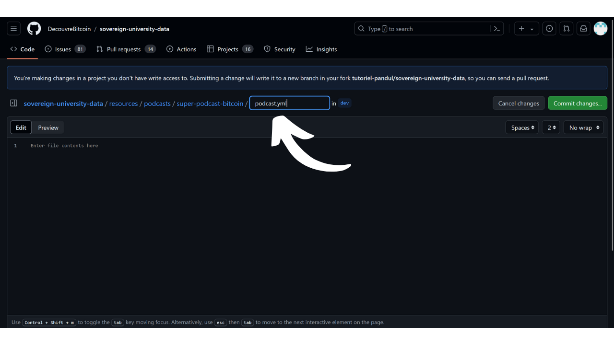
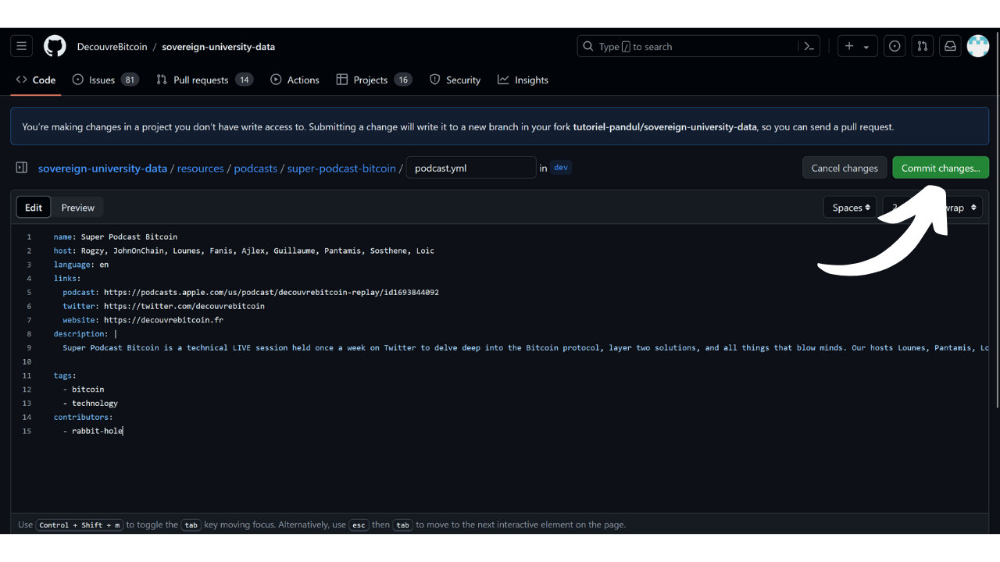
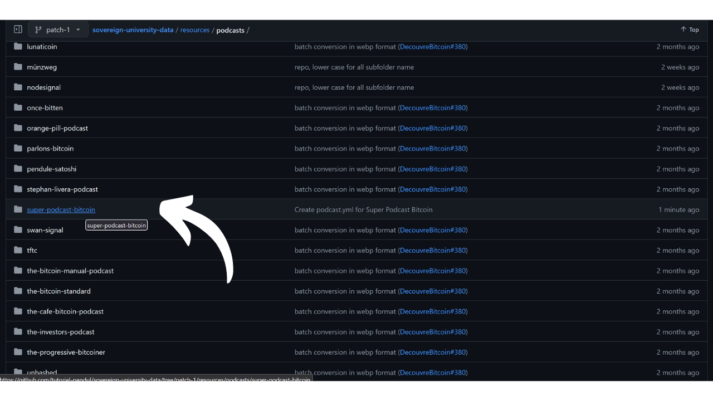
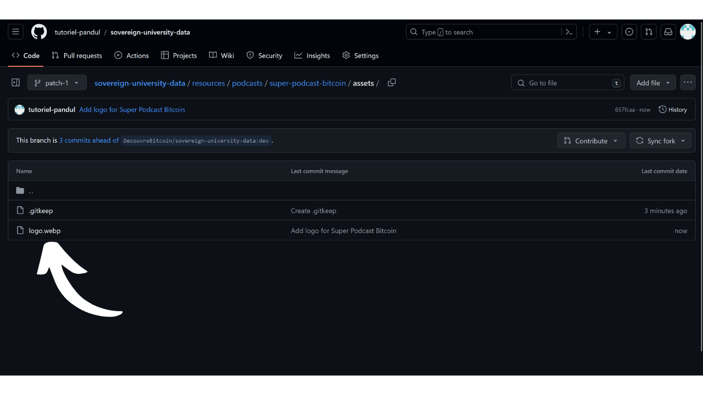
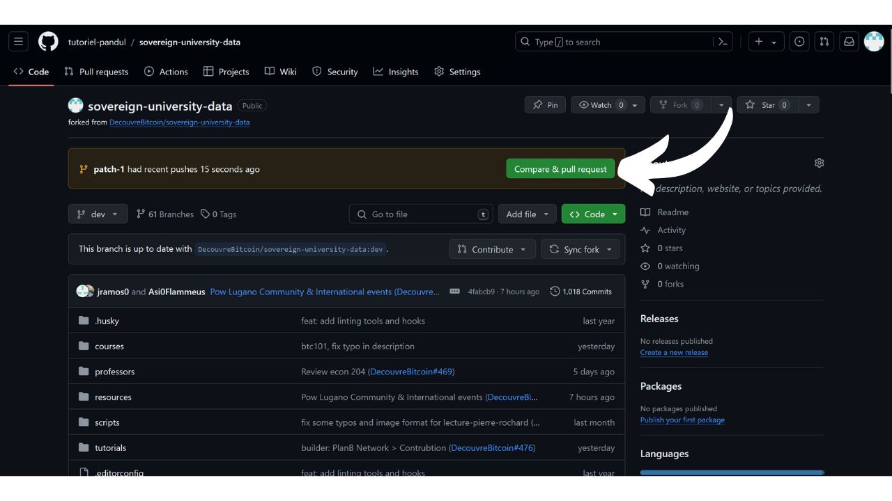

Sứ mệnh của PlanB là cung cấp nguồn tài nguyên giáo dục hàng đầu về Bitcoin bằng càng nhiều ngôn ngữ khác nhau càng tốt. Tất cả nội dung được công bố trên trang web đều là mã nguồn mở và được lưu trữ trên GitHub, cho phép bất kỳ ai cũng có thể tham gia vào việc làm giàu cho nền tảng.

Bạn đang muốn thêm podcast về Bitcoin của mình vào trang web Mạng PlanB và tăng độ nhìn thấy cho chương trình của bạn, nhưng không biết làm thế nào? Hướng dẫn này dành cho bạn!

- Đầu tiên, bạn cần có một tài khoản GitHub. Nếu bạn không biết cách tạo một tài khoản, chúng tôi đã tạo một hướng dẫn chi tiết để hướng dẫn bạn.

https://planb.network/tutorials/contribution/others/create-github-account-a75fc39d-f0d0-44dc-9cd5-cd94aee0c07c


- Truy cập vào [kho lưu trữ GitHub của PlanB dành cho dữ liệu](https://github.com/PlanB-Network/bitcoin-educational-content/tree/dev/resources/podcasts) trong phần `resources/podcasts/`:

- Nhấp vào nút `Add file` ở góc trên bên phải, sau đó chọn `Create new file`:

- Nếu bạn chưa bao giờ đóng góp nội dung cho Mạng PlanB trước đây, bạn sẽ cần tạo một bản sao (fork) của kho lưu trữ gốc. Fork một kho lưu trữ có nghĩa là tạo một bản sao của kho lưu trữ đó trên tài khoản GitHub của bạn, cho phép bạn làm việc trên dự án mà không ảnh hưởng đến kho lưu trữ gốc. Nhấp vào nút `Fork this repository`:

- Bạn sẽ được chuyển đến trang chỉnh sửa GitHub:

- Tạo một thư mục cho podcast của bạn. Để làm điều này, trong ô `Name your file...`, viết tên của podcast của bạn bằng chữ thường và dùng dấu gạch nối thay cho khoảng trắng. Ví dụ, nếu chương trình của bạn có tên là "Super Podcast Bitcoin", bạn nên viết `super-podcast-bitcoin`:

- Để xác nhận việc tạo thư mục, chỉ cần thêm một dấu gạch chéo sau tên podcast của bạn trong cùng một ô, ví dụ: `super-podcast-bitcoin/`. Thêm một dấu gạch chéo tự động tạo một thư mục thay vì một tệp:

- Trong thư mục này, bạn sẽ tạo một tệp YAML đầu tiên có tên `podcast.yml`:

- Điền vào tệp này với thông tin về podcast của bạn sử dụng mẫu này:

```yaml
name: 
host: 
language: 
links:
  podcast: 
  twitter: 
  website: 
description: |
  
tags:
  - 
  - 
contributors:
  - 
```

Dưới đây là chi tiết cần điền cho mỗi trường:

- **`name`**: Chỉ ra tên của podcast của bạn.
- **`host`**: Liệt kê tên hoặc bí danh của các diễn giả hoặc người dẫn chương trình. Mỗi tên nên được phân tách bằng dấu phẩy.
- **`language`**: Chỉ ra mã ngôn ngữ của ngôn ngữ được sử dụng trong podcast của bạn. Ví dụ, cho tiếng Anh, ghi `en`, cho tiếng Ý `it`...

- **`links`**: Cung cấp liên kết đến nội dung của bạn. Bạn có hai lựa chọn:
	- `podcast`: liên kết đến podcast của bạn,
	- `twitter`: liên kết đến hồ sơ Twitter của podcast hoặc tổ chức sản xuất nó,
	- `website`: liên kết đến trang web của podcast hoặc tổ chức sản xuất nó.
- **`description`**: Thêm một đoạn văn ngắn mô tả về podcast của bạn. Mô tả phải được viết bằng ngôn ngữ được chỉ định trong trường `language:`.
- **`tags`**: Thêm hai thẻ liên quan đến podcast của bạn. Ví dụ:
    - `bitcoin`
    - `công nghệ`
    - `kinh tế`
    - `giáo dục`...

- **`contributors`**: Nêu ID người đóng góp của bạn nếu bạn có.

Ví dụ, tệp YAML của bạn có thể trông như thế này:

```yaml
name: Super Podcast Bitcoin
host: Rogzy, JohnOnChain, Lounes, Fanis, Ajlex, Guillaume, Pantamis, Sosthene, Loic
language: en
links:
  podcast: https://podcasts.apple.com/us/podcast/decouvrebitcoin-replay/id1693844092
  twitter: https://twitter.com/decouvrebitcoin
  website: https://decouvrebitcoin.fr
description: |
  Super Podcast Bitcoin là một phiên trực tiếp kỹ thuật được tổ chức hàng tuần trên Twitter để đi sâu vào giao thức Bitcoin, các giải pháp tầng hai, và tất cả những điều làm cho tâm trí bạn bùng nổ. Các MC Lounes, Pantamis, Loïc, và Sosthene sẽ trả lời câu hỏi của bạn và cung cấp chương trình kỹ thuật nhất về Bitcoin trên thế giới.

tags:
  - bitcoin
  - công nghệ
contributors:
  - rabbit-hole
```


- Sau khi bạn hoàn thành việc chỉnh sửa tệp này, hãy lưu chúng bằng cách nhấp vào nút `Commit changes...`:

- Thêm một tiêu đề cho các thay đổi của bạn, cũng như một mô tả ngắn gọn:

- Nhấp vào nút màu xanh `Propose changes`:

- Bạn sẽ đến trang tóm tắt tất cả các thay đổi của bạn:

- Nhấp vào ảnh đại diện GitHub của bạn ở góc trên bên phải, sau đó vào `Your Repositories`:

- Chọn fork của bạn từ kho lưu trữ PlanB Network:

- Bạn sẽ thấy một thông báo ở đầu cửa sổ với nhánh mới của bạn. Có thể nó được gọi là `patch-1`. Nhấp vào nó:

- Bây giờ bạn đang ở trên nhánh làm việc của mình:

- Quay lại thư mục `resources/podcast/` và chọn thư mục podcast bạn vừa tạo trong commit trước: 
- Trong thư mục podcast của bạn, nhấp vào nút `Add file`, sau đó vào `Create new file`:

- Đặt tên thư mục mới này là `assets` và xác nhận việc tạo nó bằng cách thêm một dấu gạch chéo `/` ở cuối:

- Trong thư mục `assets` này, tạo một tệp tên là `.gitkeep`:

- Nhấp vào nút `Commit changes...`:

- Giữ tiêu đề commit mặc định, và đảm bảo rằng ô `Commit directly to the patch-1 branch` được chọn, sau đó nhấp vào `Commit changes`:

- Quay lại thư mục `assets`:

- Nhấp vào nút `Add file`, sau đó vào `Upload files`:

- Một trang mới sẽ được mở. Kéo và thả logo podcast của bạn vào khu vực này. Hình ảnh này sẽ được hiển thị trên trang web của Mạng PlanB: 
- Hãy cẩn thận, hình ảnh phải có dạng vuông, để phù hợp nhất với trang web của chúng tôi: 
- Sau khi hình ảnh được tải lên, xác nhận rằng ô `Commit directly to the patch-1 branch` đã được chọn, sau đó nhấn vào `Commit changes`: 
- Hãy cẩn thận, hình ảnh của bạn phải được đặt tên là `logo` và phải ở định dạng `.webp`. Tên file đầy đủ do đó phải là: `logo.webp`: 
- Quay lại thư mục `assets` của bạn và nhấn vào file trung gian `.gitkeep`: 
- Một khi đã ở trên file, nhấn vào ba chấm nhỏ ở góc trên bên phải sau đó nhấn vào `Delete file`: 
- Xác nhận rằng bạn vẫn đang ở trên cùng một nhánh làm việc, sau đó nhấn vào nút `Commit changes`: 
- Thêm một tiêu đề và mô tả cho commit của bạn, sau đó nhấn vào `Commit changes`: 
- Quay lại gốc của kho lưu trữ của bạn: 
- Bạn nên thấy một thông báo chỉ ra rằng nhánh của bạn đã trải qua những thay đổi. Nhấn vào nút `Compare & pull request`: 
- Thêm một tiêu đề và mô tả rõ ràng cho PR của bạn: 
- Nhấn vào nút `Create pull request`: 
Xin chúc mừng! PR của bạn đã được tạo thành công. Một quản trị viên giờ đây sẽ xem xét nó và, nếu mọi thứ đều ổn, sẽ hợp nhất nó vào kho lưu trữ chính của Mạng PlanB. Bạn sẽ thấy podcast của mình xuất hiện trên trang web vài ngày sau.

Hãy chắc chắn theo dõi tiến trình của PR của bạn. Một quản trị viên có thể để lại bình luận yêu cầu thông tin bổ sung. Miễn là PR của bạn chưa được xác nhận, bạn có thể xem nó trong tab `Pull requests` trên kho lưu trữ GitHub của Mạng PlanB: 
Cảm ơn bạn rất nhiều vì đã đóng góp quý báu của mình! :)
