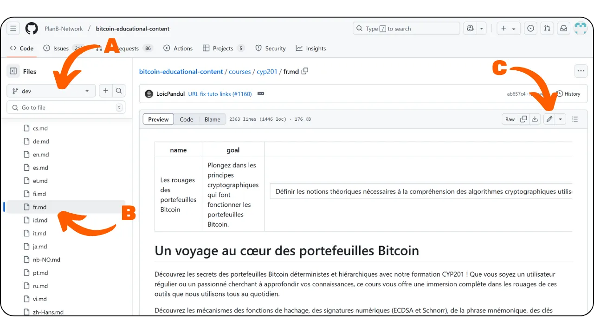
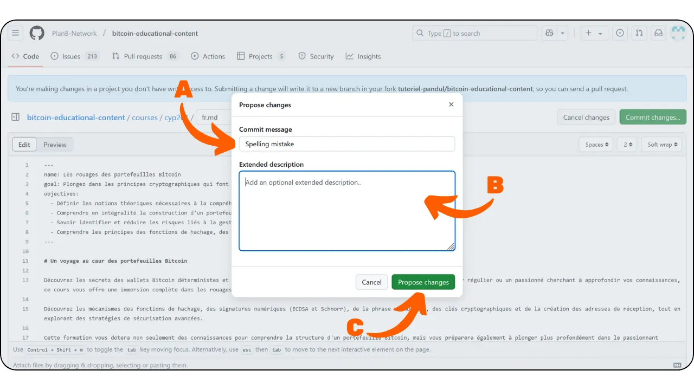
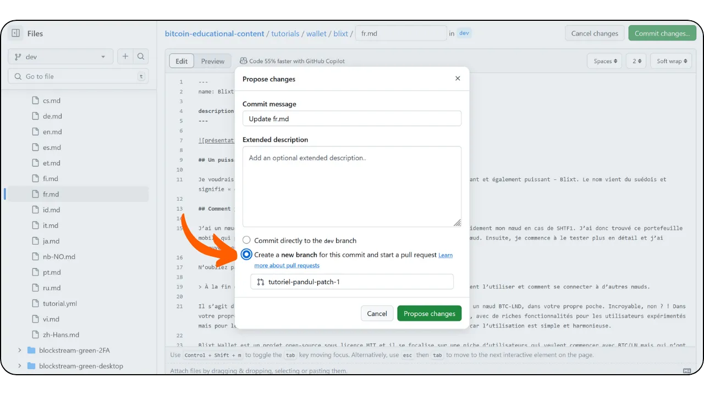

## Yhteenveto

Jos haluat osallistua Plan ₿ Networkin sisällön tarkistamiseen ja korjaamiseen, liity [Telegram-ryhmäämme](https://t.me/PlanBNetwork_ContentBuilder), joka on omistettu osallistumiselle. Esittele itsesi lyhyesti ja määrittele sitten sisältö, jota haluat tarkistaa, sekä kieli. Tee korjaukset työhaaraan ja lähetä PR, kun tarkistuksesi on valmis.

Jos et ymmärtänyt yllä olevaa kohtaa, älä huoli - tämä ohje on sinua varten!

---
## Mikä on Plan ₿ Network?

Plan ₿ Network on foorumi, jossa voi oppia Bitcoinista lukuisilla kursseilla ja opetusohjelmilla kaikille. Tällä hetkellä kaikki sisältömme on avointa lähdekoodia, sitä ylläpidetään GitHub-tietovarastossa ja se on avoinna tarkistuksille ja sisällön luomiselle.

Plan ₿ Networkin tavoitteena on tulla Bitcoin-verkkoavaruuden julkiseksi aukioksi, joka yhdistää ja kannustaa Bitcoin-yhteisöjä maailmanlaajuisesti.

## Miksi osallistua?

Plan ₿ Network on pohjimmiltaan monikielinen, sillä tavoitteenamme on tuoda Bitcoin-resurssit kaikkien ulottuville maailmanlaajuisesti. Uskomme, että kieli ei saisi olla esteenä suvereenille rahalle.

Tämän saavuttamiseksi käytämme Human x AI -lähestymistapaa. [Ohjelmamme] (https://github.com/Asi0Flammeus/LLM-Translator) avulla voimme kääntää sisällön automaattisesti monille kielille. Tarvitsemme kuitenkin sujuvan puhujan tarkistamaan sen, jotta voimme varmistaa, että sisältö on ymmärrettävää ja ettei siinä ole sopimattomia termejä.

Jos haluat auttaa rakentamaan tätä koulutushanketta Bitcoin-koulutuksen edistämiseksi yhteisössänne, voit aloittaa tarkistamalla kurssin tai opetusohjelman.

Lisäksi, koska arvostamme *Value4Value*-mallia, palkitsemme arvosteluista. Palkkio perustuu sisällön pituuteen, automaattisen käännöksen kielelliseen tarkkuuteen ja sisällön vaikeusasteeseen.

## Pitääkö minun tietää, miten GitHub toimii?

Sinun ei tarvitse olla GitHub-asiantuntija arvioidaksesi sisältöä. Vaikka on aina parempi ymmärtää, mitä on tekemässä (ja miksi), voit yksinkertaisesti seurata alla olevia ohjeita osallistuaksesi.

Jos Git ja GitHub eivät kuitenkaan ole sinulle tuttuja ja haluat oppia lisää, voit tutustua näitä työkaluja käsittelevään johdantoartikkeliin:

https://planb.network/tutorials/others/contribution/create-github-account-a75fc39d-f0d0-44dc-9cd5-cd94aee0c07c
## 1. Luo tili

- Luo tili [GitHubissa](https://github.com/) aloittaaksesi osallistumisen. Jos haluat ohjeita GitHub-tilin luomiseen, meillä on myös yksityiskohtainen ohje:

https://planb.network/tutorials/others/contribution/create-github-account-a75fc39d-f0d0-44dc-9cd5-cd94aee0c07c

- Tarvitset myös tilin viestisovellukseen [Telegram](https://telegram.org/).

## 2. Liity Telegram-ryhmään

- Liity [PBN Content Builder -ryhmään](https://t.me/PlanBNetwork_ContentBuilder) Telegramissa.

- Esittele itsesi lyhyesti ja määrittele sisältö, johon haluat osallistua, sekä kieli viestissä, joka lähetetään kanavalle "Yleistä".
- Tiimin jäsen luo sitten GitHubiin ongelman tulevaa panostasi varten. Löydät sieltä kaikki tarvittavat tiedot arvostelusi aloittamiseen.

## 3. Tarkastele ja muokkaa sisältöä GitHubin käyttöliittymän kautta

- Kysymys sisältää kuvauksen (vrt. \**A\**), jossa on linkit alkuperäiseen sisältöön ja tarkistettavaan tiedostoon.
- Jos haluat ottaa tarkastuksen vastuullesi, jätä kommentti asiaan (vrt. \**B\**) ilmoittaaksesi, että aiot työskennellä sen parissa. Näin vältytään päällekkäisiltä ponnisteluilta.
- Napsauta tarkistettavan tiedoston vieressä olevaa linkkiä (vrt. \**C\**) päästäksesi sisältöön.

- Voit nyt tarkastella tarkistettavan tiedoston GitHub-käyttöliittymää.
- Vasemmanpuoleisessa paneelissa voit selata haaraa (vrt. \**A\**) ja tiedostoja (vrt. \**B\**).
- Aloita tarkistaminen napsauttamalla kynäkuvaketta (ks. \**C\**).

- Jos tämä on ensimmäinen osallistumisesi, GitHub pyytää sinua haarukoimaan lähdekoodivaraston. Napsauta vain painiketta.

- Tämän jälkeen pääset editorin käyttöliittymään (vrt. \**A\**), jossa näet tiedostopolun ja vastaavan haaran (vrt. \**B\**) ja voit vaihtaa muokkaus- ja esikatselutilan välillä (vrt. \**C\**).

HUOM. On suositeltavaa tarkistaa koodi-ikkunassa, jolloin alkuperäinen sisältö näkyy erillisessä ikkunassa. Voit tarkastella tekstiä esimerkiksi Plan ₿ Network -verkkosivustolla tai GitHubin esikatselussa selaimen välilehdellä. Käytä `ctrl + F` löytääksesi virheet ja tehdäksesi korjauksia koodinäkymässä työn edetessä.

## 4. Sitoumusmuutokset

- Voit aloittaa sisällön tarkistamisen ja korjaamisen tarpeen mukaan.
- Kun haluat keskeyttää istunnon, voit sitoa muutokset, vaikka tarkastelu ei olisikaan vielä valmis. Se on kuin tallentaisi edistymisesi GitHubiin.
- Napsauta "Commit Changes..." -painiketta.

- Lisää kuvaileva viesti muutoksistasi (vrt. \**A\**).
- Lisää tarvittaessa lisää asiayhteyttä kuvaukseen (vrt. \**B\**).
- Napsauta "Ehdota muutoksia" -painiketta (ks. \**C\**).

- Jos tämä ei ole ensimmäinen osallistumisesi, GitHub pyytää sinua luomaan uuden haaran. Sinun ei koskaan pitäisi tehdä toimitusta suoraan päähaaraan `dev`. Jos olet jo tehnyt muutoksia olemassa olevaan työhaaraan, valitse tämä haara. Muussa tapauksessa voit luoda uuden haaran valitsemalla "Luo uusi haara".

- Tämän jälkeen pääset sivulle, jossa on yhteenveto kaikista muutoksistasi. Selaamalla sitä voit nähdä tarkat muutokset: poistetut kohteet näkyvät punaisella ja lisätyt kohteet vihreällä.

- Jos et ole saanut tarkistusta valmiiksi ja haluat jatkaa työtäsi myöhemmin, voit yksinkertaisesti poistua.
- Kun olet tehnyt muutokset, ne tallentuvat GitHub-haarukkaan.
- Jos haluat jatkaa työtäsi, siirry GitHub-profiilisi kautta Plan ₿ Network -sisältöarkiston haaraan.

- Valitse haara, joka sisältää edistymisesi (vrt. \**A\**), etsi sisältötiedostosi (vrt. \**B\**) ja jatka tarkistusta napsauttamalla kynäkuvaketta.

## 5. Luo PR omaan haaraan

- Jos kaikki näyttää hyvältä ja olet saanut muutokset valmiiksi, napsauta vihreää "Create Pull Request" -painiketta.

- Tämän jälkeen pääset PR-sivulle. Pull Request on pyyntö lähettää etätietovaraston haaraan tehdyt muutokset tarkistettavaksi ja mahdollisesti yhdistettäväksi päähaaraan.
- Lisää PR:ään otsikko ja lyhyt kuvaus. Otsikon tulisi vastata asiaa, jonka parissa työskentelet. Jos esimerkiksi numeron otsikko on `[KÄÄNTÖ] Kurssi CYP201 - FR`, käytä samaa otsikkoa PR:ssäsi (vrt. \**A\**). Mainitse kuvauksessa aiheeseen liittyvä kysymys käyttämällä sen numeroa, jota edeltää "Sulkeutuu". Tämä sulkee ongelman automaattisesti, kun PR on yhdistetty (vrt. \**B\**).
- Jos kaikki näyttää hyvältä, napsauta vihreää "Create Pull Request" -painiketta (vrt. \**C\**).

## 6. Säännöt, joita noudattaa sisällön oikoluvussa

- Ennen uuden oikoluvun aloittamista ilmoita siitä [Telegram-ryhmässä](https://t.me/PlanBNetwork_ContentBuilder) tai kerro Plan ₿ Network -koordinaattorillesi. He avaavat [issue](https://docs.github.com/en/issues/tracking-your-work-with-issues/about-issues), jossa voit kommentoida, että aloitat työn.
- On tärkeää tarkistaa aina kurssin/tutorialin alkuperäinen englanninkielinen (tai ranskankielinen) versio oikoluvun aikana. Älä epäröi tehdä säätöjä sujuvuuden parantamiseksi, mutta älä muuta alkuperäistä yleistä merkitystä.
- LLM-työkalut voivat kääntää joitakin Bitcoinin kanssa liittyviä sanoja kirjaimellisesti, kuten Lightning Network, joka muuttuisi suomeksi "Salamaverkoksi". Tällaisissa tapauksissa on suositeltavaa käyttää alkuperäistä englanninkielistä sanaa paremman selkeyden vuoksi, ellei kielesi säännöt vaadi kääntämään jokaista sanaa.
- Jos löydät lainauksia, varmista, että teet tutkimusta verkossa löytääksesi oikean käännöksen omassa kielessäsi.
- ÄLÄ käännä tekstin alussa olevia staattisia sanoja, joita käytetään sen sisällön kuvaamiseen: "name", "description", "objectives".
- Jos löydät tekstistä "Plan ₿ Network", jätä se tähän alkuperäiseen muotoon. Älä käännä sanaa "plan" tai sanaa "network". Lisäksi ÄLÄ käytä artikkelia, kun esittelet Plan ₿ Networkia, ja pidä sitä brändinä. Sama pätee "₿-CERT", "BIZ SCHOOL", "TECH SCHOOL", jotka tulisi myös säilyttää alkuperäisessä muodossa.
- Kiinnitä huomiota outoon välimerkkikäyttöön, kuten '\*\*\', joka saattaa edustaa huonoa rasvasymbolin ** renderointia. Tarkista aina alkuperäinen englanninkielinen teksti nähdäksesi, onko rasvaista tekstiä tarkoitus olla. Yleisesti ottaen rasvaisen tekstin renderoimiseksi lisää kaksi tähteä ** sekä sanan/lauseen eteen että taakse. Lisätietoja markdown-kielestä löydät [täältä](https://www.markdownguide.org/basic-syntax/).
- Kun olet saanut oikoluvun päätökseen, voit palata koordinaattorin avaamaan alkuperäiseen issueen, kommentoida "Proofreading done" ja liittää sinne PR-linkkisi.

## 7. Odota arviointia

- Onneksi olkoon, PR-työsi on toimitettu! Voit seurata sen edistymistä "Pull requests" -välilehdellä [Plan ₿ Network's GitHub repository](https://github.com/PlanB-Network/bitcoin-educational-content/pulls):

- Kiitos paljon panoksestanne! Hyväksymisen jälkeen Plan ₿ Network -tiimin jäsen ottaa sinuun yhteyttä palkkiosi lähettämiseksi. \**Maksut suoritetaan yksinomaan Lightning Networkin kautta\**.
- Jos haluat aloittaa alusta, palaa vaiheeseen 2 ja lähetä uusi viesti Telegram-ryhmässä jatkaaksesi osallistumista muuhun sisältöön. Muista synkronoida haarasi ennen uuden työhaaran luomista. Tee tämä menemällä haarasi etusivulle, valitsemalla päähaara nimeltä `dev` (vrt. \**A\**) ja napsauttamalla sitten "Synkronoi haarasi" -painiketta (vrt. \**B\**). Jos haaraasi on saatavilla päivityksiä, "Päivitä haara" -painike tulee näkyviin. Napsauta sitä suorittaaksesi päivityksen.

- Jos sinulla on huomautuksia, kysymyksiä tai kommentteja tästä projektista, voit lähettää DM:n [osallistujien Telegram-ryhmään](https://t.me/PlanBNetwork_ContentBuilder).
