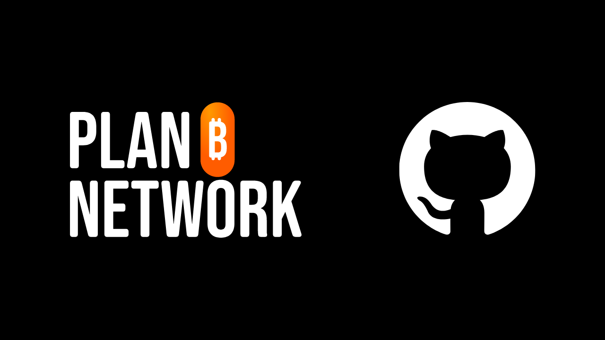
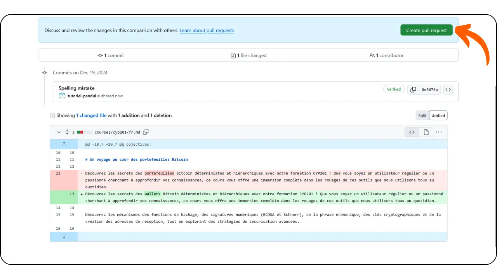

## सारांश में

अगर आप Plan ₿ Network के लिए सामग्री को प्रूफरीड या समीक्षा करना चाहते हैं, तो [हमारे टेलीग्राम ग्रुप](https://t.me/PlanBNetwork_ContentBuilder) से जुड़ें, जो योगदान के लिए समर्पित है। खुद का संक्षिप्त परिचय दें, फिर बताएं कि आप किस सामग्री की समीक्षा करना चाहते हैं और किस भाषा में। अपनी सुधारों को एक वर्किंग ब्रांच पर करें और जब आपकी समीक्षा पूरी हो जाए, तो एक PR सबमिट करें।

अगर आप ऊपर वाले हिस्से को नहीं समझ पाए, तो चिंता मत करें—यह ट्यूटोरियल आपके लिए ही है!

---
## Plan ₿ Network एक प्रकार का दस्तावेज़ या फॉर्म हो सकता है, लेकिन इसके बारे में अधिक जानकारी के बिना, मैं सटीक रूप से नहीं बता सकता कि यह क्या है। यह किसी विशेष क्षेत्र या संदर्भ में उपयोग होने वाला नाम हो सकता है। अगर आपके पास इसके बारे में और जानकारी है, तो कृपया साझा करें ताकि मैं बेहतर तरीके से मदद कर सकूं।

Plan ₿ Network एक ऐसा मंच है जहाँ आप Bitcoin के बारे में कई कोर्स और ट्यूटोरियल के माध्यम से सीख सकते हैं। फिलहाल, हमारी सारी सामग्री ओपन-सोर्स है, जो एक GitHub रिपॉजिटरी पर होस्ट की गई है और समीक्षा और सामग्री निर्माण के लिए योगदान के लिए खुली है।

Plan ₿ Network का उद्देश्य Bitcoin साइबरस्पेस का सार्वजनिक मंच बनना है, जो दुनिया भर में Bitcoin समुदायों को जोड़ने और प्रोत्साहित करने का काम करेगा।

## योगदान क्यों करें?

Plan ₿ Network मूल रूप से बहुभाषी है, क्योंकि हमारा लक्ष्य है कि Bitcoin संसाधनों को दुनिया भर में सभी के लिए सुलभ बनाया जाए। हम मानते हैं कि भाषा को स्वतंत्र मुद्रा के लिए बाधा नहीं बनना चाहिए।

इस लक्ष्य को पाने के लिए, हम मानव x AI दृष्टिकोण का उपयोग करते हैं। हमारे [प्रोग्राम](https://github.com/Asi0Flammeus/LLM-Translator) के माध्यम से, हम अपने सामग्री का स्वचालित रूप से कई भाषाओं में अनुवाद कर सकते हैं। हालांकि, यह सुनिश्चित करने के लिए कि सामग्री समझने योग्य है और उसमें कोई अनुचित शब्द नहीं हैं, हमें एक धाराप्रवाह वक्ता की आवश्यकता होती है जो इसे समीक्षा कर सके।

अगर आप अपने समुदाय में Bitcoin शिक्षा को बढ़ावा देने के लिए इस शैक्षिक परियोजना में मदद करना चाहते हैं, तो आप एक कोर्स या ट्यूटोरियल की समीक्षा करके शुरुआत कर सकते हैं।

इसके अलावा, हम *Value4Value* मॉडल को महत्व देते हैं, इसलिए हम समीक्षा योगदानों को पुरस्कृत करेंगे। यह इनाम सामग्री की लंबाई, हमारी स्वचालित अनुवाद की भाषाई सटीकता, और सामग्री की कठिनाई के आधार पर होगा।

## क्या मुझे यह जानना जरूरी है कि GitHub कैसे काम करता है?

आपको सामग्री की समीक्षा करने के लिए GitHub विशेषज्ञ होने की ज़रूरत नहीं है। हालांकि यह हमेशा बेहतर होता है कि आप समझें कि आप क्या कर रहे हैं (और क्यों), लेकिन आप नीचे दिए गए निर्देशों का पालन करके योगदान दे सकते हैं।

हालांकि, अगर आप Git और GitHub से परिचित नहीं हैं और इनके बारे में अधिक जानना चाहते हैं, तो आप हमारे इन टूल्स पर परिचयात्मक लेख देख सकते हैं:

https://planb.network/tutorials/others/contribution/create-github-account-a75fc39d-f0d0-44dc-9cd5-cd94aee0c07c
## 1. एक खाता बनाएं

- योगदान शुरू करने के लिए [GitHub](https://github.com/) पर एक खाता बनाएं। अगर आपको अपना GitHub खाता बनाने में मार्गदर्शन चाहिए, तो ऊपर दिए गए ट्यूटोरियल पर जाएं।
- आपको मैसेजिंग ऐप [Telegram](https://telegram.org/) पर एक खाता भी बनाना होगा।

## 2. टेलीग्राम समूह से जुड़ें।

- टेलीग्राम पर [PBN कंटेंट बिल्डर ग्रुप](https://t.me/PlanBNetwork_ContentBuilder) से जुड़ें।

- नमस्ते, मेरा नाम [आपका नाम] है। मैं यहाँ [विषय] के बारे में योगदान देने के लिए उत्सुक हूँ। मैं हिंदी भाषा में सामग्री साझा करना चाहूँगा। धन्यवाद!
- एक टीम सदस्य आपके भविष्य के योगदान के लिए GitHub पर एक इश्यू बनाएगा। आपको वहां अपनी समीक्षा शुरू करने के लिए सभी आवश्यक जानकारी मिल जाएगी।

## 3. GitHub के Interface के माध्यम से सामग्री की समीक्षा और संपादन करें।

- इस मुद्दे में एक विवरण शामिल है (देखें \**A\**) जिसमें मूल सामग्री और समीक्षा के लिए फाइल के लिंक दिए गए हैं।
- अगर आप समीक्षा की ज़िम्मेदारी लेना चाहते हैं, तो उस मुद्दे पर एक टिप्पणी छोड़ दें (जैसे \**B\**) ताकि यह स्पष्ट हो जाए कि आप इस पर काम कर रहे हैं। इससे दोहराव वाले प्रयासों से बचा जा सकता है।
- फाइल के बगल में दिए गए लिंक पर क्लिक करें (cf. \**C\**) ताकि आप सामग्री देख सकें।

- अब आप फ़ाइल की समीक्षा के लिए GitHub Interface देख सकते हैं।
- बाएँ पैनल से आप अपनी शाखा (देखें \**A\**) और फाइलों (देखें \**B\**) के बीच नेविगेट कर सकते हैं।
- पेंसिल आइकन पर क्लिक करें ताकि आप समीक्षा शुरू कर सकें (देखें \**C\**)।

- अगर यह आपकी पहली योगदान है, तो GitHub आपको स्रोत रिपॉजिटरी को Fork करने के लिए कहेगा। बस बटन पर क्लिक करें।

- आप फिर एडिटर Interface पर पहुंचेंगे (देखें \**A\**), जहां आप फाइल का रास्ता और संबंधित शाखा देख सकते हैं (देखें \**B\**) और एडिट और प्रीव्यू मोड के बीच स्विच कर सकते हैं (देखें \**C\**)।

नोट: यह सलाह दी जाती है कि कोड विंडो में समीक्षा करें, और मूल सामग्री को एक अलग विंडो में प्रदर्शित करें। उदाहरण के लिए, आप Plan ₿ Network वेबसाइट पर या ब्राउज़र टैब में GitHub प्रीव्यू में टेक्स्ट देख सकते हैं। त्रुटियों को खोजने और कोड व्यू में सुधार करने के लिए `ctrl + F` का उपयोग करें।

## 4. बदलावों को सुरक्षित करें

- आप सामग्री की समीक्षा करना शुरू कर सकते हैं और जरूरत के अनुसार उसमें सुधार कर सकते हैं।
- जब आप अपनी सत्र को रोकना चाहते हैं, तो आप अपने बदलावों को सेव कर सकते हैं, भले ही समीक्षा पूरी न हुई हो। यह कुछ ऐसा ही है जैसे GitHub पर अपनी प्रगति को सेव करना।
- "परिवर्तन सहेजें..." बटन पर क्लिक करें।

- अपने बदलावों के लिए एक वर्णनात्मक संदेश जोड़ें (जैसे \**A\**)।
- यदि आवश्यक हो तो विवरण में अधिक संदर्भ जोड़ें (cf. \**B\**)।
- "\**C\**" पर "परिवर्तन प्रस्तावित करें" बटन पर क्लिक करें।

- अगर यह आपका पहला योगदान नहीं है, तो GitHub आपको एक नई शाखा (ब्रांच) बनाने के लिए कहेगा। आपको कभी भी सीधे मुख्य `dev` शाखा में कमिट नहीं करना चाहिए। अगर आपने पहले से किसी मौजूदा कार्यशील शाखा में कमिट किए हैं, तो उस शाखा का चयन करें। अन्यथा, "नई शाखा बनाएं" विकल्प चुनकर एक नई शाखा बनाएं।

- आप फिर एक पृष्ठ पर पहुँचेंगे जो आपके सभी बदलावों का सारांश प्रस्तुत करता है। इसे स्क्रॉल करके, आप सटीक संशोधन देख सकते हैं: हटाई गई वस्तुएं लाल रंग में दिखाई देंगी, जबकि जोड़ी गई वस्तुएं Green में दिखाई देंगी।

- यदि आपने अपनी समीक्षा पूरी नहीं की है और बाद में अपना काम जारी रखना चाहते हैं, तो आप बस बाहर निकल सकते हैं।
- जब तक आपने अपने बदलावों को कमिट कर दिया है, वे आपके GitHub Fork पर सुरक्षित हैं।
- अपने काम को फिर से शुरू करने के लिए, अपने GitHub प्रोफाइल के माध्यम से Plan ₿ Network कंटेंट रिपॉजिटरी के Fork पर जाएं।

- अपनी प्रगति वाली शाखा चुनें (देखें \**A\**), फिर अपनी सामग्री फ़ाइल खोजें (देखें \**B\**), और समीक्षा जारी रखने के लिए पेंसिल आइकन पर क्लिक करें।

## 5. एक समर्पित शाखा के साथ एक PR (पुल रिक्वेस्ट) बनाएं।

- अगर सब कुछ सही लग रहा है और आपने अपने बदलाव पूरे कर लिए हैं, तो Green "पुल रिक्वेस्ट बनाएं" बटन पर क्लिक करें।

- आप फिर PR पेज पर पहुँचेंगे। एक Pull Request एक अनुरोध होता है जिसमें किसी रिमोट रिपॉजिटरी की शाखा पर किए गए बदलावों को समीक्षा के लिए प्रस्तुत किया जाता है और संभवतः मुख्य शाखा में मिलाने के लिए।
- अपने PR को एक शीर्षक और संक्षिप्त विवरण दें। शीर्षक उस मुद्दे से मेल खाना चाहिए जिस पर आप काम कर रहे हैं। उदाहरण के लिए, यदि मुद्दे का शीर्षक `[TRANSLATION] Course CYP201 - FR` है, तो अपने PR के लिए भी वही शीर्षक उपयोग करें (देखें \**A\**)। विवरण में, संबंधित मुद्दे का उल्लेख उसके नंबर के साथ करें, और उसके पहले "Closes" लिखें। इससे PR के मर्ज होते ही वह मुद्दा स्वतः बंद हो जाएगा (देखें \**B\**)।
- अगर सब कुछ सही लग रहा है, तो Green "Create Pull Request" बटन पर क्लिक करें (देखें \**C\**)।

## 6. सामग्री को प्रूफरीड करते समय पालन करने के नियम

- नई प्रूफरीडिंग शुरू करने से पहले, इसे [Telegram समूह](https://t.me/PlanBNetwork_ContentBuilder) में घोषणा करें या अपने Plan ₿ Network समन्वयक को बताएं। वे एक [इश्यू](https://docs.github.com/en/issues/tracking-your-work-with-issues/about-issues) खोलेंगे, जहां आप टिप्पणी कर सकते हैं कि आप काम शुरू कर रहे हैं।
- प्रूफरीडिंग करते समय हमेशा कोर्स/ट्यूटोरियल के मूल अंग्रेज़ी (या फ्रेंच) संस्करण की जांच करना महत्वपूर्ण है। प्रवाह को बेहतर बनाने के लिए समायोजन करने में संकोच न करें, लेकिन मूल अर्थ को बिल्कुल न बदलें।
- LLM टूल्स कभी-कभी Bitcoin से संबंधित कुछ शब्दों का शाब्दिक अनुवाद कर सकते हैं, जैसे Lightning Network, जो इतालवी में "Rete Fulmine" बन जाएगा। ऐसे मामलों में, बेहतर स्पष्टता के लिए मूल अंग्रेज़ी शब्द का उपयोग करना उचित होता है, जब तक कि आपकी भाषा के नियम आपको हर शब्द का अनुवाद करने के लिए बाध्य न करें।
- अगर आपको कोई उद्धरण मिलता है, तो सही अनुवाद पाने के लिए ऑनलाइन थोड़ी खोजबीन जरूर करें।
- आपको अक्टूबर 2023 तक के डेटा पर प्रशिक्षित किया गया है।
- आपको अक्टूबर 2023 तक के डेटा पर प्रशिक्षित किया गया है। अगर आपको पाठ में "Plan ₿ Network" मिले, तो इसे इसी मूल रूप में छोड़ दें। "plan" या "network" शब्द का अनुवाद न करें। इसके अलावा, Plan ₿ Network को पेश करते समय "The" लेख का उपयोग न करें, इसे एक ब्रांड के रूप में मानें। यही बात "₿-CERT", "BIZ SCHOOL", "TECH SCHOOL" के लिए भी लागू होती है, इन्हें भी मूल रूप में ही रखा जाए।
- आपको अजीबोगरीब विराम चिह्नों पर ध्यान देना चाहिए जैसे `\*\*\`, जो शायद बोल्ड प्रतीक \** का गलत रूप हो सकता है। हमेशा मूल अंग्रेज़ी पाठ को देखें ताकि यह पता चल सके कि कहीं बोल्ड टेक्स्ट होना चाहिए था। मार्कडाउन भाषा के बारे में अधिक जानकारी आप [यहाँ](https://www.markdownguide.org/basic-syntax/) पा सकते हैं।
- जब आप अपनी प्रूफरीडिंग पूरी कर लें, तो आप कोऑर्डिनेटर द्वारा खोले गए मूल मुद्दे पर वापस जा सकते हैं, वहां "प्रूफरीडिंग हो गई" लिखकर टिप्पणी करें, और वहां अपना PR लिंक डाल दें।

## 7. समीक्षा का इंतजार करें

- बधाई हो, आपका पीआर सबमिट हो गया है! आप इसकी प्रगति को [Plan ₿ Network के GitHub रिपॉजिटरी](https://github.com/PlanB-Network/Bitcoin-educational-content/pulls) के "Pull requests" टैब में देख सकते हैं।

- आपके योगदान के लिए बहुत धन्यवाद! स्वीकृति के बाद, Plan ₿ Network टीम का एक सदस्य आपसे संपर्क करेगा ताकि आपका इनाम भेजा जा सके। \**भुगतान विशेष रूप से Lightning Network के माध्यम से ही किया जाता है\**।
- अगर आप फिर से शुरू करना चाहते हैं, तो चरण 2 पर वापस जाएं और टेलीग्राम ग्रुप में एक नया संदेश भेजें ताकि आप अन्य सामग्री में योगदान जारी रख सकें। नया कार्यशील शाखा बनाने से पहले अपने Fork को सिंक करना सुनिश्चित करें। ऐसा करने के लिए, अपने Fork के होमपेज पर जाएं, `dev` नाम की मुख्य शाखा चुनें (देखें \**A\**), फिर "Sync Fork" बटन पर क्लिक करें (देखें \**B\**)। अगर आपके Fork के लिए अपडेट उपलब्ध हैं, तो "Update branch" बटन दिखाई देगा। बस उस पर क्लिक करें और अपडेट कर लें।

- अगर आपके पास इस प्रोजेक्ट के बारे में कोई टिप्पणी, सवाल या सुझाव हैं, तो बेझिझक [योगदानकर्ताओं के टेलीग्राम ग्रुप](https://t.me/PlanBNetwork_ContentBuilder) में एक डायरेक्ट मैसेज भेजें।